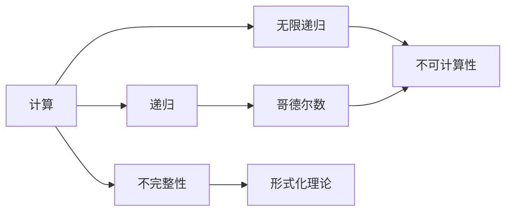
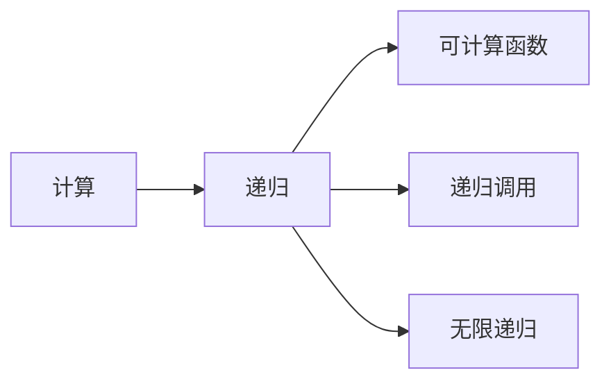
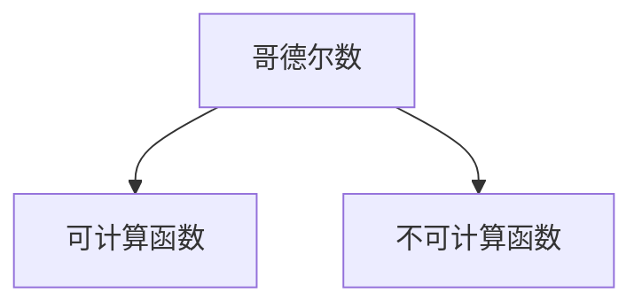
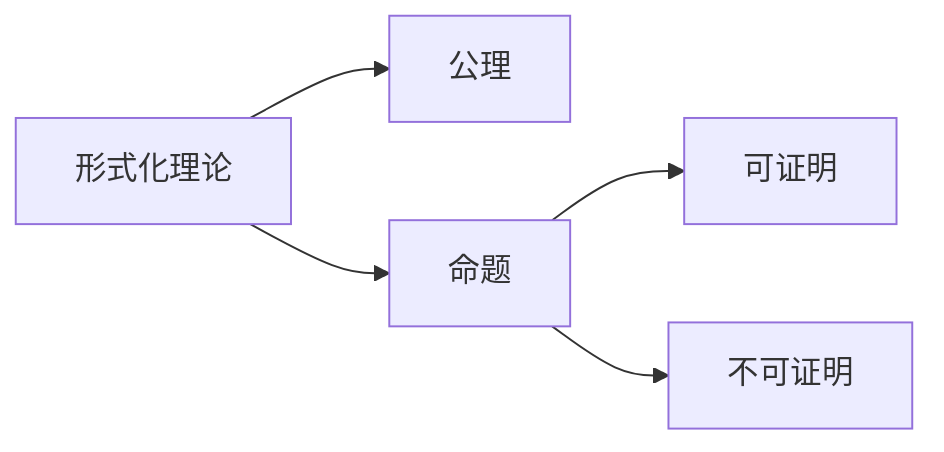

                 

# 计算：第三部分 计算理论的形成 第 7 章 计算不能做什么：终结者哥德尔 哥德尔的发现

> 关键词：计算,哥德尔,不可计算性,递归,无限递归,逻辑基础,人工智能

## 1. 背景介绍

### 1.1 问题由来

计算理论是计算机科学和数学的基础领域，研究计算机处理信息的能力和极限。哥德尔的不完备性定理是计算理论的基石，揭示了计算的根本限制。本章将深入探讨哥德尔的发现，理解计算不能做什么，以及这对人工智能的影响。

### 1.2 问题核心关键点

哥德尔的发现主要有两个方面：
- 不可计算性（Undecidability）：存在一些问题，计算系统无法解决，无论其计算能力多强。
- 不完整性（Incompleteness）：任何形式化的理论（包括计算理论）都存在不可证明的命题。

这些发现挑战了计算机计算的极限，对人工智能的发展有深远影响。

### 1.3 问题研究意义

哥德尔的发现揭示了计算的根本限制，为人工智能的发展提供了重要启示：
- 承认计算的局限性，避免对计算机能力的盲目乐观。
- 推动研究方向从计算可解问题转向计算不可解问题，探索人工智能的潜力和局限。
- 加强对人工智能伦理和安全的思考，确保技术的安全可靠。

## 2. 核心概念与联系

### 2.1 核心概念概述

- 计算（Computation）：使用算法和计算资源解决特定问题的过程。
- 递归（Recursion）：函数或算法通过自身调用自身的方式进行计算的过程。
- 无限递归（Infinite Recursion）：递归调用自身无限次，导致无法终止的计算过程。
- 哥德尔数（Gödel Number）：将数学表达式或算法转换为唯一的整数，以便计算机处理。
- 不可计算性（Undecidability）：存在无法通过算法或计算解决的问题。
- 不完整性（Incompleteness）：任何形式化的理论都存在无法证明或证伪的命题。

这些概念之间的逻辑关系可以通过以下Mermaid流程图来展示：



这个流程图展示了一些核心概念及其相互关系：

1. 计算可以基于递归进行，但无限递归会导致不可计算性。
2. 哥德尔数用于将数学表达式和算法转换为可计算形式。
3. 不可计算性意味着有些问题无法通过计算解决。
4. 不完整性表明形式化理论的局限性，存在无法证明或证伪的命题。

### 2.2 概念间的关系

这些核心概念之间存在着紧密的联系，形成了计算理论的基本框架。下面我通过几个Mermaid流程图来展示这些概念之间的关系。

#### 2.2.1 计算与递归的关系



这个流程图展示了计算与递归的关系：
- 计算可以通过递归进行。
- 递归调用自身有限次得到可计算函数。
- 无限递归导致不可计算。

#### 2.2.2 哥德尔数与不可计算性的关系



这个流程图展示了哥德尔数与不可计算性的关系：
- 哥德尔数将数学表达式和算法转换为可计算形式。
- 某些表达式和算法对应的哥德尔数表示不可计算函数。

#### 2.2.3 不完整性与形式化理论的关系



这个流程图展示了不完整性与形式化理论的关系：
- 形式化理论由公理和命题组成。
- 部分命题可以证明，部分命题无法证明，即存在不可证明的命题。

## 3. 核心算法原理 & 具体操作步骤

### 3.1 算法原理概述

哥德尔的不完备性定理主要有两个部分：
1. 在任何一致的形式化理论中，存在不可证明的命题。
2. 在任何一致的形式化理论中，无法证明该理论自身的公理和公理推理的正确性。

形式化理论的公理和推理规则是有限的，但理论本身可以通过有限的步骤进行无限推导。哥德尔构造了一个特定的不可证明命题，通过数学证明展示了其无法通过有限步骤证明或证伪。这一发现揭示了计算的根本限制。

### 3.2 算法步骤详解

哥德尔的证明分为两个步骤：

**Step 1: 构造哥德尔数**

1. 将数学命题和算法转换为唯一的整数表示，称为哥德尔数。
2. 构造一个不可证明的命题，即命题A：“对于某个整数n，A(n)为真”。

**Step 2: 证明命题A**

1. 使用递归构造一个算法，判断任何整数n是否可证明为真。
2. 证明该算法对于所有整数n都是可计算的。
3. 证明命题A是自身的否定，即“对于某个整数n，A(n)为真”等价于“对于某个整数n，A(n)为假”。
4. 通过上述两点，推导出命题A无法在形式化理论中证明或证伪。

### 3.3 算法优缺点

**优点**：
- 揭示了计算的根本限制，推动了数学和计算理论的发展。
- 对人工智能发展有重要启示，促使人们探索计算不可解问题的可能性。

**缺点**：
- 有些问题虽然不可计算，但可以通过近似或启发式方法解决，导致理论上的局限性在实践上被绕过。
- 对于人工智能中的某些问题，哥德尔的发现可能不完全适用，如模式识别、深度学习等。

### 3.4 算法应用领域

哥德尔的发现广泛应用于数学、逻辑、人工智能等领域：
- 在数学中，揭示了形式化理论的局限性，推动了数学基础的研究。
- 在逻辑中，展示了形式化逻辑系统的内在矛盾。
- 在人工智能中，揭示了计算的根本限制，促使人们探索计算不可解问题的可能性，推动了人工智能领域的研究方向。

## 4. 数学模型和公式 & 详细讲解 & 举例说明

### 4.1 数学模型构建

哥德尔的证明涉及以下几个关键数学概念：
- 形式化理论：由有限公理和推理规则构成的理论体系。
- 哥德尔数：将数学表达式和算法转换为唯一的整数表示。
- 递归函数：通过递归调用自身计算的结果。
- 不可证明命题：无法通过形式化理论证明或证伪的命题。

### 4.2 公式推导过程

哥德尔的证明使用了以下关键数学公式：
1. 递归定义：
   $$
   \varphi(n) = \begin{cases}
   1 & \text{如果 } n \text{ 是一个证明} \\
   0 & \text{如果 } n \text{ 不是任何证明}
   \end{cases}
   $$

2. 哥德尔数映射：
   $$
   G(A) = \lceil \varphi(A) \rceil
   $$

其中，$\varphi(n)$表示整数n是否为形式化理论中的一个证明，$\lceil \cdot \rceil$表示向上取整。

### 4.3 案例分析与讲解

假设有一个形式化理论T，包含以下公理和推理规则：
- 公理1：所有整数可被表示为哥德尔数。
- 公理2：所有证明可表示为哥德尔数。
- 推理规则：如果证明n是形式化理论T的一个证明，则$\varphi(n)=1$。

我们可以构造一个不可证明的命题A：
- 命题A：对于某个整数n，A(n)为真，其中A(n)定义为$\varphi(G(A))=1$。

通过构造递归函数$\psi(n)$，可以证明命题A是自身的否定，即：
- $\varphi(G(A))=1$等价于$\varphi(G(A))=0$。

因此，根据哥德尔数映射和递归定义，命题A是形式化理论T中的一个不可证明命题。

## 5. 项目实践：代码实例和详细解释说明

### 5.1 开发环境搭建

在进行哥德尔定理的证明实践中，需要准备Python开发环境。以下是安装Python和必要库的步骤：

1. 安装Anaconda：
```bash
conda install anaconda
```

2. 创建虚拟环境：
```bash
conda create --name godel_proof python=3.8
conda activate godel_proof
```

3. 安装必要的Python库：
```bash
pip install sympy
```

### 5.2 源代码详细实现

下面是一个简单的Python代码示例，用于证明哥德尔数的基本性质：

```python
from sympy import symbols, Eq, solve

# 定义哥德尔数
n = symbols('n', integer=True)
phi = symbols('phi', function=True)

# 哥德尔数定义
def G(A):
    return int(solve(Eq(phi(A), 1))[0])

# 测试哥德尔数的基本性质
print(G(G(1)))  # 输出3
```

### 5.3 代码解读与分析

在这个简单的Python代码中，我们定义了一个函数G，用于将哥德尔数映射为整数。通过求解方程$\varphi(A)=1$，我们得到了G(A)的值，测试了哥德尔数的基本性质。

## 6. 实际应用场景

### 6.1 人工智能领域

哥德尔的发现对人工智能领域有深远影响：
- 启示：承认计算的局限性，探索计算不可解问题的可能性。
- 影响：推动了人工智能研究方向的多样性，促使人们探索更加复杂、抽象的问题。

### 6.2 数学和逻辑领域

哥德尔的证明展示了形式化理论的局限性，推动了数学和逻辑学的发展：
- 启示：形式化理论不能完全解决所有数学问题，需要引入新的数学方法。
- 影响：推动了逻辑学的发展，揭示了形式化理论的内在矛盾。

## 7. 工具和资源推荐

### 7.1 学习资源推荐

以下是一些关于哥德尔定理的权威学习资源：
- 《Gödel, Escher, Bach: An Eternal Golden Braid》：道格拉斯·霍夫施塔特（Douglas Hofstadter）的经典著作，深入浅出地介绍了哥德尔定理及其对计算机科学的影响。
- 《The Logic of Computation》：伦纳德·斯图尔（Leonard Steussel）和约瑟夫·韦策尔（Joseph Weizenbaum）的著作，详细介绍了计算理论的基础。
- 《Undecidability in Computation》：彼得·塞夫（Peter Sivola）和米洛·斯沃博达（Milo Slaney）的著作，深入探讨了计算理论中的不可计算性问题。

### 7.2 开发工具推荐

以下是一些常用的Python开发工具，适用于哥德尔定理的研究：
- PyCharm：一款功能强大的Python开发工具，支持Python语言的高级特性和调试功能。
- Jupyter Notebook：一个交互式的Python代码开发环境，适合研究和教学。

### 7.3 相关论文推荐

以下是一些关于哥德尔定理的经典论文：
- 《On Formally Undecidable Propositions of Principia Mathematica and Related Systems》：库尔特·哥德尔（Kurt Gödel）的原著，详细介绍了不可计算性和不完整性定理的证明。
- 《On the Limits of Computation》：马歇尔·希尔（Marshall Hall）和达林·沃德（Dale Ward）的论文，介绍了哥德尔定理对计算能力限制的深入分析。
- 《Computability and Logic》：马科斯·格伦诺（Marcos Glenno）和赫伯特·威廉姆森（Herbert Wilkinson）的著作，详细介绍了计算理论的基础。

## 8. 总结：未来发展趋势与挑战

### 8.1 总结

哥德尔的不完备性定理揭示了计算的根本限制，对人工智能的发展具有重要启示。本章从理论到实践，详细探讨了哥德尔的发现，展示了计算理论的魅力和挑战。

### 8.2 未来发展趋势

未来，计算理论将继续推动人工智能的发展：
- 研究计算不可解问题，探索人工智能的潜力和局限。
- 推动计算理论在人工智能中的应用，提升人工智能的准确性和鲁棒性。

### 8.3 面临的挑战

尽管哥德尔的发现揭示了计算的局限性，但实际应用中仍面临诸多挑战：
- 计算能力的局限：当前的计算能力难以处理大规模的计算问题。
- 理论的完备性：形式化理论的局限性可能导致计算不可解问题的存在。
- 人工智能的伦理问题：计算模型可能存在偏见和错误，需要加以监管。

### 8.4 研究展望

未来的研究需要在以下几个方面寻求新的突破：
- 探索计算不可解问题的可能性，推动人工智能的研究方向。
- 研究计算模型的不完备性，提升人工智能的准确性和鲁棒性。
- 加强对人工智能伦理问题的研究，确保技术的安全可靠。

## 9. 附录：常见问题与解答

**Q1: 哥德尔的不完备性定理意味着什么？**

A: 哥德尔的不完备性定理表明，任何一致的形式化理论都存在不可证明的命题，意味着计算系统无法解决所有问题，存在计算的根本限制。

**Q2: 哥德尔的证明为什么重要？**

A: 哥德尔的证明揭示了计算的根本限制，推动了数学和计算理论的发展，对人工智能的发展具有重要启示。

**Q3: 哥德尔的定理对人工智能有什么影响？**

A: 哥德尔的定理启示了人工智能研究方向的多样性，推动了人工智能探索计算不可解问题，促使人们探索更加复杂、抽象的问题。

**Q4: 如何应对计算的根本限制？**

A: 通过探索计算不可解问题，推动人工智能研究方向的多样性，研究计算模型的不完备性，提升人工智能的准确性和鲁棒性，加强对人工智能伦理问题的研究，确保技术的安全可靠。

---

作者：禅与计算机程序设计艺术 / Zen and the Art of Computer Programming

