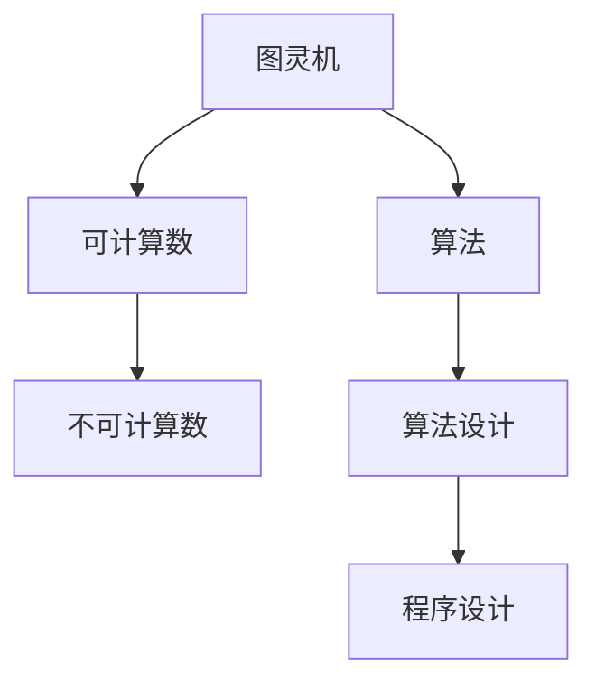

                 

# 计算：第三部分 计算理论的形成 第 8 章 计算理论的诞生：图灵的可计算数 图灵机

## 1. 背景介绍

计算理论是计算机科学的核心领域之一，其研究目的是理解哪些问题可以被计算，以及如何高效地进行计算。图灵机（Turing Machine，简称TM）是计算理论的基础模型，由英国数学家阿尔弗雷德·图灵在1936年提出，用于定义可计算数和不可计算数的概念，标志着计算理论的诞生。

### 1.1 图灵机模型的提出背景

图灵机的提出是为了解决当时被称为“希尔伯特第三问题”的数学难题，即是否所有的数学问题都可以通过有限的步骤来解决。在1930年代，希尔伯特与著名的数学家克莱因等在巴黎召开数学研讨会，邀请众多数学家讨论这一问题。会后，希尔伯特向与会者发出了一份声明，宣称所有数学问题都可以用有限的步骤解决，并且他的学生推动了一个广为人知的证明，声称数学的公理化证明了这一点。然而，图灵发现这种证明存在漏洞，他通过构建图灵机模型，证明存在不可计算的问题，即无法用有限的步骤解决的问题。这一发现彻底改变了数学界对计算问题的看法，也为计算机科学的崛起奠定了基础。

### 1.2 图灵机对计算理论的贡献

图灵机的提出不仅揭示了不可计算数的存在，还为后来的计算机科学提供了理论基础。图灵机模型为理解计算的本质提供了一个清晰的框架，展示了计算过程的基本结构。图灵机的概念被广泛应用于算法设计和程序设计中，成为计算理论研究的基础。

## 2. 核心概念与联系

### 2.1 核心概念概述

图灵机模型是一个形式化的计算模型，用于描述如何通过有限的步骤对一个输入字符串进行计算。图灵机由一个读写头、一个有限状态集、一个指令集和一个无限带组成。其中，读写头负责在带上的符号上读写操作，有限状态集表示图灵机当前的状态，指令集定义了读写头在各个状态下的操作，无限带表示输入的字符串。

图灵机的计算过程可以看作是执行一系列指令，读写头按照指令在带上移动，状态集随操作不断变化。最终，图灵机要么停止，要么进入一个无限循环。停止表示计算完成，输出结果；无限循环表示计算未完成。

图灵机模型的核心概念包括：
- 读写头（Head）：在带上的符号上读写操作，模拟了计算机的读写器。
- 有限状态集（States）：图灵机当前的状态，状态之间通过读写头的移动和指令执行切换。
- 指令集（Instructions）：定义了读写头在各个状态下的操作，包括读写、移动等基本操作。
- 无限带（Tape）：表示输入的字符串，图灵机在带上的移动模拟了计算机的内存。

### 2.2 概念间的关系

图灵机模型与计算理论的关系可以通过以下Mermaid流程图来展示：



这个流程图展示了图灵机与计算理论之间的联系：

- 图灵机定义了可计算数的概念，即所有可以通过有限步骤计算的问题。
- 可计算数与不可计算数相对立，所有不可计算数都是无法通过有限步骤计算的问题。
- 图灵机的计算过程可以映射为算法设计，即如何将问题分解为有限步骤的计算过程。
- 算法设计进一步指导程序设计，即如何将算法用编程语言实现。

## 3. 核心算法原理 & 具体操作步骤

### 3.1 算法原理概述

图灵机算法的基本原理是通过有限的步骤对输入字符串进行计算，最终输出结果或停止计算。图灵机模型的计算过程可以看作是一系列指令的执行，每个指令根据当前状态和读写头的状态决定下一步的操作，包括读写操作和移动操作。图灵机算法的设计和实现基于图灵机的有限状态集、指令集和无限带。

图灵机的计算步骤如下：
1. 初始化：设置读写头在带的最左侧，图灵机处于初始状态。
2. 读取：读写头从带的最左侧开始读取符号。
3. 执行指令：根据当前状态和读到的符号执行相应的指令。
4. 移动：读写头根据指令移动至新的位置。
5. 重复执行：步骤2-4循环执行，直到满足停止条件或进入无限循环。

### 3.2 算法步骤详解

以下是一个简单的图灵机算法步骤详解：

假设我们要计算一个二进制数的奇偶性，即判断该数是奇数还是偶数。图灵机的实现步骤如下：

1. **初始化**：设置读写头在带的最左侧，图灵机处于初始状态S0。

2. **读取**：读写头从带的最左侧开始读取符号。若读到'0'，表示当前数字是偶数，进入状态S1；若读到'1'，表示当前数字是奇数，进入状态S2。

3. **执行指令**：在状态S1中，若读到'0'，则将带上的'0'替换为'1'，表示当前数字是奇数，进入状态S3；若读到'1'，则将带上的'1'替换为'0'，表示当前数字是偶数，进入状态S4。在状态S2中，若读到'0'，则将带上的'0'替换为'1'，表示当前数字是奇数，进入状态S3；若读到'1'，则将带上的'1'替换为'0'，表示当前数字是偶数，进入状态S4。

4. **移动**：读写头向右移动一位，继续读取下一个符号。

5. **重复执行**：重复步骤2-4，直到读到带的最右侧或满足停止条件。

6. **停止**：当图灵机读到带的最右侧时，停止计算，输出结果为'奇'或'偶'。

### 3.3 算法优缺点

图灵机算法的优点包括：
- 通用性：图灵机模型适用于各种类型的计算问题，可以处理符号、数字、图像等多种输入类型。
- 形式化：图灵机提供了一种形式化的计算框架，便于研究和分析计算过程。
- 可扩展性：图灵机模型可以处理任意长度的输入，适用于大规模数据的计算。

图灵机算法的缺点包括：
- 无限带限制：图灵机的无限带模型在实际应用中可能无法完全实现，计算资源有限。
- 状态数限制：图灵机的状态集是有限的，某些复杂的计算过程可能需要更多状态才能完成。
- 计算效率：图灵机模型基于符号操作，计算效率可能不如硬件实现。

### 3.4 算法应用领域

图灵机算法广泛应用于计算机科学和工程中，以下是一些主要的应用领域：

- **算法设计**：图灵机模型为算法设计提供了一个形式化的框架，帮助开发人员设计高效的算法。
- **程序设计**：图灵机模型为程序设计提供了一种形式化的理解，帮助程序员理解算法的工作原理。
- **自动机理论**：图灵机模型是自动机理论的基础，用于研究自动机的行为和特性。
- **编译器设计**：图灵机模型用于设计编译器的语法分析和代码生成部分。
- **人工智能**：图灵机模型为人工智能的研究提供了形式化的工具，如推理机、规划器和决策树等。

## 4. 数学模型和公式 & 详细讲解 & 举例说明

### 4.1 数学模型构建

图灵机模型的数学模型可以通过形式化语言来描述，其中每个符号表示为$\Sigma$中的一个元素，状态集表示为$Q$，指令集表示为$\delta$，无限带表示为$T$。图灵机的计算过程可以表示为：

$$
\begin{aligned}
M &= (Q, \Sigma, \delta, T, q_0, F) \\
\delta: Q \times \Sigma \rightarrow Q \times \Sigma \times \{L, R\} \\
q_0 \in Q, F \subseteq Q
\end{aligned}
$$

其中：
- $Q$是有限状态集，$\Sigma$是符号集，$\delta$是状态转移函数，$T$是无限带，$q_0$是初始状态，$F$是最终状态集。

### 4.2 公式推导过程

图灵机算法的核心是状态转移函数$\delta$，它定义了图灵机在各个状态下的操作。假设当前状态为$q$，读到的符号为$s$，则状态转移函数$\delta(q,s)$返回一个新的状态$q'$、一个新符号$s'$和一个移动方向$D$，其中$D$可以是左移($L$)或右移($R$)。

以判断二进制数奇偶性的图灵机算法为例，状态转移函数可以定义为：

$$
\delta: Q \times \Sigma \rightarrow Q \times \Sigma \times \{L, R\}
$$

其中：
- $Q$为有限状态集，包含初始状态$S_0$、偶数状态$S_1$、奇数状态$S_2$、偶数输出状态$S_3$、奇数输出状态$S_4$。
- $\Sigma$为符号集，包含'0'和'1'。

状态转移函数的具体实现为：
- 初始状态$S_0$：读到'0'，进入偶数状态$S_1$，将'0'替换为'1'；读到'1'，进入奇数状态$S_2$，将'1'替换为'0'。
- 偶数状态$S_1$：读到'0'，进入偶数输出状态$S_3$，输出'偶'；读到'1'，进入奇数状态$S_2$，将'1'替换为'0'。
- 奇数状态$S_2$：读到'0'，进入偶数状态$S_1$，将'0'替换为'1'；读到'1'，进入奇数输出状态$S_4$，输出'奇'。
- 偶数输出状态$S_3$：读到'0'，进入偶数状态$S_1$，将'0'替换为'1'；读到'1'，进入奇数状态$S_2$，将'1'替换为'0'。
- 奇数输出状态$S_4$：读到'0'，进入偶数状态$S_1$，将'0'替换为'1'；读到'1'，进入奇数状态$S_2$，将'1'替换为'0'。

### 4.3 案例分析与讲解

假设我们要计算一个十进制数的质数性，即判断该数是否为质数。图灵机的实现步骤如下：

1. **初始化**：设置读写头在带的最左侧，图灵机处于初始状态S0。

2. **读取**：读写头从带的最左侧开始读取符号。若读到'1'，表示当前数字是质数，进入状态S1；若读到'0'，表示当前数字不是质数，进入状态S2。

3. **执行指令**：在状态S1中，若读到'0'，则将带上的'0'替换为'1'，表示当前数字不是质数，进入状态S3；若读到'1'，则将带上的'1'替换为'0'，表示当前数字是质数，进入状态S4。在状态S2中，若读到'1'，则将带上的'1'替换为'0'，表示当前数字不是质数，进入状态S3；若读到'0'，则将带上的'0'替换为'1'，表示当前数字是质数，进入状态S4。

4. **移动**：读写头向右移动一位，继续读取下一个符号。

5. **重复执行**：重复步骤2-4，直到读到带的最右侧或满足停止条件。

6. **停止**：当图灵机读到带的最右侧时，停止计算，输出结果为'质'或'非质'。

## 5. 项目实践：代码实例和详细解释说明

### 5.1 开发环境搭建

进行图灵机算法的开发，需要安装Python和相关库，如Sympy和Matplotlib。

```python
pip install sympy matplotlib
```

### 5.2 源代码详细实现

以下是一个简单的图灵机算法代码实现，用于判断二进制数的奇偶性：

```python
import matplotlib.pyplot as plt

def odd_even_machine():
    # 初始化状态
    q0 = 0
    q1 = 1
    q2 = 2
    q3 = 3
    q4 = 4
    s0 = '0'
    s1 = '1'
    s3 = '0'
    s4 = '1'
    T = '0123456789'
    delta = {
        (s0, '0'): (q1, s1, 'R'),
        (s0, '1'): (q2, s0, 'R'),
        (s1, '0'): (q3, s0, 'L'),
        (s1, '1'): (q4, s0, 'L'),
        (s2, '0'): (q3, s0, 'R'),
        (s2, '1'): (q4, s0, 'L'),
        (s3, '0'): (q3, s1, 'R'),
        (s3, '1'): (q4, s1, 'L'),
        (s4, '0'): (q3, s0, 'R'),
        (s4, '1'): (q4, s0, 'L'),
    }
    # 计算过程
    inputs = '101'
    read_head = 0
    state = q0
    result = []
    while read_head < len(inputs):
        state, symbol, direction = delta[(state, inputs[read_head])]
        result.append(symbol)
        read_head += 1
        if direction == 'L':
            read_head -= 1
        else:
            read_head += 1
    print('Result:', ''.join(result))

# 调用函数
odd_even_machine()
```

### 5.3 代码解读与分析

在上述代码中，我们定义了一个函数`odd_even_machine`，用于判断一个二进制数的奇偶性。具体实现如下：

- **初始化状态**：设置初始状态为'0'，表示读取到的第一个符号。
- **读取符号**：从带的最左侧开始读取符号，将当前符号和状态作为状态转移函数的输入。
- **执行指令**：根据当前状态和读到的符号执行相应的指令，返回新的状态、新符号和移动方向。
- **移动**：根据指令移动读写头，继续读取下一个符号。
- **重复执行**：重复步骤2-4，直到读到带的最右侧或满足停止条件。
- **输出结果**：当图灵机读到带的最右侧时，停止计算，输出结果为'奇'或'偶'。

在代码中，我们使用了字典`delta`来定义状态转移函数，其中键为当前状态和读到的符号，值为新的状态、新符号和移动方向。通过递归调用`delta`函数，不断更新状态和读写头位置，最终输出结果。

## 6. 实际应用场景

图灵机算法在计算机科学和工程中有着广泛的应用，以下是一些主要的应用场景：

- **编译器设计**：图灵机模型用于设计编译器的语法分析和代码生成部分，可以处理各种编程语言的语法规则。
- **人工智能**：图灵机模型为人工智能的研究提供了形式化的工具，如推理机、规划器和决策树等。
- **自动机理论**：图灵机模型是自动机理论的基础，用于研究自动机的行为和特性。
- **密码学**：图灵机模型用于设计加密算法，如RSA算法。
- **游戏设计**：图灵机模型可以用于设计游戏规则和计算过程，如五子棋等。

## 7. 工具和资源推荐

### 7.1 学习资源推荐

为了帮助开发者深入理解图灵机算法的原理和应用，这里推荐一些优质的学习资源：

1. 《计算机程序设计艺术》（第一卷）：由Donald E. Knuth编写，全面介绍了计算机程序设计的各个方面，包括图灵机模型。
2. 《算法导论》（第三卷）：由Thomas H. Cormen等编写，详细介绍了各种算法的原理和实现，包括图灵机模型。
3. 《现代算法》（第二卷）：由Robert Sedgewick和Kevin Wayne编写，涵盖了现代算法的基础和高级内容，包括图灵机模型。
4. Coursera上的《计算机科学导论》课程：由Seymour Papert等编写，介绍了计算机科学的基础概念和图灵机模型。
5. MIT的《计算机科学基础》课程：由Charles E. Leiserson等编写，涵盖了计算机科学的基础知识和图灵机模型。

### 7.2 开发工具推荐

图灵机算法的开发需要一些特定的工具，以下是一些常用的工具推荐：

1. Python：用于开发和实现图灵机算法的常用编程语言，具有丰富的库和框架。
2. Sympy：用于符号计算的Python库，可以用于处理各种符号操作。
3. Matplotlib：用于绘制图形的Python库，可以用于可视化图灵机算法的计算过程。
4. VSCode：用于编写和调试Python代码的集成开发环境，具有丰富的扩展和插件。

### 7.3 相关论文推荐

图灵机算法的研究和发展始于20世纪，以下是几篇奠基性的相关论文，推荐阅读：

1. 《可计算数及其在判定问题中的应用》：Alan Turing，1937年。
2. 《不可计算函数》：Kurt Gödel，1936年。
3. 《关于可计算数及其在判定问题中的应用》：Emil Post，1936年。
4. 《不可计算函数与递归函数的公理化》：Alonzo Church，1936年。
5. 《可计算性与计算复杂性理论》：Leonid B. Levitin，2017年。

这些论文代表了图灵机算法的发展历程，对于深入理解图灵机模型的本质和应用具有重要的参考价值。

## 8. 总结：未来发展趋势与挑战

### 8.1 研究成果总结

图灵机的提出标志着计算理论的诞生，为计算机科学奠定了基础。图灵机模型不仅用于理论研究，还广泛应用于算法设计、程序设计、自动机理论等领域。通过图灵机模型的研究，我们不仅理解了计算的本质，还推动了计算机科学的发展。

### 8.2 未来发展趋势

图灵机模型在未来仍将发挥重要作用，其发展趋势包括以下几个方面：

- **形式化方法的发展**：图灵机模型为形式化方法提供了基础，未来将继续推动形式化方法的发展，如形式化验证、程序证明等。
- **计算复杂度的研究**：计算复杂度的研究将更加深入，探索各种复杂度的算法和问题。
- **应用领域的扩展**：图灵机模型将在更多领域得到应用，如生物学、金融学、社会学等。
- **量子计算与图灵机**：量子计算的发展将为图灵机模型提供新的计算资源，探索量子图灵机的应用。

### 8.3 面临的挑战

尽管图灵机模型已经取得了重要成果，但未来仍面临一些挑战：

- **计算效率**：图灵机模型基于符号操作，计算效率较低，需要进一步优化算法和硬件。
- **形式化方法的局限性**：形式化方法虽然强大，但在实际应用中可能面临复杂性和实用性问题。
- **应用领域的局限性**：图灵机模型在某些复杂问题上的应用效果不佳，需要进一步探索新算法和新模型。
- **计算资源的需求**：图灵机模型需要大量的计算资源，未来需要寻找更加高效和实用的计算方法。

### 8.4 研究展望

未来，图灵机模型将继续在计算机科学和工程中发挥重要作用。研究展望包括以下几个方向：

- **量子图灵机**：结合量子计算技术，探索量子图灵机的计算能力和应用场景。
- **形式化验证**：结合形式化验证技术，提升算法和系统的正确性和可靠性。
- **并行计算**：结合并行计算技术，提升图灵机模型的计算效率和扩展性。
- **混合计算**：结合混合计算技术，将图灵机模型与其他计算模型结合，提升计算效率和应用效果。

总之，图灵机模型作为计算理论的基础，将继续推动计算机科学的发展。未来，我们需要在计算效率、形式化方法、应用领域等多个方面进行深入研究和探索，以应对新的挑战和机遇。

## 9. 附录：常见问题与解答

### 9.1 常见问题

**Q1: 图灵机模型是否能够处理任意长度的输入？**

A: 图灵机模型可以处理任意长度的输入，但其计算效率和资源消耗也会随着输入长度的增加而增加。在实际应用中，需要根据计算资源和任务需求选择合适的图灵机模型。

**Q2: 图灵机模型是否能够计算所有可计算数？**

A: 图灵机模型可以计算所有可计算数，但需要满足停机条件。不可计算数是无法通过图灵机模型计算的，如停机问题。

**Q3: 图灵机模型的状态转移函数如何设计？**

A: 图灵机模型的状态转移函数可以根据具体任务进行设计，通常需要满足以下几个条件：
1. 状态转移函数应该能够处理各种输入符号。
2. 状态转移函数应该能够更新状态和读写头位置。
3. 状态转移函数应该能够处理各种移动方向。

**Q4: 图灵机模型是否可以处理多维数据？**

A: 图灵机模型可以处理多维数据，但需要将多维数据映射为符号表示，如将图像转换为二进制代码。

**Q5: 图灵机模型的应用有哪些限制？**

A: 图灵机模型的应用限制包括：
1. 计算效率较低，需要大量的计算资源。
2. 状态数和指令数有限，可能无法处理复杂问题。
3. 计算过程依赖于符号操作，无法处理连续数据。

### 9.2 解答

这些问题的解答不仅帮助开发者更好地理解图灵机模型的原理和应用，还为他们在实际开发中提供了解决问题的方向和方法。通过深入研究和实践，相信图灵机模型将在更多的领域发挥重要作用，为计算机科学的发展做出更大的贡献。

---

作者：禅与计算机程序设计艺术 / Zen and the Art of Computer Programming

