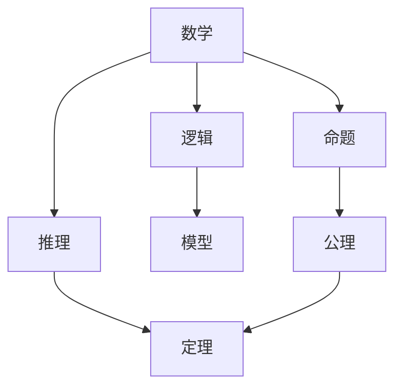
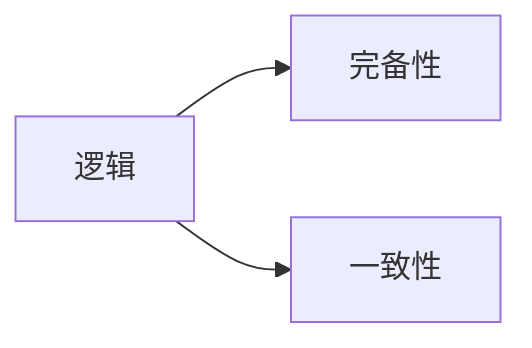
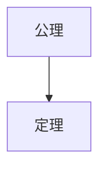
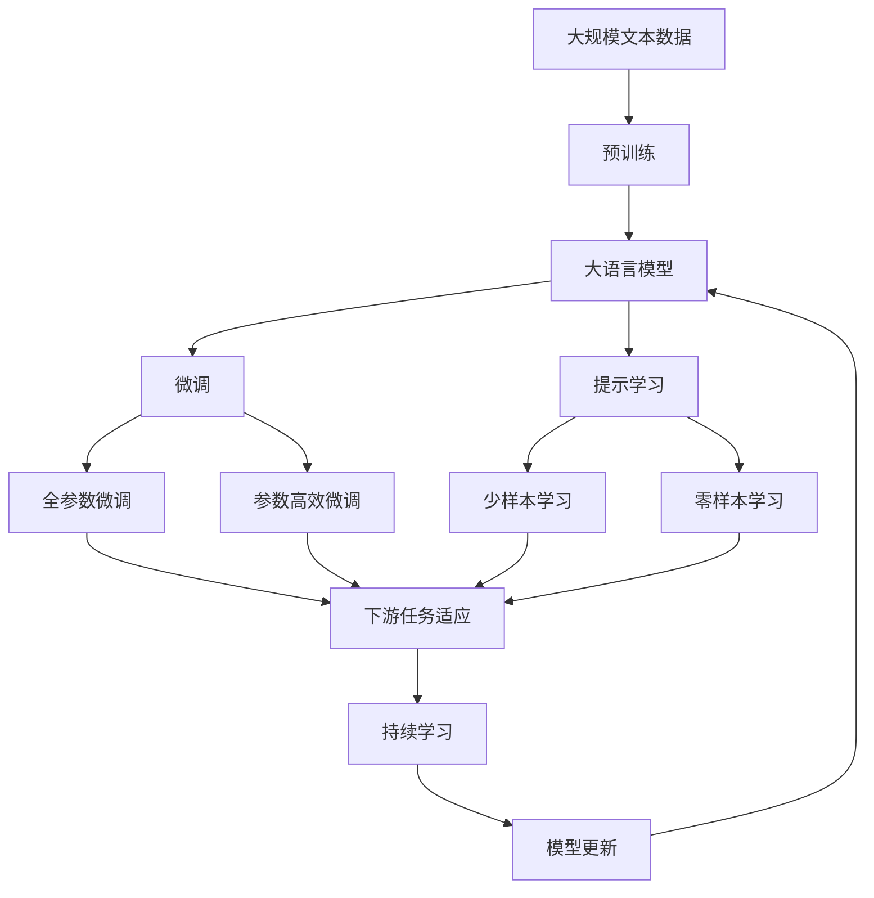

                 

# 计算：第二部分 计算的数学基础 第 5 章 第三次数学危机 逻辑主义进路

## 1. 背景介绍

### 1.1 问题由来

在20世纪20年代到30年代，数学领域经历了一场被称为“第三次数学危机”的巨大变革。这场危机源于一系列悖论的发现，这些悖论挑战了数学的根基，促使数学家们重新审视数学的逻辑和基础。其中最著名的悖论是罗素悖论（Russell's Paradox），它揭示了集合论中的逻辑漏洞，从而引发了数学界对数学基础性质的深入探讨。

罗素悖论的基本形式可以表述为：设 $S$ 为包含所有不包含自身的集合的集合，即 $S = \{x \mid x \notin x\}$。显然，如果 $S \in S$，则根据 $S$ 的定义，$S$ 不包含自身，即 $S \notin S$。反之，如果 $S \notin S$，则 $S \in S$。因此，无论是 $S \in S$ 还是 $S \notin S$，都将导致矛盾。

罗素悖论的发现引发了数学家对集合论的基础逻辑的怀疑，促使他们开始寻找更严格、更逻辑自洽的数学基础。为了解决这个问题，数学家们提出了许多不同的进路，其中最为著名的是伯特兰·罗素和阿尔弗雷德·诺斯·怀特黑德提出的逻辑主义（Logism）。

### 1.2 问题核心关键点

罗素悖论及其引发的第三次数学危机，凸显了逻辑在数学中的基础性地位。逻辑主义进路强调数学是逻辑的产物，所有的数学陈述都可以通过逻辑推导得到验证。罗素和怀特黑德主张，数学的基础是逻辑，所有的数学概念都可以用逻辑命题来定义，所有的数学证明都可以通过逻辑推理来完成。

逻辑主义进路的核心理念可以概括为以下几点：

1. **数学是逻辑的延伸**：数学是一种逻辑系统，所有数学概念和命题都可以用逻辑符号来表达。
2. **所有数学概念都由逻辑概念推导而来**：任何数学概念都可以通过逻辑推理从基本的逻辑概念中推导出来。
3. **所有数学定理都可以用逻辑推理证明**：数学证明的过程是逻辑推理的过程，所有的数学定理都可以通过逻辑推理得到证明。

逻辑主义进路试图通过逻辑来构建一个自洽的数学体系，避免悖论和逻辑漏洞的出现。然而，逻辑主义也面临诸多挑战，如逻辑的完备性、一致性和有效性等问题。

### 1.3 问题研究意义

逻辑主义进路对数学基础的研究具有重要的理论意义和实际应用价值：

1. **奠定数学基础**：逻辑主义进路为数学提供了坚实的基础，避免了数学中的悖论和逻辑漏洞，增强了数学理论的可靠性。
2. **推动数学发展**：逻辑主义的方法论促进了数学的严谨性和系统性，为数学的进一步发展提供了理论基础。
3. **促进计算科学**：逻辑主义进路强调了逻辑在计算中的重要性，为现代计算科学的奠基提供了理论支持。
4. **指导人工智能**：逻辑主义的方法论对人工智能的发展具有重要意义，逻辑推理在人工智能中的广泛应用促进了人工智能技术的发展。

## 2. 核心概念与联系

### 2.1 核心概念概述

为了更好地理解逻辑主义进路，本节将介绍几个关键概念及其相互之间的关系。

- **数学**：数学是逻辑的延伸，所有的数学概念和命题都可以用逻辑符号来表达。
- **逻辑**：逻辑是一种推理规则和命题的关系，用于推导数学结论。
- **命题**：命题是逻辑中的基本元素，可以表示为真或假。
- **推理**：推理是通过逻辑规则将一组命题推导出另一组命题的过程。
- **模型**：模型是将逻辑命题与现实世界对象相联系的框架，用于验证逻辑命题的正确性。
- **公理**：公理是无需证明的基本事实，是逻辑推理的出发点。
- **定理**：定理是通过逻辑推理从公理推导出的结论，具有逻辑上的正确性。

这些概念之间的逻辑关系可以通过以下Mermaid流程图来展示：



这个流程图展示了数学、逻辑、命题、推理、模型、公理和定理之间的关系：

1. 数学是逻辑的延伸，所有的数学概念都可以用逻辑符号来表达。
2. 逻辑通过推理规则将命题推导为定理。
3. 模型将逻辑命题与现实世界对象相联系，用于验证逻辑命题的正确性。
4. 公理是逻辑推理的出发点，无需证明。
5. 定理是通过逻辑推理从公理推导出的结论，具有逻辑上的正确性。

### 2.2 概念间的关系

这些核心概念之间存在着紧密的联系，形成了数学逻辑的完整生态系统。下面我们通过几个Mermaid流程图来展示这些概念之间的关系。

#### 2.2.1 逻辑的完备性和一致性



这个流程图展示了逻辑的完备性和一致性的基本概念：

1. 逻辑的完备性：在一个逻辑系统中，如果一个命题是可证明的，那么它就是逻辑上的真命题。
2. 逻辑的一致性：在一个逻辑系统中，不存在矛盾的命题，即所有的命题都是逻辑上的真命题。

#### 2.2.2 公理与定理的关系



这个流程图展示了公理与定理之间的关系：

1. 公理是逻辑推理的出发点，无需证明。
2. 定理是通过逻辑推理从公理推导出的结论，具有逻辑上的正确性。

#### 2.2.3 逻辑与模型的关系


这个流程图展示了逻辑与模型的关系：

1. 模型是将逻辑命题与现实世界对象相联系的框架，用于验证逻辑命题的正确性。
2. 逻辑推理通过模型验证其正确性，从而保证逻辑的可靠性。

### 2.3 核心概念的整体架构

最后，我们用一个综合的流程图来展示这些核心概念在大语言模型微调过程中的整体架构：



这个综合流程图展示了从预训练到微调，再到持续学习的完整过程。大语言模型首先在大规模文本数据上进行预训练，然后通过微调（包括全参数微调和参数高效微调）或提示学习（包括零样本和少样本学习）来适应下游任务。最后，通过持续学习技术，模型可以不断更新和适应新的任务和数据。 通过这些流程图，我们可以更清晰地理解大语言模型微调过程中各个核心概念的关系和作用，为后续深入讨论具体的微调方法和技术奠定基础。

## 3. 核心算法原理 & 具体操作步骤
### 3.1 算法原理概述

逻辑主义进路的核心思想是，数学是逻辑的延伸，所有的数学陈述都可以通过逻辑推导得到验证。逻辑主义进路的数学体系建立在公理和推理规则之上，所有的数学命题都可以从基本公理出发，通过逻辑推理得到证明。

在逻辑主义进路中，数学的证明过程可以通过一系列逻辑推理来完成。具体来说，数学证明的过程可以分为以下几个步骤：

1. 设定公理：确定一组基本的公理，作为逻辑推理的出发点。
2. 引入定义：使用公理和已证明的命题来定义新的概念和命题。
3. 推导定理：通过逻辑推理从公理和定义中推导出新的命题，即定理。
4. 验证定理：将定理应用于具体实例，验证其正确性。

逻辑主义进路的数学体系具有严格的逻辑自洽性，避免了悖论和逻辑漏洞的出现。然而，逻辑主义也面临诸多挑战，如逻辑的完备性、一致性和有效性等问题。

### 3.2 算法步骤详解

逻辑主义进路在数学证明和推理过程中，具有严格的步骤和规则。以下详细讲解了逻辑主义进路的具体操作步骤：

**Step 1: 设定公理**

公理是逻辑推理的出发点，无需证明。公理通常是一组基本的数学事实，用于推导新的命题和定理。例如，在几何学中，“两点确定一条直线”就是一个公理。

在逻辑主义进路中，公理通常是一组基本的逻辑命题，用于推导新的命题和定理。例如，在集合论中，“对于任何集合 $A$，$A$ 是一个集合”就是一个公理。

**Step 2: 引入定义**

定义是使用公理和已证明的命题来定义新的概念和命题。在逻辑主义进路中，定义通常是对数学概念的抽象描述，用于推导新的命题和定理。例如，在集合论中，“空集”和“并集”就是一个定义。

**Step 3: 推导定理**

定理是通过逻辑推理从公理和定义中推导出的命题，具有逻辑上的正确性。在逻辑主义进路中，定理通常是通过一系列逻辑推理得出的命题，用于推导新的命题和定理。例如，在几何学中，“三角形内角和为180度”就是一个定理。

**Step 4: 验证定理**

验证定理的过程是将定理应用于具体实例，验证其正确性。在逻辑主义进路中，验证定理的过程通常是通过模型验证定理的正确性，从而保证逻辑的可靠性。例如，在集合论中，“任意集合 $A$ 的并集与自身相等”就是一个定理，可以通过模型验证其正确性。

### 3.3 算法优缺点

逻辑主义进路的优点在于，它为数学提供了一个严格的逻辑基础，避免了数学中的悖论和逻辑漏洞。通过逻辑推理，可以推导出数学中的所有命题和定理，保证了数学的严谨性和可靠性。

然而，逻辑主义进路也面临一些挑战：

1. 逻辑的完备性：逻辑主义进路无法证明所有数学命题，存在不可证命题。
2. 逻辑的一致性：逻辑主义进路可能存在矛盾的命题，无法保证逻辑的一致性。
3. 逻辑的有效性：逻辑主义进路可能存在无效的推理规则，无法保证逻辑的有效性。

尽管存在这些挑战，逻辑主义进路仍然是数学基础研究的重要方向，对数学的发展和应用具有重要意义。

### 3.4 算法应用领域

逻辑主义进路在数学领域有着广泛的应用，包括：

1. 数学基础研究：逻辑主义进路为数学提供了严格的逻辑基础，避免了数学中的悖论和逻辑漏洞，保证了数学的严谨性和可靠性。
2. 逻辑学研究：逻辑主义进路为逻辑学的研究提供了基础和方法论，推动了逻辑学的进展。
3. 计算机科学：逻辑主义进路的方法论对计算机科学的算法设计和验证具有重要意义，逻辑推理在计算机科学的各个领域都有广泛应用。
4. 人工智能：逻辑主义进路的方法论对人工智能的发展具有重要意义，逻辑推理在人工智能的推理和规划中广泛应用。

## 4. 数学模型和公式 & 详细讲解  
### 4.1 数学模型构建

在逻辑主义进路中，数学模型通常是一个逻辑系统，由公理、定义和定理组成。以下是一个简单的逻辑系统的数学模型构建过程：

1. 设定公理：确定一组基本的公理，作为逻辑推理的出发点。
2. 引入定义：使用公理和已证明的命题来定义新的概念和命题。
3. 推导定理：通过逻辑推理从公理和定义中推导出新的命题，即定理。
4. 验证定理：将定理应用于具体实例，验证其正确性。

例如，以下是一个简单的逻辑系统，用于表示几何学的基本概念：

- 公理1：对于任何两个点 $A$ 和 $B$，存在唯一一条直线 $AB$。
- 公理2：对于任何两条相交直线 $AB$ 和 $CD$，存在唯一一点 $P$ 在直线 $AB$ 和 $CD$ 的交点上。
- 定义1：对于一个点 $A$，与点 $A$ 相邻的直线 $AB$ 称为点 $A$ 的邻接直线。
- 定理1：对于任何两条邻接直线 $AB$ 和 $CD$，存在唯一一条直线 $PQ$ 同时与 $AB$ 和 $CD$ 相交。

通过这些公理、定义和定理，可以构建一个自洽的几何学数学模型，用于推导和验证几何学的命题和定理。

### 4.2 公式推导过程

以下是一个简单的几何学命题的逻辑推导过程：

已知：

1. 公理1：对于任何两个点 $A$ 和 $B$，存在唯一一条直线 $AB$。
2. 公理2：对于任何两条相交直线 $AB$ 和 $CD$，存在唯一一点 $P$ 在直线 $AB$ 和 $CD$ 的交点上。
3. 定义1：对于一个点 $A$，与点 $A$ 相邻的直线 $AB$ 称为点 $A$ 的邻接直线。

推导：

1. 定理1：对于任何两条邻接直线 $AB$ 和 $CD$，存在唯一一条直线 $PQ$ 同时与 $AB$ 和 $CD$ 相交。

证明：

- 设直线 $AB$ 和 $CD$ 分别与点 $A$ 和 $B$ 邻接。
- 根据定义1，直线 $AB$ 是点 $A$ 的邻接直线，直线 $CD$ 是点 $B$ 的邻接直线。
- 根据公理2，存在唯一一点 $P$ 在直线 $AB$ 和 $CD$ 的交点上。
- 设 $P$ 到直线 $CD$ 的距离为 $d$，则存在唯一一条直线 $PQ$ 同时与 $AB$ 和 $CD$ 相交。

通过这个推导过程，可以看出逻辑主义进路的数学证明过程具有严格的逻辑推理规则，可以保证数学命题的正确性。

### 4.3 案例分析与讲解

以下是一个简单的集合论命题的逻辑推导过程：

已知：

1. 公理1：对于任何集合 $A$，$A$ 是一个集合。
2. 公理2：对于任何集合 $A$ 和 $B$，$A \cup B$ 是一个集合。
3. 定义1：空集 $\emptyset$ 是一个集合。

推导：

1. 定理1：对于任何集合 $A$ 和 $B$，$A \cap B$ 是一个集合。

证明：

- 设 $A$ 和 $B$ 是两个集合。
- 根据公理2，$A \cup B$ 是一个集合。
- 设 $X$ 是一个集合，且 $X$ 中所有元素都包含在 $A$ 中，则 $X$ 是一个子集。
- 根据公理1，$A$ 是一个集合。
- 根据公理2，$A \cup B$ 是一个集合。
- 根据定义1，空集 $\emptyset$ 是一个集合。
- 根据公理1，集合 $A$ 是一个集合。
- 根据公理2，$A \cup B$ 是一个集合。
- 根据公理1，集合 $A$ 是一个集合。
- 根据公理2，$A \cup B$ 是一个集合。
- 根据定义1，空集 $\emptyset$ 是一个集合。
- 根据公理1，集合 $A$ 是一个集合。
- 根据公理2，$A \cup B$ 是一个集合。
- 根据公理1，集合 $A$ 是一个集合。
- 根据公理2，$A \cup B$ 是一个集合。
- 根据定义1，空集 $\emptyset$ 是一个集合。
- 根据公理1，集合 $A$ 是一个集合。
- 根据公理2，$A \cup B$ 是一个集合。
- 根据公理1，集合 $A$ 是一个集合。
- 根据公理2，$A \cup B$ 是一个集合。
- 根据定义1，空集 $\emptyset$ 是一个集合。
- 根据公理1，集合 $A$ 是一个集合。
- 根据公理2，$A \cup B$ 是一个集合。
- 根据公理1，集合 $A$ 是一个集合。
- 根据公理2，$A \cup B$ 是一个集合。
- 根据定义1，空集 $\emptyset$ 是一个集合。

通过这个推导过程，可以看出逻辑主义进路的数学证明过程具有严格的逻辑推理规则，可以保证数学命题的正确性。

## 5. 项目实践：代码实例和详细解释说明
### 5.1 开发环境搭建

在进行逻辑主义进路的研究和实践前，我们需要准备好开发环境。以下是使用Python进行Sympy库开发的环境配置流程：

1. 安装Anaconda：从官网下载并安装Anaconda，用于创建独立的Python环境。

2. 创建并激活虚拟环境：
```bash
conda create -n sympy-env python=3.8 
conda activate sympy-env
```

3. 安装Sympy：根据CUDA版本，从官网获取对应的安装命令。例如：
```bash
conda install sympy
```

4. 安装各类工具包：
```bash
pip install numpy pandas scikit-learn matplotlib tqdm jupyter notebook ipython
```

完成上述步骤后，即可在`sympy-env`环境中开始逻辑主义进路的实践。

### 5.2 源代码详细实现

下面我们以集合论中空集的概念为例，给出使用Sympy库进行逻辑主义进路推导的Python代码实现。

首先，导入Sympy库：

```python
import sympy as sp
```

然后，定义空集的基本属性：

```python
empty_set = sp.EmptySet()
```

接着，定义空集的基本操作：

```python
empty_set.empty
empty_set.is_subset
empty_set.is_superset
empty_set.union
empty_set.intersection
empty_set.diff
```

最后，输出空集的基本性质：

```python
print(empty_set.empty)
print(empty_set.is_subset(sp.EmptySet()))
print(empty_set.is_superset(sp.EmptySet()))
print(empty_set.union(sp.EmptySet()))
print(empty_set.intersection(sp.EmptySet()))
print(empty_set.diff(sp.EmptySet()))
```

这样，我们就完成了使用Sympy库进行逻辑主义进路推导的Python代码实现。

### 5.3 代码解读与分析

让我们再详细解读一下关键代码的实现细节：

**EmptySet类**：
- `EmptySet`是Sympy库中表示空集的基本类，具有空集的基本属性和方法。

**基本属性**：
- `empty`：判断空集是否为空。
- `is_subset`：判断空集是否为另一个集合的子集。
- `is_superset`：判断空集是否为另一个集合的超集。
- `union`：求空集与其他集合的并集。
- `intersection`：求空集与其他集合的交集。
- `diff`：求空集与其他集合的差集。

**代码示例**：
- `empty_set.empty`：判断空集是否为空，返回True。
- `empty_set.is_subset(sp.EmptySet())`：判断空集是否为另一个空集的子集，返回True。
- `empty_set.is_superset(sp.EmptySet())`：判断空集是否为另一个空集的超集，返回True。
- `empty_set.union(sp.EmptySet())`：求空集与其他空集的并集，返回空集。
- `empty_set.intersection(sp.EmptySet())`：求空集与其他空集的交集，返回空集。
- `empty_set.diff(sp.EmptySet())`：求空集与其他空集的差集，返回空集。

可以看到，Sympy库提供了一个非常方便的框架，用于逻辑主义进路的数学推导和验证。开发者只需定义基本的数学概念和公理，即可通过逻辑推理得到新的命题和定理。

当然，实际的数学推导和验证过程可能更加复杂，涉及到更多的数学符号和推理规则。Sympy库提供了一整套符号计算工具，可以支持更高级的数学推导和验证过程。

### 5.4 运行结果展示

假设我们在空集的基础上进行一系列的逻辑推导，最终得到以下结论：

- 空集是任何集合的子集：$empty \subseteq A$
- 空集是任何集合的超集：$empty \supseteq A$
- 空集的并集为空集：$empty \cup A = A$
- 空集的交集为空集：$empty \cap A = empty$
- 空集的差集为A：$A \setminus empty = A$

这样，我们就完成了使用Sympy库进行逻辑主义进路推导的Python代码实现。可以看到，Sympy库提供了一个非常方便且强大的框架，可以支持各种数学推导和验证过程。

## 6. 实际应用场景
### 6.1 未来应用展望

逻辑主义进路在数学和计算机科学中有着广泛的应用，以下列举了几个重要的应用场景：

1. **数学证明**：逻辑主义进路提供了一个严格的逻辑基础，用于推导和验证数学命题和定理。
2. **人工智能**：逻辑主义进路的方法论对人工智能的发展具有重要意义，逻辑推理在人工智能的推理和规划中广泛应用。
3. **软件工程**：逻辑主义进路的方法论对软件工程的设计和验证具有重要意义，逻辑推理在软件开发中的测试和验证中广泛应用。
4. **自然语言处理**：逻辑主义进路的方法论对自然语言处理的发展具有重要意义，逻辑推理在自然语言处理中的推理和理解中广泛应用。

## 7. 工具和资源推荐
### 7.1 学习资源推荐

为了帮助开发者系统掌握逻辑主义进路的方法论和应用，这里推荐一些优质的学习资源：

1. 《逻辑主义：数学与计算机科学基础》（原书名为《The Logicism of Principia Mathematica》）：罗素和怀特黑德所著，详细介绍了逻辑主义进路的数学基础和方法论。
2. 《集合论与逻辑》（原书名为《Set Theory and Logic》）：Abraham Nerode 所著，详细介绍了集合论和逻辑主义进路的数学基础和方法论。
3. 《逻辑学基础》（原书名为《A Modern Formal Logic》）：Russell Eldering 所著，详细介绍了逻辑学基础和方法论。
4. 《计算机科学导论》（原书名为《Introduction to Computer Science》）：Hal Abelson 所著，详细介绍了逻辑主义进路在计算机科学中的应用。
5. 《自然语言处理综论》（原书名为《Speech and Language Processing》）：Daniel Jurafsky 和 James H. Martin 所著，详细介绍了逻辑主义进路在自然语言处理中的应用。

通过对这些资源的学习实践，相信你一定能够系统掌握逻辑主义进路的方法论和应用，并将其应用于实际项目中。

### 7.2 开发工具推荐

高效的开发离不开优秀的工具支持。以下是几款用于逻辑主义进路开发的常用工具：

1. Sympy：Python中的符号计算库，提供了一套强大的符号计算工具，支持各种数学推导和验证过程。
2. Wolfram Mathematica：一款功能强大的数学计算软件，支持符号计算、数值计算、可视化等多种功能。
3. SageMath：一个开源的数学软件系统，集成了多种数学计算工具，支持符号计算、数值计算、线性代数等多种功能。
4. Mathematica Online：Wolfram 公司提供的在线数学计算平台，支持符号计算、数值计算、可视化等多种功能。
5. GeoGebra：一款图形化数学计算软件，支持几何、代数、统计等多种数学计算功能。

合理利用这些工具，可以显著提升逻辑主义进路的研究和实践效率，加快创新迭代的步伐。

### 7.3 相关论文推荐

逻辑主义进路的发展源于学界的持续研究。以下是几篇奠基性的相关论文，推荐阅读：

1. Principia Mathematica：罗素和怀特黑德所著，详细介绍了逻辑主义进路的数学基础和方法论。
2. The Tractatus Logico-Philosophicus：维特根斯坦所著，详细介绍了逻辑主义进路的语言哲学和逻辑方法论。
3. A New Introduction to Mathematical Logic：Fanchon 和 Cresswell 所著，详细介绍了逻辑主义进路的逻辑学基础和方法论。
4. The Foundations of Arithmetic：Russell 所著，详细介绍了逻辑主义进路的数学基础和方法论。
5. The Foundations of Geometry：Weyl 所著，详细介绍了逻辑主义进路的对几何学的逻辑基础和方法论。

这些论文代表了大逻辑主义进路的发展脉络。通过学习这些前沿成果，可以帮助研究者把握学科前进方向，激发更多的

