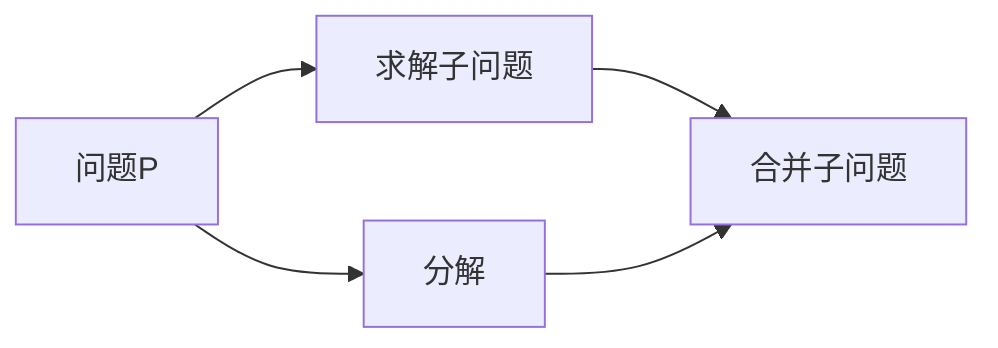

                 

# 计算：第四部分 计算的极限 第 11 章 复杂性计算 复杂性的简单算法

> 关键词：复杂性计算, 简单算法, 图灵完备性, 计算模型, 自顶向下与自底向上

## 1. 背景介绍

### 1.1 问题由来
复杂性计算（Complexity Theory）是计算科学中的一个重要分支，研究各种计算问题的本质和算法。这一领域不仅涉及理论研究，还包括对实际问题的解决策略和算法设计。复杂性计算在计算机科学中具有重要地位，但学习复杂性计算需要理解许多抽象概念，并且往往需要严格的数学基础。

本文将对复杂性计算的简单算法进行讲解，包括计算模型、图灵完备性以及自顶向下与自底向上的设计思路。通过具体案例，解释复杂性计算的基本概念及其应用。

### 1.2 问题核心关键点
复杂性计算的核心在于研究各种计算问题在计算机上的可解性和算法效率。简单算法包括贪心算法、分治算法等，这些算法在特定问题上具有较高的效率和复杂性理论上的严格性。

复杂性计算的研究分为两个主要方向：自顶向下（Top-Down）和自底向上（Bottom-Up）。自顶向下方法从问题的整体目标出发，通过分解问题逐步求解；自底向上方法则是从问题的基本构件出发，逐步组合为复杂问题的解。两种方法在不同的问题上有其独特的优势。

此外，图灵完备性是复杂性计算研究的基础，图灵完备的计算模型能够表示所有计算问题，是现代计算机的基石。

## 2. 核心概念与联系

### 2.1 核心概念概述

为更好地理解复杂性计算，我们先介绍几个关键概念：

- 计算模型（Computational Model）：研究计算问题的基本框架，如图灵机、抽象机器等，它们是所有算法的基础。
- 图灵完备性（Turing Completeness）：如果一种计算模型能表示所有计算问题，则称其为图灵完备的。
- 贪心算法（Greedy Algorithm）：每一步总是选择当前局部最优解，希望最终得到一个全局最优解。
- 分治算法（Divide and Conquer Algorithm）：将问题划分为若干个子问题，递归求解后再合并结果。
- 自顶向下设计（Top-Down Design）：从整体问题出发，分解为子问题，逐步求解。
- 自底向上设计（Bottom-Up Design）：从基本构件出发，逐步组合为复杂问题的解。

这些概念通过一个简单的流程图可以更好理解：



### 2.2 概念间的关系

这些核心概念之间的关系可以表示为：

- 计算模型是复杂性计算的基础，所有算法都是在其上实现的。
- 图灵完备性是所有计算模型能够处理任何问题的必要条件。
- 贪心算法和分治算法是解决特定问题的有效方法，通过优化算法效率，增强模型计算能力。
- 自顶向下设计和自底向上设计是算法设计的两种主要策略，适用于不同类型的问题。

## 3. 核心算法原理 & 具体操作步骤

### 3.1 算法原理概述

复杂性计算中的简单算法主要是指贪心算法和分治算法。它们具有效率高、易于理解和实现的优点，但也存在一定的局限性。

- 贪心算法每一步总是选择局部最优解，并不保证得到全局最优解。
- 分治算法通过分解和递归求解，但需要考虑合并子问题的策略，可能存在子问题重叠和重复计算的问题。

这些算法的原理是通过数学建模，利用已有信息（如图灵机模型）或抽象模型，将复杂问题转化为可操作的具体步骤。这些步骤通常包含分解、求解和合并等操作。

### 3.2 算法步骤详解

这里以贪心算法为例，展示其基本步骤：

1. **选择局部最优解**：每一步总是选择当前状态下的最优解。
2. **合并结果**：将局部最优解合并为全局最优解。
3. **反复迭代**：重复选择和合并步骤，直至问题解决。

具体来说，贪心算法的步骤如下：

1. 定义状态集合 $S$ 和状态转移函数 $f$。
2. 从初始状态 $s_0$ 开始，按照状态转移函数 $f$ 迭代，直到达到最优状态 $s^*$。
3. 计算最终结果 $R(s^*)$。

以最短路径问题为例，说明贪心算法的应用：

1. 定义状态集合 $S$ 为所有可能的路径。
2. 状态转移函数 $f$ 为选择当前路径中剩余边权最小的边。
3. 从起点开始，选择边权最小的边，直到到达终点。
4. 计算最终结果为路径的总边权。

分治算法则分为以下几个步骤：

1. **分解问题**：将问题 $P$ 划分为若干个子问题 $P_1, P_2, \ldots, P_n$。
2. **递归求解**：对每个子问题 $P_i$ 递归求解。
3. **合并结果**：将子问题的解合并为原问题的解。

以归并排序为例，说明分治算法的应用：

1. 将待排序的数组 $A$ 划分为两个子数组 $A_1$ 和 $A_2$。
2. 对 $A_1$ 和 $A_2$ 分别递归排序。
3. 将排序好的 $A_1$ 和 $A_2$ 合并为有序数组 $A$。

### 3.3 算法优缺点

贪心算法和分治算法都有其优缺点：

**贪心算法的优点**：
- 算法简单，易于实现。
- 计算复杂度相对较低。

**贪心算法的缺点**：
- 不保证得到全局最优解。
- 需要提前定义状态和转移函数，可能存在选择限制。

**分治算法的优点**：
- 可以处理复杂度较高的问题。
- 递归求解和并行化效率较高。

**分治算法的缺点**：
- 子问题可能重叠，存在重复计算。
- 需要额外的合并操作，可能增加计算复杂度。

### 3.4 算法应用领域

复杂性计算中的简单算法广泛应用于各种实际问题中：

- 最短路径问题：如Dijkstra算法、A*算法等。
- 排序问题：如快速排序、归并排序等。
- 动态规划问题：如背包问题、最长公共子序列等。
- 图论问题：如最小生成树、最大流等。

这些算法在工程实践中具有重要意义，通过合理应用，可以显著提高问题解决的效率和准确性。

## 4. 数学模型和公式 & 详细讲解 & 举例说明

### 4.1 数学模型构建

在复杂性计算中，通常需要建立数学模型来描述问题，并转化为计算问题。以下是一个简单数学模型的构建过程：

1. 定义输入和输出：
   - 输入：表示问题中所有已知信息。
   - 输出：表示问题需要求解的结果。

2. 定义状态和状态转移：
   - 状态：表示问题中所有变量和条件。
   - 状态转移：描述状态之间的转换关系。

3. 定义目标函数和约束条件：
   - 目标函数：表示求解的目标。
   - 约束条件：表示问题中的限制和要求。

### 4.2 公式推导过程

以最短路径问题为例，我们将问题转化为数学模型：

设图 $G$ 中有 $n$ 个节点和 $m$ 条边，边权为 $w$。从节点 $s$ 到节点 $t$ 的最短路径问题可以表示为：

$$
\min \sum_{i=1}^n w_{ij}
$$

其中 $w_{ij}$ 表示节点 $i$ 到节点 $j$ 的边权。

**算法步骤**：
1. 初始化距离数组 $d$，令 $d_s = 0$。
2. 对于每个未访问的节点 $i$，计算 $d_i = \min \{ d_j + w_{ji} | j \text{ 已访问} \}$。
3. 重复步骤 2 直到所有节点都访问过。

**时间复杂度**：$O(mn)$。

### 4.3 案例分析与讲解

- **最短路径问题**：Dijkstra算法
- **背包问题**：动态规划
- **排序问题**：快速排序

这些算法的基本思想是通过数学建模，将复杂问题分解为可操作的步骤，并计算出最优解。

## 5. 项目实践：代码实例和详细解释说明

### 5.1 开发环境搭建

在进行复杂性计算的项目实践前，我们需要准备好开发环境。以下是使用Python进行项目开发的第一步：

1. 安装Python 3：从官网下载并安装最新版本的Python。
2. 安装必要的库：如numpy、scipy、matplotlib等。

### 5.2 源代码详细实现

这里以Dijkstra算法为例，展示最短路径问题的实现：

```python
import heapq

def dijkstra(graph, start, end):
    """
    使用Dijkstra算法求解最短路径
    """
    # 初始化距离和访问状态
    dist = {node: float('inf') for node in graph}
    dist[start] = 0
    visited = set()
    
    # 优先队列
    pq = [(0, start)]
    
    while pq:
        d, node = heapq.heappop(pq)
        if node == end:
            break
        if node in visited:
            continue
        visited.add(node)
        for neighbor, weight in graph[node].items():
            alt = d + weight
            if alt < dist[neighbor]:
                dist[neighbor] = alt
                heapq.heappush(pq, (alt, neighbor))
    
    return dist[end]

# 定义图
graph = {
    'A': {'B': 1, 'C': 4},
    'B': {'A': 1, 'C': 2, 'D': 5},
    'C': {'A': 4, 'B': 2, 'D': 1},
    'D': {'B': 5, 'C': 1}
}

# 调用Dijkstra算法
print(dijkstra(graph, 'A', 'D'))
```

### 5.3 代码解读与分析

**代码解析**：
- `dijkstra`函数：使用Dijkstra算法求解最短路径。
- `graph`：表示图的邻接字典。
- `start`：起点。
- `end`：终点。
- `dist`：距离数组。
- `visited`：已访问节点集合。
- `pq`：优先队列。

**运行结果展示**：
- 输出最短路径长度。

通过这个简单代码实例，可以理解复杂性计算中简单算法的基本实现步骤。

## 6. 实际应用场景

### 6.4 未来应用展望

复杂性计算的简单算法广泛应用于各种实际问题中，以下是几个未来应用展望：

1. **大规模数据处理**：复杂性计算可以应用于大数据处理，如数据清洗、去重等。
2. **实时计算系统**：复杂性算法可以应用于实时计算系统，如网络路由、实时排序等。
3. **自动驾驶**：复杂性计算可以应用于自动驾驶，如路径规划、障碍物规避等。
4. **金融风险管理**：复杂性计算可以应用于金融风险管理，如信用评估、风险预警等。

## 7. 工具和资源推荐

### 7.1 学习资源推荐

以下是一些学习复杂性计算的推荐资源：

1. 《算法导论》：由Thomas H. Cormen等编写的经典算法教材，详细讲解了各种算法。
2. Coursera和edX等在线课程：提供大量免费和付费课程，如Princeton大学的算法课程。
3. LeetCode等在线平台：提供大量的算法练习题，通过练习加深理解。
4. Kaggle竞赛：参加Kaggle竞赛，可以实战练习复杂性计算。

### 7.2 开发工具推荐

以下是一些开发复杂性计算的推荐工具：

1. Python：Python是算法实现的首选语言。
2. numpy：Python的高性能数学库。
3. matplotlib：Python的数据可视化库。
4. Jupyter Notebook：Python代码交互式编写环境。

### 7.3 相关论文推荐

以下是一些复杂性计算的推荐论文：

1. "Introduction to Algorithms" by Thomas H. Cormen et al.
2. "Design and Analysis of Algorithms" by Clifford A. Shaffer.
3. "Greedy Algorithms: Theory and Applications" by Guanlong Cao et al.
4. "Divide and Conquer" by Shimon Even.

这些资源和工具可以辅助开发者深入理解复杂性计算的基本概念和实现技巧。

## 8. 总结：未来发展趋势与挑战

### 8.1 研究成果总结

复杂性计算中的简单算法，如贪心算法和分治算法，通过数学建模和算法设计，显著提升了问题解决的效率和准确性。未来，随着计算技术的不断进步，复杂性计算的研究将更加深入和广泛。

### 8.2 未来发展趋势

未来复杂性计算的发展趋势包括：

1. **算法优化**：通过算法优化和改进，进一步提升算法效率和复杂度。
2. **并行计算**：通过并行计算技术，加速复杂问题的求解。
3. **量子计算**：利用量子计算技术，解决复杂性高的问题。

### 8.3 面临的挑战

复杂性计算在未来的发展过程中，面临以下挑战：

1. **算法复杂性**：复杂性高的问题仍需高效的算法求解。
2. **计算资源**：高复杂度问题需要大量的计算资源。
3. **实时性**：实时计算系统需要快速响应。
4. **稳定性**：算法需要保证在各种数据情况下的稳定性。

### 8.4 研究展望

未来的研究方向包括：

1. **多模态计算**：将文本、图像、声音等多种数据形式相结合，进行综合计算。
2. **自动化算法设计**：通过机器学习等技术，自动设计高效算法。
3. **知识驱动算法**：将先验知识融入算法设计，提高算法准确性。

## 9. 附录：常见问题与解答

**Q1：什么是贪心算法？**

A: 贪心算法是一种通过每一步选择局部最优解，希望最终得到全局最优解的算法。

**Q2：什么是分治算法？**

A: 分治算法是一种通过将问题分解为若干个子问题，递归求解后再合并结果的算法。

**Q3：复杂性计算中的简单算法有哪些？**

A: 复杂性计算中的简单算法主要包括贪心算法和分治算法。

**Q4：复杂性计算的简单算法有什么优缺点？**

A: 贪心算法和分治算法都具有各自的优势和局限性。贪心算法简单易实现，但不一定能得到全局最优解；分治算法效率高，但可能存在子问题重叠和重复计算的问题。

**Q5：复杂性计算的简单算法如何应用于实际问题？**

A: 复杂性计算的简单算法可以通过数学建模，将复杂问题分解为可操作的步骤，并计算出最优解。

**Q6：复杂性计算的简单算法有哪些实际应用？**

A: 复杂性计算的简单算法广泛应用于各种实际问题中，如最短路径问题、排序问题、背包问题等。

**Q7：复杂性计算的简单算法在未来发展中面临哪些挑战？**

A: 未来复杂性计算的简单算法面临算法复杂性、计算资源、实时性、稳定性等挑战。

---

作者：禅与计算机程序设计艺术 / Zen and the Art of Computer Programming

