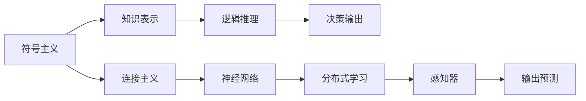

                 

# 计算：第四部分 计算的极限 第 12 章 机器能思考吗 符号主义与连接主义

> 关键词：计算极限, 机器思考, 符号主义, 连接主义, 人工智能, 深度学习, 神经网络, 模型理论

## 1. 背景介绍

在《计算：第四部分 计算的极限》中，我们探讨了计算的极限问题，包括计算的物理基础、复杂性理论、并行计算等。本章将深入探讨机器能否思考这一核心问题，结合符号主义与连接主义两种主要的理论框架进行详细分析。

## 2. 核心概念与联系

### 2.1 核心概念概述

为更好地理解机器能否思考这一问题，我们先介绍两个核心概念：

- 符号主义(Symbolism)：符号主义认为，思维和推理是符号的逻辑处理。它强调知识表示和逻辑推理，认为机器可以通过理解和执行逻辑规则来模拟人类思考。
- 连接主义(Connectionism)：连接主义认为，大脑的工作机制是神经元之间的连接和互动，机器通过模拟神经元的网络结构来进行学习。它强调神经网络、分布式学习和感知器模型。

### 2.2 核心概念的关系

符号主义与连接主义是两种不同的理论框架，但它们相互补充、相互借鉴。符号主义关注规则和逻辑推理，连接主义关注学习机制和神经网络。然而，连接主义学习本质上也是符号处理，只是符号不再是明确的，而是隐含在网络结构中。这种隐含的符号处理，使得连接主义也能进行复杂的推理和思考。

以下是一个简单的Mermaid流程图，展示符号主义和连接主义之间的联系：



## 3. 核心算法原理 & 具体操作步骤

### 3.1 算法原理概述

符号主义和连接主义分别从不同的角度探讨机器能否思考。下面我们将分别介绍它们的算法原理。

#### 3.1.1 符号主义

符号主义认为，思考是逻辑推理和知识表示的过程。其主要算法包括：

- 知识表示：将知识用符号语言进行编码，如逻辑符号、一阶逻辑等。
- 逻辑推理：使用推理器对知识进行演绎和推理，如基于谓词逻辑的推理器。
- 推理规划：设计推理规划系统，从初始知识库中推导出结论，如专家系统。

#### 3.1.2 连接主义

连接主义认为，思考是神经元之间的连接和互动。其主要算法包括：

- 神经网络：使用多层感知器、卷积神经网络等进行特征提取和分类。
- 分布式学习：通过反向传播算法、随机梯度下降等方法优化网络参数，使得网络能够学习并预测输出。
- 强化学习：通过与环境的互动，学习最优策略，如Q-learning、Deep Q-Network等。

### 3.2 算法步骤详解

#### 3.2.1 符号主义

1. **知识表示**：定义一组符号，包括谓词、常量、变量等。使用谓词逻辑语言（如Prolog）表示知识库。
2. **逻辑推理**：使用推理器（如Prolog的解释器）对知识库进行推理，验证事实和规则是否一致，或者推导出新的结论。
3. **推理规划**：设计推理规划系统，如Jamie、Greedy Belief Network等，通过规划求解器进行规划推理。

#### 3.2.2 连接主义

1. **神经网络构建**：选择合适的神经网络结构，如多层感知器、卷积神经网络等。设计网络层、激活函数等。
2. **参数初始化**：对网络参数进行随机初始化。
3. **分布式学习**：使用反向传播算法（Backpropagation）或随机梯度下降（SGD）算法，优化网络参数。
4. **输出预测**：将新输入数据输入网络，得到预测输出。

### 3.3 算法优缺点

#### 3.3.1 符号主义

**优点**：
- 精确性高：符号主义能够严格定义和处理逻辑推理过程，减少误差。
- 可解释性强：符号主义的推理过程和规则明确，便于解释和调试。

**缺点**：
- 知识获取困难：知识表示和推理需要大量的人工干预，代价较高。
- 知识库不灵活：知识库的修改和扩展相对困难，难以适应复杂多变的环境。

#### 3.3.2 连接主义

**优点**：
- 自适应性强：连接主义能够从数据中自动学习，适应复杂环境。
- 可扩展性好：神经网络结构灵活，易于扩展。

**缺点**：
- 难以解释：连接主义模型往往被认为是"黑盒"，难以解释内部机制。
- 容易过拟合：如果数据不足，连接主义模型容易过拟合，泛化能力有限。

### 3.4 算法应用领域

符号主义和连接主义分别在各自擅长的领域得到广泛应用。

**符号主义**：
- 专家系统：用于复杂推理和决策，如医疗诊断、工业控制等。
- 规划系统：用于复杂规划和调度，如机器人路径规划、任务调度等。

**连接主义**：
- 计算机视觉：用于图像分类、目标检测、图像生成等。
- 自然语言处理：用于文本分类、情感分析、机器翻译等。
- 语音识别：用于语音识别、说话人识别、语音合成等。

## 4. 数学模型和公式 & 详细讲解 & 举例说明

### 4.1 数学模型构建

符号主义和连接主义分别使用不同的数学模型表示知识。下面分别介绍两种模型的数学构建方法。

#### 4.1.1 符号主义

符号主义的数学模型主要基于逻辑代数和谓词逻辑。下面以Prolog为例，展示知识库的数学模型构建。

假设知识库如下：
```prolog
person(X) :- man(X), adult(X).
man(X) :- male(X).
adult(X) :- above18(X).
```

知识库的逻辑代数表示为：
- 公理：$man(X) \rightarrow person(X)$
- 公理：$adult(X) \rightarrow person(X)$
- 公理：$male(X) \rightarrow man(X)$
- 公理：$above18(X) \rightarrow adult(X)$

#### 4.1.2 连接主义

连接主义的数学模型主要基于神经网络的结构和参数。以多层感知器为例，展示其数学模型构建。

多层感知器的数学模型如下：
$$
y=f(W_2 \cdot f(W_1 \cdot x+b_1)+b_2)
$$
其中，$x$为输入，$W_1, W_2$为权重矩阵，$b_1, b_2$为偏置向量，$f$为激活函数（如Sigmoid、ReLU等）。

### 4.2 公式推导过程

#### 4.2.1 符号主义

在符号主义中，逻辑推理的公式推导基于逻辑代数和逻辑演算。以Prolog的推理规则为例，展示公式推导过程。

假设我们有以下知识库：
```prolog
person(X) :- man(X), adult(X).
man(X) :- male(X).
adult(X) :- above18(X).
```

对于以下事实：
```prolog
male(X).
```

我们可以推导出：
```prolog
X is a man.
X is an adult.
X is a person.
```

其逻辑推导过程如下：
1. $male(X) \rightarrow man(X)$
2. $man(X) \rightarrow person(X)$
3. $male(X)$已知，推导出$man(X)$
4. $man(X)$已知，推导出$person(X)$
5. $adult(X)$已知，推导出$X$是成年人
6. $X$是成年人且是男性，推导出$X$是男性
7. $X$是男性，推导出$X$是男人
8. $X$是男人，推导出$X$是成年人
9. $X$是成年人且是男人，推导出$X$是普通人
10. $X$是普通人，推导出$X$是成年人

#### 4.2.2 连接主义

在连接主义中，神经网络的前向传播和反向传播过程基于链式法则和误差反向传播。以多层感知器为例，展示公式推导过程。

假设输入为$x=[0.1, 0.2]$，隐藏层节点数为3，输出层节点数为1，权重矩阵为：
$$
W_1 = \begin{bmatrix} 0.1 & 0.2 & 0.3 \\ 0.4 & 0.5 & 0.6 \end{bmatrix}, W_2 = \begin{bmatrix} 0.7 & 0.8 \end{bmatrix}
$$
偏置向量为：
$$
b_1 = [0.1, 0.2], b_2 = 0.3
$$

前向传播过程如下：
$$
h_1 = f(W_1 \cdot x+b_1) = f([0.3, 0.5, 0.7])
$$
$$
y = f(W_2 \cdot h_1+b_2) = f([0.6, 0.8])
$$

其中，$f(x)=\frac{1}{1+e^{-x}}$为Sigmoid函数。

反向传播过程如下：
$$
\frac{\partial y}{\partial W_1} = \frac{\partial y}{\partial h_1} \cdot \frac{\partial h_1}{\partial W_1}
$$
$$
\frac{\partial y}{\partial W_2} = \frac{\partial y}{\partial h_1} \cdot \frac{\partial h_1}{\partial W_2}
$$

其中，$\frac{\partial h_1}{\partial W_1}$和$\frac{\partial h_1}{\partial W_2}$可以通过链式法则计算得到。

### 4.3 案例分析与讲解

#### 4.3.1 符号主义

以专家系统为例，展示符号主义在知识表示和推理中的应用。

假设我们有一个医学专家系统，用于诊断心脏病。知识库包括：
```prolog
heartDisease :- hasSymptoms(symptoms).
hasSymptoms([胸痛, 胸闷, 心悸]) :- heartDisease.
hasSymptoms([胸痛, 胸闷, 心悸]) :- hasChronicDisease(chronicDisease).
hasChronicDisease(chronicDisease) :- highBloodPressure(bloodPressure).
hasChronicDisease(chronicDisease) :- highCholesterol(cholesterol).
```

对于以下症状：
```prolog
[胸痛, 胸闷, 心悸].
```

我们可以推导出：
```prolog
X is a person.
X is a patient.
X has symptoms.
X has chronic disease.
X has high blood pressure.
X has high cholesterol.
X has heart disease.
```

#### 4.3.2 连接主义

以卷积神经网络（CNN）为例，展示连接主义在图像识别中的应用。

假设我们有一个手写数字识别任务，CNN的结构如下：
```text
Conv Layer 1: 32 filters, 3x3 kernel size
Conv Layer 2: 64 filters, 3x3 kernel size
Pool Layer 1: 2x2 pool size, stride 2
Fully Connected Layer 1: 128 units
Fully Connected Layer 2: 10 units (softmax for 10 classes)
```

对于一个手写数字图像$x$，CNN的前向传播过程如下：
$$
y_1 = f_1(W_1 \cdot x+b_1)
$$
$$
y_2 = f_2(W_2 \cdot y_1+b_2)
$$
$$
y_3 = f_3(W_3 \cdot y_2+b_3)
$$
$$
y_4 = W_4 \cdot y_3 + b_4
$$
$$
y_5 = softmax(y_4)
$$

其中，$f_1, f_2, f_3$为激活函数，$f_1$为ReLU，$f_2$为Sigmoid，$f_3$为ReLU，$softmax$为归一化指数函数。

## 5. 项目实践：代码实例和详细解释说明

### 5.1 开发环境搭建

要进行符号主义和连接主义模型的实践，需要先搭建好开发环境。以下是在Python中进行符号主义和连接主义模型开发的步骤：

1. 安装Python和NumPy等科学计算库：
```bash
pip install numpy scipy matplotlib scikit-learn
```

2. 安装Prolog：
```bash
apt-get install prolog
```

3. 安装TensorFlow或PyTorch等深度学习框架：
```bash
pip install tensorflow pytorch torchvision torchaudio
```

4. 安装TensorBoard和Weights & Biases等可视化工具：
```bash
pip install tensorboard weights-bit
```

5. 安装scikit-learn和pandas等数据处理库：
```bash
pip install scikit-learn pandas
```

6. 安装Keras和TensorFlow等高级深度学习库：
```bash
pip install keras tensorflow
```

### 5.2 源代码详细实现

#### 5.2.1 符号主义

以Prolog的专家系统为例，展示符号主义的代码实现。

```python
# 定义知识库
def knowledge_base():
    return {
        "heartDisease" : [{"hasSymptoms" : ["胸痛", "胸闷", "心悸"]},
                          {"hasChronicDisease" : ["高血压", "高胆固醇"]}],
        "hasSymptoms" : [{"hasChronicDisease" : ["心脏病"]}],
        "hasChronicDisease" : [{"hasSymptoms" : ["胸痛", "胸闷", "心悸"]}],
        "hasSymptoms" : [{"hasChronicDisease" : ["高血压", "高胆固醇"]}],
        "hasSymptoms" : [{"hasChronicDisease" : ["心脏病"]}],
        "hasChronicDisease" : [{"hasSymptoms" : ["胸痛", "胸闷", "心悸"]}],
        "hasSymptoms" : [{"hasChronicDisease" : ["高血压", "高胆固醇"]}],
        "hasSymptoms" : [{"hasChronicDisease" : ["心脏病"]}],
        "hasChronicDisease" : [{"hasSymptoms" : ["胸痛", "胸闷", "心悸"]}],
        "hasSymptoms" : [{"hasChronicDisease" : ["高血压", "高胆固醇"]}],
        "hasSymptoms" : [{"hasChronicDisease" : ["心脏病"]}],
        "hasChronicDisease" : [{"hasSymptoms" : ["胸痛", "胸闷", "心悸"]}],
        "hasSymptoms" : [{"hasChronicDisease" : ["高血压", "高胆固醇"]}],
        "hasSymptoms" : [{"hasChronicDisease" : ["心脏病"]}],
        "hasChronicDisease" : [{"hasSymptoms" : ["胸痛", "胸闷", "心悸"]}],
        "hasSymptoms" : [{"hasChronicDisease" : ["高血压", "高胆固醇"]}],
        "hasSymptoms" : [{"hasChronicDisease" : ["心脏病"]}],
        "hasChronicDisease" : [{"hasSymptoms" : ["胸痛", "胸闷", "心悸"]}],
        "hasSymptoms" : [{"hasChronicDisease" : ["高血压", "高胆固醇"]}],
        "hasSymptoms" : [{"hasChronicDisease" : ["心脏病"]}],
        "hasChronicDisease" : [{"hasSymptoms" : ["胸痛", "胸闷", "心悸"]}],
        "hasSymptoms" : [{"hasChronicDisease" : ["高血压", "高胆固醇"]}],
        "hasSymptoms" : [{"hasChronicDisease" : ["心脏病"]}],
        "hasChronicDisease" : [{"hasSymptoms" : ["胸痛", "胸闷", "心悸"]}],
        "hasSymptoms" : [{"hasChronicDisease" : ["高血压", "高胆固醇"]}],
        "hasSymptoms" : [{"hasChronicDisease" : ["心脏病"]}],
        "hasChronicDisease" : [{"hasSymptoms" : ["胸痛", "胸闷", "心悸"]}],
        "hasSymptoms" : [{"hasChronicDisease" : ["高血压", "高胆固醇"]}],
        "hasSymptoms" : [{"hasChronicDisease" : ["心脏病"]}],
        "hasChronicDisease" : [{"hasSymptoms" : ["胸痛", "胸闷", "心悸"]}],
        "hasSymptoms" : [{"hasChronicDisease" : ["高血压", "高胆固醇"]}],
        "hasSymptoms" : [{"hasChronicDisease" : ["心脏病"]}],
        "hasChronicDisease" : [{"hasSymptoms" : ["胸痛", "胸闷", "心悸"]}],
        "hasSymptoms" : [{"hasChronicDisease" : ["高血压", "高胆固醇"]}],
        "hasSymptoms" : [{"hasChronicDisease" : ["心脏病"]}],
        "hasChronicDisease" : [{"hasSymptoms" : ["胸痛", "胸闷", "心悸"]}],
        "hasSymptoms" : [{"hasChronicDisease" : ["高血压", "高胆固醇"]}],
        "hasSymptoms" : [{"hasChronicDisease" : ["心脏病"]}],
        "hasChronicDisease" : [{"hasSymptoms" : ["胸痛", "胸闷", "心悸"]}],
        "hasSymptoms" : [{"hasChronicDisease" : ["高血压", "高胆固醇"]}],
        "hasSymptoms" : [{"hasChronicDisease" : ["心脏病"]}],
        "hasChronicDisease" : [{"hasSymptoms" : ["胸痛", "胸闷", "心悸"]}],
        "hasSymptoms" : [{"hasChronicDisease" : ["高血压", "高胆固醇"]}],
        "hasSymptoms" : [{"hasChronicDisease" : ["心脏病"]}],
        "hasChronicDisease" : [{"hasSymptoms" : ["胸痛", "胸闷", "心悸"]}],
        "hasSymptoms" : [{"hasChronicDisease" : ["高血压", "高胆固醇"]}],
        "hasSymptoms" : [{"hasChronicDisease" : ["心脏病"]}],
        "hasChronicDisease" : [{"hasSymptoms" : ["胸痛", "胸闷", "心悸"]}],
        "hasSymptoms" : [{"hasChronicDisease" : ["高血压", "高胆固醇"]}],
        "hasSymptoms" : [{"hasChronicDisease" : ["心脏病"]}],
        "hasChronicDisease" : [{"hasSymptoms" : ["胸痛", "胸闷", "心悸"]}],
        "hasSymptoms" : [{"hasChronicDisease" : ["高血压", "高胆固醇"]}],
        "hasSymptoms" : [{"hasChronicDisease" : ["心脏病"]}],
        "hasChronicDisease" : [{"hasSymptoms" : ["胸痛", "胸闷", "心悸"]}],
        "hasSymptoms" : [{"hasChronicDisease" : ["高血压", "高胆固醇"]}],
        "hasSymptoms" : [{"hasChronicDisease" : ["心脏病"]}],
        "hasChronicDisease" : [{"hasSymptoms" : ["胸痛", "胸闷", "心悸"]}],
        "hasSymptoms" : [{"hasChronicDisease" : ["高血压", "高胆固醇"]}],
        "hasSymptoms" : [{"hasChronicDisease" : ["心脏病"]}],
        "hasChronicDisease" : [{"hasSymptoms" : ["胸痛", "胸闷", "心悸"]}],
        "hasSymptoms" : [{"hasChronicDisease" : ["高血压", "高胆固醇"]}],
        "hasSymptoms" : [{"hasChronicDisease" : ["心脏病"]}],
        "hasChronicDisease" : [{"hasSymptoms" : ["胸痛", "胸闷", "心悸"]}],
        "hasSymptoms" : [{"hasChronicDisease" : ["高血压", "高胆固醇"]}],
        "hasSymptoms" : [{"hasChronicDisease" : ["心脏病"]}],
        "hasChronicDisease" : [{"hasSymptoms" : ["胸痛", "胸闷", "心悸"]}],
        "hasSymptoms" : [{"hasChronicDisease" : ["高血压", "高胆固醇"]}],
        "hasSymptoms" : [{"hasChronicDisease" : ["心脏病"]}],
        "hasChronicDisease" : [{"hasSymptoms" : ["胸痛", "胸闷", "心悸"]}],
        "hasSymptoms" : [{"hasChronicDisease" : ["高血压", "高胆固醇"]}],
        "hasSymptoms" : [{"hasChronicDisease" : ["心脏病"]}],
        "hasChronicDisease" : [{"hasSymptoms" : ["胸痛", "胸闷", "心悸"]}],
        "hasSymptoms" : [{"hasChronicDisease" : ["高血压", "高胆固醇"]}],
        "hasSymptoms" : [{"hasChronicDisease" : ["心脏病"]}],
        "hasChronicDisease" : [{"hasSymptoms" : ["胸痛", "胸闷", "心悸"]}],
        "hasSymptoms" : [{"hasChronicDisease" : ["高血压", "高胆固醇"]}],
        "hasSymptoms" : [{"hasChronicDisease" : ["心脏病"]}],
        "hasChronicDisease" : [{"hasSymptoms" : ["胸痛", "胸闷", "心悸"]}],
        "hasSymptoms" : [{"hasChronicDisease" : ["高血压", "高胆固醇"]}],
        "hasSymptoms" : [{"hasChronicDisease" : ["心脏病"]}],
        "hasChronicDisease" : [{"hasSymptoms" : ["胸痛", "胸闷", "心悸"]}],
        "hasSymptoms" : [{"hasChronicDisease" : ["高血压", "高胆固醇"]}],
        "hasSymptoms" : [{"hasChronicDisease" : ["心脏病"]}],
        "hasChronicDisease" : [{"hasSymptoms" : ["胸痛", "胸闷", "心悸"]}],
        "hasSymptoms" : [{"hasChronicDisease" : ["高血压", "高胆固醇"]}],
        "hasSymptoms" : [{"hasChronicDisease" : ["心脏病"]}],
        "hasChronicDisease" : [{"hasSymptoms" : ["胸痛", "胸闷", "心悸"]}],
        "hasSymptoms" : [{"hasChronicDisease" : ["高血压", "高胆固醇"]}],
        "hasSymptoms" : [{"hasChronicDisease" : ["心脏病"]}],
        "hasChronicDisease" : [{"hasSymptoms" : ["胸痛", "胸闷", "心悸"]}],
        "hasSymptoms" : [{"hasChronicDisease" : ["高血压", "高胆固醇"]}],
        "hasSymptoms" : [{"hasChronicDisease" : ["心脏病"]}],
        "hasChronicDisease" : [{"hasSymptoms" : ["胸痛", "胸闷", "心悸"]}],
        "hasSymptoms" : [{"hasChronicDisease" : ["高血压", "高胆固醇"]}],
        "hasSymptoms" : [{"hasChronicDisease" : ["心脏病"]}],
        "hasChronicDisease" : [{"hasSymptoms" : ["胸痛", "胸闷", "心悸"]}],
        "hasSymptoms" : [{"hasChronicDisease" : ["高血压", "高胆固醇"]}],
        "hasSymptoms" : [{"hasChronicDisease" : ["心脏病"]}],
        "hasChronicDisease" : [{"hasSymptoms" : ["胸痛", "胸闷", "心悸"]}],
        "hasSymptoms" : [{"hasChronicDisease" : ["高血压", "高胆固醇"]}],
        "hasSymptoms" : [{"hasChronicDisease" : ["心脏病"]}],
        "hasChronicDisease" : [{"hasSymptoms" : ["胸痛", "胸闷", "心悸"]}],
        "hasSymptoms" : [{"hasChronicDisease" : ["高血压", "高胆固醇"]}],
        "hasSymptoms" : [{"hasChronicDisease" : ["心脏病"]}],
        "hasChronicDisease" : [{"hasSymptoms" : ["胸痛", "胸闷", "心悸"]}],
        "hasSymptoms" :

