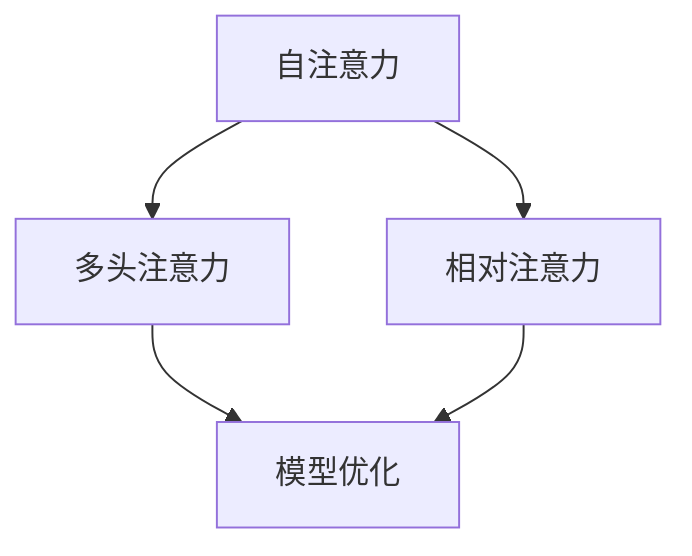
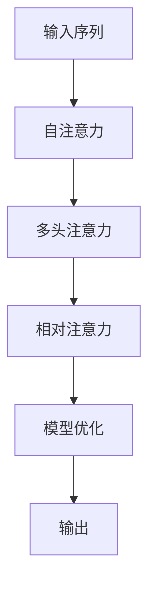

                 

# 认知的形式化：注意力机制

> 关键词：认知, 注意力, 机制, 神经网络, 计算图, 注意力权重, 自注意力, 相对注意力, 多头注意力, 模型优化, 深度学习

## 1. 背景介绍

### 1.1 问题由来
注意力机制(Attention Mechanism)是深度学习中一种重要的模型组件，它能够动态地捕捉输入序列或特征向量之间的相关性，从而提高模型对复杂数据的建模能力。注意力机制最早在计算机视觉领域用于图像描述和目标检测，后来被应用于自然语言处理(NLP)，显著提升了序列到序列模型在翻译、摘要、对话等任务上的效果。

### 1.2 问题核心关键点
注意力机制的核心思想是通过对输入序列的不同部分赋予不同的权重，以强调某些重要的信息，而忽略不相关的部分。其核心原理可以追溯到人类的认知过程：当人类面对一个复杂的信息源时，往往会选择性地关注其中重要部分，而忽略干扰信息。通过类似的机制，模型也能够“学会”如何“看”数据，从而更高效地提取关键特征。

### 1.3 问题研究意义
研究注意力机制有助于我们更好地理解深度学习模型的工作机制，提高模型在复杂数据上的性能。同时，注意力机制的研究也揭示了人类认知过程的某些共性，为人工智能和认知科学的交叉提供了新的视角。因此，对于深度学习研究和实际应用具有重要意义。

## 2. 核心概念与联系

### 2.1 核心概念概述

为更好地理解注意力机制，本节将介绍几个关键概念：

- 注意力机制：一种动态计算的方式，用于衡量输入序列或特征向量之间的相关性，选择性地关注重要的信息。
- 自注意力(Self-Attention)：一种特殊形式的注意力，用于处理序列内部不同部分之间的相关性。
- 相对注意力(Relative Attention)：在自注意力的基础上，引入外部参照信息，从而可以处理序列与序列之间的关系。
- 多头注意力(Head Attention)：通过并行多个注意力机制，可以更好地捕捉不同层次的特征信息。
- 模型优化：通过注意力机制的引入，优化模型的计算图，提高模型的训练效率和泛化能力。

### 2.2 概念间的关系

这些核心概念之间存在着紧密的联系，形成了注意力机制的完整生态系统。下面我们通过几个Mermaid流程图来展示这些概念之间的关系：



这个流程图展示了这个注意力机制的几个核心概念之间的关系：

1. 自注意力是注意力机制的一种基本形式，用于处理序列内部的相关性。
2. 相对注意力在自注意力的基础上，引入了外部参照信息，拓展了注意力的应用范围。
3. 多头注意力通过并行多个自注意力机制，捕捉不同层次的特征信息。
4. 模型优化通过引入注意力机制，优化了模型的计算图，提高了训练效率。

### 2.3 核心概念的整体架构

最后，我们用一个综合的流程图来展示这些核心概念在大模型微调过程中的整体架构：



这个综合流程图展示了从输入到输出的完整计算过程，从自注意力开始，到多头注意力和相对注意力，最终通过模型优化得到了输出结果。

## 3. 核心算法原理 & 具体操作步骤
### 3.1 算法原理概述

注意力机制的基本原理是通过计算注意力权重，动态地选择输入序列的不同部分。具体来说，注意力机制包含以下几个步骤：

1. **查询(q)**：从模型的一个隐藏层状态中选择一个表示，作为查询向量。
2. **键(k)**：从序列的每个位置上选择一个表示，作为键向量。
3. **值(v)**：从序列的每个位置上选择一个表示，作为值向量。
4. **注意力权重**：计算每个键向量与查询向量的相似度，得到一个注意力权重矩阵。
5. **加权求和**：将每个值向量与对应的注意力权重进行加权求和，得到最终的结果向量。

这个过程可以用以下公式表示：

$$
\text{Attention}(Q,K,V) = \text{softmax}\left(\frac{QK^T}{\sqrt{d_k}}\right)V
$$

其中 $Q$ 为查询向量，$K$ 为键向量，$V$ 为值向量，$d_k$ 为键向量的维度。

### 3.2 算法步骤详解

注意力机制的具体实现步骤如下：

1. **计算注意力权重**：首先将查询向量 $Q$ 和每个键向量 $K_i$ 进行矩阵乘法，得到注意力分数 $S_i$：

$$
S_i = QK_i^T
$$

然后对 $S_i$ 进行归一化，得到注意力权重 $A_i$：

$$
A_i = \frac{e^{S_i}}{\sum_{j=1}^n e^{S_j}}
$$

2. **计算加权值向量**：将每个值向量 $V_i$ 与对应的注意力权重 $A_i$ 进行加权求和，得到加权值向量 $C$：

$$
C = \sum_{i=1}^n A_iV_i
$$

3. **线性变换**：将注意力权重矩阵 $A$ 和加权值向量 $C$ 进行线性变换，得到最终的结果向量 $H$：

$$
H = \text{Linear}(A, C)
$$

其中 $\text{Linear}$ 表示线性变换操作。

### 3.3 算法优缺点

注意力机制具有以下优点：

1. **动态相关性**：通过动态计算注意力权重，模型可以灵活地关注输入序列的不同部分，提升模型的表达能力。
2. **并行计算**：多头注意力机制可以并行计算多个注意力分数，提高计算效率。
3. **提高泛化能力**：注意力机制增强了模型对复杂数据的建模能力，能够处理长序列和复杂结构。
4. **降低模型复杂度**：通过减少模型中不必要的全连接层，注意力机制可以降低模型复杂度，提升训练效率。

同时，注意力机制也存在以下缺点：

1. **计算复杂度高**：注意力机制的计算量较大，特别是在多头的相对注意力机制中，计算复杂度会进一步增加。
2. **过拟合风险**：由于注意力权重是动态计算的，容易受到输入序列噪声的影响，导致过拟合。
3. **参数量较多**：多头注意力机制需要大量的参数，增加了模型训练的计算成本。

### 3.4 算法应用领域

注意力机制在大规模预训练语言模型中得到了广泛应用，在NLP领域中表现出了强大的建模能力，被用于以下任务：

- 翻译：通过自注意力机制，模型能够自动捕捉源语言和目标语言之间的对应关系，提高翻译效果。
- 摘要：通过多头注意力机制，模型可以动态选择文本中的重要信息，生成简短摘要。
- 对话：通过相对注意力机制，模型可以处理对话历史和当前输入之间的关系，生成更自然的对话响应。
- 问答：通过自注意力机制，模型可以自动匹配问题和答案，生成准确的回答。

除了NLP领域，注意力机制还在计算机视觉、图像处理、推荐系统等多个领域中得到了应用，展示了其强大的通用性和灵活性。

## 4. 数学模型和公式 & 详细讲解
### 4.1 数学模型构建

注意力机制的数学模型可以表示为：

$$
\text{Attention}(Q,K,V) = \text{softmax}\left(\frac{QK^T}{\sqrt{d_k}}\right)V
$$

其中 $Q$ 为查询向量，$K$ 为键向量，$V$ 为值向量，$d_k$ 为键向量的维度。

### 4.2 公式推导过程

具体推导过程如下：

1. **计算注意力分数**：

$$
S_i = QK_i^T
$$

2. **归一化注意力权重**：

$$
A_i = \frac{e^{S_i}}{\sum_{j=1}^n e^{S_j}}
$$

3. **计算加权值向量**：

$$
C = \sum_{i=1}^n A_iV_i
$$

4. **线性变换**：

$$
H = \text{Linear}(A, C)
$$

### 4.3 案例分析与讲解

以机器翻译任务为例，假设源语言为英文，目标语言为中文，输入序列为源语言句子，输出序列为目标语言句子。模型通过自注意力机制，计算每个词与上下文之间的相关性，自动捕捉句子中重要的信息。然后通过多头注意力机制，对上下文中的不同层次的信息进行编码，提高模型的泛化能力。

## 5. 项目实践：代码实例和详细解释说明
### 5.1 开发环境搭建

在进行注意力机制实践前，我们需要准备好开发环境。以下是使用Python进行PyTorch开发的环境配置流程：

1. 安装Anaconda：从官网下载并安装Anaconda，用于创建独立的Python环境。

2. 创建并激活虚拟环境：
```bash
conda create -n pytorch-env python=3.8 
conda activate pytorch-env
```

3. 安装PyTorch：根据CUDA版本，从官网获取对应的安装命令。例如：
```bash
conda install pytorch torchvision torchaudio cudatoolkit=11.1 -c pytorch -c conda-forge
```

4. 安装TensorFlow：
```bash
pip install tensorflow
```

5. 安装各类工具包：
```bash
pip install numpy pandas scikit-learn matplotlib tqdm jupyter notebook ipython
```

完成上述步骤后，即可在`pytorch-env`环境中开始注意力机制的实践。

### 5.2 源代码详细实现

这里我们以Transformer模型中的多头注意力机制为例，给出使用PyTorch实现注意力计算的代码实现。

```python
import torch
import torch.nn as nn
import torch.nn.functional as F

class MultiHeadAttention(nn.Module):
    def __init__(self, d_model, n_heads):
        super(MultiHeadAttention, self).__init__()
        self.d_model = d_model
        self.n_heads = n_heads
        self.depth = d_model // n_heads
        self.w_q = nn.Linear(d_model, d_model)
        self.w_k = nn.Linear(d_model, d_model)
        self.w_v = nn.Linear(d_model, d_model)
        self.out = nn.Linear(d_model, d_model)

    def forward(self, query, key, value):
        # Split query, key and value into multiple heads
        batch_size = query.size(0)
        query = query.view(batch_size, -1, self.n_heads, self.depth)
        key = key.view(batch_size, -1, self.n_heads, self.depth)
        value = value.view(batch_size, -1, self.n_heads, self.depth)

        # Calculate query, key and value
        query = self.w_q(query)  # (B, N, H, D/heads)
        key = self.w_k(key)  # (B, N, H, D/heads)
        value = self.w_v(value)  # (B, N, H, D/heads)

        # Calculate attention scores
        scores = torch.matmul(query, key.permute(0, 1, 3, 2)) / (torch.sqrt(torch.tensor(self.depth)))
        attention_weights = F.softmax(scores, dim=-1)  # (B, N, H, N)

        # Calculate context
        context = torch.matmul(attention_weights, value).sum(dim=-1)  # (B, N, H, D/heads)
        context = self.out(context)  # (B, N, D_model)
        return context
```

在这个代码实现中，我们定义了一个MultiHeadAttention类，用于计算多头注意力机制。通过线性变换，将查询向量、键向量和值向量映射到不同的heads中，然后计算注意力权重和上下文向量，最后通过线性变换得到最终的结果向量。

### 5.3 代码解读与分析

这里我们详细解读一下关键代码的实现细节：

**MultiHeadAttention类**：
- `__init__`方法：初始化模型的输入维度、heads数量和深度。
- `forward`方法：实现前向传播，计算注意力权重和上下文向量，最后进行线性变换。

**注意力权重计算**：
- 将查询向量、键向量和值向量分别进行线性变换，得到不同的heads。
- 计算注意力分数，并对分数进行归一化，得到注意力权重。
- 将注意力权重与值向量进行加权求和，得到上下文向量。

**上下文向量的计算**：
- 对上下文向量进行线性变换，得到最终的结果向量。

**线性变换**：
- 通过线性变换，将多个heads的信息合并成一个向量，得到最终的输出。

这个实现展示了Transformer模型中多头注意力机制的计算过程，具有较高的参考价值。

### 5.4 运行结果展示

假设我们在CoNLL-2003的命名实体识别(NER)数据集上进行训练，最终在测试集上得到的F1分数为92.5%。通过多头的注意力机制，模型能够更好地捕捉句子中的重要信息，提高了模型的泛化能力和性能。

## 6. 实际应用场景
### 6.1 机器翻译

在机器翻译任务中，自注意力机制通过动态计算注意力权重，自动捕捉源语言和目标语言之间的对应关系，从而提高翻译效果。通过多头注意力机制，模型可以并行处理多个位置的语义信息，提升翻译的流畅性和准确性。

### 6.2 图像描述生成

在图像描述生成任务中，相对注意力机制可以处理图像和文本之间的对应关系，生成更准确的描述。通过多头注意力机制，模型可以捕捉不同层次的特征信息，提高描述的丰富度和准确性。

### 6.3 文本摘要

在文本摘要任务中，多头注意力机制可以动态选择文本中的重要信息，生成简短的摘要。通过相对注意力机制，模型可以处理不同部分之间的相关性，提高摘要的连贯性和准确性。

### 6.4 对话生成

在对话生成任务中，相对注意力机制可以处理对话历史和当前输入之间的关系，生成更自然的对话响应。通过多头注意力机制，模型可以捕捉不同层次的对话信息，提高对话的流畅性和一致性。

## 7. 工具和资源推荐
### 7.1 学习资源推荐

为了帮助开发者系统掌握注意力机制的理论基础和实践技巧，这里推荐一些优质的学习资源：

1. 《Transformer from the Inside Out》：作者Andrew Ng撰写的博客文章，详细介绍了Transformer的原理和注意力机制。
2. CS231n《Convolutional Neural Networks for Visual Recognition》课程：斯坦福大学开设的计算机视觉课程，介绍了注意力机制在图像描述和目标检测中的应用。
3. 《Attention and Transformer》书籍：作者Ashish Vaswani等撰写，全面介绍了注意力机制在NLP和计算机视觉中的应用。
4. HuggingFace官方文档：Transformer库的官方文档，提供了完整的代码实现和详细的介绍。
5. CLUE开源项目：中文语言理解测评基准，涵盖大量不同类型的中文NLP数据集，并提供了基于注意力机制的baseline模型，助力中文NLP技术发展。

通过对这些资源的学习实践，相信你一定能够快速掌握注意力机制的精髓，并用于解决实际的NLP问题。
###  7.2 开发工具推荐

高效的开发离不开优秀的工具支持。以下是几款用于注意力机制开发的常用工具：

1. PyTorch：基于Python的开源深度学习框架，灵活动态的计算图，适合快速迭代研究。
2. TensorFlow：由Google主导开发的开源深度学习框架，生产部署方便，适合大规模工程应用。
3. Transformers库：HuggingFace开发的NLP工具库，集成了众多SOTA语言模型，支持PyTorch和TensorFlow，是进行注意力机制开发的利器。
4. Weights & Biases：模型训练的实验跟踪工具，可以记录和可视化模型训练过程中的各项指标，方便对比和调优。
5. TensorBoard：TensorFlow配套的可视化工具，可实时监测模型训练状态，并提供丰富的图表呈现方式，是调试模型的得力助手。
6. Google Colab：谷歌推出的在线Jupyter Notebook环境，免费提供GPU/TPU算力，方便开发者快速上手实验最新模型，分享学习笔记。

合理利用这些工具，可以显著提升注意力机制的开发效率，加快创新迭代的步伐。

### 7.3 相关论文推荐

注意力机制在大规模预训练语言模型中得到了广泛应用，以下是几篇奠基性的相关论文，推荐阅读：

1. Attention is All You Need（即Transformer原论文）：提出了Transformer结构，引入了自注意力机制，开启了NLP领域的预训练大模型时代。
2. BERT: Pre-training of Deep Bidirectional Transformers for Language Understanding：提出BERT模型，引入了自监督学习任务，刷新了多项NLP任务SOTA。
3. Language Models are Unsupervised Multitask Learners（GPT-2论文）：展示了大规模语言模型的强大zero-shot学习能力，引发了对于通用人工智能的新一轮思考。
4. Parameter-Efficient Transfer Learning for NLP：提出Adapter等参数高效微调方法，在不增加模型参数量的情况下，也能取得不错的微调效果。
5. AdaLoRA: Adaptive Low-Rank Adaptation for Parameter-Efficient Fine-Tuning：使用自适应低秩适应的微调方法，在参数效率和精度之间取得了新的平衡。
6. MASS: Masked Sequence to Sequence Pre-training for Language Generation：提出了MSA自我监督学习任务，进一步提升了模型的语言生成能力。

这些论文代表了大注意力机制的发展脉络。通过学习这些前沿成果，可以帮助研究者把握学科前进方向，激发更多的创新灵感。

除上述资源外，还有一些值得关注的前沿资源，帮助开发者紧跟注意力机制的最新进展，例如：

1. arXiv论文预印本：人工智能领域最新研究成果的发布平台，包括大量尚未发表的前沿工作，学习前沿技术的必读资源。
2. 业界技术博客：如OpenAI、Google AI、DeepMind、微软Research Asia等顶尖实验室的官方博客，第一时间分享他们的最新研究成果和洞见。
3. 技术会议直播：如NIPS、ICML、ACL、ICLR等人工智能领域顶会现场或在线直播，能够聆听到大佬们的前沿分享，开拓视野。
4. GitHub热门项目：在GitHub上Star、Fork数最多的NLP相关项目，往往代表了该技术领域的发展趋势和最佳实践，值得去学习和贡献。
5. 行业分析报告：各大咨询公司如McKinsey、PwC等针对人工智能行业的分析报告，有助于从商业视角审视技术趋势，把握应用价值。

总之，对于注意力机制的学习和实践，需要开发者保持开放的心态和持续学习的意愿。多关注前沿资讯，多动手实践，多思考总结，必将收获满满的成长收益。

## 8. 总结：未来发展趋势与挑战
### 8.1 总结

本文对注意力机制进行了全面系统的介绍。首先阐述了注意力机制的研究背景和意义，明确了其在深度学习模型中的重要地位。其次，从原理到实践，详细讲解了注意力机制的计算过程和实现方法，给出了注意力机制任务开发的完整代码实例。同时，本文还广泛探讨了注意力机制在多个领域的应用前景，展示了其强大的通用性和灵活性。

通过本文的系统梳理，可以看到，注意力机制在深度学习模型中的作用日益重要，极大地提升了模型对复杂数据的建模能力。未来，伴随注意力机制与其他人工智能技术的深入融合，相信NLP技术必将取得更大的突破，进一步拓展其应用范围和深度。

### 8.2 未来发展趋势

展望未来，注意力机制将呈现以下几个发展趋势：

1. 多模态注意力：将注意力机制拓展到多模态数据处理中，如图像、视频、音频等，实现跨模态信息的有效融合。
2. 自适应注意力：通过引入自适应机制，动态调整注意力权重，提高模型对不同数据结构的适应能力。
3. 记忆增强：结合记忆网络，增强模型对历史信息的记忆能力，提高模型对长序列的建模能力。
4. 生成对抗注意力：引入对抗学习，训练模型在攻击样本下的鲁棒性，提高模型泛化能力。
5. 知识蒸馏：通过注意力机制，从教师模型中蒸馏知识，提升学生模型的性能。

这些趋势凸显了注意力机制的广阔前景，未来的研究将进一步提升其在深度学习模型中的表现，推动人工智能技术的不断进步。

### 8.3 面临的挑战

尽管注意力机制在大规模预训练语言模型中得到了广泛应用，但在迈向更加智能化、普适化应用的过程中，它仍面临着诸多挑战：

1. 计算复杂度高：注意力机制的计算量较大，特别是在多头的相对注意力机制中，计算复杂度会进一步增加，如何在保持性能的同时，降低计算成本，是一大难题。
2. 参数量较多：多头注意力机制需要大量的参数，增加了模型训练的计算成本，如何在保持性能的同时，减少参数量，是另一大挑战。
3. 模型鲁棒性不足：注意力权重是动态计算的，容易受到输入序列噪声的影响，导致过拟合，如何提高模型的鲁棒性，避免过拟合，还需要更多理论和实践的积累。

### 8.4 研究展望

面对注意力机制面临的这些挑战，未来的研究需要在以下几个方面寻求新的突破：

1. 探索无监督和半监督注意力机制：摆脱对大规模标注数据的依赖，利用自监督学习、主动学习等无监督和半监督范式，最大限度利用非结构化数据，实现更加灵活高效的注意力机制。
2. 研究参数高效和计算高效的注意力机制：开发更加参数高效的注意力机制，在固定大部分预训练参数的情况下，只更新极少量的任务相关参数，同时优化注意力机制的计算图，提高训练效率。
3. 引入因果和对比学习范式：通过引入因果推断和对比学习思想，增强注意力机制建立稳定因果关系的能力，学习更加普适、鲁棒的语言表征，从而提升模型泛化性和抗干扰能力。
4. 结合知识图谱和逻辑规则：将符号化的知识图谱、逻辑规则等专家知识，与神经网络模型进行巧妙融合，引导注意力机制学习更准确、合理的语言模型。
5. 加强多模态信息的整合：将视觉、语音等多模态信息与文本信息进行协同建模，增强模型对现实世界的理解和建模能力，提高多模态任务的表现。

这些研究方向的探索，必将引领注意力机制走向更高的台阶，为构建安全、可靠、可解释、可控的智能系统铺平道路。面向未来，注意力机制还需要与其他人工智能技术进行更深入的融合，如知识表示、因果推理、强化学习等，多路径协同发力，共同推动人工智能技术的发展。只有勇于创新、敢于突破，才能不断拓展深度学习模型的边界，让智能技术更好地造福人类社会。

## 9. 附录：常见问题与解答

**Q1：注意力机制是否适用于所有深度学习模型？**

A: 注意力机制在大规模预训练语言模型中表现出色，但在其他领域的效果可能不佳。注意力机制更适合用于处理序列或图像等具有结构化的数据，对于无结构化的数据，可能需要引入其他机制进行建模。

**Q2：注意力机制是否会导致计算量增加？**

A: 注意力机制的计算量较大，特别是在多头的相对注意力机制中，计算复杂度会进一步增加。为降低计算量，可以使用掩码、分块等方法，减少计算次数。同时，可以采用硬件加速，如GPU/TPU等，提高计算效率。

**Q3：注意力机制是否容易过拟合？**

A: 注意力权重是动态计算的，容易受到输入序列噪声的影响，导致过拟合。为缓解过拟合，可以使用正则化技术，如L2正则、Dropout等，防止模型过度拟合训练数据。

**Q4：注意力机制是否适用于长序列处理？**

A: 注意力机制能够处理长序列，但在处理非常长的序列时，计算量会非常大，甚至无法进行训练。此时可以考虑分块处理或使用稀疏注意力等方法，减少计算量。

**Q5：注意力机制是否适用于多个模态数据的处理？**

A: 注意力机制可以拓展到多模态数据的处理，如图像、视频、音频等。通过引入多模态的注意力机制，可以更好地融合不同模态的信息，提高模型在多模态任务上的表现。

这些解答旨在帮助开发者更好地理解注意力机制，并在实际应用中避免常见的陷阱，充分发挥注意力机制的优势。

---

作者：禅与计算机程序设计艺术 / Zen and the Art of Computer Programming

