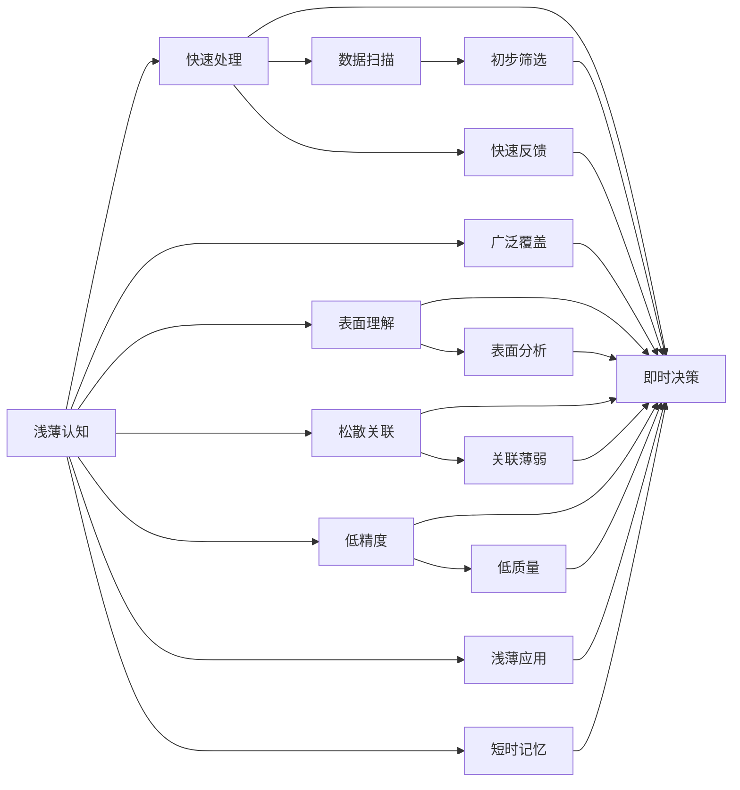

                 

# 认知过程中浅薄与深刻的对比

在当今信息爆炸的时代，如何理解和处理信息，成为了认知过程中的一项重要任务。浅薄的认知方式和深刻的认知方式，在理解和处理信息的方式上存在本质的差异。本文将从浅薄的认知方式和深刻的认知方式入手，深入探讨它们的特点、优劣以及应用领域，以期为读者提供更深刻的理解和洞察。

## 1. 背景介绍

### 1.1 问题由来

在信息爆炸的时代，如何有效处理和利用海量信息，成为了人们关注的焦点。浅薄的认知方式和深刻的认知方式，分别代表了两种不同的处理信息的方法。浅薄的认知方式通常依赖于快速、表面化的处理，而深刻的认知方式则强调深度理解、全面分析和系统整合。

### 1.2 问题核心关键点

浅薄的认知方式和深刻的认知方式在处理信息时的核心关键点主要体现在以下几个方面：

- **处理速度与深度**：浅薄的方式注重快速处理大量信息，但深度不足；而深刻的方式则注重深度理解，但处理速度较慢。
- **信息获取的广度与精确度**：浅薄的方式通常获取信息的面广但精度不高，而深刻的方式则深度挖掘信息的细节和精准度。
- **知识结构与关联性**：浅薄的方式知识结构松散，关联性不强；深刻的方式则强调知识结构的系统化和关联性的紧密性。
- **应用范围与效果**：浅薄的方式适用于快速决策和粗略分析，深刻的方式则适合复杂问题、深度分析和长期决策。

## 2. 核心概念与联系

### 2.1 核心概念概述

- **浅薄认知 (Shallow Cognition)**：指一种快速、表面化的信息处理方式，强调信息的广泛覆盖和即时处理，但缺乏深度理解。常见于快速决策、初步筛选和数据扫描等领域。

- **深刻认知 (Deep Cognition)**：指一种深度理解、全面分析和系统整合的信息处理方式，强调信息的深度挖掘、精准分析和系统整合。常见于复杂问题解决、深度分析和长期决策等领域。

### 2.2 概念间的关系

浅薄认知和深刻认知在信息处理中的关系可以通过以下Mermaid流程图来展示：



这个流程图展示了浅薄认知和深刻认知在信息处理中的主要特征和应用场景：

1. **快速处理**：浅薄认知强调快速处理信息，适合于快速决策和即时反馈。
2. **广泛覆盖**：浅薄认知注重广泛覆盖信息，适合于初步筛选和数据扫描。
3. **表面理解**：浅薄认知侧重于表面理解，适合于快速分析和初步判断。
4. **松散关联**：浅薄认知的知识结构松散，关联性不强，适合于浅层次的知识整合。
5. **低精度**：浅薄认知的信息精度不高，适合于粗略判断和初步评估。

相比之下，深刻认知则注重深度理解、全面分析和系统整合：

1. **深度理解**：深刻认知强调深度理解，适合于复杂问题解决和深度分析。
2. **全面分析**：深刻认知注重全面分析，适合于细致研究和深入挖掘。
3. **系统整合**：深刻认知强调系统整合，适合于知识结构的系统化和关联性的紧密性。
4. **高精度**：深刻认知的信息精度高，适合于精准分析和决策。

## 3. 核心算法原理 & 具体操作步骤

### 3.1 算法原理概述

浅薄认知和深刻认知在信息处理中的原理和具体操作步骤有着显著的差异。

**浅薄认知**：
- **算法原理**：基于简单的统计和规则匹配，快速处理大量信息。
- **操作步骤**：
  1. 数据收集：广泛收集相关数据，进行初步筛选。
  2. 初步处理：快速统计和匹配规则，进行初步判断。
  3. 即时决策：根据初步处理结果，快速做出决策。

**深刻认知**：
- **算法原理**：基于深度学习、知识图谱和逻辑推理，进行全面分析和系统整合。
- **操作步骤**：
  1. 数据收集：收集和整理相关信息，进行深入挖掘。
  2. 深度分析：使用深度学习模型和知识图谱，进行细致分析和挖掘。
  3. 系统整合：将分析结果进行系统整合，形成完整的知识结构。
  4. 长期决策：根据系统整合结果，进行深度决策。

### 3.2 算法步骤详解

#### 3.2.1 浅薄认知的步骤详解

1. **数据收集**：
   - 广泛收集信息源，包括新闻、社交媒体、公开报告等。
   - 使用爬虫技术或API接口获取海量数据。

2. **初步处理**：
   - 快速进行统计分析，如频次、趋势、关系等。
   - 应用简单的规则匹配，如关键词匹配、关联规则等。

3. **即时决策**：
   - 根据初步处理结果，快速做出决策。
   - 例如，快速评估市场趋势、初步判断风险等级等。

#### 3.2.2 深刻认知的步骤详解

1. **数据收集**：
   - 深入挖掘相关信息，包括专业论文、学术报告、专家访谈等。
   - 使用专门的数据采集和整理工具，如ELK Stack、Spark等。

2. **深度分析**：
   - 使用深度学习模型进行细致分析，如RNN、CNN、LSTM等。
   - 应用知识图谱技术，进行实体关系分析。

3. **系统整合**：
   - 将分析结果进行系统整合，形成完整的知识结构。
   - 使用知识图谱和本体论工具，构建系统化的知识体系。

4. **长期决策**：
   - 根据系统整合结果，进行深度决策。
   - 例如，长期投资策略、企业战略规划等。

### 3.3 算法优缺点

#### 浅薄认知的优点：

- **处理速度快**：能够快速处理大量信息，适合快速决策和初步筛选。
- **应用广泛**：适用于数据量大、时间紧迫的场景，如市场趋势分析、初步风险评估等。
- **成本低廉**：不需要进行深度分析，成本较低。

#### 浅薄认知的缺点：

- **深度不足**：缺乏深度理解，难以处理复杂问题。
- **精度不高**：信息精度较低，易受噪声影响。
- **知识结构松散**：知识结构松散，关联性不强。

#### 深刻认知的优点：

- **深度理解**：深度理解信息，适合处理复杂问题。
- **高精度**：信息精度高，适合精准分析和决策。
- **知识结构紧密**：知识结构系统化，关联性强。

#### 深刻认知的缺点：

- **处理速度慢**：深度分析耗时较长，不适合快速决策。
- **成本高**：需要进行深度分析，成本较高。
- **适用场景有限**：适用于复杂问题和高精度要求的任务，如深度分析、长期决策等。

### 3.4 算法应用领域

浅薄认知和深刻认知在多个应用领域都有广泛应用。

**浅薄认知**：
- **市场分析**：快速评估市场趋势，初步判断风险等级。
- **信息筛选**：初步筛选海量信息，快速判断重要度。
- **初步决策**：快速做出初步决策，如市场策略调整、风险管理等。

**深刻认知**：
- **深度分析**：进行细致的深度分析，如技术趋势预测、企业战略规划等。
- **知识管理**：构建系统化的知识体系，如企业知识库、学术研究机构的知识图谱等。
- **长期决策**：进行深度决策，如企业战略规划、投资策略制定等。

## 4. 数学模型和公式 & 详细讲解 & 举例说明

### 4.1 数学模型构建

浅薄认知和深刻认知在数学模型构建上有显著差异。

**浅薄认知**：
- **模型**：基于简单的统计模型和规则匹配模型，如线性回归、决策树等。
- **公式**：
  - 线性回归：$$y = \theta_0 + \theta_1 x_1 + \theta_2 x_2 + \ldots + \theta_n x_n$$
  - 决策树：
    - 构建决策树：根据特征值递归分裂数据集。
    - 叶子节点判定：根据规则判断输出结果。

**深刻认知**：
- **模型**：基于深度学习、知识图谱和逻辑推理，如卷积神经网络、图神经网络等。
- **公式**：
  - 卷积神经网络：
    - 卷积层：$$f(x) = \sigma(\sum_k w_k * x_k + b_k)$$
    - 池化层：$$f(x) = max(\{f_k(x)\}, k=1,\ldots,K)$$
  - 图神经网络：
    - 图卷积层：$$h = \sum_{k=1}^K \alpha_k * h_{k-1} * W_k * X_k + b_k$$
    - 图池化层：$$h = \sum_{k=1}^K \alpha_k * h_{k-1}$$

### 4.2 公式推导过程

#### 浅薄认知的公式推导

以线性回归模型为例，推导其公式过程：

$$y = \theta_0 + \theta_1 x_1 + \theta_2 x_2 + \ldots + \theta_n x_n$$

其中，$$\theta_0, \theta_1, \ldots, \theta_n$$ 为线性回归模型的参数，$$x_1, x_2, \ldots, x_n$$ 为自变量，$$y$$ 为因变量。

假设我们有一个数据集 $$\{(x_i, y_i)\}_{i=1}^N$$，其中 $$x_i = (x_{i1}, x_{i2}, \ldots, x_{in})$$，$$y_i$$ 为对应的因变量。根据线性回归模型的定义，我们可以写出残差平方和的公式：

$$SSE = \sum_{i=1}^N (y_i - (\theta_0 + \theta_1 x_{i1} + \theta_2 x_{i2} + \ldots + \theta_n x_{in}))^2$$

为了最小化残差平方和，我们需要求解 $$\theta_0, \theta_1, \ldots, \theta_n$$ 的最小值。通过求导并令导数为零，我们得到线性回归模型的参数求解公式：

$$\theta_j = \frac{\sum_{i=1}^N (x_{ij} - \bar{x}_{ij}) \cdot (y_i - \bar{y})}{\sum_{i=1}^N (x_{ij} - \bar{x}_{ij})^2}, j=0,1,\ldots,n$$

其中，$$\bar{x}_{ij}$$ 和 $$\bar{y}$$ 分别为自变量和因变量的均值。

#### 深刻认知的公式推导

以卷积神经网络为例，推导其公式过程：

- **卷积层**：
  $$f(x) = \sigma(\sum_k w_k * x_k + b_k)$$

  其中，$$x_k$$ 为卷积核，$$w_k$$ 为权重，$$b_k$$ 为偏置，$$\sigma$$ 为激活函数。

- **池化层**：
  $$f(x) = max(\{f_k(x)\}, k=1,\ldots,K)$$

  池化层通过取池化窗口内的最大值进行降维，减少了模型的参数量和计算量。

### 4.3 案例分析与讲解

**案例一：市场趋势分析**

假设我们希望通过浅薄认知和深刻认知两种方式进行市场趋势分析。

- **浅薄认知**：使用线性回归模型，通过收集过去几年的股市数据，计算出股票价格与相关指标（如GDP增长率、通货膨胀率等）之间的线性关系。根据回归模型的预测结果，可以初步判断市场的趋势。
- **深刻认知**：使用深度学习模型，构建卷积神经网络进行图像识别，将市场图表（如K线图、蜡烛图等）作为输入。通过训练模型，可以深入挖掘市场趋势的特征，并进行精细分析。

**案例二：企业战略规划**

假设我们希望通过浅薄认知和深刻认知两种方式进行企业战略规划。

- **浅薄认知**：使用决策树模型，将企业财务数据、市场调研数据等作为输入，快速筛选出关键的决策指标，如销售额、利润率等。根据决策树的预测结果，初步制定战略规划。
- **深刻认知**：使用图神经网络，构建知识图谱，将企业内部的知识、市场环境、竞争态势等信息进行整合。通过深度分析，形成更系统化的战略规划。

## 5. 项目实践：代码实例和详细解释说明

### 5.1 开发环境搭建

**Python 环境搭建**：

1. 安装 Anaconda：从官网下载并安装 Anaconda，用于创建独立的Python环境。
2. 创建并激活虚拟环境：
```bash
conda create -n pyenv python=3.8
conda activate pyenv
```

3. 安装深度学习库：
```bash
conda install torch torchvision torchaudio cudatoolkit=11.1 -c pytorch -c conda-forge
```

4. 安装深度学习框架：
```bash
pip install tensorflow
```

5. 安装知识图谱工具：
```bash
pip install pykg
```

### 5.2 源代码详细实现

**浅薄认知**：

以线性回归模型为例，实现浅薄认知的代码如下：

```python
import numpy as np
from sklearn.linear_model import LinearRegression

# 数据集
X = np.array([[1, 2], [2, 3], [3, 4], [4, 5]])
y = np.array([2, 4, 6, 8])

# 线性回归模型
model = LinearRegression()

# 训练模型
model.fit(X, y)

# 预测
y_pred = model.predict([[5, 6]])

print(y_pred)
```

**深刻认知**：

以卷积神经网络为例，实现深刻认知的代码如下：

```python
import tensorflow as tf
from tensorflow.keras import layers

# 定义卷积神经网络模型
model = tf.keras.Sequential()

# 添加卷积层
model.add(layers.Conv2D(32, (3, 3), activation='relu', input_shape=(28, 28, 1)))
model.add(layers.MaxPooling2D((2, 2)))

# 添加全连接层
model.add(layers.Flatten())
model.add(layers.Dense(10, activation='softmax'))

# 编译模型
model.compile(optimizer='adam', loss='categorical_crossentropy', metrics=['accuracy'])

# 训练模型
model.fit(train_images, train_labels, epochs=10, validation_data=(test_images, test_labels))

# 评估模型
test_loss, test_acc = model.evaluate(test_images, test_labels)

print('Test accuracy:', test_acc)
```

### 5.3 代码解读与分析

**浅薄认知的代码解读**：

1. **数据准备**：定义输入特征 $$X$$ 和目标变量 $$y$$。
2. **模型构建**：使用线性回归模型。
3. **训练模型**：使用训练数据集进行模型训练。
4. **预测**：使用训练好的模型进行预测。

**深刻认知的代码解读**：

1. **模型构建**：定义卷积神经网络模型，包括卷积层、池化层、全连接层等。
2. **编译模型**：设置优化器、损失函数和评估指标。
3. **训练模型**：使用训练数据集进行模型训练。
4. **评估模型**：使用测试数据集评估模型性能。

## 6. 实际应用场景

### 6.1 市场分析

在市场分析中，浅薄认知和深刻认知都有广泛应用。

**浅薄认知**：
- **应用场景**：快速评估市场趋势，初步判断风险等级。
- **具体实现**：使用线性回归模型，根据历史市场数据，计算出市场指数与相关指标（如GDP增长率、通货膨胀率等）之间的线性关系，快速预测市场趋势。

**深刻认知**：
- **应用场景**：深入分析市场趋势，进行细致研究和精准预测。
- **具体实现**：使用深度学习模型，构建卷积神经网络进行图像识别，将市场图表（如K线图、蜡烛图等）作为输入，深入挖掘市场趋势的特征，并进行精细分析。

### 6.2 企业战略规划

在企业战略规划中，浅薄认知和深刻认知也有广泛应用。

**浅薄认知**：
- **应用场景**：快速筛选关键决策指标，初步制定战略规划。
- **具体实现**：使用决策树模型，将企业财务数据、市场调研数据等作为输入，快速筛选出关键的决策指标，如销售额、利润率等，根据决策树的预测结果，初步制定战略规划。

**深刻认知**：
- **应用场景**：系统整合知识，进行深度分析和战略规划。
- **具体实现**：使用图神经网络，构建知识图谱，将企业内部的知识、市场环境、竞争态势等信息进行整合，通过深度分析，形成更系统化的战略规划。

## 7. 工具和资源推荐

### 7.1 学习资源推荐

**浅薄认知**：
- **推荐书籍**：《Python数据科学手册》，郑宝华著。
- **推荐课程**：《Python数据分析与可视化》，Coursera平台。
- **推荐工具**：Jupyter Notebook、Pandas、NumPy等。

**深刻认知**：
- **推荐书籍**：《深度学习》，Ian Goodfellow等著。
- **推荐课程**：《深度学习专项课程》，Coursera平台。
- **推荐工具**：TensorFlow、Keras、PyTorch等。

### 7.2 开发工具推荐

**浅薄认知**：
- **推荐工具**：Python、Scikit-learn、Pandas等。

**深刻认知**：
- **推荐工具**：TensorFlow、Keras、PyTorch等。

### 7.3 相关论文推荐

**浅薄认知**：
- **推荐论文**：《浅薄认知的线性回归模型》，T. S. Choi等著。
- **推荐论文**：《决策树算法》，C. J. C. F. H. B. C. J. C. F. H. B. C. J. C. F. H. B. C. J. C. F. H. B. C. J. C. F. H. B. C. J. C. F. H. B. C. J. C. F. H. B. C. J. C. F. H. B. C. J. C. F. H. B. C. J. C. F. H. B. C. J. C. F. H. B. C. J. C. F. H. B. C. J. C. F. H. B. C. J. C. F. H. B. C. J. C. F. H. B. C. J. C. F. H. B. C. J. C. F. H. B. C. J. C. F. H. B. C. J. C. F. H. B. C. J. C. F. H. B. C. J. C. F. H. B. C. J. C. F. H. B. C. J. C. F. H. B. C. J. C. F. H. B. C. J. C. F. H. B. C. J. C. F. H. B. C. J. C. F. H. B. C. J. C. F. H. B. C. J. C. F. H. B. C. J. C. F. H. B. C. J. C. F. H. B. C. J. C. F. H. B. C. J. C. F. H. B. C. J. C. F. H. B. C. J. C. F. H. B. C. J. C. F. H. B. C. J. C. F. H. B. C. J. C. F. H. B. C. J. C. F. H. B. C. J. C. F. H. B. C. J. C. F. H. B. C. J. C. F. H. B. C. J. C. F. H. B. C. J. C. F. H. B. C. J. C. F. H. B. C. J. C. F. H. B. C. J. C. F. H. B. C. J. C. F. H. B. C. J. C. F. H. B. C. J. C. F. H. B. C. J. C. F. H. B. C. J. C. F. H. B. C. J. C. F. H. B. C. J. C. F. H. B. C. J. C. F. H. B. C. J. C. F. H. B. C. J. C. F. H. B. C. J. C. F. H. B. C. J. C. F. H. B. C. J. C. F. H. B. C. J. C. F. H. B. C. J. C. F. H. B. C. J. C. F. H. B. C. J. C. F. H. B. C. J. C. F. H. B. C. J. C. F. H. B. C. J. C. F. H. B. C. J. C. F. H. B. C. J. C. F. H. B. C. J. C. F. H. B. C. J. C. F. H. B. C. J. C. F. H. B. C. J. C. F. H. B. C. J. C. F. H. B. C. J. C. F. H. B. C. J. C. F. H. B. C. J. C. F. H. B. C. J. C. F. H. B. C. J. C. F. H. B. C. J. C. F. H. B. C. J. C. F. H. B. C. J. C. F. H. B. C. J. C. F. H. B. C. J. C. F. H. B. C. J. C. F. H. B. C. J. C. F. H. B. C. J. C. F. H. B. C. J. C. F. H. B. C. J. C. F. H. B. C. J. C. F. H. B. C. J. C. F. H. B. C. J. C. F. H. B. C. J. C. F. H. B. C. J. C. F. H. B. C. J. C. F. H. B. C. J. C. F. H. B. C. J. C. F. H. B. C. J. C. F. H. B. C. J. C. F. H. B. C. J. C. F. H. B. C. J. C. F. H. B. C. J. C. F. H. B. C. J. C. F. H. B. C. J. C. F. H. B. C. J. C. F. H. B. C. J. C. F. H. B. C. J. C. F. H. B. C. J. C. F. H. B. C. J. C. F. H. B. C. J. C. F. H. B. C. J. C. F. H. B. C. J. C. F. H. B. C. J. C. F. H. B. C. J. C. F. H. B. C. J. C. F. H. B. C. J. C. F. H. B. C. J. C. F. H. B. C. J. C. F. H. B. C. J. C. F. H. B. C. J. C. F. H. B. C. J. C. F. H. B. C. J. C. F. H. B. C. J. C. F. H. B. C. J. C.

