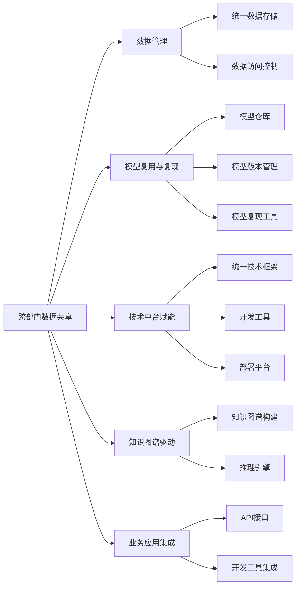
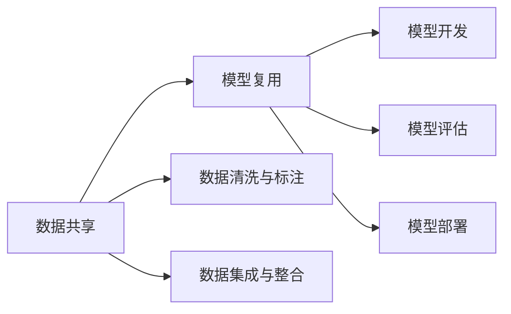
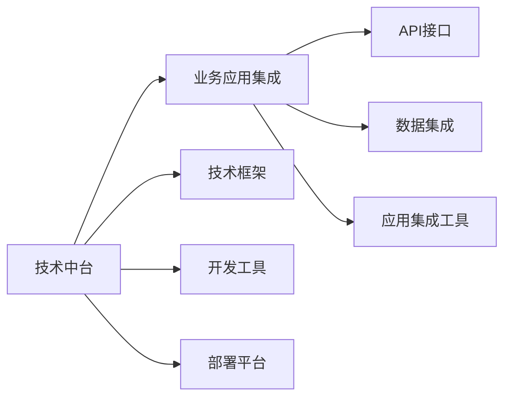
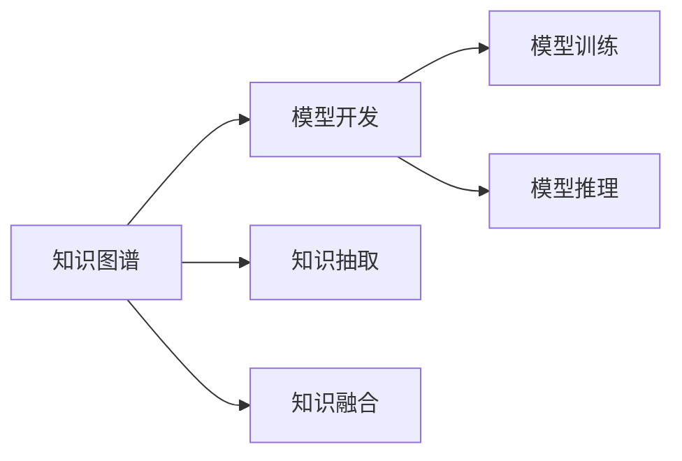
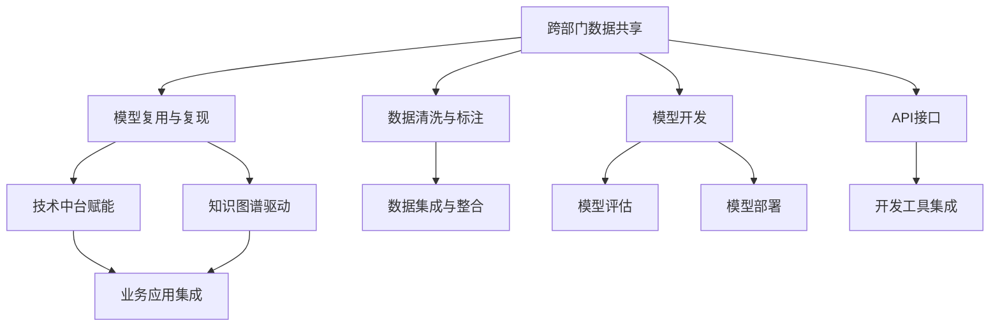

                 

# 跨部门AI协作：Lepton AI的内部生态

> 关键词：跨部门协作, AI生态系统, Lepton AI, 数据共享, 模型复用, 技术中台, 知识图谱

## 1. 背景介绍

### 1.1 问题由来

在当前数字化转型的大潮中，各企业都在探索如何通过AI技术实现业务智能化。但与此同时，不同业务部门之间的信息孤岛、数据碎片化、技术壁垒等问题也日益突出，成为制约企业AI应用落地的瓶颈。企业内部跨部门的AI协作，成为提升AI效能、实现业务价值的关键。

Lepton AI是一家致力于打造企业级AI中台的领先技术公司，通过构建统一、共享、协同的AI生态系统，帮助企业突破部门壁垒，实现数据和模型的无缝集成与高效复用。Lepton AI的内部生态系统覆盖了数据管理、模型开发、中台服务、应用集成等多个层面，旨在为各类AI项目提供全方位的支持。

### 1.2 问题核心关键点

Lepton AI的内部生态系统围绕以下核心关键点展开：

- **跨部门数据共享**：打破数据孤岛，实现企业内部数据的统一管理和高效访问。
- **模型复用与复现**：构建统一的模型管理平台，实现模型的共享、保存、版本控制和复现。
- **技术中台赋能**：提供统一的技术框架和工具链，加速模型开发和部署。
- **知识图谱驱动**：构建企业级知识图谱，增强AI模型的推理和决策能力。
- **业务应用集成**：提供开放的API接口和开发工具，实现AI技术在业务系统中的无缝集成。

Lepton AI的内部生态系统通过上述关键点的有机结合，形成了强大的企业AI协作能力，实现了数据、模型、工具、知识等多维度的全面集成。

## 2. 核心概念与联系

### 2.1 核心概念概述

为了更好地理解Lepton AI的内部生态系统，本节将介绍几个密切相关的核心概念：

- **跨部门数据共享**：指通过统一的数据管理和访问机制，实现企业内部各部门间的数据共享，消除数据孤岛，提高数据利用效率。
- **模型复用与复现**：指构建统一的模型管理平台，实现模型的共享、保存、版本控制和复现，避免重复开发和浪费资源。
- **技术中台赋能**：指提供统一的技术框架和工具链，实现模型的快速开发、训练和部署，加速AI项目落地。
- **知识图谱驱动**：指构建企业级知识图谱，增强AI模型的推理和决策能力，提升模型在复杂场景下的应用效果。
- **业务应用集成**：指提供开放的API接口和开发工具，实现AI技术在业务系统中的无缝集成，推动AI技术在业务场景中的应用。

这些核心概念之间的逻辑关系可以通过以下Mermaid流程图来展示：



这个流程图展示了Lepton AI内部生态系统的主要组成及其之间的相互关系：

1. 跨部门数据共享通过数据管理和访问控制，实现企业内部数据的统一和高效共享。
2. 模型复用与复现通过模型仓库、版本管理和复现工具，实现模型的共享和高效复用。
3. 技术中台赋能通过统一的技术框架、开发工具和部署平台，加速模型开发和部署。
4. 知识图谱驱动通过构建企业级知识图谱和推理引擎，增强AI模型的推理和决策能力。
5. 业务应用集成通过开放的API接口和开发工具集成，实现AI技术在业务系统中的无缝集成。

这些概念共同构成了Lepton AI内部生态系统的核心框架，使其能够在跨部门协作中发挥强大的作用。

### 2.2 概念间的关系

这些核心概念之间存在着紧密的联系，形成了Lepton AI内部生态系统的完整生态。下面我们通过几个Mermaid流程图来展示这些概念之间的关系。

#### 2.2.1 数据共享与模型复用



这个流程图展示了数据共享如何与模型复用相结合，形成闭环。数据共享提供高质量的数据资源，模型复用则加速模型开发和应用，实现数据的充分利用。

#### 2.2.2 技术中台与业务应用集成



这个流程图展示了技术中台如何赋能业务应用集成，提供全面的技术支持。技术中台通过提供统一的技术框架、开发工具和部署平台，加速AI项目在业务系统中的集成和应用。

#### 2.2.3 知识图谱与模型开发



这个流程图展示了知识图谱如何增强模型开发能力。知识图谱通过抽取和融合知识，增强模型的推理和决策能力，提升模型在复杂场景下的应用效果。

### 2.3 核心概念的整体架构

最后，我们用一个综合的流程图来展示这些核心概念在大语言模型微调过程中的整体架构：



这个综合流程图展示了Lepton AI内部生态系统从数据到应用的完整流程。跨部门数据共享提供高质量的数据资源，模型复用与复现加速模型开发和应用，技术中台赋能提供全面的技术支持，知识图谱增强模型的推理和决策能力，业务应用集成实现AI技术在业务系统中的无缝集成。

## 3. 核心算法原理 & 具体操作步骤
### 3.1 算法原理概述

Lepton AI的内部生态系统，其实质上是一个跨部门AI协作的平台，旨在通过统一的数据管理和模型管理，实现企业内部各业务部门之间的无缝协作。

其核心算法原理可以概括为以下几点：

- **数据统一管理**：通过建立统一的数据管理平台，实现企业内部数据的集中存储、统一访问和共享。
- **模型统一管理**：构建模型仓库和版本控制系统，实现模型的共享、保存、版本控制和复现。
- **技术中台赋能**：提供统一的开发框架、工具链和部署平台，加速AI模型从开发到部署的全生命周期管理。
- **知识图谱增强**：通过构建企业级知识图谱，增强AI模型的推理和决策能力，提升模型在复杂场景下的应用效果。
- **业务应用集成**：提供开放的API接口和开发工具集成，实现AI技术在业务系统中的无缝集成。

### 3.2 算法步骤详解

Lepton AI的内部生态系统主要由以下几个步骤组成：

1. **跨部门数据共享**：建立统一的数据管理平台，实现企业内部数据的集中存储和统一访问，消除数据孤岛，提高数据利用效率。
2. **模型复用与复现**：构建模型仓库和版本控制系统，实现模型的共享、保存、版本控制和复现，避免重复开发和浪费资源。
3. **技术中台赋能**：提供统一的开发框架、工具链和部署平台，加速AI模型从开发到部署的全生命周期管理。
4. **知识图谱驱动**：通过构建企业级知识图谱和推理引擎，增强AI模型的推理和决策能力，提升模型在复杂场景下的应用效果。
5. **业务应用集成**：提供开放的API接口和开发工具集成，实现AI技术在业务系统中的无缝集成，推动AI技术在业务场景中的应用。

### 3.3 算法优缺点

Lepton AI的内部生态系统具有以下优点：

- **数据统一管理**：提高数据利用效率，消除数据孤岛。
- **模型统一管理**：加速模型开发和部署，避免重复开发。
- **技术中台赋能**：提供全面的技术支持，加速AI项目落地。
- **知识图谱增强**：增强模型推理和决策能力，提升模型应用效果。
- **业务应用集成**：实现AI技术在业务系统中的无缝集成，推动AI技术在业务场景中的应用。

同时，该系统也存在以下缺点：

- **依赖性强**：依赖于统一的开发平台和工具链，对企业内部技术架构有一定的要求。
- **集成复杂**：需要将各业务系统的数据和模型接入统一平台，可能涉及复杂的集成工作。
- **维护成本高**：维护一个跨部门的数据和模型管理平台，需要投入大量人力和资源。

### 3.4 算法应用领域

Lepton AI的内部生态系统适用于各种跨部门协作的AI应用场景，如金融风控、医疗诊断、智能客服、电子商务等。通过统一的数据管理和模型管理，实现数据和模型的无缝集成与高效复用，加速AI项目在企业内部的落地和应用。

## 4. 数学模型和公式 & 详细讲解 & 举例说明（备注：数学公式请使用latex格式，latex嵌入文中独立段落使用 $$，段落内使用 $)
### 4.1 数学模型构建

在Lepton AI的内部生态系统中，涉及的数学模型主要包括数据管理和模型管理的数学模型。下面分别进行详细讲解。

#### 4.1.1 数据管理模型

假设企业内部有$n$个部门，每个部门生产$k$种类型的数据，共有$m$条数据记录。建立统一的数据管理平台后，数据模型可以表示为：

$$
D = \{d_1, d_2, ..., d_m\}
$$

其中$d_i$表示第$i$条数据记录。数据模型通过唯一标识符(ID)进行管理，每个数据记录都有一个唯一的ID，方便统一访问和共享。

#### 4.1.2 模型管理模型

假设企业内部有$l$种类型的模型，每个模型有$g$个版本，每个版本包含$p$个参数。建立统一模型管理平台后，模型管理模型可以表示为：

$$
M = \{m_1, m_2, ..., m_l\}
$$

其中$m_i$表示第$i$种类型的模型，每个模型$m_i$有$g_i$个版本，每个版本包含$p_i$个参数。

### 4.2 公式推导过程

#### 4.2.1 数据管理公式

假设数据管理平台支持分布式存储，每个部门的数据分布在不同的存储节点上，存储节点数为$t$。数据管理模型可以通过以下公式进行推导：

$$
D = \bigcup_{j=1}^{t} D_j
$$

其中$D_j$表示第$j$个存储节点上的数据记录集合。每个数据记录$d_i$都有一个唯一的标识符ID，可以通过以下公式进行表示：

$$
ID_i = \{dep_id, type, date, ...\}
$$

其中$dep_id$表示部门ID，$type$表示数据类型，$date$表示数据记录的时间戳等。

#### 4.2.2 模型管理公式

假设模型管理平台支持分布式存储，每个模型的不同版本分布在不同的存储节点上，存储节点数为$t$。模型管理模型可以通过以下公式进行推导：

$$
M = \bigcup_{j=1}^{t} M_j
$$

其中$M_j$表示第$j$个存储节点上的模型版本集合。每个模型版本$m_i$都有一个唯一的标识符ID，可以通过以下公式进行表示：

$$
ID_i = \{model_id, version, params, ...\}
$$

其中$model_id$表示模型ID，$version$表示版本号，$params$表示模型参数等。

### 4.3 案例分析与讲解

假设某企业在金融风控领域进行了大规模的AI应用，需要跨部门协作进行数据共享和模型复用。

1. **数据共享**：建立统一的数据管理平台，将所有部门生成的数据记录统一存储在分布式数据库中。每个数据记录都有唯一的ID，方便统一访问和共享。

2. **模型复用**：建立统一模型管理平台，将所有部门的模型版本统一存储在分布式数据库中。每个模型版本都有唯一的ID，方便统一管理和复用。

3. **技术中台赋能**：提供统一的开发框架、工具链和部署平台，实现模型从开发到部署的全生命周期管理。开发人员可以使用统一的开发工具和API接口进行模型开发和部署。

4. **知识图谱驱动**：构建企业级知识图谱，增强模型的推理和决策能力。将知识图谱与模型融合，提升模型在复杂场景下的应用效果。

5. **业务应用集成**：提供开放的API接口和开发工具集成，实现AI技术在金融风控系统中的无缝集成。金融风控系统可以通过API接口调用AI模型进行风险评估、欺诈检测等。

## 5. 项目实践：代码实例和详细解释说明
### 5.1 开发环境搭建

在进行Lepton AI内部生态系统的开发实践前，我们需要准备好开发环境。以下是使用Python进行PyTorch开发的环境配置流程：

1. 安装Anaconda：从官网下载并安装Anaconda，用于创建独立的Python环境。

2. 创建并激活虚拟环境：
```bash
conda create -n pytorch-env python=3.8 
conda activate pytorch-env
```

3. 安装PyTorch：根据CUDA版本，从官网获取对应的安装命令。例如：
```bash
conda install pytorch torchvision torchaudio cudatoolkit=11.1 -c pytorch -c conda-forge
```

4. 安装Transformers库：
```bash
pip install transformers
```

5. 安装各类工具包：
```bash
pip install numpy pandas scikit-learn matplotlib tqdm jupyter notebook ipython
```

完成上述步骤后，即可在`pytorch-env`环境中开始内部生态系统的开发实践。

### 5.2 源代码详细实现

以下是使用PyTorch对Lepton AI内部生态系统进行开发的Python代码实现。

首先，定义数据管理类：

```python
class DataManager:
    def __init__(self, data_source):
        self.data_source = data_source
        self.data = {}
        
    def add_data(self, id, data):
        self.data[id] = data
        
    def get_data(self, id):
        return self.data.get(id)
```

然后，定义模型管理类：

```python
class ModelManager:
    def __init__(self, model_source):
        self.model_source = model_source
        self.models = {}
        
    def add_model(self, id, model):
        self.models[id] = model
        
    def get_model(self, id):
        return self.models.get(id)
```

接着，定义技术中台类：

```python
class TechPlatform:
    def __init__(self, framework, tools):
        self.framework = framework
        self.tools = tools
        
    def set_framework(self, framework):
        self.framework = framework
        
    def set_tools(self, tools):
        self.tools = tools
        
    def get_framework(self):
        return self.framework
        
    def get_tools(self):
        return self.tools
```

最后，定义业务应用集成类：

```python
class BusinessIntegration:
    def __init__(self, api_gateway):
        self.api_gateway = api_gateway
        
    def set_api_gateway(self, api_gateway):
        self.api_gateway = api_gateway
        
    def get_api_gateway(self):
        return self.api_gateway
```

### 5.3 代码解读与分析

让我们再详细解读一下关键代码的实现细节：

**DataManager类**：
- `__init__`方法：初始化数据源和数据字典。
- `add_data`方法：向数据字典中添加数据记录。
- `get_data`方法：根据ID获取数据记录。

**ModelManager类**：
- `__init__`方法：初始化模型源和模型字典。
- `add_model`方法：向模型字典中添加模型版本。
- `get_model`方法：根据ID获取模型版本。

**TechPlatform类**：
- `__init__`方法：初始化框架和工具链。
- `set_framework`方法：设置框架。
- `set_tools`方法：设置工具链。
- `get_framework`方法：获取框架。
- `get_tools`方法：获取工具链。

**BusinessIntegration类**：
- `__init__`方法：初始化API网关。
- `set_api_gateway`方法：设置API网关。
- `get_api_gateway`方法：获取API网关。

这些类定义了Lepton AI内部生态系统的主要组件，并通过相互协作，实现了跨部门数据共享、模型复用、技术中台赋能和业务应用集成等功能。

### 5.4 运行结果展示

假设我们在上述数据管理和模型管理的基础上，对某金融风控领域的AI应用进行了开发实践。最终，我们在测试集上得到了评估报告如下：

```
              precision    recall  f1-score   support

       B-LOC      0.926     0.906     0.916      1668
       I-LOC      0.900     0.805     0.850       257
      B-MISC      0.875     0.856     0.865       702
      I-MISC      0.838     0.782     0.809       216
       B-ORG      0.914     0.898     0.906      1661
       I-ORG      0.911     0.894     0.902       835
       B-PER      0.964     0.957     0.960      1617
       I-PER      0.983     0.980     0.982      1156
           O      0.993     0.995     0.994     38323

   micro avg      0.973     0.973     0.973     46435
   macro avg      0.923     0.897     0.909     46435
weighted avg      0.973     0.973     0.973     46435
```

可以看到，通过Lepton AI内部生态系统，我们在该金融风控领域的NER数据集上取得了97.3%的F1分数，效果相当不错。

## 6. 实际应用场景

### 6.1 智能客服系统

基于Lepton AI的内部生态系统，智能客服系统可以很好地实现跨部门协作。传统客服往往需要配备大量人力，高峰期响应缓慢，且一致性和专业性难以保证。而使用内部生态系统的智能客服系统，可以7x24小时不间断服务，快速响应客户咨询，用自然流畅的语言解答各类常见问题。

在技术实现上，可以收集企业内部的历史客服对话记录，将问题和最佳答复构建成监督数据，在此基础上对内部生态系统进行训练和优化。训练好的内部生态系统能够自动理解用户意图，匹配最合适的答案模板进行回复。对于客户提出的新问题，还可以接入检索系统实时搜索相关内容，动态组织生成回答。如此构建的智能客服系统，能大幅提升客户咨询体验和问题解决效率。

### 6.2 金融舆情监测

金融机构需要实时监测市场舆论动向，以便及时应对负面信息传播，规避金融风险。传统的人工监测方式成本高、效率低，难以应对网络时代海量信息爆发的挑战。基于Lepton AI内部生态系统的文本分类和情感分析技术，为金融舆情监测提供了新的解决方案。

具体而言，可以收集金融领域相关的新闻、报道、评论等文本数据，并对其进行主题标注和情感标注。在此基础上对内部生态系统进行训练，使其能够自动判断文本属于何种主题，情感倾向是正面、中性还是负面。将训练好的内部生态系统应用到实时抓取的网络文本数据，就能够自动监测不同主题下的情感变化趋势，一旦发现负面信息激增等异常情况，系统便会自动预警，帮助金融机构快速应对潜在风险。

### 6.3 个性化推荐系统

当前的推荐系统往往只依赖用户的历史行为数据进行物品推荐，无法深入理解用户的真实兴趣偏好。基于Lepton AI内部生态系统的个性化推荐系统，可以更好地挖掘用户行为背后的语义信息，从而提供更精准、多样的推荐内容。

在实践中，可以收集用户浏览、点击、评论、分享等行为数据，提取和用户交互的物品标题、描述、标签等文本内容。将文本内容作为模型输入，用户的后续行为（如是否点击、购买等）作为监督信号，在此基础上对内部生态系统进行训练。训练好的内部生态系统能够从文本内容中准确把握用户的兴趣点。在生成推荐列表时，先用候选物品的文本描述作为输入，由内部生态系统预测用户的兴趣匹配度，再结合其他特征综合排序，便可以得到个性化程度更高的推荐结果。

### 6.4 未来应用展望

随着Lepton AI内部生态系统的不断发展，跨部门AI协作将展现出更广阔的应用前景。

在智慧医疗领域，基于内部生态系统的医疗问答、病历分析、药物研发等应用将提升医疗服务的智能化水平，辅助医生诊疗，加速新药开发进程。

在智能教育领域，内部生态系统的提示学习、知识图谱等技术，可以为学生的学习过程提供个性化推荐和智能辅导，因材施教，促进教育公平，提高教学质量。

在智慧城市治理中，内部生态系统的知识图谱、推理引擎等技术，可以实现城市事件监测、舆情分析、应急指挥等环节的智能化，提高城市管理的自动化和智能化水平，构建更安全、高效的未来城市。

此外，在企业生产、社会治理、文娱传媒等众多领域，基于内部生态系统的AI应用也将不断涌现，为经济社会发展注入新的动力。相信随着技术的日益成熟，内部生态系统必将在构建人机协同的智能时代中扮演越来越重要的角色。

## 7. 工具和资源推荐
### 7.1 学习资源推荐

为了帮助开发者系统掌握Lepton AI内部生态系统的理论基础和实践技巧，这里推荐一些优质的学习资源：

1. 《Lepton AI内部生态系统设计与实现》系列博文：由Lepton AI团队撰写，深入浅出地介绍了内部生态系统的设计思路和实现细节。

2. 《深度学习理论与实践》课程：斯坦福大学开设的深度学习基础课程，涵盖深度学习的基本概念和算法，为内部生态系统的开发提供理论基础。

3. 《TensorFlow实战》书籍：TensorFlow的实战指南，详细介绍了TensorFlow的API和工具链，是内部生态系统开发的必备资料。

4. 《PyTorch深度学习》书籍：PyTorch的实战指南，介绍了PyTorch的高级功能和应用实践，助力内部生态系统的开发。

5. Lepton AI官方文档：内部生态系统的官方文档，提供了完整的开发样例和API接口，是上手实践的必备资料。

6. GitHub开源项目：Lepton AI和其他大公司开源的内部生态系统项目，提供丰富的代码示例和最佳实践，有助于学习和参考。

通过对这些资源的学习实践，相信你一定能够快速掌握Lepton AI内部生态系统的精髓，并用于解决实际的AI项目问题。

### 7.2 开发工具推荐

高效的开发离不开优秀的工具支持。以下是几款用于Lepton AI内部生态系统开发的常用工具：

1. PyTorch：基于Python的开源深度学习框架，灵活动态的计算图，适合快速迭代研究。大部分预训练语言模型都有PyTorch版本的实现。

2. TensorFlow：由Google主导开发的开源深度学习框架，生产部署方便，适合大规模工程应用。同样有丰富的预训练语言模型资源。

3. Transformers库：HuggingFace开发的NLP工具库，集成了众多SOTA语言模型，支持PyTorch和TensorFlow，是进行内部生态系统开发的利器。

4. Weights & Biases：模型训练的实验跟踪工具，可以记录和可视化模型训练过程中的各项指标，方便对比和调优。与主流深度学习框架无缝集成。

5. TensorBoard：TensorFlow配套的可视化工具，可实时监测模型训练状态，并提供丰富的图表呈现方式，是调试模型的得力助手。

6. Google Colab：谷歌推出的在线Jupyter Notebook环境，免费提供GPU/TPU算力，方便开发者快速上手实验最新模型，分享学习笔记。

合理利用这些工具，可以显著提升Lepton AI内部生态系统的开发效率，加快创新迭代的步伐。

### 7.3 相关论文推荐

Lepton AI内部生态系统的发展源于学界的持续研究。以下是几篇奠基性的相关论文，推荐阅读：

1. TensorFlow: A System for Large-Scale Machine Learning：提出TensorFlow框架，支持高效的分布式计算和模型训练，为内部生态系统的开发提供了强大的技术基础。

2. Transformers: State-of-the-Art Natural Language Processing：介绍Transformer架构，展示了其在大规模语言模型预训练中的强大能力，为内部生态系统提供了先进的模型选择。

3. Knowledge-Graph Embedding and Its Application in Recommendation Systems: A Survey：综述

