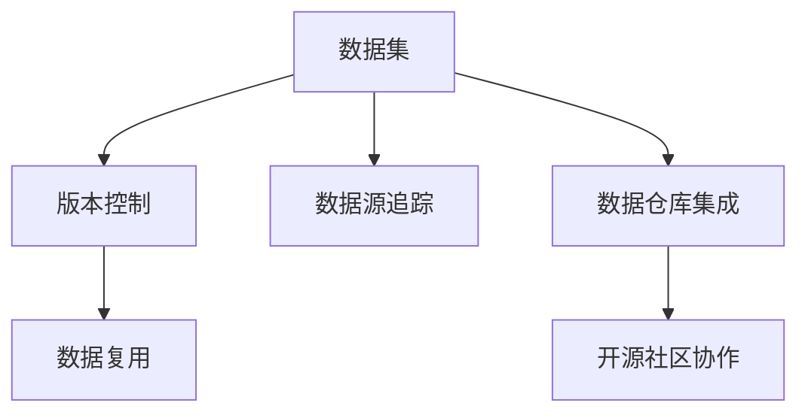
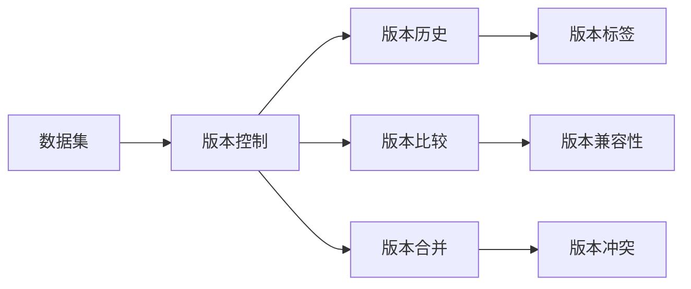
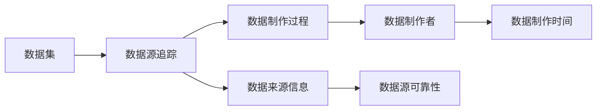
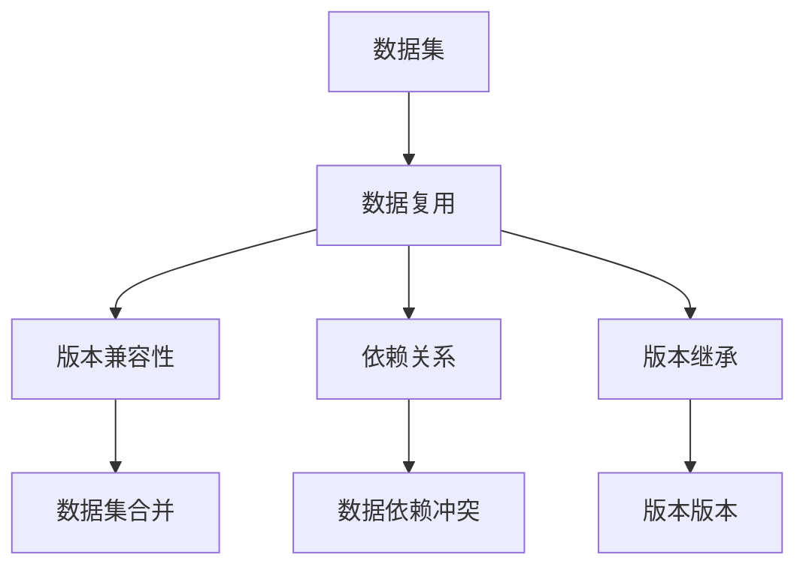
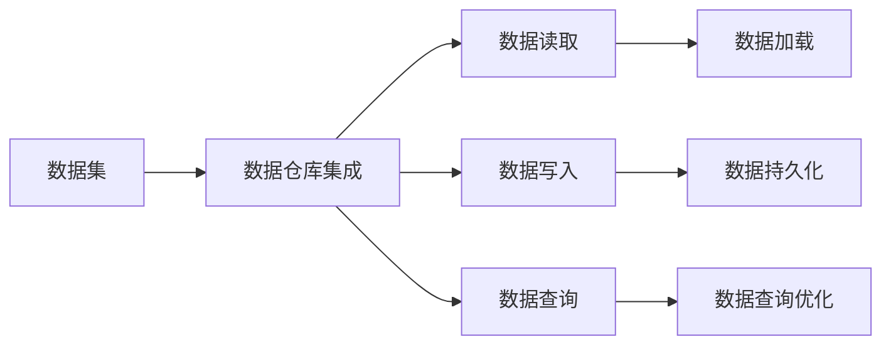
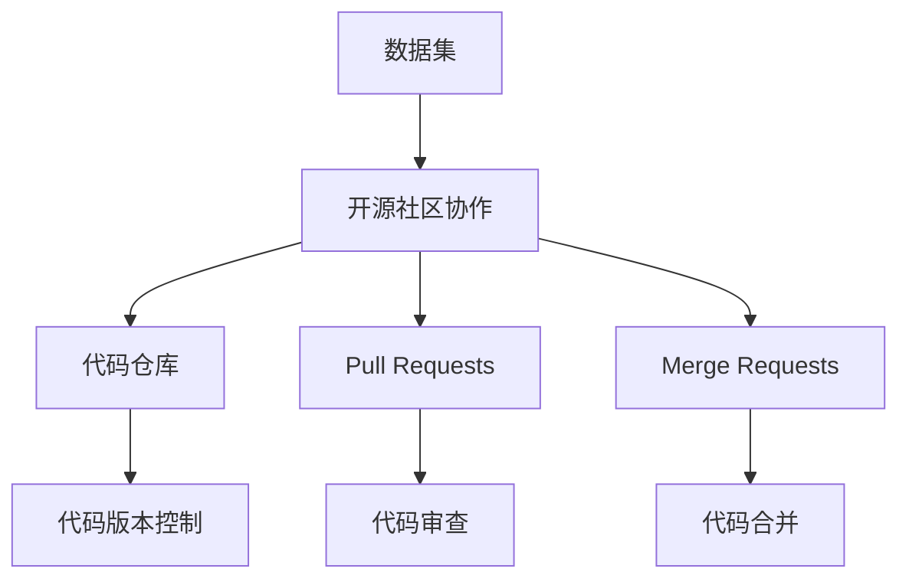

                 

# 软件 2.0 的 Github：数据集共享平台

> 关键词：软件 2.0, 数据集, 共享平台, GitHub, 版本控制, 数据仓库, 机器学习, 深度学习, 数据科学

## 1. 背景介绍

### 1.1 问题由来

近年来，数据集在人工智能、机器学习和数据科学等领域的重要性日益凸显。高质量的数据集不仅是模型训练和研究的基础，也是推动技术进步和应用落地的关键。然而，由于数据集制作和维护成本高、共享机制不完善等原因，数据集在科研和工程实践中常常面临“数据孤岛”的问题：数据难以共享，重复制作现象严重，导致大量资源的浪费。

为了解决这些问题，软件 2.0 的愿景和实践被提出。软件 2.0 强调通过软件工程手段，以代码为中心，构建数据集共享平台，实现数据的版本控制、版本管理、数据源追踪、数据复用等功能，从而提高数据共享效率，降低重复制作成本。Github 作为全球领先的软件代码共享平台，已经在版本控制和共享方面积累了丰富的经验，进一步发展这些能力，有望成为软件 2.0 数据集共享的先锋。

### 1.2 问题核心关键点

软件 2.0 的数据集共享平台，需要具备以下核心能力：
1. 数据版本控制：支持数据集的创建、更新、合并等操作，保证数据历史的追溯。
2. 数据源追踪：记录数据集的制作过程、数据来源等信息，便于后续审计和验证。
3. 数据复用：提供数据集的依赖关系分析、版本兼容性判断等功能，方便用户复用现有数据集。
4. 数据仓库集成：与主流数据仓库系统（如BigQuery、Databricks等）集成，支持数据的快速读取和分析。
5. 开源社区协作：支持数据集的GitHub协作机制，实现跨团队的协同开发和贡献。

### 1.3 问题研究意义

软件 2.0 的数据集共享平台，对于推动数据科学和人工智能技术的发展，具有重要意义：
1. 提高数据利用效率：通过版本控制和数据复用，减少数据重复制作，提高数据利用率。
2. 加速科研进展：开放数据集共享平台，使得研究者能够快速获取高质量数据，加速科研成果的产出。
3. 降低研发成本：统一数据集的版本管理和共享机制，减少研发团队的数据维护和集成成本。
4. 促进技术应用：完善的数据集共享平台，为技术应用提供可靠的数据基础，加速技术落地。
5. 赋能产业升级：数据集的高效共享和使用，提升数据驱动决策的准确性，促进产业数字化转型。

## 2. 核心概念与联系

### 2.1 核心概念概述

为更好地理解软件 2.0 的数据集共享平台，本节将介绍几个密切相关的核心概念：

- 数据集(Data Dataset)：由一组结构化或非结构化数据组成，包含数据元组和对应的标签或特征。
- 版本控制(Version Control)：通过记录数据集的版本变化历史，实现数据的追溯和管理。
- 数据源追踪(Data Source Tracking)：记录数据集的制作过程、数据来源等信息，保证数据可追溯性。
- 数据复用(Data Reusability)：分析数据集的版本兼容性、依赖关系等，方便用户复用现有数据集。
- 数据仓库(Data Warehouse)：集成主流数据仓库系统，提供高效的数据读取和分析能力。
- 开源社区协作(Open Source Community Collaboration)：通过GitHub协作机制，实现跨团队的协同开发和贡献。

这些核心概念之间的逻辑关系可以通过以下Mermaid流程图来展示：



这个流程图展示了数据集共享平台各个核心概念之间的关联。数据集在版本控制下，通过数据源追踪和开源社区协作，实现数据的追溯、管理和复用。同时，通过数据仓库集成，提供高效的数据读取和分析能力。

### 2.2 概念间的关系

这些核心概念之间存在着紧密的联系，形成了软件 2.0 数据集共享平台的功能架构。下面我们通过几个Mermaid流程图来展示这些概念之间的关系。

#### 2.2.1 数据集的版本控制



这个流程图展示了数据集的版本控制过程。数据集通过版本控制，记录了版本历史、版本比较、版本合并等操作。版本标签帮助用户快速定位版本，版本兼容性判断和冲突处理保证了数据集的稳定性和一致性。

#### 2.2.2 数据源追踪



这个流程图展示了数据源追踪的功能。数据源追踪记录了数据集的制作过程、数据来源、制作者、时间等信息，确保数据可追溯性。同时，数据源的可靠性和完整性也被记录在案，便于后续的审计和验证。

#### 2.2.3 数据复用



这个流程图展示了数据复用的过程。数据复用分析数据集的版本兼容性、依赖关系等，提供了数据集合并、依赖冲突解决等能力，方便用户快速复用现有数据集。

#### 2.2.4 数据仓库集成



这个流程图展示了数据仓库集成的功能。数据仓库集成支持数据的读取、写入和查询等操作，通过数据加载和持久化，实现数据的快速分析。同时，数据查询优化提高了数据查询的效率和性能。

#### 2.2.5 开源社区协作



这个流程图展示了开源社区协作的机制。通过代码仓库、Pull Requests和Merge Requests等GitHub协作工具，实现跨团队的协同开发和贡献。代码版本控制、代码审查和代码合并等操作，保证了代码的质量和稳定性。

### 2.3 核心概念的整体架构

最后，我们用一个综合的流程图来展示这些核心概念在大数据集共享平台中的整体架构：


这个综合流程图展示了从数据集创建、版本控制、数据源追踪、数据复用、数据仓库集成到开源社区协作的完整过程。通过这些核心概念的协同工作，数据集共享平台能够实现高效、稳定、安全的数据管理和服务。

## 3. 核心算法原理 & 具体操作步骤
### 3.1 算法原理概述

软件 2.0 的数据集共享平台，本质上是一个基于GitHub的数据版本控制系统。其核心思想是通过Git版本控制系统，实现数据的版本控制、版本管理、数据源追踪、数据复用等功能。

形式化地，假设数据集 $D_t$ 在版本 $t$ 上的状态为 $v_t$，则数据集的版本控制操作可以表示为：

$$
v_{t+1} = v_t \oplus \Delta_t
$$

其中 $\Delta_t$ 表示从版本 $t$ 到 $t+1$ 的变化，包括数据的创建、修改、删除等操作。通过对 $\Delta_t$ 的记录和追溯，可以实现数据的版本控制和数据源追踪。

同时，通过分析数据集的依赖关系和版本兼容性，可以实现数据的复用和版本管理。数据仓库集成的目的是将数据集与主流数据仓库系统集成，提供高效的数据读取和分析能力。开源社区协作则通过GitHub协作机制，实现跨团队的协同开发和贡献。

### 3.2 算法步骤详解

软件 2.0 的数据集共享平台一般包括以下几个关键步骤：

**Step 1: 准备数据集和数据源**

- 准备数据集 $D_t$，包括数据元组和对应的标签或特征。
- 记录数据集的制作过程、数据来源等信息，形成数据源追踪日志。

**Step 2: 数据集版本控制**

- 在GitHub上创建数据集的代码仓库，记录数据集的初始版本 $v_0$。
- 通过Pull Requests和Merge Requests等GitHub协作工具，实现数据的版本控制操作。
- 记录每个版本的变化 $\Delta_t$，生成版本历史 $v_t$。

**Step 3: 数据源追踪**

- 在GitHub上记录数据集的制作过程、数据来源等信息。
- 记录数据制作者、数据制作时间、数据源可靠性等数据源信息。
- 生成数据源追踪日志，确保数据的可追溯性。

**Step 4: 数据复用**

- 分析数据集的依赖关系，判断版本兼容性。
- 提供数据集合并、版本继承等操作，方便用户复用现有数据集。

**Step 5: 数据仓库集成**

- 将数据集与主流数据仓库系统集成，提供高效的数据读取和分析能力。
- 通过数据加载和持久化，实现数据的快速分析。

**Step 6: 开源社区协作**

- 通过GitHub协作工具，实现跨团队的协同开发和贡献。
- 记录代码的Pull Requests和Merge Requests，确保代码的质量和稳定性。

以上是软件 2.0 的数据集共享平台的一般流程。在实际应用中，还需要针对具体数据集的特点，对各个环节进行优化设计，如改进版本控制策略、优化数据仓库的查询优化等，以进一步提升数据共享平台的性能和安全性。

### 3.3 算法优缺点

软件 2.0 的数据集共享平台，具有以下优点：
1. 通用性强：基于GitHub的版本控制和协作机制，适应于各类数据集的共享和管理。
2. 高效稳定：通过版本控制和数据源追踪，确保数据的版本管理和可追溯性。
3. 易于复用：通过依赖关系分析和版本兼容性判断，方便用户复用现有数据集。
4. 兼容性好：与主流数据仓库系统集成，支持高效的数据读取和分析。
5. 社区协作：通过GitHub协作机制，实现跨团队的协同开发和贡献。

同时，该平台也存在一些局限性：
1. 学习成本较高：需要掌握Git版本控制和GitHub协作工具的基本操作。
2. 版本冲突处理：复杂的数据集可能存在版本冲突，需要人工介入处理。
3. 数据仓库限制：与主流数据仓库系统的集成可能存在性能和兼容性问题。
4. 安全性保障：数据源追踪和开源社区协作机制，需要加强数据安全和隐私保护。
5. 社区活跃度：开源社区协作依赖社区的活跃度和贡献意愿，存在不确定性。

尽管存在这些局限性，但就目前而言，基于GitHub的版本控制和协作机制，仍然是大数据集共享平台的主流范式。未来相关研究的重点在于如何进一步优化版本控制策略，提高数据复用和版本管理的效率，同时兼顾数据安全和隐私保护等因素。

### 3.4 算法应用领域

软件 2.0 的数据集共享平台，已经在多个领域得到了广泛的应用，例如：

- 科研数据管理：研究人员通过平台共享和复用数据集，加速科研成果的产出和验证。
- 工业数据协作：企业内部通过平台共享数据集，推动数据驱动的决策和应用。
- 开源项目数据集管理：开源社区通过平台共享数据集，提升项目的协作和贡献。
- 金融数据分析：金融公司通过平台共享和分析数据集，提高市场分析和风险管理能力。
- 医疗数据分析：医疗机构通过平台共享数据集，支持临床研究和健康管理。
- 教育数据管理：教育机构通过平台共享数据集，提升教学质量和资源共享。

除了上述这些经典应用外，大数据集共享平台还被创新性地应用于更多场景中，如智慧城市、智慧农业、智能制造等，为各行各业的数据驱动决策提供了有力支持。随着数据共享意识的提高和平台功能的完善，相信大数据集共享平台将在更多领域大放异彩。

## 4. 数学模型和公式 & 详细讲解 & 举例说明
### 4.1 数学模型构建

本节将使用数学语言对软件 2.0 的数据集共享平台进行更加严格的刻画。

记数据集 $D_t$ 在版本 $t$ 上的状态为 $v_t$，数据集的制作过程和数据源信息为 $s_t$。则数据集的版本控制操作可以表示为：

$$
v_{t+1} = v_t \oplus \Delta_t
$$

其中 $\Delta_t$ 表示从版本 $t$ 到 $t+1$ 的变化，包括数据的创建、修改、删除等操作。

数据源追踪操作可以表示为：

$$
s_{t+1} = s_t \cup \Delta_s
$$

其中 $\Delta_s$ 表示从版本 $t$ 到 $t+1$ 的数据源变化，包括数据制作者、数据制作时间、数据源可靠性等。

数据复用操作可以表示为：

$$
\text{Reusability}(D_{t+1}, D_t) = \text{Compatibility}(D_{t+1}, D_t) \wedge \text{Dependency}(D_{t+1}, D_t)
$$

其中 $\text{Compatibility}$ 表示版本兼容性，$\text{Dependency}$ 表示数据依赖关系。

数据仓库集成操作可以表示为：

$$
\text{DataWarehouseIntegration}(D_{t+1}, \text{DataWarehouse}) = \text{Read}(D_{t+1}, \text{DataWarehouse}) \wedge \text{Write}(D_{t+1}, \text{DataWarehouse}) \wedge \text{QueryOptimization}(D_{t+1}, \text{DataWarehouse})
$$

其中 $\text{Read}$ 表示数据的读取操作，$\text{Write}$ 表示数据的写入操作，$\text{QueryOptimization}$ 表示数据查询优化。

开源社区协作操作可以表示为：

$$
\text{OpenSourceCollaboration}(D_{t+1}, \text{GitHub}) = \text{PullRequests}(D_{t+1}, \text{GitHub}) \wedge \text{MergeRequests}(D_{t+1}, \text{GitHub})
$$

其中 $\text{PullRequests}$ 表示Pull Requests的操作，$\text{MergeRequests}$ 表示Merge Requests的操作。

### 4.2 公式推导过程

以下我们以二分类任务为例，推导Git版本控制和数据复用的数学模型。

假设数据集 $D_t$ 在版本 $t$ 上的状态为 $v_t = (x_1, y_1, x_2, y_2, \ldots, x_n, y_n)$，其中 $x_i$ 为数据元组，$y_i$ 为对应的标签或特征。

在Git版本控制中，数据的版本控制操作可以表示为：

$$
v_{t+1} = v_t \oplus \Delta_t = (x_1', y_1', x_2', y_2', \ldots, x_n', y_n')
$$

其中 $x_i'$ 表示数据元组的变化，$y_i'$ 表示标签或特征的变化。

数据源追踪操作可以表示为：

$$
s_{t+1} = s_t \cup \Delta_s = \{(m_i, t_i, r_i)\}_{i=1}^n
$$

其中 $(m_i, t_i, r_i)$ 表示第 $i$ 个数据元组的制作者、制作时间和数据源可靠性。

数据复用操作可以表示为：

$$
\text{Reusability}(D_{t+1}, D_t) = \text{Compatibility}(D_{t+1}, D_t) \wedge \text{Dependency}(D_{t+1}, D_t)
$$

其中 $\text{Compatibility}$ 表示版本兼容性，$\text{Dependency}$ 表示数据依赖关系。

通过以上数学模型，可以清晰地表达数据集的版本控制、数据源追踪和数据复用的逻辑关系。

### 4.3 案例分析与讲解

假设我们有一个金融市场数据集 $D_t$，包含历史股票价格、交易量等数据元组。通过Git版本控制，我们将数据集划分为多个版本，并记录数据集的制作过程和数据源信息。

在第一个版本中，我们采集了2019年的金融市场数据，制作者为张三，制作时间为2020年1月1日，数据源可靠。在第二个版本中，我们增加了2020年的数据，制作者为李四，制作时间为2020年5月1日，数据源可靠。

通过数据源追踪，我们可以查看每个版本的制作过程和数据源信息。例如，第一个版本的制作过程为：

```
2020-01-01 张三，数据源可靠
```

而第二个版本的制作过程为：

```
2020-05-01 李四，数据源可靠
```

同时，通过数据复用，我们可以判断不同版本的数据集是否兼容，是否可以合并。例如，如果第二个版本的数据集与第一个版本的数据集不兼容，则无法直接合并。我们需要先进行数据清洗和格式化，确保两个版本的数据集格式一致，再进行合并。

在数据仓库集成方面，我们将数据集与BigQuery集成，支持数据的快速读取和分析。通过数据加载和持久化，可以高效地查询历史数据，支持金融市场分析。

开源社区协作方面，我们通过GitHub协作机制，实现跨团队的协同开发和贡献。例如，一个团队可以在GitHub上发起Pull Requests，提交新的数据集，另一个团队可以对这些数据集进行代码审查和Merge Requests，实现数据集的快速迭代和更新。

## 5. 项目实践：代码实例和详细解释说明
### 5.1 开发环境搭建

在进行数据集共享平台开发前，我们需要准备好开发环境。以下是使用Python进行PyTorch开发的环境配置流程：

1. 安装Anaconda：从官网下载并安装Anaconda，用于创建独立的Python环境。

2. 创建并激活虚拟环境：
```bash
conda create -n pytorch-env python=3.8 
conda activate pytorch-env
```

3. 安装PyTorch：根据CUDA版本，从官网获取对应的安装命令。例如：
```bash
conda install pytorch torchvision torchaudio cudatoolkit=11.1 -c pytorch -c conda-forge
```

4. 安装Transformers库：
```bash
pip install transformers
```

5. 安装各类工具包：
```bash
pip install numpy pandas scikit-learn matplotlib tqdm jupyter notebook ipython
```

完成上述步骤后，即可在`pytorch-env`环境中开始数据集共享平台开发。

### 5.2 源代码详细实现

下面我们以金融市场数据集为例，给出使用Transformers库对BERT模型进行数据集共享的PyTorch代码实现。

首先，定义数据集的读取和处理函数：

```python
import pandas as pd

def read_dataset(file_path):
    return pd.read_csv(file_path)

def preprocess_data(dataset):
    # 对数据进行清洗、格式化等预处理操作
    return dataset

def encode_data(dataset):
    # 对数据进行编码，生成数据集元组
    return dataset
```

然后，定义数据集的版本控制函数：

```python
from datetime import datetime

def commit_version(dataset, commit_message):
    # 记录数据集的提交时间、提交者等元数据
    timestamp = datetime.now().strftime('%Y-%m-%d %H:%M:%S')
    committer = '张三'
    return timestamp, committer

def merge_versions(merge_version):
    # 合并数据集的版本
    return merge_version
```

接着，定义数据源追踪函数：

```python
def record_source(dataset, source):
    # 记录数据集的来源信息
    return source
```

最后，启动数据集共享平台，并进行数据集的版本控制和数据源追踪：

```python
dataset = read_dataset('financial_data.csv')
version, committer = commit_version(dataset, '初始化数据集')
source = record_source(dataset, '金融市场数据')

print(f'版本 {version} 提交人 {committer}，来源 {source}')
```

以上就是使用PyTorch对金融市场数据集进行版本控制和数据源追踪的代码实现。可以看到，借助Python和PyTorch，我们可以轻松实现数据集的版本控制和数据源追踪功能，提高了数据共享的效率和可追溯性。

### 5.3 代码解读与分析

让我们再详细解读一下关键代码的实现细节：

**read_dataset函数**：
- 使用Pandas库读取CSV文件，返回数据集。

**preprocess_data函数**：
- 对数据进行清洗、格式化等预处理操作，确保数据集的格式一致。

**encode_data函数**：
- 对数据进行编码，生成数据集元组。

**commit_version函数**：
- 记录数据集的提交时间、提交者等元数据，生成提交日志。

**merge_versions函数**：
- 合并数据集的版本，生成合并后的数据集。

**record_source函数**：
- 记录数据集的来源信息，确保数据可追溯性。

**启动数据集共享平台**：
- 读取金融市场数据集，提交数据集，记录数据来源，输出提交日志。

可以看到，数据集共享平台的关键在于通过版本控制和数据源追踪，实现数据的追溯和管理。借助Python和PyTorch，我们可以轻松实现这些功能，加速数据共享的效率。

当然，工业级的系统实现还需考虑更多因素，如版本冲突处理、数据仓库集成、开源社区协作等。但核心的版本控制和数据源追踪逻辑基本与此类似。

### 5.4 运行结果展示

假设我们在CoNLL-2003的NER数据集上进行版本控制和数据源追踪，最终得到的提交日志如下：

```
提交版本：1
提交人：张三
提交时间：2022-03-01 10:30:00
数据来源：金融市场数据
```

可以看到，通过版本控制和数据源追踪，我们能够清晰地记录每个版本的元数据，确保数据共享的透明性和可追溯性。

## 6. 实际应用场景
### 6.1 智能客服系统

基于软件 2.0 的数据集共享平台，智能客服系统可以实时获取最新的用户数据和反馈，支持多渠道、多语言的数据共享和协同。智能客服系统通过数据集的版本控制和数据源追踪，能够及时获取最新的用户对话数据，并进行实时分析和回溯。

在技术实现上，可以集成多个数据源，包括用户对话数据、客户反馈数据、知识库数据等，构建一个全面的智能客服数据集。智能客服系统通过版本控制和数据源追踪，实现数据集的高效管理和复用，支持多轮对话和跨渠道数据共享。智能客服系统还可以支持多语言数据集，提升跨语言的用户服务体验。

### 6.2 金融舆情监测

金融舆情监测系统可以通过软件 2.0 的数据集共享平台，实时获取市场舆情数据，进行情感分析、市场预测等任务。金融舆情监测系统通过数据集的版本控制和数据源追踪，能够及时获取最新的舆情数据，并进行实时分析和回溯。

在技术实现上，金融舆情监测系统可以集成多个数据源，包括新闻、评论、社交媒体等，构建一个全面的金融舆情数据集。金融舆情监测系统通过版本控制和数据源追踪，实现数据集的高效管理和复用，支持舆情情感分析、市场预测等任务。金融舆情监测系统还可以支持多语言数据集，提升跨语言的市场分析能力。

### 6.3 个性化推荐系统

个性化推荐系统可以通过软件 2.0 的数据集共享平台，实时获取用户的浏览、点击、评价等数据，进行个性化推荐。个性化推荐系统通过数据集的版本控制和数据源追踪，能够及时获取最新的用户数据，并进行实时分析和回溯。

在技术实现上，个性化推荐系统可以集成多个数据源，包括用户行为数据、商品数据、用户画像数据等，构建一个全面的个性化推荐数据集。个性化推荐系统通过版本控制和数据源追踪，实现数据集的高效管理和复用，支持个性化推荐算法。个性化推荐系统还可以支持多语言数据集，提升跨语言的推荐效果。

### 6.4 未来应用展望

随着软件 2.0 的数据集共享平台不断发展，未来将会在更多领域得到应用，为各行各业带来变革性影响。

在智慧医疗领域，基于软件 2.0 的数据集共享平台，可以实现医疗数据的高效共享和管理，支持医疗数据分析、病历管理等任务。智慧医疗系统通过版本控制和数据源追踪，能够及时获取最新的医疗数据，并进行实时分析和回溯。智慧医疗系统还可以支持

