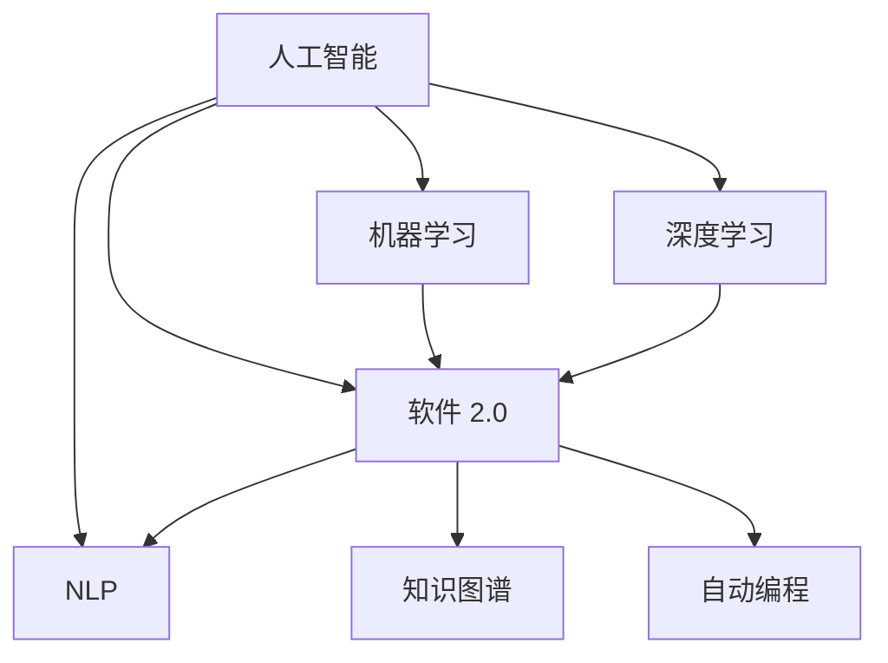

                 

# 软件 2.0 的哲学思考：人工智能的本质

软件 2.0，一个未来可能改变我们生活、工作方式的技术概念。它不仅仅是传统的软件开发，更是人工智能、机器学习等技术在软件中的应用。本文将探讨软件 2.0 的哲学思考，特别是人工智能的本质。

## 1. 背景介绍

人工智能（Artificial Intelligence，AI），一种使计算机执行通常需要人类智能的任务的技术。这些任务包括学习、规划、推理、发现理解、形式化、问题求解、感知、使用语言与人类交互、移动与操纵物理物体以及高层次的抽象和创造力。

## 2. 核心概念与联系

### 2.1 核心概念概述

为了更好地理解软件 2.0 与人工智能，我们必须了解一些关键概念：

- **人工智能**：使计算机执行通常需要人类智能的任务的技术，如学习、推理、理解、自然语言处理等。

- **机器学习**：一种人工智能的分支，它使计算机在没有明确编程的情况下执行任务。

- **深度学习**：机器学习的一个分支，使用神经网络模型进行学习。

- **软件 2.0**：使用人工智能技术来开发、部署和维护软件系统。

- **自然语言处理（NLP）**：让计算机理解和生成人类语言的技术。

- **知识图谱**：一种将知识结构化为图形结构的技术，帮助计算机理解和推理。

- **自动编程**：使计算机自动编写程序的技术。

这些概念之间存在着复杂的联系，如图示所示：



### 2.2 概念间的关系

这些概念之间的关系，可以概括为：

- 人工智能和机器学习是核心技术，其中深度学习是机器学习的一个具体应用。
- 软件 2.0 是人工智能技术在软件开发中的应用。
- NLP、知识图谱和自动编程都是软件 2.0 中的具体技术。
- 知识图谱和自动编程可以在 NLP 和软件 2.0 中使用，以提高计算机的智能和自动能力。

## 3. 核心算法原理 & 具体操作步骤

### 3.1 算法原理概述

软件 2.0 的核心算法原理，主要是基于深度学习的算法。深度学习是一种模拟人脑神经网络的算法，它通过大量的数据训练，使得计算机能够执行类似于人脑的任务。

- **反向传播算法**：一种用于训练神经网络的方法，通过反向传播误差来更新网络参数。

- **卷积神经网络（CNN）**：一种用于图像处理和识别的深度学习算法。

- **循环神经网络（RNN）**：一种用于序列数据处理和生成的深度学习算法。

- **生成对抗网络（GAN）**：一种用于生成数据的深度学习算法，可以生成逼真的图像、视频等。

- **强化学习**：一种通过奖励和惩罚来训练计算机执行特定任务的方法。

### 3.2 算法步骤详解

软件 2.0 的算法步骤，可以分为以下几步：

1. **数据准备**：收集和准备训练数据，数据包括图片、文本、语音等。

2. **模型设计**：选择合适的深度学习模型，如CNN、RNN、GAN等。

3. **模型训练**：使用反向传播算法或强化学习等方法，训练模型。

4. **模型评估**：使用测试数据评估模型性能。

5. **模型部署**：将模型部署到实际应用中，如图像识别、语音识别等。

6. **持续优化**：通过不断收集数据和反馈，优化模型。

### 3.3 算法优缺点

- **优点**：
  - 高精度：深度学习算法可以处理大量的数据，达到高精度。
  - 自动化：深度学习算法可以自动化地处理和分析数据。
  - 可扩展性：深度学习算法可以扩展到大规模的计算。

- **缺点**：
  - 计算成本高：深度学习算法需要大量的计算资源，训练时间长。
  - 数据依赖性强：深度学习算法依赖于高质量的数据。
  - 过拟合问题：深度学习算法容易过拟合。

### 3.4 算法应用领域

软件 2.0 的应用领域非常广泛，包括但不限于：

- 自动驾驶：使用深度学习算法处理图像和视频数据，实现自动驾驶。
- 医疗诊断：使用深度学习算法分析医学影像，进行疾病诊断。
- 智能客服：使用自然语言处理算法，实现智能客服。
- 推荐系统：使用深度学习算法推荐产品和服务。
- 金融风险控制：使用深度学习算法分析金融数据，控制风险。

## 4. 数学模型和公式 & 详细讲解 & 举例说明

### 4.1 数学模型构建

软件 2.0 的数学模型构建，主要基于深度学习算法。深度学习算法使用了神经网络模型，包括前向传播、反向传播等算法。

- **前向传播**：将输入数据传递到网络中，计算输出。

- **反向传播**：通过误差反向传播，更新网络参数。

- **损失函数**：衡量模型预测结果与实际结果的差异。

- **优化算法**：用于更新网络参数的算法，如梯度下降算法、Adam算法等。

### 4.2 公式推导过程

以下是深度学习中的前向传播和反向传播的公式：

- **前向传播公式**：
$$
y = f(x; \theta) = g(W \cdot h + b)
$$
其中，$x$ 是输入数据，$W$ 是权重矩阵，$h$ 是隐藏层输出，$b$ 是偏置项，$g$ 是非线性函数。

- **反向传播公式**：
$$
\frac{\partial L}{\partial W} = \frac{\partial L}{\partial z} \cdot \frac{\partial z}{\partial h} \cdot \frac{\partial h}{\partial W}
$$
其中，$L$ 是损失函数，$z$ 是输出数据，$h$ 是隐藏层输出，$\frac{\partial L}{\partial z}$ 是损失函数对输出的导数，$\frac{\partial z}{\partial h}$ 是输出对隐藏层的导数，$\frac{\partial h}{\partial W}$ 是隐藏层对权重的导数。

### 4.3 案例分析与讲解

以卷积神经网络（CNN）为例，CNN 在图像识别中的应用非常广泛。

- **模型设计**：使用卷积层、池化层和全连接层等组成 CNN 模型。

- **训练数据**：使用大量带有标签的图像数据。

- **训练过程**：使用反向传播算法，更新网络参数。

- **测试数据**：使用测试数据评估模型性能。

- **优化算法**：使用 Adam 算法等优化算法，加速训练过程。

## 5. 项目实践：代码实例和详细解释说明

### 5.1 开发环境搭建

- **环境安装**：安装 Python、TensorFlow、Keras 等深度学习框架。

- **数据准备**：收集和准备训练数据。

- **模型设计**：设计卷积神经网络模型。

- **训练过程**：使用反向传播算法，训练模型。

- **模型评估**：使用测试数据评估模型性能。

- **模型部署**：将模型部署到实际应用中。

### 5.2 源代码详细实现

以下是使用 TensorFlow 实现卷积神经网络代码：

```python
import tensorflow as tf
from tensorflow.keras import layers

# 定义卷积神经网络模型
model = tf.keras.Sequential([
    layers.Conv2D(32, (3, 3), activation='relu', input_shape=(28, 28, 1)),
    layers.MaxPooling2D((2, 2)),
    layers.Conv2D(64, (3, 3), activation='relu'),
    layers.MaxPooling2D((2, 2)),
    layers.Conv2D(64, (3, 3), activation='relu'),
    layers.Flatten(),
    layers.Dense(64, activation='relu'),
    layers.Dense(10, activation='softmax')
])

# 编译模型
model.compile(optimizer='adam',
              loss='sparse_categorical_crossentropy',
              metrics=['accuracy'])

# 训练模型
model.fit(train_images, train_labels, epochs=5)

# 评估模型
test_loss, test_acc = model.evaluate(test_images, test_labels)
print('Test accuracy:', test_acc)
```

### 5.3 代码解读与分析

- **模型设计**：使用 Conv2D 层、MaxPooling2D 层、Flatten 层和 Dense 层等，构建卷积神经网络模型。

- **编译模型**：编译模型时，设置优化器、损失函数和评估指标。

- **训练模型**：使用 fit 函数，训练模型。

- **评估模型**：使用 evaluate 函数，评估模型性能。

- **结果展示**：输出测试数据集的准确率。

## 6. 实际应用场景

### 6.1 自动驾驶

自动驾驶技术，依赖于深度学习和计算机视觉技术。使用卷积神经网络处理图像数据，实现物体检测、车道线识别等任务。

### 6.2 医疗诊断

医疗诊断技术，依赖于深度学习和医学图像处理技术。使用卷积神经网络分析医学影像，进行疾病诊断。

### 6.3 智能客服

智能客服技术，依赖于自然语言处理和深度学习技术。使用循环神经网络处理自然语言数据，实现智能对话。

### 6.4 推荐系统

推荐系统技术，依赖于深度学习和协同过滤技术。使用深度学习算法，推荐产品和服务。

### 6.5 金融风险控制

金融风险控制技术，依赖于深度学习和数据分析技术。使用深度学习算法，分析金融数据，控制风险。

## 7. 工具和资源推荐

### 7.1 学习资源推荐

- **深度学习书籍**：如《深度学习》（Ian Goodfellow 等著）、《神经网络与深度学习》（Michael Nielsen 著）等。

- **在线课程**：如 Coursera、edX、Udacity 等平台上的深度学习课程。

- **博客和论文**：如 arXiv、Medium、AI News 等平台上的深度学习博客和论文。

### 7.2 开发工具推荐

- **TensorFlow**：开源深度学习框架，支持分布式计算和自动微分。

- **Keras**：高层次神经网络 API，易于使用，支持 TensorFlow、Theano 和 CNTK 等后端。

- **PyTorch**：开源深度学习框架，支持动态计算图和 GPU 加速。

- **MXNet**：支持多语言和多种硬件的深度学习框架。

- **JAX**：基于 NumPy 的自动微分库，支持高效分布式计算。

### 7.3 相关论文推荐

- **深度学习论文**：如《ImageNet Classification with Deep Convolutional Neural Networks》（Alex Krizhevsky 等著）、《Natural Language Processing (almost) from Scratch》（Andrej Karpathy 等著）等。

- **机器学习论文**：如《An Introduction to Statistical Learning》（Gareth James 等著）、《Pattern Recognition and Machine Learning》（Christopher Bishop 著）等。

## 8. 总结：未来发展趋势与挑战

### 8.1 研究成果总结

深度学习算法在软件 2.0 中的应用，推动了人工智能技术的快速发展。深度学习算法可以处理大规模数据，实现高精度和高效率。

### 8.2 未来发展趋势

未来，软件 2.0 将进一步扩展应用领域，包括自动驾驶、医疗诊断、智能客服、推荐系统等。软件 2.0 将与物联网、5G 等技术融合，推动智能化社会的发展。

### 8.3 面临的挑战

软件 2.0 面临的主要挑战包括：

- 数据隐私问题：深度学习算法需要大量的数据，涉及隐私保护问题。

- 计算资源问题：深度学习算法需要大量的计算资源，如何优化计算资源利用率，是关键问题。

- 模型可解释性问题：深度学习模型具有黑箱特性，如何提高模型的可解释性，是重要研究方向。

- 人工智能伦理问题：深度学习算法在实际应用中，可能带来伦理问题，如何确保人工智能的公平、透明和可控，是重要研究方向。

### 8.4 研究展望

未来的研究，需要在以下几个方面进行探索：

- 数据隐私保护：开发隐私保护技术，保护用户数据隐私。

- 计算资源优化：优化计算资源利用率，提高深度学习算法的效率。

- 模型可解释性：提高深度学习模型的可解释性，增强模型可信度。

- 人工智能伦理：开发人工智能伦理框架，确保人工智能的公平、透明和可控。

总之，软件 2.0 和人工智能技术将深刻改变我们的生活方式和工作方式。我们需要不断探索和创新，解决人工智能技术的挑战，推动人工智能技术的进步。

## 9. 附录：常见问题与解答

### 9.1 什么是深度学习？

深度学习是一种机器学习算法，通过多层次的非线性变换，自动学习和提取输入数据中的特征。深度学习算法通常使用神经网络模型进行训练和推理。

### 9.2 深度学习算法的优势是什么？

深度学习算法具有高精度、自动化和可扩展性等优势。深度学习算法可以处理大规模数据，实现高精度和高效率。

### 9.3 深度学习算法存在哪些缺点？

深度学习算法存在计算成本高、数据依赖性强和过拟合问题等缺点。深度学习算法需要大量的计算资源，训练时间长。深度学习算法依赖于高质量的数据，过拟合问题也需要注意。

### 9.4 深度学习算法如何应用于实际问题？

深度学习算法可以应用于图像识别、语音识别、自然语言处理等实际问题。通过设计合适的神经网络模型，训练深度学习算法，可以解决实际问题。

### 9.5 深度学习算法未来的发展方向是什么？

深度学习算法未来的发展方向包括：

- 模型压缩和优化：优化深度学习模型的计算资源和存储空间。

- 模型可解释性：提高深度学习模型的可解释性，增强模型可信度。

- 跨模态学习：结合视觉、语音、文本等多模态数据，实现跨模态学习。

- 人工智能伦理：开发人工智能伦理框架，确保人工智能的公平、透明和可控。

总之，深度学习算法将在软件 2.0 和人工智能技术中发挥重要作用。我们需要不断探索和创新，推动深度学习算法的发展。

---

作者：禅与计算机程序设计艺术 / Zen and the Art of Computer Programming

