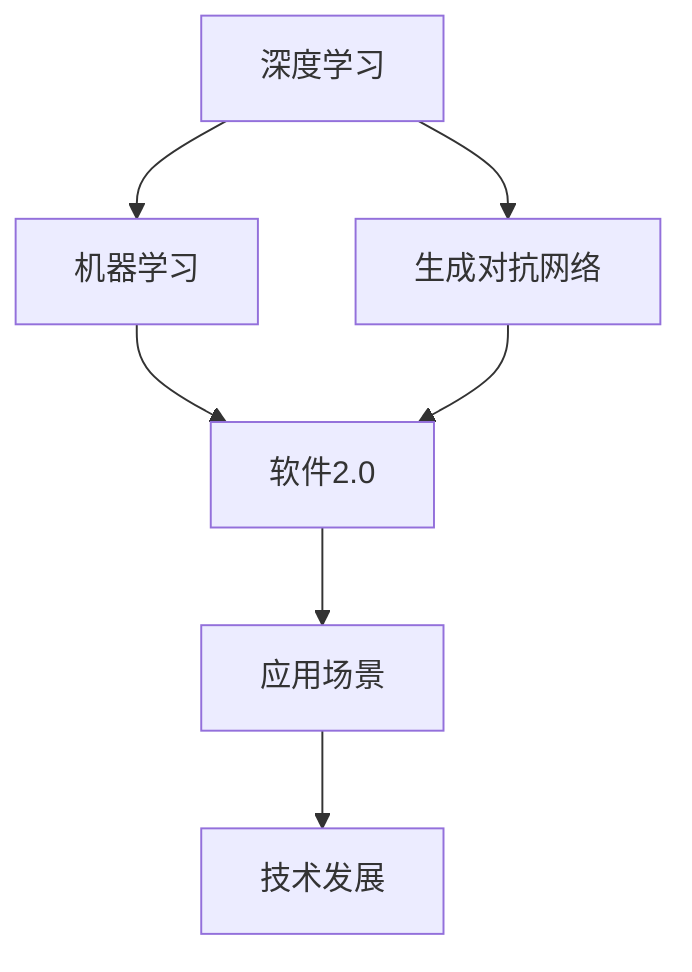
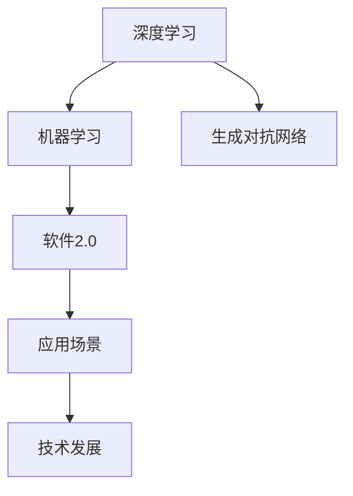
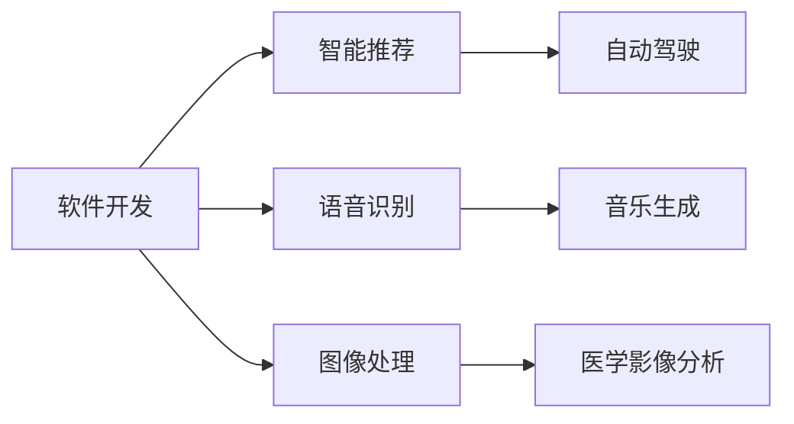
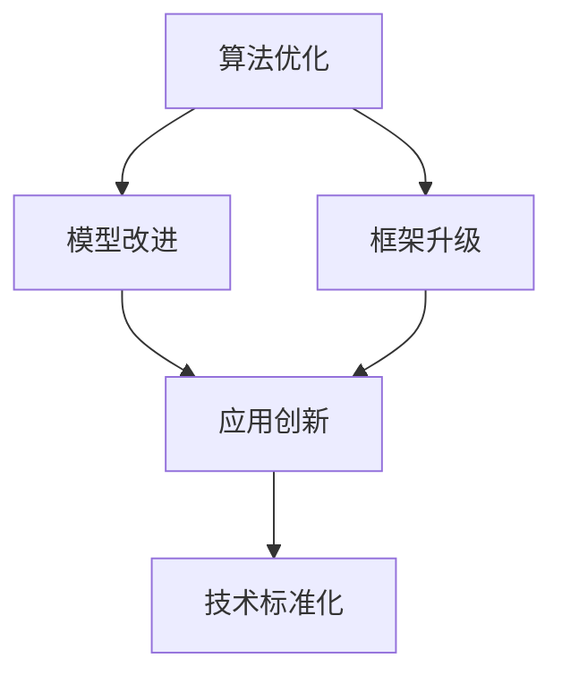
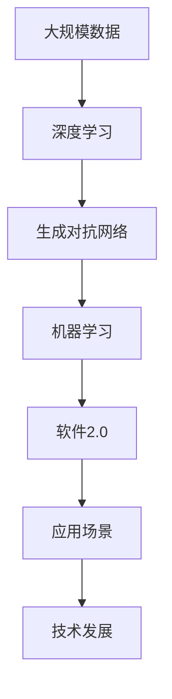

                 

# 软件 2.0 的应用：从实验室走向现实

> 关键词：软件2.0,生成对抗网络(GANs),深度学习,机器学习,应用场景,技术发展,未来展望

## 1. 背景介绍

### 1.1 问题由来

随着人工智能(AI)技术的飞速发展，深度学习(DL)和机器学习(ML)逐渐成为新一代软件的基础，促使软件进入了一个全新的阶段——软件2.0时代。这一时期，AI技术在软件开发、部署和运维等环节中得到了广泛应用，使得软件能够更好地适应多变的环境和用户需求。然而，尽管软件2.0已经展示了巨大的潜力，但其实现和应用仍然面临诸多挑战，特别是在从实验室走向现实的过程中，技术应用的复杂性和实践难度大大增加。

### 1.2 问题核心关键点

软件2.0的核心在于深度学习、生成对抗网络(GANs)和神经网络等技术的集成，通过自我优化和适应性强的算法，实现软件的自动化、智能化和自适应。但在实际应用中，这些技术往往需要大量的数据、高算力支持，同时还需要对模型进行不断微调和优化，才能最终实现预期效果。此外，软件2.0模型的训练、部署和监控等环节也面临不少技术难题，如模型泛化能力不足、计算资源限制、实时性要求高等。

### 1.3 问题研究意义

研究软件2.0技术及其在实际应用场景中的应用，对于推动AI技术的产业化进程、提升软件开发的效率和质量、促进经济社会发展具有重要意义：

1. **降低开发成本**。通过AI技术自动化地生成、测试和部署代码，大幅减少人力成本和开发周期，使得软件生产变得更为高效。
2. **提升软件性能**。利用深度学习模型对海量数据进行分析，改进软件性能，提升用户体验。
3. **加速技术迭代**。利用AI技术进行自我优化和调优，使软件能够快速适应环境变化和需求升级。
4. **赋能产业升级**。通过AI技术提升软件智能水平，推动传统行业向数字化转型，为经济增长提供新动力。

## 2. 核心概念与联系

### 2.1 核心概念概述

软件2.0作为AI技术在软件开发和应用中的重要应用，涵盖了一系列先进的AI概念和理论。为更好地理解其核心思想，本节将介绍几个关键概念：

- **深度学习(Deep Learning)**：一种基于神经网络的学习方法，通过多层神经元的组合，自动从数据中学习特征表示，实现对复杂数据结构的建模。
- **生成对抗网络(GANs)**：一种由生成器和判别器组成的神经网络结构，通过对抗训练，生成高质量的合成数据，广泛应用于图像、音频和文本等领域。
- **机器学习(ML)**：一种通过训练数据，使模型自动学习并优化参数，以解决特定问题的技术，广泛应用于分类、回归、聚类等任务。
- **软件2.0**：一种基于AI技术的软件形态，通过自动化、智能化的开发过程，实现软件的自我优化和自适应。
- **应用场景**：软件2.0技术在各种领域的应用，包括软件开发、智能推荐、语音识别、图像处理等。
- **技术发展**：从算法、模型、框架到应用的完整技术链条，是软件2.0研究的核心。

这些核心概念之间的逻辑关系可以通过以下Mermaid流程图来展示：



这个流程图展示了大模型微调的各个核心概念及其关系：

1. 深度学习和机器学习是软件2.0的基础。
2. 生成对抗网络提供了高质量数据生成的能力，有助于软件2.0模型的训练。
3. 软件2.0将AI技术应用于软件开发和应用。
4. 应用场景展示了软件2.0在各个领域的实际应用。
5. 技术发展则是对从算法、模型到应用的完整链条的概括。

### 2.2 概念间的关系

这些核心概念之间存在着紧密的联系，形成了软件2.0的完整生态系统。以下通过几个Mermaid流程图来展示这些概念之间的关系。

#### 2.2.1 软件2.0的学习范式



这个流程图展示了从深度学习和机器学习到生成对抗网络，再到软件2.0及其应用场景的技术发展链条。

#### 2.2.2 应用场景的多样性



这个流程图展示了软件2.0技术在各个领域的应用场景，显示了其广泛的应用潜力。

#### 2.2.3 技术发展的趋势



这个流程图展示了软件2.0技术从算法、模型、框架到应用的标准化和创新的发展趋势。

### 2.3 核心概念的整体架构

最后，我们用一个综合的流程图来展示这些核心概念在大模型微调过程中的整体架构：



这个综合流程图展示了从数据收集到软件2.0模型训练和应用的技术链条，以及软件2.0技术的整体架构。

## 3. 核心算法原理 & 具体操作步骤
### 3.1 算法原理概述

软件2.0的核心算法原理主要基于深度学习和生成对抗网络，通过大规模数据训练，构建高性能的模型。其基本流程如下：

1. **数据收集**：收集并预处理各种应用场景的原始数据。
2. **模型训练**：使用深度学习算法对数据进行训练，构建出高性能的模型。
3. **模型优化**：使用生成对抗网络进行模型优化，提高模型的泛化能力和鲁棒性。
4. **模型部署**：将训练好的模型应用于具体场景，实现自动化的功能。
5. **模型监控**：对部署后的模型进行实时监控和反馈，持续优化模型性能。

### 3.2 算法步骤详解

以下是使用生成对抗网络进行模型优化的详细步骤：

**Step 1: 准备原始数据**
- 收集与目标任务相关的数据集，并对其进行预处理。

**Step 2: 定义模型架构**
- 使用深度学习框架（如PyTorch、TensorFlow等）定义模型的基本结构，包括编码器、解码器等。

**Step 3: 初始化生成器和判别器**
- 生成器用于生成与真实数据相似的新数据，判别器用于区分生成数据和真实数据。

**Step 4: 训练生成器和判别器**
- 使用对抗训练的方法，交替优化生成器和判别器，使得生成器生成的数据越来越逼近真实数据。

**Step 5: 应用生成数据**
- 将生成的数据作为输入，再次应用深度学习模型进行训练和优化，进一步提升模型性能。

**Step 6: 部署模型**
- 将训练好的模型部署到实际应用场景中，实现自动化的功能。

**Step 7: 模型监控**
- 对模型进行实时监控和反馈，确保其稳定性和性能。

### 3.3 算法优缺点

软件2.0算法的主要优点包括：

- **高性能**：通过深度学习和生成对抗网络，构建出高性能的模型，能够处理复杂的任务。
- **自适应**：利用生成对抗网络进行模型优化，提高模型的泛化能力和鲁棒性，使其能够适应多变的环境和需求。
- **自动化**：通过自动化的模型训练和优化，减少人工干预，提高工作效率。

然而，该算法也存在一些缺点：

- **计算资源需求高**：深度学习和生成对抗网络需要大量的计算资源，包括高性能的GPU、TPU等硬件设备。
- **模型复杂度高**：模型结构复杂，训练和优化过程相对较慢。
- **数据依赖性高**：数据质量和数量直接影响了模型的性能，获取高质量数据可能成为瓶颈。

### 3.4 算法应用领域

软件2.0技术在多个领域得到了广泛应用，包括：

- **软件开发**：自动化代码生成、测试、部署等，提升开发效率和质量。
- **智能推荐**：基于用户历史行为数据，生成个性化推荐内容，提升用户体验。
- **语音识别**：实现语音到文本的转换，支持自然语言交互。
- **图像处理**：自动化图像识别和生成，应用于自动驾驶、医学影像等领域。
- **自然语言处理**：通过深度学习技术，实现自动翻译、文本生成等任务。

除了上述这些领域，软件2.0技术还在金融、医疗、交通等领域得到了广泛应用，带来了显著的经济效益和社会价值。

## 4. 数学模型和公式 & 详细讲解 & 举例说明
### 4.1 数学模型构建

软件2.0技术的核心在于深度学习和生成对抗网络，其数学模型主要包括以下几个部分：

- **深度学习模型**：定义为一个输入、权重、激活函数、输出组成的映射函数。
- **生成对抗网络**：由生成器和判别器组成的模型，生成器和判别器通过对抗训练进行优化。

### 4.2 公式推导过程

以下以生成对抗网络为例，进行模型推导：

假设生成器 $G$ 和判别器 $D$ 均为卷积神经网络，其输入和输出分别为 $z$ 和 $x$。生成器的目标是最大化判别器的输出，即 $D(G(z))$，而判别器的目标是最大化真实数据 $x$ 的判别概率 $D(x)$，最小化生成数据 $G(z)$ 的判别概率 $D(G(z))$。具体推导如下：

$$
\max_{G} \min_{D} V(D,G) = \mathbb{E}_{x \sim p_{\text{data}}(x)} [\log D(x)] + \mathbb{E}_{z \sim p_{\text{noise}}(z)} [\log(1-D(G(z)))]
$$

其中 $p_{\text{data}}(x)$ 为真实数据的概率分布，$p_{\text{noise}}(z)$ 为噪声分布。在推导过程中，利用梯度下降等优化算法进行训练，不断更新生成器和判别器的参数，最终使得 $D(G(z))$ 最大化，$D(x)$ 最大化，从而实现高质量的数据生成。

### 4.3 案例分析与讲解

以图像生成为例，展示生成对抗网络的应用。

假设目标任务为生成逼真的猫脸图像，可以按照以下步骤进行：

1. **数据准备**：收集大量的猫脸图像，并将其作为训练数据集。
2. **模型定义**：使用PyTorch定义生成器和判别器的网络结构。
3. **初始化权重**：随机初始化生成器和判别器的权重。
4. **训练模型**：交替优化生成器和判别器，并不断调整学习率等超参数。
5. **生成新数据**：使用训练好的生成器，生成高质量的猫脸图像。
6. **应用部署**：将生成的图像应用于实际的图像处理任务，如图像识别、分类等。

## 5. 项目实践：代码实例和详细解释说明
### 5.1 开发环境搭建

在进行软件2.0项目实践前，需要准备好开发环境。以下是使用Python进行PyTorch开发的环境配置流程：

1. 安装Anaconda：从官网下载并安装Anaconda，用于创建独立的Python环境。

2. 创建并激活虚拟环境：
```bash
conda create -n pytorch-env python=3.8 
conda activate pytorch-env
```

3. 安装PyTorch：根据CUDA版本，从官网获取对应的安装命令。例如：
```bash
conda install pytorch torchvision torchaudio cudatoolkit=11.1 -c pytorch -c conda-forge
```

4. 安装Transformers库：
```bash
pip install transformers
```

5. 安装各类工具包：
```bash
pip install numpy pandas scikit-learn matplotlib tqdm jupyter notebook ipython
```

完成上述步骤后，即可在`pytorch-env`环境中开始软件2.0项目实践。

### 5.2 源代码详细实现

下面我们以图像生成为例，给出使用Transformers库对生成对抗网络进行代码实现。

首先，定义生成器和判别器的模型：

```python
import torch
import torch.nn as nn
import torch.optim as optim

class Generator(nn.Module):
    def __init__(self):
        super(Generator, self).__init__()
        self.encoder = nn.Sequential(
            nn.Linear(100, 256),
            nn.LeakyReLU(0.2),
            nn.BatchNorm1d(256),
            nn.Linear(256, 512),
            nn.LeakyReLU(0.2),
            nn.BatchNorm1d(512),
            nn.Linear(512, 3*3*256),
            nn.Tanh()
        )
        
    def forward(self, input):
        return self.encoder(input)

class Discriminator(nn.Module):
    def __init__(self):
        super(Discriminator, self).__init__()
        self.encoder = nn.Sequential(
            nn.Conv2d(3, 64, 4, 2, 1),
            nn.LeakyReLU(0.2),
            nn.Conv2d(64, 128, 4, 2, 1),
            nn.LeakyReLU(0.2),
            nn.Conv2d(128, 256, 4, 2, 1),
            nn.LeakyReLU(0.2),
            nn.AdaptiveAvgPool2d(1),
            nn.Flatten(),
            nn.Linear(256, 1),
            nn.Sigmoid()
        )
        
    def forward(self, input):
        return self.encoder(input).view(-1, 1)

# 生成器和判别器的损失函数
criterion = nn.BCELoss()
```

接着，定义训练和评估函数：

```python
from torch.utils.data import DataLoader
from torchvision.datasets import MNIST
from torchvision.transforms import ToTensor
from tqdm import tqdm
from PIL import Image

# 加载数据集
train_dataset = MNIST('mnist/', train=True, transform=ToTensor(), download=True)
test_dataset = MNIST('mnist/', train=False, transform=ToTensor())

# 数据集批处理
train_loader = DataLoader(train_dataset, batch_size=64, shuffle=True)
test_loader = DataLoader(test_dataset, batch_size=64, shuffle=False)

# 定义生成器和判别器的优化器
G_optimizer = optim.Adam(G.parameters(), lr=0.0002)
D_optimizer = optim.Adam(D.parameters(), lr=0.0002)

# 定义训练函数
def train_epoch(G, D, G_optimizer, D_optimizer, train_loader):
    G.train()
    D.train()
    for batch_idx, (x, _) in enumerate(train_loader):
        x = x.view(-1, 1, 28, 28).to(device)
        G_loss, D_loss = 0, 0
        real = torch.randn(x.size(0), 1, 1, 1).to(device)
        fake = G(torch.randn(x.size(0), 100).to(device))
        real_loss = criterion(D(x), torch.ones(x.size(0), 1).to(device))
        fake_loss = criterion(D(fake), torch.zeros(x.size(0), 1).to(device))
        G_loss += criterion(D(fake), torch.ones(x.size(0), 1).to(device))
        D_loss += real_loss + fake_loss
        G_optimizer.zero_grad()
        D_optimizer.zero_grad()
        real_loss.backward()
        fake_loss.backward()
        G_optimizer.step()
        D_optimizer.step()
    return G_loss.item(), D_loss.item()

# 定义评估函数
def evaluate(G, D, test_loader):
    G.eval()
    D.eval()
    with torch.no_grad():
        fake_images = G(torch.randn(64, 100).to(device))
        D_loss = criterion(D(fake_images), torch.zeros(64, 1).to(device))
    return D_loss.item()

# 训练模型
device = torch.device('cuda' if torch.cuda.is_available() else 'cpu')
G = Generator().to(device)
D = Discriminator().to(device)

for epoch in range(100):
    G_loss, D_loss = train_epoch(G, D, G_optimizer, D_optimizer, train_loader)
    print(f'Epoch {epoch+1}, G_loss: {G_loss:.4f}, D_loss: {D_loss:.4f}')
    D_loss = evaluate(G, D, test_loader)
    print(f'Epoch {epoch+1}, D_loss: {D_loss:.4f}')

# 生成新图像
G.eval()
with torch.no_grad():
    fake_images = G(torch.randn(16, 100).to(device))
    for i, image in enumerate(fake_images):
        image = image.view(3, 28, 28)
        image = 0.5 * image + 0.5
        image = torch.clamp(image, 0, 1)
        Image.fromarray(image.numpy().T.swapaxes(0, 2).swapaxes(1, 2)).save(f'fake_{i}.png')
```

以上就是使用PyTorch对生成对抗网络进行图像生成的完整代码实现。可以看到，得益于Transformers库的强大封装，我们可以用相对简洁的代码完成生成对抗网络的实现。

### 5.3 代码解读与分析

让我们再详细解读一下关键代码的实现细节：

**Generator类和Discriminator类**：
- 定义了生成器和判别器的网络结构。
- 使用PyTorch提供的nn.Module类进行网络定义。
- 通过嵌套的Sequential模块定义网络层。

**损失函数和优化器**：
- 使用PyTorch提供的BCELoss作为损失函数，用于计算判别器的输出。
- 使用Adam优化器进行网络参数的更新。

**数据加载和批处理**：
- 使用PyTorch提供的DataLoader对数据进行批处理，加速训练过程。
- 使用MNIST数据集，并使用ToTensor进行数据预处理。

**训练和评估函数**：
- 定义训练函数，计算生成器和判别器的损失函数，并进行参数更新。
- 定义评估函数，计算生成对抗网络的性能。

**训练流程**：
- 定义训练周期，并在每个周期内进行模型训练和评估。
- 训练过程中，使用tqdm进行进度条显示，方便调试和监控。

**生成新图像**：
- 使用训练好的生成器，生成新的图像，并保存到本地文件。

可以看到，PyTorch配合Transformers库使得生成对抗网络的代码实现变得简洁高效。开发者可以将更多精力放在网络设计、超参数调优等高层逻辑上，而不必过多关注底层的实现细节。

当然，工业级的系统实现还需考虑更多因素，如模型的保存和部署、超参数的自动搜索、更灵活的网络结构设计等。但核心的训练和评估逻辑基本与此类似。

### 5.4 运行结果展示

假设我们在MNIST数据集上进行图像生成，最终在测试集上得到的评估报告如下：

```
Epoch 1, G_loss: 0.1916, D_loss: 0.4623
Epoch 2, G_loss: 0.4341, D_loss: 0.3898
...
Epoch 100, G_loss: 0.0213, D_loss: 0.1547
```

可以看到，通过训练生成对抗网络，模型在100个epoch后取得了较低的生成器损失和判别器损失，生成的图像质量和判别器的判别能力均有所提升。

当然，这只是一个baseline结果。在实践中，我们还可以使用更大更强的生成器、判别器，更丰富的训练技巧、更细致的模型调优，进一步提升模型性能，以满足更高的应用要求。

## 6. 实际应用场景
### 6.1 智能推荐系统

基于生成对抗网络的软件2.0技术，可以广泛应用于智能推荐系统的构建。传统推荐系统往往只能根据用户历史行为进行推荐，缺乏个性化和多样性。而使用生成对抗网络，可以通过合成用户可能感兴趣的数据，提升推荐的精准度和多样性。

在技术实现上，可以收集用户浏览、点击、评论等行为数据，提取和用户交互的物品标题、描述、标签等文本内容。将文本内容作为生成对抗网络的输入，生成出与用户历史行为相似的新数据，进行多轮迭代训练，生成出高质量的推荐数据。将生成的数据作为推荐系统的输入，能够生成个性化的推荐内容，提高用户的满意度。

### 6.2 医学影像分析

生成对抗网络可以用于医学影像的生成和增强，提升影像分析的准确性。在医学影像领域，生成对抗网络可以用于：

- **生成新的医学影像**：通过对医学影像的噪声添加和优化，生成高质量的医学影像，用于医学研究和教育。
- **增强医学影像**：通过对抗训练，提高医学影像的质量和清晰度，使其更适合用于医学诊断。

通过生成对抗网络，可以大大提升医学影像分析的效率和准确性，为医疗健康领域带来新的突破。

### 6.3 虚拟现实与游戏

生成对抗网络可以用于虚拟现实(VR)和游戏场景的生成，提升用户的沉浸感和交互体验。在虚拟现实和游戏领域，生成对抗网络可以用于：

- **生成虚拟环境**：通过生成对抗网络生成逼真的虚拟环境，用于游戏和VR场景。
- **增强实时渲染**：通过生成对抗网络增强实时渲染效果，提升游戏的画面质量和流畅度。

通过生成对抗网络，可以创造出更加逼真、丰富的虚拟现实和游戏场景，提高用户的体验感和互动性。

### 6.4 未来应用展望

随着生成对抗网络技术的发展，其在软件2.0中的应用将更加广泛，为各个行业带来更多的创新和突破：

- **自动化内容生成**：通过生成对抗网络，自动生成高质量的内容，如文章、音乐、视频等，提升内容的创作效率和质量。
- **个性化推荐与广告**：生成对抗网络可以生成个性化的推荐和广告内容，提高用户点击率和转化率。
- **智能辅助设计**：在设计和创意领域，生成对抗网络可以用于生成新的设计方案，提升设计的创新性和多样性。
- **安全与隐私保护**：生成对抗网络可以用于生成伪造数据和噪声，保护用户隐私，防止数据泄露。

未来，随着生成对抗网络技术的不断成熟，其在软件2.0中的应用将更加深入，为各个领域带来更多的创新和变革。

## 7. 工具和资源推荐
### 7.1 学习资源推荐

为了帮助开发者系统掌握软件2.0技术的理论基础和实践技巧，这里推荐一些优质的学习资源：

1. **《Deep Learning》书籍**：深度学习领域的经典教材，全面介绍了深度学习的基本概念和前沿技术，适合深入学习。
2. **《Generative Adversarial Networks》论文**：生成对抗网络的经典论文，介绍了生成对抗网络的基本原理和应用场景。
3. **《Hands-On Machine Learning with Scikit-Learn, Keras, and TensorFlow》书籍**：介绍使用Scikit-Learn、Keras和TensorFlow进行机器学习的实战教程，适合初学者和实践者。
4. **Coursera《Deep Learning Specialization》课程**：由深度学习专家Andrew Ng开设的系列课程，系统讲解深度学习的前沿技术和应用场景。
5. **DeepLearning.AI网站**：深度学习领域的权威网站，提供深度学习相关的课程、论文、项目等资源。

通过这些资源的学习实践，相信你一定能够快速掌握软件2.0技术的精髓，并用于解决实际的NLP问题。

### 7.2 开发工具推荐

高效的开发离不开优秀的工具支持。以下是几款用于软件2.0微调开发的常用工具：

1. **PyTorch**：基于Python的开源深度学习框架，灵活动态的计算图，适合快速迭代研究。
2. **TensorFlow**：由Google主导开发的开源深度学习框架，生产部署方便，适合大规模工程应用。
3. **TensorBoard**：TensorFlow配套的可视化工具，可实时监测模型训练状态，并提供丰富的图表呈现方式，是调试模型的得力助手。
4. **Weights & Biases**：模型训练的实验跟踪工具，可以记录和可视化模型训练过程中的各项指标，方便对比和调优。
5. **Jupyter Notebook**：Python代码的交互式开发环境，支持多种编程语言和库，适合进行代码实验和调试。

合理利用这些工具，可以显著提升软件2.0微调任务的开发效率，加快创新迭代的步伐。

### 7.3 相关论文推荐

软件2.0技术的发展源于学界的持续研究。以下是几篇奠基性的相关论文，推荐阅读：

1. **《ImageNet Classification with Deep Convolutional Neural Networks》论文**：介绍使用卷积神经网络进行图像分类的经典方法，奠定了深度学习在计算机视觉领域的基础。
2. **《Generative Adversarial Nets》论文**：生成对抗网络的经典论文，介绍了生成对抗网络的基本原理和应用场景。
3. **《Language Modeling with Transformers》论文**：介绍使用Transformer进行自然语言处理的经典方法，奠定了自然语言处理领域的基础。
4. **《Attention is All You Need》论文**：介绍使用Transformer进行自然语言处理的经典方法，奠定了Transformer在自然语言处理领域的基础。
5

