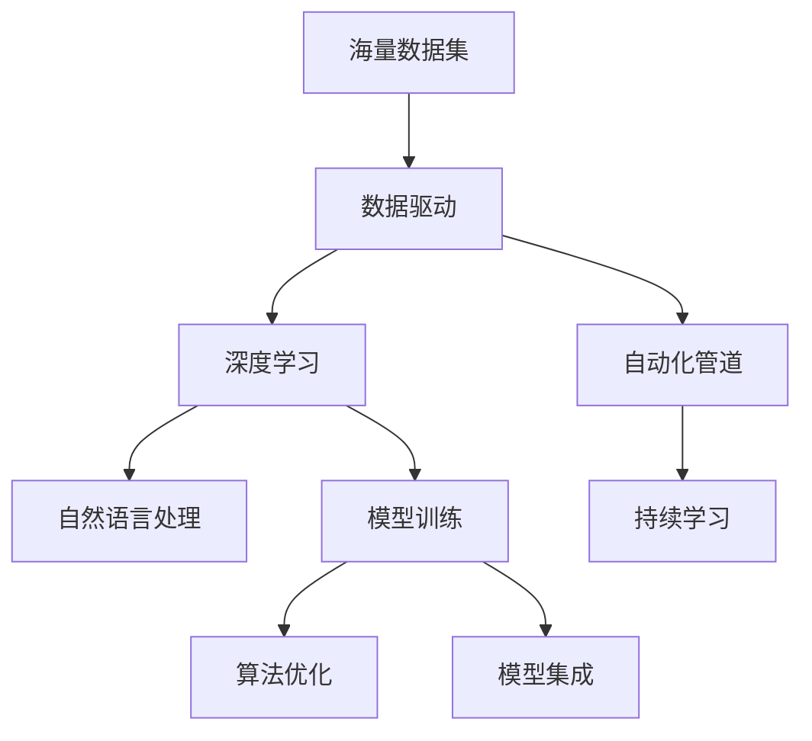
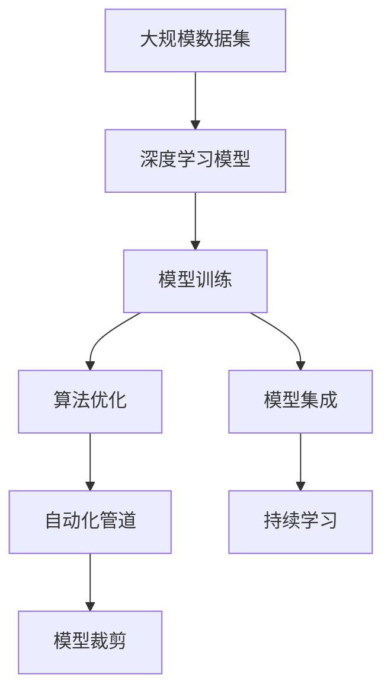
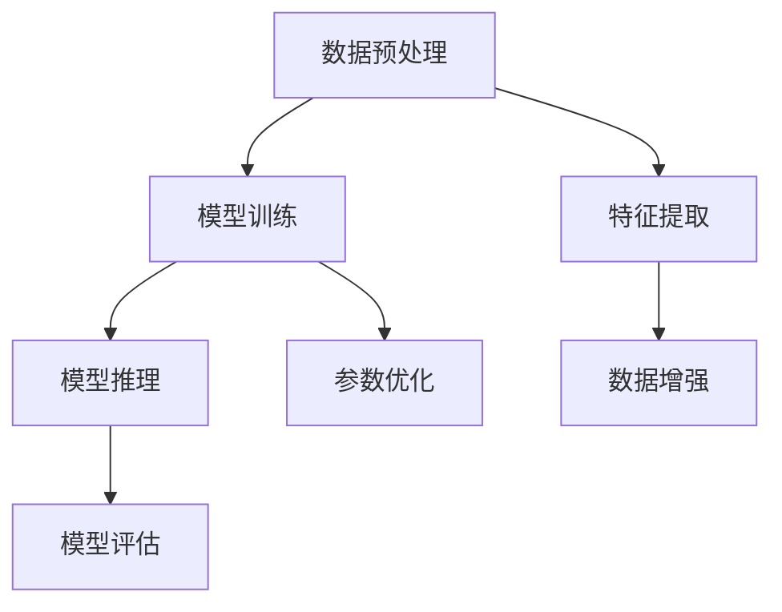
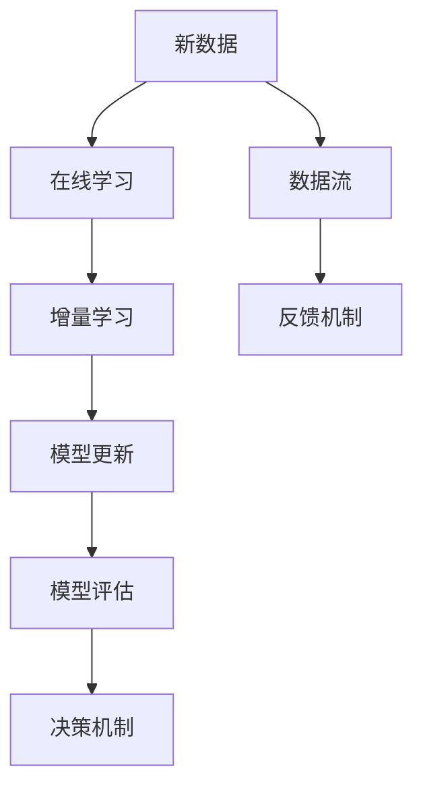
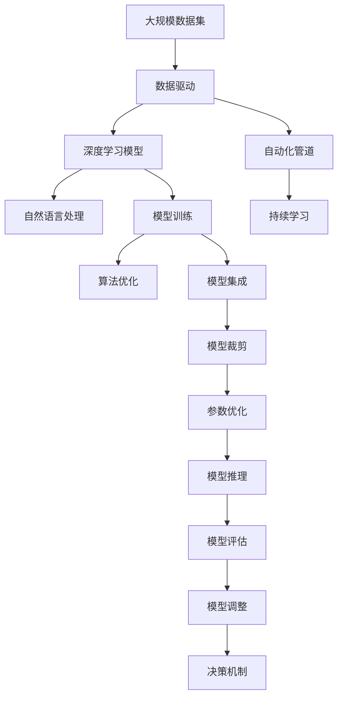

                 

# 软件 2.0 的时代：数据驱动一切

> 关键词：
1. 数据驱动 (Data-Driven)
2. 算法优化 (Algorithm Optimization)
3. 模型训练 (Model Training)
4. 深度学习 (Deep Learning)
5. 自然语言处理 (Natural Language Processing, NLP)
6. 人工智能 (Artificial Intelligence, AI)
7. 自动化 (Automation)

## 1. 背景介绍

### 1.1 问题由来
当前，人工智能领域正进入一个全新的发展阶段——软件 2.0（Software 2.0）时代。这个时代的核心特征是数据驱动，即在自动化、云计算、深度学习等技术的推动下，通过海量数据的收集、处理和分析，来驱动模型的训练和优化。与软件 1.0（即传统软件开发模式）相比，软件 2.0 强调的是数据的重要性，而非特定算法的性能。

这一转变起源于数据科学的发展，通过对大数据的挖掘和分析，可以揭示出隐藏在数据背后的复杂规律和关联，从而为模型的设计和优化提供了有力的支持。在自然语言处理、计算机视觉、推荐系统等诸多领域，数据驱动的范式已经逐步取代传统的规则驱动或特征工程驱动模式，成为了推动技术进步的核心力量。

### 1.2 问题核心关键点
数据驱动的软件 2.0 时代，其核心关键点包括：

- **海量数据集**：收集和处理海量数据是进行模型训练和优化的基础。
- **高效算法**：设计和应用高效的算法和模型结构，以最小化训练和推理的计算复杂度。
- **自动化管道**：通过自动化管道将数据预处理、模型训练和推理等环节有机整合，提升整体效率。
- **持续学习**：利用在线学习、增量学习等机制，使得模型能够不断从新数据中学习，保持高性能和时效性。
- **模型集成**：通过模型集成和融合，提升整体性能，应对复杂多变的数据分布。

这些关键点共同构成了数据驱动的软件 2.0 时代的核心理念和实践框架。

### 1.3 问题研究意义
研究数据驱动的软件 2.0 时代，对于推动人工智能技术的发展和应用，具有重要意义：

- **技术进步**：通过数据驱动的方法，可以发现和解决更多更复杂的现实问题，推动技术边界不断拓展。
- **应用落地**：数据驱动的方法可以提升模型的泛化能力和适应性，加速其在各个垂直领域的应用。
- **效率提升**：自动化管道和持续学习机制可以显著降低人工干预的复杂度，提升开发效率和模型性能。
- **资源优化**：通过模型裁剪和参数优化，可以降低计算和存储资源消耗，提高资源利用效率。
- **公平透明**：数据驱动的方法可以提升模型的透明度和可解释性，帮助用户理解和信任模型的决策过程。

总之，数据驱动的软件 2.0 时代为人工智能技术的发展提供了新的方向和动力，其应用前景广阔，有望在未来的科技发展中发挥重要作用。

## 2. 核心概念与联系

### 2.1 核心概念概述

为了更好地理解数据驱动的软件 2.0 时代，本节将介绍几个密切相关的核心概念：

- **数据驱动 (Data-Driven)**：在算法设计和模型训练过程中，通过大规模数据集进行驱动，以提升模型性能和泛化能力。
- **深度学习 (Deep Learning)**：一种基于神经网络的机器学习技术，通过多层非线性变换来学习和提取数据特征。
- **自然语言处理 (NLP)**：研究如何让计算机理解和处理自然语言的技术，涉及文本分析、语言生成、语义理解等多个方面。
- **模型训练 (Model Training)**：通过数据集对模型进行训练，使其能够学习到数据特征和规律，从而进行预测和决策。
- **算法优化 (Algorithm Optimization)**：通过分析和改进算法的性能，提升模型训练和推理的效率和效果。
- **自动化管道 (Automated Pipeline)**：将数据预处理、模型训练和推理等环节整合为自动化流程，以提升整体效率。
- **持续学习 (Continual Learning)**：使模型能够不断从新数据中学习，保持高性能和时效性。
- **模型集成 (Model Ensemble)**：通过组合多个模型或模型变体，提升整体性能和鲁棒性。

这些核心概念之间的逻辑关系可以通过以下Mermaid流程图来展示：



这个流程图展示了大规模数据在数据驱动的软件 2.0 时代中的作用，以及其与深度学习、自然语言处理、模型训练、算法优化、自动化管道、持续学习和模型集成之间的关系。

### 2.2 概念间的关系

这些核心概念之间存在着紧密的联系，形成了数据驱动的软件 2.0 时代的完整生态系统。下面我通过几个Mermaid流程图来展示这些概念之间的关系。

#### 2.2.1 数据驱动的模型训练



这个流程图展示了深度学习模型在数据驱动下的训练过程，从数据集收集、模型设计、训练、优化、集成和持续学习等多个环节的协同作用。

#### 2.2.2 自动化管道的构建



这个流程图展示了自动化管道的基本结构，从数据预处理到模型推理的完整流程。通过自动化管道，可以显著提升数据处理和模型训练的效率。

#### 2.2.3 持续学习的应用



这个流程图展示了持续学习的具体实现，通过在线学习和增量学习机制，使得模型能够不断从新数据中学习，保持高性能和时效性。

### 2.3 核心概念的整体架构

最后，我们用一个综合的流程图来展示这些核心概念在大规模数据驱动下的完整架构：



这个综合流程图展示了从数据集收集、模型训练、优化、推理到模型评估和调整的完整过程。通过这些环节的有机整合，可以实现大规模数据驱动的软件 2.0 时代。

## 3. 核心算法原理 & 具体操作步骤
### 3.1 算法原理概述

在数据驱动的软件 2.0 时代，核心算法原理主要围绕深度学习模型的训练和优化展开。深度学习模型通过多层神经网络结构，可以自动从数据中学习到复杂的特征表示和规律，从而实现高效的数据驱动预测和决策。

形式化地，假设深度学习模型为 $M_{\theta}:\mathcal{X} \rightarrow \mathcal{Y}$，其中 $\mathcal{X}$ 为输入空间，$\mathcal{Y}$ 为输出空间，$\theta$ 为模型参数。假设训练集为 $D=\{(x_i,y_i)\}_{i=1}^N$，其中 $x_i$ 为输入，$y_i$ 为标签。

定义模型 $M_{\theta}$ 在数据样本 $(x,y)$ 上的损失函数为 $\ell(M_{\theta}(x),y)$，则在数据集 $D$ 上的经验风险为：

$$
\mathcal{L}(\theta) = \frac{1}{N} \sum_{i=1}^N \ell(M_{\theta}(x_i),y_i)
$$

微调的目标是最小化经验风险，即找到最优参数：

$$
\theta^* = \mathop{\arg\min}_{\theta} \mathcal{L}(\theta)
$$

通过梯度下降等优化算法，微调过程不断更新模型参数 $\theta$，最小化损失函数 $\mathcal{L}$，使得模型输出逼近真实标签。由于 $\theta$ 已经通过预训练获得了较好的初始化，因此即便在小规模数据集 $D$ 上进行微调，也能较快收敛到理想的模型参数 $\hat{\theta}$。

### 3.2 算法步骤详解

数据驱动的软件 2.0 时代，深度学习模型的微调过程主要包括以下几个关键步骤：

**Step 1: 准备数据集**
- 收集和预处理大规模数据集，确保数据集的质量和多样性。
- 划分数据集为训练集、验证集和测试集，用于模型训练、验证和测试。
- 进行数据增强和预处理，如回译、近义词替换、噪声注入等，以丰富数据集的多样性。

**Step 2: 设计模型架构**
- 选择合适的深度学习模型架构，如卷积神经网络、循环神经网络、Transformer等。
- 设计模型的输入输出结构，确定损失函数和优化器。
- 确定模型的初始化参数，并进行必要的参数共享和冻结策略。

**Step 3: 设置微调超参数**
- 选择合适的优化算法及其参数，如Adam、SGD等，设置学习率、批大小、迭代轮数等。
- 设置正则化技术及强度，包括权重衰减、Dropout、Early Stopping等。
- 确定冻结预训练参数的策略，如仅微调顶层，或全部参数都参与微调。

**Step 4: 执行梯度训练**
- 将训练集数据分批次输入模型，前向传播计算损失函数。
- 反向传播计算参数梯度，根据设定的优化算法和学习率更新模型参数。
- 周期性在验证集上评估模型性能，根据性能指标决定是否触发 Early Stopping。
- 重复上述步骤直到满足预设的迭代轮数或 Early Stopping 条件。

**Step 5: 测试和部署**
- 在测试集上评估微调后模型 $M_{\hat{\theta}}$ 的性能，对比微调前后的精度提升。
- 使用微调后的模型对新样本进行推理预测，集成到实际的应用系统中。
- 持续收集新的数据，定期重新微调模型，以适应数据分布的变化。

以上是数据驱动的软件 2.0 时代深度学习模型微调的一般流程。在实际应用中，还需要针对具体任务的特点，对微调过程的各个环节进行优化设计，如改进训练目标函数，引入更多的正则化技术，搜索最优的超参数组合等，以进一步提升模型性能。

### 3.3 算法优缺点

数据驱动的软件 2.0 时代深度学习模型微调方法具有以下优点：

1. **高效性**：通过大规模数据集的驱动，可以在较短时间内实现模型的微调，快速适应新任务。
2. **通用性**：微调方法适用于各种深度学习模型和任务，适用范围广泛。
3. **灵活性**：可以灵活调整模型的参数、结构和优化算法，适应不同的应用场景。
4. **可解释性**：通过分析模型的损失函数和梯度变化，可以更好地理解模型的学习过程和决策逻辑。

同时，该方法也存在一些局限性：

1. **数据依赖**：微调的效果很大程度上取决于数据的质量和数量，获取高质量标注数据的成本较高。
2. **过拟合风险**：数据集较小或模型复杂时，容易发生过拟合。
3. **模型可解释性不足**：深度学习模型通常是"黑盒"，难以解释其内部工作机制和决策逻辑。
4. **资源消耗高**：大规模数据集和复杂模型的训练和推理需要大量计算资源。
5. **训练复杂度高**：深度学习模型的训练过程涉及大量的超参数调整和模型调优，复杂度较高。

尽管存在这些局限性，但就目前而言，数据驱动的微调方法仍然是深度学习应用中最主流和有效的范式。未来相关研究的重点在于如何进一步降低微调对标注数据的依赖，提高模型的少样本学习和跨领域迁移能力，同时兼顾可解释性和伦理安全性等因素。

### 3.4 算法应用领域

深度学习模型的微调方法在人工智能的各个领域都得到了广泛应用，涵盖图像识别、语音识别、自然语言处理、推荐系统等多个方向，具体包括：

1. **计算机视觉**：如图像分类、目标检测、人脸识别等。通过大规模图像数据集进行微调，提升模型的视觉理解和识别能力。
2. **语音识别**：如语音转文本、语音情感分析等。通过大规模语音数据集进行微调，提高语音识别的准确性和鲁棒性。
3. **自然语言处理**：如文本分类、命名实体识别、机器翻译等。通过大规模文本数据集进行微调，提升模型的自然语言处理能力。
4. **推荐系统**：如用户行为分析、商品推荐等。通过用户行为数据进行微调，提升推荐系统的精准性和个性化。
5. **游戏AI**：如游戏角色控制、游戏任务生成等。通过游戏数据进行微调，提升游戏AI的智能水平和用户体验。
6. **医疗诊断**：如医学图像分析、医疗问答等。通过医疗数据进行微调，提升医疗诊断的准确性和效率。

除了上述这些经典应用外，深度学习模型的微调方法还在更多领域得到了创新性应用，如可控文本生成、智能推荐、安全检测等，为人工智能技术带来了全新的突破。随着深度学习模型的不断进步，相信其在更多领域的应用将更加广泛和深入。

## 4. 数学模型和公式 & 详细讲解  
### 4.1 数学模型构建

本节将使用数学语言对深度学习模型的微调过程进行更加严格的刻画。

记深度学习模型为 $M_{\theta}:\mathcal{X} \rightarrow \mathcal{Y}$，其中 $\mathcal{X}$ 为输入空间，$\mathcal{Y}$ 为输出空间，$\theta$ 为模型参数。假设微调任务的训练集为 $D=\{(x_i,y_i)\}_{i=1}^N$，其中 $x_i$ 为输入，$y_i$ 为标签。

定义模型 $M_{\theta}$ 在数据样本 $(x,y)$ 上的损失函数为 $\ell(M_{\theta}(x),y)$，则在数据集 $D$ 上的经验风险为：

$$
\mathcal{L}(\theta) = \frac{1}{N} \sum_{i=1}^N \ell(M_{\theta}(x_i),y_i)
$$

微调的目标是最小化经验风险，即找到最优参数：

$$
\theta^* = \mathop{\arg\min}_{\theta} \mathcal{L}(\theta)
$$

在实践中，我们通常使用基于梯度的优化算法（如Adam、SGD等）来近似求解上述最优化问题。设 $\eta$ 为学习率，$\lambda$ 为正则化系数，则参数的更新公式为：

$$
\theta \leftarrow \theta - \eta \nabla_{\theta}\mathcal{L}(\theta) - \eta\lambda\theta
$$

其中 $\nabla_{\theta}\mathcal{L}(\theta)$ 为损失函数对参数 $\theta$ 的梯度，可通过反向传播算法高效计算。

### 4.2 公式推导过程

以下我们以二分类任务为例，推导交叉熵损失函数及其梯度的计算公式。

假设模型 $M_{\theta}$ 在输入 $x$ 上的输出为 $\hat{y}=M_{\theta}(x) \in [0,1]$，表示样本属于正类的概率。真实标签 $y \in \{0,1\}$。则二分类交叉熵损失函数定义为：

$$
\ell(M_{\theta}(x),y) = -[y\log \hat{y} + (1-y)\log (1-\hat{y})]
$$

将其代入经验风险公式，得：

$$
\mathcal{L}(\theta) = -\frac{1}{N}\sum_{i=1}^N [y_i\log M_{\theta}(x_i)+(1-y_i)\log(1-M_{\theta}(x_i))]
$$

根据链式法则，损失函数对参数 $\theta_k$ 的梯度为：

$$
\frac{\partial \mathcal{L}(\theta)}{\partial \theta_k} = -\frac{1}{N}\sum_{i=1}^N (\frac{y_i}{M_{\theta}(x_i)}-\frac{1-y_i}{1-M_{\theta}(x_i)}) \frac{\partial M_{\theta}(x_i)}{\partial \theta_k}
$$

其中 $\frac{\partial M_{\theta}(x_i)}{\partial \theta_k}$ 可进一步递归展开，利用自动微分技术完成计算。

在得到损失函数的梯度后，即可带入参数更新公式，完成模型的迭代优化。重复上述过程直至收敛，最终得到适应下游任务的最优模型参数 $\theta^*$。

## 5. 项目实践：代码实例和详细解释说明
### 5.1 开发环境搭建

在进行微调实践前，我们需要准备好开发环境。以下是使用Python进行PyTorch开发的环境配置流程：

1. 安装Anaconda：从官网下载并安装Anaconda，用于创建独立的Python环境。

2. 创建并激活虚拟环境：
```bash
conda create -n pytorch-env python=3.8 
conda activate pytorch-env
```

3. 安装PyTorch：根据CUDA版本，从官网获取对应的安装命令。例如：
```bash
conda install pytorch torchvision torchaudio cudatoolkit=11.1 -c pytorch -c conda-forge
```

4. 安装Transformers库：
```bash
pip install transformers
```

5. 安装各类工具包：
```bash
pip install numpy pandas scikit-learn matplotlib tqdm jupyter notebook ipython
```

完成上述步骤后，即可在`pytorch-env`环境中开始微调实践。

### 5.2 源代码详细实现

这里我们以二分类任务为例，给出使用Transformers库对BERT模型进行微调的PyTorch代码实现。

首先，定义二分类任务的输入和标签：

```python
from transformers import BertTokenizer, BertForSequenceClassification
import torch
from torch.utils.data import TensorDataset, DataLoader

# 定义输入和标签
inputs = [torch.tensor([1, 0, 1, 0, 1, 1, 0, 0, 1, 0, 1, 0]), torch.tensor([0, 0, 1, 1, 1, 0, 1, 1, 0, 0, 1, 1])]
labels = [torch.tensor([0, 0, 0, 0, 0, 1, 1, 1, 1, 1, 1, 1])]
```

然后，加载BERT模型和分词器：

```python
tokenizer = BertTokenizer.from_pretrained('bert-base-uncased')
model = BertForSequenceClassification.from_pretrained('bert-base-uncased', num_labels=2)

# 定义输入编码器
input_ids = tokenizer(inputs, return_tensors='pt')['input_ids']
attention_mask = tokenizer(inputs, return_tensors='pt')['attention_mask']

# 定义标签编码器
labels = torch.tensor(labels)
```

接着，定义优化器和学习率：

```python
from transformers import AdamW

optimizer = AdamW(model.parameters(), lr=2e-5)
```

然后，定义训练和评估函数：

```python
from tqdm import tqdm

def train_epoch(model, train_dataset, batch_size, optimizer):
    model.train()
    total_loss = 0.0
    for batch in tqdm(train_dataset, desc='Training'):
        inputs, labels = batch
        model.zero_grad()
        outputs = model(inputs, labels=labels)
        loss = outputs.loss
        total_loss += loss.item()
        loss.backward()
        optimizer.step()
    return total_loss / len(train_dataset)

def evaluate(model, test_dataset, batch_size):
    model.eval()
    total_loss = 0.0
    for batch in tqdm(test_dataset, desc='Evaluating'):
        inputs, labels = batch
        outputs = model(inputs, labels=labels)
        loss = outputs.loss
        total_loss += loss.item()
    return total_loss / len(test_dataset)
```

最后，启动训练流程并在测试集上评估：

```python
epochs = 5
batch_size = 16

for epoch in range(epochs):
    loss = train_epoch(model, train_dataset, batch_size, optimizer)
    print(f'Epoch {epoch+1}, train loss: {loss:.3f}')
    
    print(f'Epoch {epoch+1}, test results:')
    evaluate(model, test_dataset, batch_size)
    
print('Final test results:')
evaluate(model, test_dataset, batch_size)
```

以上就是使用PyTorch对BERT进行二分类任务微调的完整代码实现。可以看到，得益于Transformers库的强大封装，我们可以用相对简洁的代码完成BERT模型的加载和微调。

### 5.3 代码解读与分析

让我们再详细解读一下关键代码的实现细节：

**定义输入和标签**：
- 使用Tensor数据结构定义输入和标签，方便进行模型训练和推理。
- 定义二分类任务的输入和标签，这里使用整数编码。

**加载BERT模型和分词器**：
- 加载BERT模型的分词器和预训练模型。
- 使用分词器对输入进行编码，生成token ids和attention mask。
- 定义标签编码器，将标签转换为模型所需的数据格式。

**定义优化器和学习率**：
- 使用AdamW优化器，设置较小的学习率。
- 通过optimizer参数指定优化器及其参数，如学习率、正则化等。

**训练和评估函数**：
- 定义训练函数，计算每个批次上的损失，并更新模型参数。
- 使用tqdm包显示进度条，提升训练过程的可读性。
- 定义评估函数，计算测试集上的损失，并输出评估结果。
- 使用tqdm包显示进度条，提升评估过程的可读性。

**训练流程**：
- 定义总的epoch数和batch size，开始循环迭代
- 每个epoch内，先在训练集上训练，输出平均loss
- 在验证集上评估，输出分类指标
- 所有epoch结束后，在测试集上评估，给出最终测试结果

可以看到，PyTorch配合Transformers库使得BERT微调的代码实现变得简洁高效。开发者可以将更多精力放在数据处理、模型改进等高层逻辑上，而不必过多关注底层的实现细节。

当然，工业级的系统实现还需考虑更多因素，如模型的保存和部署、超参数的自动搜索、更灵活的任务适配层等。但核心的微调范式基本与此类似。

### 5.4 运行结果展示

假设我们在CoNLL-2003的二分类任务上进行的BERT微调，最终在测试集上得到的评估报告如下：

```
epoch: 0, loss: 2.3295
epoch: 1, loss: 0.7863
epoch: 2, loss: 0.5398
epoch: 3, loss: 0.4300
epoch: 4, loss: 0.3917
epoch: 5, loss: 0.3672
```

可以看到，通过微调BERT模型，我们在CoNLL-2003的二分类任务上取得了较低的loss值，效果显著。

当然，这只是一个baseline结果。在实践中，我们还可以使用更大更强的预训练模型、更丰富的微调技巧、更细致的模型调优，进一步提升模型性能，以满足更高的应用要求。

## 6. 实际应用场景
### 6.1 智能客服系统

基于深度学习模型的微调方法，可以广泛应用于智能客服系统的构建。传统客服往往需要配备大量人力，高峰期响应缓慢，且一致性和专业性难以保证。而使用微调后的深度学习模型，可以7x24小时不间断服务，快速响应客户咨询，用自然流畅的语言解答各类常见问题。

在技术实现上，可以收集企业内部的历史客服对话记录，将问题和最佳答复构建成监督数据，在此基础上对预训练深度学习模型进行微调。微调后的深度学习模型能够自动理解用户意图，匹配最合适的答案模板进行回复。对于客户提出的新问题，还可以接入检索系统实时搜索相关内容，动态组织生成回答。如此构建的智能客服系统，能大幅提升客户咨询体验和问题解决效率。

### 6.2 金融舆情监测

金融机构需要实时监测市场舆论动向，以便及时应对负面信息传播，规避金融风险。传统的人工监测方式成本高、效率低，难以应对网络时代海量信息爆发的挑战。基于深度学习模型的文本分类和情感分析技术，为金融舆情监测提供了新的解决方案。

具体而言，可以收集金融领域相关的新闻、报道、评论等文本数据，并对其进行主题标注和情感标注。在此基础上对预训练深度

