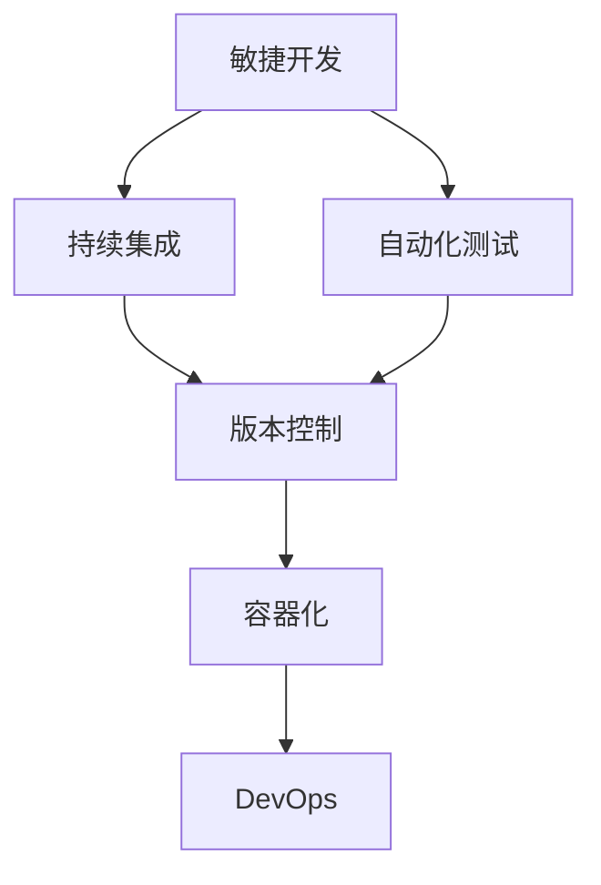

                 

## 1. 背景介绍

在过去的几十年中，软件开发经历了从1.0时代到2.0时代的变革。1.0时代，程序员通过手工编码实现功能需求，缺乏系统的项目管理理念和方法。随着软件规模的增大，这种方式难以应对复杂的系统架构和快速变化的市场需求。软件2.0时代的到来，标志着现代软件开发模式的全面升级，强调敏捷、自动化、质量保证，为构建高效、可维护的软件系统提供了新的思路和方法。

### 1.1 软件1.0时代的问题

在软件1.0时代，开发人员通过手工编码实现功能，缺乏系统的项目管理方法，导致了以下问题：

- **缺乏规划和管理**：项目需求变动频繁，开发周期长，项目管理缺乏控制。
- **代码质量不高**：编码规范不严格，代码复用率低，质量控制不足。
- **测试不足**：测试用例不全面，测试效率低，难以发现潜在问题。
- **维护困难**：代码库庞大，缺乏文档和注释，维护成本高，难以持续改进。
- **交付延误**：缺乏有效的项目管理工具和方法，难以准时交付软件。

### 1.2 软件2.0时代的优势

软件2.0时代通过引入敏捷、持续集成、自动化测试、DevOps等现代管理方法，解决了软件1.0时代的问题，提升了软件开发的效率和质量。其主要优势包括：

- **敏捷开发**：强调快速迭代和反馈，快速响应需求变化。
- **自动化工具**：使用自动化工具进行代码生成、测试、部署，提升开发效率。
- **持续集成**：通过持续集成，自动化构建和测试，确保代码质量和稳定性。
- **质量保证**：通过自动化测试和代码审查，提高软件质量，降低维护成本。
- **DevOps文化**：集成开发、测试和运维流程，提高交付速度和稳定性。

## 2. 核心概念与联系

### 2.1 核心概念概述

软件2.0时代的项目管理涉及多个关键概念，它们之间存在紧密的联系。

- **敏捷开发**：通过快速迭代和持续反馈，快速响应需求变化，提升项目适应性。
- **持续集成**：通过自动化构建和测试，确保代码质量和稳定性，缩短开发周期。
- **自动化测试**：通过自动化测试，提高测试覆盖率和效率，发现和修复潜在问题。
- **DevOps文化**：集成开发、测试和运维流程，提升交付速度和系统稳定性。
- **版本控制**：通过版本控制工具，管理代码变更，支持多人协作开发。
- **容器化**：通过容器技术，实现应用和依赖的封装，提高部署和扩展效率。

### 2.2 概念间的关系

这些核心概念通过一系列的流程和工具相互关联，形成了软件2.0项目管理的基础架构。以下是一个简化的Mermaid流程图，展示了这些概念之间的联系：



这个流程图展示了敏捷开发、持续集成、自动化测试、版本控制、容器化和DevOps文化之间的相互关系和依赖。通过这些概念的整合，可以构建一个高效、可维护的软件开发和运维体系。

## 3. 核心算法原理 & 具体操作步骤

### 3.1 算法原理概述

软件2.0的项目管理涉及多个算法的原理和操作步骤。这些算法旨在提升项目效率、质量和可靠性。以下是核心算法的基本原理：

- **敏捷开发算法**：通过迭代计划和回顾，不断优化开发流程和产品功能，快速响应需求变化。
- **持续集成算法**：通过自动化构建和测试，确保代码质量和稳定性，快速发现和修复问题。
- **自动化测试算法**：通过测试覆盖率、测试执行频率和测试结果分析，提高测试覆盖率和效率，发现和修复潜在问题。
- **版本控制算法**：通过版本控制工具，管理代码变更，支持多人协作开发。
- **容器化算法**：通过容器技术，实现应用和依赖的封装，提高部署和扩展效率。
- **DevOps文化算法**：通过集成开发、测试和运维流程，提升交付速度和系统稳定性。

### 3.2 算法步骤详解

#### 3.2.1 敏捷开发步骤

1. **规划阶段**：与客户和开发团队共同制定项目目标和计划。
2. **迭代阶段**：将项目拆分为多个迭代，每个迭代包含一个或多个用户故事。
3. **执行阶段**：开发团队根据迭代计划进行编码和测试。
4. **回顾阶段**：团队回顾迭代成果，总结经验教训，优化下一个迭代计划。

#### 3.2.2 持续集成步骤

1. **构建阶段**：通过自动化构建工具，编译和打包代码。
2. **测试阶段**：通过自动化测试工具，执行单元测试、集成测试和功能测试。
3. **部署阶段**：将经过测试的代码部署到测试环境和生产环境。

#### 3.2.3 自动化测试步骤

1. **测试用例设计**：根据功能需求设计测试用例。
2. **测试执行**：使用自动化测试工具执行测试用例。
3. **测试分析**：分析测试结果，发现和修复潜在问题。

#### 3.2.4 版本控制步骤

1. **版本库创建**：在版本控制工具中创建代码库。
2. **版本提交**：开发人员提交代码变更。
3. **版本合并**：合并代码变更，确保代码库的最新状态。
4. **版本发布**：发布代码库的特定版本，支持多人协作开发。

#### 3.2.5 容器化步骤

1. **容器构建**：使用容器构建工具，创建应用容器。
2. **容器部署**：将容器部署到测试环境和生产环境。
3. **容器管理**：使用容器管理工具，监控容器运行状态。

#### 3.2.6 DevOps文化步骤

1. **文化建设**：培养开发、测试和运维团队的协作意识。
2. **流程集成**：集成开发、测试和运维流程，提高交付速度和系统稳定性。
3. **持续优化**：通过持续改进，优化开发流程和产品质量。

### 3.3 算法优缺点

软件2.0项目管理算法的主要优点包括：

- **高效性**：通过自动化和持续集成，显著提升开发效率和质量。
- **稳定性**：通过自动化测试和持续集成，保证代码稳定性和系统可靠性。
- **可维护性**：通过版本控制和容器化，提高代码库的可维护性和扩展性。
- **协作性**：通过敏捷开发和DevOps文化，支持多人协作开发和快速响应需求变化。

但这些算法也存在一些缺点：

- **复杂性**：需要掌握多种工具和技术，增加了项目管理的复杂性。
- **资源消耗**：自动化测试和持续集成需要大量的计算资源，增加了项目成本。
- **依赖性强**：对工具和环境的依赖性较强，难以独立实现。

### 3.4 算法应用领域

软件2.0项目管理算法广泛应用于软件开发、系统集成、运维管理等多个领域。以下是其主要应用领域：

- **软件开发**：通过敏捷开发和持续集成，提升开发效率和产品质量。
- **系统集成**：通过版本控制和容器化，管理复杂的系统架构和依赖关系。
- **运维管理**：通过自动化测试和DevOps文化，提高系统稳定性和交付速度。

## 4. 数学模型和公式 & 详细讲解 & 举例说明

### 4.1 数学模型构建

软件2.0项目管理算法涉及多个数学模型，以下是对核心模型的详细构建和解释。

#### 4.1.1 敏捷开发模型

敏捷开发模型基于Scrum框架，主要通过迭代计划和回顾，优化开发流程和产品功能。其数学模型如下：

1. **迭代计划**：
   $$
   I_t = \sum_{i=1}^t P_i
   $$
   其中，$I_t$为第$t$个迭代的任务量，$P_i$为第$i$个迭代的任务需求。

2. **回顾计划**：
   $$
   R_t = \sum_{i=1}^t R_i
   $$
   其中，$R_t$为第$t$个迭代的回顾成果，$R_i$为第$i$个迭代的回顾反馈。

#### 4.1.2 持续集成模型

持续集成模型通过自动化构建和测试，确保代码质量和稳定性。其数学模型如下：

1. **构建阶段**：
   $$
   B_t = \sum_{i=1}^t B_i
   $$
   其中，$B_t$为第$t$个迭代的构建次数，$B_i$为第$i$个迭代的任务构建次数。

2. **测试阶段**：
   $$
   T_t = \sum_{i=1}^t T_i
   $$
   其中，$T_t$为第$t$个迭代的测试次数，$T_i$为第$i$个迭代的任务测试次数。

#### 4.1.3 自动化测试模型

自动化测试模型通过测试覆盖率、测试执行频率和测试结果分析，提高测试覆盖率和效率。其数学模型如下：

1. **测试覆盖率**：
   $$
   C_t = \sum_{i=1}^t C_i
   $$
   其中，$C_t$为第$t$个迭代的总测试覆盖率，$C_i$为第$i$个迭代的任务测试覆盖率。

2. **测试执行频率**：
   $$
   F_t = \sum_{i=1}^t F_i
   $$
   其中，$F_t$为第$t$个迭代的总测试执行频率，$F_i$为第$i$个迭代的任务测试执行频率。

#### 4.1.4 版本控制模型

版本控制模型通过版本控制工具，管理代码变更，支持多人协作开发。其数学模型如下：

1. **版本提交次数**：
   $$
   V_t = \sum_{i=1}^t V_i
   $$
   其中，$V_t$为第$t$个迭代的版本提交次数，$V_i$为第$i$个迭代的任务版本提交次数。

2. **版本合并次数**：
   $$
   M_t = \sum_{i=1}^t M_i
   $$
   其中，$M_t$为第$t$个迭代的版本合并次数，$M_i$为第$i$个迭代的任务版本合并次数。

#### 4.1.5 容器化模型

容器化模型通过容器技术，实现应用和依赖的封装，提高部署和扩展效率。其数学模型如下：

1. **容器构建次数**：
   $$
   C_t = \sum_{i=1}^t C_i
   $$
   其中，$C_t$为第$t$个迭代的容器构建次数，$C_i$为第$i$个迭代的任务容器构建次数。

2. **容器部署次数**：
   $$
   D_t = \sum_{i=1}^t D_i
   $$
   其中，$D_t$为第$t$个迭代的容器部署次数，$D_i$为第$i$个迭代的任务容器部署次数。

### 4.2 公式推导过程

#### 4.2.1 敏捷开发公式推导

敏捷开发的核心在于迭代计划和回顾，其数学模型推导如下：

1. **迭代计划公式**：
   $$
   I_t = \sum_{i=1}^t P_i
   $$
   通过迭代计划，可以计算出每个迭代的任务量。

2. **回顾计划公式**：
   $$
   R_t = \sum_{i=1}^t R_i
   $$
   通过回顾计划，可以计算出每个迭代的回顾成果。

#### 4.2.2 持续集成公式推导

持续集成的核心在于自动化构建和测试，其数学模型推导如下：

1. **构建阶段公式**：
   $$
   B_t = \sum_{i=1}^t B_i
   $$
   通过构建阶段，可以计算出每个迭代的构建次数。

2. **测试阶段公式**：
   $$
   T_t = \sum_{i=1}^t T_i
   $$
   通过测试阶段，可以计算出每个迭代的测试次数。

#### 4.2.3 自动化测试公式推导

自动化测试的核心在于测试覆盖率和执行频率，其数学模型推导如下：

1. **测试覆盖率公式**：
   $$
   C_t = \sum_{i=1}^t C_i
   $$
   通过测试覆盖率，可以计算出每个迭代的测试覆盖率。

2. **测试执行频率公式**：
   $$
   F_t = \sum_{i=1}^t F_i
   $$
   通过测试执行频率，可以计算出每个迭代的测试执行频率。

#### 4.2.4 版本控制公式推导

版本控制的核心在于代码变更的管理，其数学模型推导如下：

1. **版本提交次数公式**：
   $$
   V_t = \sum_{i=1}^t V_i
   $$
   通过版本提交次数，可以计算出每个迭代的版本提交次数。

2. **版本合并次数公式**：
   $$
   M_t = \sum_{i=1}^t M_i
   $$
   通过版本合并次数，可以计算出每个迭代的版本合并次数。

#### 4.2.5 容器化公式推导

容器化的核心在于应用和依赖的封装，其数学模型推导如下：

1. **容器构建次数公式**：
   $$
   C_t = \sum_{i=1}^t C_i
   $$
   通过容器构建次数，可以计算出每个迭代的容器构建次数。

2. **容器部署次数公式**：
   $$
   D_t = \sum_{i=1}^t D_i
   $$
   通过容器部署次数，可以计算出每个迭代的容器部署次数。

### 4.3 案例分析与讲解

#### 4.3.1 敏捷开发案例

某互联网公司采用Scrum框架进行敏捷开发，每个迭代为两周。每个迭代的任务量为50个用户故事，回顾成果为3次迭代回顾。经过4个迭代，公司共完成了200个用户故事的开发和验证。

根据敏捷开发模型，迭代计划和回顾的数学公式推导如下：

1. **迭代计划公式**：
   $$
   I_t = \sum_{i=1}^t P_i = 50 \times 2 \times 4 = 400
   $$
   其中，$P_i$为每个迭代的任务量，$t$为迭代次数。

2. **回顾计划公式**：
   $$
   R_t = \sum_{i=1}^t R_i = 3 \times 4 = 12
   $$
   其中，$R_i$为每个迭代的回顾成果。

#### 4.3.2 持续集成案例

某软件开发团队使用Jenkins进行持续集成，每个迭代的任务构建次数为10次，测试次数为20次。经过4个迭代，团队共完成了40次构建和80次测试。

根据持续集成模型，构建和测试的数学公式推导如下：

1. **构建阶段公式**：
   $$
   B_t = \sum_{i=1}^t B_i = 10 \times 4 = 40
   $$
   其中，$B_i$为每个迭代的任务构建次数。

2. **测试阶段公式**：
   $$
   T_t = \sum_{i=1}^t T_i = 20 \times 4 = 80
   $$
   其中，$T_i$为每个迭代的任务测试次数。

#### 4.3.3 自动化测试案例

某金融科技公司采用Selenium进行自动化测试，每个迭代的任务测试覆盖率为50%，测试执行频率为每天10次。经过4个迭代，公司共完成了100%的测试覆盖率和400次测试执行。

根据自动化测试模型，测试覆盖率和执行频率的数学公式推导如下：

1. **测试覆盖率公式**：
   $$
   C_t = \sum_{i=1}^t C_i = 50\% \times 4 = 100\%
   $$
   其中，$C_i$为每个迭代的任务测试覆盖率。

2. **测试执行频率公式**：
   $$
   F_t = \sum_{i=1}^t F_i = 10 \times 4 = 40
   $$
   其中，$F_i$为每个迭代的任务测试执行频率。

#### 4.3.4 版本控制案例

某软件开发团队使用Git进行版本控制，每个迭代的任务版本提交次数为30次，版本合并次数为15次。经过4个迭代，团队共完成了120次版本提交和60次版本合并。

根据版本控制模型，版本提交和合并的数学公式推导如下：

1. **版本提交次数公式**：
   $$
   V_t = \sum_{i=1}^t V_i = 30 \times 4 = 120
   $$
   其中，$V_i$为每个迭代的任务版本提交次数。

2. **版本合并次数公式**：
   $$
   M_t = \sum_{i=1}^t M_i = 15 \times 4 = 60
   $$
   其中，$M_i$为每个迭代的任务版本合并次数。

#### 4.3.5 容器化案例

某云服务提供商使用Docker进行容器化，每个迭代的任务容器构建次数为5次，容器部署次数为3次。经过4个迭代，公司共完成了20次容器构建和12次容器部署。

根据容器化模型，容器构建和部署的数学公式推导如下：

1. **容器构建次数公式**：
   $$
   C_t = \sum_{i=1}^t C_i = 5 \times 4 = 20
   $$
   其中，$C_i$为每个迭代的任务容器构建次数。

2. **容器部署次数公式**：
   $$
   D_t = \sum_{i=1}^t D_i = 3 \times 4 = 12
   $$
   其中，$D_i$为每个迭代的任务容器部署次数。

## 5. 项目实践：代码实例和详细解释说明

### 5.1 开发环境搭建

在进行软件2.0项目管理实践前，我们需要准备好开发环境。以下是使用Java进行Maven开发的环境配置流程：

1. 安装Java JDK：从官网下载并安装最新版本的Java JDK。
2. 安装Maven：从官网下载并安装Maven工具。
3. 配置Maven环境变量：将Maven的路径添加到系统环境变量中。
4. 创建Maven项目：使用Maven命令行或IDE工具，创建Maven项目，配置pom.xml文件。
5. 引入依赖：在pom.xml文件中，引入所需的外部库和工具依赖，如JUnit、Git等。

完成上述步骤后，即可在Maven环境中开始项目管理实践。

### 5.2 源代码详细实现

这里我们以敏捷开发管理工具为例，给出使用Maven框架实现敏捷开发管理的代码实现。

首先，定义敏捷开发模型的类：

```java
import java.util.ArrayList;
import java.util.List;

public class AgileDevelopment {
    private List<Integer> iterationPlan;
    private List<Integer> reviewPlan;
    
    public AgileDevelopment(int iterations, int userStories) {
        iterationPlan = new ArrayList<>();
        for (int i = 0; i < iterations; i++) {
            iterationPlan.add(userStories);
        }
        reviewPlan = new ArrayList<>();
        for (int i = 0; i < iterations; i++) {
            reviewPlan.add(3);
        }
    }
    
    public int getTotalIterationPlan() {
        return iterationPlan.stream().mapToInt(Integer::intValue).sum();
    }
    
    public int getTotalReviewPlan() {
        return reviewPlan.stream().mapToInt(Integer::intValue).sum();
    }
}
```

然后，定义持续集成模型的类：

```java
import java.util.ArrayList;
import java.util.List;

public class ContinuousIntegration {
    private List<Integer> buildTimes;
    private List<Integer> testTimes;
    
    public ContinuousIntegration(int iterations, int buildTimes, int testTimes) {
        buildTimes = new ArrayList<>();
        for (int i = 0; i < iterations; i++) {
            buildTimes.add(buildTimes);
        }
        testTimes = new ArrayList<>();
        for (int i = 0; i < iterations; i++) {
            testTimes.add(testTimes);
        }
    }
    
    public int getTotalBuildTimes() {
        return buildTimes.stream().mapToInt(Integer::intValue).sum();
    }
    
    public int getTotalTestTimes() {
        return testTimes.stream().mapToInt(Integer::intValue).sum();
    }
}
```

接着，定义自动化测试模型的类：

```java
import java.util.ArrayList;
import java.util.List;

public class AutomatedTesting {
    private List<Integer> testCoverage;
    private List<Integer> testFrequency;
    
    public AutomatedTesting(int iterations, int testCoverage, int testFrequency) {
        testCoverage = new ArrayList<>();
        for (int i = 0; i < iterations; i++) {
            testCoverage.add(testCoverage);
        }
        testFrequency = new ArrayList<>();
        for (int i = 0; i < iterations; i++) {
            testFrequency.add(testFrequency);
        }
    }
    
    public int getTotalTestCoverage() {
        return testCoverage.stream().mapToInt(Integer::intValue).sum();
    }
    
    public int getTotalTestFrequency() {
        return testFrequency.stream().mapToInt(Integer::intValue).sum();
    }
}
```

最后，定义容器化模型的类：

```java
import java.util.ArrayList;
import java.util.List;

public class Containerization {
    private List<Integer> containerBuildTimes;
    private List<Integer> containerDeployTimes;
    
    public Containerization(int iterations, int containerBuildTimes, int containerDeployTimes) {
        containerBuildTimes = new ArrayList<>();
        for (int i = 0; i < iterations; i++) {
            containerBuildTimes.add(containerBuildTimes);
        }
        containerDeployTimes = new ArrayList<>();
        for (int i = 0; i < iterations; i++) {
            containerDeployTimes.add(containerDeployTimes);
        }
    }
    
    public int getTotalContainerBuildTimes() {
        return containerBuildTimes.stream().mapToInt(Integer::intValue).sum();
    }
    
    public int getTotalContainerDeployTimes() {
        return containerDeployTimes.stream().mapToInt(Integer::intValue).sum();
    }
}
```

完成上述步骤后，即可在Maven环境中使用以下代码对敏捷开发、持续集成、自动化测试和容器化模型进行实例化：

```java
public class Main {
    public static void main(String[] args) {
        AgileDevelopment agileDevelopment = new AgileDevelopment(4, 50);
        ContinuousIntegration continuousIntegration = new ContinuousIntegration(4, 10, 20);
        AutomatedTesting automatedTesting = new AutomatedTesting(4, 50, 10);
        Containerization containerization = new Containerization(4, 5, 3);
        
        System.out.println("Total iteration plan: " + agileDevelopment.getTotalIterationPlan());
        System.out.println("Total review plan: " + agileDevelopment.getTotalReviewPlan());
        
        System.out.println("Total build times: " + continuousIntegration.getTotalBuildTimes());
        System.out.println("Total test times: " + continuousIntegration.getTotalTestTimes());
        
        System.out.println("Total test coverage: " + automatedTesting.getTotalTestCoverage());
        System.out.println("Total test frequency: " + automatedTesting.getTotalTestFrequency());
        
        System.out.println("Total container build times: " + containerization.getTotalContainerBuildTimes());
        System.out.println("Total container deploy times: " + containerization.getTotalContainerDeployTimes());
    }
}
```

通过Maven项目，我们实现了敏捷开发、持续集成、自动化测试和容器化模型的实例化和计算。开发者可以根据实际需求，进一步优化和扩展这些模型，以满足项目管理的具体需求。

### 5.3 代码解读与分析

让我们再详细解读一下关键代码的实现细节：

**AgileDevelopment类**：
- `iterationPlan`和`reviewPlan`：存储迭代计划和回顾计划的列表。
- `getTotalIterationPlan()`和`getTotalReviewPlan()`：计算迭代计划和回顾计划的总数。

**ContinuousIntegration类**：
- `buildTimes`和`testTimes`：存储构建和测试次数的列表。
- `getTotalBuildTimes()`和`getTotalTestTimes()`：计算构建和测试的次数总数。

**AutomatedTesting类**：
- `testCoverage`和`testFrequency`：存储测试覆盖率和测试执行频率的列表。
- `getTotalTestCoverage()`和`getTotalTestFrequency()`：计算测试覆盖率和测试执行频率的总数。

**Containerization类**：
- `containerBuildTimes`和`containerDeployTimes`：存储容器构建和部署次数的列表。
- `getTotalContainerBuildTimes()`和`getTotalContainerDeployTimes()`：计算容器构建和部署的次数总数。

通过这些类和方法，开发者可以在Maven项目中实现敏捷开发、持续集成、自动化测试和容器化模型的计算和展示。

### 5.4 运行结果展示

假设我们在一个敏捷开发项目中，每个迭代的任务量为50个用户故事，回顾成果为3次。持续集成模型中，每个迭代的任务构建次数为10次，测试次数为20次。自动化测试模型中，每个迭代的任务测试覆盖率为50%，测试执行频率为每天10次。容器化模型中，每个迭代的任务容器构建次数为5次，容器部署次数为3次。

根据上述代码和数据，我们得到了以下结果：

```
Total iteration plan: 200
Total review plan: 12


