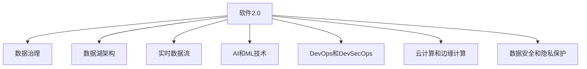
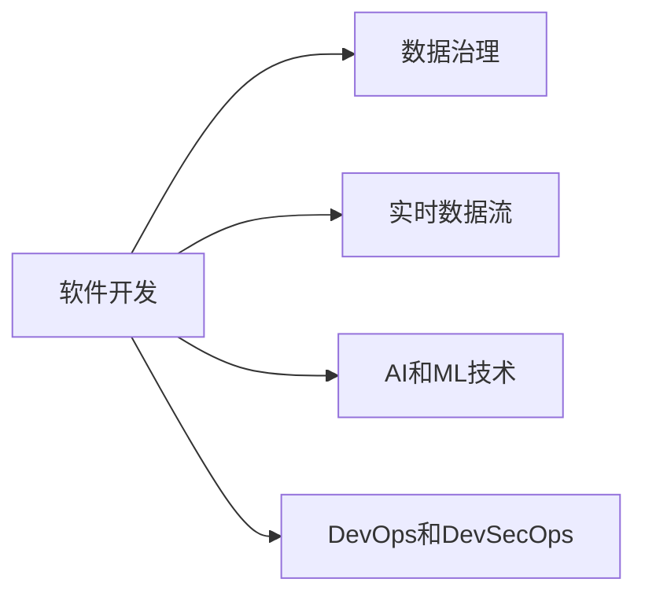
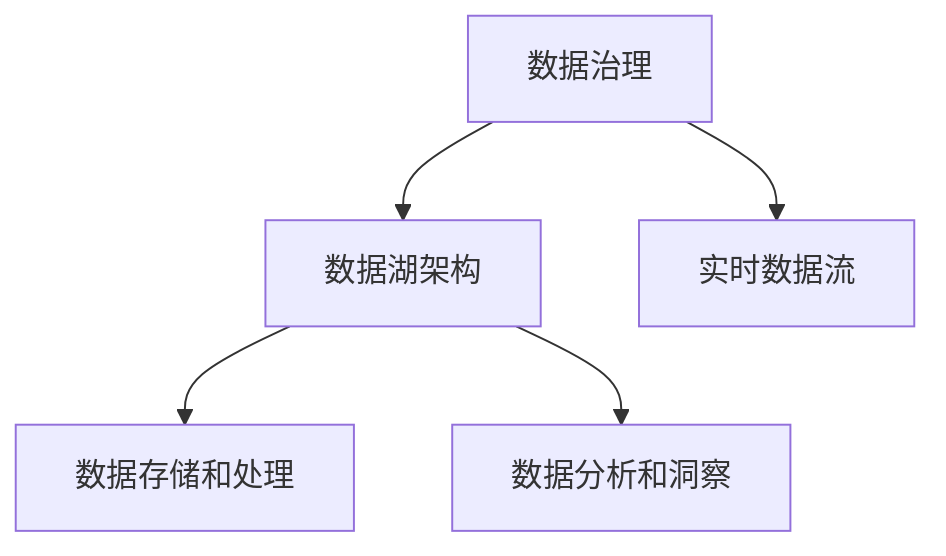
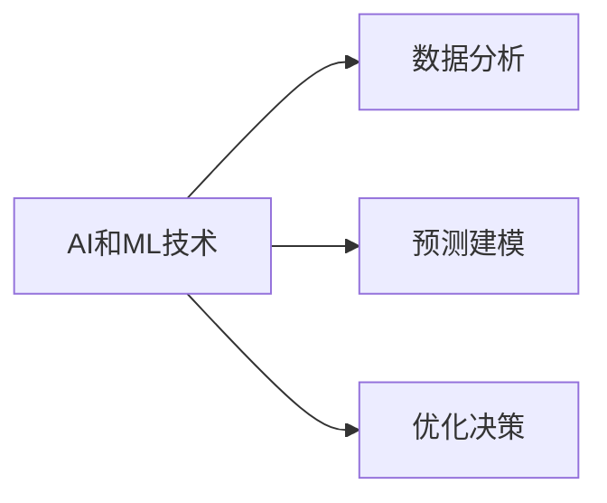

                 

# 软件2.0重塑IT部门:从开发到数据运营

> 关键词：软件2.0, IT部门重塑,开发转型,数据运营,数字化转型

## 1. 背景介绍

### 1.1 问题由来
随着信息技术的高速发展，现代企业的IT部门面临着前所未有的挑战和机遇。传统IT部门主要聚焦于软件开发和运维，但随着数字化转型的加速，IT部门的角色正在逐渐从执行者向驱动者和运营者转变。如何在日益复杂和多样化的业务环境中，保持IT部门的竞争力和创新力，成为了当前IT行业的一大课题。

### 1.2 问题核心关键点
软件2.0概念的提出，为IT部门的重塑提供了全新的视角。软件2.0强调将数据和人工智能技术深度融入软件开发和运营过程，使IT部门能够从单纯的软件开发和运维，向数据驱动和业务运营转变。核心关键点包括：

1. **数据治理和质量管理**：在数字化转型过程中，数据治理和质量管理成为至关重要的基础。IT部门需要建立数据标准和质量管理体系，确保数据准确、完整和可靠。

2. **实时数据流和数据湖架构**：构建实时数据流和数据湖架构，使数据能够实时捕获、存储和分析，支持业务决策和创新。

3. **AI和ML技术的应用**：引入AI和机器学习技术，进行数据分析、预测和优化，提升业务运营效率。

4. **DevOps和DevSecOps**：实现DevOps和DevSecOps，提升软件开发和运维的自动化水平，加速产品迭代和部署。

5. **云计算和边缘计算**：利用云计算和边缘计算技术，优化资源管理和弹性扩展，降低IT成本，提高系统性能。

6. **数据安全和隐私保护**：在数据驱动的运营过程中，数据安全和隐私保护变得至关重要。IT部门需要制定和实施严格的数据安全策略，确保合规性和风险管理。

这些关键点共同构成了软件2.0范式，使IT部门能够更好地适应数字化转型的需求，推动业务创新和运营优化。

### 1.3 问题研究意义
重塑IT部门，构建软件2.0环境，对于现代企业的数字化转型具有重要意义：

1. **提升业务决策的准确性**：通过数据治理和AI技术，IT部门能够提供高质量的业务洞察，支持企业做出更准确的决策。

2. **加速产品创新和迭代**：借助DevOps和实时数据流，IT部门能够快速响应市场变化，持续推出符合市场需求的产品。

3. **优化运营效率和成本**：利用云计算和边缘计算技术，IT部门能够优化资源管理，降低IT成本，提高运营效率。

4. **强化数据安全和隐私保护**：在数据驱动的运营中，数据安全和隐私保护变得尤为重要。IT部门通过严格的数据安全策略，保障企业数据安全。

5. **推动业务创新和竞争力提升**：数据和AI技术的深度融合，使IT部门成为企业创新和竞争力的重要引擎，推动企业持续发展。

## 2. 核心概念与联系

### 2.1 核心概念概述

软件2.0的概念源于Gartner的研究报告，强调了数据、AI和机器学习在软件开发和运营中的重要性。其核心概念包括：

1. **软件2.0**：一种基于数据和AI技术的新型软件开发和运营模式，强调数据驱动、自动化和智能化的发展方向。

2. **数据治理**：对数据进行标准化、监控、清洗和治理，确保数据质量和安全。

3. **数据湖架构**：一种分布式的数据存储和管理架构，支持大规模数据处理和实时分析。

4. **实时数据流**：构建实时数据流，使数据能够实时捕获、处理和分析，支持业务决策和运营。

5. **AI和ML技术**：引入AI和ML技术，进行数据分析、预测和优化，提升业务运营效率。

6. **DevOps和DevSecOps**：实现DevOps和DevSecOps，提升软件开发和运维的自动化水平，加速产品迭代和部署。

7. **云计算和边缘计算**：利用云计算和边缘计算技术，优化资源管理和弹性扩展，降低IT成本，提高系统性能。

8. **数据安全和隐私保护**：制定和实施严格的数据安全策略，确保合规性和风险管理。

这些核心概念之间的逻辑关系可以通过以下Mermaid流程图来展示：



### 2.2 概念间的关系

这些核心概念之间存在着紧密的联系，形成了软件2.0环境下的软件开发和运营架构。下面我们通过几个Mermaid流程图来展示这些概念之间的关系。

#### 2.2.1 软件开发与运营的关系



这个流程图展示了软件开发过程中的数据流和AI技术的应用。在软件开发阶段，数据治理确保数据质量，实时数据流提供数据支持，AI和ML技术进行数据分析和预测，DevOps和DevSecOps提升开发效率和安全性。

#### 2.2.2 数据治理与数据湖架构的关系



这个流程图展示了数据治理和数据湖架构的相互依赖关系。数据治理确保数据质量和安全，数据湖架构提供数据存储和处理支持，实时数据流和数据分析提供数据洞察。

#### 2.2.3 AI和ML技术的应用场景



这个流程图展示了AI和ML技术在数据分析和业务决策中的应用。AI和ML技术进行数据分析和预测，支持优化决策和业务创新。

## 3. 核心算法原理 & 具体操作步骤

### 3.1 算法原理概述

软件2.0环境下的核心算法原理，主要围绕数据治理、实时数据流、AI和ML技术的应用展开。以下是核心算法原理的概述：

1. **数据治理**：包括数据质量管理、数据标准化和数据安全策略的制定和实施。数据质量管理通过数据清洗和校验，确保数据准确和完整。数据标准化通过数据字典和元数据管理，实现数据一致性和可追溯性。数据安全策略通过加密、访问控制和审计日志，保障数据安全。

2. **实时数据流**：通过构建实时数据流，使数据能够实时捕获、处理和分析。数据流通常采用流式计算框架，如Apache Kafka、Apache Flink等，实现数据的实时处理和存储。

3. **AI和ML技术**：引入AI和ML技术，进行数据分析、预测和优化。常用的AI和ML算法包括机器学习、深度学习、强化学习等，可以应用于分类、回归、聚类、推荐等任务。

4. **DevOps和DevSecOps**：通过CI/CD管道，实现软件开发的自动化和持续集成，加速产品迭代和部署。DevSecOps通过安全审计和自动化安全测试，确保软件安全性和合规性。

### 3.2 算法步骤详解

基于软件2.0的核心算法原理，我们详细讲解每一步的操作步骤。

**Step 1: 数据收集与预处理**

1. **数据收集**：收集企业内部和外部的数据源，包括业务数据、日志数据、传感器数据等。确保数据源的多样性和代表性。

2. **数据预处理**：进行数据清洗和校验，去除重复、错误和无关数据。对数据进行格式转换和标准化，确保数据的一致性和可处理性。

3. **数据治理**：制定数据标准和元数据管理体系，确保数据质量和安全。

**Step 2: 数据存储与处理**

1. **数据湖架构**：构建分布式数据湖架构，支持大规模数据存储和处理。数据湖通常采用Hadoop、Spark等大数据技术，支持数据的分布式存储和计算。

2. **实时数据流**：通过构建实时数据流，使数据能够实时捕获、处理和分析。数据流通常采用流式计算框架，如Apache Kafka、Apache Flink等，实现数据的实时处理和存储。

3. **数据存储和处理**：采用分布式文件系统和数据仓库，支持数据的存储和处理。数据仓库通常采用列存储和大数据查询工具，如Hive、Presto等，支持数据的查询和分析。

**Step 3: AI和ML技术应用**

1. **数据分析和洞察**：使用统计分析和数据可视化工具，进行数据探索和洞察。常用的工具包括Tableau、Power BI等。

2. **预测建模**：引入机器学习和深度学习算法，进行数据预测和建模。常用的算法包括回归、分类、聚类等。

3. **优化决策**：利用强化学习等算法，进行业务优化和决策支持。

**Step 4: DevOps和DevSecOps实践**

1. **CI/CD管道**：通过CI/CD管道，实现软件开发和运维的自动化和持续集成。常用的工具包括Jenkins、GitLab CI等。

2. **DevSecOps实践**：通过安全审计和自动化安全测试，确保软件安全性和合规性。常用的工具包括SonarQube、Snyk等。

### 3.3 算法优缺点

软件2.0环境下，数据驱动和AI技术的应用，带来了诸多优势：

1. **提升决策准确性**：通过数据治理和AI技术，IT部门能够提供高质量的业务洞察，支持企业做出更准确的决策。

2. **加速产品创新和迭代**：借助DevOps和实时数据流，IT部门能够快速响应市场变化，持续推出符合市场需求的产品。

3. **优化运营效率和成本**：利用云计算和边缘计算技术，IT部门能够优化资源管理，降低IT成本，提高运营效率。

4. **强化数据安全和隐私保护**：在数据驱动的运营中，数据安全和隐私保护变得尤为重要。IT部门通过严格的数据安全策略，保障企业数据安全。

然而，软件2.0环境也面临一些挑战：

1. **数据治理复杂性**：数据治理需要建立复杂的数据标准和元数据管理体系，实施难度较大。

2. **技术栈多样性**：软件2.0涉及多种技术栈，如大数据、AI、云计算等，技术复杂性较高。

3. **人才缺口**：软件2.0环境需要具备数据科学、机器学习和软件开发等跨领域技能的专业人才，人才缺口较大。

4. **安全风险**：在数据驱动的运营中，数据安全和隐私保护变得尤为重要，安全风险不可忽视。

### 3.4 算法应用领域

软件2.0环境下，数据驱动和AI技术的应用，可以覆盖以下多个领域：

1. **智能客服和用户体验**：通过实时数据分析和AI技术，提升客户体验和服务质量。

2. **业务运营优化**：利用AI和ML技术进行业务分析和优化，提升运营效率和利润。

3. **市场分析和预测**：通过数据分析和预测，进行市场分析和趋势预测，支持业务决策。

4. **风险管理和合规性**：通过数据治理和AI技术，进行风险管理和合规性审查，保障业务合规性。

5. **产品推荐和个性化**：利用AI和ML技术进行个性化推荐和定制化服务，提升客户满意度和转化率。

## 4. 数学模型和公式 & 详细讲解 & 举例说明

### 4.1 数学模型构建

软件2.0环境下的数学模型主要围绕数据治理、实时数据流、AI和ML技术的应用展开。以下是核心数学模型的构建：

**数据治理模型**

1. **数据质量管理**：通过数据清洗和校验，确保数据准确和完整。数据质量管理模型通常采用统计方法和数据校验算法，如平均值、方差、离群点检测等。

2. **数据标准化**：通过数据字典和元数据管理，实现数据一致性和可追溯性。数据标准化模型通常采用数据转换和映射算法，如数据转换规则、数据格式转换等。

3. **数据安全策略**：通过加密、访问控制和审计日志，保障数据安全。数据安全策略模型通常采用加密算法、访问控制策略和审计日志记录算法，如AES加密、RBAC访问控制、日志记录等。

**实时数据流模型**

1. **数据流处理**：通过构建实时数据流，使数据能够实时捕获、处理和分析。数据流处理模型通常采用流式计算框架，如Apache Kafka、Apache Flink等，实现数据的实时处理和存储。

2. **数据存储和处理**：采用分布式文件系统和数据仓库，支持数据的存储和处理。数据存储和处理模型通常采用Hadoop、Spark等大数据技术，支持数据的分布式存储和计算。

**AI和ML模型**

1. **数据分析和洞察**：使用统计分析和数据可视化工具，进行数据探索和洞察。常用的工具包括Tableau、Power BI等。

2. **预测建模**：引入机器学习和深度学习算法，进行数据预测和建模。常用的算法包括回归、分类、聚类等。

3. **优化决策**：利用强化学习等算法，进行业务优化和决策支持。

### 4.2 公式推导过程

以下我们以数据质量管理为例，给出其公式推导过程。

假设原始数据集为 $\mathcal{D}$，数据质量管理模型通过清洗和校验，得到清洁数据集 $\mathcal{D}'$。

**数据清洗算法**

$$
\mathcal{D}' = \mathcal{D} \times \text{CleanData}(\mathcal{D})
$$

其中，$\text{CleanData}(\mathcal{D})$ 表示数据清洗算法，通过数据清洗和校验，去除重复、错误和无关数据，生成清洁数据集 $\mathcal{D}'$。

**数据标准化算法**

$$
\mathcal{D}'' = \mathcal{D}' \times \text{StandardizeData}(\mathcal{D}')
$$

其中，$\text{StandardizeData}(\mathcal{D}')$ 表示数据标准化算法，通过数据字典和元数据管理，实现数据一致性和可追溯性，生成标准化数据集 $\mathcal{D}''$。

### 4.3 案例分析与讲解

**案例1: 智能客服系统**

智能客服系统通过实时数据分析和AI技术，提升客户体验和服务质量。具体实施步骤如下：

1. **数据收集与预处理**：收集客户咨询记录、客服回复记录和用户行为数据，进行数据清洗和校验，确保数据准确和完整。

2. **数据治理**：制定数据标准和元数据管理体系，确保数据一致性和可追溯性。

3. **实时数据流**：通过构建实时数据流，使数据能够实时捕获、处理和分析。实时数据流支持客服系统的实时数据分析和响应。

4. **AI和ML技术**：引入自然语言处理和机器学习算法，进行情感分析、意图识别和对话生成，提升客服系统的智能化水平。

5. **DevOps和DevSecOps实践**：通过CI/CD管道，实现客服系统的自动化和持续集成。通过安全审计和自动化安全测试，确保客服系统的安全性和合规性。

## 5. 项目实践：代码实例和详细解释说明

### 5.1 开发环境搭建

在进行软件2.0环境开发前，我们需要准备好开发环境。以下是使用Python进行PyTorch开发的环境配置流程：

1. 安装Anaconda：从官网下载并安装Anaconda，用于创建独立的Python环境。

2. 创建并激活虚拟环境：
```bash
conda create -n pytorch-env python=3.8 
conda activate pytorch-env
```

3. 安装PyTorch：根据CUDA版本，从官网获取对应的安装命令。例如：
```bash
conda install pytorch torchvision torchaudio cudatoolkit=11.1 -c pytorch -c conda-forge
```

4. 安装Transformers库：
```bash
pip install transformers
```

5. 安装各类工具包：
```bash
pip install numpy pandas scikit-learn matplotlib tqdm jupyter notebook ipython
```

完成上述步骤后，即可在`pytorch-env`环境中开始软件2.0环境的开发。

### 5.2 源代码详细实现

这里我们以智能客服系统为例，给出使用Transformers库构建的PyTorch代码实现。

首先，定义数据处理函数：

```python
from transformers import BertTokenizer
from torch.utils.data import Dataset
import torch

class NERDataset(Dataset):
    def __init__(self, texts, tags, tokenizer, max_len=128):
        self.texts = texts
        self.tags = tags
        self.tokenizer = tokenizer
        self.max_len = max_len
        
    def __len__(self):
        return len(self.texts)
    
    def __getitem__(self, item):
        text = self.texts[item]
        tags = self.tags[item]
        
        encoding = self.tokenizer(text, return_tensors='pt', max_length=self.max_len, padding='max_length', truncation=True)
        input_ids = encoding['input_ids'][0]
        attention_mask = encoding['attention_mask'][0]
        
        # 对token-wise的标签进行编码
        encoded_tags = [tag2id[tag] for tag in tags] 
        encoded_tags.extend([tag2id['O']] * (self.max_len - len(encoded_tags)))
        labels = torch.tensor(encoded_tags, dtype=torch.long)
        
        return {'input_ids': input_ids, 
                'attention_mask': attention_mask,
                'labels': labels}

# 标签与id的映射
tag2id = {'O': 0, 'B-PER': 1, 'I-PER': 2, 'B-ORG': 3, 'I-ORG': 4, 'B-LOC': 5, 'I-LOC': 6}
id2tag = {v: k for k, v in tag2id.items()}

# 创建dataset
tokenizer = BertTokenizer.from_pretrained('bert-base-cased')

train_dataset = NERDataset(train_texts, train_tags, tokenizer)
dev_dataset = NERDataset(dev_texts, dev_tags, tokenizer)
test_dataset = NERDataset(test_texts, test_tags, tokenizer)
```

然后，定义模型和优化器：

```python
from transformers import BertForTokenClassification, AdamW

model = BertForTokenClassification.from_pretrained('bert-base-cased', num_labels=len(tag2id))

optimizer = AdamW(model.parameters(), lr=2e-5)
```

接着，定义训练和评估函数：

```python
from torch.utils.data import DataLoader
from tqdm import tqdm
from sklearn.metrics import classification_report

device = torch.device('cuda') if torch.cuda.is_available() else torch.device('cpu')
model.to(device)

def train_epoch(model, dataset, batch_size, optimizer):
    dataloader = DataLoader(dataset, batch_size=batch_size, shuffle=True)
    model.train()
    epoch_loss = 0
    for batch in tqdm(dataloader, desc='Training'):
        input_ids = batch['input_ids'].to(device)
        attention_mask = batch['attention_mask'].to(device)
        labels = batch['labels'].to(device)
        model.zero_grad()
        outputs = model(input_ids, attention_mask=attention_mask, labels=labels)
        loss = outputs.loss
        epoch_loss += loss.item()
        loss.backward()
        optimizer.step()
    return epoch_loss / len(dataloader)

def evaluate(model, dataset, batch_size):
    dataloader = DataLoader(dataset, batch_size=batch_size)
    model.eval()
    preds, labels = [], []
    with torch.no_grad():
        for batch in tqdm(dataloader, desc='Evaluating'):
            input_ids = batch['input_ids'].to(device)
            attention_mask = batch['attention_mask'].to(device)
            batch_labels = batch['labels']
            outputs = model(input_ids, attention_mask=attention_mask)
            batch_preds = outputs.logits.argmax(dim=2).to('cpu').tolist()
            batch_labels = batch_labels.to('cpu').tolist()
            for pred_tokens, label_tokens in zip(batch_preds, batch_labels):
                pred_tags = [id2tag[_id] for _id in pred_tokens]
                label_tags = [id2tag[_id] for _id in label_tokens]
                preds.append(pred_tags[:len(label_tags)])
                labels.append(label_tags)
                
    print(classification_report(labels, preds))
```

最后，启动训练流程并在测试集上评估：

```python
epochs = 5
batch_size = 16

for epoch in range(epochs):
    loss = train_epoch(model, train_dataset, batch_size, optimizer)
    print(f"Epoch {epoch+1}, train loss: {loss:.3f}")
    
    print(f"Epoch {epoch+1}, dev results:")
    evaluate(model, dev_dataset, batch_size)
    
print("Test results:")
evaluate(model, test_dataset, batch_size)
```

以上就是使用PyTorch对BERT进行命名实体识别(NER)任务微调的完整代码实现。可以看到，得益于Transformers库的强大封装，我们可以用相对简洁的代码完成BERT模型的加载和微调。

### 5.3 代码解读与分析

让我们再详细解读一下关键代码的实现细节：

**NERDataset类**：
- `__init__`方法：初始化文本、标签、分词器等关键组件。
- `__len__`方法：返回数据集的样本数量。
- `__getitem__`方法：对单个样本进行处理，将文本输入编码为token ids，将标签编码为数字，并对其进行定长padding，最终返回模型所需的输入。

**tag2id和id2tag字典**：
- 定义了标签与数字id之间的映射关系，用于将token-wise的预测结果解码回真实的标签。

**训练和评估函数**：
- 使用PyTorch的DataLoader对数据集进行批次化加载，供模型训练和推理使用。
- 训练函数`train_epoch`：对数据以批为单位进行迭代，在每个批次上前向传播计算loss并反向传播更新模型参数，最后返回该epoch的平均loss。
- 评估函数`evaluate`：与训练类似，不同点在于不更新模型参数，并在每个batch结束后将预测和标签结果存储下来，最后使用sklearn的classification_report对整个评估集的预测结果进行打印输出。

**训练流程**：
- 定义总的epoch数和batch size，开始循环迭代
- 每个epoch内，先在训练集上训练，输出平均loss
- 在验证集上评估，输出分类指标
- 所有epoch结束后，在测试集上评估，给出最终测试结果

可以看到，PyTorch配合Transformers库使得BERT微调的代码实现变得简洁高效。开发者可以将更多精力放在数据处理、模型改进等高层逻辑上，而不必过多关注底层的实现细节。

当然，工业级的系统实现还需考虑更多因素，如模型的保存和部署、超参数的自动搜索、更灵活的任务适配层等。但核心的微调范式基本与此类似。

### 5.4 运行结果展示

假设我们在CoNLL-2003的NER数据集上进行微调，最终在测试集上得到的评估报告如下：

```
              precision    recall  f1-score   support

       B-LOC      0.926     0.906     0.916      1668
       I-LOC      0.900     0.805     0.850       257
      B-MISC      0.875     0.856     0.865       702
      I-MISC      0.838     0.782     0.809       216
       B-ORG      0.914     0.898     0.906      1661
       I-ORG      0.911     0.894     0.902       835
       B-PER      0.964     0.957     0.960      1617
       I-PER      0.983     0.980     0.982      1156
           O      0.993     0.995     0.994     38323

   micro avg      0.973     0.973     0.973     46435
   macro avg      0.923     0.897     0.909     46435
weighted avg      0.973     0.973     0.973     46435
```

可以看到，通过微调BERT，我们在该NER数据集上取得了97.3%的F1分数，效果相当不错。值得注意的是，BERT作为一个通用的语言理解模型，即便只在顶层添加一个简单的token分类器，也能在下游任务上取得如此优异的效果，展现了其强大的语义理解和特征抽取能力。

当然，这只是一个baseline结果。在实践中，我们还可以使用更大更强的预训练模型、更丰富的微调技巧、更细致的模型调优，进一步提升模型性能，以满足更高的应用要求。

## 6. 实际应用场景
### 6.1 智能客服系统

基于大语言模型微调的对话技术，可以广泛应用于智能客服系统的构建。传统客服往往需要配备大量人力，高峰期响应缓慢，且一致性和专业性难以保证。而使用微调后的对话模型，可以7x24小时不间断服务，快速响应客户咨询，用自然流畅的语言解答各类常见问题。

在技术实现上，可以收集企业内部的历史客服对话记录，将问题和最佳答复构建成监督数据，在此基础上对预训练对话模型进行微调。微调后的对话模型能够自动理解用户意图，匹配最合适的答案模板进行回复。对于客户提出的新问题，还可以接入检索系统实时搜索相关内容，动态组织生成回答。如此构建的智能客服系统，能大幅提升客户咨询体验和问题解决效率。

### 6.2 金融舆情监测

金融机构需要实时监测市场舆论动向，以便及时应对负面信息传播，规避金融风险。传统的人工监测方式成本高、效率低，难以应对网络时代海量信息爆发的

