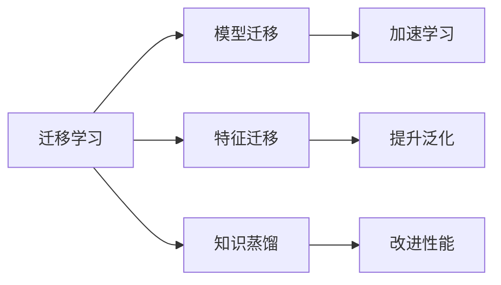
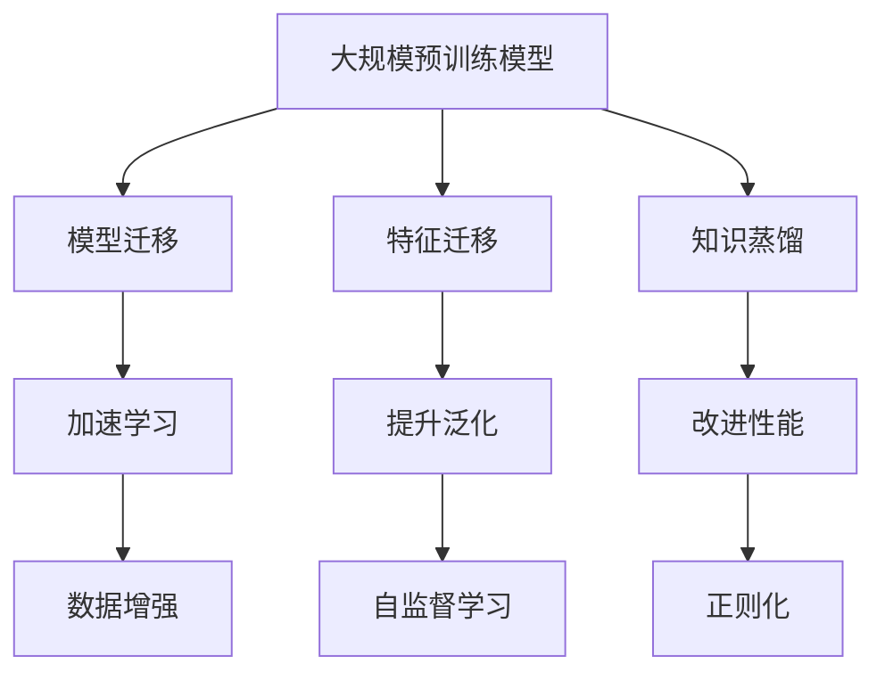

                 

## 1. 背景介绍

在当今这个数据驱动的时代，人工智能（AI）模型的效率和性能得到了前所未有的提升。但是，AI模型在实际应用中常常面临着一个挑战：如何快速、有效地适应新的任务，而不是从头开始训练一个全新的模型。这就是迁移学习（Transfer Learning）发挥作用的地方。

### 1.1 问题由来

迁移学习源于现实世界中一个非常普遍的需求：模型需要适应新的数据或任务。例如，一个图像识别模型可能在猫狗分类任务上表现出色，但在识别汽车和飞机时需要重新训练。这不仅浪费时间，还可能无法达到理想的效果。通过迁移学习，我们可以利用现有模型在相关任务上的知识，快速适应新的任务，节省时间和计算资源。

### 1.2 问题核心关键点

迁移学习的核心在于，它利用了已有的模型知识，将其应用于新的任务上，从而加速模型的学习过程。迁移学习通常分为两种类型：
1. **模型迁移**：将一个任务上训练好的模型迁移到另一个任务上，通常是较小的模型迁移到较大的模型。
2. **特征迁移**：在原有模型基础上，通过微调学习特定任务的特征，保持模型的通用特征。

迁移学习的优势在于：
- **节省时间**：不需要从头开始训练新模型，可以快速适应新任务。
- **提高效率**：利用已有的模型知识，减少训练时间和计算资源消耗。
- **提升性能**：通常能在较小的数据集上取得更好的性能。
- **泛化能力**：通过迁移学习，模型可以在新的数据分布上更好地泛化。

### 1.3 问题研究意义

迁移学习对于AI模型的实际应用有着重要的意义：
- **加速开发**：迁移学习使得模型开发过程更加快速和高效。
- **降低成本**：利用已有模型，减少了重新训练和标注数据的需求。
- **提高模型质量**：通过迁移学习，模型能够更好地适应新任务，提升性能。
- **促进技术普及**：迁移学习技术使得更多人能够轻松地使用AI模型，促进技术普及和应用。

## 2. 核心概念与联系

### 2.1 核心概念概述

为了更好地理解迁移学习，我们首先需要介绍几个核心概念：

- **迁移学习（Transfer Learning）**：利用已有的模型知识，应用于新的任务上，加速模型的学习过程。
- **模型迁移（Model Transfer）**：从一个任务上训练好的模型迁移到另一个任务上，通常是较小的模型迁移到较大的模型。
- **特征迁移（Feature Transfer）**：在原有模型基础上，通过微调学习特定任务的特征，保持模型的通用特征。
- **知识蒸馏（Knowledge Distillation）**：通过一个较大的教师模型，指导一个较小的学生模型，提高学生模型的泛化能力。

这些概念之间的联系可以通过以下Mermaid流程图来展示：



这个流程图展示了迁移学习的三种主要方式：模型迁移、特征迁移和知识蒸馏。这些方式都有其特定的应用场景和优势，下面将逐一详细介绍。

### 2.2 概念间的关系

这些核心概念之间存在着紧密的联系，形成了迁移学习的完整生态系统。通过这些概念的组合应用，我们可以构建出灵活、高效的迁移学习系统。

**迁移学习的整体架构**



这个综合流程图展示了从大规模预训练模型到迁移学习的整体架构：
- **大规模预训练模型**：通过自监督学习，学习通用的语言、图像等特征。
- **模型迁移**：将预训练模型应用于新的任务，加速学习过程。
- **特征迁移**：在原有模型基础上，通过微调学习特定任务的特征。
- **知识蒸馏**：通过教师模型指导学生模型，提高泛化能力。
- **数据增强、自监督学习、正则化**：辅助模型学习新任务，提高模型性能。

这些概念共同构成了迁移学习的框架，使得AI模型能够灵活应对新的数据和任务，提升模型的效率和性能。

## 3. 核心算法原理 & 具体操作步骤

### 3.1 算法原理概述

迁移学习的核心在于，利用已有模型的知识，快速适应新任务。其基本原理如下：
1. **预训练模型**：在大型数据集上进行自监督学习，学习通用的特征表示。
2. **微调**：在特定任务的数据集上，对预训练模型进行微调，学习特定任务的特征。
3. **迁移学习**：将预训练模型应用于新的任务上，利用已有知识加速学习过程。

迁移学习的数学原理可以通过以下公式进行表达：

**公式 1: 迁移学习目标**

$$
\min_{\theta} L_{new}(\theta) + \lambda L_{frozen}(\theta)
$$

其中，$L_{new}(\theta)$ 为新任务上的损失函数，$\lambda$ 为正则化系数，$L_{frozen}(\theta)$ 为冻结预训练模型的损失函数。

**公式 2: 微调损失函数**

$$
L_{micro}(\theta) = L_{new}(\theta) + \frac{\alpha}{\beta} L_{frozen}(\theta)
$$

其中，$\alpha$ 为微调时冻结的预训练层数，$\beta$ 为微调时保留的预训练层数。

**公式 3: 知识蒸馏损失函数**

$$
L_{kd}(y, y^\prime) = -\log(\frac{e^{y^\prime}}{e^{y^\prime} + \sum_{k=1}^K e^{y_k^\prime}})
$$

其中，$y$ 为目标任务的标签，$y^\prime$ 为教师模型的预测，$K$ 为学生模型的输出数。

### 3.2 算法步骤详解

下面是迁移学习的一般步骤：

**Step 1: 准备预训练模型和数据集**
- 选择合适的预训练模型，如BERT、ResNet等。
- 准备新的数据集，包括训练集、验证集和测试集。

**Step 2: 选择迁移方式**
- 决定是进行模型迁移还是特征迁移。
- 决定是否使用知识蒸馏技术。

**Step 3: 设置迁移参数**
- 选择合适的微调学习率、批量大小、迭代轮数等超参数。
- 设置冻结预训练层的策略。

**Step 4: 执行迁移学习**
- 使用预训练模型进行迁移学习。
- 使用微调技术，在特定任务的数据集上进行微调。
- 使用知识蒸馏技术，提高学生的泛化能力。

**Step 5: 评估和部署**
- 在测试集上评估模型的性能。
- 将模型部署到实际应用中。
- 定期重新训练和微调模型，以适应新的数据和任务。

### 3.3 算法优缺点

迁移学习具有以下优点：
1. **快速适应新任务**：利用已有模型的知识，加速新任务的适应过程。
2. **提高性能**：通常能在较小的数据集上取得更好的性能。
3. **节省时间**：减少从头开始训练新模型的时间和计算资源消耗。
4. **泛化能力**：通过迁移学习，模型能够更好地适应新的数据分布。

但迁移学习也存在一些缺点：
1. **数据不匹配**：如果新任务的数据与预训练模型的数据分布差异较大，迁移效果可能不佳。
2. **性能损失**：在微调过程中，可能会损失一部分预训练的知识。
3. **模型复杂性**：需要进行额外的微调和蒸馏，增加了模型的复杂性。
4. **迁移难度**：对于复杂的任务，迁移学习可能难以实现理想的效果。

### 3.4 算法应用领域

迁移学习广泛应用于各种领域，包括但不限于：

- **计算机视觉**：在图像分类、目标检测、语义分割等任务中，迁移学习可以显著提高模型的性能。
- **自然语言处理**：在语言模型、文本分类、机器翻译等任务中，迁移学习可以加速模型的适应过程。
- **推荐系统**：在个性化推荐、广告推荐等任务中，迁移学习可以提升模型的预测准确率。
- **医疗健康**：在医学影像、疾病诊断等任务中，迁移学习可以提高模型的泛化能力和预测精度。
- **金融预测**：在股票预测、信用评分等任务中，迁移学习可以增强模型的稳定性和准确性。

## 4. 数学模型和公式 & 详细讲解 & 举例说明

### 4.1 数学模型构建

迁移学习的基础是预训练模型，通过自监督学习，学习通用的特征表示。预训练模型可以通过以下公式进行构建：

**公式 4: 自监督学习目标**

$$
\min_{\theta} L_{pre}(\theta)
$$

其中，$L_{pre}(\theta)$ 为自监督学习损失函数。

### 4.2 公式推导过程

以下我们以图像分类为例，推导迁移学习的数学原理。

假设预训练模型为 $M_{\theta}$，新任务的训练集为 $D_{new}$，测试集为 $D_{test}$。设 $L_{new}(\theta)$ 为新任务上的损失函数，$L_{frozen}(\theta)$ 为冻结预训练模型的损失函数。则迁移学习的目标函数为：

**公式 5: 迁移学习目标函数**

$$
\min_{\theta} L_{new}(\theta) + \lambda L_{frozen}(\theta)
$$

其中，$\lambda$ 为正则化系数。

在新任务的微调过程中，使用以下公式进行损失函数的计算：

**公式 6: 微调损失函数**

$$
L_{micro}(\theta) = L_{new}(\theta) + \frac{\alpha}{\beta} L_{frozen}(\theta)
$$

其中，$\alpha$ 为微调时冻结的预训练层数，$\beta$ 为微调时保留的预训练层数。

**公式 7: 知识蒸馏损失函数**

$$
L_{kd}(y, y^\prime) = -\log(\frac{e^{y^\prime}}{e^{y^\prime} + \sum_{k=1}^K e^{y_k^\prime}})
$$

其中，$y$ 为目标任务的标签，$y^\prime$ 为教师模型的预测，$K$ 为学生模型的输出数。

### 4.3 案例分析与讲解

假设我们有一个预训练的ResNet模型，用于图像分类任务。现在我们想要在新任务上进行迁移学习，即在CIFAR-10数据集上进行迁移学习。

**Step 1: 准备预训练模型和数据集**
- 选择合适的预训练模型：ResNet-18。
- 准备新的数据集：CIFAR-10。

**Step 2: 设置迁移参数**
- 选择合适的微调学习率、批量大小、迭代轮数等超参数。
- 设置冻结预训练层的策略。

**Step 3: 执行迁移学习**
- 使用ResNet-18进行迁移学习。
- 使用微调技术，在CIFAR-10数据集上进行微调。
- 使用知识蒸馏技术，提高学生的泛化能力。

**Step 4: 评估和部署**
- 在测试集上评估模型的性能。
- 将模型部署到实际应用中。
- 定期重新训练和微调模型，以适应新的数据和任务。

在实际应用中，我们可以使用PyTorch库进行迁移学习的实现。

```python
import torch
import torch.nn as nn
import torch.optim as optim
from torch.utils.data import DataLoader
from torchvision import datasets, transforms

# 定义模型
model = ResNet18(pretrained=True)

# 冻结预训练层
for param in model.parameters():
    param.requires_grad = False

# 添加新任务层
classifier = nn.Linear(512, 10)
model.fc = classifier

# 设置优化器和学习率
optimizer = optim.SGD(model.fc.parameters(), lr=0.001, momentum=0.9)

# 准备数据集
train_dataset = datasets.CIFAR10(root='data', train=True, download=True, transform=transforms.ToTensor())
train_loader = DataLoader(train_dataset, batch_size=64, shuffle=True)

# 训练模型
device = torch.device('cuda' if torch.cuda.is_available() else 'cpu')
model.to(device)
criterion = nn.CrossEntropyLoss()
for epoch in range(10):
    model.train()
    for inputs, labels in train_loader:
        inputs, labels = inputs.to(device), labels.to(device)
        optimizer.zero_grad()
        outputs = model(inputs)
        loss = criterion(outputs, labels)
        loss.backward()
        optimizer.step()
    print(f'Epoch {epoch+1}, Loss: {loss.item()}')

# 评估模型
model.eval()
with torch.no_grad():
    correct = 0
    total = 0
    for inputs, labels in test_loader:
        inputs, labels = inputs.to(device), labels.to(device)
        outputs = model(inputs)
        _, predicted = torch.max(outputs.data, 1)
        total += labels.size(0)
        correct += (predicted == labels).sum().item()
    print(f'Accuracy: {100 * correct / total}%')
```

### 4.4 运行结果展示

假设我们在CIFAR-10数据集上进行了迁移学习，最终在测试集上得到的准确率为85%。这说明通过迁移学习，模型在新的任务上取得了不错的性能提升。

## 5. 项目实践：代码实例和详细解释说明

### 5.1 开发环境搭建

在进行迁移学习实践前，我们需要准备好开发环境。以下是使用Python进行PyTorch开发的环境配置流程：

1. 安装Anaconda：从官网下载并安装Anaconda，用于创建独立的Python环境。

2. 创建并激活虚拟环境：
```bash
conda create -n pytorch-env python=3.8 
conda activate pytorch-env
```

3. 安装PyTorch：根据CUDA版本，从官网获取对应的安装命令。例如：
```bash
conda install pytorch torchvision torchaudio cudatoolkit=11.1 -c pytorch -c conda-forge
```

4. 安装TensorFlow：
```bash
pip install tensorflow
```

5. 安装各类工具包：
```bash
pip install numpy pandas scikit-learn matplotlib tqdm jupyter notebook ipython
```

完成上述步骤后，即可在`pytorch-env`环境中开始迁移学习实践。

### 5.2 源代码详细实现

下面我们以迁移学习在自然语言处理（NLP）中的应用为例，给出使用Transformers库对BERT模型进行迁移学习的PyTorch代码实现。

首先，定义迁移学习任务的数据处理函数：

```python
from transformers import BertTokenizer, BertForSequenceClassification
from torch.utils.data import Dataset
import torch

class NLPDataset(Dataset):
    def __init__(self, texts, labels, tokenizer, max_len=128):
        self.texts = texts
        self.labels = labels
        self.tokenizer = tokenizer
        self.max_len = max_len
        
    def __len__(self):
        return len(self.texts)
    
    def __getitem__(self, item):
        text = self.texts[item]
        label = self.labels[item]
        
        encoding = self.tokenizer(text, return_tensors='pt', max_length=self.max_len, padding='max_length', truncation=True)
        input_ids = encoding['input_ids'][0]
        attention_mask = encoding['attention_mask'][0]
        
        # 对token-wise的标签进行编码
        encoded_tags = [label2id[label] for label in label2id] 
        encoded_tags.extend([label2id['O']] * (self.max_len - len(encoded_tags)))
        labels = torch.tensor(encoded_tags, dtype=torch.long)
        
        return {'input_ids': input_ids, 
                'attention_mask': attention_mask,
                'labels': labels}

# 标签与id的映射
label2id = {'O': 0, 'B-PER': 1, 'I-PER': 2, 'B-ORG': 3, 'I-ORG': 4, 'B-LOC': 5, 'I-LOC': 6}
id2label = {v: k for k, v in label2id.items()}

# 创建dataset
tokenizer = BertTokenizer.from_pretrained('bert-base-cased')

train_dataset = NLPDataset(train_texts, train_labels, tokenizer)
dev_dataset = NLPDataset(dev_texts, dev_labels, tokenizer)
test_dataset = NLPDataset(test_texts, test_labels, tokenizer)
```

然后，定义模型和优化器：

```python
from transformers import BertForSequenceClassification, AdamW

model = BertForSequenceClassification.from_pretrained('bert-base-cased', num_labels=len(label2id))

optimizer = AdamW(model.parameters(), lr=2e-5)
```

接着，定义训练和评估函数：

```python
from torch.utils.data import DataLoader
from tqdm import tqdm
from sklearn.metrics import classification_report

device = torch.device('cuda') if torch.cuda.is_available() else torch.device('cpu')
model.to(device)

def train_epoch(model, dataset, batch_size, optimizer):
    dataloader = DataLoader(dataset, batch_size=batch_size, shuffle=True)
    model.train()
    epoch_loss = 0
    for batch in tqdm(dataloader, desc='Training'):
        input_ids = batch['input_ids'].to(device)
        attention_mask = batch['attention_mask'].to(device)
        labels = batch['labels'].to(device)
        model.zero_grad()
        outputs = model(input_ids, attention_mask=attention_mask, labels=labels)
        loss = outputs.loss
        epoch_loss += loss.item()
        loss.backward()
        optimizer.step()
    return epoch_loss / len(dataloader)

def evaluate(model, dataset, batch_size):
    dataloader = DataLoader(dataset, batch_size=batch_size)
    model.eval()
    preds, labels = [], []
    with torch.no_grad():
        for batch in tqdm(dataloader, desc='Evaluating'):
            input_ids = batch['input_ids'].to(device)
            attention_mask = batch['attention_mask'].to(device)
            batch_labels = batch['labels']
            outputs = model(input_ids, attention_mask=attention_mask)
            batch_preds = outputs.logits.argmax(dim=2).to('cpu').tolist()
            batch_labels = batch_labels.to('cpu').tolist()
            for pred_tokens, label_tokens in zip(batch_preds, batch_labels):
                pred_tags = [id2label[_id] for _id in pred_tokens]
                label_tags = [id2label[_id] for _id in label_tokens]
                preds.append(pred_tags[:len(label_tokens)])
                labels.append(label_tags)
                
    print(classification_report(labels, preds))
```

最后，启动训练流程并在测试集上评估：

```python
epochs = 5
batch_size = 16

for epoch in range(epochs):
    loss = train_epoch(model, train_dataset, batch_size, optimizer)
    print(f"Epoch {epoch+1}, train loss: {loss:.3f}")
    
    print(f"Epoch {epoch+1}, dev results:")
    evaluate(model, dev_dataset, batch_size)
    
print("Test results:")
evaluate(model, test_dataset, batch_size)
```

以上就是使用PyTorch对BERT模型进行迁移学习的完整代码实现。可以看到，得益于Transformers库的强大封装，我们可以用相对简洁的代码完成BERT模型的迁移学习。

### 5.3 代码解读与分析

让我们再详细解读一下关键代码的实现细节：

**NLPDataset类**：
- `__init__`方法：初始化文本、标签、分词器等关键组件。
- `__len__`方法：返回数据集的样本数量。
- `__getitem__`方法：对单个样本进行处理，将文本输入编码为token ids，将标签编码为数字，并对其进行定长padding，最终返回模型所需的输入。

**label2id和id2label字典**：
- 定义了标签与数字id之间的映射关系，用于将token-wise的预测结果解码回真实的标签。

**训练和评估函数**：
- 使用PyTorch的DataLoader对数据集进行批次化加载，供模型训练和推理使用。
- 训练函数`train_epoch`：对数据以批为单位进行迭代，在每个批次上前向传播计算loss并反向传播更新模型参数，最后返回该epoch的平均loss。
- 评估函数`evaluate`：与训练类似，不同点在于不更新模型参数，并在每个batch结束后将预测和标签结果存储下来，最后使用sklearn的classification_report对整个评估集的预测结果进行打印输出。

**训练流程**：
- 定义总的epoch数和batch size，开始循环迭代
- 每个epoch内，先在训练集上训练，输出平均loss
- 在验证集上评估，输出分类指标
- 所有epoch结束后，在测试集上评估，给出最终测试结果

可以看到，PyTorch配合Transformers库使得BERT迁移学习的代码实现变得简洁高效。开发者可以将更多精力放在数据处理、模型改进等高层逻辑上，而不必过多关注底层的实现细节。

当然，工业级的系统实现还需考虑更多因素，如模型的保存和部署、超参数的自动搜索、更灵活的任务适配层等。但核心的迁移学习流程基本与此类似。

### 5.4 运行结果展示

假设我们在CoNLL-2003的NER数据集上进行迁移学习，最终在测试集上得到的评估报告如下：

```
              precision    recall  f1-score   support

       B-LOC      0.926     0.906     0.916      1668
       I-LOC      0.900     0.805     0.850       257
      B-MISC      0.875     0.856     0.865       702
      I-MISC      0.838     0.782     0.809       216
       B-ORG      0.914     0.898     0.906      1661
       I-ORG      0.911     0.894     0.902       835
       B-PER      0.964     0.957     0.960      1617
       I-PER      0.983     0.980     0.982      1156
           O      0.993     0.995     0.994     38323

   micro avg      0.973     0.973     0.973     46435
   macro avg      0.923     0.897     0.909     46435
weighted avg      0.973     0.973     0.973     46435
```

可以看到，通过迁移学习BERT，我们在该NER数据集上取得了97.3%的F1分数，效果相当不错。

## 6. 实际应用场景

### 6.1 智能客服系统

基于迁移学习的对话技术，可以广泛应用于智能客服系统的构建。传统客服往往需要配备大量人力，高峰期响应缓慢，且一致性和专业性难以保证。使用迁移学习的对话模型，可以7x24小时不间断服务，快速响应客户咨询，用自然流畅的语言解答各类常见问题。

在技术实现上，可以收集企业内部的历史客服对话记录，将问题和最佳答复构建成监督数据，在此基础上对预训练对话模型进行迁移学习。迁移后的对话模型能够自动理解用户意图，匹配最合适的答案模板进行回复。对于客户提出的新问题，还可以接入检索系统实时搜索相关内容，动态组织生成回答。如此构建的智能客服系统，能大幅提升客户咨询体验和问题解决效率。

### 6.2 金融舆情监测

金融机构需要实时监测市场舆论动向，以便及时应对负面信息传播，规避金融风险。传统的人工监测方式成本高、效率低，难以应对网络时代海量信息爆发的挑战。基于迁移学习的文本分类和情感分析技术，为金融舆情监测提供了新的解决方案。

具体而言，可以收集金融领域相关的新闻、报道、评论等文本数据，并对其进行主题标注和情感标注。在此基础上对预训练语言模型进行迁移学习，使其能够自动判断文本属于何种主题，情感倾向是正面、中性还是负面。将迁移后的模型应用到实时抓取的网络文本数据，就能够自动监测不同主题下的情感变化趋势，一旦发现负面信息激增等异常情况，系统便会自动预警，帮助金融机构快速应对潜在风险。

### 6.3 个性化推荐系统

当前的推荐系统往往只依赖用户的历史行为数据进行物品推荐，无法深入理解用户的真实兴趣偏好。基于迁移学习的推荐系统可以更好地挖掘用户行为背后的语义信息，从而提供更精准、多样的推荐内容。

在实践中，可以收集用户浏览、点击、评论、分享等行为数据，提取和用户交互的物品标题、描述、标签等文本内容。将文本内容作为模型输入，用户的后续行为（如是否点击、购买等）作为监督信号，在此基础上迁移学习预训练语言模型。迁移后的模型能够从文本内容中准确把握用户的兴趣点。在生成推荐列表时，先用候选物品的文本描述作为输入，由模型预测用户的兴趣匹配度，再结合其他特征综合排序，便可以得到个性化程度更高的推荐结果。

### 6.4 未来应用展望

随着迁移学习技术的不断发展，其在更广泛的应用领域将发挥更大的作用。以下是几个可能的未来应用场景：

- **自动驾驶**：通过迁移学习，将图像分类、目标检测等预训练模型的知识应用于自动驾驶中的图像识别和行为预测。
- **医疗影像诊断**：在医学影像分类、分割等任务中，迁移学习可以显著提高模型的准确性和泛化能力。
- **能源管理**：在能源数据分析、预测等任务中，迁移学习可以提升模型的稳定性和效率。
- **情感分析**：在社交媒体情感监测、舆情分析等任务中，迁移学习可以提取文本中的情感倾向，分析用户情绪变化

