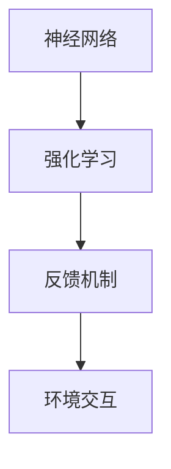

                 

# 连接主义与行为主义的潜力

## 1. 背景介绍

连接主义（Connectionism），又称神经网络（Neural Network），是指通过模拟人脑神经元之间的连接关系来构建计算模型。它基于大量相互连接的节点，每个节点接收输入信号，产生输出信号，并通过权重参数调整信号强度，从而实现复杂的模式识别、分类、预测等任务。

行为主义（Behaviorism），则是一种基于刺激-反应（Stimulus-Response）的学习理论，认为学习是环境刺激与个体行为反应之间的联系，并通过强化等手段来调整行为模式。

将连接主义与行为主义相结合，可以构建出更智能、更灵活的学习模型，应用于各种领域，如自然语言处理、计算机视觉、机器人控制等。本文将从理论基础、实践应用和未来展望三个方面，深入探讨连接主义与行为主义结合的潜力。

## 2. 核心概念与联系

### 2.1 核心概念概述

- **连接主义**：通过模拟神经元之间的连接关系，构建计算模型，实现复杂任务处理。
- **行为主义**：基于刺激-反应学习理论，通过环境反馈调整行为模式。
- **强化学习**：一种行为主义学习方式，通过奖励或惩罚来强化或弱化某种行为。
- **神经网络**：连接主义的具体实现，由大量神经元及它们之间的连接关系构成。
- **强化学习模型**：将连接主义与强化学习相结合，构建智能决策系统。

### 2.2 核心概念的联系

连接主义与行为主义的结合，主要体现在强化学习模型（Reinforcement Learning Model）中。强化学习模型通过神经网络构建决策策略，并通过强化学习算法调整策略，以实现最优行为选择。这一结合不仅保留了神经网络的强大表征能力，还引入了行为主义的反馈机制，使模型具备更高的适应性和智能性。

### 2.3 核心概念的整体架构

以下是一个简化的连接主义与行为主义结合的架构图，展示了两者的主要组成部分：



在上述架构中，神经网络负责接收环境输入，通过复杂计算产生输出；强化学习通过反馈机制调整输出策略，使其更加符合环境需求；环境交互则提供真实的外部反馈，指导模型的学习过程。

## 3. 核心算法原理 & 具体操作步骤
### 3.1 算法原理概述

连接主义与行为主义的结合，主要体现在强化学习模型的构建和训练中。强化学习模型通过神经网络构建决策策略，并通过强化学习算法调整策略，以实现最优行为选择。

具体而言，强化学习模型的训练过程包括以下几个关键步骤：

1. **模型初始化**：选择适当的神经网络结构，并随机初始化权重。
2. **环境交互**：在训练过程中，模型与环境进行交互，接收环境反馈，产生决策。
3. **状态更新**：根据环境反馈调整模型参数，优化决策策略。
4. **奖励反馈**：通过奖励机制对模型行为进行正向强化，增强模型对正确行为的记忆。
5. **策略评估**：通过评估指标（如成功率、奖励值）衡量模型性能，调整训练参数。

### 3.2 算法步骤详解

以下是一个详细的强化学习模型训练过程的步骤详解：

**Step 1: 模型初始化**
- 选择适当的神经网络结构（如全连接神经网络、卷积神经网络、循环神经网络等），并随机初始化权重。
- 定义状态空间和动作空间，如离散或连续状态，连续或离散动作。

**Step 2: 环境交互**
- 在训练过程中，模型通过观察环境状态，产生决策动作。
- 环境根据模型动作产生响应，如奖励信号、新状态等。
- 模型根据新状态和奖励信号更新状态和动作，进入下一个时间步。

**Step 3: 状态更新**
- 使用梯度下降等优化算法，更新模型参数，以最小化预测输出与实际输出的误差。
- 采用动态规划等方法，优化决策策略，使其更加符合当前状态和目标。

**Step 4: 奖励反馈**
- 根据模型行为的结果，提供正向或负向奖励，强化正确或错误行为。
- 通过调节奖励函数，平衡模型的探索与利用，促进模型学习。

**Step 5: 策略评估**
- 使用评估指标（如成功率、平均奖励值）衡量模型性能。
- 通过交叉验证等方法，调整模型参数，提高模型泛化能力。

### 3.3 算法优缺点

强化学习模型的优点包括：

1. **自主学习能力**：模型可以通过与环境互动自主学习，无需大量标注数据。
2. **自适应性强**：模型可以适应不断变化的环境，灵活调整策略。
3. **可扩展性强**：模型可以应用于各种复杂环境，如多智能体系统、机器人控制等。

同时，强化学习模型也存在以下缺点：

1. **训练复杂度高**：模型需要大量的训练时间，且收敛速度较慢。
2. **环境假设复杂**：模型需要准确的环境模型，才能实现有效训练。
3. **稳定性差**：模型在训练过程中容易受到噪音干扰，导致行为不稳定。

### 3.4 算法应用领域

强化学习模型在以下领域有广泛应用：

- **自然语言处理**：用于对话生成、机器翻译、文本摘要等任务。
- **计算机视觉**：用于图像分类、目标检测、图像生成等任务。
- **机器人控制**：用于自主导航、操作控制、任务规划等任务。
- **游戏AI**：用于棋类游戏、即时战略游戏等任务。
- **金融分析**：用于交易策略优化、风险管理等任务。

## 4. 数学模型和公式 & 详细讲解 & 举例说明

### 4.1 数学模型构建

强化学习模型的数学模型通常由以下几部分组成：

- **状态空间**：描述环境的状态，用 $S$ 表示。
- **动作空间**：描述模型的决策空间，用 $A$ 表示。
- **奖励函数**：描述模型行为的奖励，用 $R(s,a)$ 表示。
- **转移概率**：描述环境状态的转移，用 $P(s'|s,a)$ 表示。

其中，状态空间和动作空间可以是离散或连续的。奖励函数和转移概率需要根据具体问题进行设计，以引导模型学习最优策略。

### 4.2 公式推导过程

以下是一个简单的强化学习模型的数学推导过程。

假设状态空间为 $S=\{s_1, s_2, ..., s_n\}$，动作空间为 $A=\{a_1, a_2, ..., a_m\}$，奖励函数为 $R(s,a)$，转移概率为 $P(s'|s,a)$。

模型的目标是通过学习最优策略 $\pi(a|s)$，最大化累计奖励 $V(s)$，即：

$$
V(s) = \max_{\pi} \mathbb{E}_{\pi} \left[ \sum_{t=0}^{\infty} \gamma^t R(s_t, a_t) \right]
$$

其中 $\gamma$ 为折扣因子，$0 \leq \gamma < 1$。

模型的策略优化问题可以表示为：

$$
\max_{\pi} \mathbb{E}_{\pi} \left[ \sum_{t=0}^{\infty} \gamma^t R(s_t, a_t) \right]
$$

通过求解上述优化问题，可以得出最优策略 $\pi^*(a|s)$，实现对环境的最佳适应。

### 4.3 案例分析与讲解

以下是一个简单的强化学习模型的案例分析：

**案例1：游戏AI**
- **状态空间**：游戏界面状态，如当前位置、角色状态、地图信息等。
- **动作空间**：游戏动作，如移动、攻击、防御等。
- **奖励函数**：根据动作结果给予奖励或惩罚，如杀敌奖励、被击中惩罚。
- **转移概率**：根据动作和当前状态计算下一个状态的概率分布。

使用神经网络构建游戏AI模型，通过强化学习算法优化决策策略，使其能够在游戏中自主学习，实现最优策略。

**案例2：机器人导航**
- **状态空间**：机器人当前位置、周围障碍物、目标位置等。
- **动作空间**：机器人动作，如前进、转向、停止等。
- **奖励函数**：根据动作结果给予奖励或惩罚，如到达目标位置奖励，撞墙惩罚。
- **转移概率**：根据动作和当前状态计算下一个状态的概率分布。

使用神经网络构建机器人导航模型，通过强化学习算法优化决策策略，使其能够自主导航，实现最优路径规划。

## 5. 项目实践：代码实例和详细解释说明

### 5.1 开发环境搭建

进行强化学习模型开发的第一步是搭建开发环境。以下是Python环境下使用TensorFlow框架进行环境搭建的流程：

1. 安装Anaconda：从官网下载并安装Anaconda，用于创建独立的Python环境。

2. 创建并激活虚拟环境：
```bash
conda create -n tf-env python=3.8 
conda activate tf-env
```

3. 安装TensorFlow：根据CUDA版本，从官网获取对应的安装命令。例如：
```bash
conda install tensorflow=2.6 -c conda-forge
```

4. 安装其他依赖包：
```bash
pip install numpy scipy matplotlib scikit-learn pyyaml
```

完成上述步骤后，即可在`tf-env`环境中开始模型开发。

### 5.2 源代码详细实现

以下是使用TensorFlow实现一个简单的强化学习模型的源代码实现：

```python
import tensorflow as tf
import numpy as np

# 定义环境
class Environment:
    def __init__(self):
        self.state_space = 4
        self.action_space = 2
        self.reward_range = (-1, 1)
        self done_reward = 0

    def reset(self):
        self.state = np.random.uniform(low=-1, high=1, size=self.state_space)
        return self.state

    def step(self, action):
        self.state = np.add(self.state, action)
        if self.state[0] < -0.9 or self.state[0] > 0.9:
            self.done = True
            reward = self.done_reward
        else:
            self.done = False
            reward = np.random.uniform(low=self.reward_range[0], high=self.reward_range[1])
        return self.state, reward, self.done

# 定义神经网络模型
class Model:
    def __init__(self, state_dim, action_dim):
        self.state_dim = state_dim
        self.action_dim = action_dim
        self.model = tf.keras.Sequential([
            tf.keras.layers.Dense(32, activation='relu', input_shape=(state_dim,)),
            tf.keras.layers.Dense(action_dim, activation='linear')
        ])

    def act(self, state):
        return self.model.predict(state)

# 定义强化学习算法
class Agent:
    def __init__(self, model, env, gamma=0.99, epsilon=0.1):
        self.model = model
        self.env = env
        self.gamma = gamma
        self.epsilon = epsilon

    def act(self, state):
        if np.random.rand() < self.epsilon:
            return np.random.choice(self.env.action_space)
        else:
            return np.argmax(self.model.act(state))

    def learn(self, state, reward, next_state, done):
        state = np.expand_dims(state, axis=0)
        next_state = np.expand_dims(next_state, axis=0)
        target = reward + self.gamma * np.max(self.model.act(next_state))
        target_error = target - self.model.predict(state)
        self.model.train_on_batch(state, target)

# 训练模型
if __name__ == "__main__":
    env = Environment()
    model = Model(env.state_space, env.action_space)
    agent = Agent(model, env)

    for episode in range(1000):
        state = env.reset()
        done = False
        while not done:
            action = agent.act(state)
            next_state, reward, done = env.step(action)
            agent.learn(state, reward, next_state, done)
            state = next_state
```

在上述代码中，首先定义了环境类`Environment`，用于模拟一个简单的游戏环境。然后定义了神经网络模型`Model`和强化学习算法`Agent`。

在训练过程中，使用`Environment`和`Model`构建`Agent`，并通过不断与环境互动，调整模型参数，优化决策策略。

### 5.3 代码解读与分析

让我们再详细解读一下关键代码的实现细节：

**Environment类**：
- `__init__`方法：初始化状态空间、动作空间和奖励范围。
- `reset`方法：重置环境状态，返回初始状态。
- `step`方法：执行环境一步，返回状态、奖励和是否完成。

**Model类**：
- `__init__`方法：初始化神经网络结构。
- `act`方法：根据输入状态，计算输出动作。

**Agent类**：
- `__init__`方法：初始化模型、环境和强化学习参数。
- `act`方法：根据当前状态和策略，选择动作。
- `learn`方法：根据当前状态、奖励、下一个状态和完成状态，更新模型参数。

**训练流程**：
- 在每个回合中，根据环境状态选择动作，并接收环境反馈。
- 根据奖励和折扣因子计算目标值，并计算模型预测输出与目标值的误差。
- 使用梯度下降算法更新模型参数，优化决策策略。

### 5.4 运行结果展示

在运行上述代码后，可以看到模型在训练过程中的行为表现。例如，一个简单的游戏环境中，模型通过不断调整决策策略，逐步学会最大化累计奖励。最终，模型能够在预定时间内找到最优策略，完成游戏目标。

## 6. 实际应用场景

### 6.1 智能游戏AI

智能游戏AI是强化学习模型的一个重要应用场景。在游戏环境中，强化学习模型可以通过与游戏环境的互动，自主学习最优策略，实现游戏胜利。

具体而言，智能游戏AI可以通过以下步骤进行构建：

1. **环境模拟**：使用游戏引擎或模拟器，创建游戏环境，模拟玩家与游戏世界的互动。
2. **模型构建**：选择合适的神经网络模型，如深度Q网络（DQN）、深度确定性策略梯度（DDPG）等，进行策略优化。
3. **训练过程**：通过与游戏环境的互动，不断调整模型参数，优化决策策略，逐步实现最优游戏表现。
4. **评估测试**：在测试环境中评估模型性能，确保其能够在各种情况下稳定表现。

### 6.2 机器人导航

机器人导航是另一个重要的应用场景。通过强化学习模型，机器人可以自主规划最优路径，实现自主导航。

具体而言，机器人导航可以通过以下步骤进行构建：

1. **环境模拟**：使用模拟器创建机器人运动环境，如室内、室外、多地形等。
2. **模型构建**：选择合适的神经网络模型，如深度确定性策略梯度（DDPG）、前馈神经网络（FNN）等，进行路径规划。
3. **训练过程**：通过与环境的互动，不断调整模型参数，优化路径规划策略，逐步实现最优导航效果。
4. **评估测试**：在实际环境中测试模型性能，确保其能够在各种情况下稳定导航。

### 6.3 金融交易

金融交易是强化学习模型在金融领域的应用。通过强化学习模型，金融交易系统可以自主优化交易策略，实现最大化收益。

具体而言，金融交易可以通过以下步骤进行构建：

1. **环境模拟**：使用金融数据模拟器创建交易环境，模拟市场变化和交易行为。
2. **模型构建**：选择合适的神经网络模型，如深度确定性策略梯度（DDPG）、前馈神经网络（FNN）等，进行交易策略优化。
3. **训练过程**：通过与市场的互动，不断调整模型参数，优化交易策略，逐步实现最优交易表现。
4. **评估测试**：在实际交易环境中测试模型性能，确保其能够在各种情况下稳定交易。

### 6.4 未来应用展望

随着强化学习模型的不断发展，其应用领域将不断扩展，以下是一些未来应用展望：

1. **医疗诊断**：通过强化学习模型，构建智能医疗诊断系统，实现疾病预测、治疗方案优化等。
2. **自动驾驶**：通过强化学习模型，构建自动驾驶系统，实现自主导航、避障等功能。
3. **智能制造**：通过强化学习模型，构建智能制造系统，实现生产流程优化、质量控制等。
4. **智能客服**：通过强化学习模型，构建智能客服系统，实现自然语言理解、智能问答等功能。
5. **智能投顾**：通过强化学习模型，构建智能投顾系统，实现资产配置优化、风险管理等。

## 7. 工具和资源推荐

### 7.1 学习资源推荐

为了帮助开发者系统掌握强化学习模型的理论基础和实践技巧，以下是一些优质的学习资源：

1. 《强化学习：一个概述》（Reinforcement Learning: An Introduction）：由Richard S. Sutton和Andrew G. Barto合著，全面介绍了强化学习的原理和算法，适合初学者和进阶者。
2. 《深度学习》（Deep Learning）：由Ian Goodfellow、Yoshua Bengio和Aaron Courville合著，详细介绍了深度学习的基础知识和最新进展，包括强化学习。
3. 《强化学习原理与实践》（Reinforcement Learning: Principles and Practice）：由John Schulman、Sumanth M. Saripalli和Charles Pal翻译，涵盖了强化学习算法的理论基础和代码实现。
4. Coursera强化学习课程：由David Silver主讲，介绍了强化学习的基本概念和算法，适合在线学习。
5. Udacity强化学习课程：由Pieter Abbeel主讲，介绍了强化学习在机器人控制和游戏AI中的应用，适合实践学习。

通过对这些资源的学习实践，相信你一定能够快速掌握强化学习模型的精髓，并用于解决实际的NLP问题。

### 7.2 开发工具推荐

高效的开发离不开优秀的工具支持。以下是几款用于强化学习模型开发的常用工具：

1. TensorFlow：由Google开发的深度学习框架，支持高效的计算图构建和分布式训练，适合大规模模型开发。
2. PyTorch：由Facebook开发的深度学习框架，具有灵活的动态计算图，适合快速迭代研究。
3. OpenAI Gym：由OpenAI开发的强化学习环境模拟器，提供了大量模拟环境，便于模型训练和测试。
4. Gurobi：由Gurobi开发的最优化求解器，适用于强化学习中路径规划、资源分配等问题。
5. Simpy：由UCLA开发的过程模拟框架，适用于强化学习中环境建模，便于模型验证和调试。

合理利用这些工具，可以显著提升强化学习模型的开发效率，加快创新迭代的步伐。

### 7.3 相关论文推荐

强化学习模型的发展源于学界的持续研究。以下是几篇奠基性的相关论文，推荐阅读：

1. Q-learning（1990）：由Watkins和Powell提出，提出了基于Q值的强化学习算法，奠定了强化学习理论基础。
2. Deep Q-Networks（2013）：由Mnih等人提出，提出了深度Q网络算法，实现了Q学习的深度化。
3. AlphaGo（2016）：由Silver等人开发，基于强化学习，实现了围棋AI算法，取得了世界冠军。
4. DDPG（Deep Deterministic Policy Gradient）（2016）：由Lillicrap等人提出，基于深度神经网络，实现了连续动作空间的强化学习算法。
5. GANs in Action（2017）：由Finn等人提出，实现了基于生成对抗网络（GANs）的强化学习算法，用于路径规划和控制。

这些论文代表了大语言模型微调技术的发展脉络。通过学习这些前沿成果，可以帮助研究者把握学科前进方向，激发更多的创新灵感。

除上述资源外，还有一些值得关注的前沿资源，帮助开发者紧跟强化学习模型的最新进展，例如：

1. arXiv论文预印本：人工智能领域最新研究成果的发布平台，包括大量尚未发表的前沿工作，学习前沿技术的必读资源。
2. 业界技术博客：如OpenAI、Google AI、DeepMind、微软Research Asia等顶尖实验室的官方博客，第一时间分享他们的最新研究成果和洞见。
3. 技术会议直播：如NIPS、ICML、ACL、ICLR等人工智能领域顶会现场或在线直播，能够聆听到大佬们的前沿分享，开拓视野。
4. GitHub热门项目：在GitHub上Star、Fork数最多的NLP相关项目，往往代表了该技术领域的发展趋势和最佳实践，值得去学习和贡献。
5. 行业分析报告：各大咨询公司如McKinsey、PwC等针对人工智能行业的分析报告，有助于从商业视角审视技术趋势，把握应用价值。

总之，对于强化学习模型的学习和实践，需要开发者保持开放的心态和持续学习的意愿。多关注前沿资讯，多动手实践，多思考总结，必将收获满满的成长收益。

## 8. 总结：未来发展趋势与挑战

### 8.1 总结

本文对连接主义与行为主义的结合进行了全面系统的介绍。首先阐述了连接主义和行为主义的理论基础，明确了强化学习模型在智能决策中的重要地位。其次，从原理到实践，详细讲解了强化学习模型的数学模型和训练过程，给出了强化学习模型开发的完整代码实例。同时，本文还广泛探讨了强化学习模型在智能游戏、机器人控制、金融交易等众多领域的应用前景，展示了其巨大的潜力和应用价值。最后，本文精选了强化学习模型的学习资源、开发工具和相关论文，力求为开发者提供全方位的技术指引。

通过本文的系统梳理，可以看到，连接主义与行为主义的结合，即强化学习模型，为智能决策系统打开了新的窗口。这些模型不仅具备强大的自主学习能力，还能够适应不断变化的环境，灵活调整策略，展现出强大的智能潜力。未来，随着强化学习模型的不断演进，其应用领域将更加广泛，为智能系统的普及和应用带来新的突破。

### 8.2 未来发展趋势

展望未来，强化学习模型的发展将呈现以下几个趋势：

1. **模型复杂度提高**：随着计算资源和数据量的提升，强化学习模型将进一步复杂化，实现更加精细化的决策。
2. **多智能体系统发展**：强化学习模型将从单智能体扩展到多智能体系统，解决更复杂的协作和竞争问题。
3. **实时性增强**：强化学习模型将进一步优化计算图，提升推理速度，实现实时决策。
4. **跨领域融合**：强化学习模型将与机器学习、深度学习、自然语言处理等技术深度融合，形成更加全面、智能的系统。
5. **伦理和安全性保障**：强化学习模型将进一步加强伦理和安全性研究，确保模型行为的公平性和安全性。

这些趋势凸显了强化学习模型的巨大潜力和未来发展方向。随着技术的不断进步，强化学习模型必将在更多领域发挥作用，为智能系统的普及和应用带来新的突破。

### 8.3 面临的挑战

尽管强化学习模型已经取得了瞩目成就，但在迈向更加智能化、普适化应用的过程中，它仍面临诸多挑战：

1. **训练复杂度高**：强化学习模型需要大量的训练时间，且收敛速度较慢。
2. **环境假设复杂**：模型需要准确的环境模型，才能实现有效训练。
3. **稳定性差**：模型在训练过程中容易受到噪音干扰，导致行为不稳定。
4. **伦理和安全性问题**：强化学习模型可能学习到有害的行为，导致伦理和安全问题。

这些挑战将对强化学习模型的广泛应用构成制约，但同时也激励着学界和产业界不断进行技术创新和伦理探索。

### 8.4 研究展望

面对强化学习模型面临的挑战，未来的研究需要在以下几个方面寻求新的突破：

1. **减少训练复杂度**：通过算法优化和硬件加速，减少训练时间和计算资源消耗，提升模型训练效率。
2. **增强环境假设能力**：研究更加高效的环境建模方法，适应复杂和多变的训练环境。
3. **提高模型稳定性**：通过鲁棒性设计和参数优化，提高模型在噪音干扰下的稳定性。
4. **加强伦理和安全研究**：在模型训练和应用过程中，引入伦理导向的评估指标，确保模型的公平性和安全性。

这些研究方向的探索，必将引领强化学习模型迈向更高的台阶，为智能系统的普及和应用铺平道路。面向未来，强化学习模型还需要与其他人工智能技术进行更深入的融合，如知识表示、因果推理、强化学习等，多路径协同发力，共同推动智能系统的进步。只有勇于创新、敢于突破，才能不断拓展模型的边界，让智能系统更好地造福人类社会。

## 9. 附录：常见问题与解答

**Q1：连接主义与行为主义的结合是如何实现的？**

A: 连接主义与行为主义的结合主要通过强化学习模型实现。在模型构建中，连接主义通过神经网络实现决策策略，行为主义则通过强化学习算法调整策略，以实现最优行为选择。具体而言，强化学习模型通过接收环境反馈，不断调整模型参数，优化决策策略，逐步实现最优行为。

**Q2：强化学习模型有哪些优点和缺点？**

A: 强化学习模型的优点包括：
1. **自主学习能力**：模型可以通过与环境互动自主学习，无需大量标注数据。
2. **自适应性强**：模型可以适应不断变化的环境，灵活调整策略。
3. **可扩展性强**：模型可以应用于各种复杂环境，如多智能体系统、机器人控制等。

同时，强化学习模型也存在以下缺点：
1. **训练复杂度高**：模型需要大量的训练时间，且收敛速度较慢。
2. **环境假设复杂**：模型需要准确的环境模型，才能实现有效训练。
3. **稳定性差**：模型在训练过程中容易受到噪音干扰，导致行为不稳定。

**Q3：强化学习模型可以应用于哪些领域？**

A: 强化学习模型可以应用于以下领域：
1

