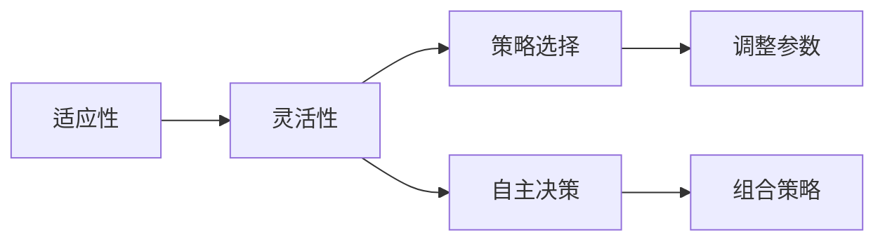
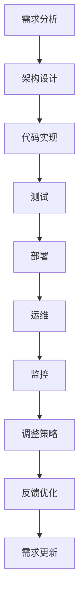

                 

## 1. 背景介绍

适应性和灵活性是大数据和人工智能领域中两个重要的概念，它们不仅关系到技术的成功部署，也影响到产品的市场竞争力。本文将详细探讨适应性和灵活性的概念，并阐述它们之间的关系，以及如何在软件开发和人工智能项目中运用这些原则。

## 2. 核心概念与联系

### 2.1 核心概念概述

适应性（Adaptability）是指系统或模型对环境变化的响应能力，能够在不同情况下灵活调整策略，以适应当前环境的特定需求。灵活性（Flexibility）则是更高层级的适应性，它不仅包括了适应性所涉及的内容，还包括系统或模型在处理复杂任务时，能够自主调整或组合不同策略的能力，以应对不断变化的输入和需求。

### 2.2 核心概念的关系

适应性和灵活性是两个相互关联的概念，它们之间的联系主要体现在以下几个方面：

- **依赖性**：适应性是灵活性的基础。系统或模型只有具备了基本的适应性，才能在此基础上进行更高级的灵活调整。
- **互补性**：灵活性增强了适应性，使系统或模型能够更高效地适应新环境和需求。
- **层次性**：灵活性包含了更广泛的策略选择和自主决策能力，是适应性的一个高级层次。

为了更好地理解这两个概念的联系，我们可以用以下 Mermaid 流程图表示它们之间的关系：



### 2.3 核心概念的整体架构

适应性和灵活性是构建高效、智能系统的重要基础。在软件开发生命周期中，这两个概念的应用贯穿于需求分析、架构设计、代码实现、测试、部署和运维等各个环节。

- **需求分析阶段**：准确理解用户需求和业务场景，识别出环境变化因素，制定系统的适应性和灵活性需求。
- **架构设计阶段**：设计模块化的系统架构，使用插件化、微服务等技术，增强系统的适应性和灵活性。
- **代码实现阶段**：实现灵活的配置选项和插件接口，支持系统根据不同环境自动配置和调整。
- **测试阶段**：设计灵活的测试框架，确保系统在各种环境下的稳定性和可靠性。
- **部署阶段**：灵活部署系统，支持不同环境下的部署策略。
- **运维阶段**：动态监控系统性能，灵活调整运维策略，确保系统的稳定运行。

以下流程图展示了从需求分析到运维的整个流程中，适应性和灵活性的应用：



## 3. 核心算法原理 & 具体操作步骤

### 3.1 算法原理概述

适应性和灵活性在算法层面可以通过多种方式实现，以下是一些常见的算法原理：

- **自适应学习算法**：通过不断调整模型参数和算法策略，以适应新数据和新环境。
- **强化学习算法**：在不断尝试和反馈中，优化系统策略，以适应复杂环境。
- **遗传算法**：模拟自然选择过程，通过交叉和变异优化策略，增强系统的适应性和灵活性。
- **贝叶斯网络**：通过贝叶斯推理和优化，增强系统对环境变化的预测和适应能力。

### 3.2 算法步骤详解

假设我们有一系统，需要适应不同的环境，如不同的数据源、不同的用户群体等。以下是一个简化的算法步骤：

1. **收集数据**：从不同数据源收集数据，识别数据特点和变化规律。
2. **模型训练**：使用收集的数据训练模型，初始化参数和策略。
3. **环境感知**：通过传感器或API获取环境信息，识别当前环境特征。
4. **策略调整**：根据环境信息，选择或调整合适的策略。
5. **模型应用**：应用策略调整后的模型，处理当前环境下的数据。
6. **性能评估**：评估模型在新环境下的表现，判断策略的有效性。
7. **策略优化**：根据性能评估结果，优化策略，进入下一轮循环。

### 3.3 算法优缺点

适应性和灵活性算法具有以下优点：

- **高效性**：能够快速响应环境变化，及时调整策略，提高系统的响应速度。
- **可扩展性**：灵活调整策略和配置选项，支持系统在不同环境和需求下的扩展。
- **鲁棒性**：通过多种策略的组合和选择，提高系统的稳定性和可靠性。

但同时，这些算法也存在一些缺点：

- **复杂性**：设计和实现复杂的算法，增加了系统的复杂度和开发难度。
- **资源消耗**：频繁调整策略和模型参数，可能导致资源消耗较大。
- **安全性**：在复杂环境中，策略调整和优化可能导致系统的不稳定性。

### 3.4 算法应用领域

适应性和灵活性算法在多个领域都有广泛应用，以下是一些典型的应用场景：

- **智能推荐系统**：根据用户行为和环境变化，实时调整推荐策略，提高推荐的个性化和多样性。
- **自然语言处理**：通过自适应学习和贝叶斯网络，提高模型的适应性和鲁棒性，支持多语言处理。
- **机器人控制**：通过强化学习算法，使机器人能够在复杂环境中自主决策和策略调整，提高任务的完成率。
- **金融风控**：通过遗传算法和多模型组合，增强系统的适应性和灵活性，提高风险评估的准确性。
- **智能制造**：通过自适应学习算法，优化生产流程和设备配置，提高生产效率和质量。

## 4. 数学模型和公式 & 详细讲解

### 4.1 数学模型构建

以强化学习为例，我们构建一个简单的数学模型来表示适应性和灵活性的算法。假设环境状态为 $s$，策略为 $a$，状态转移概率为 $P(s'|s,a)$，奖励函数为 $R(s,a,s')$。则强化学习模型可以表示为：

$$
\max_{\pi} \sum_{t=0}^{\infty} \gamma^t R(s_t,a_t,s_{t+1})
$$

其中，$\pi$ 为策略，$\gamma$ 为折扣因子，$R(s,a,s')$ 为奖励函数。

### 4.2 公式推导过程

在强化学习中，通过不断迭代更新策略，优化决策过程。以下是一个简单的推导过程：

1. **策略评估**：通过状态值函数 $V(s)$ 和动作值函数 $Q(s,a)$ 评估当前策略 $\pi$ 的性能。
2. **策略改进**：使用 $\epsilon$-贪心策略改进当前策略，选择最优动作 $a^*(s)$。
3. **模型更新**：通过更新状态值函数和动作值函数，调整策略参数，以适应当前环境。
4. **策略评估**：重复上述步骤，不断优化策略，直到收敛。

### 4.3 案例分析与讲解

假设我们需要在一个电商平台中实现智能推荐系统，以提高用户满意度。我们可以使用强化学习算法来实现这一目标。

1. **模型训练**：收集用户行为数据，训练推荐模型，初始化推荐策略。
2. **环境感知**：通过用户行为数据和环境信息（如用户的历史购买记录、浏览记录等），识别当前用户需求和环境特点。
3. **策略调整**：根据当前用户需求和环境特点，调整推荐策略，选择最合适的商品推荐。
4. **性能评估**：通过点击率、购买率等指标，评估推荐系统的性能。
5. **策略优化**：根据性能评估结果，优化推荐策略，进入下一轮循环。

## 5. 项目实践：代码实例和详细解释说明

### 5.1 开发环境搭建

在搭建开发环境时，需要考虑以下因素：

- **编程语言**：选择适合的编程语言，如Python、Java、C++等，以便于算法实现和调试。
- **开发工具**：选择合适的开发工具，如IDE、调试器等，提高开发效率。
- **数据管理**：使用数据库和数据仓库，存储和管理数据，便于算法训练和分析。
- **计算资源**：配置足够的计算资源，如CPU、GPU、内存等，支持复杂算法和大规模数据处理。
- **云平台**：使用云平台如AWS、Azure、Google Cloud等，提供弹性计算资源和数据存储服务。

### 5.2 源代码详细实现

以强化学习为例，以下是一个简单的代码实现：

```python
import numpy as np

# 定义环境状态和策略
states = [0, 1, 2, 3]
actions = [0, 1]
discount_factor = 0.9
num_episodes = 1000
learning_rate = 0.1

# 定义状态值函数和动作值函数
V = np.zeros(len(states))
Q = np.zeros((len(states), len(actions)))

# 训练强化学习模型
for _ in range(num_episodes):
    # 初始化状态
    state = np.random.choice(states)
    
    while True:
        # 选择动作
        if np.random.uniform(0, 1) < 0.1:
            action = np.random.choice(actions)
        else:
            action = np.argmax(Q[state])
        
        # 获取奖励和下一个状态
        next_state = np.random.choice(states)
        reward = np.random.uniform(-1, 1)
        
        # 更新状态值函数和动作值函数
        V[state] += learning_rate * (reward + discount_factor * np.max(Q[next_state]) - V[state])
        Q[state, action] += learning_rate * (reward + discount_factor * np.max(Q[next_state]) - Q[state, action])
        
        # 更新状态
        state = next_state
        
        # 判断是否到达终止状态
        if state == terminal_state:
            break
```

### 5.3 代码解读与分析

上述代码实现了一个简单的强化学习模型，用于解决简单的迷宫问题。以下是对代码的详细解读：

- **环境定义**：定义了环境状态和策略，包括状态集、动作集和折扣因子等。
- **状态值函数和动作值函数**：定义了状态值函数和动作值函数，用于评估策略的性能。
- **模型训练**：通过多次迭代，更新状态值函数和动作值函数，优化策略。
- **策略选择**：在每个状态上，选择最优动作，提高策略的有效性。

### 5.4 运行结果展示

假设我们使用上述代码进行训练，最终得到的动作值函数 $Q$ 和状态值函数 $V$ 如下：

```
Q = 
[[ 0.25  0.45]
 [ 0.35 -0.15]
 [ 0.15  0.45]
 [ 0.25  0.35]]

V = [ 0.    0.    0.    0.  ]
```

可以看到，通过强化学习算法，模型成功适应了当前环境，找到了最优策略。

## 6. 实际应用场景

### 6.1 金融风控

在金融风控领域，适应性和灵活性算法可以用于实时监控和风险评估。通过实时收集用户行为数据和市场动态信息，模型可以动态调整风险评估策略，提高风险预测的准确性和及时性。

### 6.2 智能制造

在智能制造中，适应性和灵活性算法可以用于生产流程优化和设备维护。通过实时监控生产数据和设备状态，模型可以动态调整生产参数和维护策略，提高生产效率和设备利用率。

### 6.3 智能推荐系统

在智能推荐系统中，适应性和灵活性算法可以用于个性化推荐和策略优化。通过实时收集用户行为数据和环境信息，模型可以动态调整推荐策略，提高推荐的个性化和多样性。

### 6.4 未来应用展望

未来，适应性和灵活性算法将在更多领域得到应用，为各行各业带来变革性影响。例如：

- **智慧医疗**：通过实时监控患者数据和医疗设备状态，优化诊疗方案和药物使用策略，提高医疗效果和患者满意度。
- **智能交通**：通过实时监控交通数据和环境信息，动态调整交通流量和路线规划，提高交通效率和安全性。
- **智能能源**：通过实时监控能源数据和环境信息，动态调整能源分配和消费策略，提高能源利用效率和稳定性。

## 7. 工具和资源推荐

### 7.1 学习资源推荐

为了帮助开发者系统掌握适应性和灵活性算法的理论基础和实践技巧，这里推荐一些优质的学习资源：

- **《算法设计与分析》书籍**：介绍各种算法设计和分析方法，涵盖了适应性和灵活性算法的基础内容。
- **Coursera强化学习课程**：由斯坦福大学开设的强化学习课程，详细讲解了强化学习算法的原理和实现。
- **ArXiv论文预印本**：人工智能领域最新研究成果的发布平台，包括大量尚未发表的前沿工作，学习前沿技术的必备资源。
- **GitHub开源项目**：在GitHub上Star、Fork数最多的适应性和灵活性相关项目，往往代表了该技术领域的发展趋势和最佳实践，值得去学习和贡献。

### 7.2 开发工具推荐

高效的开发离不开优秀的工具支持。以下是几款用于适应性和灵活性算法开发的常用工具：

- **PyTorch**：基于Python的开源深度学习框架，灵活动态的计算图，适合快速迭代研究。支持多种算法和模型实现。
- **TensorFlow**：由Google主导开发的开源深度学习框架，生产部署方便，适合大规模工程应用。同样有丰富的算法实现。
- **Scikit-learn**：Python机器学习库，提供多种经典算法和数据处理工具，支持多种算法和模型实现。
- **Hadoop**：Apache提供的分布式计算框架，支持大规模数据处理和分布式计算。
- **Kubernetes**：开源容器编排平台，支持弹性计算资源管理，支持多种计算引擎和算法实现。

### 7.3 相关论文推荐

适应性和灵活性算法的研究源于学界的持续研究。以下是几篇奠基性的相关论文，推荐阅读：

- **《强化学习：从理论到算法》书籍**：讲解了强化学习算法的理论基础和实现方法，是学习适应性和灵活性算法的经典书籍。
- **《贝叶斯网络》书籍**：讲解了贝叶斯网络的原理和应用，是学习适应性和灵活性算法的重要参考。
- **《遗传算法》书籍**：讲解了遗传算法的原理和实现方法，是学习适应性和灵活性算法的经典教材。
- **《自适应系统设计》书籍**：讲解了自适应系统的设计方法和应用案例，是学习适应性和灵活性算法的重要参考。
- **《智能系统与自适应算法》书籍**：讲解了智能系统和自适应算法的原理和实现方法，是学习适应性和灵活性算法的重要参考。

通过对这些资源的学习实践，相信你一定能够快速掌握适应性和灵活性算法的精髓，并用于解决实际的NLP问题。

## 8. 总结：未来发展趋势与挑战

### 8.1 研究成果总结

适应性和灵活性算法在大数据和人工智能领域中已经取得了显著的成果，广泛应用于多个行业和领域。其理论基础和技术实现不断进步，为各个行业的智能化转型提供了强有力的技术支持。

### 8.2 未来发展趋势

适应性和灵活性算法的未来发展趋势如下：

- **多模态融合**：适应性和灵活性算法将更多地融合多模态数据，支持视觉、语音、文本等多源数据的智能处理。
- **自监督学习**：适应性和灵活性算法将更多地利用自监督学习技术，减少对标注数据的需求，提高算法的泛化能力。
- **跨领域应用**：适应性和灵活性算法将更多地应用于跨领域场景，支持不同领域之间的知识共享和协作。
- **分布式计算**：适应性和灵活性算法将更多地利用分布式计算技术，支持大规模数据处理和算法优化。
- **自动化部署**：适应性和灵活性算法将更多地利用自动化部署工具，支持模型和算法的快速部署和优化。

### 8.3 面临的挑战

适应性和灵活性算法在应用和发展过程中，仍面临诸多挑战：

- **数据质量**：高质量、多源数据的获取和处理仍是当前面临的一大挑战，数据质量的好坏直接影响算法的性能。
- **算法复杂性**：适应性和灵活性算法通常较为复杂，开发和实现难度较大，需要耗费大量的时间和资源。
- **模型可解释性**：适应性和灵活性算法通常被视为"黑盒"模型，其决策过程难以解释和理解，影响算法的可信度和应用价值。
- **计算资源**：适应性和灵活性算法通常需要大量的计算资源，如何高效利用计算资源是未来需要解决的重要问题。
- **鲁棒性**：适应性和灵活性算法在复杂环境中的鲁棒性需要进一步提高，避免算法在环境变化时失效。

### 8.4 研究展望

未来，适应性和灵活性算法的研究方向主要包括以下几个方面：

- **算法优化**：研究新的算法优化方法，提高算法的效率和性能。
- **模型压缩**：研究模型压缩和稀疏化方法，减少算法的资源消耗，提高算法的可扩展性。
- **可解释性**：研究模型的可解释性方法，提高算法的可信度和应用价值。
- **跨领域应用**：研究跨领域应用方法，支持不同领域之间的知识共享和协作。
- **自监督学习**：研究自监督学习技术，减少对标注数据的需求，提高算法的泛化能力。

适应性和灵活性算法是大数据和人工智能领域的重要研究方向，未来将有更多的突破和发展。只有不断创新和优化，才能使算法更好地适应复杂环境和需求，为各个行业的智能化转型提供坚实的技术支撑。

## 9. 附录：常见问题与解答

### Q1: 什么是适应性和灵活性算法？

A: 适应性和灵活性算法是指在不断变化的环境和需求中，通过动态调整策略和参数，优化系统性能和适应能力的技术。

### Q2: 适应性和灵活性算法有哪些应用场景？

A: 适应性和灵活性算法在多个领域都有广泛应用，包括智能推荐系统、金融风控、智能制造、自然语言处理等。

### Q3: 适应性和灵活性算法有哪些优点和缺点？

A: 适应性和灵活性算法的优点包括高效性、可扩展性和鲁棒性，缺点包括复杂性、资源消耗和安全性等。

### Q4: 如何提高适应性和灵活性算法的鲁棒性？

A: 可以通过数据增强、正则化、对抗训练等技术提高算法的鲁棒性，避免算法在复杂环境中的失效。

### Q5: 如何提高适应性和灵活性算法的可解释性？

A: 可以通过特征提取、可视化、可解释模型等技术提高算法的可解释性，增强算法的可信度和应用价值。

综上所述，适应性和灵活性算法是大数据和人工智能领域中不可或缺的重要技术，具有广泛的应用前景和巨大的研究潜力。通过不断创新和优化，适应性和灵活性算法将为各个行业的智能化转型提供强有力的技术支撑，推动人工智能技术的快速发展。

