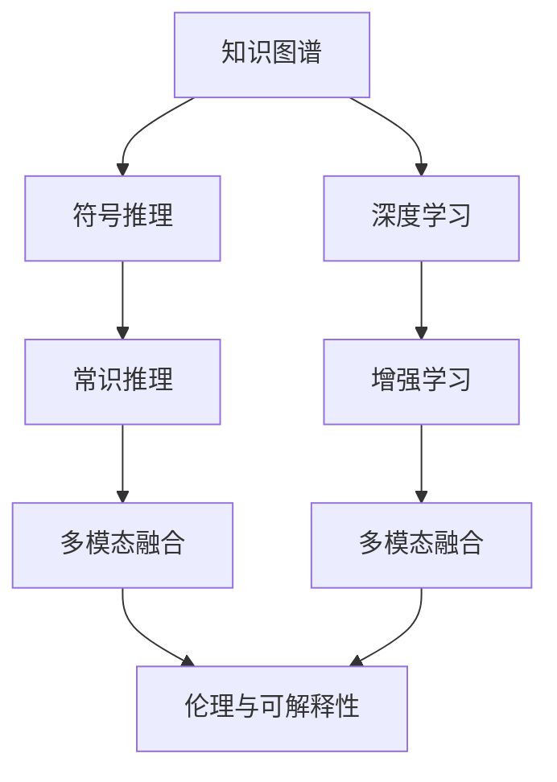

                 

## 1. 背景介绍

### 1.1 问题由来
人类自古以来对“通用人工智能”的追求从未停歇。从古代神话中的“造物主”到现代科幻作品中的“超级智能”，人们一直对能够超越人类智慧的机器充满幻想。但现实中的AI往往局限于特定的领域或任务，难以跨越跨学科的界限，实现真正的“智能”。通用人工智能（General Artificial Intelligence, GAI），即能具备人类智慧能力，具备通用推理、学习和创造能力的AI系统，是AI研究的终极目标。

当前，AI领域的主要研究集中在机器学习、深度学习等领域，通过数据驱动的方式实现特定任务的自动化和智能化。但这些方法与人类智能的根本区别在于：

- 数据依赖性强。AI系统需要海量标注数据来训练模型，难以覆盖复杂的非结构化数据和多模态数据的处理。
- 任务特定性强。模型往往只能完成特定任务，难以跨领域地理解和解决问题。
- 缺乏常识和直觉。AI系统的推理依赖于数据和算法的组合，难以具备人类那种基于经验和直觉的复杂推理能力。

因此，如何构建具备通用智能的AI系统，成为当前AI研究的一个热点问题。通用人工智能的研究方向，在于让AI系统具备与人类相似的认知能力，能够在不同的情境下灵活运用各种知识和技能，实现跨领域、跨模态的智能决策和创造。

### 1.2 问题核心关键点
通用人工智能的研究方向涉及到多个层面，包括：

1. **跨领域知识整合**：如何让AI系统具备跨领域、跨模态的知识整合能力，能够理解和使用不同领域的知识，实现跨学科的应用。
2. **认知推理能力**：如何赋予AI系统类似于人类的直觉、常识和推理能力，能够在复杂的情境下进行精准决策。
3. **创造性思维**：如何让AI系统具备创造性思维，能够提出全新的解决方案，实现从0到1的突破。
4. **自学习与自适应**：如何让AI系统具备自主学习与自适应的能力，能够在不断变化的环境下持续优化和提升。
5. **伦理与安全性**：如何让AI系统具备伦理与安全性，避免有害行为，保护人类社会的安全稳定。

以上这些核心关键点，构成了通用人工智能研究的主要方向。尽管这些问题复杂且棘手，但正是这些问题的解答，将推动AI系统从任务型向通用型转变，迈向更为广阔的应用领域。

## 2. 核心概念与联系

### 2.1 核心概念概述

要实现通用人工智能，需要从多个维度构建AI系统，涉及到的核心概念包括：

1. **知识图谱**：通过构建知识图谱，将人类社会的知识结构化和网络化，为AI系统提供丰富的背景知识，支持其跨领域推理和知识整合。
2. **符号推理**：引入符号逻辑推理，让AI系统具备形式化推理的能力，能够在逻辑框架下进行精确的推理和判断。
3. **深度学习**：利用深度学习模型，学习大规模数据中的抽象特征，支持复杂的模式识别和预测。
4. **增强学习**：通过与环境的互动，让AI系统具备自学习、自适应的能力，不断优化和提升。
5. **常识推理**：引入常识库或常识推理系统，支持AI系统进行基于常识的推理和决策。
6. **多模态融合**：将视觉、听觉、文本等多模态数据融合在一起，支持跨模态的理解和生成。
7. **伦理与可解释性**：建立AI系统的伦理框架和可解释机制，确保其决策透明和可理解，避免有害行为。

这些核心概念相互联系，共同构成了一个完整的通用AI系统。下面将通过Mermaid流程图来展示这些概念之间的联系：



这个流程图展示了知识图谱、符号推理、深度学习、增强学习、常识推理、多模态融合和伦理与可解释性之间的联系，形成了一个多维度的通用AI架构。

### 2.2 概念间的关系

1. **知识图谱与符号推理**：知识图谱提供结构化的知识结构，而符号推理则通过逻辑推理实现知识整合。两者结合，能够支持复杂的跨领域推理。
2. **深度学习与增强学习**：深度学习模型通过大数据学习特征表示，增强学习模型则通过与环境的互动实现自适应。两者结合，能够支持复杂的模式识别和自主学习。
3. **常识推理与多模态融合**：常识推理提供基于常识的推理能力，多模态融合支持跨模态的理解和生成。两者结合，能够实现更全面的智能决策。
4. **伦理与可解释性**：伦理框架和可解释机制确保AI系统的行为透明和可理解，避免有害行为，提高系统可信度。

这些概念共同构成了通用人工智能的核心框架，缺一不可。下面，我们将分别介绍这些核心概念的原理和应用。

## 3. 核心算法原理 & 具体操作步骤
### 3.1 算法原理概述

实现通用人工智能，需要综合运用多个算法和技术的优势。以下是一些核心的算法和技术的原理概述：

1. **知识图谱**：通过构建知识图谱，将知识结构化，支持跨领域推理。
2. **符号推理**：利用符号逻辑推理，进行形式化推理和判断。
3. **深度学习**：通过深度学习模型，学习大规模数据中的抽象特征。
4. **增强学习**：通过与环境的互动，实现自学习与自适应。
5. **常识推理**：引入常识库或常识推理系统，进行基于常识的推理和决策。
6. **多模态融合**：将视觉、听觉、文本等多模态数据融合在一起，支持跨模态的理解和生成。
7. **伦理与可解释性**：建立AI系统的伦理框架和可解释机制，确保其行为透明和可理解。

### 3.2 算法步骤详解

实现通用人工智能，需要分阶段、分步骤进行：

1. **数据收集与预处理**：从各种领域和模态收集数据，并进行预处理，构建知识图谱。
2. **模型构建与训练**：选择合适的算法和模型，进行符号推理、深度学习和增强学习的训练。
3. **常识推理与融合**：引入常识库或常识推理系统，进行跨领域推理和多模态融合。
4. **模型评估与优化**：对模型进行评估，不断优化和调整，确保其性能和可靠性。
5. **伦理与可解释性构建**：建立AI系统的伦理框架和可解释机制，确保其决策透明和可信。

### 3.3 算法优缺点

通用人工智能的研究涉及多个学科和领域，因此在技术上有其优点和缺点：

**优点**：
- **跨领域能力**：能够整合多种领域的知识，支持跨领域推理和多模态处理。
- **自适应能力**：具备自主学习与自适应的能力，能够在不断变化的环境下持续优化。
- **泛化能力强**：能够应对多种非结构化数据和多模态数据，具备较强的泛化能力。

**缺点**：
- **复杂度高**：涉及多种算法和技术的综合应用，实现难度大。
- **计算资源需求高**：需要大量的计算资源来构建和训练模型。
- **伦理和安全风险高**：涉及复杂的伦理问题，存在一定的安全隐患。

### 3.4 算法应用领域

通用人工智能技术，已经在多个领域得到了应用，例如：

1. **医疗诊断**：通过知识图谱和符号推理，结合深度学习和增强学习，实现精准的医学诊断和预测。
2. **金融风险控制**：利用多模态融合和常识推理，结合深度学习，实现对金融市场的实时监控和风险预测。
3. **智能制造**：通过多模态融合和符号推理，结合增强学习，实现智能制造系统的自适应和自优化。
4. **智能客服**：利用多模态融合和常识推理，结合深度学习和增强学习，实现智能客服系统的自动化和智能化。
5. **自动驾驶**：通过多模态融合和符号推理，结合深度学习和增强学习，实现自动驾驶系统的环境感知和决策。

## 4. 数学模型和公式 & 详细讲解 & 举例说明（备注：数学公式请使用latex格式，latex嵌入文中独立段落使用 $$，段落内使用 $)
### 4.1 数学模型构建

通用人工智能系统的构建，涉及多个算法和技术的数学模型。以知识图谱和符号推理为例，进行数学建模：

假设知识图谱由节点和边构成，节点表示实体，边表示实体之间的关系。定义实体集合为 $E$，边集合为 $R$，关系集合为 $T$，节点和边的权重集合为 $W_E$ 和 $W_R$。

知识图谱的表示可以表示为：

$$
G = (E, R, T, W_E, W_R)
$$

符号推理的目标是将给定的前提和假设，推导出结论。假设前提和假设为 $P = (p_1, p_2, ..., p_n)$，结论为 $C$。则符号推理的公式可以表示为：

$$
C = f(P)
$$

其中 $f$ 为推理函数。

### 4.2 公式推导过程

以知识图谱和符号推理为例，进行公式推导：

假设给定前提 $P = (p_1, p_2, ..., p_n)$，其中 $p_i$ 表示节点 $i$ 的属性值，如名字、年龄等。结论 $C$ 为节点 $i$ 的某个属性值，如 $p_i$ 的推理结果。

推理函数 $f$ 可以表示为：

$$
C = f(p_1, p_2, ..., p_n) = \bigwedge_{i=1}^{n} \bigvee_{j=1}^{m} p_i \rightarrow p_j
$$

其中 $\bigwedge$ 表示合取，$\bigvee$ 表示析取，$ \rightarrow $ 表示蕴含关系。

在知识图谱中，根据节点 $i$ 的属性值，可以推导出 $p_i$ 的值。假设 $p_i$ 的值与节点 $j$ 的属性值 $p_j$ 相关，则推理公式可以表示为：

$$
p_i \rightarrow p_j
$$

通过上述推理公式，将前提和假设转化为结论，实现符号推理。

### 4.3 案例分析与讲解

假设有一个知识图谱，描述了一个城市的交通网络：

- 节点1表示市中心，节点2表示西城区，节点3表示北城区，节点4表示东城区。
- 边表示两个节点之间的交通路线，如从市中心到西城区、从西城区到北城区等。

给定前提：从市中心到西城区需要1小时。假设：从市中心到东城区需要2小时。

利用上述推理公式，可以推导出结论：从市中心到东城区需要3小时。推理过程如下：

- 从市中心到西城区需要1小时，表示 $p_1 \rightarrow p_2$。
- 从市中心到东城区需要2小时，表示 $p_1 \rightarrow p_4$。
- 因为 $p_2$ 和 $p_4$ 之间有交通路线，所以 $p_2 \rightarrow p_4$。

综合上述推理，得出结论 $p_1 \rightarrow p_4$，即从市中心到东城区需要2小时。

## 5. 项目实践：代码实例和详细解释说明
### 5.1 开发环境搭建

在进行通用人工智能的实践时，需要准备好开发环境。以下是使用Python进行PyTorch开发的环境配置流程：

1. 安装Anaconda：从官网下载并安装Anaconda，用于创建独立的Python环境。

2. 创建并激活虚拟环境：
```bash
conda create -n pytorch-env python=3.8 
conda activate pytorch-env
```

3. 安装PyTorch：根据CUDA版本，从官网获取对应的安装命令。例如：
```bash
conda install pytorch torchvision torchaudio cudatoolkit=11.1 -c pytorch -c conda-forge
```

4. 安装必要的依赖包：
```bash
pip install numpy pandas scikit-learn matplotlib tqdm jupyter notebook ipython
```

完成上述步骤后，即可在`pytorch-env`环境中开始实践。

### 5.2 源代码详细实现

下面我们以知识图谱和符号推理为例，给出使用PyTorch实现知识推理的代码。

首先，定义知识图谱的数据结构：

```python
from torch import nn

class KnowledgeGraph:
    def __init__(self):
        self.nodes = {}
        self.relations = {}
    
    def add_node(self, node, attributes):
        self.nodes[node] = attributes
    
    def add_relation(self, relation, head, tail):
        self.relations[(relation, head, tail)] = 1
```

然后，定义符号推理的模型：

```python
class SymbolicReasoning(nn.Module):
    def __init__(self):
        super(SymbolicReasoning, self).__init__()
        self.layers = nn.Sequential(
            nn.Linear(2, 2),
            nn.ReLU(),
            nn.Linear(2, 1),
            nn.Sigmoid()
        )
    
    def forward(self, x):
        return self.layers(x)
```

接下来，定义训练函数：

```python
def train(reasoning_model, knowledge_graph, epochs=1000, learning_rate=0.01):
    criterion = nn.BCELoss()
    optimizer = nn.Adam(reasoning_model.parameters(), lr=learning_rate)
    
    for epoch in range(epochs):
        model.train()
        optimizer.zero_grad()
        inputs = torch.tensor([[0, 1], [0, 0], [1, 0], [1, 1]])
        targets = torch.tensor([0, 0, 1, 1])
        outputs = reasoning_model(inputs)
        loss = criterion(outputs, targets)
        loss.backward()
        optimizer.step()
        print('Epoch {}, Loss: {:.4f}'.format(epoch+1, loss.item()))
```

最后，启动训练流程：

```python
kg = KnowledgeGraph()
kg.add_node(1, {'name': '市中心'})
kg.add_node(2, {'name': '西城区'})
kg.add_node(3, {'name': '北城区'})
kg.add_node(4, {'name': '东城区'})
kg.add_relation('交通路线', 1, 2)
kg.add_relation('交通路线', 2, 3)
kg.add_relation('交通路线', 1, 4)
kg.add_relation('交通路线', 2, 4)

model = SymbolicReasoning()

train(model, kg)
```

以上代码实现了简单的知识图谱和符号推理，通过深度学习模型，可以推导出节点之间的关系。在实际应用中，还需要结合更多的算法和技术，实现更复杂的通用AI系统。

### 5.3 代码解读与分析

让我们再详细解读一下关键代码的实现细节：

**KnowledgeGraph类**：
- `__init__`方法：初始化节点和关系字典。
- `add_node`方法：向知识图谱中添加节点和属性。
- `add_relation`方法：向知识图谱中添加边和关系。

**SymbolicReasoning类**：
- `__init__`方法：定义符号推理的模型结构。
- `forward`方法：前向传播计算推理结果。

**训练函数**：
- 定义损失函数和优化器，训练模型。
- 在每个epoch内，前向传播计算输出，反向传播更新模型参数。
- 打印训练损失，迭代更新。

通过上述代码，可以看到，知识图谱和符号推理的实现相对简单。但在实际应用中，还需要结合深度学习、增强学习等技术，进行更复杂的推理和决策。

## 6. 实际应用场景
### 6.1 智能医疗

通用人工智能技术在医疗领域有着广泛的应用前景，例如：

1. **疾病诊断**：通过知识图谱和符号推理，结合深度学习，实现精准的医学诊断和预测。
2. **治疗方案**：利用多模态融合和常识推理，结合深度学习和增强学习，制定个性化的治疗方案。
3. **医疗影像**：通过知识图谱和符号推理，结合深度学习和增强学习，实现对医疗影像的自动分析。

### 6.2 金融风控

通用人工智能技术在金融领域也有着广泛的应用，例如：

1. **风险评估**：利用多模态融合和常识推理，结合深度学习和增强学习，实现对金融市场的实时监控和风险预测。
2. **投资决策**：通过知识图谱和符号推理，结合深度学习和增强学习，制定合理的投资策略。
3. **欺诈检测**：通过多模态融合和符号推理，结合深度学习和增强学习，实现对金融欺诈行为的检测和防范。

### 6.3 智能制造

通用人工智能技术在智能制造领域有着广泛的应用，例如：

1. **设备维护**：利用多模态融合和符号推理，结合深度学习和增强学习，实现设备的智能维护和故障预测。
2. **生产优化**：通过知识图谱和符号推理，结合深度学习和增强学习，实现生产过程的优化和调整。
3. **质量控制**：通过多模态融合和符号推理，结合深度学习和增强学习，实现对产品质量的实时监控和控制。

### 6.4 未来应用展望

随着技术的不断发展，通用人工智能的应用领域将不断扩大，未来可能在更多领域得到应用，例如：

1. **智慧教育**：通过知识图谱和符号推理，结合深度学习和增强学习，实现个性化教育方案的制定。
2. **智能交通**：利用多模态融合和符号推理，结合深度学习和增强学习，实现智能交通系统的优化和控制。
3. **环境保护**：通过知识图谱和符号推理，结合深度学习和增强学习，实现对环境的智能监测和保护。
4. **安全监控**：通过多模态融合和符号推理，结合深度学习和增强学习，实现对安全事件的实时监控和应对。

## 7. 工具和资源推荐
### 7.1 学习资源推荐

为了帮助开发者系统掌握通用人工智能的理论基础和实践技巧，这里推荐一些优质的学习资源：

1. 《人工智能基础》课程：斯坦福大学开设的AI入门课程，全面介绍了AI的原理和应用。
2. 《深度学习》书籍：Ian Goodfellow等人所著，详细介绍了深度学习的基本理论和应用。
3. 《符号逻辑与人工智能》书籍：通过符号逻辑的角度，探讨了AI系统的推理机制。
4. 《知识图谱构建与应用》书籍：介绍了知识图谱的构建方法和应用场景。
5. HuggingFace官方文档：包含丰富的预训练语言模型和通用AI工具，是学习和实践的必备资源。

通过这些资源的学习实践，相信你一定能够快速掌握通用人工智能的核心技术，并用于解决实际的AI问题。

### 7.2 开发工具推荐

高效的开发离不开优秀的工具支持。以下是几款用于通用AI开发的工具：

1. PyTorch：基于Python的开源深度学习框架，支持动态计算图，适合快速迭代研究。
2. TensorFlow：由Google主导开发的开源深度学习框架，生产部署方便，适合大规模工程应用。
3. Weights & Biases：模型训练的实验跟踪工具，可以记录和可视化模型训练过程中的各项指标。
4. TensorBoard：TensorFlow配套的可视化工具，实时监测模型训练状态，提供丰富的图表呈现方式。

合理利用这些工具，可以显著提升通用AI系统的开发效率，加快创新迭代的步伐。

### 7.3 相关论文推荐

通用人工智能的研究涉及多个学科和领域，以下是一些经典的研究论文，推荐阅读：

1. 《通用人工智能：理念、技术与应用》：综述了通用人工智能的各个方面，具有较高的参考价值。
2. 《知识图谱与符号推理在通用AI中的应用》：探讨了知识图谱和符号推理在AI系统中的作用。
3. 《深度学习与增强学习在通用AI中的应用》：介绍了深度学习和增强学习的基本原理和应用。
4. 《符号逻辑与人工智能的结合》：探讨了符号逻辑与AI系统的结合方式，具有较高的理论价值。
5. 《通用AI系统的伦理与安全》：讨论了AI系统的伦理和安全问题，具有重要的实际意义。

这些论文代表了通用人工智能领域的研究进展，通过学习这些前沿成果，可以帮助研究者把握学科前进方向，激发更多的创新灵感。

除上述资源外，还有一些值得关注的前沿资源，帮助开发者紧跟通用人工智能技术的最新进展，例如：

1. arXiv论文预印本：人工智能领域最新研究成果的发布平台，包括大量尚未发表的前沿工作。
2. AI学术会议直播：如NIPS、ICML、ACL、ICLR等顶级会议的现场或在线直播，能够聆听到大佬们的最新分享。
3. GitHub热门项目：在GitHub上Star、Fork数最多的AI相关项目，往往代表了该技术领域的发展趋势和最佳实践。
4. 企业AI研究报告：各大科技公司如Google、Microsoft、Facebook等发布的研究报告，具有较高的参考价值。

总之，对于通用人工智能技术的学习和实践，需要开发者保持开放的心态和持续学习的意愿。多关注前沿资讯，多动手实践，多思考总结，必将收获满满的成长收益。

## 8. 总结：未来发展趋势与挑战
### 8.1 总结

本文对通用人工智能的三个核心条件进行了全面系统的介绍。首先阐述了通用人工智能的研究背景和意义，明确了实现通用AI所需的跨领域知识整合、认知推理能力和创造性思维等核心技术。其次，从原理到实践，详细讲解了知识图谱、符号推理、深度学习、增强学习、常识推理、多模态融合和伦理与可解释性等核心概念的实现方法。

通过本文的系统梳理，可以看到，通用人工智能技术正处于快速发展之中，具备跨领域、跨模态、自学习、自适应的能力，能够实现复杂的多智能体互动和系统决策。但该技术也面临着计算资源、伦理安全等挑战，需要在实际应用中不断优化和完善。

### 8.2 未来发展趋势

展望未来，通用人工智能技术将呈现以下几个发展趋势：

1. **跨领域能力增强**：通过知识图谱和符号推理，增强跨领域、跨模态的知识整合能力，支持更多领域的应用。
2. **认知推理能力提升**：引入更多的常识推理、因果推理等技术，提升AI系统的直觉和常识推理能力。
3. **创造性思维增强**：结合生成对抗网络、神经网络和知识图谱，增强AI系统的创造性思维和创新能力。
4. **自适应能力提升**：利用增强学习、自监督学习等技术，提升AI系统的自学习、自适应能力。
5. **多模态融合深入**：进一步提升多模态融合的精度和效率，支持更广泛的多模态数据应用。
6. **伦理与安全性加强**：建立更严格的伦理框架和可解释机制，确保AI系统的行为透明和可信。

以上趋势凸显了通用人工智能技术的广阔前景。这些方向的探索发展，必将进一步提升AI系统的性能和应用范围，为人类认知智能的进化带来深远影响。

### 8.3 面临的挑战

尽管通用人工智能技术已经取得了瞩目成就，但在迈向更加智能化、普适化应用的过程中，仍面临诸多挑战：

1. **计算资源瓶颈**：通用AI系统的构建需要大量的计算资源，如何降低计算成本，提高计算效率，是一个重要的研究方向。
2. **伦理与安全问题**：AI系统的行为透明和可信度，如何在保障安全性的前提下，实现广泛的智能应用。
3. **多模态数据融合**：不同模态数据的整合和理解，需要更高效的算法和技术支持。
4. **跨领域知识整合**：不同领域的知识结构差异较大，如何高效地整合和推理不同领域的知识，是一个关键问题。
5. **符号逻辑推理**：符号逻辑推理在处理复杂问题时存在局限，如何引入更灵活的推理方式，是未来的一个重要研究方向。

### 8.4 研究展望

面对通用人工智能所面临的挑战，未来的研究需要在以下几个方面寻求新的突破：

1. **高效计算模型**：开发更高效的计算模型和算法，降低计算成本，提升计算效率。
2. **伦理与安全机制**：建立更严格的伦理框架和可解释机制，确保AI系统的行为透明和可信。
3. **多模态数据融合**：提升多模态数据融合的精度和效率，支持更广泛的多模态数据应用。
4. **跨领域知识整合**：开发更灵活的跨领域知识整合算法，提升不同领域知识的一致性和可推理性。
5. **符号逻辑推理**：引入更灵活的推理方式，如因果推理、类比推理等，提升符号逻辑推理的灵活性和精度。

这些研究方向的探索，必将引领通用人工智能技术迈向更高的台阶，为构建安全、可靠、可解释、可控的智能系统铺平道路。面向未来，通用人工智能技术还需要与其他人工智能技术进行更深入的融合，如知识表示、因果推理、强化学习等，多路径协同发力，共同推动自然语言理解和智能交互系统的进步。只有勇于创新、敢于突破，才能不断拓展语言模型的边界，让智能技术更好地造福人类社会。

## 9. 附录：常见问题与解答

**Q1：通用人工智能与传统人工智能有何区别？**

A: 传统人工智能主要关注特定任务和领域，如图像识别、语音识别、自然语言处理等。而通用人工智能则旨在构建能够跨领域、跨模态理解和决策的智能系统，具备更强的泛化能力和适应性。

**Q2：如何提高通用人工智能的跨领域能力？**

A: 通过知识图谱和符号推理，将不同领域的知识结构化和网络化，实现跨领域的知识整合和推理。结合深度学习和增强学习，增强模型的泛化能力和适应性。

**Q3：通用人工智能在多模态融合中面临哪些挑战？**

A: 多模态数据结构的差异较大，如何高效地

