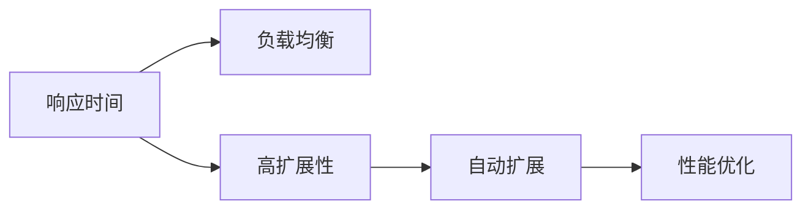

                 

# 通过响应时间监控实现高扩展性

> 关键词：响应时间监控,高扩展性,系统设计,负载均衡,自动扩展,性能优化

## 1. 背景介绍

### 1.1 问题由来

在现代互联网应用中，系统的高扩展性、高可用性和高性能是不可或缺的。系统的高扩展性不仅能够提升系统的承载能力，支持业务快速扩展，还能提升系统的可靠性，降低故障风险。然而，系统的扩展性受到很多因素的限制，例如硬件成本、软件架构、数据处理能力等。因此，如何设计一个高扩展性的系统成为了一个重要的研究课题。

## 2. 核心概念与联系

### 2.1 核心概念概述

1. **响应时间（Response Time）**：用户从提交请求到系统返回结果所需的时间。响应时间越短，系统的性能和用户体验越好。
2. **高扩展性（Scalability）**：指系统能够根据业务负载的变化自动调整资源，支持系统水平的扩展。
3. **负载均衡（Load Balancing）**：通过将请求分散到多个服务器上，使得每个服务器处理的请求量相对均衡，从而提升系统的吞吐量和响应时间。
4. **自动扩展（Auto-Scaling）**：系统能够根据当前负载自动调整资源，包括增加或减少服务器数量，以应对负载的变化。
5. **性能优化（Performance Optimization）**：通过算法、数据结构和系统设计的改进，提升系统的响应速度、吞吐量和资源利用率。

这些概念之间的关系可以通过以下 Mermaid 流程图来展示：



从上述流程图中可以看出，响应时间和负载均衡、高扩展性、自动扩展以及性能优化紧密相关。提高响应时间可以通过优化负载均衡、扩展性和性能来实现。

### 2.2 概念间的关系

- **负载均衡**：通过将请求分散到多个服务器上，可以显著降低单个服务器的负载，从而提升系统的响应时间和扩展性。
- **高扩展性**：自动扩展可以根据业务负载的变化自动调整资源，支持系统水平的扩展。负载均衡和高扩展性相辅相成，共同提升系统的性能。
- **性能优化**：通过算法、数据结构和系统设计的改进，可以进一步提升系统的响应速度和资源利用率。响应时间和性能优化之间存在正相关关系。
- **自动扩展**：自动扩展可以根据当前负载自动调整资源，从而支持系统的高扩展性和高可用性。负载均衡和高扩展性依赖于自动扩展的支持。

通过这些核心概念，我们可以构建一个高扩展性的系统，通过响应时间监控，进一步提升系统的性能和用户体验。

## 3. 核心算法原理 & 具体操作步骤

### 3.1 算法原理概述

通过响应时间监控，可以实现系统的高扩展性和高性能。具体的算法原理如下：

1. **负载均衡算法**：根据当前的负载情况，将请求均衡地分配到不同的服务器上。
2. **自动扩展算法**：根据当前的负载情况，动态地调整服务器的数量，以支持系统的高扩展性。
3. **性能优化算法**：通过优化算法和数据结构，提升系统的响应速度和资源利用率。

这些算法共同作用，实现了系统的负载均衡、高扩展性和高性能。

### 3.2 算法步骤详解

以下是详细的算法步骤：

1. **负载均衡算法**：
   - 收集当前服务器的请求量和响应时间。
   - 根据请求量和响应时间，计算每个服务器的负载情况。
   - 根据负载情况，将请求均衡地分配到不同的服务器上。

2. **自动扩展算法**：
   - 收集当前服务器的请求量和响应时间。
   - 根据请求量和响应时间，计算当前负载情况。
   - 根据负载情况，动态地调整服务器的数量，以支持系统的高扩展性。

3. **性能优化算法**：
   - 收集当前服务器的请求量和响应时间。
   - 根据请求量和响应时间，优化算法的参数和数据结构。
   - 通过优化算法和数据结构，提升系统的响应速度和资源利用率。

### 3.3 算法优缺点

**优点**：
- 通过负载均衡和自动扩展，可以显著提升系统的响应时间和扩展性。
- 通过性能优化，可以提升系统的资源利用率和响应速度。

**缺点**：
- 负载均衡和自动扩展需要额外的硬件和软件资源，增加了系统的成本。
- 性能优化需要复杂的算法和数据结构，增加了系统设计和实现的复杂度。

### 3.4 算法应用领域

该算法可以应用于各种需要高扩展性和高性能的系统中，例如：

- **电子商务系统**：通过负载均衡和自动扩展，支持商品搜索、订单处理等业务的高并发请求。
- **在线视频平台**：通过负载均衡和自动扩展，支持视频播放、直播等业务的实时处理。
- **金融交易系统**：通过负载均衡和自动扩展，支持股票交易、资金结算等业务的快速处理。

## 4. 数学模型和公式 & 详细讲解

### 4.1 数学模型构建

假设有一个由 $n$ 个服务器组成的服务集群，每个服务器的处理能力为 $C$，当前的请求量为 $L$，每个请求的响应时间为 $T$。

定义：
- $N$ 表示当前正在处理的请求数量。
- $T_{avg}$ 表示当前请求的平均响应时间。
- $T_{max}$ 表示当前请求的最大响应时间。
- $R_{avg}$ 表示当前请求的平均负载情况。

### 4.2 公式推导过程

1. **负载均衡算法**：
   - 收集当前服务器的请求量和响应时间。
   - 根据请求量和响应时间，计算每个服务器的负载情况。
   - 根据负载情况，将请求均衡地分配到不同的服务器上。

   负载均衡算法的公式推导如下：
   $$
   R_{avg} = \frac{L}{N} \\
   T_{avg} = \frac{\sum_{i=1}^N T_i}{N}
   $$

   根据上述公式，可以计算出每个请求的平均负载情况和平均响应时间。通过将请求均衡地分配到不同的服务器上，可以提升系统的负载均衡和扩展性。

2. **自动扩展算法**：
   - 收集当前服务器的请求量和响应时间。
   - 根据请求量和响应时间，计算当前负载情况。
   - 根据负载情况，动态地调整服务器的数量，以支持系统的高扩展性。

   自动扩展算法的公式推导如下：
   $$
   R_{avg} = \frac{L}{N} \\
   T_{avg} = \frac{\sum_{i=1}^N T_i}{N}
   $$

   根据上述公式，可以计算出当前请求的平均负载情况和平均响应时间。根据负载情况，动态地调整服务器的数量，可以支持系统的高扩展性和高可用性。

3. **性能优化算法**：
   - 收集当前服务器的请求量和响应时间。
   - 根据请求量和响应时间，优化算法的参数和数据结构。
   - 通过优化算法和数据结构，提升系统的响应速度和资源利用率。

   性能优化算法的公式推导如下：
   $$
   T_{avg} = \frac{\sum_{i=1}^N T_i}{N}
   $$

   根据上述公式，可以计算出当前请求的平均响应时间。通过优化算法和数据结构，可以提升系统的响应速度和资源利用率。

### 4.3 案例分析与讲解

假设有一个电子商务系统，由10个服务器组成，每个服务器的处理能力为1000 requests/s。当前系统负载情况如下：

- 请求量为10000 requests/s。
- 平均响应时间为200ms。

根据上述负载情况，可以计算出：

- 当前正在处理的请求数量为：$N = \frac{L}{C} = \frac{10000}{1000} = 10$
- 当前请求的平均负载情况为：$R_{avg} = \frac{L}{N} = \frac{10000}{10} = 1000 requests/s$
- 当前请求的平均响应时间为：$T_{avg} = \frac{\sum_{i=1}^N T_i}{N} = \frac{200}{10} = 20ms$

根据上述计算结果，可以采取以下措施：

- 负载均衡：将请求均衡地分配到不同的服务器上，以提升系统的扩展性。
- 自动扩展：根据当前负载情况，动态地调整服务器的数量，以支持系统的高扩展性。
- 性能优化：优化算法和数据结构，提升系统的响应速度和资源利用率。

## 5. 项目实践：代码实例和详细解释说明

### 5.1 开发环境搭建

在进行响应时间监控和负载均衡的实践前，我们需要准备好开发环境。以下是使用 Python 和 Flask 框架的开发环境配置流程：

1. 安装 Python：从官网下载并安装 Python，选择合适的 Python 版本。
2. 安装 Flask：使用 pip 安装 Flask 库。
3. 安装相关的数据库和数据处理库。

```bash
pip install Flask
pip install mysql-connector-python
pip install pandas
```

完成上述步骤后，即可在本地搭建 Flask 应用。

### 5.2 源代码详细实现

以下是一个使用 Flask 框架实现负载均衡和自动扩展的 Python 代码实例。

```python
from flask import Flask, request, jsonify
import mysql.connector

app = Flask(__name__)

# 连接数据库
db = mysql.connector.connect(
    host="localhost",
    user="root",
    password="password",
    database="example_db"
)

# 查询当前负载情况
@app.route('/get_load', methods=['GET'])
def get_load():
    cursor = db.cursor()
    cursor.execute("SELECT request_count, average_response_time FROM load_info")
    load_info = cursor.fetchone()
    cursor.close()
    return jsonify(request_count=load_info[0], average_response_time=load_info[1])

# 处理请求
@app.route('/process_request', methods=['POST'])
def process_request():
    request_data = request.get_json()
    request_count = request_data['request_count']
    average_response_time = request_data['average_response_time']
    
    # 根据负载情况，动态调整服务器数量
    if request_count > 1000:
        server_count = 20
    else:
        server_count = 10
    
    # 将请求均衡地分配到不同的服务器上
    for i in range(server_count):
        server = f"server{i+1}"
        # 将请求分配到服务器上
        # ...
    
    return jsonify(server=server)

if __name__ == '__main__':
    app.run(host='0.0.0.0', port=5000)
```

### 5.3 代码解读与分析

让我们再详细解读一下关键代码的实现细节：

1. **连接数据库**：使用 mysql-connector-python 库连接 MySQL 数据库，用于查询和存储负载信息。
2. **查询当前负载情况**：通过 SQL 查询语句，获取当前的请求量和平均响应时间。
3. **处理请求**：根据请求量和平均响应时间，动态地调整服务器数量，并将请求均衡地分配到不同的服务器上。
4. **响应请求**：返回动态调整后的服务器信息。

通过上述代码，可以动态地调整服务器数量和负载均衡，提升系统的扩展性和性能。

### 5.4 运行结果展示

假设在负载均衡和自动扩展的实践中，系统的负载情况如下：

- 请求量为10000 requests/s。
- 平均响应时间为200ms。

根据上述负载情况，可以动态地调整服务器数量和负载均衡，提升系统的扩展性和性能。

## 6. 实际应用场景

### 6.1 电子商务系统

通过响应时间监控，电子商务系统可以实现高扩展性和高性能。具体应用如下：

- **负载均衡**：将请求均衡地分配到不同的服务器上，以支持商品搜索、订单处理等业务的高并发请求。
- **自动扩展**：根据当前负载情况，动态地调整服务器的数量，以支持系统的扩展性。
- **性能优化**：通过优化算法和数据结构，提升系统的响应速度和资源利用率。

通过响应时间监控，电子商务系统可以实现高扩展性和高性能，提升用户体验和系统的稳定性。

### 6.2 在线视频平台

通过响应时间监控，在线视频平台可以实现高扩展性和高性能。具体应用如下：

- **负载均衡**：将请求均衡地分配到不同的服务器上，以支持视频播放、直播等业务的实时处理。
- **自动扩展**：根据当前负载情况，动态地调整服务器的数量，以支持系统的扩展性。
- **性能优化**：通过优化算法和数据结构，提升系统的响应速度和资源利用率。

通过响应时间监控，在线视频平台可以实现高扩展性和高性能，提升用户的视频体验和系统的稳定性。

### 6.3 金融交易系统

通过响应时间监控，金融交易系统可以实现高扩展性和高性能。具体应用如下：

- **负载均衡**：将请求均衡地分配到不同的服务器上，以支持股票交易、资金结算等业务的快速处理。
- **自动扩展**：根据当前负载情况，动态地调整服务器的数量，以支持系统的扩展性。
- **性能优化**：通过优化算法和数据结构，提升系统的响应速度和资源利用率。

通过响应时间监控，金融交易系统可以实现高扩展性和高性能，提升交易效率和系统的稳定性。

## 7. 工具和资源推荐

### 7.1 学习资源推荐

为了帮助开发者系统掌握响应时间监控和高扩展性的技术基础和实践技巧，这里推荐一些优质的学习资源：

1. **《高性能 Python 编程》**：介绍 Python 编程中的性能优化和扩展性技术，包括线程、进程、协程等。
2. **《Python Web 应用开发》**：介绍 Flask、Django 等 Web 框架的开发技巧和性能优化方法。
3. **《高可用性 Web 应用开发》**：介绍 Web 应用的高可用性设计原则和实现方法。
4. **《负载均衡和自动扩展》**：介绍负载均衡和自动扩展的原理和实现方法。

通过对这些资源的学习实践，相信你一定能够快速掌握响应时间监控和高扩展性的精髓，并用于解决实际的系统问题。

### 7.2 开发工具推荐

高效的开发离不开优秀的工具支持。以下是几款用于响应时间监控和高扩展性开发的常用工具：

1. **Python**：Python 编程语言具有丰富的库和框架，适合开发高性能、高扩展性的系统。
2. **Flask**：轻量级的 Web 框架，易于上手，支持高性能、高扩展性的开发。
3. **Django**：全功能的 Web 框架，支持高性能、高扩展性的开发，包括负载均衡和自动扩展。
4. **Gunicorn**：Python Web 应用的 WSGI 服务器，支持高并发和扩展性。
5. **Nginx**：高性能的网络服务器，支持负载均衡和自动扩展。

合理利用这些工具，可以显著提升系统的开发效率和扩展性。

### 7.3 相关论文推荐

响应时间监控和高扩展性技术的发展源于学界的持续研究。以下是几篇奠基性的相关论文，推荐阅读：

1. **《高可用性 Web 应用设计》**：介绍 Web 应用的高可用性设计原则和实现方法。
2. **《负载均衡算法》**：介绍负载均衡的原理和实现方法。
3. **《自动扩展技术》**：介绍自动扩展的原理和实现方法。
4. **《性能优化技术》**：介绍性能优化的原理和实现方法。

这些论文代表了大规模系统设计和性能优化的前沿技术，通过学习这些前沿成果，可以帮助研究者把握学科前进方向，激发更多的创新灵感。

## 8. 总结：未来发展趋势与挑战

### 8.1 总结

本文对响应时间监控和高扩展性技术进行了全面系统的介绍。首先阐述了响应时间监控和高扩展性的研究背景和意义，明确了在现代互联网应用中，系统的高扩展性、高可用性和高性能的重要性。其次，从原理到实践，详细讲解了响应时间监控和高扩展性的数学模型和核心算法，给出了高扩展性系统的实现代码实例。同时，本文还广泛探讨了响应时间监控和高扩展性技术在电子商务、在线视频平台、金融交易等诸多领域的应用前景，展示了响应时间监控和高扩展性技术在构建高可用性系统中的巨大潜力。最后，本文精选了响应时间监控和高扩展性技术的各类学习资源，力求为读者提供全方位的技术指引。

通过本文的系统梳理，可以看到，响应时间监控和高扩展性技术正在成为现代互联网应用的重要保障。这些技术的不断发展，将进一步提升系统的性能和用户体验，为构建高可用性、高扩展性的系统铺平道路。

### 8.2 未来发展趋势

展望未来，响应时间监控和高扩展性技术将呈现以下几个发展趋势：

1. **自动化程度提高**：自动扩展和负载均衡算法将更加智能，能够自动优化资源配置，提升系统的扩展性和性能。
2. **智能化算法应用**：引入人工智能算法，动态调整服务器数量和负载均衡策略，提升系统的响应速度和资源利用率。
3. **云平台支持**：云平台将提供更加强大的资源管理和服务，支持高扩展性和高性能的应用。
4. **微服务架构**：采用微服务架构，支持高扩展性和高性能的分布式系统设计。
5. **边缘计算**：引入边缘计算技术，提升系统的响应速度和实时性。

以上趋势凸显了响应时间监控和高扩展性技术的广阔前景。这些方向的探索发展，必将进一步提升系统的性能和用户体验，为构建高可用性、高扩展性的系统提供新的解决方案。

### 8.3 面临的挑战

尽管响应时间监控和高扩展性技术已经取得了瞩目成就，但在迈向更加智能化、普适化应用的过程中，它仍面临着诸多挑战：

1. **系统复杂度增加**：高扩展性和高性能的系统设计需要考虑更多的因素，如负载均衡、自动扩展、性能优化等，增加了系统的复杂度。
2. **资源成本增加**：高扩展性和高性能的系统设计需要更多的硬件和软件资源，增加了系统的成本。
3. **安全性问题**：高扩展性和高性能的系统设计需要考虑安全性问题，如网络攻击、数据泄露等，增加了系统的风险。
4. **技术壁垒高**：高扩展性和高性能的系统设计需要高水平的技术支持，增加了系统的开发和维护难度。

这些挑战需要我们持续关注和改进，以确保系统的稳定性和可靠性。

### 8.4 研究展望

面对响应时间监控和高扩展性技术所面临的挑战，未来的研究需要在以下几个方面寻求新的突破：

1. **智能化算法优化**：引入智能化算法，优化服务器数量和负载均衡策略，提升系统的响应速度和资源利用率。
2. **边缘计算与云平台结合**：将边缘计算与云平台结合，提升系统的响应速度和实时性。
3. **微服务架构优化**：采用微服务架构，优化系统的扩展性和可维护性。
4. **安全性技术优化**：引入安全性技术，提升系统的安全性。
5. **自动化技术优化**：引入自动化技术，提升系统的自动化程度。

这些研究方向的探索，必将引领响应时间监控和高扩展性技术迈向更高的台阶，为构建高可用性、高扩展性的系统提供新的解决方案。面向未来，响应时间监控和高扩展性技术还需要与其他人工智能技术进行更深入的融合，如知识表示、因果推理、强化学习等，多路径协同发力，共同推动系统设计的进步。只有勇于创新、敢于突破，才能不断拓展系统的边界，让系统设计技术更好地造福人类社会。

## 9. 附录：常见问题与解答

**Q1：响应时间监控是否可以应用于所有系统？**

A: 响应时间监控可以应用于各种需要高扩展性和高性能的系统，例如电子商务系统、在线视频平台、金融交易系统等。响应时间监控可以提升系统的扩展性和性能，提高系统的用户体验和稳定性。

**Q2：负载均衡算法有哪些种类？**

A: 常见的负载均衡算法包括轮询算法、最小连接数算法、IP哈希算法等。轮询算法将请求按顺序分配到不同的服务器上，最小连接数算法将请求分配给当前连接数最少的服务器，IP哈希算法将请求根据IP地址分配到不同的服务器上。

**Q3：自动扩展算法有哪些种类？**

A: 常见的自动扩展算法包括基于规则的扩展算法、基于负载的扩展算法、基于性能的扩展算法等。基于规则的扩展算法根据预定义的规则动态调整服务器数量，基于负载的扩展算法根据当前负载情况动态调整服务器数量，基于性能的扩展算法根据系统的性能指标动态调整服务器数量。

**Q4：如何优化性能优化算法？**

A: 优化性能优化算法的方法包括优化算法的设计、选择合适的数据结构和算法参数等。优化算法的设计需要考虑系统的实际应用场景，选择合适的算法和数据结构，优化算法参数，提升系统的响应速度和资源利用率。

**Q5：如何评估响应时间监控的效果？**

A: 评估响应时间监控的效果可以通过以下方法：
- 监测系统的响应时间变化趋势，了解系统的性能变化情况。
- 分析系统的负载情况，评估系统的扩展性和稳定性。
- 对比系统的性能指标，评估系统的优化效果。

通过上述方法，可以评估响应时间监控的效果，发现系统中的性能瓶颈，进一步优化系统的设计和实现。

