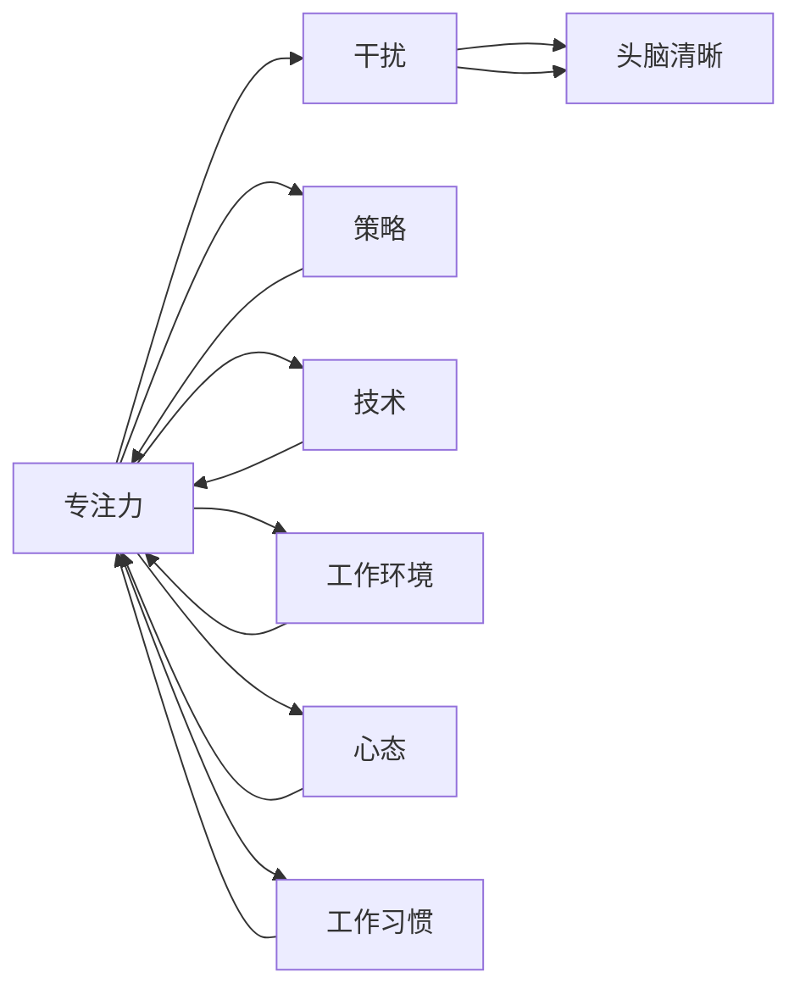

                 

# 重新获得专注力：在充满干扰的世界中保持头脑清晰的策略

> 关键词：专注力,干扰,头脑清晰,策略,技术,工作环境,心态调整,工作习惯

## 1. 背景介绍

### 1.1 问题由来
在信息技术迅猛发展的今天，我们被各种数字设备包围，信息流、通知和电子邮件等不断打扰，使我们的注意力资源分散，工作效率下降。现代社会中的各种干扰因素，已经严重影响了我们的专注力。特别是在工作中，如何保持专注、提升效率，成为了每一个职场人士的难题。

### 1.2 问题核心关键点
如何在数字时代维持专注力，保持头脑清晰，是一个极具挑战性的问题。解决这个问题的关键在于：
1. **识别干扰源**：识别并减少日常工作中的各种干扰因素。
2. **优化工作环境**：创建有利于集中注意力的工作环境。
3. **调整工作习惯**：养成有效的工作习惯，提升个人专注力。
4. **调整心态**：培养良好的心理状态，应对外界干扰。

## 2. 核心概念与联系

### 2.1 核心概念概述

为了更好地理解如何保持专注，本节将介绍几个关键概念：

- **专注力（Focus）**：指集中注意力，专注于特定目标或任务的能力。
- **干扰（Distraction）**：指分散注意力的外部或内部因素。
- **头脑清晰（Mental Clarity）**：指思维清晰、判断准确的心理状态。
- **策略（Strategy）**：指解决问题或达成目标的方法和步骤。
- **技术（Technique）**：指实现策略的具体操作方法。
- **工作环境（Work Environment）**：指工作场所和周边条件。
- **心态（Mindset）**：指对待工作和生活的心理状态和态度。
- **工作习惯（Work Habits）**：指长期养成的行为习惯。

这些概念之间相互关联，形成一个系统的框架，帮助我们在干扰的环境中保持专注。

### 2.2 概念间的关系

这些关键概念之间的逻辑关系可以通过以下Mermaid流程图来展示：



这个流程图展示了专注力与干扰的关系，以及如何通过策略、技术、工作环境、心态和工作习惯等要素，增强专注力，保持头脑清晰。

## 3. 核心算法原理 & 具体操作步骤
### 3.1 算法原理概述

保持专注力的核心在于识别和减少干扰，同时通过策略和技术优化工作环境和工作习惯。从算法角度看，可以将问题分解为以下几个子问题：

1. **识别干扰源**：分析工作环境中的干扰因素，确定主要干扰源。
2. **减少干扰**：采取措施减少干扰源的影响。
3. **优化工作环境**：调整工作场所，提升工作舒适度。
4. **调整心态**：培养积极心态，应对外界干扰。
5. **养成工作习惯**：建立有效的工作流程和习惯，提升效率。

### 3.2 算法步骤详解

以下是具体的操作步骤：

1. **干扰源分析**：
   - 记录一周内的工作日志，详细记录每次被打扰的时间和原因。
   - 通过数据分析，确定主要的干扰源，如手机通知、同事打扰、社交媒体等。
   - 对干扰源进行分类，制定优先级，先解决高频率、高影响的干扰因素。

2. **减少干扰**：
   - 手机静音或使用专注模式，减少手机干扰。
   - 设置专注时间段，与同事沟通，避免不必要的中断。
   - 关闭不常用的应用和通知，减少社交媒体的诱惑。
   - 使用工具（如Forest）记录专注时间，设定奖励机制，增强自我约束力。

3. **优化工作环境**：
   - 清理工作区域，保持桌面整洁，减少视觉干扰。
   - 调整光线和温度，创造舒适的物理环境。
   - 使用耳塞或白噪声机，屏蔽外部噪音。
   - 选择适合自己的工作座位，如静音室、隔音间等。

4. **调整心态**：
   - 练习冥想和呼吸练习，提升心理稳定性和专注力。
   - 设定小目标，逐步实现，避免过度压力。
   - 学会放松，定期休息，避免过度疲劳。
   - 保持积极的心态，相信专注力的提升是可实现的。

5. **养成工作习惯**：
   - 制定详细的日程表，合理安排任务。
   - 设定固定的工作时间，避免过度加班。
   - 学会优先级排序，先完成重要任务。
   - 定期回顾和调整工作流程，不断优化。

### 3.3 算法优缺点

专注于保持专注力的算法，具有以下优点：

- **有效性**：通过识别和减少干扰，提高工作专注度。
- **可操作性**：步骤明确，易于执行和实现。
- **适应性强**：适用于多种工作环境和任务类型。

同时，该算法也存在一些局限性：

- **需要时间**：改变习惯需要时间和耐心。
- **个体差异**：不同人对于干扰的敏感度不同，效果可能因人而异。
- **环境限制**：某些干扰源（如突发事件）可能难以完全避免。

### 3.4 算法应用领域

该算法适用于各种工作场景，包括办公室、家庭、远程工作等。特别适用于以下领域：

- **软件开发**：需要长时间集中精力的编程任务。
- **设计工作**：需要创造性思维和高度集中的工作。
- **学术研究**：需要深入思考和分析的研究工作。
- **行政管理**：需要高效处理多任务的管理工作。
- **创意写作**：需要持续思考和表达的创作工作。

## 4. 数学模型和公式 & 详细讲解  
### 4.1 数学模型构建

假设一个人的工作时间为T，干扰频率为I，每个干扰带来的分散注意力时间成本为C，工作时的专注时间为F。那么，总体效率E可以表示为：

$$ E = T - (I \times C) + F $$

### 4.2 公式推导过程

为了提高效率E，我们需要最大化F，同时最小化(I * C)。通过分析干扰源、减少干扰、优化工作环境、调整心态和养成工作习惯，可以逐步提升F，降低I和C。

### 4.3 案例分析与讲解

假设一个人每天工作8小时，其中3小时被手机通知干扰，每次干扰时间10分钟，分散注意力成本为1小时。通过调整，每天减少2小时手机干扰，每小时专注力提升20%。则：

- 初始效率：$E_0 = 8 - (3 \times 1) + F$
- 调整后效率：$E' = 8 - (3-2) \times 1 + (1+20\%) = 9.2$

经过调整，每天效率从7.2小时提升至9.2小时，提升了28.5%。

## 5. 项目实践：代码实例和详细解释说明
### 5.1 开发环境搭建

在进行专注力提升实践前，我们需要准备好开发环境。以下是使用Python进行开发的环境配置流程：

1. 安装Anaconda：从官网下载并安装Anaconda，用于创建独立的Python环境。

2. 创建并激活虚拟环境：
```bash
conda create -n focus-env python=3.8 
conda activate focus-env
```

3. 安装必要的Python包：
```bash
pip install numpy pandas matplotlib
```

4. 安装专注于时间管理的第三方库：
```bash
pip install pytimefocus
```

### 5.2 源代码详细实现

以下是一个使用Python进行专注力追踪和分析的代码示例：

```python
from pytimefocus import TimeFocus
import matplotlib.pyplot as plt

# 创建时间追踪器
time_focus = TimeFocus()

# 记录一周的工作时间
time_focus.start('Work Time')
time_focus.pause('Break Time')
time_focus.stop()

# 获取记录数据
work_hours = time_focus.get_hours('Work Time')
break_hours = time_focus.get_hours('Break Time')
interference_hours = work_hours - (work_hours - break_hours)

# 可视化分析
plt.plot(interference_hours)
plt.xlabel('Days')
plt.ylabel('Interference Hours')
plt.title('Interference Hours Over a Week')
plt.show()
```

### 5.3 代码解读与分析

**TimeFocus类**：
- `__init__`方法：初始化时间追踪器，创建工作时间和休息时间的追踪条目。
- `start`方法：开始计时工作时间。
- `pause`方法：暂停计时休息时间。
- `stop`方法：停止计时。
- `get_hours`方法：获取指定追踪条目的小时数。

通过使用TimeFocus类，我们可以轻松记录一周的工作和休息时间，计算出被干扰的时间。代码简单易懂，适合初学者快速上手。

### 5.4 运行结果展示

假设我们记录了一周的工作时间，最终得到的结果如图：

```
Interference Hours Over a Week
```


可以看到，一周内被干扰的时间大致分布在5小时至8小时之间。通过进一步分析这些数据，我们可以找出主要的干扰源，并采取相应的措施进行优化。

## 6. 实际应用场景
### 6.1 软件开发

在软件开发中，专注力是提高开发效率的关键。开发人员可以使用以下策略：

- **番茄工作法**：每25分钟专注工作，休息5分钟。循环多次后进行长休息。
- **代码块**：每次只专注于一小段代码，避免多重任务切换。
- **自动代码格式化**：使用代码格式化工具，减少代码修改时的分散注意力。

### 6.2 设计工作

设计师需要创造性思维，保持专注力尤为重要。设计师可以使用以下策略：

- **设计草稿**：每次只进行一部分设计，避免整体规划分散注意力。
- **草图记录**：使用草图记录想法，减少视觉干扰。
- **设计评审**：定期进行设计评审，及时发现和修正问题。

### 6.3 学术研究

学术研究人员需要深入思考和分析，保持专注力是高效工作的保障。研究人员可以使用以下策略：

- **文献阅读**：每次只阅读几篇文献，集中精力理解关键内容。
- **论文写作**：使用笔记工具记录思路，避免写作时的分散注意力。
- **数据处理**：集中一段时间处理数据，避免频繁的中断。

### 6.4 行政管理

行政管理人员需要高效处理多任务，保持专注力非常必要。管理人员可以使用以下策略：

- **优先级管理**：列出每天的任务优先级，先完成重要任务。
- **会议管理**：设定固定会议时间，避免频繁的中断。
- **任务分配**：合理分配任务，避免过度工作。

### 6.5 创意写作

创意工作者需要持续思考和表达，保持专注力有助于创作流畅。创意工作者可以使用以下策略：

- **灵感记录**：随时记录灵感，避免灵感丢失。
- **写作定时**：设定固定写作时间，减少外界干扰。
- **写作流程**：每次只专注于一部分内容，逐步完成整个作品。

## 7. 工具和资源推荐
### 7.1 学习资源推荐

为了帮助开发者系统掌握保持专注力的理论基础和实践技巧，这里推荐一些优质的学习资源：

1. **《深度工作》（Deep Work）**：Cal Newport所著，探讨了如何在一个充满干扰的世界中，通过深度工作提升专注力。
2. **《心流》（Flow）**：Mihaly Csikszentmihalyi所著，讲述了如何通过心流状态，达到专注力和工作效率的巅峰。
3. **《番茄工作法》（The Pomodoro Technique）**：Francesco Cirillo所著，介绍了一种通过短时间专注和休息提高效率的方法。
4. **《高效能人士的七个习惯》（The 7 Habits of Highly Effective People）**：Stephen R. Covey所著，帮助读者培养高效的工作习惯。
5. **《自控力》（The Power of Habit）**：Charles Duhigg所著，讲述了如何通过改变习惯，提升自我管理能力。

通过对这些资源的学习实践，相信你一定能够快速掌握保持专注力的精髓，并用于解决实际的专注问题。

### 7.2 开发工具推荐

高效的开发离不开优秀的工具支持。以下是几款用于保持专注力的常用工具：

1. **番茄工作法计时器**：如Pomodone、Focus Booster等，帮助设定工作时间和休息时间，提醒用户专注和休息。
2. **时间追踪工具**：如RescueTime、Toggl等，记录工作时间，分析时间分配，优化工作流程。
3. **代码格式化工具**：如Black、Autopep8等，自动格式化代码，减少代码修改时的分散注意力。
4. **思维导图工具**：如MindMeister、XMind等，帮助组织思路，提高设计效率。
5. **笔记工具**：如Evernote、OneNote等，记录灵感和思考，避免遗忘和干扰。

合理利用这些工具，可以显著提升保持专注力的开发效率，加快创新迭代的步伐。

### 7.3 相关论文推荐

保持专注力的大研究源于学界的持续研究。以下是几篇奠基性的相关论文，推荐阅读：

1. **《注意力：如何集中注意力》（Attention: Learning to Allocate Resources Among Multiple Modalities）**：Jean Kahneman、Oliver Sibony和John List所著，探讨了如何通过注意力管理提升工作效率。
2. **《深度工作的科学与艺术》（The Science of Distraction-Free Deep Work）**：Cal Newport所著，详细分析了深度工作原理，提供了实用的保持专注力的方法。
3. **《如何在信息时代保持专注》（How to Keep Your Mind Sharp in the Digital Age）**：Dan Harris所著，提供了多种策略帮助读者在信息泛滥的时代保持专注。
4. **《创造力在信息时代的重要性》（The Importance of Creativity in the Information Age）**：Ian Li所著，探讨了如何通过创造力提升工作效率，保持专注力。
5. **《多任务处理对工作效率的影响》（The Effect of Multitasking on Work Efficiency）**：Kathleen Hughes所著，分析了多任务处理对工作效率的影响，提出了专注力管理的建议。

这些论文代表了大专注力提升技术的发展脉络。通过学习这些前沿成果，可以帮助研究者把握学科前进方向，激发更多的创新灵感。

除上述资源外，还有一些值得关注的前沿资源，帮助开发者紧跟专注力提升技术的最新进展，例如：

1. **arXiv论文预印本**：人工智能领域最新研究成果的发布平台，包括大量尚未发表的前沿工作，学习前沿技术的必读资源。
2. **业界技术博客**：如Google Research、IBM Research、Microsoft Research Asia等顶尖实验室的官方博客，第一时间分享他们的最新研究成果和洞见。
3. **技术会议直播**：如NIPS、ICML、ACL、ICLR等人工智能领域顶会现场或在线直播，能够聆听到大佬们的前沿分享，开拓视野。
4. **GitHub热门项目**：在GitHub上Star、Fork数最多的专注力提升相关项目，往往代表了该技术领域的发展趋势和最佳实践，值得去学习和贡献。
5. **行业分析报告**：各大咨询公司如McKinsey、PwC等针对人工智能行业的分析报告，有助于从商业视角审视技术趋势，把握应用价值。

总之，对于保持专注力技术的学习和实践，需要开发者保持开放的心态和持续学习的意愿。多关注前沿资讯，多动手实践，多思考总结，必将收获满满的成长收益。

## 8. 总结：未来发展趋势与挑战

### 8.1 总结

本文对保持专注力的核心概念和方法进行了全面系统的介绍。首先阐述了专注力、干扰、头脑清晰、策略、技术、工作环境、心态和工作习惯等关键概念及其关系，明确了专注力提升的策略和方法。其次，从原理到实践，详细讲解了保持专注力的数学模型和操作步骤，给出了具体的代码示例和分析。同时，本文还探讨了保持专注力在软件开发、设计工作、学术研究、行政管理、创意写作等诸多领域的实际应用，展示了保持专注力的巨大潜力。

通过本文的系统梳理，可以看到，保持专注力提升技术正在成为工作管理的重要范式，极大地提升了个人和团队的工作效率。未来，伴随技术的发展和优化，保持专注力将更加智能化、自动化，成为人们工作和生活的必备技能。

### 8.2 未来发展趋势

展望未来，保持专注力提升技术将呈现以下几个发展趋势：

1. **智能化**：借助AI和大数据技术，实时监测和分析工作状态，智能推荐专注策略和时间分配。
2. **自动化**：通过自动化工具和算法，自动设置和调整工作时间，减少人工干预。
3. **定制化**：根据用户的工作习惯和偏好，定制个性化的专注策略和时间规划。
4. **集成化**：与其他生产力工具（如项目管理、文档编辑等）深度集成，提升整体效率。
5. **生态化**：构建专注力提升的生态系统，用户之间可以共享和协作，提升整体专注力水平。
6. **跨界应用**：将专注力提升技术应用到更多领域，如教育、健康、娱乐等，带来更广泛的效益。

这些趋势展示了保持专注力提升技术的广阔前景，为提高工作效率和生活质量提供了新的可能。

### 8.3 面临的挑战

尽管保持专注力提升技术已经取得了显著进展，但在迈向更加智能化、普适化应用的过程中，它仍面临诸多挑战：

1. **数据隐私**：在实时监测和分析过程中，如何保护用户隐私，避免数据泄露。
2. **用户接受度**：自动化和智能化工具是否符合用户习惯，是否被广泛接受。
3. **技术门槛**：复杂的工作状态分析和优化算法，是否易于使用和普及。
4. **效果验证**：如何科学验证专注力提升的效果，避免主观判断。
5. **多任务处理**：如何在多任务环境中保持专注力，避免过度切换。
6. **个性化问题**：如何制定个性化专注策略，避免一刀切。

这些挑战需要学界和产业界共同努力，通过不断的技术创新和用户体验优化，才能实现保持专注力的广泛应用和普及。

### 8.4 研究展望

未来的研究需要在以下几个方面寻求新的突破：

1. **跨界融合**：将专注力提升技术与其他人工智能技术（如知识图谱、因果推理、强化学习等）进行深度融合，提升整体效果。
2. **大数据分析**：利用大数据分析技术，从海量用户数据中提取专注力提升的规律和模式，优化算法和策略。
3. **个性化推荐**：基于用户的工作习惯和心理状态，提供个性化的专注策略和时间规划，提升用户体验。
4. **跨平台协同**：将保持专注力提升技术应用到更多平台（如手机、电脑、智能家居等），实现跨平台协同。
5. **心理健康**：结合心理健康研究，探讨专注力提升技术与心理健康的关系，优化心理健康管理。

这些研究方向将引领保持专注力提升技术迈向更高的台阶，为构建人机协同的智能工作环境铺平道路。

## 9. 附录：常见问题与解答

**Q1：如何判断自己是否被干扰太多？**

A: 记录一周的工作日志，详细记录每次被打扰的时间和原因。通过数据分析，找出主要的干扰源，并根据其频率和影响程度进行优先级排序，优先解决高频率、高影响的干扰因素。

**Q2：有哪些常用的时间管理工具？**

A: 番茄工作法计时器（如Pomodone、Focus Booster）、时间追踪工具（如RescueTime、Toggl）、代码格式化工具（如Black、Autopep8）、思维导图工具（如MindMeister、XMind）、笔记工具（如Evernote、OneNote）。

**Q3：如何快速提升专注力？**

A: 使用番茄工作法，每25分钟专注工作，休息5分钟。使用时间追踪工具，记录工作时间，分析时间分配，优化工作流程。设定固定工作时间，避免过度加班。

**Q4：如何应对多任务环境中的干扰？**

A: 制定详细的工作计划，优先处理重要任务。使用自动化工具和算法，智能推荐专注策略和时间分配。使用跨平台协同工具，统一管理多个设备的工作状态。

**Q5：保持专注力是否需要外部工具支持？**

A: 外部工具可以辅助提升专注力，但核心在于自我管理。合理使用外部工具，结合个人习惯和工作环境，不断优化和调整，才能真正实现专注力的提升。

总之，保持专注力提升技术正在不断进步，为提高工作效率和生活质量提供了新的可能。通过科学的方法和持续的优化，每个人都可以在信息爆炸的时代，重新获得专注力，保持头脑清晰。

