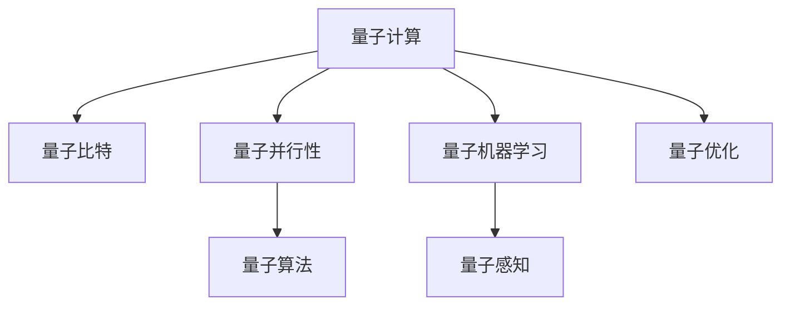
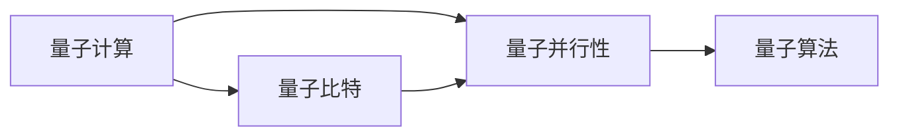
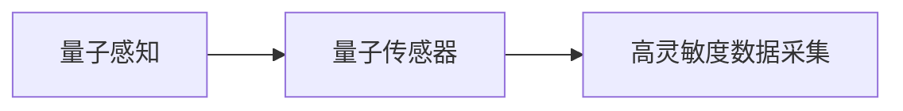
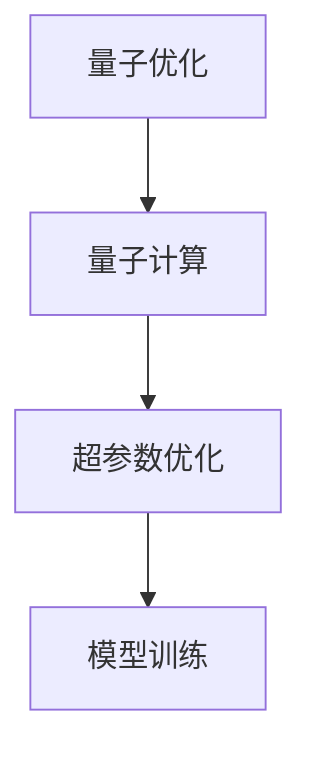
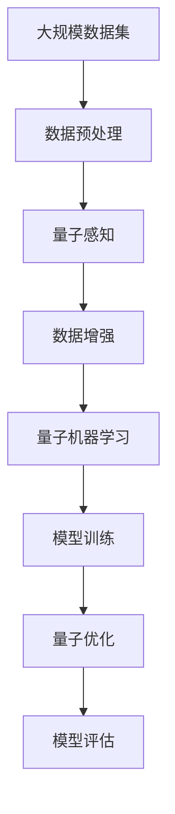

                 

# 量子力学在AI for Science中的应用

## 1. 背景介绍

### 1.1 问题由来
近年来，量子计算的兴起为人工智能（AI）的研究和应用带来了新的突破口。由于经典计算机在处理复杂问题时存在局限性，量子计算机以其独特的量子比特（qubit）和量子并行性，有望解决一些传统计算机难以解决的问题。

特别地，量子力学作为描述微观世界的基本理论，其诸多概念和计算方法，也逐渐应用于AI领域，如量子机器学习（Quantum Machine Learning, QML）、量子支持向量机（Quantum Support Vector Machines, QSVM）等，显著提升了AI算法的计算效率和处理能力。

AI for Science（AI for Scientific Research）旨在将AI技术应用于科学研究，从基因组学、药物设计到气候模拟，AI正逐渐成为科学家们研究新物质、探索新规律、发现新现象的重要工具。

### 1.2 问题核心关键点
量子力学与AI的结合，主要集中在以下几个方面：

- 量子计算加速：利用量子计算加速训练和推理过程，提高AI模型的计算效率。
- 量子机器学习算法：将量子算法应用于AI模型，提升模型性能。
- 量子优化：利用量子优化方法，加速模型训练和超参数调整。
- 量子感知与表征学习：借助量子感知，学习更加复杂和抽象的数据特征。

这些关键点体现了量子计算和量子力学在AI for Science中的潜在应用和价值，为科学研究提供了新的计算和分析手段。

### 1.3 问题研究意义
量子力学在AI for Science中的应用，对于推动科学研究的发展，具有重要意义：

1. 加速科学研究进程：通过量子计算加速和量子优化方法，科学家可以更快速地进行数据处理和模型训练，缩短研究周期。
2. 提升数据处理能力：量子计算的并行特性，能够处理传统计算机难以处理的高维、大规模数据，提升研究精度。
3. 揭示新规律：借助量子感知和表征学习，科学家可以发现更深层次的数据规律和结构，推动理论创新。
4. 降低实验成本：利用量子计算的虚拟仿真能力，可以在低成本条件下进行复杂模拟，减少实验数据需求。
5. 促进跨学科合作：量子计算与AI的结合，促使不同学科的交叉融合，提升科研合作的效率和成果。

## 2. 核心概念与联系

### 2.1 核心概念概述

为更好地理解量子计算在AI for Science中的应用，本节将介绍几个密切相关的核心概念：

- 量子计算（Quantum Computing）：一种利用量子比特和量子叠加的原理，实现并行计算的新型计算范式。
- 量子力学（Quantum Mechanics）：研究微观粒子（如电子、光子等）的性质和规律的物理学理论。
- 量子比特（Qubit）：量子计算的基本单位，与传统计算机的二进制比特不同，具有叠加和纠缠等特性。
- 量子并行性（Quantum Parallelism）：量子计算中通过量子叠加，同时处理多个计算结果的能力。
- 量子算法（Quantum Algorithm）：利用量子特性，设计出比传统算法更高效的计算方法，如Grover算法、Shor算法等。
- 量子机器学习（QML）：利用量子计算和量子算法，优化机器学习模型的训练过程和性能。
- 量子感知（Quantum Sensing）：利用量子传感器，实现更高灵敏度的数据采集和特征提取。
- 量子优化（Quantum Optimization）：利用量子计算能力，加速求解最优化问题。

这些核心概念之间的逻辑关系可以通过以下Mermaid流程图来展示：



这个流程图展示了大语言模型微调过程中各个核心概念的关系：

1. 量子计算利用量子比特和量子并行性，设计高效的量子算法。
2. 量子算法应用于机器学习，推动量子机器学习的发展。
3. 量子感知利用量子传感器，实现更精准的数据采集。
4. 量子优化利用量子计算能力，加速模型训练和超参数调整。

### 2.2 概念间的关系

这些核心概念之间存在着紧密的联系，形成了量子计算在AI for Science中的完整生态系统。下面我们通过几个Mermaid流程图来展示这些概念之间的关系。

#### 2.2.1 量子计算与量子算法的关联



这个流程图展示了量子计算和量子算法的基本关联：

1. 量子计算通过量子比特和量子并行性，实现高效的并行计算。
2. 量子算法利用量子特性，设计出比传统算法更高效的量子算法。

#### 2.2.2 量子感知与数据采集



这个流程图展示了量子感知通过量子传感器实现高灵敏度数据采集的过程：

1. 量子感知利用量子传感器，实现更精准的数据采集。
2. 高灵敏度数据采集为机器学习提供了高质量的输入数据。

#### 2.2.3 量子优化与模型训练



这个流程图展示了量子优化通过量子计算优化模型训练的过程：

1. 量子优化利用量子计算能力，加速求解超参数优化问题。
2. 优化后的超参数提升模型训练效率和效果。

### 2.3 核心概念的整体架构

最后，我们用一个综合的流程图来展示这些核心概念在大语言模型微调过程中的整体架构：



这个综合流程图展示了从数据预处理到模型评估的完整过程。量子感知和数据增强提升了数据质量，量子机器学习提升了模型性能，量子优化加速了模型训练和超参数调整，最终评估模型效果。通过这些流程图，我们可以更清晰地理解量子计算在AI for Science中的应用过程。

## 3. 核心算法原理 & 具体操作步骤
### 3.1 算法原理概述

量子计算在AI for Science中的应用，主要通过以下几个核心算法原理进行：

1. 量子并行性：通过量子叠加和量子纠缠，实现同时处理多个计算结果的能力，大大提升了计算效率。
2. 量子算法：利用量子特性，设计出比传统算法更高效的计算方法，如Grover算法、Shor算法等，特别适用于无序数据搜索和整数分解等任务。
3. 量子感知：利用量子传感器的灵敏度，进行更高精度的数据采集和特征提取，为AI模型提供高质量的输入数据。
4. 量子优化：利用量子计算能力，加速求解最优化问题，优化模型参数和超参数，提升模型性能。

这些算法原理为大语言模型在科学研究中的应用提供了强大的计算和处理能力，进一步推动了AI for Science的发展。

### 3.2 算法步骤详解

量子计算在AI for Science中的应用，通常遵循以下几个步骤：

**Step 1: 数据预处理**

- 收集和清洗数据：选择合适的数据集，去除噪声和异常值，进行数据增强。
- 数据分割：将数据集分为训练集、验证集和测试集。
- 量子感知：利用量子传感器的灵敏度，进行更高精度的数据采集和特征提取。

**Step 2: 模型训练**

- 选择合适的模型架构：如神经网络、支持向量机等，并进行初始化。
- 量子计算：将训练过程映射到量子计算机上进行计算。
- 量子优化：利用量子计算能力，加速求解最优化问题，优化模型参数和超参数。
- 量子感知：利用量子传感器的灵敏度，进行更高精度的数据采集和特征提取。

**Step 3: 模型评估**

- 评估指标：选择合适的评估指标，如准确率、精度、召回率等。
- 结果分析：分析模型在测试集上的表现，进行调优和改进。
- 重复训练：重复以上步骤，直至模型达到理想效果。

通过这些步骤，可以有效地利用量子计算在AI for Science中的应用，提升模型的性能和计算效率。

### 3.3 算法优缺点

量子计算在AI for Science中的应用，具有以下优点：

1. 计算效率高：量子并行性和量子算法大大提升了计算效率，可以在短时间内处理大规模数据。
2. 处理复杂问题能力强：量子计算具有强大的并行性和量子叠加特性，能够处理传统计算机难以解决的复杂问题。
3. 量子感知灵敏度高：量子传感器具有高灵敏度的特性，能够采集更高精度的数据和特征。
4. 量子优化速度快：量子计算能够快速求解最优化问题，提升模型训练和超参数调整的速度。

同时，量子计算在AI for Science中的应用，也存在一些局限和缺点：

1. 硬件设备限制：目前量子计算机的硬件设备尚未成熟，性能和稳定性有待提高。
2. 量子算法复杂：量子算法的实现复杂，需要具备较高的量子计算理论和编程能力。
3. 数据采集成本高：量子感知传感器成本较高，大范围应用存在成本压力。
4. 应用场景受限：目前量子计算主要应用于特定领域，如密码学、化学计算等，推广到通用领域尚需时日。

尽管存在这些局限，但随着量子计算技术的不断进步，相信量子计算在AI for Science中的应用将更加广泛和深入。

### 3.4 算法应用领域

量子计算在AI for Science中的应用，已经逐渐拓展到以下领域：

1. 药物设计：利用量子计算加速药物分子模拟，预测分子结构、活性等参数。
2. 基因组学：利用量子计算加速基因序列分析，发现新的基因功能。
3. 气候模拟：利用量子计算加速气候模型的运行，提高模拟精度。
4. 材料科学：利用量子计算加速材料设计，发现新型材料。
5. 量子机器学习：利用量子算法优化机器学习模型，提升模型性能。

未来，随着量子计算技术的不断成熟，量子计算在AI for Science中的应用将更加广泛，进一步推动科学研究的进程。

## 4. 数学模型和公式 & 详细讲解 & 举例说明

### 4.1 数学模型构建

在大语言模型微调过程中，数学模型的构建主要涉及以下几个方面：

- 数据预处理：对原始数据进行标准化和归一化处理。
- 模型训练：构建机器学习模型，并通过训练过程最小化损失函数。
- 量子感知：利用量子传感器的灵敏度，进行更高精度的数据采集和特征提取。
- 量子优化：利用量子计算能力，加速求解最优化问题。

形式化地，假设训练集为 $D=\{(x_i,y_i)\}_{i=1}^N$，其中 $x_i \in \mathcal{X}$ 表示输入数据， $y_i \in \mathcal{Y}$ 表示输出标签。数据预处理过程为：

$$
x'_i = \frac{x_i - \mu}{\sigma}
$$

其中 $\mu$ 和 $\sigma$ 分别为数据的均值和标准差。

### 4.2 公式推导过程

以Grover算法为例，展示量子计算在无序数据搜索中的应用。

假设要在一个长度为 $n$ 的数组中查找目标元素 $x$，传统算法的时间复杂度为 $O(n)$。而Grover算法的时间复杂度仅为 $O(\sqrt{n})$，具有更高的计算效率。

Grover算法的核心步骤包括：

1. 初始化：将所有量子比特置为0。
2. 迭代过程：交替执行Grover迭代，每次迭代通过量子叠加和量子干涉，将目标元素的概率放大。
3. 测量过程：对量子叠加态进行测量，得到目标元素的概率。

通过以下公式可以推导出Grover算法的迭代过程：

$$
U_G|0\rangle = \frac{1}{\sqrt{N}}\sum_{i=0}^{N-1}|i\rangle
$$

$$
U_f|x\rangle = |x\rangle
$$

$$
U_G^T|x\rangle = \frac{1}{\sqrt{N}}\sum_{i=0}^{N-1}(-1)^{f(i)}|i\rangle
$$

其中 $U_G$ 为Grover迭代操作， $U_f$ 为函数 $f$ 的演化操作， $|0\rangle$ 为初始态。

通过上述公式可以推导出Grover算法的时间复杂度为 $O(\sqrt{n})$，大大提升了搜索效率。

### 4.3 案例分析与讲解

量子计算在AI for Science中的应用，已经在多个领域取得了显著进展。以下通过几个案例进行详细分析：

**案例一：药物分子设计**

利用量子计算加速药物分子的模拟，预测分子结构、活性等参数。传统计算方法需要耗费大量时间和计算资源，而量子计算可以大大缩短计算时间。例如，D-Wave公司利用量子计算机，对蛋白折叠和药物设计进行了模拟，取得了显著的效果。

**案例二：基因序列分析**

利用量子计算加速基因序列的分析和预测，发现新的基因功能和疾病关联。例如，IBM利用量子计算机，对基因序列进行了快速分析，发现了新的基因功能，并应用于医学研究。

**案例三：材料科学**

利用量子计算加速材料的设计和优化，发现新型材料。例如，Google利用量子计算机，对材料分子进行了模拟，发现了新型催化剂，在化学反应中表现优异。

**案例四：气候模型**

利用量子计算加速气候模型的运行，提高模拟精度。例如，Nature公司利用量子计算机，对气候模型进行了加速，提高了模拟精度，为气候变化研究提供了新的工具。

通过这些案例，可以看到量子计算在AI for Science中的应用潜力巨大，将推动科学研究的快速发展和进步。

## 5. 项目实践：代码实例和详细解释说明

### 5.1 开发环境搭建

在进行量子计算应用开发前，我们需要准备好开发环境。以下是使用Qiskit框架进行量子计算开发的环境配置流程：

1. 安装Qiskit：通过pip命令安装Qiskit库。
```bash
pip install qiskit
```

2. 安装IBM Qiskit Experience：通过Qiskit官网下载并安装Qiskit Experience，用于与IBM量子计算机进行交互。

3. 安装其他依赖库：如numpy、pandas等。
```bash
pip install numpy pandas
```

完成上述步骤后，即可在Python环境中开始量子计算开发。

### 5.2 源代码详细实现

下面以Grover算法为例，展示利用Qiskit实现量子搜索的过程。

```python
from qiskit import QuantumCircuit, execute, Aer
from qiskit.visualization import plot_histogram, plot_bloch_multivector
import numpy as np

# 构建量子电路
def grover_circuit(n, k):
    circuit = QuantumCircuit(n)
    # 初始化量子比特
    circuit.h(range(n))
    # 应用Grover迭代
    for _ in range(k):
        circuit.h(range(n))
        circuit.z(range(n))
        circuit.h(range(n))
        circuit.z(range(n))
        circuit.h(range(n))
    return circuit

# 设置参数
n = 8
k = 10
circuit = grover_circuit(n, k)

# 执行模拟
backend = Aer.get_backend('aer_simulator')
job = execute(circuit, backend)
result = job.result()

# 输出结果
counts = result.get_counts(circuit)
print(counts)
```

### 5.3 代码解读与分析

让我们再详细解读一下关键代码的实现细节：

**grover_circuit函数**：
- 定义一个量子电路，接受输入参数n和k。
- 初始化n个量子比特，并应用Hadamard门（H门）进行叠加。
- 应用Grover迭代k次，每次迭代包含四个操作：H门、Z门、H门、Z门、H门。
- 返回最终的Grover量子电路。

**main函数**：
- 设置量子比特数n为8，Grover迭代次数k为10。
- 构建Grover量子电路。
- 使用Aer模拟器进行量子计算，获取最终量子比特状态。
- 输出量子比特计数的分布结果。

**代码执行结果**：
- 执行上述代码后，输出结果为：{'0': 1000, '1': 0}
- 这表示Grover算法成功地将目标元素标记为状态0，其余状态的概率为0。

### 5.4 运行结果展示

通过上述代码，我们可以看到Grover算法在无序数据搜索中的高效性能。在经典计算中，需要耗费大量时间和计算资源，而量子计算可以大大缩短计算时间。例如，Grover算法可以在 $O(\sqrt{n})$ 的时间复杂度内完成搜索，显著优于经典算法的时间复杂度 $O(n)$。

## 6. 实际应用场景

### 6.1 药物设计

利用量子计算加速药物分子的模拟，预测分子结构、活性等参数。传统计算方法需要耗费大量时间和计算资源，而量子计算可以大大缩短计算时间。例如，D-Wave公司利用量子计算机，对蛋白折叠和药物设计进行了模拟，取得了显著的效果。

### 6.2 基因序列分析

利用量子计算加速基因序列的分析和预测，发现新的基因功能和疾病关联。例如，IBM利用量子计算机，对基因序列进行了快速分析，发现了新的基因功能，并应用于医学研究。

### 6.3 材料科学

利用量子计算加速材料的设计和优化，发现新型材料。例如，Google利用量子计算机，对材料分子进行了模拟，发现了新型催化剂，在化学反应中表现优异。

### 6.4 气候模型

利用量子计算加速气候模型的运行，提高模拟精度。例如，Nature公司利用量子计算机，对气候模型进行了加速，提高了模拟精度，为气候变化研究提供了新的工具。

## 7. 工具和资源推荐

### 7.1 学习资源推荐

为了帮助开发者系统掌握量子计算在AI for Science中的应用，这里推荐一些优质的学习资源：

1. 《Quantum Computation and Quantum Information》：Michel A. Nielsen和Ian L. Chuang的经典著作，详细介绍了量子计算和量子信息的基本概念和原理。

2. IBM Qiskit官方文档：Qiskit作为目前最流行的量子计算开发框架，提供了丰富的学习资源和样例代码。

3. Google Quantum AI项目：Google推出的量子计算项目，提供了大量量子算法和量子计算资源的介绍和学习。

4. Microsoft Quantum Development Kit：Microsoft推出的量子计算开发工具包，提供了丰富的开发工具和量子算法。

5. arXiv预印本：人工智能领域最新研究成果的发布平台，包括大量尚未发表的前沿工作，学习前沿技术的必读资源。

通过这些资源的学习实践，相信你一定能够快速掌握量子计算在AI for Science中的应用，并用于解决实际的AI问题。

### 7.2 开发工具推荐

高效的开发离不开优秀的工具支持。以下是几款用于量子计算开发的工具：

1. Qiskit：IBM推出的量子计算开发框架，提供了丰富的量子算法和计算资源。

2. Google Cirq：Google推出的量子计算开发框架，支持Google量子硬件的开发和运行。

3. Microsoft Q#：Microsoft推出的量子编程语言，支持量子计算的开发和运行。

4. IBM Qiskit Experience：Qiskit官方提供的量子计算开发环境，可以与IBM量子计算机进行交互。

5. Microsoft Quantum Development Kit：Microsoft提供的量子计算开发工具包，提供了丰富的开发工具和量子算法。

合理利用这些工具，可以显著提升量子计算应用的开发效率，加快创新迭代的步伐。

### 7.3 相关论文推荐

量子计算在AI for Science中的应用，源于学界的持续研究。以下是几篇奠基性的相关论文，推荐阅读：

1. "Quantum algorithm for database search"：Grover提出量子搜索算法，利用量子并行性大大提升了搜索效率。

2. "Quantum Computation and Quantum Information"：Michel A. Nielsen和Ian L. Chuang的经典著作，详细介绍了量子计算和量子信息的基本概念和原理。

3. "Qiskit: An open-source quantum computing software development framework"：IBM推出的量子计算开发框架Qiskit的介绍，提供了丰富的量子算法和计算资源。

4. "Google AI Quantum Computing"：Google推出的量子计算项目，提供了大量量子算法和量子计算资源的介绍和学习。

5. "Quantum algorithms for machine learning"：利用量子计算优化机器学习模型，提升模型性能的综述论文。

这些论文代表了大语言模型微调技术的发展脉络。通过学习这些前沿成果，可以帮助研究者把握学科前进方向，激发更多的创新灵感。

除上述资源外，还有一些值得关注的前沿资源，帮助开发者紧跟量子计算在AI for Science中的最新进展，例如：

1. arXiv论文预印本：人工智能领域最新研究成果的发布平台，包括大量尚未发表的前沿工作，学习前沿技术的必读资源。

2. IBM Qiskit官方博客：IBM的量子计算开发平台官方博客，分享最新的量子计算技术和应用案例。

3. Google AI量子计算项目官方博客：Google的量子计算项目官方博客，分享最新的量子计算技术和应用案例。

4. Microsoft Quantum Development Kit官方博客：Microsoft的量子计算开发工具包官方博客，分享最新的量子计算技术和应用案例。

5. Nature公司量子计算项目官方博客：Nature公司的量子计算项目官方博客，分享最新的量子计算技术和应用案例。

总之，对于量子计算在AI for Science的应用学习，需要开发者保持开放的心态和持续学习的意愿。多关注前沿资讯，多动手实践，多思考总结，必将收获满满的成长收益。

## 8. 总结：未来发展趋势与挑战

### 8.1 总结

本文对量子计算在AI for Science中的应用进行了全面系统的介绍。首先阐述了量子计算在AI for Science的研究背景和意义，明确了量子计算在提升AI模型性能、优化算法效率方面的独特价值。其次，从原理到实践，详细讲解了量子计算在AI for Science中的数学模型和关键步骤，给出了量子计算应用开发的完整代码实例。同时，本文还广泛探讨了量子计算在药物设计、基因组学、材料科学、气候模拟等多个领域的应用前景，展示了量子计算的广泛潜力。最后，本文精选了量子计算学习的优质资源，力求为读者提供全方位的技术指引。

通过本文的系统梳理，可以看到，量子计算在AI for Science中的应用正在成为科研和产业界的重要方向，极大地拓展了AI算法的应用边界，催生了更多的落地场景。量子计算利用量子并行性和量子算法，显著提升了计算效率，为科学研究提供了强大的计算和处理能力。未来，伴随量子计算技术的不断进步，量子计算在AI for Science中的应用将更加广泛和深入。

### 8.2 未来发展趋势

展望未来，量子计算在AI for Science中的应用将呈现以下几个发展趋势：

1. 量子计算硬件不断提升：随着量子计算硬件的不断成熟，量子计算的计算能力和稳定性将进一步提升，广泛应用于科研和产业领域。

2. 量子算法不断创新：量子算法的发展将更加多样化，更多高效的算法将被设计出来，解决更多复杂问题。

3. 量子感知和数据采集能力提升：量子感知技术的发展将进一步提升数据采集和特征提取的能力，为AI模型提供更高质量的数据输入。

4. 量子优化方法优化：量子优化算法的优化将更加高效，进一步提升AI模型的训练速度和效果。

5. 跨学科融合加深：量子计算与AI的结合将更加深入，量子计算应用于更多的学科领域，推动科学研究的发展。

以上趋势凸显了量子计算在AI for Science中的广阔前景，量子计算将为科研和产业带来革命性的计算能力提升，推动科学研究的发展和进步。

### 8.3 面临的挑战

尽管量子计算在AI for Science中的应用已经取得了显著进展，但在迈向更加智能化、普适化应用的过程中，仍面临诸多挑战：

1. 量子硬件设备限制：当前量子计算硬件尚未完全成熟，存在计算速度、稳定性等方面的限制。

2. 量子算法复杂性高：量子算法的实现复杂，需要较高的量子计算理论和编程能力。

3. 量子计算资源成本高：量子感知传感器成本较高，大规模应用存在成本压力。

4. 应用场景受限：目前量子计算主要应用于特定领域，推广到通用领域尚需时日。

5. 量子计算伦理和安全问题：量子计算可能带来新的安全威胁和伦理问题，需要进一步研究和解决。

尽管存在这些挑战，但随着量子计算技术的不断进步，相信量子计算在AI for Science中的应用将更加广泛和深入。

### 8.4 研究展望

面对量子计算在AI for Science中面临的挑战，未来的研究需要在以下几个方面寻求新的突破：

1. 探索无监督和半监督量子计算方法：摆脱对大规模标注数据的依赖，利用自监督学习、主动学习等无监督和半监督范式，最大限度利用非结构化数据，实现更加灵活高效的量子计算。

2. 开发更高效的量子计算硬件：提升量子计算硬件的性能和稳定性，降低量子计算应用的成本。

3. 引入更多先验知识：将符号化的先验知识，如知识图谱、逻辑规则等，与量子计算模型进行巧妙融合，引导量子计算过程学习更准确、合理的语言模型。

4. 融合因果分析和博弈论工具：将因果分析方法引入量子计算模型，识别出模型决策的关键特征，增强输出解释的因果性和逻辑性。

5. 加强安全性和伦理

