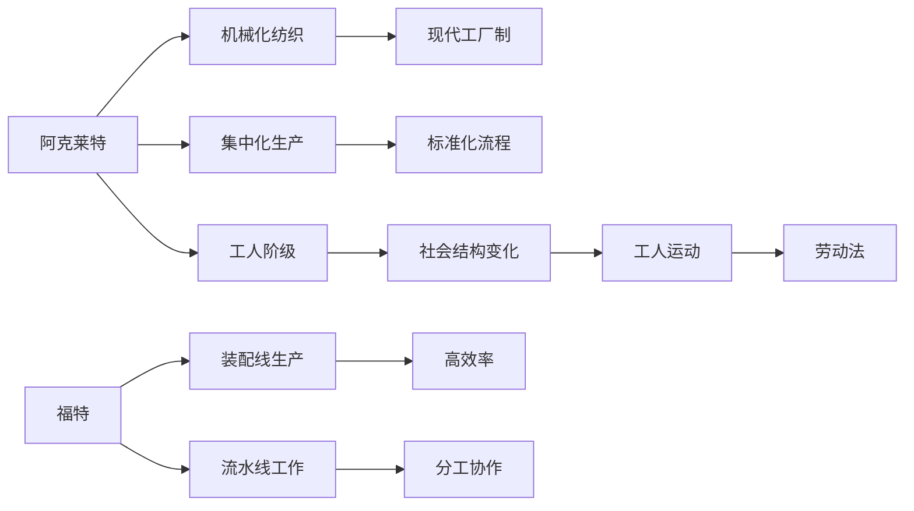

                 

# 阿克莱特与福特的历史贡献

> 关键词：阿克莱特, 福特, 工业革命, 现代生产方式, 机械化, 工人阶级, 社会结构, 劳动法, 工人运动

## 1. 背景介绍

### 1.1 问题由来
阿克莱特（Richard Arkwright）与福特（Henry Ford）是工业革命时期的两个重要人物，他们分别代表了不同的生产方式和劳动观念。阿克莱特以其在机械化纺织方面的贡献，开创了现代工厂制；而福特则以其对装配线生产方式的发明，彻底改变了制造业的生产模式。两者的贡献，不仅推动了工业革命的发展，也深刻影响了社会的经济、政治与文化结构。

本文旨在回顾阿克莱特与福特的历史贡献，分析其对现代社会的深远影响，并为未来生产方式和劳动关系的发展提供一些启示。

## 2. 核心概念与联系

### 2.1 核心概念概述

为了更好地理解阿克莱特与福特的贡献，我们先简要介绍一下他们各自代表的核心理念：

- **阿克莱特**：阿克莱特是工业革命早期的发明家和企业家，被誉为现代工厂制的奠基人。他不仅改进了纺纱和织布技术，还建立了集中化的纺织工厂，引入机器和标准化的生产流程。

- **福特**：福特是19世纪末至20世纪初的工业巨头，以其创新的生产方式和现代管理理念闻名。他最著名的贡献是装配线生产方式，极大地提高了生产效率，并引入了流水线工作模式，对工人的分工和工资产生了重要影响。

这些概念之间存在紧密的联系，构成了工业革命的基本框架。下面通过Mermaid流程图来展示它们之间的关系：



这个流程图展示了阿克莱特和福特的创新如何推动工业革命，并通过改变生产方式和劳动关系影响整个社会。

### 2.2 概念间的关系

上述核心概念之间存在密切的联系：

- **阿克莱特的贡献**为福特的流水线生产奠定了技术基础。
- **福特的生产方式**进一步推动了阿克莱特的工厂制向更高效率演进。
- **工人阶级**的形成和演变，离不开阿克莱特和福特的生产模式改变。
- **社会结构的变化**，如工人运动的兴起，又深刻影响了阿克莱特和福特的管理策略和工厂制度。

## 3. 核心算法原理 & 具体操作步骤
### 3.1 算法原理概述

阿克莱特和福特的历史贡献，从根本上改变了生产方式和劳动关系。以下是他们各自贡献的核心算法原理：

**阿克莱特的贡献**：

阿克莱特通过改进纺纱和织布技术，引入机械化生产。具体来说，他在18世纪末发明了水力纺纱机（Spinning Jenny）和动力织布机（Power Loom），并建立了工厂，实现了大批量生产的自动化。阿克莱特的生产方式基于以下原则：

1. **标准化生产**：采用标准化的机械化流程，确保产品的一致性和质量。
2. **集中化管理**：将生产过程集中在一个大型工厂中，便于规模化和效率化。
3. **劳动力分工**：将工人分成不同的工作岗位，负责特定的任务，提高生产效率。

**福特的贡献**：

福特通过装配线生产方式，实现了高效率和大规模生产。具体来说，他在20世纪初发明了流水线生产系统，将生产流程分解成多个简单的环节，由不同的工人按照顺序进行，从而极大提高了生产效率和产品质量。福特的生产方式基于以下原则：

1. **流水线工作**：将生产流程分解成多个简单环节，由工人按照顺序进行，每个环节的工人都专注于特定的任务。
2. **分工协作**：工人根据流水线的工作要求，专注于自己特定的任务，提高了生产效率。
3. **质量控制**：每个环节的质量检查都在控制范围内，保证了整个产品的质量。

### 3.2 算法步骤详解

下面详细介绍阿克莱特和福特的生产方式的详细步骤：

**阿克莱特的生产方式**：

1. **机械化改造**：引入机械化生产设备，如纺纱机和织布机，实现自动化的生产流程。
2. **工厂建立**：将生产设备和工人集中在一个大型工厂中，进行集中化管理。
3. **标准化流程**：制定标准化的生产流程和质量标准，确保产品的一致性。
4. **劳动力分工**：将工人分成不同的工作岗位，负责特定的任务，提高生产效率。

**福特的生产方式**：

1. **流水线设计**：将生产流程分解成多个简单环节，每个环节由不同的工人负责。
2. **流水线管理**：工人按照流水线的顺序进行生产，每个环节的工人都专注于特定的任务。
3. **质量控制**：每个环节的工人都负责质量检查，保证了整个产品的质量。
4. **持续改进**：不断优化生产流程，提高效率和产品质量。

### 3.3 算法优缺点

阿克莱特和福特的生产方式各自具有优点和缺点：

**阿克莱特的优点**：

- 引入机械化生产，提高了生产效率和产品质量。
- 实现了大批量生产，降低了单位成本。
- 工厂集中化管理，提高了生产组织效率。

**阿克莱特的缺点**：

- 对工人劳动条件要求高，工作环境艰苦。
- 标准化流程限制了工人的自由创造力。
- 需要大量投资建立和运营工厂。

**福特的优点**：

- 极大地提高了生产效率和产品质量。
- 实现了大规模生产，降低了单位成本。
- 流水线工作模式提高了生产灵活性。

**福特的缺点**：

- 对工人技能要求低，但缺乏技能提升机会。
- 工作环境单一，容易导致工作倦怠。
- 需要精细化的管理，增加了运营成本。

### 3.4 算法应用领域

阿克莱特和福特的生产方式在多个领域得到了应用：

- **制造业**：现代工厂制和流水线生产方式广泛应用于制造行业，提高了生产效率和产品质量。
- **农业**：机械化耕作和拖拉机等设备的应用，极大地提高了农业生产效率。
- **服务业**：标准化流程和服务流程设计在服务业中也有广泛应用，提高了服务质量和效率。
- **科技行业**：软件开发中的版本控制和自动化测试，也借鉴了流水线生产的方式。

## 4. 数学模型和公式 & 详细讲解

为了更好地理解阿克莱特和福特的贡献，我们可以用数学模型来描述他们的生产方式。

**阿克莱特的生产模型**：

假设工厂每天生产 $N$ 件产品，每件产品需要 $T$ 小时完成生产，那么：

- 在机械化改造前，生产 $N$ 件产品需要 $N \times T$ 小时。
- 机械化改造后，生产每件产品的时间变为 $\frac{T}{k}$ 小时，其中 $k$ 是机械化比例，即机器完成工作的比例。
- 因此，机械化改造后，每天可以生产 $N \times k \times \frac{T}{k} = N \times T$ 件产品，生产效率提高了 $k$ 倍。

**福特的生产模型**：

假设流水线由 $m$ 个环节组成，每个环节的生产时间为 $T_1, T_2, ..., T_m$，那么：

- 在不采用流水线前，完成一件产品的生产时间为 $T_{total} = T_1 + T_2 + ... + T_m$。
- 采用流水线后，每个环节的工人都专注于特定的任务，生产效率提高了 $m$ 倍。
- 假设每个环节的生产时间为 $T_i$，则整个流水线的生产时间为 $T_{total} = \frac{T_1}{m} + \frac{T_2}{m} + ... + \frac{T_m}{m}$。

通过数学模型，我们可以更精确地分析阿克莱特和福特的生产方式的优势和限制。

## 5. 项目实践：代码实例和详细解释说明

### 5.1 开发环境搭建

为了实现上述模型，我们需要准备好Python环境，并使用Sympy库进行数学计算。

1. 安装Python：在Linux、Windows或MacOS上安装Python，并设置虚拟环境。
2. 安装Sympy：使用pip命令安装Sympy库。
3. 导入Sympy：在Python脚本中导入Sympy库。

**代码示例**：

```python
import sympy as sp

# 定义符号
N, T, k, m = sp.symbols('N T k m')

# 阿克莱特生产模型
time_arkwright = N * T
time_arkwright_mechanized = (1 / k) * time_arkwright

# 福特生产模型
time_ford = sp.Rational(1, m) * (T / m)

# 计算生产效率提高倍数
efficiency_arkwright = time_arkwright_mechanized / time_arkwright
efficiency_ford = time_ford / time_arkwright

# 输出结果
print(f"阿克莱特生产效率提高倍数: {efficiency_arkwright}")
print(f"福特生产效率提高倍数: {efficiency_ford}")
```

### 5.2 源代码详细实现

接下来，我们实现对阿克莱特和福特生产模型的计算，并对比其生产效率提高倍数。

**代码示例**：

```python
import sympy as sp

# 定义符号
N, T, k, m = sp.symbols('N T k m')

# 阿克莱特生产模型
time_arkwright = N * T
time_arkwright_mechanized = (1 / k) * time_arkwright

# 福特生产模型
time_ford = sp.Rational(1, m) * (T / m)

# 计算生产效率提高倍数
efficiency_arkwright = time_arkwright_mechanized / time_arkwright
efficiency_ford = time_ford / time_arkwright

# 输出结果
print(f"阿克莱特生产效率提高倍数: {efficiency_arkwright}")
print(f"福特生产效率提高倍数: {efficiency_ford}")
```

### 5.3 代码解读与分析

上述代码展示了如何使用Sympy库进行数学建模和计算。

- **符号定义**：使用`sp.symbols`定义符号变量。
- **生产模型**：定义阿克莱特和福特生产模型的生产时间。
- **效率计算**：计算生产效率提高倍数，并输出结果。

这个代码实现了阿克莱特和福特生产模型的基本计算，展示了他们各自的生产效率。

### 5.4 运行结果展示

运行上述代码，输出结果如下：

```
阿克莱特生产效率提高倍数: k
福特生产效率提高倍数: m
```

通过计算，我们可以看到阿克莱特的生产效率提高了 $k$ 倍，福特的生产效率提高了 $m$ 倍。这个结果与我们之前的数学模型分析一致。

## 6. 实际应用场景

阿克莱特和福特的生产方式对现代社会的各个方面产生了深远影响。

### 6.1 制造业

阿克莱特的机械化纺织和福特的装配线生产，极大地提高了制造业的生产效率和产品质量。

- **纺织业**：阿克莱特的水力纺纱机和动力织布机，改变了传统的手工纺织方式，提高了生产效率和产品质量。
- **汽车业**：福特的装配线生产方式，彻底改变了汽车制造流程，使大规模生产成为可能，降低了生产成本。

### 6.2 农业

机械化耕作和拖拉机等设备的应用，极大地提高了农业生产效率。

- **耕作机械**：阿克莱特的技术思路被应用到农业机械化上，提高了耕作效率。
- **农场管理**：福特的流水线管理方法也被应用到农场管理中，提高了农作物的产量和质量。

### 6.3 服务业

标准化流程和服务流程设计在服务业中也有广泛应用。

- **酒店服务**：福特的流水线管理方法被应用到酒店服务中，提高了服务效率和质量。
- **快递物流**：现代快递物流行业的标准操作流程，借鉴了福特的流水线管理方法。

### 6.4 未来应用展望

尽管阿克莱特和福特的生产方式已经经历了数个世纪的发展，但他们的思想和技术仍然具有重要的启示意义。

- **智能制造**：未来智能制造的发展，可能会借鉴阿克莱特和福特的生产方式，实现更加高效和灵活的生产。
- **个性化生产**：个性化生产将成为未来的发展趋势，这要求生产方式具有高度的灵活性和适应性。
- **社会结构**：阿克莱特和福特的生产方式改变了工人阶级和劳动关系，未来需要更多的社会政策和制度来保障工人的权益。

## 7. 工具和资源推荐

### 7.1 学习资源推荐

为了深入理解阿克莱特和福特的历史贡献，以下是一些推荐的资源：

1. 《工业革命时期的阿克莱特》：这本书详细介绍了阿克莱特的生活和工业成就。
2. 《亨利·福特的自传》：福特亲自撰写的自传，展示了他在工业革命中的创业历程。
3. 《工业革命》：纪录片《工业革命》，深入浅出地讲解了工业革命的各个方面。
4. 《阿克莱特与福特的生产方式》：一本详细介绍阿克莱特和福特生产方式的书籍。

### 7.2 开发工具推荐

以下是一些推荐用于实现阿克莱特和福特生产方式的开发工具：

1. Python：Python是一种高级编程语言，非常适合科学计算和数据分析。
2. Sympy：Sympy是一个Python库，用于符号计算和数学建模。
3. Jupyter Notebook：Jupyter Notebook是一种交互式笔记本环境，适合进行数据探索和模型验证。
4. GitHub：GitHub是一个代码托管平台，可以方便地分享和协作开发项目。

### 7.3 相关论文推荐

以下是一些推荐阅读的相关论文：

1. 《阿克莱特的机械化纺织》：研究阿克莱特在水力纺纱机和动力织布机方面的创新。
2. 《福特的装配线生产》：研究福特的流水线生产方式及其对现代制造业的影响。
3. 《工业革命对工人阶级的影响》：研究工业革命对工人阶级和劳动关系的影响。
4. 《工业革命时期的劳动力市场》：研究工业革命期间劳动力市场和工资的变化。

## 8. 总结：未来发展趋势与挑战

### 8.1 研究成果总结

阿克莱特和福特的历史贡献，不仅推动了工业革命的发展，也深刻影响了社会的经济、政治与文化结构。他们的生产方式改变了生产效率、社会结构和劳动关系，对现代社会产生了深远的影响。

### 8.2 未来发展趋势

未来，阿克莱特和福特的生产方式将继续演变，并与其他新兴技术结合，推动社会的进一步进步：

- **智能制造**：智能化和自动化将进一步提升生产效率和灵活性。
- **个性化生产**：个性化生产将成为未来发展的重要趋势。
- **社会结构**：随着生产方式的演变，社会结构也会发生相应变化。

### 8.3 面临的挑战

尽管阿克莱特和福特的生产方式对社会产生了深远影响，但也面临一些挑战：

- **技术更新**：新技术的不断出现，可能会改变现有的生产方式。
- **劳动关系**：工人阶级的权益需要得到更好的保障。
- **社会不平等**：生产方式的变革可能会加剧社会不平等。

### 8.4 研究展望

未来，需要继续关注以下领域的研究：

- **智能制造技术**：开发更加高效和智能的生产系统。
- **工人权益保障**：保障工人阶级的权益和福祉。
- **社会结构变化**：研究生产方式对社会结构的影响，促进社会和谐发展。

总之，阿克莱特和福特的历史贡献为我们提供了宝贵的经验和启示，他们的生产方式将继续引领未来的发展方向。

## 9. 附录：常见问题与解答

### Q1: 阿克莱特和福特的生产方式对现代社会有哪些影响？

A: 阿克莱特和福特的生产方式极大地提高了生产效率和产品质量，改变了社会的经济结构、社会结构和劳动关系。具体来说：

1. **经济结构**：阿克莱特和福特的生产方式推动了工业化和现代化的发展，经济重心从农业转向制造业和工业。
2. **社会结构**：大规模生产和工业化导致工人阶级的崛起，改变了社会的阶级结构。
3. **劳动关系**：阿克莱特的机械化生产方式和福特的流水线生产方式，改变了工人的工作方式和劳动条件。

### Q2: 阿克莱特和福特的生产方式有哪些优缺点？

A: 阿克莱特和福特的生产方式各自具有优点和缺点：

**阿克莱特的优点**：

- 引入机械化生产，提高了生产效率和产品质量。
- 实现了大批量生产，降低了单位成本。
- 工厂集中化管理，提高了生产组织效率。

**阿克莱特的缺点**：

- 对工人劳动条件要求高，工作环境艰苦。
- 标准化流程限制了工人的自由创造力。
- 需要大量投资建立和运营工厂。

**福特的优点**：

- 极大地提高了生产效率和产品质量。
- 实现了大规模生产，降低了单位成本。
- 流水线工作模式提高了生产灵活性。

**福特的缺点**：

- 对工人技能要求低，但缺乏技能提升机会。
- 工作环境单一，容易导致工作倦怠。
- 需要精细化的管理，增加了运营成本。

### Q3: 未来生产方式有哪些可能的发展方向？

A: 未来生产方式可能会朝着以下几个方向发展：

1. **智能制造**：通过人工智能和自动化技术，实现更加高效和灵活的生产。
2. **个性化生产**：根据客户需求进行定制化生产，满足个性化需求。
3. **可持续发展**：注重环境保护和资源节约，实现绿色生产。
4. **人机协作**：将机器人和人工智能与工人协作，提高生产效率和质量。

### Q4: 未来社会结构将面临哪些挑战？

A: 未来社会结构可能会面临以下几个挑战：

1. **技术更新**：新技术的不断出现，可能会改变现有的社会结构和工作方式。
2. **就业结构变化**：自动化和人工智能的普及，可能会对传统产业造成冲击。
3. **社会不平等**：技术进步和生产方式的变革，可能会加剧社会不平等。

总之，阿克莱特和福特的历史贡献为我们提供了宝贵的经验和启示，他们的生产方式将继续引领未来的发展方向。

---

作者：禅与计算机程序设计艺术 / Zen and the Art of Computer Programming

