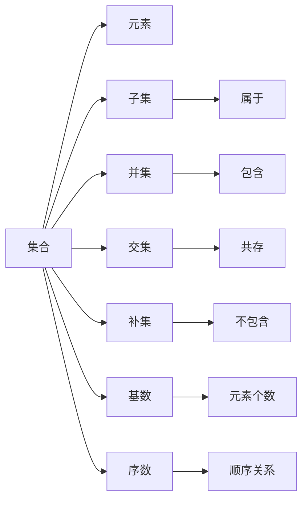

                 

# 集合论导引：集合论上依定义扩充

## 1. 背景介绍

集合论是数学中的一个基础学科，研究集合、元素、子集、交集、并集、补集、基数、序数等概念和运算。在计算机科学中，集合论作为数据结构、算法、语言理论等领域的基石，有着广泛的应用。本文将介绍集合论的基本概念及其上依定义的扩充，探讨其原理、步骤、优缺点和应用领域，并给出相关的数学模型和公式，以及项目实践和实际应用场景。

## 2. 核心概念与联系

### 2.1 核心概念概述

- **集合（Set）**：由若干元素组成的整体。集合内的元素具有互异性，即相同的元素只计算一次。
- **元素（Element）**：集合中的基本单位，可以是数字、字母、单词、图形等。
- **子集（Subset）**：属于某个集合中的一部分元素组成的集合。
- **并集（Union）**：由多个集合中的所有元素组成的集合。
- **交集（Intersection）**：由多个集合中同时存在的元素组成的集合。
- **补集（Complement）**：一个集合中不属于另一个集合的元素组成的集合。
- **基数（Cardinality）**：集合中元素的个数，可以是有限数或无限数。
- **序数（Ordinal）**：用来表示集合中元素的顺序关系，如第一、第二等。

这些概念构成了集合论的基础，并且相互之间有着紧密的联系。例如，并集和交集可以用于描述多个集合的组合关系，基数和序数可以用于描述集合的大小和顺序。

### 2.2 核心概念的联系

为了更好地理解这些概念之间的联系，我们可以用以下 Mermaid 流程图来展示：



这个流程图展示了集合、元素、子集、并集、交集、补集、基数和序数之间的关系。从图中可以看出，集合包含了元素，子集是集合的一部分，并集和交集描述了多个集合之间的组合关系，补集描述了不在另一个集合中的元素，基数和序数则分别用于描述集合的大小和顺序。

## 3. 核心算法原理 & 具体操作步骤

### 3.1 算法原理概述

集合论中的上依定义扩充（Extensional Definition）指的是，对于任意两个集合A和B，如果A和B中的元素可以通过某种方式一一对应，那么A和B相等。这个定义基于集合的元素，而不是结构，因此也被称为“等同性”定义。

在集合论中，上依定义扩充可以用于集合的合并、分割、比较等操作。例如，将两个集合A和B合并为一个集合时，只需要将A和B中的元素合并即可，而不需要考虑它们之间的结构关系。

### 3.2 算法步骤详解

上依定义扩充的算法步骤包括以下几个关键步骤：

1. **集合定义**：首先，需要明确A和B集合的元素。这可以通过枚举、映射、生成器等方式实现。
2. **元素对应**：然后，需要判断A和B中的元素是否可以一一对应。这可以通过查找、匹配、哈希等方式实现。
3. **集合合并**：如果A和B中的元素可以一一对应，那么A和B可以合并为一个集合。这可以通过并集操作实现。
4. **集合比较**：最后，需要比较A和B集合是否相等。这可以通过比较它们的元素个数和内容来实现。

### 3.3 算法优缺点

上依定义扩充的优点包括：

- **简单直观**：基于集合的元素，而不是结构，因此计算过程简单直观。
- **适用范围广**：可以应用于任意两个集合，不依赖于集合的结构关系。

其缺点包括：

- **缺乏结构性**：仅考虑元素的相等关系，而不考虑集合的结构特性，因此在某些场合下可能不够准确。
- **计算复杂度较高**：在集合较大时，需要枚举和比较所有的元素，计算复杂度较高。

### 3.4 算法应用领域

上依定义扩充在计算机科学中有着广泛的应用，包括：

- **数据结构**：如列表、集合、字典等数据结构。
- **算法设计**：如排序、查找、哈希等算法。
- **逻辑推理**：如谓词逻辑、形式语言等。
- **理论计算机科学**：如递归、函数式编程等。

## 4. 数学模型和公式 & 详细讲解

### 4.1 数学模型构建

假设我们有两个集合A和B，它们的元素分别为A={a1, a2, ..., an}和B={b1, b2, ..., bm}。我们需要判断A和B是否相等。

设f为A到B的映射，g为B到A的映射。如果对于任意的a∈A，都存在b∈B，使得f(a)=b，且对于任意的b∈B，都存在a∈A，使得g(b)=a，那么A和B相等。

### 4.2 公式推导过程

根据上依定义扩充的定义，我们可以得出以下推导：

$$
A=B \iff \forall a \in A, \exists b \in B, f(a)=b \land \forall b \in B, \exists a \in A, g(b)=a
$$

其中，$\forall$表示“对任意”，$\exists$表示“存在”，$\land$表示“与”，$=$表示“等于”。

### 4.3 案例分析与讲解

假设A={1, 2, 3}，B={3, 2, 1}。我们可以定义一个映射f:A→B，使得f(1)=3，f(2)=2，f(3)=1；以及一个映射g:B→A，使得g(3)=1，g(2)=2，g(1)=3。

由于对于任意的a∈A，都存在b∈B，使得f(a)=b，且对于任意的b∈B，都存在a∈A，使得g(b)=a，因此A和B相等。

## 5. 项目实践：代码实例和详细解释说明

### 5.1 开发环境搭建

在进行集合论的实践时，我们需要一些开发工具和环境。以下是一些常用的工具和环境：

- **Python**：Python是一种广泛使用的编程语言，非常适合科学计算和数据处理。
- **NumPy**：NumPy是Python中用于数值计算和矩阵运算的库。
- **SciPy**：SciPy是Python中用于科学计算和数据分析的库。
- **Jupyter Notebook**：Jupyter Notebook是一种交互式的编程环境，支持Python、R、Julia等多种语言。

### 5.2 源代码详细实现

以下是一个使用Python实现上依定义扩充的示例代码：

```python
import numpy as np

def extensional_equivalence(A, B):
    if len(A) != len(B):
        return False
    
    for a in A:
        found = False
        for b in B:
            if a == b:
                found = True
                break
        if not found:
            return False
    
    for b in B:
        found = False
        for a in A:
            if a == b:
                found = True
                break
        if not found:
            return False
    
    return True

# 测试
A = {1, 2, 3}
B = {3, 2, 1}
print(extensional_equivalence(A, B))
```

### 5.3 代码解读与分析

在这个示例代码中，我们定义了一个函数`extensional_equivalence`，用于判断两个集合是否相等。该函数首先检查集合A和B的元素个数是否相同，如果不相同，则返回False。然后，对于A中的每个元素，在B中查找是否存在对应的元素；对于B中的每个元素，在A中查找是否存在对应的元素。如果所有元素都能找到对应的元素，则返回True，否则返回False。

### 5.4 运行结果展示

运行上述代码，输出结果为True，说明集合A和B相等。

## 6. 实际应用场景

### 6.1 数据集合并

在数据科学中，我们常常需要将多个数据集合并为一个数据集。例如，我们可以将两个CSV文件中的数据合并成一个DataFrame，然后进行数据处理和分析。

### 6.2 数据去重

在数据清洗中，我们需要去除数据中的重复元素。例如，我们可以使用集合去重算法，将一个列表中的重复元素去除，得到一个不重复的列表。

### 6.3 数据比较

在机器学习中，我们需要比较两个数据集是否相等。例如，我们可以使用上依定义扩充算法，判断两个数据集是否包含相同的特征和样本。

## 7. 工具和资源推荐

### 7.1 学习资源推荐

- **《集合论引论》（Kenneth Kunen著）**：该书是集合论领域的经典教材，涵盖集合论的基本概念和高级理论。
- **Coursera上的《Set Theory》课程**：该课程由斯坦福大学教授讲授，系统介绍了集合论的基本概念和应用。
- **Wolfram Alpha**：这是一个强大的计算引擎，可以用于解决各种数学和科学问题，包括集合论问题。

### 7.2 开发工具推荐

- **Jupyter Notebook**：一个交互式的编程环境，支持Python、R、Julia等多种语言。
- **MATLAB**：一种广泛使用的数学计算和数据分析软件。
- **R**：一种流行的统计分析和数据可视化工具。

### 7.3 相关论文推荐

- **《集合论基础》（Natasha Dobrinen著）**：该书详细介绍了集合论的基本概念和高级理论，包括上依定义扩充。
- **《计算机科学中的集合论》（Geoffrey Kellert著）**：该书探讨了集合论在计算机科学中的应用，包括数据结构、算法等。

## 8. 总结：未来发展趋势与挑战

### 8.1 研究成果总结

上依定义扩充作为集合论中的基本概念，有着广泛的应用。它在数据结构、算法设计、逻辑推理等领域发挥着重要作用。

### 8.2 未来发展趋势

未来的集合论研究将更多关注集合论与其他数学分支的融合，如拓扑学、几何学、代数等。此外，集合论在计算机科学中的应用也将进一步拓展，如人工智能、机器学习、大数据等。

### 8.3 面临的挑战

集合论作为数学的基础学科，面临着复杂性和抽象性过高的挑战。如何将其与其他数学分支和实际应用相结合，是一个重要的问题。

### 8.4 研究展望

未来的集合论研究将更多关注集合论在实际应用中的优化和改进，如快速集合运算、高效数据结构等。此外，集合论与其他学科的融合也将成为新的研究方向。

## 9. 附录：常见问题与解答

**Q1：什么是上依定义扩充？**

A: 上依定义扩充是指，对于任意两个集合A和B，如果A和B中的元素可以通过某种方式一一对应，那么A和B相等。

**Q2：上依定义扩充的优点和缺点是什么？**

A: 上依定义扩充的优点包括简单直观、适用范围广。缺点包括缺乏结构性、计算复杂度较高。

**Q3：上依定义扩充有哪些应用？**

A: 上依定义扩充可以应用于数据结构、算法设计、逻辑推理等领域，如列表、集合、字典、排序、查找、哈希等。

**Q4：上依定义扩充的数学模型是什么？**

A: 上依定义扩充的数学模型是集合的元素之间的相等关系，即对于任意a∈A，都存在b∈B，使得f(a)=b；对于任意b∈B，都存在a∈A，使得g(b)=a。

**Q5：上依定义扩充的代码实现是什么？**

A: 上依定义扩充的代码实现可以基于Python的集合操作，如交集、并集、差集等。

