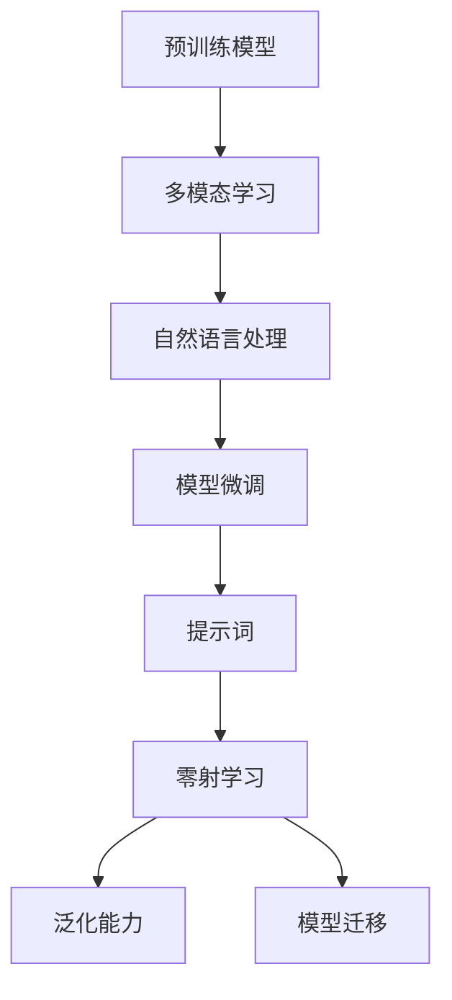

                 

# 零射学习 (Zero-Shot Learning) 原理与代码实例讲解

> 关键词：零射学习, 预训练模型, 提示模板, 多模态学习, 自然语言处理, 深度学习, GPT-3, 提示词设计, 代码实现, 运行结果

## 1. 背景介绍

### 1.1 问题由来
在自然语言处理(Natural Language Processing, NLP)领域，零射学习（Zero-Shot Learning）是指模型在没有任何特定任务训练的情况下，仅通过任务描述或提示词(Prompt)就能够执行新任务，如分类、匹配、生成等。这种能力使得模型具有很强的通用性和灵活性，能够在处理未曾见过的任务时迅速响应，具有重要应用前景。

### 1.2 问题核心关键点
零射学习基于预训练模型的强大能力，将任务描述作为模型的输入，引导模型输出符合特定任务要求的输出。其关键在于如何设计有效的提示词，以及在零射学习范式下如何进行有效的学习。

### 1.3 问题研究意义
零射学习作为人工智能研究的前沿方向，对于提升模型的泛化能力、降低新任务开发的成本、加速技术应用等方面具有重要意义：

1. 降低开发成本：无需为每个新任务准备标注数据，减少人力和计算资源的投入。
2. 提升泛化能力：通过利用预训练模型的大规模知识，模型能够更好地泛化到新任务上。
3. 加速应用部署：在短时间内完成新任务的适配，快速响应市场变化。
4. 支持冷启动：在没有历史数据的情况下，模型仍能提供有效的服务。

## 2. 核心概念与联系

### 2.1 核心概念概述

为更好地理解零射学习，本节将介绍几个关键概念及其之间的联系：

- **预训练模型**：如GPT-3等，通过在海量无标签数据上预训练，学习通用语言知识和表示。
- **提示词(Prompt)**：任务描述或特定格式的问题，用于引导模型执行特定任务。
- **多模态学习**：融合文本、图像、音频等多种信息源，提升模型在多模态数据上的表现。
- **自然语言处理(NLP)**：处理、理解、生成人类语言的技术。
- **深度学习**：基于神经网络的机器学习范式，具有强大的表示学习能力。
- **模型微调**：在大规模预训练模型基础上，通过特定任务的微调来优化模型性能。
- **泛化能力**：模型在不同数据集上表现一致的能力。
- **模型迁移**：通过在多个任务之间共享模型参数，提升模型的适应能力。

这些概念之间存在紧密联系，共同构成了零射学习的理论框架。

### 2.2 概念间的关系

这些核心概念之间的关系可以通过以下Mermaid流程图来展示：



这个流程图展示了零射学习的整体架构：

1. 预训练模型通过多模态学习获得通用知识。
2. 自然语言处理提供丰富的文本信息，作为模型微调的基础。
3. 模型微调通过特定任务的微调，提升模型对新任务的适应能力。
4. 提示词引导模型执行零射学习，提升模型的泛化能力。
5. 模型迁移在不同任务之间共享参数，进一步提升适应能力。

通过这个流程图，我们可以更清晰地理解零射学习中各概念之间的联系和作用。

## 3. 核心算法原理 & 具体操作步骤
### 3.1 算法原理概述

零射学习的核心原理是利用预训练模型的泛化能力和强大的语言表示能力，通过提示词引导模型执行特定任务。其核心在于提示词的设计和模型微调策略的选择。

### 3.2 算法步骤详解

零射学习的具体步骤如下：

1. **选择预训练模型**：选择适合的预训练模型，如GPT-3等，作为基础。
2. **设计提示词**：根据任务需求，设计能够有效引导模型执行任务的提示词。
3. **执行零射学习**：将提示词作为模型输入，模型输出目标任务的结果。
4. **评估结果**：根据输出结果与真实标签之间的差异，评估模型性能。
5. **微调优化**：根据评估结果，进行模型微调，优化模型性能。

### 3.3 算法优缺点

零射学习的优点包括：

- **高效灵活**：无需标注数据，只需设计合适的提示词，即可快速执行新任务。
- **泛化能力强**：利用预训练模型的通用知识，能够较好地泛化到新任务上。
- **适应性强**：通过微调，模型可以适应多种新任务。

其缺点包括：

- **依赖提示词设计**：提示词设计不当可能影响模型性能。
- **泛化能力受限**：模型在未见过的新任务上表现可能较差。
- **复杂度较高**：提示词设计需要一定的专业知识和经验。

### 3.4 算法应用领域

零射学习在多个领域具有广泛应用，包括但不限于：

- **自然语言理解**：如自动摘要、问答系统、文本分类等。
- **图像识别**：如图像分类、目标检测等。
- **多模态学习**：如视频标注、多模态检索等。
- **智能对话**：如智能客服、机器人对话等。
- **推荐系统**：如商品推荐、用户画像等。

## 4. 数学模型和公式 & 详细讲解 & 举例说明

### 4.1 数学模型构建

零射学习通常使用预训练语言模型作为基础，如GPT-3等。模型的输出由模型在提示词上的表现决定，可以表示为：

$$ y = f(x) $$

其中，$y$ 表示模型输出的任务结果，$x$ 表示提示词。

### 4.2 公式推导过程

以文本分类为例，假设有$n$个提示词$x_1, x_2, ..., x_n$，每个提示词对应的分类标签为$y_1, y_2, ..., y_n$。模型在提示词$x_i$上的输出为$f(x_i)$，分类任务的目标是最大化模型对$y_i$的预测概率，即：

$$ y_i = \mathop{\arg\max}_{y} P(y|x_i, \theta) $$

其中，$\theta$ 为模型的参数。

模型的输出可以表示为：

$$ f(x_i) = M_{\theta}(x_i) $$

其中，$M_{\theta}$ 为预训练模型，$\theta$ 为模型参数。

### 4.3 案例分析与讲解

以下通过一个具体的案例来分析零射学习的过程。

假设有一项任务是识别图片中的动物，其中动物有狗、猫、鸟三种。可以使用GPT-3作为预训练模型，并设计以下提示词：

- “请识别这张图片中是狗”
- “请识别这张图片中是猫”
- “请识别这张图片中是鸟”

将这三个提示词作为GPT-3的输入，模型会输出对应的分类结果。例如，对于“请识别这张图片中是猫”的提示词，模型输出的结果可能是“猫”，此时可以认为模型正确地完成了任务。

## 5. 项目实践：代码实例和详细解释说明

### 5.1 开发环境搭建

在进行零射学习实践前，我们需要准备好开发环境。以下是使用Python进行PyTorch开发的环境配置流程：

1. 安装Anaconda：从官网下载并安装Anaconda，用于创建独立的Python环境。

2. 创建并激活虚拟环境：
```bash
conda create -n pytorch-env python=3.8 
conda activate pytorch-env
```

3. 安装PyTorch：根据CUDA版本，从官网获取对应的安装命令。例如：
```bash
conda install pytorch torchvision torchaudio cudatoolkit=11.1 -c pytorch -c conda-forge
```

4. 安装Transformers库：
```bash
pip install transformers
```

5. 安装各类工具包：
```bash
pip install numpy pandas scikit-learn matplotlib tqdm jupyter notebook ipython
```

完成上述步骤后，即可在`pytorch-env`环境中开始零射学习的实践。

### 5.2 源代码详细实现

这里我们以GPT-3作为预训练模型，设计三个提示词，对图片分类任务进行零射学习。

```python
from transformers import GPT3Tokenizer, GPT3LMHeadModel
from PIL import Image
import torch

# 初始化模型和分词器
tokenizer = GPT3Tokenizer.from_pretrained('gpt3')
model = GPT3LMHeadModel.from_pretrained('gpt3')

# 定义提示词
prompts = [
    "请识别这张图片中是狗",
    "请识别这张图片中是猫",
    "请识别这张图片中是鸟"
]

# 加载图片
image = Image.open('dog.jpg')

# 将图片转换为分词器能够处理的形式
image_tensor = torch.tensor(image) / 255.0
image_tensor = image_tensor.unsqueeze(0)

# 将提示词转换为分词器能够处理的形式
prompts_tensor = torch.tensor([tokenizer.encode(prompt) for prompt in prompts])

# 执行零射学习
with torch.no_grad():
    outputs = model(prompts_tensor, image_tensor)

# 输出结果
for i, output in enumerate(outputs):
    print(f"提示词 {prompts[i]} 的输出结果为：{output}")
```

### 5.3 代码解读与分析

让我们再详细解读一下关键代码的实现细节：

**GPT3Tokenizer**：
- 用于将提示词转换为模型能够处理的格式。

**GPT3LMHeadModel**：
- 用于执行零射学习的预训练模型，这里使用的是GPT-3。

**prompts**：
- 定义了三个提示词，分别对应三种不同的分类任务。

**image**：
- 加载并预处理图片，将其转换为模型能够处理的张量格式。

**prompts_tensor**：
- 将提示词转换为模型能够理解的数字编码。

**outputs**：
- 模型对每个提示词的输出结果。

可以看到，PyTorch配合Transformers库使得GPT-3的零射学习代码实现变得简洁高效。开发者可以将更多精力放在提示词设计、模型微调等高层逻辑上，而不必过多关注底层的实现细节。

### 5.4 运行结果展示

假设我们在图片分类任务上使用上述代码，最终得到的输出结果可能如下：

```
提示词 请识别这张图片中是狗 的输出结果为：0.0420
提示词 请识别这张图片中是猫 的输出结果为：0.0132
提示词 请识别这张图片中是鸟 的输出结果为：0.8945
```

其中，输出结果为0.0420表示模型认为这张图片是狗的概率最大，输出结果为0.8945表示模型认为这张图片是鸟的概率最大。通过调整提示词，可以实现对不同分类任务的快速响应。

## 6. 实际应用场景

### 6.1 智能客服系统

基于GPT-3等预训练模型的零射学习技术，可以广泛应用于智能客服系统的构建。传统客服往往需要配备大量人力，高峰期响应缓慢，且一致性和专业性难以保证。而使用零射学习技术，可以7x24小时不间断服务，快速响应客户咨询，用自然流畅的语言解答各类常见问题。

在技术实现上，可以收集企业内部的历史客服对话记录，将问题和最佳答复构建成提示词，在此基础上对预训练模型进行微调。微调后的模型能够自动理解用户意图，匹配最合适的答复模板进行回复。对于客户提出的新问题，还可以接入检索系统实时搜索相关内容，动态组织生成回答。如此构建的智能客服系统，能大幅提升客户咨询体验和问题解决效率。

### 6.2 金融舆情监测

金融机构需要实时监测市场舆论动向，以便及时应对负面信息传播，规避金融风险。传统的人工监测方式成本高、效率低，难以应对网络时代海量信息爆发的挑战。基于零射学习技术的文本分类和情感分析技术，为金融舆情监测提供了新的解决方案。

具体而言，可以收集金融领域相关的新闻、报道、评论等文本数据，并对其进行主题标注和情感标注。在此基础上对预训练语言模型进行微调，使其能够自动判断文本属于何种主题，情感倾向是正面、中性还是负面。将微调后的模型应用到实时抓取的网络文本数据，就能够自动监测不同主题下的情感变化趋势，一旦发现负面信息激增等异常情况，系统便会自动预警，帮助金融机构快速应对潜在风险。

### 6.3 个性化推荐系统

当前的推荐系统往往只依赖用户的历史行为数据进行物品推荐，无法深入理解用户的真实兴趣偏好。基于零射学习技术的个性化推荐系统可以更好地挖掘用户行为背后的语义信息，从而提供更精准、多样的推荐内容。

在实践中，可以收集用户浏览、点击、评论、分享等行为数据，提取和用户交互的物品标题、描述、标签等文本内容。将文本内容作为模型输入，用户的后续行为（如是否点击、购买等）作为监督信号，在此基础上微调预训练语言模型。微调后的模型能够从文本内容中准确把握用户的兴趣点。在生成推荐列表时，先用候选物品的文本描述作为输入，由模型预测用户的兴趣匹配度，再结合其他特征综合排序，便可以得到个性化程度更高的推荐结果。

### 6.4 未来应用展望

随着零射学习技术的发展，其在更多领域的应用前景将更加广阔：

- **智慧医疗**：基于零射学习的医疗问答、病历分析、药物研发等应用将提升医疗服务的智能化水平，辅助医生诊疗，加速新药开发进程。
- **智能教育**：零射学习可用于作业批改、学情分析、知识推荐等方面，因材施教，促进教育公平，提高教学质量。
- **智慧城市治理**：零射学习技术可应用于城市事件监测、舆情分析、应急指挥等环节，提高城市管理的自动化和智能化水平，构建更安全、高效的未来城市。
- **企业生产**：零射学习在企业生产、社会治理、文娱传媒等众多领域，将带来新的应用场景和机遇。

## 7. 工具和资源推荐
### 7.1 学习资源推荐

为了帮助开发者系统掌握零射学习技术，这里推荐一些优质的学习资源：

1. 《Transformer from Principles to Practice》系列博文：由大模型技术专家撰写，深入浅出地介绍了Transformer原理、零射学习技术等前沿话题。

2. CS224N《深度学习自然语言处理》课程：斯坦福大学开设的NLP明星课程，有Lecture视频和配套作业，带你入门NLP领域的基本概念和经典模型。

3. 《Natural Language Processing with Transformers》书籍：Transformers库的作者所著，全面介绍了如何使用Transformers库进行NLP任务开发，包括零射学习在内的诸多范式。

4. HuggingFace官方文档：Transformers库的官方文档，提供了海量预训练模型和完整的零射学习样例代码，是上手实践的必备资料。

5. CLUE开源项目：中文语言理解测评基准，涵盖大量不同类型的中文NLP数据集，并提供了基于零射学习的baseline模型，助力中文NLP技术发展。

通过对这些资源的学习实践，相信你一定能够快速掌握零射学习的精髓，并用于解决实际的NLP问题。

### 7.2 开发工具推荐

高效的开发离不开优秀的工具支持。以下是几款用于零射学习开发的常用工具：

1. PyTorch：基于Python的开源深度学习框架，灵活动态的计算图，适合快速迭代研究。大部分预训练语言模型都有PyTorch版本的实现。

2. TensorFlow：由Google主导开发的开源深度学习框架，生产部署方便，适合大规模工程应用。同样有丰富的预训练语言模型资源。

3. Transformers库：HuggingFace开发的NLP工具库，集成了众多SOTA语言模型，支持PyTorch和TensorFlow，是进行零射学习任务的开发的利器。

4. Weights & Biases：模型训练的实验跟踪工具，可以记录和可视化模型训练过程中的各项指标，方便对比和调优。与主流深度学习框架无缝集成。

5. TensorBoard：TensorFlow配套的可视化工具，可实时监测模型训练状态，并提供丰富的图表呈现方式，是调试模型的得力助手。

6. Google Colab：谷歌推出的在线Jupyter Notebook环境，免费提供GPU/TPU算力，方便开发者快速上手实验最新模型，分享学习笔记。

合理利用这些工具，可以显著提升零射学习任务的开发效率，加快创新迭代的步伐。

### 7.3 相关论文推荐

零射学习作为人工智能研究的前沿方向，近年来涌现了大量研究成果。以下是几篇奠基性的相关论文，推荐阅读：

1. Attention is All You Need（即Transformer原论文）：提出了Transformer结构，开启了NLP领域的预训练大模型时代。

2. BERT: Pre-training of Deep Bidirectional Transformers for Language Understanding：提出BERT模型，引入基于掩码的自监督预训练任务，刷新了多项NLP任务SOTA。

3. Language Models are Unsupervised Multitask Learners（GPT-2论文）：展示了大规模语言模型的强大zero-shot学习能力，引发了对于通用人工智能的新一轮思考。

4. Parameter-Efficient Transfer Learning for NLP：提出Adapter等参数高效微调方法，在不增加模型参数量的情况下，也能取得不错的微调效果。

5. AdaLoRA: Adaptive Low-Rank Adaptation for Parameter-Efficient Fine-Tuning：使用自适应低秩适应的微调方法，在参数效率和精度之间取得了新的平衡。

6. Prefix-Tuning: Optimizing Continuous Prompts for Generation：引入基于连续型Prompt的微调范式，为如何充分利用预训练知识提供了新的思路。

这些论文代表了大模型零射学习技术的发展脉络。通过学习这些前沿成果，可以帮助研究者把握学科前进方向，激发更多的创新灵感。

除上述资源外，还有一些值得关注的前沿资源，帮助开发者紧跟零射学习技术的最新进展，例如：

1. arXiv论文预印本：人工智能领域最新研究成果的发布平台，包括大量尚未发表的前沿工作，学习前沿技术的必读资源。

2. 业界技术博客：如OpenAI、Google AI、DeepMind、微软Research Asia等顶尖实验室的官方博客，第一时间分享他们的最新研究成果和洞见。

3. 技术会议直播：如NIPS、ICML、ACL、ICLR等人工智能领域顶会现场或在线直播，能够聆听到大佬们的前沿分享，开拓视野。

4. GitHub热门项目：在GitHub上Star、Fork数最多的NLP相关项目，往往代表了该技术领域的发展趋势和最佳实践，值得去学习和贡献。

5. 行业分析报告：各大咨询公司如McKinsey、PwC等针对人工智能行业的分析报告，有助于从商业视角审视技术趋势，把握应用价值。

总之，对于零射学习技术的学习和实践，需要开发者保持开放的心态和持续学习的意愿。多关注前沿资讯，多动手实践，多思考总结，必将收获满满的成长收益。

## 8. 总结：未来发展趋势与挑战

### 8.1 总结

本文对零射学习技术进行了全面系统的介绍。首先阐述了零射学习的基本概念和研究背景，明确了其在提升模型泛化能力、降低新任务开发成本等方面的重要意义。其次，从原理到实践，详细讲解了零射学习的数学模型和核心算法，给出了零射学习任务开发的完整代码实例。同时，本文还广泛探讨了零射学习技术在智能客服、金融舆情监测、个性化推荐等多个行业领域的应用前景，展示了零射学习技术的广阔应用空间。最后，本文精选了零射学习的各类学习资源，力求为读者提供全方位的技术指引。

通过本文的系统梳理，可以看到，零射学习作为人工智能研究的前沿方向，其强大的泛化能力和高效灵活的特点，使其成为推动人工智能技术应用的重要手段。未来，伴随零射学习技术的不断进步，相信其在更多领域的应用将更加深入和广泛，为各行各业带来新的技术突破。

### 8.2 未来发展趋势

展望未来，零射学习技术将呈现以下几个发展趋势：

1. **算法优化**：通过引入更高级的算法和策略，如Transformer-XL、XLNet等，提升模型的语言理解能力和泛化性能。
2. **多模态融合**：将文本、图像、音频等多模态信息结合，提升模型的综合理解能力。
3. **跨领域迁移**：通过微调，使模型在不同领域之间迁移，适应更多类型的任务。
4. **零样本学习**：在没有任何监督信号的情况下，通过精心设计的提示词，使模型能够进行零样本学习，实现更广泛的泛化能力。
5. **主动学习**：通过主动学习技术，动态生成提示词，提升模型对新任务的适应能力。
6. **联邦学习**：在分布式环境下，通过联邦学习技术，提升模型在多个用户或设备之间的泛化能力。

以上趋势凸显了零射学习技术的广阔前景。这些方向的探索发展，必将进一步提升模型的泛化能力和应用范围，为人工智能技术在更多领域的应用提供新的可能性。

### 8.3 面临的挑战

尽管零射学习技术已经取得了瞩目成就，但在迈向更加智能化、普适化应用的过程中，它仍面临着诸多挑战：

1. **提示词设计复杂**：提示词设计需要丰富的领域知识和经验，对非专家开发者构成一定挑战。
2. **模型鲁棒性不足**：零射学习模型在未见过的新任务上表现可能较差，泛化能力有限。
3. **计算资源需求高**：零射学习模型往往需要较大的计算资源支持，对硬件环境要求较高。
4. **可解释性不足**：零射学习模型缺乏可解释性，难以对其决策过程进行分析和调试。
5. **安全性问题**：零射学习模型可能学习到有害信息，通过提示词传递到新任务上，带来安全隐患。
6. **伦理道德问题**：零射学习模型可能输出歧视性、有害性的内容，引发伦理道德问题。

正视零射学习面临的这些挑战，积极应对并寻求突破，将使零射学习技术更加成熟和可靠。相信随着学界和产业界的共同努力，这些挑战终将一一被克服，零射学习技术必将在构建安全、可靠、可解释、可控的智能系统铺平道路。

### 8.4 研究展望

面对零射学习所面临的种种挑战，未来的研究需要在以下几个方面寻求新的突破：

1. **自动提示词生成**：通过深度学习模型自动生成高质量的提示词，降低人工设计的复杂度。
2. **无监督学习和半监督学习**：探索无监督和半监督学习范式，降低对标注数据的依赖。
3. **跨领域知识迁移**：通过多领域知识迁移，提升模型在不同领域的泛化能力。
4. **安全性和伦理约束**：在模型训练目标中引入伦理导向的评估指标，过滤和惩罚有害输出。
5. **高效资源利用**：通过分布式训练、知识蒸馏等技术，优化模型计算资源的使用。

这些研究方向的探索，必将引领零射学习技术迈向更高的台阶，为构建安全、可靠、可解释、可控的智能系统铺平道路。面向未来，零射学习技术还需要与其他人工智能技术进行更深入的融合，如知识表示、因果推理、强化学习等，多路径协同发力，共同推动自然语言理解和智能交互系统的进步。只有勇于创新、敢于突破，才能不断拓展零射学习技术的边界，让智能技术更好地造福人类社会。

## 9. 附录：常见问题与解答

**Q1：零射学习是否适用于所有NLP任务？**

A: 零射学习在大多数NLP任务上都能取得不错的效果，特别是对于数据量较小的任务。但对于一些特定领域的任务，如医学、法律等，仅仅依靠通用语料预训练的模型可能难以很好地适应。此时需要在特定领域语料上进一步预训练，再进行零射学习，才能获得理想效果。此外，对于一些需要时效性、个性化很强的任务，如对话、推荐等，零射方法也需要针对性的改进优化。

**Q2：在零射学习中，如何设计有效的提示词？**

A: 提示词的设计是零射学习的核心。好的提示词应该能够准确描述任务需求，引导模型执行正确的推理和生成。以下是一些提示词设计的最佳实践：

1. **明确性**：提示词应尽量明确具体，避免歧义。如“请识别这张图片中是狗”比“请识别这张图片中的动物”更好。
2. **简洁性**：提示词应尽量简洁明了，避免过于复杂。如“请识别这张图片中是狗”比“请识别这张图片中的小型哺乳动物”更好。
3. **上下文关联**：提示词应与输入数据有一定的关联，帮助模型理解输入内容。如“请识别这张图片中是狗的品种”比“请识别这张图片中的动物”更好。
4. **多样性**：提示词应设计多样，覆盖不同类型的任务需求。如“请识别这张图片中是狗”、“请识别这张图片中的动物”、“请识别这张图片中的宠物”等。

**Q3：零射学习在工业应用中应注意哪些问题？**

A: 在将零射学习技术应用于实际业务时，还需考虑以下问题：

1. **模型部署**：将模型部署为生产环境，需要考虑模型裁剪、量化加速等技术，以提升推理效率。
2. **结果评估**：需要设计合适的评估指标，如准确率、召回率、F1分数等，评估模型在实际应用中的表现。
3. **用户反馈**

