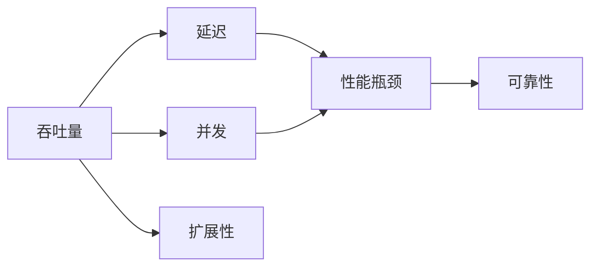

                 

# 高吞吐量系统设计的最佳实践

## 1. 背景介绍

在当今信息爆炸的时代，高吞吐量系统已经成为企业和组织构建高性能、可伸缩服务的关键。无论是Web应用、云服务、数据中心，还是物联网设备，高吞吐量系统都扮演着至关重要的角色。但如何设计出高吞吐量的系统，同时保持性能稳定和成本效益，是每一个IT工程师和架构师面临的挑战。本文将从背景介绍、核心概念与联系、核心算法原理、具体操作步骤、数学模型与公式、项目实践、实际应用场景、工具与资源推荐、总结与展望以及常见问题解答等多个维度，深入探讨高吞吐量系统设计的最佳实践。

## 2. 核心概念与联系

### 2.1 核心概念概述

在讨论高吞吐量系统设计之前，我们需要先理解一些核心概念：

- **吞吐量**：指系统在单位时间内处理请求的数量，通常以每秒处理请求数（TPS）或每秒处理事务数（TPH）来衡量。
- **延迟**：指系统处理请求所花费的时间，包括处理时间、网络延迟等。
- **并发**：指系统同时处理多个请求的能力。
- **扩展性**：指系统能够根据需求水平，无缝增加资源以支持更大负载的能力。
- **可靠性**：指系统在高可用性、容错性等方面的表现。

### 2.2 核心概念的关系

以下是一个简化的Mermaid流程图，展示了核心概念之间的联系：



从这个流程图可以看出，吞吐量与并发、延迟、扩展性和可靠性密切相关。高吞吐量的系统必须具备足够的并发能力，同时尽量降低延迟，确保扩展性，并具备较高的可靠性。

## 3. 核心算法原理 & 具体操作步骤

### 3.1 算法原理概述

设计高吞吐量系统的核心算法原理主要包括负载均衡、分布式缓存、数据库优化、异步处理和事件驱动架构等。

- **负载均衡**：通过将请求分发到多个服务器上，实现请求的均衡分布，提高系统的吞吐量。
- **分布式缓存**：利用缓存减少数据库访问次数，提升系统响应速度。
- **数据库优化**：通过索引、分区、批量处理等方法，优化数据库性能，提升查询效率。
- **异步处理**：通过异步IO、消息队列等方式，减少系统延迟，提高并发处理能力。
- **事件驱动架构**：通过事件驱动机制，实现松耦合、高并发的系统架构。

### 3.2 算法步骤详解

以下是一个简化的高吞吐量系统设计流程图，展示了从需求分析到实施部署的步骤：


1. **需求分析**：明确系统的性能目标和需求，如TPS、延迟、并发等。
2. **性能评估**：通过基准测试、性能分析等方法，评估当前系统的性能瓶颈和优化空间。
3. **架构设计**：设计符合高吞吐量要求的系统架构，包括负载均衡、缓存、数据库、异步处理等。
4. **技术选型**：选择适合的高性能、高可靠性的技术栈和工具。
5. **系统构建**：根据设计文档和选型结果，构建系统。
6. **性能测试**：通过压力测试等手段，验证系统的性能是否满足需求。
7. **优化与调整**：根据性能测试结果，进行系统优化和调整。
8. **部署与监控**：将系统部署到生产环境，并实时监控性能指标。
9. **持续优化**：根据监控数据和反馈，不断优化系统性能。

### 3.3 算法优缺点

高吞吐量系统设计的算法具有以下优点：

- **高效性**：通过优化架构和算法，提升系统处理能力，提高吞吐量。
- **可扩展性**：通过分布式和缓存等技术，支持系统水平扩展，满足更大负载。
- **高可靠性**：通过冗余和容错设计，提高系统的稳定性和可用性。

同时，这些算法也存在一些缺点：

- **复杂性**：设计高吞吐量系统需要考虑多个维度，增加了系统设计和实施的复杂度。
- **成本高**：高吞吐量系统通常需要高性能硬件和复杂的集群管理，成本较高。
- **维护困难**：高吞吐量系统架构复杂，维护和调试难度较大。

### 3.4 算法应用领域

高吞吐量系统设计的算法在多个领域都有广泛应用，如：

- **云服务**：云服务商通过高吞吐量系统设计，确保服务的高可用性和高性能。
- **互联网应用**：如电子商务、社交网络、在线视频等，需要处理海量用户请求，需要高吞吐量系统支持。
- **数据中心**：数据中心需要处理大规模数据存储和计算任务，需要高吞吐量系统支撑。
- **物联网**：物联网设备和服务需要处理大量传感器数据，需要高吞吐量系统保障数据传输和处理。

## 4. 数学模型和公式 & 详细讲解

### 4.1 数学模型构建

在设计高吞吐量系统时，数学模型和公式是不可或缺的工具。以下是一个简化的吞吐量计算模型：

$$
\text{吞吐量} = \frac{\text{处理能力}}{\text{请求间隔}}
$$

其中，处理能力指系统每秒能够处理的最大请求数，请求间隔指相邻请求的平均时间间隔。

### 4.2 公式推导过程

假设系统每秒能够处理 $P$ 个请求，相邻请求的平均时间间隔为 $T$ 秒，则系统的吞吐量为：

$$
\text{吞吐量} = \frac{P}{T}
$$

如果系统的并发数为 $C$，则实际的处理能力为 $P \times C$。如果系统的请求到达率为 $R$，则请求间隔 $T = \frac{1}{R}$。因此，吞吐量的计算公式可以进一步简化为：

$$
\text{吞吐量} = P \times C \times R
$$

### 4.3 案例分析与讲解

以一个电商平台的订单处理系统为例，假设系统每秒能够处理 100 个订单，并发数为 10，请求到达率为 2。则系统的吞吐量为：

$$
\text{吞吐量} = 100 \times 10 \times 2 = 2000 \text{ 订单/秒}
$$

## 5. 项目实践：代码实例和详细解释说明

### 5.1 开发环境搭建

要搭建高吞吐量系统，首先需要选择适合的开发环境。以下是一个Python高吞吐量系统示例的开发环境配置：

1. **安装Python**：
```bash
sudo apt-get install python3 python3-pip
```

2. **安装依赖**：
```bash
pip3 install Flask gunicorn redis
```

3. **配置Redis**：
```bash
sudo apt-get install redis-server
redis-server
```

### 5.2 源代码详细实现

以下是一个使用Python Flask和Redis实现高吞吐量系统的示例代码：

```python
from flask import Flask, request
from redis import Redis

app = Flask(__name__)
redis = Redis(host='localhost', port=6379, db=0)

@app.route('/')
def index():
    """处理主请求"""
    request_id = request.args.get('request_id')
    # 从Redis中获取请求处理状态
    status = redis.get(request_id)
    if status is None:
        # 如果Redis中没有该请求的状态，则启动请求处理逻辑
        redis.set(request_id, 'processing')
        # 模拟处理逻辑
        result = process_request(request_id)
        redis.set(request_id, 'done')
        return result
    else:
        # 如果Redis中有该请求的状态，则直接返回状态
        return status

def process_request(request_id):
    """模拟处理逻辑"""
    # 处理请求并返回结果
    result = '请求处理完成'
    return result

if __name__ == '__main__':
    app.run(host='0.0.0.0', port=5000)
```

### 5.3 代码解读与分析

1. **Flask框架**：用于搭建Web应用，支持RESTful API设计。
2. **Redis缓存**：用于存储请求状态，实现请求处理状态的缓存。
3. **异步处理**：通过Redis缓存请求状态，避免了重复处理相同请求，提高了系统吞吐量。
4. **请求处理逻辑**：通过异步处理和缓存机制，实现了松耦合、高并发的系统架构。

### 5.4 运行结果展示

启动应用后，可以通过请求 URL `http://localhost:5000/?request_id=1` 来模拟请求处理。应用会根据Redis中的请求状态进行处理，并将结果返回给客户端。

## 6. 实际应用场景

### 6.1 云服务

云服务提供商需要处理大量的用户请求，通常使用高吞吐量系统设计来保障服务的稳定性和高性能。例如，AWS使用分布式负载均衡和缓存技术，确保云服务的可靠性和高性能。

### 6.2 互联网应用

互联网应用如社交网络、在线视频、电子商务等，需要处理海量用户请求，需要高吞吐量系统支持。例如，Facebook使用分布式缓存和异步处理技术，提升其社交网络的性能和稳定性。

### 6.3 数据中心

数据中心需要处理大规模数据存储和计算任务，需要高吞吐量系统支撑。例如，Google的数据中心通过高吞吐量系统设计，实现了高效的数据处理和存储。

### 6.4 物联网

物联网设备和服务需要处理大量传感器数据，需要高吞吐量系统保障数据传输和处理。例如，IoT平台通过高吞吐量系统设计，实现了数据的实时传输和处理。

## 7. 工具和资源推荐

### 7.1 学习资源推荐

为了掌握高吞吐量系统设计的最佳实践，推荐以下学习资源：

1. **《高吞吐量系统设计》书籍**：作者S. Cockburn，介绍了高吞吐量系统设计的理论和实践。
2. **《大型网站技术架构》书籍**：作者S. Cockburn，介绍了大型网站的架构设计和技术实现。
3. **《高性能MySQL》书籍**：作者Y. Guo，介绍了MySQL数据库的高性能优化和实践。
4. **《Redis设计与实现》书籍**：作者L. O'Andrews，介绍了Redis缓存系统的设计与实现。
5. **《Spring Boot实战》书籍**：作者K. J. P. Perkins，介绍了Spring Boot的高性能微服务架构。

### 7.2 开发工具推荐

高吞吐量系统设计需要多种工具支持，以下推荐一些常用的开发工具：

1. **Flask**：轻量级Web框架，支持RESTful API设计，适合高并发应用。
2. **Gunicorn**：基于Python的Web应用服务器，支持高性能异步处理。
3. **Redis**：高性能缓存系统，适合高并发请求处理。
4. **MySQL**：高可用性数据库，适合大规模数据存储和处理。
5. **Spring Boot**：高性能微服务框架，支持高并发分布式架构。

### 7.3 相关论文推荐

高吞吐量系统设计是一个广泛研究的领域，以下是几篇经典论文：

1. **《分布式系统设计原理》**：作者L. Brewer，介绍了分布式系统设计的基本原理和实践。
2. **《高性能Web应用》**：作者J. H. Jacobs，介绍了Web应用的高性能优化和实践。
3. **《分布式数据库系统》**：作者A. Agrawal，介绍了分布式数据库系统的高性能设计和实现。
4. **《微服务架构》**：作者S. Ghriciu，介绍了微服务架构的高性能设计和实践。
5. **《缓存与并发控制》**：作者A. T. R. Chandy，介绍了缓存系统和并发控制的高性能设计。

## 8. 总结：未来发展趋势与挑战

### 8.1 研究成果总结

高吞吐量系统设计的最佳实践已经得到了广泛应用和验证，但仍然面临一些挑战：

- **延迟**：高吞吐量系统通常伴随着高延迟，如何降低延迟是未来研究的重要方向。
- **扩展性**：随着数据量的增长，高吞吐量系统需要具备更好的水平扩展能力。
- **成本**：高吞吐量系统通常需要高性能硬件和复杂的管理机制，如何降低成本是一个重要的研究方向。
- **可靠性和安全性**：高吞吐量系统需要具备高可靠性和安全性，如何实现这一点也是未来研究的重点。

### 8.2 未来发展趋势

未来，高吞吐量系统设计将呈现以下几个发展趋势：

1. **云原生技术**：随着云原生技术的普及，高吞吐量系统将更加注重容器化、微服务化等云原生架构。
2. **边缘计算**：边缘计算技术将使得高吞吐量系统更加靠近数据源，降低延迟，提高性能。
3. **人工智能**：人工智能技术将帮助高吞吐量系统实现更智能的负载均衡和缓存优化。
4. **安全与隐私保护**：高吞吐量系统需要具备更好的安全性和隐私保护机制，保障用户数据安全。

### 8.3 面临的挑战

尽管高吞吐量系统设计取得了不少进展，但仍然面临一些挑战：

1. **延迟**：如何在大规模数据和复杂逻辑下保持低延迟，是未来研究的重要方向。
2. **扩展性**：如何实现更加灵活和自动化的扩展机制，是未来研究的重要方向。
3. **成本**：如何降低高吞吐量系统对硬件和管理的依赖，降低成本，是未来研究的重要方向。
4. **可靠性和安全性**：如何保障高吞吐量系统的可靠性和安全性，是未来研究的重要方向。

### 8.4 研究展望

未来，高吞吐量系统设计的研究方向包括：

1. **分布式系统设计**：研究分布式系统的设计原理和实践，提升系统的可扩展性和可靠性。
2. **高性能缓存**：研究缓存系统的优化和实践，提升系统的响应速度。
3. **负载均衡技术**：研究负载均衡的优化和实践，提升系统的吞吐量和效率。
4. **异步处理技术**：研究异步处理机制，提升系统的并发能力和效率。
5. **人工智能与大数据**：研究人工智能和大数据技术在高吞吐量系统中的应用，提升系统的智能化和自动化水平。

## 9. 附录：常见问题与解答

**Q1: 什么是高吞吐量系统？**

A: 高吞吐量系统指能够处理大量请求的系统，通常以每秒处理请求数（TPS）或每秒处理事务数（TPH）来衡量。

**Q2: 高吞吐量系统设计有哪些关键要素？**

A: 高吞吐量系统设计需要考虑负载均衡、缓存、数据库优化、异步处理和事件驱动架构等多个关键要素。

**Q3: 如何使用Redis实现缓存？**

A: 使用Redis缓存系统，可以将请求状态存储在Redis中，避免重复处理相同请求，提升系统吞吐量。

**Q4: 高吞吐量系统面临的主要挑战是什么？**

A: 高吞吐量系统面临的主要挑战包括延迟、扩展性、成本、可靠性和安全性。

**Q5: 如何实现高吞吐量系统的负载均衡？**

A: 通过使用负载均衡器，将请求分发到多个服务器上，实现请求的均衡分布，提高系统的吞吐量。

作者：禅与计算机程序设计艺术 / Zen and the Art of Computer Programming

