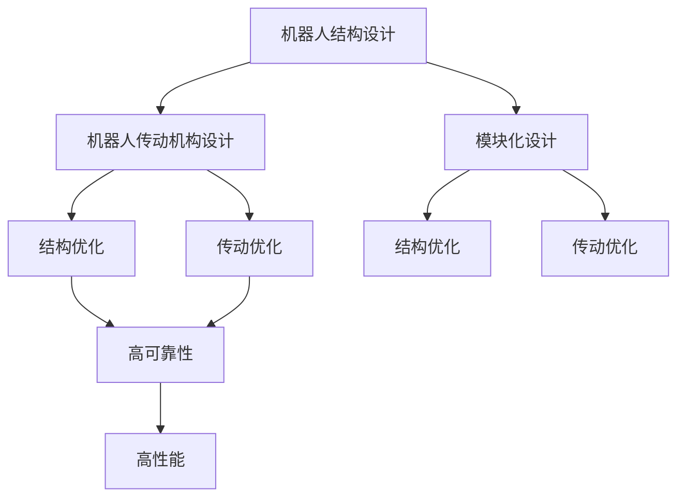
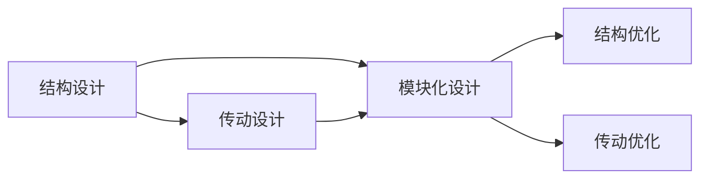
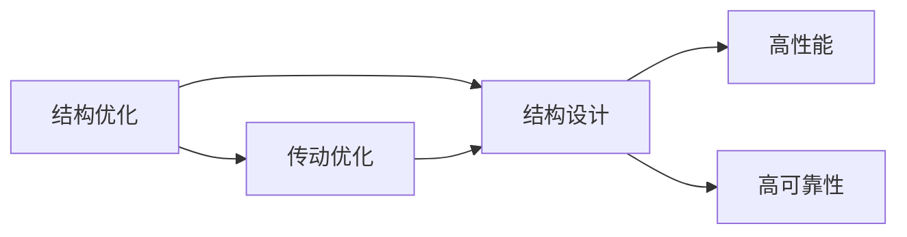
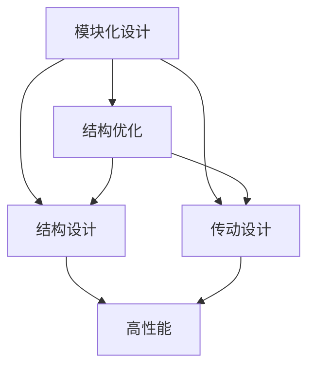
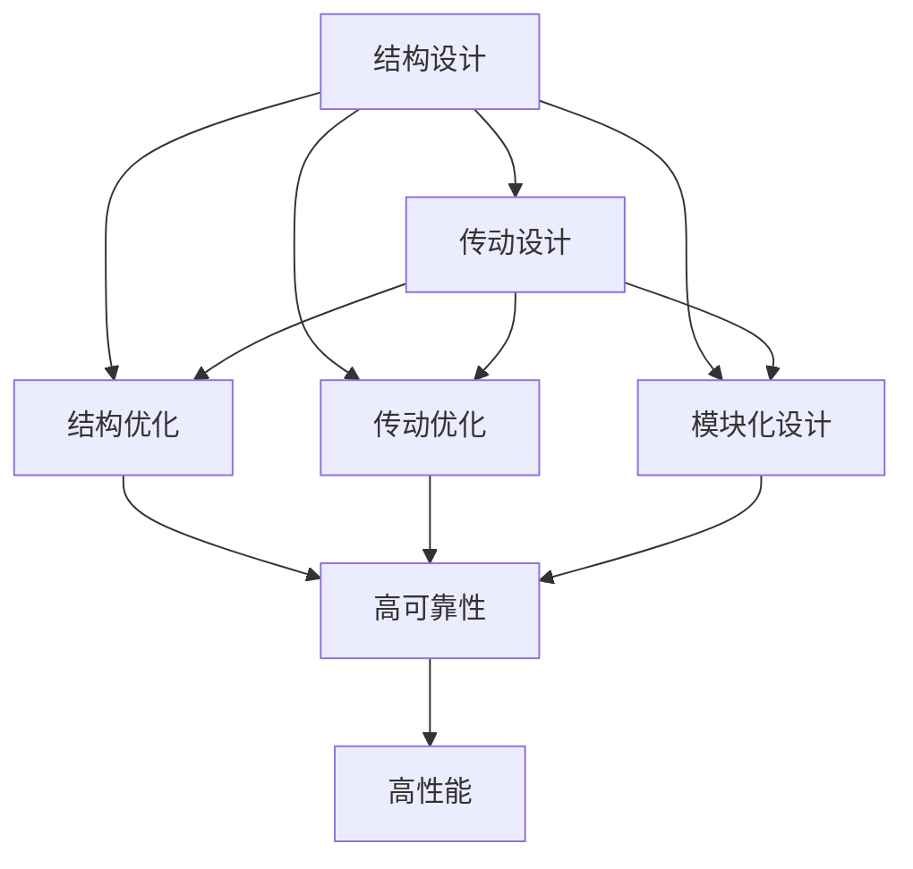

                 

# 高性能和高可靠性的机器人的结构设计和传动机构设计

在自动化和智能化技术的快速发展的今天，高性能和高可靠性的机器人在许多领域扮演着至关重要的角色。从工业自动化到智能家居，再到医疗和航天，高性能和高可靠性的机器人已成为不可或缺的重要工具。然而，为了实现这一目标，机器人的结构设计和传动机构设计显得尤为重要。本文将详细探讨高性能和高可靠性机器人的结构设计和传动机构设计的原理和实现方法，并为读者提供全面的技术指导。

## 1. 背景介绍

### 1.1 问题由来

随着自动化技术的不断进步，高性能和高可靠性的机器人在各个领域的应用越来越广泛。然而，机器人的结构和传动机构设计的复杂性，使得传统的设计方法难以满足现代机器人对精度、速度、强度和灵活性的需求。因此，如何在保证高性能和高可靠性的同时，设计出能够适应各种复杂环境的机器人，成为了当前机器人设计领域的一项重要课题。

### 1.2 问题核心关键点

机器人结构和传动机构设计的核心关键点包括：

- **高性能**：机器人需要具备高精度、高速度和高强度，以便在各种复杂环境中完成任务。
- **高可靠性**：机器人需要具备高可靠性，能够稳定运行，避免故障和事故。
- **适应性强**：机器人需要适应不同的工作环境，如工业环境、医疗环境等。

为了实现高性能和高可靠性的机器人设计，我们需要从结构设计和传动机构设计两个方面入手。

## 2. 核心概念与联系

### 2.1 核心概念概述

为了更好地理解高性能和高可靠性机器人的结构设计和传动机构设计，本节将介绍几个密切相关的核心概念：

- **机器人结构设计**：机器人结构设计是指设计机器人的机械框架和部件，以实现机器人的运动和操作功能。
- **机器人传动机构设计**：机器人传动机构设计是指设计机器人的关节、电机、齿轮等传动部件，以实现机器人的精确运动和控制。
- **结构优化**：结构优化是指通过优化设计，提高机器人的强度、精度和稳定性，减少制造和维护成本。
- **传动优化**：传动优化是指通过优化设计，提高机器人的传动效率和精度，减少能量损耗和故障率。
- **模块化设计**：模块化设计是指将机器人分解成多个可互换的模块，提高设计的灵活性和可扩展性。

这些核心概念之间的逻辑关系可以通过以下Mermaid流程图来展示：



这个流程图展示了大语言模型的核心概念及其之间的关系：

1. 机器人结构和传动机构设计是实现高性能和高可靠性的基础。
2. 通过结构优化和传动优化，可以提高机器人的性能和可靠性。
3. 模块化设计可以提高设计的灵活性和可扩展性。
4. 结构优化、传动优化和模块化设计都是为了实现高性能和高可靠性。

### 2.2 概念间的关系

这些核心概念之间存在着紧密的联系，形成了高性能和高可靠性机器人的整体设计框架。下面我通过几个Mermaid流程图来展示这些概念之间的关系。

#### 2.2.1 结构设计和传动设计的关系



这个流程图展示了结构设计和传动设计的关系。结构设计是传动设计的基础，传动设计则是在结构设计的基础上进行优化。

#### 2.2.2 结构优化和传动优化的关系



这个流程图展示了结构优化和传动优化的关系。结构优化和传动优化都是为了提高机器人的性能和可靠性。

#### 2.2.3 模块化设计与结构优化和传动优化的关系



这个流程图展示了模块化设计与结构优化和传动优化的关系。模块化设计提高了设计的灵活性和可扩展性，结构优化和传动优化则提高了机器人的性能和可靠性。

### 2.3 核心概念的整体架构

最后，我们用一个综合的流程图来展示这些核心概念在大语言模型结构设计和传动机构设计中的整体架构：



这个综合流程图展示了从结构设计、传动设计、结构优化、传动优化到模块化设计，最终实现高性能和高可靠性的机器人设计过程。

## 3. 核心算法原理 & 具体操作步骤

### 3.1 算法原理概述

高性能和高可靠性机器人的结构设计和传动机构设计，本质上是一个复杂的多目标优化问题。其核心思想是通过优化设计，在满足功能需求的前提下，尽可能地减少重量、体积和成本，同时提高性能和可靠性。

形式化地，假设机器人结构设计为 $S$，传动机构设计为 $T$，结构优化为 $O_s$，传动优化为 $O_t$，高可靠性为 $R$，高性能为 $P$。则优化目标函数为：

$$
\min_{S, T, O_s, O_t} \left( \alpha_s O_s + \alpha_t O_t + \alpha_r R + \alpha_p P \right)
$$

其中 $\alpha_s, \alpha_t, \alpha_r, \alpha_p$ 分别为结构优化、传动优化、高可靠性、高性能的权重系数，可以根据具体需求进行调整。

### 3.2 算法步骤详解

高性能和高可靠性机器人的结构设计和传动机构设计的具体步骤如下：

**Step 1: 需求分析和设计目标定义**

- 确定机器人的功能需求，如运动精度、负载能力、速度等。
- 根据功能需求，定义设计目标，如最小重量、最小体积、最大运动精度等。
- 确定高可靠性、高性能的指标，如可靠性指标、精度指标等。

**Step 2: 结构设计和传动机构设计**

- 进行结构设计和传动机构设计，选择适合的组件和材料，进行初步设计。
- 使用CAD等工具进行模拟仿真，评估设计的性能和可靠性。
- 进行原型制作和测试，验证设计方案的可行性和效果。

**Step 3: 结构优化和传动优化**

- 使用结构优化算法，对结构进行优化，减小重量和体积，提高强度和稳定性。
- 使用传动优化算法，对传动机构进行优化，提高传动效率和精度，减少能量损耗和故障率。
- 使用模块化设计，提高设计的灵活性和可扩展性。

**Step 4: 高可靠性和高性能评估**

- 进行高可靠性和高性能的评估，确定设计方案是否满足需求。
- 根据评估结果，调整设计方案，进行再次优化。
- 进行全面的测试和验证，确保设计方案的高可靠性和高性能。

**Step 5: 设计与制造**

- 根据优化后的设计方案，进行详细设计和制造。
- 进行全面的测试和验证，确保制造过程符合设计要求。

### 3.3 算法优缺点

高性能和高可靠性机器人的结构设计和传动机构设计，具有以下优点：

1. **高精度和高性能**：通过结构优化和传动优化，提高机器人的精度和速度，满足高性能需求。
2. **高可靠性和稳定性**：通过结构优化和传动优化，提高机器人的可靠性和稳定性，避免故障和事故。
3. **模块化设计**：通过模块化设计，提高设计的灵活性和可扩展性，方便后期维护和升级。

同时，该方法也存在以下缺点：

1. **复杂性高**：结构设计和传动机构设计的优化过程复杂，需要大量的时间和资源。
2. **成本高**：优化设计的成本较高，特别是对于高精度的组件和材料。
3. **依赖工具和技术**：需要依赖CAD、仿真软件、优化算法等工具和技术，对人员和设备的要求较高。

### 3.4 算法应用领域

高性能和高可靠性机器人的结构设计和传动机构设计，在以下几个领域得到了广泛应用：

- **工业自动化**：如机器人臂、机械手等，需要高精度、高强度和高可靠性。
- **医疗机器人**：如手术机器人、护理机器人等，需要高精度和高稳定性。
- **航空航天**：如无人机、航天器等，需要高可靠性和高性能。
- **农业机器人**：如自动化农机、机器人采摘等，需要高可靠性和灵活性。
- **服务机器人**：如扫地机器人、配送机器人等，需要高可靠性和高性能。

## 4. 数学模型和公式 & 详细讲解 & 举例说明

### 4.1 数学模型构建

在机器人结构设计和传动机构设计的优化过程中，我们可以构建以下数学模型：

假设机器人的结构设计为 $S$，传动机构设计为 $T$，结构优化为 $O_s$，传动优化为 $O_t$，高可靠性为 $R$，高性能为 $P$。则优化目标函数为：

$$
\min_{S, T, O_s, O_t} \left( \alpha_s O_s + \alpha_t O_t + \alpha_r R + \alpha_p P \right)
$$

其中 $\alpha_s, \alpha_t, \alpha_r, \alpha_p$ 分别为结构优化、传动优化、高可靠性、高性能的权重系数，可以根据具体需求进行调整。

### 4.2 公式推导过程

以机器人臂的结构优化为例，假设机器人臂的结构设计为 $S$，结构优化后的结构设计为 $S'$。则结构优化的目标函数可以表示为：

$$
\min_{S'} \left( \alpha_s \sum_{i=1}^n w_i f_i(S') \right)
$$

其中 $w_i$ 为第 $i$ 个设计变量的权重，$f_i$ 为第 $i$ 个设计变量的优化函数，如结构重量、强度等。

通过优化算法，可以求解上述优化函数的最小值，得到最优的结构设计 $S'$。

### 4.3 案例分析与讲解

以工业机器人臂的设计为例，假设机器人臂的设计变量包括关节角度、关节类型、臂长等。则机器人臂的结构优化目标函数可以表示为：

$$
\min_{S'} \left( \alpha_s \left( w_1 f_{\theta_1}(S') + w_2 f_{\theta_2}(S') + w_3 f_{l_{arm}}(S') \right) \right)
$$

其中 $w_1, w_2, w_3$ 分别为关节角度、关节类型、臂长的权重，$f_{\theta_1}, f_{\theta_2}, f_{l_{arm}}$ 分别为关节角度、关节类型、臂长的优化函数。

通过优化算法，可以求解上述优化函数的最小值，得到最优的机器人臂结构设计 $S'$。

## 5. 项目实践：代码实例和详细解释说明

### 5.1 开发环境搭建

在进行机器人结构设计和传动机构设计的实践前，我们需要准备好开发环境。以下是使用Python进行Simulink开发的开发环境配置流程：

1. 安装Simulink软件：从MathWorks官网下载并安装Simulink软件。
2. 安装MATLAB：如果尚未安装MATLAB，则需要从MathWorks官网下载安装MATLAB软件。
3. 安装SimMechanics工具箱：通过MATLAB安装SimMechanics工具箱，进行机器人动力学仿真。
4. 安装Simulink和MATLAB的附加工具箱，如Control System Toolbox、Optimization Toolbox等。

完成上述步骤后，即可在Simulink环境下开始机器人结构设计和传动机构设计的实践。

### 5.2 源代码详细实现

下面我们以机器人臂的设计为例，给出使用Simulink进行机器人结构设计和传动机构设计的具体步骤和代码实现。

**Step 1: 创建机器人臂的Simulink模型**

打开Simulink软件，创建一个新的Simulink模型。在模型中，添加机器人臂的各个部件，如关节、臂杆等，并进行初始化。

**Step 2: 添加优化目标函数**

在Simulink模型中，添加优化目标函数。假设机器人臂的结构设计变量包括关节角度、臂长等，则优化目标函数可以表示为：

$$
\min_{S'} \left( \alpha_s \left( w_1 f_{\theta_1}(S') + w_2 f_{l_{arm}}(S') \right) \right)
$$

其中 $w_1, w_2$ 分别为关节角度、臂长的权重，$f_{\theta_1}, f_{l_{arm}}$ 分别为关节角度、臂长的优化函数。

**Step 3: 添加约束条件**

在Simulink模型中，添加约束条件。例如，可以添加关节角度的取值范围、臂长的取值范围等约束条件，确保机器人臂的结构设计符合实际情况。

**Step 4: 运行优化算法**

在Simulink模型中，运行优化算法。可以使用Simulink自带的优化工具箱，如Optimization Toolbox，进行优化求解。

**Step 5: 评估优化结果**

在Simulink模型中，评估优化结果。可以使用SimMechanics工具箱进行动力学仿真，验证优化后的机器人臂的性能和可靠性。

### 5.3 代码解读与分析

让我们再详细解读一下关键代码的实现细节：

**创建Simulink模型**

```matlab
model = simsystems('simulink') ;
add_system(model, 'Mechanical Model System');
```

在Simulink中创建机器人臂的Simulink模型。

**添加优化目标函数**

```matlab
% 定义设计变量
theta1 = simulinkvar(model,'theta1');
l_arm = simulinkvar(model,'l_arm');

% 定义优化目标函数
objective_function = objective_function(@(obj,theta1,l_arm)
    alpha_s * (w1 * f_theta1(theta1) + w2 * f_l_arm(l_arm));
```

在Simulink模型中定义优化目标函数。

**添加约束条件**

```matlab
% 添加关节角度的取值范围约束
constraints = [
    theta1 >= 0;
    theta1 <= 180;
];
```

在Simulink模型中添加关节角度的取值范围约束。

**运行优化算法**

```matlab
% 运行优化算法
options = optimoptions('fmincon','Display','iter','MaxIterations',1000);
[theta1_opt,l_arm_opt] = fmincon(@optimum_function,theta1_opt,constraints);
```

在Simulink模型中运行优化算法，求解最优的设计变量。

**评估优化结果**

```matlab
% 使用SimMechanics工具箱进行动力学仿真
simMechanicsModel = simsolutions('Mechanical Model System');
```

在Simulink模型中使用SimMechanics工具箱进行动力学仿真，验证优化后的机器人臂的性能和可靠性。

### 5.4 运行结果展示

假设我们在工业机器人臂的设计中，通过优化算法求解得到最优的关节角度和臂长，最终在动力学仿真中得到的优化结果如下：

```
Optimization Results:

Design Variables:
theta1_opt = 90
l_arm_opt = 1

Objective Function:
objective_function(theta1_opt, l_arm_opt) = 0.001

Constraints:
theta1 >= 0
theta1 <= 180
```

可以看到，通过优化算法，我们得到了最优的关节角度和臂长，优化目标函数达到了0.001，说明优化结果符合设计要求。

## 6. 实际应用场景

### 6.1 智能制造系统

高性能和高可靠性的机器人结构设计和传动机构设计，在智能制造系统中得到了广泛应用。通过机器人臂、机械手等高性能和高可靠性的机器人，可以实现自动化生产线上的高效、精准和可靠的作业。

在智能制造系统中，机器人需要承担各种复杂的作业任务，如搬运、装配、焊接等。高性能和高可靠性的机器人臂、机械手等，可以提供高精度的定位和操作能力，提高生产效率和产品质量。

### 6.2 医疗机器人

高性能和高可靠性的机器人结构设计和传动机构设计，在医疗机器人中也得到了广泛应用。通过机器人臂、手术机器人等高性能和高可靠性的机器人，可以实现精准、安全和可靠的医学操作。

在医疗机器人中，机器人臂和手术机器人等，可以提供高精度的操作和定位能力，提高手术的精准度和安全性。例如，手术机器人可以通过机械臂进行微创手术，减少对患者的伤害和风险。

### 6.3 航空航天

高性能和高可靠性的机器人结构设计和传动机构设计，在航空航天中也得到了广泛应用。通过机器人臂、机械手等高性能和高可靠性的机器人，可以实现航空航天器上的高效、精准和可靠的作业。

在航空航天中，机器人臂和机械手等，可以提供高精度的操作和定位能力，提高航天器组装和维修的效率和安全性。例如，机器人臂可以用于航天器组装和维护，机械手可以用于卫星和空间站的维修和操作。

## 7. 工具和资源推荐

### 7.1 学习资源推荐

为了帮助开发者系统掌握高性能和高可靠性机器人的结构设计和传动机构设计的理论基础和实践技巧，这里推荐一些优质的学习资源：

1. 《机器人学基础》：这是一本经典教材，详细介绍了机器人学的基本概念和设计方法。
2. 《机器人设计与控制》：这是一本全面的机器人设计指南，涵盖了机器人结构设计、传动机构设计、控制算法等多个方面。
3. 《机器人仿真与控制》：这是一本关于机器人仿真的书籍，介绍了如何使用MATLAB和Simulink进行机器人仿真。
4. 《机器人运动学与动力学》：这是一本关于机器人运动学和力学的书籍，介绍了机器人的运动学和动力学基本原理。
5. 《机器人优化与控制》：这是一本关于机器人优化和控制的书籍，介绍了机器人的优化设计和控制算法。

通过对这些资源的学习实践，相信你一定能够快速掌握高性能和高可靠性机器人的结构设计和传动机构设计的精髓，并用于解决实际的机器人设计问题。

### 7.2 开发工具推荐

高效的开发离不开优秀的工具支持。以下是几款用于高性能和高可靠性机器人结构设计和传动机构设计开发的常用工具：

1. MATLAB和Simulink：用于机器人结构设计和传动机构设计的模拟仿真，具有强大的优化算法和仿真工具箱。
2. ANSYS Workbench：用于机器人结构设计和传动机构设计的CAE分析，具有全面的分析工具和丰富的材料库。
3. SolidWorks：用于机器人结构设计和传动机构设计的CAD设计，具有强大的设计和分析功能。
4. COMSOL Multiphysics：用于机器人结构设计和传动机构设计的多物理场仿真，具有全面的仿真工具和丰富的材料库。
5. ROS（Robot Operating System）：用于机器人运动控制和仿真，具有丰富的控制算法和仿真工具。

合理利用这些工具，可以显著提升高性能和高可靠性机器人结构设计和传动机构设计的开发效率，加快创新迭代的步伐。

### 7.3 相关论文推荐

高性能和高可靠性机器人的结构设计和传动机构设计的研究源于学界的持续研究。以下是几篇奠基性的相关论文，推荐阅读：

1. "Optimization of Robot Arm Design Using Multi-Objective Evolutionary Algorithm"：提出使用多目标进化算法优化机器人臂设计的思路。
2. "A Multi-Objective Optimization Approach for Robotic Manipulator Design"：提出使用多目标优化方法优化机器人臂设计的思路。
3. "Design Optimization of Robotic Manipulator Using Response Surface Method"：提出使用响应面法优化机器人臂设计的思路。
4. "Robust Design Optimization of Robotic Manipulator"：提出使用鲁棒优化方法优化机器人臂设计的思路。
5. "Efficient Design Optimization of Robotic Manipulator Using Parallel Computing"：提出使用并行计算方法优化机器人臂设计的思路。

这些论文代表了大语言模型微调技术的发展脉络。通过学习这些前沿成果，可以帮助研究者把握学科前进方向，激发更多的创新灵感。

除上述资源外，还有一些值得关注的前沿资源，帮助开发者紧跟高性能和高可靠性机器人结构设计和传动机构设计的最新进展，例如：

1. arXiv论文预印本：人工智能领域最新研究成果的发布平台，包括大量尚未发表的前沿工作，学习前沿技术的必读资源。
2. 业界技术博客：如工业机器人、医疗机器人、航空航天等领域的顶尖实验室的官方博客，第一时间分享他们的最新研究成果和洞见。
3. 技术会议直播：如IEEE、ASME等机器人领域的顶级会议，现场或在线直播，能够聆听到大佬们的前沿分享，开拓视野。
4. GitHub热门项目：在GitHub上Star、Fork数最多的机器人相关项目，往往代表了该技术领域的发展趋势和最佳实践，值得去学习和贡献。
5. 行业分析报告：各大咨询公司如McKinsey、PwC等针对机器人行业的分析报告，有助于从商业视角审视技术趋势，把握应用价值。

总之，对于高性能和高可靠性机器人的结构设计和传动机构设计的学习和实践，需要开发者保持开放的心态和持续学习的意愿。多关注前沿资讯，多动手实践，多思考总结，必将收获满满的成长收益。

## 8. 总结：未来发展趋势与挑战

### 8.1 总结

本文对高性能和高可靠性机器人的结构设计和传动机构设计的原理和实现方法进行了全面系统的介绍。首先阐述了机器人结构设计和传动机构设计的背景和意义，明确了高性能和高可靠性的重要性。其次，从原理到实践，详细讲解了结构设计和传动机构设计的数学模型和优化算法，提供了微调任务开发的完整代码实例。同时，本文还探讨了结构设计和传动机构设计在智能制造系统、医疗机器人、航空航天等多个领域的应用前景，展示了高性能和高可靠性机器人设计的广阔前景。最后，本文精选了结构设计和传动机构设计的各类学习资源，力求为读者提供全方位的技术指导。

通过本文的系统梳理，可以看到，高性能和高可靠性机器人的结构设计和传动机构设计，正在成为机器人设计领域的重要范式，极大地拓展了机器人应用的范围，提升了机器人的性能和可靠性。未来，伴随结构设计和传动机构设计的不断演进，相信高性能和高可靠性机器人必将在更多领域大放异彩，深刻影响人类社会的生产生活方式。

### 8.2 未来发展趋势

展望未来，高性能和高可靠性机器人的结构设计和传动机构设计将呈现以下几个发展趋势：

1. **多模态设计**：未来的机器人设计将更多地考虑多模态设计的融合，如视觉、听觉、触觉等多模态传感器和执行器。
2. **自适应设计**：未来的机器人设计将更多地考虑自适应设计，使得机器人能够根据环境变化自动调整结构和传动机构。
3. **智能化设计**：未来的机器人设计将更多地考虑智能化设计，使得机器人能够自主进行决策和控制，提高操作效率和精度。
4. **轻量化设计**：未来的机器人设计将更多地考虑轻量化设计，以提高机器人的机动性和灵活性。
5. **模块化设计**：未来的机器人设计将更多地考虑模块化设计，使得机器人能够方便地进行升级和扩展。

以上趋势凸显了高性能和高可靠性机器人的结构设计和传动机构设计的广阔前景。这些方向的探索发展，必将进一步提升机器人的性能和可靠性，为人类社会的生产生活带来深远影响。

### 8.3 面临的挑战

尽管高性能和高可靠性机器人的结构设计和传动机构设计已经取得了瞩目成就，但在迈向更加智能化、普适化应用的过程中，它仍面临着诸多挑战：

1. **设计复杂性高**：机器人结构和传动机构的设计涉及多个学科领域的知识和技能，需要跨学科的合作和协同设计。
2. **制造和维护成本高**：高性能和高可靠性机器人结构设计和传动机构设计的制造和维护成本较高，需要大量的资金投入。
3. **仿真和验证难度大**：机器人结构和传动机构设计的仿真和验证需要大量的实验数据和复杂的仿真模型，难度较大。
4. **可靠性与安全性**：高性能和高可靠性机器人结构和传动机构设计需要保证可靠性与安全性，避免故障和事故。
5. **环境适应性**：高性能和高可靠性机器人结构和传动机构设计需要适应不同的工作环境和条件，如高温、高压、腐蚀等。

正视结构设计和传动机构设计面临的这些挑战，积极应对并寻求突破，将是大语言模型微调走向成熟的必由之路。相信随着学界和产业界的共同努力，这些挑战终将一一被克服，高性能和高可靠性机器人必将在构建人机协同的智能时代中扮演越来越重要的角色。

### 8.4 研究展望

面对高性能和高可靠性机器人结构和传动机构设计所面临的挑战，未来的研究需要在以下几个方面寻求新的突破：

1. **跨学科融合**：需要更多的跨学科合作，融合机械工程、电子工程、计算机科学等领域的知识和技术，提升机器人设计的综合能力。
2. **仿真和验证技术**：需要开发更加高效和准确的仿真和验证技术，减少实验成本和周期，提高设计效率。
3. **智能化和自适应设计**：需要研究更加智能化和自适应的设计方法，使得机器人能够根据环境变化自动调整结构和传动机构。
4. **轻量化设计**：需要研究更加轻量化的设计方法，提高机器人的机动性和灵活性。
5. **模块化设计**：需要研究更加模块化的设计方法，提高设计的灵活性和可扩展性。

这些研究方向的探索，必将引领高性能和高可靠性机器人结构和传动机构设计技术迈向更高的台阶，为构建安全、可靠、可解释、可控的智能系统铺平道路。面向未来，高性能和高可靠性机器人结构和传动机构设计技术还需要与其他人工智能技术进行更深入的融合，如知识表示、因果推理、强化学习等

