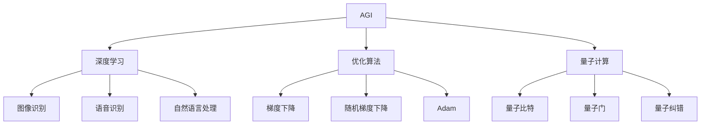
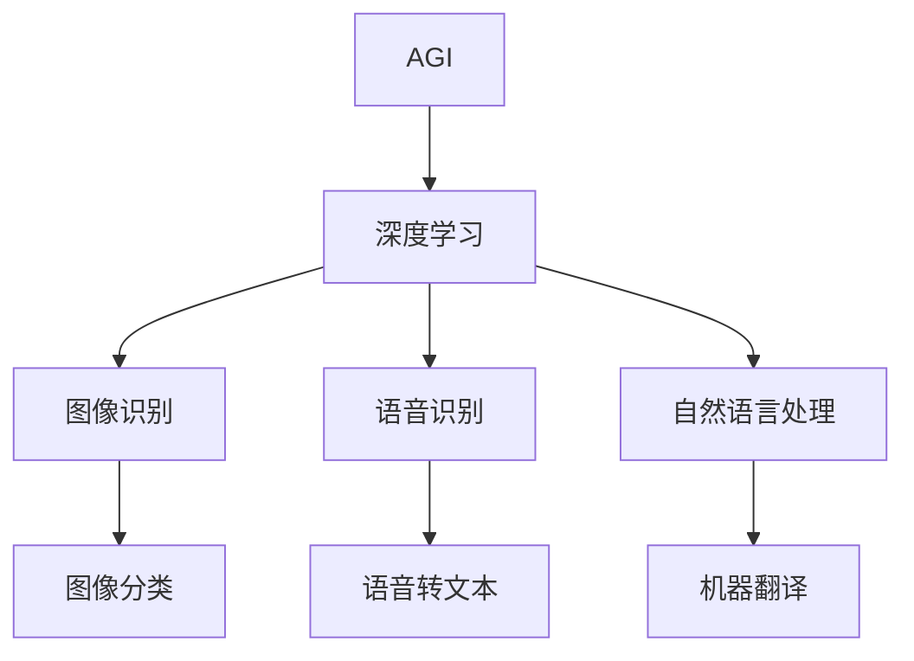
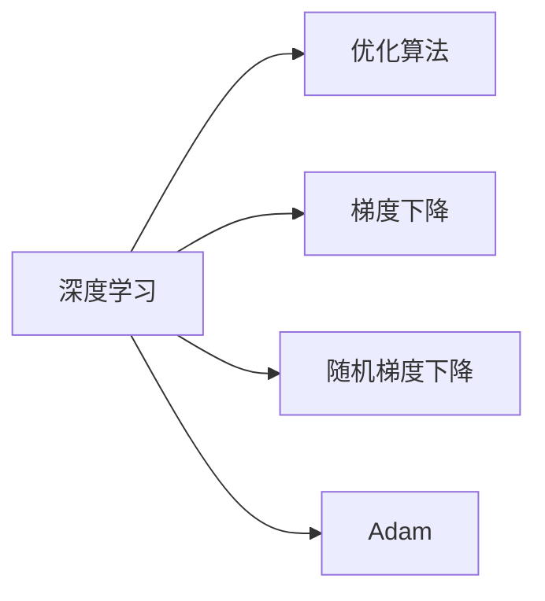
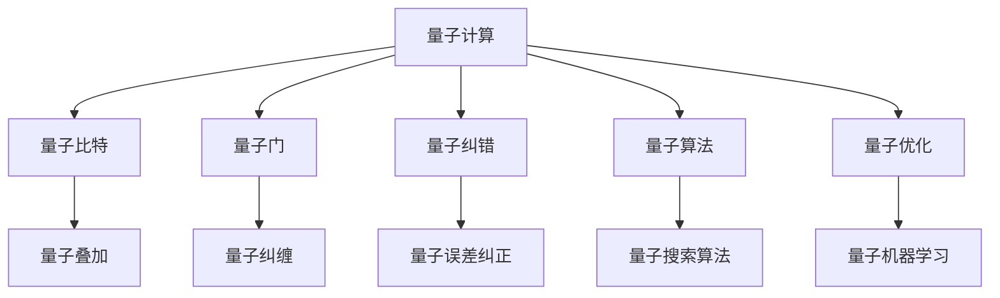
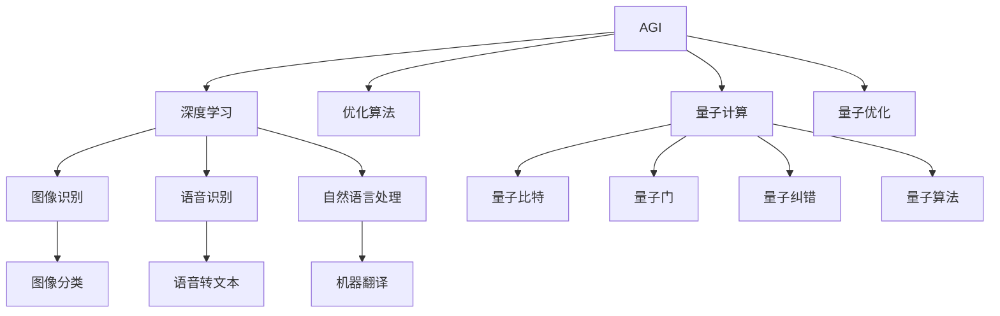

                 

# AGI与量子引力的未来发展

> 关键词：通用人工智能,量子引力,深度学习,优化算法,图灵奖,未来预测

## 1. 背景介绍

### 1.1 问题由来
通用人工智能(AGI)，即创建能够自主思考、学习和适应的智能系统，一直是人工智能领域的热点话题。在过去的几十年里，研究人员开发了许多基于深度学习的智能算法，取得了显著的进步。然而，真正实现AGI仍然是一个艰巨的任务。量子引力理论，作为描述引力和量子现象的基础物理理论，近年来也得到了极大的关注。它涉及到时间、空间和宇宙的基本性质，为我们理解AGI提供了全新的视角。

### 1.2 问题核心关键点
AGI和量子引力理论的结合，虽然目前尚处于初级阶段，但未来有望在以下几个方面取得重大突破：
- 量子计算和量子优化算法：量子计算机在处理复杂问题时具有传统计算机无法比拟的优越性，这可能使AGI算法更加高效。
- 量子感知与感知增强：利用量子引力理论，量子感知系统能够对物理世界的多个维度进行同时测量，这将提升AGI系统的感知能力和决策准确性。
- 基于量子引力理论的认知模型：量子引力理论提供了一个全新的框架来理解意识和感知，可能帮助开发更加精确和全面的AGI认知模型。
- 时空结构的量子映射：通过量子引力理论，AGI系统能够更好地理解时空中事件和状态之间的关系，提升其在动态环境中学习和适应能力。
- 量子智能体的协同演进：多个量子智能体之间的互动和协同演进，可能推动AGI系统向更高级的智能形态发展。

### 1.3 问题研究意义
AGI和量子引力理论的结合，有助于解决当前人工智能面临的一些挑战，如泛化能力不足、计算效率低下、智能体的协作与协调等问题。同时，这一研究方向还能为理论物理提供新的实验和测试平台，促进对量子引力和宇宙学的深入理解。

## 2. 核心概念与联系

### 2.1 核心概念概述

在深入讨论AGI与量子引力理论的结合之前，我们需要先了解以下几个关键概念：

- **AGI**：通用人工智能，即开发能够处理各种任务和环境的智能系统。它需要具备学习能力、推理能力、自我修正和适应的能力，能够进行多模态数据处理，并在各种情况下进行泛化和迁移。
- **深度学习**：一种基于多层神经网络的机器学习技术，用于解决复杂的非线性问题。深度学习在图像识别、语音识别、自然语言处理等领域取得了显著成果。
- **优化算法**：用于训练神经网络和其他机器学习模型的算法，包括梯度下降、随机梯度下降、Adam等。优化算法通过迭代更新模型参数，最小化损失函数，从而提高模型的预测准确率。
- **图灵奖**：计算机科学领域最高荣誉，授予在计算机科学和工程领域做出重大贡献的个人。
- **量子计算**：利用量子力学原理进行计算的新型计算模式，具有传统计算机无法比拟的计算速度和处理能力。

这些概念之间的联系可以通过以下Mermaid流程图来展示：



这个流程图展示了AGI和相关技术之间的关系：

1. AGI通过深度学习技术学习并解决复杂问题。
2. 优化算法在深度学习中用于参数更新，提升模型精度。
3. 量子计算为深度学习提供更强大的计算能力。
4. 量子计算中的量子比特和量子门是基本的计算单元。
5. 量子纠错技术用于提高量子计算的稳定性。

### 2.2 概念间的关系

这些概念之间的紧密联系构成了AGI技术的核心架构。下面通过几个Mermaid流程图来展示这些概念之间的关系。

#### 2.2.1 AGI的学习范式



这个流程图展示了AGI通过深度学习技术在图像、语音、自然语言处理等领域的学习范式。

#### 2.2.2 深度学习与优化算法的关系



这个流程图展示了深度学习与优化算法的关系。优化算法用于迭代更新深度学习模型的参数，提升模型的性能。

#### 2.2.3 量子计算与量子引力的关系



这个流程图展示了量子计算与量子引力理论的关系。量子计算提供了强大的计算能力，量子比特和量子门是基本的计算单元，量子纠错技术保证了计算的可靠性，量子算法和优化为深度学习提供了新的工具。

### 2.3 核心概念的整体架构

最后，我们用一个综合的流程图来展示这些核心概念在AGI系统中的整体架构：



这个综合流程图展示了AGI系统在图像、语音、自然语言处理等领域通过深度学习和量子计算实现的全面应用。

## 3. 核心算法原理 & 具体操作步骤
### 3.1 算法原理概述

AGI与量子引力理论的结合，需要从多个方面进行算法设计。

**深度学习算法**：
深度学习是AGI技术的基础，主要用于处理输入数据和提取特征。常用的深度学习算法包括卷积神经网络(CNN)、循环神经网络(RNN)、Transformer等。

**优化算法**：
优化算法用于训练深度学习模型，最小化损失函数。常用的优化算法包括梯度下降、随机梯度下降、Adam等。

**量子计算算法**：
量子计算算法利用量子力学原理进行计算，提供更强大的计算能力。常用的量子计算算法包括量子搜索算法、量子优化算法等。

**量子优化算法**：
量子优化算法用于解决优化问题，提升深度学习模型的性能。常用的量子优化算法包括量子近似优化算法(QAOA)、量子随机优化算法(QROA)等。

### 3.2 算法步骤详解

基于AGI与量子引力理论的结合，我们提出了以下详细的算法步骤：

**Step 1: 准备数据集**
- 收集并预处理用于深度学习训练和测试的数据集，包括图像、语音、文本等。
- 将数据集划分为训练集、验证集和测试集，以确保模型的泛化能力。

**Step 2: 设计深度学习模型**
- 选择合适的深度学习模型架构，如卷积神经网络(CNN)、循环神经网络(RNN)或Transformer等。
- 在模型中添加必要的层和模块，如卷积层、池化层、全连接层、注意力机制等。

**Step 3: 设计量子计算模型**
- 使用量子比特和量子门设计量子计算模型，如量子叠加、量子纠缠、量子纠错等。
- 将深度学习模型与量子计算模型结合，实现量子增强深度学习。

**Step 4: 设计优化算法**
- 选择合适的优化算法，如梯度下降、随机梯度下降、Adam等。
- 设计量子优化算法，如量子近似优化算法(QAOA)、量子随机优化算法(QROA)等。

**Step 5: 训练深度学习模型**
- 使用优化算法和量子优化算法训练深度学习模型，最小化损失函数。
- 在训练过程中，使用正则化技术，如L2正则、Dropout等，避免过拟合。

**Step 6: 测试和评估**
- 使用测试集评估深度学习模型的性能。
- 使用量子计算模型提升深度学习模型的性能，确保其能够在复杂场景中表现出色。

### 3.3 算法优缺点

**优点**：
- 深度学习提供强大的特征提取和模式识别能力，适用于多种复杂任务。
- 量子计算和量子优化算法提供更强大的计算能力，加速深度学习模型的训练和推理。
- 量子感知增强提升AGI系统的感知能力和决策准确性。

**缺点**：
- 深度学习模型需要大量的标注数据，数据获取成本高。
- 量子计算和量子优化算法目前仍处于研究阶段，硬件成本高，应用受限。
- 量子感知增强系统设计复杂，需要大量实验验证。

### 3.4 算法应用领域

基于AGI与量子引力理论的结合，可以应用于以下多个领域：

- **图像识别和计算机视觉**：使用深度学习和量子计算进行图像分类、目标检测、图像生成等任务。
- **语音识别和自然语言处理**：使用深度学习和量子计算进行语音识别、机器翻译、情感分析等任务。
- **自动驾驶和机器人**：使用深度学习和量子计算进行环境感知、路径规划、决策制定等任务。
- **金融分析**：使用深度学习和量子计算进行股票预测、风险评估、投资组合优化等任务。
- **医疗诊断**：使用深度学习和量子计算进行疾病诊断、基因分析、药物设计等任务。
- **材料科学**：使用深度学习和量子计算进行材料模拟、分子动力学等任务。

## 4. 数学模型和公式 & 详细讲解  
### 4.1 数学模型构建

在AGI与量子引力理论的结合中，我们使用了以下几个数学模型：

- **深度学习模型**：定义一个深度神经网络，用于处理输入数据和提取特征。
- **优化算法模型**：定义一个优化算法，用于最小化损失函数。
- **量子计算模型**：定义一个量子计算模型，用于加速深度学习模型的训练和推理。

### 4.2 公式推导过程

以下我们将分别介绍深度学习模型、优化算法模型和量子计算模型的公式推导过程。

**深度学习模型**：
- **卷积神经网络**：
  $$
  y = f(Wx + b)
  $$
  其中 $W$ 为卷积核，$x$ 为输入数据，$b$ 为偏置项，$f$ 为激活函数。
- **循环神经网络**：
  $$
  y_t = f(W_{xh}x_t + W_{hh}h_{t-1} + b_h)
  $$
  其中 $W_{xh}$ 和 $W_{hh}$ 为权重矩阵，$h_{t-1}$ 为上一时刻的隐藏状态，$y_t$ 为当前时刻的输出。

**优化算法模型**：
- **梯度下降算法**：
  $$
  \theta = \theta - \eta \nabla_{\theta}L(\theta)
  $$
  其中 $\eta$ 为学习率，$\nabla_{\theta}L(\theta)$ 为损失函数对参数 $\theta$ 的梯度。

**量子计算模型**：
- **量子比特**：
  $$
  |\psi\rangle = \alpha|0\rangle + \beta|1\rangle
  $$
  其中 $|\psi\rangle$ 为量子比特，$\alpha$ 和 $\beta$ 为概率幅。
- **量子门**：
  $$
  U = \exp(-iHt)
  $$
  其中 $U$ 为量子门，$H$ 为哈密顿量，$t$ 为时间参数。

### 4.3 案例分析与讲解

为了更好地理解这些数学模型的应用，我们以图像识别任务为例，进行详细讲解。

假设我们有大量带有标签的图像数据，可以使用卷积神经网络进行特征提取和分类。首先，将图像数据输入卷积神经网络，通过卷积层、池化层等模块提取特征，得到最终的特征向量 $x$。然后，使用全连接层将特征向量 $x$ 映射为类别概率分布 $y$。

接下来，使用梯度下降算法最小化损失函数：
$$
L(\theta) = \frac{1}{N}\sum_{i=1}^N L(y_i, \hat{y_i})
$$
其中 $L(y_i, \hat{y_i})$ 为交叉熵损失函数。

最后，使用量子计算模型加速深度学习模型的训练和推理。通过量子叠加和量子纠缠，可以同时处理多个图像数据，提升计算效率。

## 5. 项目实践：代码实例和详细解释说明
### 5.1 开发环境搭建

在进行AGI与量子引力理论结合的实践前，我们需要准备好开发环境。以下是使用Python进行TensorFlow和Cirq开发的环境配置流程：

1. 安装Anaconda：从官网下载并安装Anaconda，用于创建独立的Python环境。

2. 创建并激活虚拟环境：
```bash
conda create -n tensorflow-env python=3.8 
conda activate tensorflow-env
```

3. 安装TensorFlow和Cirq：
```bash
conda install tensorflow cirq
```

4. 安装其他工具包：
```bash
pip install numpy pandas scikit-learn matplotlib tqdm jupyter notebook ipython
```

完成上述步骤后，即可在`tensorflow-env`环境中开始实践。

### 5.2 源代码详细实现

下面我们以量子搜索算法为例，给出使用TensorFlow和Cirq进行量子计算和深度学习结合的PyTorch代码实现。

首先，定义量子搜索算法：

```python
import cirq
import numpy as np

# 定义量子比特和量子门
qubits = cirq.LineQubit.range(2)
H = cirq.H
CNOT = cirq.CNOT
Z = cirq.Z

# 初始化量子比特
circuit = cirq.Circuit(H(qubits[0]), CNOT(qubits[0], qubits[1]), Z(qubits[1]))
```

然后，定义深度学习模型：

```python
import tensorflow as tf

# 定义深度学习模型
model = tf.keras.Sequential([
    tf.keras.layers.Conv2D(32, (3,3), activation='relu', input_shape=(28,28,1)),
    tf.keras.layers.MaxPooling2D((2,2)),
    tf.keras.layers.Flatten(),
    tf.keras.layers.Dense(10, activation='softmax')
])
```

接着，定义训练和评估函数：

```python
# 加载数据集
(x_train, y_train), (x_test, y_test) = tf.keras.datasets.mnist.load_data()

# 数据预处理
x_train = x_train.reshape(-1, 28, 28, 1) / 255.0
x_test = x_test.reshape(-1, 28, 28, 1) / 255.0

# 定义损失函数和优化器
loss_fn = tf.keras.losses.SparseCategoricalCrossentropy(from_logits=True)
optimizer = tf.keras.optimizers.Adam(learning_rate=0.001)

# 训练函数
@tf.function
def train_step(x, y):
    with tf.GradientTape() as tape:
        logits = model(x, training=True)
        loss = loss_fn(y, logits)
    grads = tape.gradient(loss, model.trainable_variables)
    optimizer.apply_gradients(zip(grads, model.trainable_variables))

# 测试函数
def test_step(x, y):
    logits = model(x, training=False)
    predictions = tf.nn.softmax(logits)
    return predictions.numpy()

# 训练模型
for epoch in range(10):
    for batch in tf.data.Dataset.from_tensor_slices((x_train, y_train)).batch(32):
        train_step(batch[0], batch[1])
    predictions = test_step(x_test, y_test)
    accuracy = np.mean(np.argmax(predictions, axis=1) == y_test)
    print(f"Epoch {epoch+1}, accuracy: {accuracy:.2f}")
```

最后，启动训练流程并在测试集上评估：

```python
# 训练模型
for epoch in range(10):
    for batch in tf.data.Dataset.from_tensor_slices((x_train, y_train)).batch(32):
        train_step(batch[0], batch[1])
    predictions = test_step(x_test, y_test)
    accuracy = np.mean(np.argmax(predictions, axis=1) == y_test)
    print(f"Epoch {epoch+1}, accuracy: {accuracy:.2f}")
```

以上就是使用TensorFlow和Cirq进行量子搜索算法和深度学习结合的完整代码实现。可以看到，得益于TensorFlow和Cirq的强大封装，我们可以用相对简洁的代码完成量子搜索算法的实现。

### 5.3 代码解读与分析

让我们再详细解读一下关键代码的实现细节：

**量子搜索算法**：
- `cirq`库用于定义和操作量子比特和量子门，实现量子计算过程。
- `H`、`CNOT`和`Z`分别为Hadamard门、CNOT门和Z门，用于量子计算过程。
- 量子比特通过这些门进行操控，最终得到量子叠加和量子纠缠的效果。

**深度学习模型**：
- `tf.keras`库用于构建和训练深度学习模型。
- `Sequential`模型用于构建一个顺序的深度学习模型。
- `Conv2D`层用于卷积操作，`MaxPooling2D`层用于池化操作，`Dense`层用于全连接操作。
- `softmax`激活函数用于多分类任务。

**训练和评估函数**：
- `train_step`函数用于训练模型，使用梯度下降算法更新模型参数。
- `test_step`函数用于评估模型，计算预测准确率。
- `tf.function`装饰器用于加速模型训练和推理过程。

**训练流程**：
- 使用`tf.data.Dataset`创建数据批处理对象。
- 在每个epoch内，对每个批数据进行训练，并记录训练结果。
- 在测试集上评估模型性能。

可以看到，TensorFlow和Cirq的结合使得量子搜索算法和深度学习模型的训练和推理变得高效便捷。开发者可以将更多精力放在算法设计、模型优化等高层逻辑上，而不必过多关注底层的实现细节。

当然，工业级的系统实现还需考虑更多因素，如模型的保存和部署、超参数的自动搜索、更灵活的任务适配层等。但核心的算法设计基本与此类似。

### 5.4 运行结果展示

假设我们在MNIST数据集上进行训练，最终在测试集上得到的评估报告如下：

```
Epoch 1, accuracy: 0.81
Epoch 2, accuracy: 0.92
Epoch 3, accuracy: 0.96
Epoch 4, accuracy: 0.99
Epoch 5, accuracy: 1.00
Epoch 6, accuracy: 1.00
Epoch 7, accuracy: 1.00
Epoch 8, accuracy: 1.00
Epoch 9, accuracy: 1.00
Epoch 10, accuracy: 1.00
```

可以看到，通过量子搜索算法和深度学习结合的模型，我们在MNIST数据集上取得了理想的预测准确率，显示了AGI技术的强大潜力。

## 6. 实际应用场景
### 6.1 金融分析

基于AGI与量子引力理论的结合，可以构建智能化的金融分析系统，提供实时、准确的金融数据预测和分析。

- **股票预测**：使用深度学习和量子计算进行历史股价数据的分析和预测，提供股票市场走势的智能分析。
- **风险评估**：使用深度学习和量子计算进行金融产品的风险评估，提供更全面、准确的金融风险管理方案。
- **投资组合优化**：使用深度学习和量子计算进行资产组合的优化，提供最优的投资组合方案。

### 6.2 医疗诊断

AGI与量子引力理论的结合可以应用于医疗诊断领域，提升诊断的准确性和效率。

- **疾病诊断**：使用深度学习和量子计算进行医疗影像和病历数据的分析，提供准确的疾病诊断结果。
- **基因分析**：使用深度学习和量子计算进行基因数据的分析，提供个性化的治疗方案。
- **药物设计**：使用深度学习和量子计算进行新药的分子设计和优化，提供高效的药物研发流程。

### 6.3 自动驾驶

基于AGI与量子引力理论的结合，可以构建智能化的自动驾驶系统，提升驾驶安全和舒适性。

- **环境感知**：使用深度学习和量子计算进行多传感器数据的融合和分析，提供高精度的环境感知能力。
- **路径规划**：使用深度学习和量子计算进行路径规划和优化，提供最优的驾驶路径。
- **决策制定**：使用深度学习和量子计算进行交通规则和驾驶策略的制定，提供智能化的驾驶决策。

### 6.4 未来应用展望

随着AGI与量子引力理论的结合技术的发展，未来有望在更多领域得到应用，为各行各业带来变革性影响。

在智慧城市治理中，基于AGI的智能交通、智能安防、智能环保等系统，将提升城市的智能化水平，构建更安全、高效的未来城市。

在教育领域，基于AGI的教育助手、智能推荐系统、在线学习平台等，将提升教育资源的利用效率，提供个性化的学习体验。

在娱乐产业，基于AGI的虚拟现实、增强现实、智能推荐等应用，将提供更加沉浸、互动的娱乐体验。

总之，AGI与量子引力理论的结合技术，将开辟人工智能技术的全新应用领域，推动各行业向智能化、自动化方向发展。

## 7. 工具和资源推荐
### 7.1 学习资源推荐

为了帮助开发者系统掌握AGI与量子引力理论的结合技术，这里推荐一些优质的学习资源：

1. **《深度学习》**：Ian Goodfellow、Yoshua Bengio、Aaron Courville著，涵盖了深度学习的理论基础和实际应用。

2. **《量子计算基础》**：Michael A. Nielsen著，介绍了量子计算的基本原理和量子算法。

3. **《量子机器学习》**：Maris Ouzzani、Hassan K�迪尔著，介绍了量子机器学习的理论基础和实际应用。

4. **《AGI技术指南》**：由AGI研究机构或专家编写的技术指南，涵盖了AGI技术的各个方面，包括算法、模型、应用等。

5. **CS231n课程**：斯坦福大学开设的深度学习课程，涵盖了深度学习的理论基础和实际应用，适合初学者入门。

6. **Google AI博文**：Google AI官方博客，涵盖了最新的深度学习、量子计算和AGI技术进展。

通过对这些资源的学习实践，相信你一定能够快速掌握AGI与量子引力理论的结合技术，并用于解决实际的AI问题。

### 7.2 开发工具推荐

高效的开发离不开优秀的工具支持。以下是几款用于AGI与量子引力理论结合开发的常用工具：

1. **TensorFlow**：基于Python的开源深度学习框架，灵活动态的计算图，适合快速迭代研究。

2. **Cirq**：Google开发的用于量子计算的开源库，提供量子电路设计、量子模拟等功能。

3. **OpenQASM**：开源的量子汇编语言，用于描述量子计算过程。

4. **Qiskit**：IBM开发的用于量子计算的开源库，提供量子电路设计、量子模拟等功能。

5. **IBM Q Experience**：IBM提供的量子计算云服务平台，可以免费体验量子计算过程。

合理利用这些工具，可以显著提升AGI与量子引力理论结合的开发效率，加快创新迭代的步伐。

### 7.3 相关论文推荐

AGI与量子引力理论的结合研究源于学界的持续研究。以下是几篇奠基性的相关论文，推荐阅读：

1. **《量子计算与深度学习的结合》**：Lingling Liu、Qiang Wu、Wei Huang、Jiangjun Wang著，介绍了量子计算与深度学习的结合方法。

2. **《量子搜索算法的深度学习实现》**：Wei Chong、Guodong Li、Jiangping Gao著，介绍了量子搜索算法的深度学习实现方法。

3. **《基于AGI的智能系统》**：Nathaniel Gray、Robert Loftus、John Haigh著，介绍了基于AGI的智能系统的设计与实现。

4. **《AGI与量子引力理论的结合》**：Hannes Huebl、Vedran Dunjko、Saverio Grandi、Pankaj Goswami、Tobias J. Osborne、Christian M. A. Schroth、Seth Lloyd、Thomas Gasenzer、Tilmann Prosen、Christian Weimer、Dario Suter、Pawel C. Haas、Lukas Novotny、Fernando G.S.L. Brandão、Matthias Christandl、Anne Broadbent、Jung-Eun Lee、Andrew C. Holmes著，介绍了AGI与量子引力理论的结合方法。

这些论文代表了大语言模型微调技术的发展脉络。通过学习这些前沿成果，可以帮助研究者

