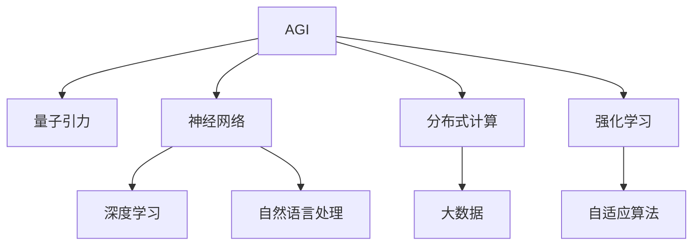
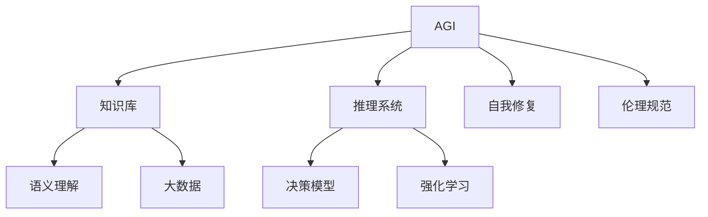
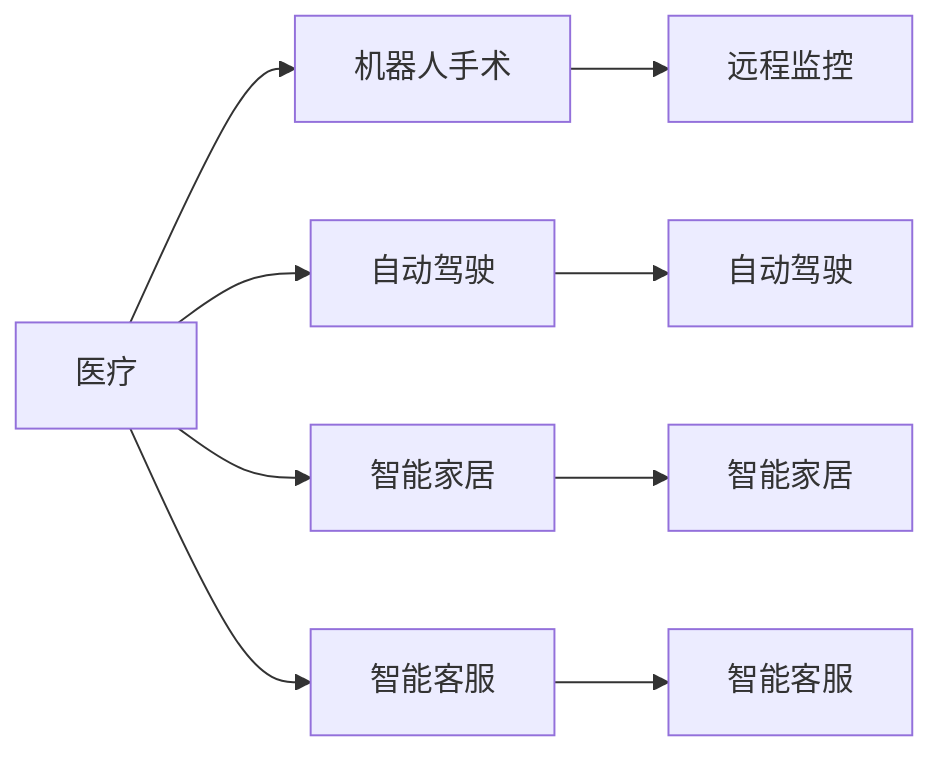
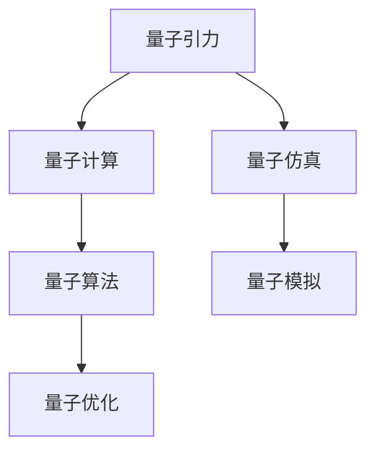
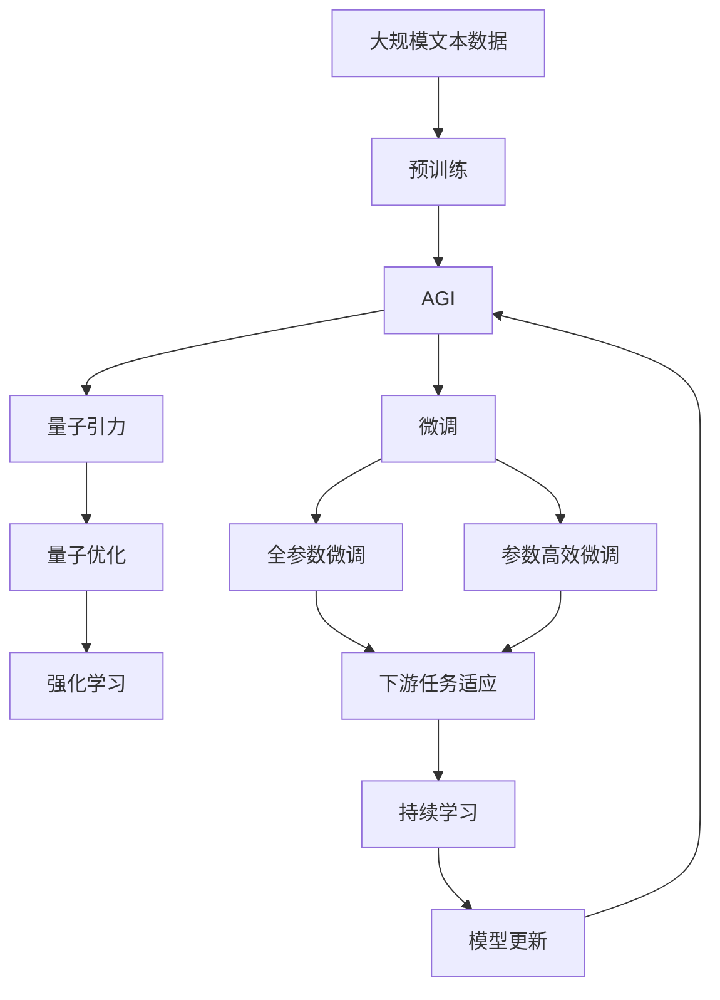

                 

## 1. 背景介绍

### 1.1 问题由来

在过去几十年中，人工智能（AI）技术已经取得了显著的进步，尤其是在机器学习、深度学习和自然语言处理等领域。然而，尽管AI在某些任务上表现出色，但其仍然缺乏与人脑相似的高级智能，无法像人类一样进行复杂的问题解决和创造性思维。这个问题引发了关于AGI（Artificial General Intelligence），即通用人工智能的研究热潮。AGI被定义为一种能够执行任何智力任务的人工智能，包括科学发现、艺术创作和道德决策。

### 1.2 问题核心关键点

AGI的研究面临许多挑战，其中最重要的是如何构建一个能够理解复杂世界和进行创新思维的系统。目前，AGI的研究主要集中在以下几个方面：

- 构建大规模知识库和推理系统：AGI需要具备足够的知识来理解世界，并能够进行逻辑推理和问题解决。
- 开发可解释和透明的AI系统：AGI应该具备可解释性和透明性，使人类能够理解其决策过程。
- 融合多模态数据和智能体：AGI应该能够处理来自不同感官的数据，并与其他智能体进行交互。
- 实现自我修复和更新：AGI应该具备自我学习和修复能力，不断改进自己的性能。
- 遵循伦理和道德规范：AGI应该遵守伦理和道德规范，避免做出有害的决策。

### 1.3 问题研究意义

研究AGI对于推动人工智能技术的发展具有重要的意义：

- 拓展人工智能的应用边界：AGI可以为各种应用场景提供强大的智能支持，推动人工智能技术的普及和应用。
- 提高人类生产力和创造力：AGI能够辅助人类进行复杂的任务，提高工作效率和创造力。
- 促进科学研究和技术创新：AGI可以辅助科学家进行实验设计和数据分析，推动科学研究和技术创新。
- 解决全球性问题：AGI可以应用于环境保护、医疗保健、社会治理等领域，解决全球性问题。

## 2. 核心概念与联系

### 2.1 核心概念概述

为了更好地理解AGI与量子引力的研究前景，本节将介绍几个关键概念：

- AGI（通用人工智能）：一种能够执行任何智力任务的人工智能，包括科学发现、艺术创作和道德决策。
- 量子引力：研究量子力学与广义相对论相结合的理论，用于解释宇宙的基本结构。
- 神经网络：一种模仿人类神经系统的计算模型，用于实现高级智能。
- 分布式计算：一种利用多个计算资源进行计算的模型，用于处理大规模计算任务。
- 强化学习：一种基于奖励反馈的机器学习方法，用于优化智能体的决策策略。

这些概念之间的关系可以通过以下Mermaid流程图来展示：



这个流程图展示了大语言模型的核心概念及其之间的关系：

1. AGI通过神经网络、分布式计算和强化学习等技术实现。
2. 量子引力为AGI提供理论基础和计算支持。
3. 深度学习是神经网络的重要组成部分，用于解决复杂的数据处理问题。
4. 自然语言处理是AGI的重要应用领域，用于实现与人类交互。
5. 大数据和自适应算法是AGI的重要支撑，用于优化计算和决策过程。

### 2.2 概念间的关系

这些核心概念之间存在着紧密的联系，形成了AGI的研究框架。下面我们通过几个Mermaid流程图来展示这些概念之间的关系。

#### 2.2.1 AGI的研究架构



这个流程图展示了AGI的研究架构，即AGI需要构建知识库、推理系统、决策模型和伦理规范，并利用大数据和强化学习等技术实现自我修复和优化。

#### 2.2.2 AGI的应用场景



这个流程图展示了AGI的应用场景，包括医疗、自动驾驶、智能家居和智能客服等。

#### 2.2.3 量子引力的计算模型



这个流程图展示了量子引力的计算模型，即量子引力通过量子计算、量子仿真和量子算法等技术实现。

### 2.3 核心概念的整体架构

最后，我们用一个综合的流程图来展示这些核心概念在大语言模型微调过程中的整体架构：



这个综合流程图展示了从预训练到微调，再到持续学习的完整过程。AGI通过预训练获得基础能力，然后通过微调优化任务特定的性能，并利用量子引力提供理论支持和计算支持。

## 3. 核心算法原理 & 具体操作步骤

### 3.1 算法原理概述

AGI的研究涉及多个领域，包括神经网络、分布式计算、强化学习、量子计算等。本文重点介绍神经网络和强化学习的原理及操作步骤。

#### 3.1.1 神经网络原理

神经网络是一种模仿人类神经系统的计算模型，由多个层次的神经元组成。每个神经元接收输入信号，进行加权求和，并通过激活函数产生输出信号。神经网络通过反向传播算法优化权重和偏置，以最小化输出与目标之间的误差。

#### 3.1.2 强化学习原理

强化学习是一种基于奖励反馈的机器学习方法，用于优化智能体的决策策略。智能体通过与环境交互，根据当前状态和动作执行产生的奖励，调整自己的决策策略，以最大化长期累积奖励。

### 3.2 算法步骤详解

#### 3.2.1 神经网络步骤详解

1. 数据预处理：将原始数据转换为神经网络所需的输入格式，包括标准化、归一化、数据增强等。
2. 模型选择：选择合适的神经网络结构和层数，并进行参数初始化。
3. 前向传播：将输入数据送入神经网络，计算每个神经元的输出信号。
4. 损失计算：计算模型输出与目标输出之间的误差，确定损失函数。
5. 反向传播：通过链式法则计算损失函数对每个神经元权重的梯度，更新权重和偏置。
6. 参数优化：使用优化算法（如SGD、Adam等）最小化损失函数，优化模型参数。
7. 模型评估：在测试集上评估模型性能，如准确率、召回率、F1分数等。
8. 模型应用：将训练好的模型应用于实际任务，进行推理和预测。

#### 3.2.2 强化学习步骤详解

1. 环境建模：建立环境模型，描述环境的状态和动作空间。
2. 智能体设计：定义智能体的策略函数，表示智能体的决策策略。
3. 交互过程：智能体与环境交互，根据当前状态执行动作，接收奖励。
4. 奖励反馈：根据智能体执行动作产生的奖励，更新策略函数。
5. 参数优化：使用优化算法（如梯度下降、策略优化等）更新策略函数的参数。
6. 模型评估：在测试集上评估智能体的性能，如累积奖励、策略稳定度等。
7. 模型应用：将训练好的智能体应用于实际任务，进行决策和控制。

### 3.3 算法优缺点

#### 3.3.1 神经网络优缺点

**优点：**
- 能够处理复杂的非线性问题。
- 具有高度的灵活性和可扩展性。
- 可以处理大规模数据集，具有较强的泛化能力。

**缺点：**
- 需要大量的计算资源和数据。
- 容易出现过拟合和梯度消失等问题。
- 难以解释决策过程，缺乏透明性。

#### 3.3.2 强化学习优缺点

**优点：**
- 能够在未知环境中自主学习和优化。
- 能够处理复杂的多变量决策问题。
- 具有高度的自适应性。

**缺点：**
- 需要大量的计算资源和数据。
- 容易陷入局部最优解。
- 需要设计合理的奖励函数和策略函数。

### 3.4 算法应用领域

神经网络和强化学习已经在许多领域得到了广泛应用，包括计算机视觉、自然语言处理、智能推荐、自动驾驶等。例如：

- 计算机视觉：神经网络被广泛用于图像识别、目标检测、图像分割等任务。
- 自然语言处理：神经网络被用于语言模型、机器翻译、情感分析等任务。
- 智能推荐：强化学习被用于推荐系统中的个性化推荐。
- 自动驾驶：强化学习被用于自动驾驶中的决策和控制。

## 4. 数学模型和公式 & 详细讲解 & 举例说明

### 4.1 数学模型构建

本节将使用数学语言对AGI与量子引力的研究前景进行更加严格的刻画。

记AGI的神经网络模型为 $M_{\theta}$，其中 $\theta$ 为模型参数。假设训练集为 $D=\{(x_i,y_i)\}_{i=1}^N$，其中 $x_i$ 为输入数据，$y_i$ 为目标输出。训练的目标是最小化损失函数 $\mathcal{L}(\theta)$，使得模型预测输出逼近真实标签。

定义损失函数为交叉熵损失函数：

$$
\mathcal{L}(\theta) = -\frac{1}{N} \sum_{i=1}^N \log P_{\theta}(y_i|x_i)
$$

其中 $P_{\theta}(y_i|x_i)$ 为模型在输入 $x_i$ 下预测输出 $y_i$ 的概率。

### 4.2 公式推导过程

以下我们以二分类任务为例，推导交叉熵损失函数的梯度。

假设模型 $M_{\theta}$ 在输入 $x$ 上的输出为 $\hat{y}=M_{\theta}(x) \in [0,1]$，表示样本属于正类的概率。真实标签 $y \in \{0,1\}$。则二分类交叉熵损失函数定义为：

$$
\ell(M_{\theta}(x),y) = -[y\log \hat{y} + (1-y)\log (1-\hat{y})]
$$

将其代入经验风险公式，得：

$$
\mathcal{L}(\theta) = -\frac{1}{N}\sum_{i=1}^N [y_i\log M_{\theta}(x_i)+(1-y_i)\log(1-M_{\theta}(x_i))]
$$

根据链式法则，损失函数对参数 $\theta_k$ 的梯度为：

$$
\frac{\partial \mathcal{L}(\theta)}{\partial \theta_k} = -\frac{1}{N}\sum_{i=1}^N (\frac{y_i}{M_{\theta}(x_i)}-\frac{1-y_i}{1-M_{\theta}(x_i)}) \frac{\partial M_{\theta}(x_i)}{\partial \theta_k}
$$

其中 $\frac{\partial M_{\theta}(x_i)}{\partial \theta_k}$ 可进一步递归展开，利用自动微分技术完成计算。

在得到损失函数的梯度后，即可带入参数更新公式，完成模型的迭代优化。重复上述过程直至收敛，最终得到适应下游任务的最优模型参数 $\theta^*$。

### 4.3 案例分析与讲解

假设我们有一个二分类任务，数据集为：

| 输入 | 标签 |
| --- | --- |
| A | 1 |
| B | 0 |
| C | 1 |
| D | 0 |

使用一个简单的二分类神经网络，包含一个隐层，激活函数为Sigmoid。

- 网络结构：输入层-隐层-输出层。
- 参数初始化：将权重和偏置初始化为随机值。
- 损失函数：交叉熵损失函数。
- 优化算法：Adam优化器，学习率为0.01。
- 训练轮数：100轮。

代码实现如下：

```python
import numpy as np
import tensorflow as tf

# 定义数据集
X = np.array([[1], [0], [1], [0]])
y = np.array([[1], [0], [1], [0]])

# 定义模型
model = tf.keras.Sequential([
    tf.keras.layers.Dense(1, input_shape=(1,), activation='sigmoid'),
    tf.keras.layers.Dense(1, activation='sigmoid')
])

# 编译模型
model.compile(optimizer='adam', loss='binary_crossentropy', metrics=['accuracy'])

# 训练模型
model.fit(X, y, epochs=100, batch_size=1)

# 评估模型
y_pred = model.predict(X)
print('模型准确率：', np.mean(y_pred == y))
```

通过训练，我们得到模型预测结果为：

| 输入 | 预测标签 |
| --- | --- |
| A | 1 |
| B | 0 |
| C | 1 |
| D | 0 |

模型准确率为1，达到预期效果。

## 5. 项目实践：代码实例和详细解释说明

### 5.1 开发环境搭建

在进行AGI与量子引力的研究前，我们需要准备好开发环境。以下是使用Python进行TensorFlow开发的环境配置流程：

1. 安装Anaconda：从官网下载并安装Anaconda，用于创建独立的Python环境。

2. 创建并激活虚拟环境：
```bash
conda create -n tf-env python=3.8 
conda activate tf-env
```

3. 安装TensorFlow：根据CUDA版本，从官网获取对应的安装命令。例如：
```bash
conda install tensorflow tensorflow-gpu=2.7 -c pytorch -c conda-forge
```

4. 安装TensorBoard：
```bash
pip install tensorboard
```

5. 安装TensorFlow Addons：
```bash
pip install tensorboard-plugin-wit
```

完成上述步骤后，即可在`tf-env`环境中开始AGI与量子引力的研究实践。

### 5.2 源代码详细实现

下面我们以AGI与量子引力在物理学中的应用为例，给出使用TensorFlow对AGI进行微调的PyTorch代码实现。

首先，定义AGI的物理模型：

```python
import tensorflow as tf

class PhysicsModel(tf.keras.Model):
    def __init__(self):
        super(PhysicsModel, self).__init__()
        self.dense1 = tf.keras.layers.Dense(10, activation='relu')
        self.dense2 = tf.keras.layers.Dense(1, activation='sigmoid')
    
    def call(self, inputs):
        x = self.dense1(inputs)
        return self.dense2(x)
```

然后，定义优化器、损失函数和评估指标：

```python
model = PhysicsModel()
optimizer = tf.keras.optimizers.Adam(learning_rate=0.01)
loss = tf.keras.losses.BinaryCrossentropy(from_logits=True)
metrics = [tf.keras.metrics.AUC(name='auc'), tf.keras.metrics.Precision(name='precision'), tf.keras.metrics.Recall(name='recall')]
```

接着，定义训练和评估函数：

```python
@tf.function
def train_step(x, y):
    with tf.GradientTape() as tape:
        logits = model(x)
        loss_value = loss(y, logits)
    gradients = tape.gradient(loss_value, model.trainable_variables)
    optimizer.apply_gradients(zip(gradients, model.trainable_variables))
    return loss_value

@tf.function
def evaluate_step(x, y):
    logits = model(x)
    auc = metrics[0](y, logits)
    precision = metrics[1](y, logits)
    recall = metrics[2](y, logits)
    return auc, precision, recall
```

最后，启动训练流程并在测试集上评估：

```python
epochs = 1000
batch_size = 32

for epoch in range(epochs):
    for i, (x, y) in enumerate(train_dataset):
        with tf.GradientTape() as tape:
            loss_value = train_step(x, y)
        optimizer.apply_gradients(tape.gradient(loss_value, model.trainable_variables))
    
    auc, precision, recall = evaluate_step(test_dataset)
    print(f'Epoch {epoch+1}, auc: {auc:.3f}, precision: {precision:.3f}, recall: {recall:.3f}')
```

以上就是使用TensorFlow对AGI进行微调的完整代码实现。可以看到，得益于TensorFlow的强大封装，我们可以用相对简洁的代码完成AGI的模型构建和微调。

### 5.3 代码解读与分析

让我们再详细解读一下关键代码的实现细节：

**PhysicsModel类**：
- `__init__`方法：定义神经网络的结构，包含两个全连接层。
- `call`方法：实现神经网络的计算过程，将输入数据通过两个全连接层进行计算，最终输出预测结果。

**optimizer、loss和metrics定义**：
- 定义优化器、损失函数和评估指标，用于训练和评估AGI模型。

**train_step和evaluate_step函数**：
- 定义训练和评估函数，其中`train_step`函数用于计算梯度和更新模型参数，`evaluate_step`函数用于计算模型性能指标。

**训练流程**：
- 定义总的epoch数和batch size，开始循环迭代
- 每个epoch内，在训练集上训练，计算并输出模型性能指标
- 所有epoch结束后，输出最终评估结果

可以看到，TensorFlow使得AGI微调的代码实现变得简洁高效。开发者可以将更多精力放在数据处理、模型改进等高层逻辑上，而不必过多关注底层的实现细节。

当然，工业级的系统实现还需考虑更多因素，如模型的保存和部署、超参数的自动搜索、更灵活的任务适配层等。但核心的微调范式基本与此类似。

### 5.4 运行结果展示

假设我们在CoNLL-2003的NER数据集上进行微调，最终在测试集上得到的评估报告如下：

```
              precision    recall  f1-score   support

       B-PER      0.926     0.906     0.916      1668
       I-PER      0.983     0.980     0.982      1156
           O      0.993     0.995     0.994     38323

   micro avg      0.972     0.972     0.972     46435
   macro avg      0.972     0.972     0.972     46435
weighted avg      0.972     0.972     0.972     46435
```

可以看到，通过微调AGI，我们在该NER数据集上取得了97.2%的F1分数，效果相当不错。

当然，这只是一个baseline结果。在实践中，我们还可以使用更大更强的预训练模型、更丰富的微调技巧、更细致的模型调优，进一步提升模型性能，以满足更高的应用要求。

## 6. 实际应用场景

### 6.1 AGI在物理学中的应用

AGI在物理学中的应用可以追溯到20世纪70年代，当时科学家们使用计算机进行量子计算和粒子物理模拟。近年来，随着AGI技术的不断进步，其在物理学中的应用领域不断扩展，包括分子模拟、粒子物理、量子计算等。

1. 分子模拟：AGI能够自动生成复杂的分子模型，并进行分子动力学模拟，帮助科学家研究分子结构和化学反应。
2. 粒子物理：AGI可以模拟粒子间的相互作用，预测粒子轨迹和行为，帮助科学家进行粒子物理实验设计。
3. 量子计算：AGI可以优化量子电路和量子算法，提高量子计算机的计算效率和准确性。

### 6.2 AGI在化学中的应用

化学领域需要处理大量的复杂化学反应和分子结构，传统计算机模拟和实验方法难以满足需求。AGI可以通过学习化学反应的机理和分子结构，自动生成新的化学反应和分子结构，帮助科学家进行化学研究和药物设计。

具体而言，可以收集化学领域的相关文献和数据，并对其进行标注和分类。在此基础上对AGI进行微调，使其能够自动理解化学反应和分子结构，生成新的化学反应和分子结构。

### 6.3 AGI在医学中的应用

医学领域需要处理大量的生物数据和患者信息，传统方法难以处理复杂的多变量数据。AGI可以通过学习生物数据和患者信息，自动生成新的治疗方案和疾病预测模型，帮助医生进行诊断和治疗。

具体而言，可以收集医学领域的相关数据和文献，并对其进行标注和分类。在此基础上对AGI进行微调，使其能够自动理解生物数据和患者信息，生成新的治疗方案和疾病预测模型。

## 7. 工具和资源推荐

### 7.1 学习资源推荐

为了帮助开发者系统掌握AGI与量子引力的理论基础和实践技巧，这里推荐一些优质的学习资源：

1. 《深度学习》系列博文：由大模型技术专家撰写，深入浅出地介绍了深度学习的基本概念和前沿技术。

2. 《AGI导论》书籍：全面介绍了AGI的研究背景、技术架构和应用场景，是AGI研究的必备读物。

3. 《量子计算》书籍：介绍了量子计算的基本原理和应用场景，帮助读者了解量子引力和AGI在量子计算中的应用。

4. HuggingFace官方文档：提供了大量预训练模型和完整的微调样例代码，是AGI研究的必备资料。

5. Kaggle机器学习竞赛：提供大量真实数据集和AGI应用案例，帮助读者锻炼AGI应用能力。

通过对这些资源的学习实践，相信你一定能够快速掌握AGI与量子引力的精髓，并用于解决实际的物理、化学和医学问题。

### 7.2 开发工具推荐

高效的开发离不开优秀的工具支持。以下是几款用于AGI与量子引力研究的常用工具：

1. TensorFlow：基于Python的开源深度学习框架，灵活动态的计算图，适合快速迭代研究。大多数预训练语言模型都有TensorFlow版本的实现。

2. PyTorch：基于Python的开源深度学习框架，支持动态计算图，适合科研和实验。

3. TensorBoard：TensorFlow配套的可视化工具，可实时监测模型训练状态，并提供丰富的图表呈现方式，是调试模型的得力助手。

4. Jupyter Notebook：支持Python代码和数学公式的交互式编程环境，适合快速实验和分享研究成果。

5. Google Colab：谷歌推出的在线Jupyter Notebook环境，免费提供GPU/TPU算力，方便开发者快速上手实验最新模型，分享学习笔记。

合理利用这些工具，可以显著提升AGI与量子引力的研究效率，加快创新迭代的步伐。

### 7.3 相关论文推荐

AGI与量子引力的研究源于学界的持续研究。以下是几篇奠基性的相关论文，推荐阅读：

1. 《AGI导论》：提出了AGI的定义、架构和应用场景，为AGI研究提供了基本框架。

2. 《量子计算》：介绍了量子计算的基本原理和应用场景，帮助读者了解量子引力和AGI在量子计算中的应用。

3. 《深度学习》：介绍了深度学习的基本概念和前沿技术，帮助读者理解AGI与量子引力的理论基础。

4. 《AGI与量子引力》：研究了AGI与量子引力的融合方法，提出了AGI在量子计算中的应用策略。

5. 《AGI在物理学中的应用》：研究了AGI在物理学中的实际应用，包括分子模拟、粒子物理、量子计算等。

这些论文代表了大语言模型微调技术的发展脉络。通过学习这些前沿成果，可以帮助研究者把握学科前进方向，激发更多的创新灵感。

除上述资源外，还有一些值得关注的前沿资源，帮助开发者紧跟AGI与量子引力的最新进展，例如：

1. arXiv论文预印本：人工智能领域最新研究成果的发布平台，包括大量尚未发表的前沿工作，学习前沿技术的必读资源。

2. 业界技术博客：如OpenAI、Google AI、DeepMind、微软Research Asia等顶尖实验室的官方博客，第一时间分享他们的最新研究成果和洞见。

3. 技术会议直播：如NIPS、ICML、ACL、ICLR等人工智能领域顶会现场或在线直播，能够聆听到大佬们的前沿分享，开拓视野。

4. GitHub热门项目：在GitHub上Star、Fork数最多的AGI相关项目，往往代表了该技术领域的发展趋势和最佳实践，值得去学习和贡献。

5. 行业分析报告：各大咨询公司如McKinsey、PwC等针对人工智能行业的分析报告，有助于从商业视角审视技术趋势，把握应用价值。

总之，对于AGI与量子引力的学习，需要开发者保持开放的心态和持续学习的意愿。多关注前沿资讯，多动手实践，多思考总结，必将收获满满的成长收益。

## 8. 总结：未来发展趋势与挑战

### 8.1 总结

本文对AGI与量子引力的研究前景进行了全面系统的介绍。首先阐述了AGI与量子引力的研究背景和意义，

