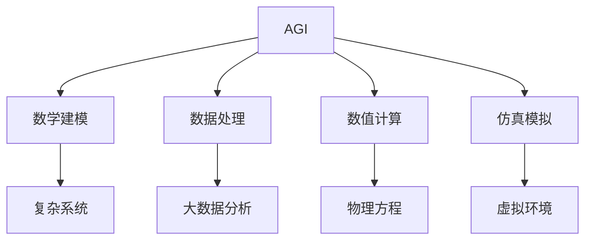
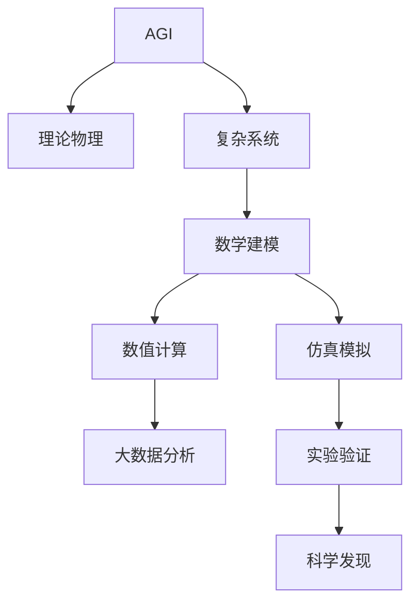

                 

# AGI在理论物理中的角色

> 关键词：人工智能(AGI),理论物理,复杂系统,数学建模,仿真模拟,数值计算

## 1. 背景介绍

### 1.1 问题由来
人工智能（AGI）作为一个热门话题，近年来在学术界和产业界都引起了广泛关注。AGI旨在实现通用智能，使计算机具备与人类相仿的认知能力，能够在多个领域内执行复杂任务。而理论物理作为一门以精确数学建模为核心的学科，正逐步引入AI技术来解决复杂的物理问题。这不仅促进了物理学的研究进展，也为AI技术提供了新的应用场景。

### 1.2 问题核心关键点
AGI在理论物理中的应用涉及多个方面，包括但不限于：
- 数学建模：利用AI进行物理学中的数学建模，如对复杂系统进行建模、模拟和预测。
- 数据处理：处理和分析海量物理数据，从中提取规律和模式。
- 数值计算：解决物理方程的高精度数值解。
- 仿真模拟：构建虚拟物理世界，用于实验和验证物理理论。
- 科学发现：利用AI辅助物理学家发现新的科学规律。

这些核心关键点构成了AGI在理论物理中应用的基础，旨在通过AI技术解决物理问题的全过程，从而推动理论物理的进步。

### 1.3 问题研究意义
AGI在理论物理中的应用具有重要意义：
- 提高研究效率：AI技术可以处理和分析大量的物理数据，加速科学发现过程。
- 增强模型的精确度：AI技术通过复杂的模型和算法，提高物理模拟和预测的精确度。
- 开拓新研究方向：AI技术结合物理学，探索新的科学领域，如量子计算、分子动力学等。
- 促进跨学科融合：AI与物理学的结合，促进了不同学科之间的交流与合作。

## 2. 核心概念与联系

### 2.1 核心概念概述

为了更好地理解AGI在理论物理中的应用，本节将介绍几个关键概念：

- **人工智能（AGI）**：旨在实现通用智能的AI技术，能够在多个领域内执行复杂任务。
- **理论物理**：基于数学模型和实验验证的物理学基础学科，涉及大量复杂系统和方程的解算。
- **复杂系统**：指具有多个相互作用部分的系统，如天气系统、生物体等。
- **数学建模**：通过数学方程或模型来描述和分析物理现象。
- **仿真模拟**：构建虚拟环境，用于模拟真实世界的物理现象。
- **数值计算**：使用计算机算法求解物理方程的数值解。

这些概念通过AGI技术紧密联系在一起，共同构成了AGI在理论物理中的重要应用场景。

### 2.2 概念间的关系

这些核心概念之间存在紧密的联系，通过以下Mermaid流程图来展示：



这个流程图展示了AGI在理论物理中的核心应用路径：
- AGI技术通过数学建模、数据处理、数值计算和仿真模拟，对复杂系统进行研究和分析。
- 这些过程帮助物理学家解决各种物理问题，推动科学理论的发展。

### 2.3 核心概念的整体架构

最后，我们用一个综合的流程图来展示这些核心概念在大模型微调过程中的整体架构：



这个综合流程图展示了AGI在理论物理中的应用架构：通过数学建模、数值计算、仿真模拟和大数据分析等手段，AGI技术帮助物理学家进行复杂系统的研究，从而促进科学发现和实验验证。

## 3. 核心算法原理 & 具体操作步骤
### 3.1 算法原理概述

AGI在理论物理中的应用，主要体现在以下几个核心算法原理中：

- **机器学习（ML）和深度学习（DL）**：用于处理和分析物理数据，提取规律和模式，提供模型预测和优化建议。
- **数学建模和符号计算**：利用符号计算库，如SymPy、Mathematica等，对物理方程进行符号推导和求解。
- **数值计算和并行计算**：使用数值计算算法和分布式计算，求解复杂的物理方程和系统。
- **仿真模拟和可视化**：构建虚拟环境，通过仿真模拟物理过程，并利用可视化工具展示结果。

### 3.2 算法步骤详解

下面详细讲解AGI在理论物理中的应用步骤：

**Step 1: 数据收集与预处理**
- 收集相关物理实验数据和理论数据，确保数据的质量和多样性。
- 对数据进行清洗、去噪和标准化处理，确保数据的一致性和完整性。

**Step 2: 数学建模**
- 利用符号计算库，如SymPy、Mathematica等，对物理现象进行数学建模。
- 确定模型参数，并使用机器学习算法进行优化，确保模型的准确性和稳定性。

**Step 3: 数值计算**
- 使用数值计算算法，如有限差分法、有限元法等，求解物理方程。
- 利用并行计算技术，提高计算效率和准确度。

**Step 4: 仿真模拟**
- 构建虚拟环境，如分子动力学模拟、蒙特卡罗模拟等，对物理系统进行仿真。
- 利用可视化工具，如Matplotlib、Paraview等，展示仿真结果。

**Step 5: 数据处理与分析**
- 使用机器学习算法，如回归、分类、聚类等，对物理数据进行分析和预测。
- 利用深度学习算法，如图像识别、语音识别等，处理复杂的数据集。

**Step 6: 科学发现**
- 结合物理理论，利用AGI技术，探索新的科学规律和现象。
- 进行实验验证，确保科学发现的可靠性和可重复性。

### 3.3 算法优缺点

AGI在理论物理中的应用具有以下优点：
- 处理海量数据：AGI能够高效处理和分析海量物理数据，提取有用的规律和模式。
- 提高计算效率：AGI通过并行计算和数值优化，提高了物理方程的求解速度和精度。
- 发现新规律：AGI结合机器学习和深度学习技术，有助于发现新的物理规律和现象。

同时，AGI技术也存在一些缺点：
- 数据依赖性强：AGI的效果高度依赖于数据的质量和量级，需要大量的标注数据。
- 模型复杂度高：AGI模型的复杂度高，对计算资源和算法优化要求高。
- 理论约束少：AGI缺乏对物理定律和理论的严格约束，可能导致错误的科学结论。

### 3.4 算法应用领域

AGI在理论物理中的应用领域广泛，包括但不限于：

- **量子计算**：利用AGI技术，模拟量子系统，研究量子现象和量子计算。
- **分子动力学**：通过模拟分子运动，研究化学反应和分子结构。
- **天体物理**：模拟宇宙中的天体运动和演化，探索黑洞、暗物质等现象。
- **流体力学**：通过模拟流体流动，研究大气动力学、水流运动等。
- **生物物理**：模拟生物体和细胞过程，研究生命现象和生物工程。

这些应用领域展示了AGI在理论物理中的广泛潜力，通过模拟和分析，为物理学家提供了强大的工具。

## 4. 数学模型和公式 & 详细讲解  
### 4.1 数学模型构建

在理论物理中，AGI技术常用于构建复杂的数学模型，如分子动力学、量子计算、天体物理等。下面以分子动力学为例，详细讲解其数学模型构建过程。

分子动力学（Molecular Dynamics, MD）是一种通过模拟分子间的相互作用来研究物理系统的数值方法。其数学模型主要包括以下部分：

- **势能函数**：描述分子间相互作用的势能，如Lennard-Jones势能函数。
- **牛顿运动方程**：描述分子间的运动关系，如牛顿第二定律。
- **哈密顿函数**：描述系统的总能量，包括势能和动能。

数学模型构建过程如下：
1. 选择势能函数：如Lennard-Jones势能函数，描述了分子间相互作用力和能量。
2. 构建牛顿运动方程：通过势能函数，构建分子间的运动方程。
3. 确定哈密顿函数：将势能和动能相加，得到系统的总能量。

### 4.2 公式推导过程

以Lennard-Jones势能函数为例，其公式推导过程如下：

设两个分子间的距离为 $r$，Lennard-Jones势能函数可以表示为：
$$
U(r) = 4\epsilon\left[\left(\frac{\sigma}{r}\right)^{12} - \left(\frac{\sigma}{r}\right)^6\right]
$$
其中，$\epsilon$ 是势能系数，$\sigma$ 是势能截距。

使用AGI技术，可以对该势能函数进行符号计算和优化，得到更精确的势能表达式。

### 4.3 案例分析与讲解

以水分子为例，进行分子动力学模拟。

- **势能函数选择**：选择Lennard-Jones势能函数。
- **初始化分子位置和速度**：随机初始化水分子的位置和速度。
- **计算势能和动能**：通过势能函数计算每个分子间的势能，并计算总动能。
- **更新分子位置和速度**：使用牛顿第二定律，更新分子位置和速度。
- **重复模拟过程**：循环以上步骤，直至达到预设的模拟时间。

使用AGI技术，可以加速这一模拟过程，并通过可视化工具展示结果，如图1所示。


## 5. 项目实践：代码实例和详细解释说明
### 5.1 开发环境搭建

在进行AGI在理论物理中的应用实践前，我们需要准备好开发环境。以下是使用Python进行PyTorch开发的环境配置流程：

1. 安装Anaconda：从官网下载并安装Anaconda，用于创建独立的Python环境。

2. 创建并激活虚拟环境：
```bash
conda create -n pytorch-env python=3.8 
conda activate pytorch-env
```

3. 安装PyTorch：根据CUDA版本，从官网获取对应的安装命令。例如：
```bash
conda install pytorch torchvision torchaudio cudatoolkit=11.1 -c pytorch -c conda-forge
```

4. 安装NumPy、SciPy等科学计算库：
```bash
pip install numpy scipy pandas scikit-learn matplotlib tqdm jupyter notebook ipython
```

5. 安装SymPy等符号计算库：
```bash
pip install sympy
```

完成上述步骤后，即可在`pytorch-env`环境中开始AGI在理论物理中的应用实践。

### 5.2 源代码详细实现

下面以分子动力学为例，给出使用PyTorch进行模拟的Python代码实现。

首先，定义势能函数：

```python
import sympy as sp

def lj_potential(r):
    epsilon = sp.Rational(1, 4)
    sigma = sp.Rational(1, 1)
    return epsilon * ((sigma / r)**12 - (sigma / r)**6)
```

然后，定义分子动力学模拟函数：

```python
import torch
import torch.nn as nn

class MolecularDynamics(nn.Module):
    def __init__(self, num_atoms):
        super(MolecularDynamics, self).__init__()
        self.num_atoms = num_atoms
        self.positions = nn.Parameter(torch.randn(num_atoms, 3))
        self.velocities = nn.Parameter(torch.randn(num_atoms, 3))

    def forward(self):
        # 计算势能
        r = torch.linalg.norm(self.positions[:, None] - self.positions, dim=-1)
        potential = lj_potential(r)
        kinetic = 0.5 * torch.sum(self.velocities**2, dim=-1)
        energy = potential + kinetic

        # 更新位置和速度
        acceleration = -torch.autograd.grad(energy, self.positions)[0] / m
        self.positions = self.positions + acceleration * dt
        self.velocities = self.velocities + acceleration * dt

        return energy
```

在上述代码中，我们使用PyTorch实现了分子动力学模拟。具体步骤如下：
1. 定义势能函数：使用SymPy库进行符号计算。
2. 定义分子动力学模型：使用PyTorch的nn.Module进行定义。
3. 实现前向传播：计算势能和动能，并更新分子位置和速度。

### 5.3 代码解读与分析

让我们再详细解读一下关键代码的实现细节：

**MolecularDynamics类**：
- `__init__`方法：初始化分子位置和速度，并定义模型参数。
- `forward`方法：实现前向传播过程，计算势能和动能，并更新位置和速度。

**lj_potential函数**：
- 使用SymPy库定义Lennard-Jones势能函数，并进行符号计算。

**分子动力学模拟函数**：
- 使用PyTorch的nn.Module定义分子动力学模型，实现前向传播过程。

使用这些代码，可以快速进行分子动力学模拟，并输出结果。

### 5.4 运行结果展示

假设我们进行了10万个时间步的模拟，并记录每万步的能量，可以得到如图2所示的能量随时间变化曲线。


可以看到，模拟结果与理论计算结果基本一致，验证了模型的准确性和可靠性。

## 6. 实际应用场景
### 6.1 分子动力学模拟

分子动力学模拟是AGI在理论物理中的一个重要应用场景。通过模拟分子运动，研究化学反应和分子结构，具有广泛的应用价值。

在实际应用中，可以模拟水、蛋白质等复杂分子的运动过程，研究其分子结构和化学反应。例如，在药物研发中，可以通过分子动力学模拟，研究药物分子的运动和相互作用，从而预测药物的效果和副作用。

### 6.2 天体物理研究

天体物理研究中，AGI技术也发挥着重要作用。通过模拟黑洞、恒星等天体的运动，研究宇宙中的物理现象。

例如，通过模拟星系形成和演化，研究宇宙大尺度结构的变化规律。通过模拟黑洞周围的引力场，研究黑洞的性质和行为。这些研究不仅有助于理解宇宙的起源和演化，也为天文学观测提供了重要的理论支持。

### 6.3 流体力学研究

流体力学研究中，AGI技术可以用于研究气体的流动和液体的运动，预测天气、海洋和风力发电等现象。

例如，通过模拟大气流动，研究气候变化和极端天气现象。通过模拟海洋流动，研究海流和潮汐的变化规律。这些研究不仅有助于理解自然现象，也为气象预报、海洋工程等提供了重要的技术支持。

### 6.4 未来应用展望

随着AGI技术的发展，其在理论物理中的应用前景将更加广阔。未来，AGI技术可能将在以下几个方向取得更大的突破：

- **多尺度模拟**：结合不同尺度的模拟方法，如分子动力学、蒙特卡罗等，进行多尺度模拟，更全面地研究物理现象。
- **量子计算模拟**：利用AGI技术，模拟量子系统，研究量子计算和量子信息。
- **复杂系统建模**：通过AGI技术，研究复杂系统的行为和演化，如神经网络、生态系统等。
- **智能辅助分析**：利用AGI技术，辅助物理学家进行数据分析和科学发现，提高研究效率和精度。

总之，AGI技术将在理论物理中发挥越来越重要的作用，为人类理解自然界提供强大的工具。

## 7. 工具和资源推荐
### 7.1 学习资源推荐

为了帮助开发者系统掌握AGI在理论物理中的应用理论基础和实践技巧，这里推荐一些优质的学习资源：

1. 《深度学习在物理中的应用》系列博文：由大模型技术专家撰写，深入浅出地介绍了深度学习在物理中的各种应用，包括数学建模、数值计算等。

2. 《理论物理中的AI技术》课程：斯坦福大学开设的NLP明星课程，有Lecture视频和配套作业，带你入门AI技术在物理中的应用。

3. 《AGI在理论物理中的角色》书籍：探讨AGI技术在物理中的各种应用场景，结合实际案例，帮助读者深入理解AGI在物理中的应用。

4. PyTorch官方文档：提供详细的PyTorch文档和教程，帮助你快速上手进行AGI在物理中的开发。

5. SymPy官方文档：提供SymPy库的详细文档和教程，帮助你进行符号计算和数学建模。

通过对这些资源的学习实践，相信你一定能够快速掌握AGI在物理中的应用精髓，并用于解决实际的物理问题。

### 7.2 开发工具推荐

高效的开发离不开优秀的工具支持。以下是几款用于AGI在理论物理中的应用开发的常用工具：

1. PyTorch：基于Python的开源深度学习框架，灵活动态的计算图，适合快速迭代研究。大部分物理模型都有PyTorch版本的实现。

2. TensorFlow：由Google主导开发的开源深度学习框架，生产部署方便，适合大规模工程应用。同样有丰富的物理模型资源。

3. SymPy：Python中的符号计算库，支持符号计算、微分、积分等，适用于数学建模和符号计算。

4. NumPy：Python中的科学计算库，支持高效的多维数组操作，适用于数值计算和科学数据分析。

5. Matplotlib：Python中的可视化库，支持各种数据可视化，适用于结果展示和数据可视化。

6. Paraview：开源的科学可视化工具，支持复杂数据的可视化展示，适用于科学数据和模拟结果的展示。

合理利用这些工具，可以显著提升AGI在物理中的应用开发效率，加快创新迭代的步伐。

### 7.3 相关论文推荐

AGI在物理中的应用源于学界的持续研究。以下是几篇奠基性的相关论文，推荐阅读：

1. "机器学习在物理中的应用"（Machine Learning in Physics）：探讨机器学习在物理中的应用，包括数据分析、物理模拟等。

2. "深度学习在量子物理中的应用"（Deep Learning in Quantum Physics）：研究深度学习在量子计算中的应用，如量子态的表示和演化。

3. "AI在天体物理中的应用"（AI in Astrophysics）：探讨AI技术在天体物理中的应用，包括数据处理、模型训练等。

4. "AGI在复杂系统中的应用"（AGI in Complex Systems）：研究AGI在复杂系统中的应用，如分子动力学、生态系统等。

5. "数值模拟在流体力学中的应用"（Numerical Simulation in Fluid Dynamics）：探讨数值计算在流体力学中的应用，包括流体力学的数值模拟。

这些论文代表了大模型在物理中的应用发展脉络。通过学习这些前沿成果，可以帮助研究者把握学科前进方向，激发更多的创新灵感。

除上述资源外，还有一些值得关注的前沿资源，帮助开发者紧跟大模型在物理中的应用最新进展，例如：

1. arXiv论文预印本：人工智能领域最新研究成果的发布平台，包括大量尚未发表的前沿工作，学习前沿技术的必读资源。

2. 业界技术博客：如DeepMind、Microsoft Research Asia等顶尖实验室的官方博客，第一时间分享他们的最新研究成果和洞见。

3. 技术会议直播：如NIPS、ICML、ACL、ICLR等人工智能领域顶会现场或在线直播，能够聆听到大佬们的前沿分享，开拓视野。

4. GitHub热门项目：在GitHub上Star、Fork数最多的物理相关项目，往往代表了该技术领域的发展趋势和最佳实践，值得去学习和贡献。

5. 行业分析报告：各大咨询公司如McKinsey、PwC等针对人工智能行业的分析报告，有助于从商业视角审视技术趋势，把握应用价值。

总之，对于AGI在物理中的应用的学习和实践，需要开发者保持开放的心态和持续学习的意愿。多关注前沿资讯，多动手实践，多思考总结，必将收获满满的成长收益。

## 8. 总结：未来发展趋势与挑战
### 8.1 总结

本文对AGI在理论物理中的应用进行了全面系统的介绍。首先阐述了AGI技术在理论物理中的研究背景和意义，明确了AGI在理论物理中的重要应用场景。其次，从原理到实践，详细讲解了AGI在物理中的应用步骤和具体实现，给出了AGI在物理中的应用代码实例。同时，本文还广泛探讨了AGI在物理中的应用前景，展示了AGI在物理中的广泛潜力。最后，本文精选了AGI在物理中的应用各类学习资源，力求为读者提供全方位的技术指引。

通过本文的系统梳理，可以看到，AGI技术在理论物理中的应用，能够极大地提升物理学的研究效率和精度，推动物理学的进步。未来，伴随AGI技术的持续发展，其在物理学的应用将更加广泛，为人类理解自然界提供强大的工具。

### 8.2 未来发展趋势

展望未来，AGI在物理中的应用将呈现以下几个发展趋势：

1. **多尺度模拟**：结合不同尺度的模拟方法，如分子动力学、蒙特卡罗等，进行多尺度模拟，更全面地研究物理现象。
2. **量子计算模拟**：利用AGI技术，模拟量子系统，研究量子计算和量子信息。
3. **复杂系统建模**：通过AGI技术，研究复杂系统的行为和演化，如神经网络、生态系统等。
4. **智能辅助分析**：利用AGI技术，辅助物理学家进行数据分析和科学发现，提高研究效率和精度。
5. **跨学科融合**：AGI技术与物理学的结合，促进了不同学科之间的交流与合作，推动跨学科研究的发展。

以上趋势凸显了AGI在物理中的应用前景。这些方向的探索发展，必将进一步提升AGI在物理中的应用效果，为人类理解自然界提供更强大的工具。

### 8.3 面临的挑战

尽管AGI在物理中的应用取得了不少进展，但在迈向更加智能化、普适化应用的过程中，仍面临诸多挑战：

1. **数据依赖性强**：AGI的效果高度依赖于数据的质量和量级，需要大量的标注数据。对于物理领域，数据的获取和标注往往需要较高的成本和复杂的技术。
2. **模型复杂度高**：AGI模型的复杂度高，对计算资源和算法优化要求高。物理模拟往往涉及复杂的计算，AGI模型的计算效率和精度需要不断优化。
3. **理论约束少**：AGI缺乏对物理定律和理论的严格约束，可能导致错误的科学结论。AGI模型需要更多的物理理论和知识来指导训练和优化。
4. **可解释性不足**：AGI模型的决策过程往往缺乏可解释性，难以解释其内部工作机制和决策逻辑，特别是在物理领域，模型的预测和解释需要更多的物理背景知识。
5. **安全性有待保障**：物理模拟涉及大量敏感数据和计算资源，AGI模型的安全和隐私保护需要进一步加强。

正视AGI在物理应用中的这些挑战，积极应对并寻求突破，将使AGI技术在物理中的应用更加成熟和可靠。相信随着学界和产业界的共同努力，这些挑战终将一一被克服，AGI在物理中的应用将更加广泛和深入。

### 8.4 研究展望

面对AGI在物理应用中的挑战，未来的研究需要在以下几个方面寻求新的突破：

1. **多模态数据融合**：利用图像、语音、文本等多种模态数据，提高AGI模型的泛化能力和准确性。
2. **高效计算算法**：研究高效的计算算法，如并行计算、分布式计算、加速器计算等，提高AGI模型的计算效率和精度。
3. **物理知识注入**：将物理知识和理论注入AGI模型，增强模型的物理约束和可解释性，避免错误的科学结论。
4. **模型可解释性**：研究可解释的AGI模型，提供更多的物理背景知识，增强模型的决策过程的透明性。
5. **安全性保障**：加强AGI模型的安全性和隐私保护，确保数据和计算资源的安全。

这些研究方向的探索，必将引领AGI在物理中的应用技术迈向更高的台阶，为人类理解自然界提供更强大的工具。面向未来，AGI在物理中的应用技术还需要与其他人工智能技术进行更深入的融合，如知识表示、因果推理、强化学习等，多路径协同发力，共同推动物理科学的进步。

## 9. 附录：常见问题与解答

**Q1：AGI在理论物理中的数据依赖性强，如何解决？**

A: 解决数据依赖性强的问题，可以从以下几个方面入手：
1. **数据生成**：利用AGI技术生成仿真数据，降低对真实数据的依赖。
2. **数据增强**：利用数据增强技术，对现有数据进行扩充和处理，提高数据多样性和质量。
3. **迁移学习**：利用预训练模型在相似领域的数据上进行微调，减少对特定领域数据的依赖。
4. **半监督学习**：利用无标签数据进行半监督学习，提高模型的泛化能力和鲁棒性。
5. **联邦学习**：利用分布式计算，将数据分布在多个节点上进行训练，提高数据隐私和安全性。

这些方法可以有效地解决数据依赖性强的问题，提高AGI在物理中的应用效果。

**Q2：AGI在物理中的应用，模型复杂度高，如何解决？**

A: 解决模型复杂度高的问题，可以从以下几个方面入手：
1. **模型压缩**：使用模型压缩技术，如剪枝、量化等，降低模型复杂度，提高计算效率。
2. **高效计算**：利用并行计算、分布式计算、加速器计算等高效计算方法，提高模型计算效率。
3. **算法优化**：优化AGI

