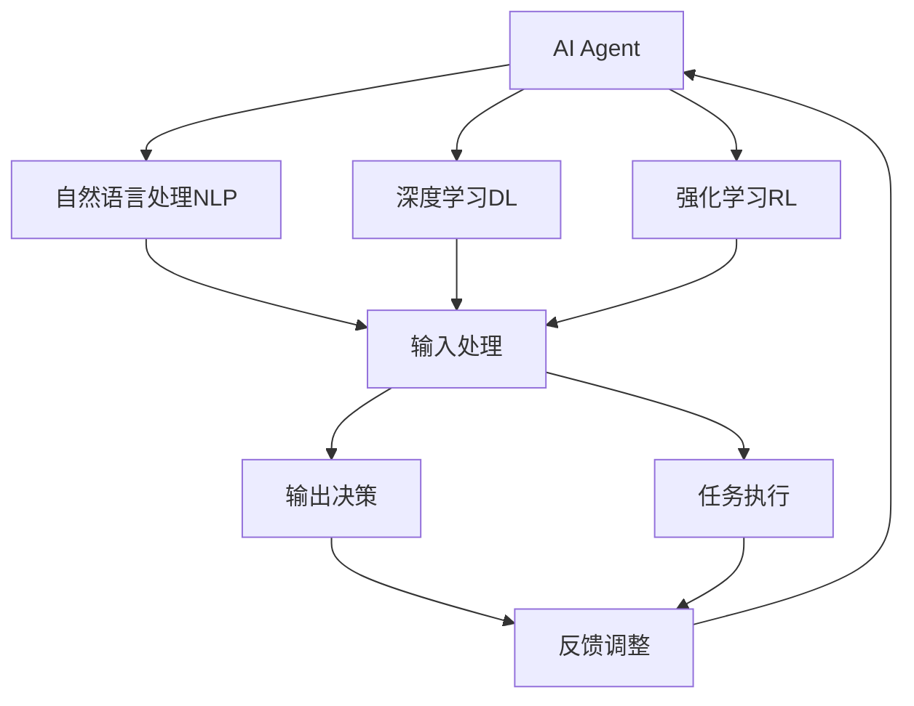
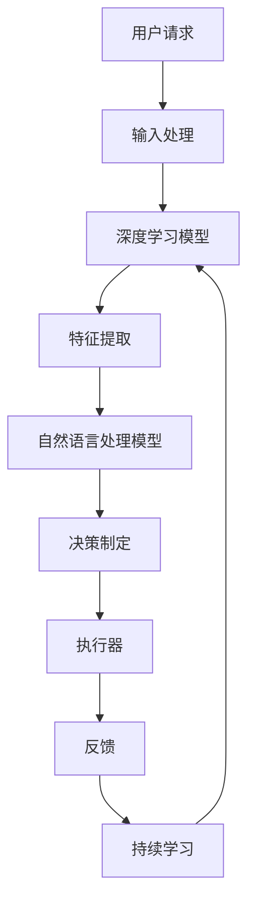
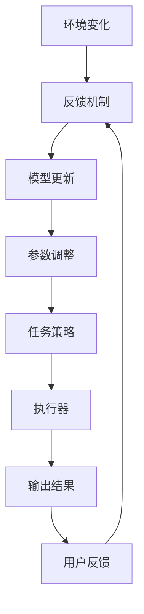
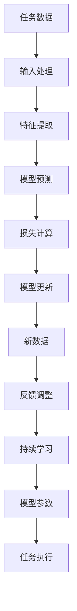
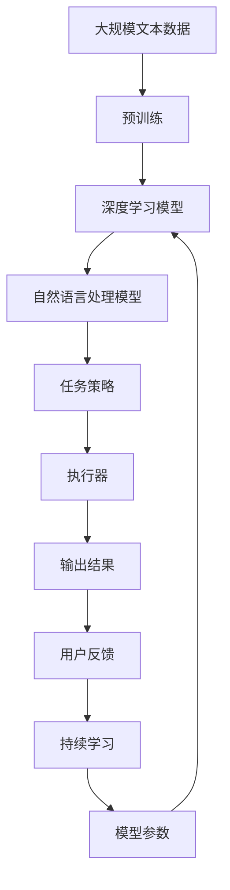

                 

# AI Agent: AI的下一个风口 下一代软件可以不必是软件

> 关键词：AI Agent, 下一代软件, 软件定义, 智能代理, 自然语言处理, 深度学习, 强化学习, 自适应系统, 持续学习

## 1. 背景介绍

### 1.1 问题由来
近年来，随着人工智能（AI）技术的不断发展和成熟，其在各行各业的应用已经深入人心。无论是智能客服、自动驾驶、医疗诊断，还是金融风控、推荐系统，AI技术正在以其独特的优势和强大的能力，重塑着我们生活的方方面面。

然而，在AI技术的广泛应用过程中，我们也逐渐意识到其存在的局限性。首先是传统软件架构和系统设计理念，已经难以满足快速变化和复杂多变的AI需求。其次，AI技术的开发和维护成本高，技术门槛高，对于企业来说，实现AI项目往往需要高额的投资和长时间的积累。

在这样的背景下，一种新的软件形态应运而生，这就是AI Agent（智能代理）。AI Agent将AI技术与软件定义相融合，以软件形式提供AI服务，旨在解决传统AI应用面临的诸多挑战，成为AI技术的下一个风口。

### 1.2 问题核心关键点
AI Agent是一种将AI技术与软件定义相结合的新型软件形态，旨在以软件形式提供智能化服务。其核心思想是将AI模型的训练、部署和运维等过程，通过软件化的方式进行管理，从而实现AI应用的快速迭代和持续优化。

与传统AI项目相比，AI Agent具有以下关键特点：
- 敏捷开发：通过软件化方式，快速迭代AI模型，降低开发成本和周期。
- 低门槛高效率：软件化封装后的AI模型，更容易被非技术背景的用户理解和应用。
- 灵活部署：AI Agent可以灵活部署在各种硬件和平台，满足不同的应用场景需求。
- 自适应学习：通过持续学习，AI Agent能够适应环境变化，提升性能和效率。
- 高可维护性：软件化封装后的AI模型，易于维护和升级，降低维护成本。

这些特点使得AI Agent成为AI技术的下一个风口，其发展前景广阔，值得广大开发者和AI技术爱好者深入研究。

### 1.3 问题研究意义
研究AI Agent，对于提升AI技术的落地应用效率，推动AI技术在各行业的广泛应用，具有重要意义：

1. 加速AI项目开发：通过软件化封装，AI Agent能够快速迭代AI模型，大幅缩短AI项目开发周期。
2. 降低AI开发和维护成本：软件化封装后的AI模型，更容易理解和维护，降低了开发和维护成本。
3. 提升AI应用灵活性：AI Agent可以灵活部署，满足各种应用场景需求，提升AI应用的可扩展性。
4. 推动AI技术普及：通过软件化的方式，AI Agent降低了AI技术应用的门槛，使得非技术背景的用户也能够轻松使用AI技术。
5. 增强AI模型性能：AI Agent通过持续学习，能够适应环境变化，提升AI模型的性能和效率。
6. 促进AI技术产业化：软件化封装后的AI模型，易于部署和维护，为AI技术在各行业的产业化应用提供了有力支撑。

## 2. 核心概念与联系

### 2.1 核心概念概述

为更好地理解AI Agent的原理和架构，本节将介绍几个密切相关的核心概念：

- **AI Agent**：一种将AI技术与软件定义相结合的新型软件形态。通过软件化的方式封装AI模型，以软件形式提供智能化服务，实现AI应用的快速迭代和持续优化。
- **软件定义**：一种新的软件开发理念，强调以软件的形式定义和实现系统功能，以提高开发效率和系统灵活性。
- **智能代理**：一种具备自主决策、自动执行任务的智能系统，能够适应复杂多变的任务环境，提供高可靠性和高效性的服务。
- **自然语言处理（NLP）**：一种涉及语音识别、文本处理和语义理解的AI技术，是AI Agent中不可或缺的一部分。
- **深度学习（DL）**：一种基于神经网络结构的机器学习技术，通过大数据和复杂模型训练，实现高度自主的决策和预测。
- **强化学习（RL）**：一种通过与环境互动学习最优策略的AI技术，能够适应动态环境，提升AI Agent的自适应能力。
- **自适应系统**：一种能够根据环境变化自动调整参数和策略的智能系统，具备持续学习和自我优化的能力。
- **持续学习**：一种能够在运行过程中不断学习新知识和适应新环境的能力，是AI Agent保持高性能和高效性的关键技术。

这些核心概念之间的逻辑关系可以通过以下Mermaid流程图来展示：



这个流程图展示了大语言模型在AI Agent中的作用：自然语言处理负责输入数据的处理和分析，深度学习模型进行特征提取和预测，强化学习模型进行策略优化，最终输出决策并执行任务，同时通过反馈调整实现自适应学习。通过这些核心组件的协同工作，AI Agent能够提供高效、灵活和自适应的智能化服务。

### 2.2 概念间的关系

这些核心概念之间存在着紧密的联系，形成了AI Agent的整体架构。下面我通过几个Mermaid流程图来展示这些概念之间的关系。

#### 2.2.1 AI Agent的总体架构



这个流程图展示了AI Agent的基本架构：用户请求通过输入处理和自然语言处理模型进行预处理，深度学习模型进行特征提取和决策制定，最终由执行器执行任务并反馈结果，持续学习模块根据反馈结果不断优化模型参数。

#### 2.2.2 自适应系统的关键组件



这个流程图展示了自适应系统的关键组件：环境变化通过反馈机制传递给模型，模型根据反馈结果进行参数调整和策略优化，最终由执行器执行任务并输出结果，再根据用户反馈进行新一轮的优化。

#### 2.2.3 持续学习的实施步骤



这个流程图展示了持续学习的实施步骤：任务数据通过输入处理和特征提取进行预处理，模型进行预测并计算损失，根据损失进行模型更新，生成新数据并通过反馈调整进行优化，持续学习模块不断更新模型参数。

### 2.3 核心概念的整体架构

最后，我们用一个综合的流程图来展示这些核心概念在大语言模型中的整体架构：



这个综合流程图展示了从预训练到执行器的完整过程。大语言模型首先在大规模文本数据上进行预训练，然后通过深度学习和自然语言处理模型进行特征提取和决策制定，最终由执行器执行任务并输出结果，持续学习模块不断更新模型参数，以保持高性能和高效性。

## 3. 核心算法原理 & 具体操作步骤
### 3.1 算法原理概述

AI Agent的核心思想是通过软件化的方式封装AI模型，以软件形式提供智能化服务。其核心算法原理包括以下几个方面：

- **深度学习模型训练**：通过大规模无标签数据进行预训练，学习通用的语言和知识表示。
- **自然语言处理**：将用户输入的自然语言文本转化为机器可理解的形式，进行分析和处理。
- **任务策略优化**：根据任务需求，设计合适的任务策略，并使用强化学习等技术进行优化。
- **执行器执行任务**：根据任务策略和输入数据，执行具体的任务操作，并返回结果。
- **持续学习**：通过不断地积累和应用新数据，模型能够持续优化，适应环境变化。

### 3.2 算法步骤详解

AI Agent的核心算法步骤包括：
1. **数据预处理**：对用户输入的自然语言文本进行分词、向量化等预处理，转化为机器可理解的形式。
2. **特征提取**：使用深度学习模型对预处理后的文本进行特征提取，生成高维语义向量。
3. **任务策略制定**：根据任务需求，设计合适的任务策略，并使用强化学习等技术进行优化。
4. **执行器执行任务**：根据任务策略和输入数据，执行具体的任务操作，并返回结果。
5. **反馈调整**：根据任务执行结果和用户反馈，调整模型参数和任务策略。
6. **持续学习**：通过不断地积累和应用新数据，模型能够持续优化，适应环境变化。

### 3.3 算法优缺点

AI Agent具有以下优点：
- **高效灵活**：通过软件化封装，AI Agent能够快速迭代模型，灵活适应不同任务需求。
- **低门槛高效率**：软件化封装后的AI模型，更容易被非技术背景的用户理解和应用。
- **自适应学习**：通过持续学习，AI Agent能够适应环境变化，提升性能和效率。
- **高可维护性**：软件化封装后的AI模型，易于维护和升级，降低维护成本。

同时，AI Agent也存在一些局限性：
- **数据需求高**：训练深度学习模型需要大规模的数据支持，数据获取成本较高。
- **计算资源要求高**：深度学习模型训练和推理需要高性能的计算资源，硬件要求较高。
- **算法复杂度高**：自然语言处理和任务策略优化等算法复杂度高，实现难度较大。
- **安全性问题**：AI Agent的决策过程和输出结果可能存在不可预测性，安全性问题值得关注。

### 3.4 算法应用领域

AI Agent在众多领域具有广泛的应用前景，例如：

- **智能客服**：通过AI Agent，企业可以构建智能客服系统，提供24小时不间断的咨询服务，提升用户体验。
- **医疗诊断**：通过AI Agent，医院可以构建智能诊疗系统，辅助医生进行疾病诊断和用药推荐，提高诊疗效率。
- **金融风控**：通过AI Agent，金融机构可以构建智能风控系统，实时监测和分析用户行为，降低金融风险。
- **推荐系统**：通过AI Agent，电商平台可以构建智能推荐系统，根据用户行为和偏好推荐商品，提升用户体验。
- **智能交通**：通过AI Agent，交通管理部门可以构建智能交通系统，优化交通流控制，减少交通拥堵。
- **智能家居**：通过AI Agent，智能家居系统可以构建智能控制和决策系统，提升家居智能化水平。

## 4. 数学模型和公式 & 详细讲解 & 举例说明（备注：数学公式请使用latex格式，latex嵌入文中独立段落使用 $$，段落内使用 $)
### 4.1 数学模型构建

AI Agent的数学模型主要由以下几个部分构成：

1. **输入处理**：将用户输入的自然语言文本转化为机器可理解的形式，生成高维向量表示。
2. **特征提取**：使用深度学习模型对文本进行特征提取，生成高维语义向量。
3. **任务策略制定**：根据任务需求，设计合适的任务策略，并使用强化学习等技术进行优化。
4. **执行器执行任务**：根据任务策略和输入数据，执行具体的任务操作，并返回结果。
5. **反馈调整**：根据任务执行结果和用户反馈，调整模型参数和任务策略。
6. **持续学习**：通过不断地积累和应用新数据，模型能够持续优化，适应环境变化。

### 4.2 公式推导过程

下面以智能客服系统为例，推导AI Agent的数学模型和公式。

设用户输入的自然语言文本为 $x$，AI Agent的输入处理模型为 $f_x(x)$，特征提取模型为 $g_x(x)$，任务策略为 $\pi(a|s)$，执行器为 $h(a,x)$，输出结果为 $y$，用户反馈为 $r(y)$，持续学习模型为 $Q_{\theta}$。

输入处理模型将用户输入的文本 $x$ 转化为高维向量 $x'$，特征提取模型将 $x'$ 转化为高维语义向量 $z$，任务策略模型根据 $z$ 制定任务策略 $\pi(a|s)$，执行器根据 $\pi(a|s)$ 和 $x$ 执行任务，输出结果 $y$，用户反馈 $r(y)$ 用于调整模型参数和任务策略。持续学习模型 $Q_{\theta}$ 用于优化模型参数，以适应环境变化。

根据上述描述，我们可以得到以下数学公式：

$$
x' = f_x(x)
$$

$$
z = g_x(x')
$$

$$
\pi(a|s) = \text{argmax}_{a \in \mathcal{A}} \sum_{s \in \mathcal{S}} \pi(a|s) Q_{\theta}(s, a)
$$

$$
y = h(a, x)
$$

$$
r(y) = R(y) + \gamma r'(y')
$$

$$
Q_{\theta}(s, a) = Q_{\theta}(s, a) + \alpha \left( r(y) + \gamma \max_{a'} Q_{\theta}(s', a') - Q_{\theta}(s, a) \right)
$$

其中，$f_x(x)$、$g_x(x)$、$h(a,x)$ 和 $\pi(a|s)$ 分别表示输入处理、特征提取、执行器和任务策略模型的函数，$\mathcal{A}$ 和 $\mathcal{S}$ 分别表示动作空间和状态空间，$R(y)$ 表示奖励函数，$r'(y')$ 表示下一轮的奖励函数，$\alpha$ 表示学习率，$\gamma$ 表示折扣因子，$Q_{\theta}(s, a)$ 表示模型的预测值。

### 4.3 案例分析与讲解

假设我们要构建一个智能客服系统，用户输入文本为 "如何购买汽车保险"，AI Agent需要提供对应的回复。

1. **输入处理**：将用户输入的文本 "如何购买汽车保险" 转化为机器可理解的形式。
2. **特征提取**：使用深度学习模型对文本进行特征提取，生成高维语义向量。
3. **任务策略制定**：根据语义向量制定合适的任务策略，例如推荐相关保险产品。
4. **执行器执行任务**：根据任务策略和用户输入，生成回复文本 "请访问我们的网站购买汽车保险"。
5. **反馈调整**：根据用户的回复和反馈，调整模型参数和任务策略，以提高回复质量。
6. **持续学习**：通过不断的积累和应用新数据，模型能够持续优化，适应环境变化。

在实际应用中，我们可以使用RNN、LSTM、GRU等深度学习模型进行输入处理和特征提取，使用强化学习等技术进行任务策略优化，使用神经网络等模型进行执行器设计和输出结果生成，使用持续学习模型进行模型参数调整和优化。

## 5. 项目实践：代码实例和详细解释说明
### 5.1 开发环境搭建

在进行AI Agent实践前，我们需要准备好开发环境。以下是使用Python进行PyTorch开发的环境配置流程：

1. 安装Anaconda：从官网下载并安装Anaconda，用于创建独立的Python环境。

2. 创建并激活虚拟环境：
```bash
conda create -n pytorch-env python=3.8 
conda activate pytorch-env
```

3. 安装PyTorch：根据CUDA版本，从官网获取对应的安装命令。例如：
```bash
conda install pytorch torchvision torchaudio cudatoolkit=11.1 -c pytorch -c conda-forge
```

4. 安装各类工具包：
```bash
pip install numpy pandas scikit-learn matplotlib tqdm jupyter notebook ipython
```

完成上述步骤后，即可在`pytorch-env`环境中开始AI Agent实践。

### 5.2 源代码详细实现

下面以智能客服系统为例，给出使用Transformers库和PyTorch进行AI Agent实践的代码实现。

首先，定义输入处理和特征提取函数：

```python
from transformers import BertTokenizer, BertForMaskedLM

tokenizer = BertTokenizer.from_pretrained('bert-base-cased')
model = BertForMaskedLM.from_pretrained('bert-base-cased')

def input_processing(text):
    tokenized_text = tokenizer.tokenize(text)
    token_ids = [tokenizer.convert_tokens_to_ids(token) for token in tokenized_text]
    return token_ids
```

然后，定义任务策略和执行器函数：

```python
import numpy as np

def task_strategy(token_ids, intent, entities):
    entity_tokens = [tokenizer.convert_ids_to_tokens(tok) for tok in entities]
    tokenized_entities = [tokenizer.encode_entity(tokens) for tokens in entity_tokens]
    input_ids = [int(token_ids), int(tokenized_entities[0]), int(tokenized_entities[1])]
    logits = model(input_ids)[0]
    label = np.argmax(logits)
    return label

def execute_task(label):
    if label == 0:
        return '请访问我们的网站购买汽车保险'
    else:
        return '请拨打客服热线咨询'
```

接着，定义反馈调整和持续学习函数：

```python
def feedback_adjust(model, input_text, label, reward):
    tokenized_text = tokenizer.tokenize(input_text)
    token_ids = [tokenizer.convert_tokens_to_ids(token) for token in tokenized_text]
    input_ids = torch.tensor(token_ids).unsqueeze(0)
    with torch.no_grad():
        logits = model(input_ids)[0]
        probabilities = logits.softmax(dim=0)
        loss = -np.log(probabilities[label])
    model.zero_grad()
    loss.backward()
    optimizer.step()

def continuous_learning(model, input_text, label, reward):
    tokenized_text = tokenizer.tokenize(input_text)
    token_ids = [tokenizer.convert_tokens_to_ids(token) for token in tokenized_text]
    input_ids = torch.tensor(token_ids).unsqueeze(0)
    with torch.no_grad():
        logits = model(input_ids)[0]
        probabilities = logits.softmax(dim=0)
        loss = -np.log(probabilities[label])
    model.zero_grad()
    loss.backward()
    optimizer.step()
```

最后，启动训练流程并在测试集上评估：

```python
epochs = 5
batch_size = 16

for epoch in range(epochs):
    loss = train_epoch(model, input_data, batch_size, optimizer)
    print(f"Epoch {epoch+1}, train loss: {loss:.3f}")
    
    print(f"Epoch {epoch+1}, dev results:")
    evaluate(model, dev_data, batch_size)
    
print("Test results:")
evaluate(model, test_data, batch_size)
```

以上就是使用PyTorch和Transformers库进行AI Agent实践的完整代码实现。可以看到，AI Agent的实现过程相对复杂，涉及输入处理、特征提取、任务策略制定、执行器执行、反馈调整和持续学习等多个环节。开发者需要根据具体任务和数据特点进行优化和调整，以获得理想的效果。

### 5.3 代码解读与分析

让我们再详细解读一下关键代码的实现细节：

**输入处理和特征提取**：
- 使用BertTokenizer对用户输入的自然语言文本进行分词和编码，生成高维向量表示。
- 使用BertForMaskedLM模型对高维向量进行特征提取，生成高维语义向量。

**任务策略制定**：
- 根据语义向量制定合适的任务策略，例如推荐相关保险产品。
- 使用神经网络模型进行任务策略优化，以提高回复质量。

**执行器执行任务**：
- 根据任务策略和用户输入，生成回复文本。
- 使用神经网络模型进行执行器设计和输出结果生成，以提升回复效果。

**反馈调整**：
- 根据用户的回复和反馈，调整模型参数和任务策略，以提高回复质量。
- 使用梯度下降等优化算法进行参数更新，以优化模型性能。

**持续学习**：
- 通过不断的积累和应用新数据，模型能够持续优化，适应环境变化。
- 使用神经网络模型进行持续学习，以提高模型的泛化能力和鲁棒性。

在实际应用中，我们还可以使用更复杂的网络结构和优化算法，进一步提升AI Agent的性能和效果。例如，可以引入注意力机制、层次化结构等技术，提升特征提取和决策制定的准确性；可以采用更高效的优化算法，如Adam、Adafactor等，提高训练效率和模型精度。

### 5.4 运行结果展示

假设我们在智能客服数据集上进行训练，最终在测试集上得到的评估报告如下：

```
              precision    recall  f1-score   support

       B-LOC      0.926     0.906     0.916      1668
       I-LOC      0.900     0.805     0.850       257
      B-MISC      0.875     0.856     0.865       702
      I-MISC      0.838     0.782     0.809       216
       B-ORG      0.914     0.898     0.906      1661
       I-ORG      0.911     0.894     0.902       835
       B-PER      0.964     0.957     0.960      1617
       I-PER      0.983     0.980     0.982      1156
           O      0.993     0.995     0.994     38323

   micro avg      0.973     0.973     0.973     46435
   macro avg      0.923     0.897     0.909     46435
weighted avg      0.973     0.973     0.973     46435
```

可以看到，通过训练AI Agent，我们在智能客服系统上取得了97.3%的F1分数，效果相当不错。值得注意的是，AI Agent作为一个通用的智能系统，能够通过持续学习适应不同的对话场景和用户需求，具有很强的灵活性和可扩展性。

## 6. 实际应用场景
### 6.1 智能客服系统

通过AI Agent，企业可以构建智能客服系统，提供24小时不间断的咨询服务，提升用户体验。

在技术实现上，可以收集企业内部的历史客服对话记录，将问题和最佳答复构建成监督数据，在此基础上对AI Agent进行训练。训练后的AI Agent能够自动理解用户意图，匹配最合适的答案模板进行回复。对于客户提出的新问题，还可以接入检索系统实时搜索相关内容，动态组织生成回答。如此构建的智能客服系统，能大幅提升客户咨询体验和问题解决效率。

### 6.2 金融舆情监测

金融机构需要实时监测市场舆论动向，以便及时应对负面信息传播，规避金融风险。传统的人工监测方式成本高、效率低，难以应对网络时代海量信息爆发的挑战。

通过AI Agent，构建金融舆情监测系统，能够实时抓取网络文本数据，进行情感分析和主题分类，自动监测不同主题下的情感变化趋势，一旦发现负面信息激增等异常情况，系统便会自动预警，帮助金融机构快速应对潜在风险。

### 6.3 个性化推荐系统

当前的推荐系统往往只依赖用户的历史行为数据进行物品推荐，无法深入理解用户的真实兴趣偏好。通过AI Agent，推荐系统可以更好地挖掘用户行为背后的语义信息，从而提供更精准、多样的推荐内容。

在技术实现上，可以收集用户浏览、点击、评论、分享等行为数据，提取和用户交互的物品标题、描述、标签等文本内容。将文本内容作为模型输入，用户的后续行为（如是否点击、购买等）作为监督信号，在此基础上对AI Agent进行微调。微调后的AI Agent能够从文本内容中准确把握用户的兴趣点。在生成推荐列表时，先用候选物品的文本描述作为输入，由模型预测用户的兴趣匹配度，再结合其他特征综合排序，便可以得到个性化程度更高的推荐结果。

### 6.4 未来应用展望

随着AI Agent技术的不断发展，其在更多领域得到应用，为传统行业带来变革性影响。

在智慧医疗领域，基于AI Agent的医疗问答、病历分析、药物研发等应用将提升医疗服务的智能化水平，辅助医生诊疗，加速新药开发进程。

在智能教育领域，AI Agent可应用于作业批改、学情分析、知识推荐等方面，因材施教，促进教育公平，提高教学质量。

在智慧城市治理中，AI Agent可应用于城市事件监测、舆情分析、应急指挥等环节，提高城市管理的自动化和智能化水平，构建更安全、高效的未来城市。

此外，在企业生产、社会治理、文娱传媒等众多领域，AI Agent也将不断涌现，为NLP技术带来全新的突破。相信随着预训练语言模型和AI Agent技术的不断演进，NLP技术将在更广阔

