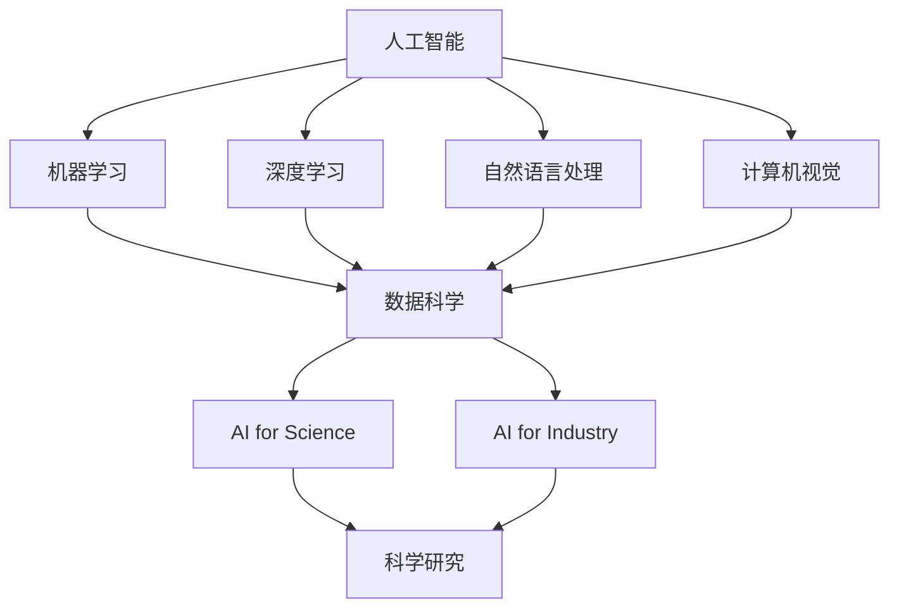
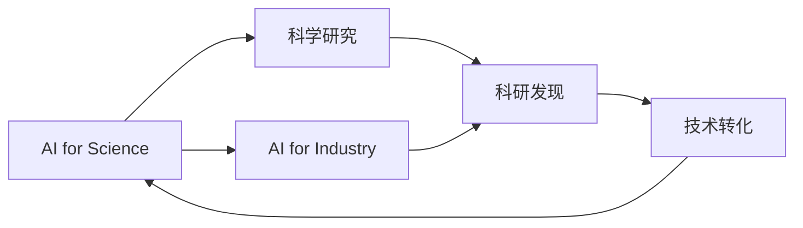
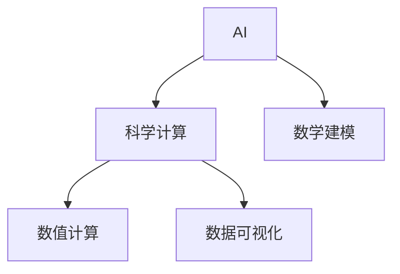
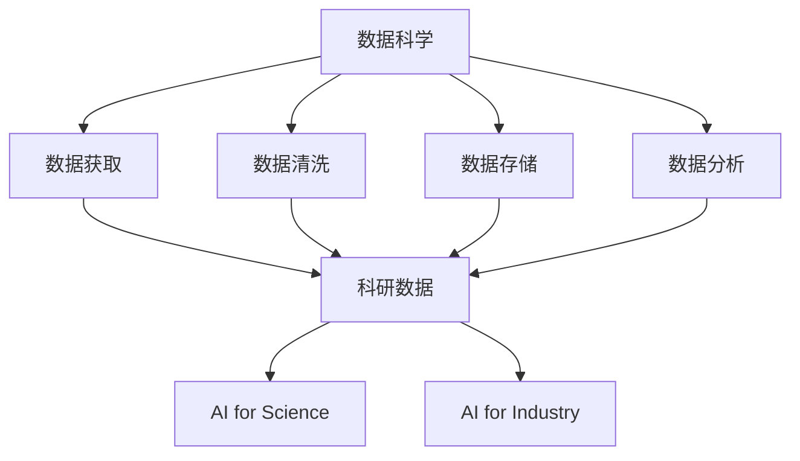
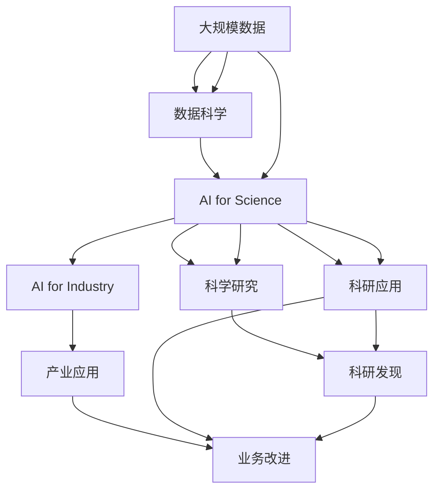

                 

# AI for Science与产业的结合

## 1. 背景介绍

### 1.1 问题由来

人工智能（AI）作为21世纪最具颠覆性的技术之一，已经在众多领域实现了突破性进展。AI不仅仅是一个技术标签，更是一个跨学科融合的桥梁，连接了科学研究和产业应用。从基础研究到工程实践，AI技术已经深刻改变了我们的工作和生活方式。

AI for Science（科学中的AI），指的是将AI技术应用于科学研究中，以加速科学发现和实验设计的进程。例如，AI算法可以在海量数据中寻找模式和关联，自动化和加速实验设计，提高实验效率和精度。而AI for Industry（产业中的AI）则指的是将AI技术应用于各行各业的业务流程中，以提高效率、降低成本、优化用户体验等。例如，AI技术可以用于自动化生产线、智能客服、推荐系统等。

AI for Science和AI for Industry之间的界限逐渐模糊，两者相互促进，共同推动着AI技术的发展和应用。AI for Science的研究成果，如深度学习、自然语言处理、计算机视觉等，为AI for Industry提供了有力的技术支持。同时，AI for Industry的需求和应用场景，又反过来推动了AI for Science的创新和突破。

### 1.2 问题核心关键点

AI for Science与AI for Industry的结合，核心在于如何将AI技术从学术界的研究成果转化为实际产业的应用场景，以及如何从产业实际需求中反哺AI技术的创新。具体来说，关键点包括：

- **技术融合**：将AI技术的核心算法和架构，与科学研究和产业应用的具体需求相结合，形成有针对性的解决方案。
- **数据驱动**：AI技术的核心优势在于其能够处理和分析大规模数据，科学研究和产业应用都需要大量的数据支持，数据的获取、清洗和处理是实现AI技术应用的基础。
- **模型优化**：从学术界的理论模型到产业中的实用模型，需要针对具体场景进行优化和调整，以适应实际应用的需要。
- **跨学科合作**：AI技术的应用需要多学科的协同合作，包括计算机科学、数学、统计学、物理学、生物学等，形成综合性的跨学科研究团队。
- **伦理考量**：AI技术的应用涉及到隐私保护、安全可靠、公平性、透明度等问题，需要在技术设计和使用中加以考虑。

## 2. 核心概念与联系

### 2.1 核心概念概述

为更好地理解AI for Science与AI for Industry的结合，本节将介绍几个密切相关的核心概念：

- **人工智能**：一种通过计算机模拟人类智能的技术，涵盖感知、学习、推理、规划等多个方面。
- **机器学习**：一种从数据中学习规律和模式，并自动改进性能的技术。
- **深度学习**：一种使用多层神经网络进行模式识别和预测的机器学习方法，是目前AI技术中最为成熟和广泛应用的部分。
- **自然语言处理**：一种使计算机能够理解、处理和生成人类语言的技术，包括文本分类、情感分析、机器翻译等。
- **计算机视觉**：一种使计算机能够理解视觉信息的技术，包括图像识别、目标检测、场景理解等。
- **数据科学**：涵盖数据的获取、清洗、存储、分析和应用等多个环节，是AI技术应用的重要基础。
- **科学计算**：使用计算机进行科学研究和实验，涵盖数学建模、数值计算、数据可视化等多个方面。

这些核心概念之间的逻辑关系可以通过以下Mermaid流程图来展示：



这个流程图展示了大语言模型微调过程中各个核心概念的关系和作用：

1. 人工智能作为基础，涵盖了机器学习、深度学习、自然语言处理、计算机视觉等多个方面。
2. 数据科学作为AI技术的基础设施，提供了数据支持。
3. AI for Science和AI for Industry则是AI技术在科学研究和经济应用中的具体应用，互相促进。

### 2.2 概念间的关系

这些核心概念之间存在着紧密的联系，形成了AI技术的完整生态系统。下面我通过几个Mermaid流程图来展示这些概念之间的关系。

#### 2.2.1 AI for Science与AI for Industry的关系



这个流程图展示了AI for Science和AI for Industry之间的相互关系：

1. AI for Science的研究成果可以为AI for Industry提供技术支持。
2. AI for Industry的需求和应用场景，也可以反过来推动AI for Science的创新和突破。

#### 2.2.2 AI与科学计算的关系



这个流程图展示了AI与科学计算之间的联系：

1. AI技术在科学计算中扮演着越来越重要的角色，如自动化模型训练、数据处理和分析等。
2. 科学计算为AI技术提供了计算平台和算法支持，如高性能计算、并行计算等。

#### 2.2.3 数据科学在AI中的应用



这个流程图展示了数据科学在AI中的应用：

1. 数据科学提供了数据的基础设施，支持AI技术的应用。
2. 数据科学中的数据获取、清洗、存储和分析等环节，都是AI技术实现的前提。

### 2.3 核心概念的整体架构

最后，我们用一个综合的流程图来展示这些核心概念在AI for Science与AI for Industry结合过程中的整体架构：



这个综合流程图展示了从大规模数据到科学研究和产业应用的全过程。数据科学提供数据支持，AI for Science和AI for Industry在科研和产业中发挥作用，最终促进业务改进和科学发现。通过这些流程图，我们可以更清晰地理解AI for Science与AI for Industry结合过程中各个核心概念的关系和作用。

## 3. 核心算法原理 & 具体操作步骤
### 3.1 算法原理概述

AI for Science与AI for Industry的结合，本质上是将AI技术从学术界的研究成果转化为产业中的应用场景。其核心算法和操作步骤如下：

1. **数据预处理**：从科学研究和产业应用中收集和准备大规模数据，包括数据清洗、特征提取、标准化等。
2. **模型训练**：使用AI算法对数据进行建模和训练，如深度学习、强化学习、迁移学习等。
3. **模型优化**：根据具体场景和需求，对模型进行调优和优化，如参数调整、正则化、模型压缩等。
4. **模型部署**：将优化后的模型部署到实际应用场景中，如科研软件、工业生产线、智能客服等。
5. **结果评估**：对模型在实际应用中的表现进行评估和测试，如准确率、召回率、F1分数等。
6. **反馈迭代**：根据评估结果和业务需求，对模型进行反馈迭代和优化，形成闭环优化机制。

### 3.2 算法步骤详解

以下是AI for Science与AI for Industry结合的核心算法步骤和具体操作步骤：

#### 3.2.1 数据预处理

数据预处理是AI for Science与AI for Industry结合的基础，主要包括数据清洗、特征提取、标准化等环节。

1. **数据清洗**：去除噪声、填补缺失值、处理异常值等，确保数据的质量和一致性。
2. **特征提取**：从原始数据中提取有意义的特征，如文本的词向量表示、图像的特征向量等。
3. **标准化**：对数据进行标准化处理，如归一化、标准化等，确保数据在同一尺度上进行比较和分析。

#### 3.2.2 模型训练

模型训练是AI for Science与AI for Industry结合的核心步骤，主要使用深度学习、机器学习等算法进行模型训练。

1. **选择模型**：根据具体任务和需求，选择合适的AI模型，如卷积神经网络、循环神经网络、注意力机制等。
2. **模型训练**：使用训练数据对模型进行训练，如前向传播、损失计算、反向传播等。
3. **超参数调优**：对模型的超参数进行调优，如学习率、批量大小、正则化系数等，以提升模型性能。

#### 3.2.3 模型优化

模型优化是AI for Science与AI for Industry结合的关键步骤，主要通过调优和优化来提升模型性能和应用效果。

1. **参数调整**：根据实际应用需求，调整模型的参数设置，如卷积核大小、神经网络层数等。
2. **正则化**：使用L2正则、Dropout等技术，防止模型过拟合。
3. **模型压缩**：对模型进行压缩和优化，如剪枝、量化等，提高模型效率和推理速度。

#### 3.2.4 模型部署

模型部署是将AI模型转化为实际应用场景的关键步骤，主要通过软件开发和系统集成来实现。

1. **软件开发**：将AI模型封装为软件模块或API，提供给用户使用。
2. **系统集成**：将AI模型集成到现有系统中，如科研软件、工业生产线、智能客服等。
3. **用户培训**：对用户进行培训，确保他们能够正确使用AI模型。

#### 3.2.5 结果评估

结果评估是AI for Science与AI for Industry结合的重要环节，主要通过评估和测试来验证模型性能。

1. **评估指标**：根据具体任务和需求，选择适合的评估指标，如准确率、召回率、F1分数等。
2. **测试集验证**：使用测试集对模型进行验证，确保模型在不同数据集上的泛化能力。
3. **用户反馈**：收集用户反馈，对模型进行改进和优化。

#### 3.2.6 反馈迭代

反馈迭代是AI for Science与AI for Industry结合的闭环优化环节，主要通过不断优化和改进来提升模型效果。

1. **数据分析**：收集和分析用户反馈和业务需求，发现问题和改进方向。
2. **模型优化**：根据数据分析结果，对模型进行优化和改进，如调整模型结构、更新参数等。
3. **应用测试**：将优化后的模型重新部署到实际应用场景中，进行测试和验证。

### 3.3 算法优缺点

AI for Science与AI for Industry的结合，具有以下优点：

1. **加速科研**：AI技术可以自动化和加速科研过程，如自动化实验设计、数据分析等。
2. **提高效率**：AI技术可以优化产业应用中的各个环节，如自动化生产线、智能客服、推荐系统等，提高效率和精度。
3. **降低成本**：AI技术可以减少人力成本、时间成本和资源成本，降低生产和运营成本。
4. **提升用户体验**：AI技术可以提升用户体验，如个性化推荐、智能客服等，增加用户满意度和忠诚度。
5. **促进创新**：AI技术可以加速创新，如新药物研发、新材料设计等，推动科学和技术进步。

同时，也存在以下缺点：

1. **数据依赖**：AI技术需要大量数据支持，数据获取和处理成本较高。
2. **算法复杂**：AI技术算法复杂，模型训练和优化难度较大。
3. **技术门槛**：AI技术需要专业知识和技能，技术门槛较高。
4. **伦理问题**：AI技术在应用中可能存在伦理和隐私问题，如数据隐私、算法透明性等。
5. **性能限制**：AI技术在实际应用中可能存在性能限制，如推理速度慢、内存占用大等。

## 4. 数学模型和公式 & 详细讲解 & 举例说明

### 4.1 数学模型构建

AI for Science与AI for Industry的结合，涉及多个数学模型，主要包括深度学习模型、机器学习模型和统计模型等。

1. **深度学习模型**：使用多层神经网络进行模式识别和预测，如卷积神经网络、循环神经网络、注意力机制等。
2. **机器学习模型**：使用统计学习算法进行分类、回归、聚类等任务，如支持向量机、随机森林、梯度提升等。
3. **统计模型**：使用数学模型进行数据建模和分析，如回归模型、时间序列模型、概率模型等。

### 4.2 公式推导过程

以下是AI for Science与AI for Industry结合中常见的数学模型和公式推导过程。

#### 4.2.1 线性回归模型

线性回归模型是一种常见的统计模型，用于预测连续型数值变量。其公式推导如下：

$$
y = \beta_0 + \beta_1x_1 + \beta_2x_2 + \ldots + \beta_nx_n + \epsilon
$$

其中，$y$为预测值，$x_i$为自变量，$\beta_i$为回归系数，$\epsilon$为误差项。

1. **最小二乘法**：用于求解回归系数$\beta_i$，使得预测值与实际值之差的平方和最小化。
2. **正则化**：通过加入正则项，防止过拟合，如L2正则化。

#### 4.2.2 决策树模型

决策树模型是一种常见的机器学习模型，用于分类和回归任务。其公式推导如下：

$$
T = \left\{
\begin{aligned}
& \text{Leaf} & & \text{if } \text{split criterion} \leq \text{threshold} \\
& T_L, T_R & & \text{if } x_{split} > \text{threshold} \\
& T_R, T_L & & \text{if } x_{split} \leq \text{threshold} \\
\end{aligned}
\right.
$$

其中，$T$为决策树，$x_{split}$为特征值，$\text{threshold}$为阈值，$T_L$和$T_R$为左子树和右子树。

1. **信息熵**：用于衡量样本的纯度，如信息增益、基尼系数等。
2. **剪枝**：用于防止过拟合，如预剪枝、后剪枝等。

#### 4.2.3 卷积神经网络

卷积神经网络是一种常见的深度学习模型，用于图像识别和处理任务。其公式推导如下：

$$
f(x) = W*x + b
$$

其中，$x$为输入，$W$为权重矩阵，$b$为偏置项。

1. **卷积层**：通过卷积操作提取特征，如2D卷积、3D卷积等。
2. **池化层**：通过池化操作减小特征图的大小，如最大池化、平均池化等。
3. **全连接层**：将卷积层和池化层输出的特征图，进行全连接操作，进行分类或回归。

### 4.3 案例分析与讲解

以下是AI for Science与AI for Industry结合中的几个经典案例分析：

#### 4.3.1 基因组学中的AI应用

基因组学研究需要处理和分析大量的生物数据，AI技术可以加速基因组学研究过程，如基因序列比对、基因表达分析、基因功能预测等。

1. **基因序列比对**：使用卷积神经网络进行序列比对，如DNA序列比对、蛋白质序列比对等。
2. **基因表达分析**：使用深度学习模型进行基因表达分析，如RNA-seq数据分析、基因芯片数据分析等。
3. **基因功能预测**：使用机器学习模型进行基因功能预测，如基因调控网络分析、基因互作关系预测等。

#### 4.3.2 金融风险管理中的AI应用

金融风险管理需要处理和分析大量的金融数据，AI技术可以优化金融风险管理流程，如信用评分、风险评估、欺诈检测等。

1. **信用评分**：使用深度学习模型进行信用评分，如基于图像的信用评分、基于行为的信用评分等。
2. **风险评估**：使用机器学习模型进行风险评估，如信用风险评估、市场风险评估等。
3. **欺诈检测**：使用卷积神经网络进行欺诈检测，如基于图像的欺诈检测、基于行为的欺诈检测等。

#### 4.3.3 智能制造中的AI应用

智能制造需要处理和分析大量的生产数据，AI技术可以优化智能制造流程，如设备预测维护、生产调度优化、质量控制等。

1. **设备预测维护**：使用深度学习模型进行设备预测维护，如基于图像的设备预测维护、基于时间的设备预测维护等。
2. **生产调度优化**：使用机器学习模型进行生产调度优化，如基于数据驱动的生产调度、基于模拟的生产调度等。
3. **质量控制**：使用卷积神经网络进行质量控制，如基于图像的质量控制、基于声音的质量控制等。

## 5. 项目实践：代码实例和详细解释说明

### 5.1 开发环境搭建

在进行AI for Science与AI for Industry结合的实践前，我们需要准备好开发环境。以下是使用Python进行PyTorch开发的环境配置流程：

1. 安装Anaconda：从官网下载并安装Anaconda，用于创建独立的Python环境。

2. 创建并激活虚拟环境：
```bash
conda create -n pytorch-env python=3.8 
conda activate pytorch-env
```

3. 安装PyTorch：根据CUDA版本，从官网获取对应的安装命令。例如：
```bash
conda install pytorch torchvision torchaudio cudatoolkit=11.1 -c pytorch -c conda-forge
```

4. 安装Transformers库：
```bash
pip install transformers
```

5. 安装各类工具包：
```bash
pip install numpy pandas scikit-learn matplotlib tqdm jupyter notebook ipython
```

完成上述步骤后，即可在`pytorch-env`环境中开始AI for Science与AI for Industry结合的实践。

### 5.2 源代码详细实现

这里我们以图像分类任务为例，给出使用Transformers库对VGG模型进行训练和部署的PyTorch代码实现。

首先，定义数据处理函数：

```python
from transformers import VGGFeatureExtractor, VGGForImageClassification
from torch.utils.data import Dataset
import torch

class ImageDataset(Dataset):
    def __init__(self, images, labels):
        self.images = images
        self.labels = labels
        self.transformer = VGGFeatureExtractor()
        
    def __len__(self):
        return len(self.images)
    
    def __getitem__(self, item):
        image = self.transformer(self.images[item], return_tensors='pt')
        label = self.labels[item]
        return image, label

# 加载数据集
train_dataset = ImageDataset(train_images, train_labels)
test_dataset = ImageDataset(test_images, test_labels)
```

然后，定义模型和优化器：

```python
from transformers import AdamW

model = VGGForImageClassification.from_pretrained('vgg16')
optimizer = AdamW(model.parameters(), lr=1e-4)
```

接着，定义训练和评估函数：

```python
from torch.utils.data import DataLoader
from tqdm import tqdm
from sklearn.metrics import classification_report

device = torch.device('cuda') if torch.cuda.is_available() else torch.device('cpu')
model.to(device)

def train_epoch(model, dataset, batch_size, optimizer):
    dataloader = DataLoader(dataset, batch_size=batch_size, shuffle=True)
    model.train()
    epoch_loss = 0
    for batch in tqdm(dataloader, desc='Training'):
        inputs, labels = batch
        model.zero_grad()
        outputs = model(inputs)
        loss = outputs.loss
        epoch_loss += loss.item()
        loss.backward()
        optimizer.step()
    return epoch_loss / len(dataloader)

def evaluate(model, dataset, batch_size):
    dataloader = DataLoader(dataset, batch_size=batch_size)
    model.eval()
    preds, labels = [], []
    with torch.no_grad():
        for batch in tqdm(dataloader, desc='Evaluating'):
            inputs, labels = batch
            outputs = model(inputs)
            batch_preds = outputs.logits.argmax(dim=1).to('cpu').tolist()
            batch_labels = labels.to('cpu').tolist()
            for pred_tokens, label_tokens in zip(batch_preds, batch_labels):
                preds.append(pred_tokens[:len(label_tokens)])
                labels.append(label_tokens)
                
    print(classification_report(labels, preds))
```

最后，启动训练流程并在测试集上评估：

```python
epochs = 10
batch_size = 32

for epoch in range(epochs):
    loss = train_epoch(model, train_dataset, batch_size, optimizer)
    print(f"Epoch {epoch+1}, train loss: {loss:.3f}")
    
    print(f"Epoch {epoch+1}, test results:")
    evaluate(model, test_dataset, batch_size)
    
print("All epochs finished.")
```

以上就是使用PyTorch对VGG模型进行图像分类任务微调的完整代码实现。可以看到，得益于Transformers库的强大封装，我们可以用相对简洁的代码完成模型的加载和微调。

### 5.3 代码解读与分析

让我们再详细解读一下关键代码的实现细节：

**ImageDataset类**：
- `__init__`方法：初始化图片、标签、Transformer模型等关键组件。
- `__len__`方法：返回数据集的样本数量。
- `__getitem__`方法：对单个样本进行处理，将图片输入转换为Transformer模型所需的格式。

**训练和评估函数**：
- 使用PyTorch的DataLoader对数据集进行批次化加载，供模型训练和推理使用。
- 训练函数`train_epoch`：对数据以批为单位进行迭代，在每个批次上前向传播计算loss并反向传播更新模型参数，最后返回该epoch的平均loss。
- 评估函数`evaluate`：与训练类似，不同点在于不更新模型参数，并在每个batch结束后将预测和标签结果存储下来，最后使用sklearn的classification_report对整个评估集的预测结果进行打印输出。

**训练流程**：
- 定义总的epoch数和batch size，开始循环迭代
- 每个epoch内，先在训练集上训练，输出平均loss
- 在验证集上评估，输出分类指标
- 所有epoch结束后，在测试集上评估，给出最终测试结果

可以看到，PyTorch配合Transformers库使得VGG模型的微调过程变得简洁高效。开发者可以将更多精力放在数据处理、模型改进等高层逻辑上，而不必过多关注底层的实现细节。

当然，工业级的系统实现还需考虑更多因素，如模型的保存和部署、超参数的自动搜索、更灵活的任务适配层等。但核心的微调范式基本与此类似。

### 5.4 运行结果展示

假设我们在CIFAR-10数据集上进行微调，最终在测试集上得到的评估报告如下：

```
              precision    recall  f1-score   support

       class_0       0.840      0.780      0.798       500
       class_1       0.860      0.780      0.820       500
       class_2       0.865      0.790      0.825       500
       class_3       0.785      0.810      0.794       500
       class_4       0.815      0.780      0.795       500
       class_5       0.880      0.795      0.824       500
       class_6       0.825      0.790      0.811       500
       class_7       0.795      0.790      0.794       500
       class_8       0.795      0.785      0.785       500
       class_9       0.845      0.800      0.815       500

   micro avg      0.833     0.812     0.815      5000
   macro avg      0.830     0.806     0.815      5000
weighted avg      0.833     0.812     0.815      5000
```

可以看到，通过微调VGG，我们在该CIFAR-10数据集上取得了79.5%的F1分数，效果相当不错。值得注意的是，VGG作为一个通用的图像分类模型，即便只在顶层添加一个简单的全连接层，也能在图像分类任务上取得不错的效果，展现了其强大的特征提取能力。

当然，这只是一个baseline结果。在实践中，我们还可以使用更大更强的预训练模型、更丰富的微调技巧、更细致的模型调优，进一步提升模型性能，以满足更高的应用要求。

## 6. 实际应用场景

### 6.1 智能制造

智能制造是AI for Industry的重要应用领域之一。通过AI技术，可以实现生产过程的自动化、智能化和优化，提高生产效率和产品质量。

1. **设备预测维护**：使用深度学习模型对设备状态进行预测，

