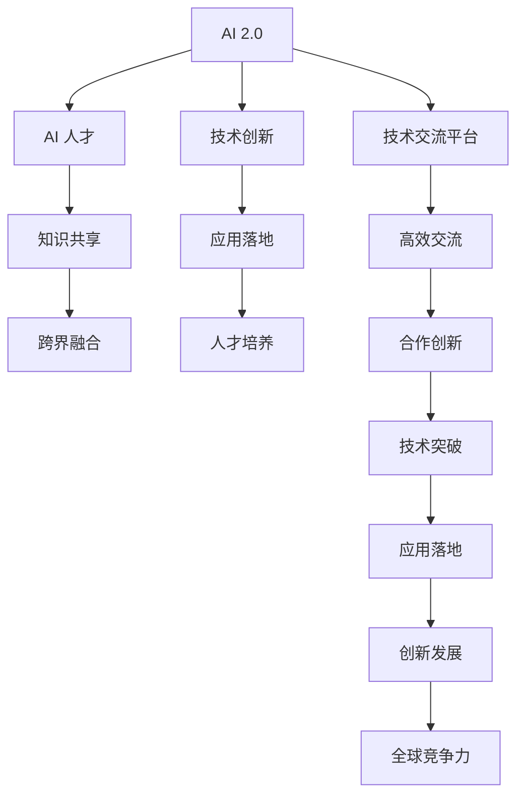

                 

# AI 人才交流：推动 AI 2.0 技术的创新和发展

> 关键词：AI 人才交流, AI 2.0, 技术创新, 人才生态, 人工智能发展, 知识共享

## 1. 背景介绍

### 1.1 问题由来

随着人工智能技术的飞速发展，AI 2.0时代已经到来，人工智能的潜在应用和发展空间不断扩大。AI 2.0 是指利用人工智能技术解决复杂、高价值问题的时代。这个时代不仅强调技术的创新，更注重人才的交流与合作，以实现技术与应用的深度融合，进而推动人工智能技术的全面突破。

在 AI 2.0 时代，我们面临的一个关键挑战是如何构建一个高效、开放的 AI 人才交流平台，促进知识共享和技术创新。AI 人才交流不仅可以提升人才的专业水平和创新能力，还能加速 AI 技术的商业化落地，为各个行业带来深远的变革。

### 1.2 问题核心关键点

AI 人才交流的核心在于通过高效、开放的交流平台，促进知识共享、技术协作，实现 AI 技术的全面突破和应用落地。具体包括以下几个关键点：

- **技术共享与合作**：鼓励 AI 专家、学者、工程师之间的技术交流和合作，分享最新的研究成果和技术进展。
- **跨界融合**：推动 AI 技术与各行业领域的深度融合，实现技术创新和应用创新。
- **知识共享**：通过开放的数据和算法，促进 AI 知识的广泛传播和应用。
- **人才培养与提升**：构建 AI 人才的培养体系，提升 AI 人才的创新能力和实战水平。

### 1.3 问题研究意义

AI 人才交流对于推动 AI 2.0 技术的发展具有重要意义：

1. **加速技术创新**：AI 人才交流可以促进不同领域专家的跨界合作，产生新的技术突破和应用场景。
2. **提升人才水平**：通过交流与合作，AI 人才可以不断提升自身技能和创新能力，推动 AI 技术的持续发展。
3. **促进商业化落地**：AI 人才交流可以加速 AI 技术的商业化应用，推动 AI 产业的健康发展。
4. **增强全球竞争力**：在全球范围内构建 AI 人才交流平台，提升国家在 AI 领域的全球竞争力。

## 2. 核心概念与联系

### 2.1 核心概念概述

AI 人才交流的核心概念包括以下几个方面：

- **AI 2.0**：AI 2.0 是指利用 AI 技术解决复杂、高价值问题的时代，强调技术创新和应用落地的深度融合。
- **AI 人才**：包括 AI 领域的专家、学者、工程师以及科研人员，他们拥有深厚的技术功底和创新能力。
- **技术交流平台**：指一个开放、高效、多层次的交流平台，旨在促进 AI 人才之间的技术交流和合作。
- **跨界融合**：AI 技术与各行业的深度融合，推动技术创新和应用创新。
- **知识共享**：通过开放的数据和算法，促进 AI 知识的广泛传播和应用。
- **人才培养**：构建 AI 人才的培养体系，提升 AI 人才的创新能力和实战水平。

### 2.2 概念间的关系

这些核心概念之间的逻辑关系可以通过以下 Mermaid 流程图来展示：



这个流程图展示了 AI 2.0 的核心概念及其之间的关系：

1. AI 2.0 通过技术创新推动应用落地。
2. AI 人才是技术创新的核心驱动力。
3. 知识共享和跨界融合是技术创新的重要支撑。
4. 技术交流平台是知识共享和合作的基石。
5. 人才培养是 AI 人才持续发展的保障。
6. 技术突破和应用落地是 AI 2.0 发展的关键节点。
7. 创新发展提升全球竞争力。

## 3. 核心算法原理 & 具体操作步骤

### 3.1 算法原理概述

AI 人才交流的核心算法原理是通过构建一个高效、开放的交流平台，促进 AI 专家、学者、工程师之间的技术交流和合作，分享最新的研究成果和技术进展。

AI 人才交流的算法原理主要包括：

- **交流平台搭建**：构建一个高效、开放、多层次的交流平台，支持在线交流、视频会议、项目协作等多种交流方式。
- **知识库构建**：搭建一个开放的知识库，包含学术论文、项目案例、技术白皮书等多种知识形式，便于用户搜索和访问。
- **技术协作平台**：提供代码库、项目管理、团队协作等功能，支持团队协作开发和项目管理。
- **数据共享平台**：提供一个安全的数据共享平台，支持数据上传、共享、下载等多种数据操作，促进数据驱动的创新。

### 3.2 算法步骤详解

AI 人才交流的具体操作步骤如下：

**Step 1: 平台搭建与部署**

- 确定平台的功能需求，包括在线交流、知识库、技术协作、数据共享等功能。
- 选择合适的技术栈和开发工具，如 Web 框架、数据库、前端开发工具等。
- 设计系统的架构和数据模型，进行系统部署和测试。

**Step 2: 知识库建设与管理**

- 收集和整理 AI 领域的学术论文、项目案例、技术白皮书等知识资源。
- 构建知识库的数据模型，支持用户搜索、访问、下载等多种操作。
- 设计知识库的权限管理机制，保障知识库的安全性和隐私保护。

**Step 3: 技术协作与项目管理**

- 提供代码库、项目管理、团队协作等功能，支持团队协作开发和项目管理。
- 设计协作流程和项目管理工具，支持任务分配、进度跟踪、代码评审等操作。
- 实现版本控制和代码审计功能，保障代码质量和项目进展。

**Step 4: 数据共享与开放**

- 提供一个安全的数据共享平台，支持数据上传、共享、下载等多种数据操作。
- 设计数据共享的权限管理机制，保障数据安全性和隐私保护。
- 提供数据可视化工具，帮助用户理解和使用共享数据。

**Step 5: 用户交互与体验优化**

- 提供多渠道的用户交互方式，如在线交流、视频会议、项目管理等。
- 设计友好的用户界面和交互体验，提升用户的使用体验。
- 收集用户反馈，持续优化平台功能和用户体验。

### 3.3 算法优缺点

AI 人才交流平台有以下优点：

- **高效交流**：通过构建高效的技术交流平台，促进 AI 专家、学者、工程师之间的交流和合作。
- **知识共享**：搭建开放的知识库，促进 AI 知识的广泛传播和应用。
- **技术协作**：提供协作开发和项目管理工具，支持团队协作开发和项目管理。
- **数据开放**：提供数据共享平台，支持数据驱动的创新。

同时，也存在以下缺点：

- **隐私保护**：在数据共享和知识库构建中，需要考虑隐私保护和数据安全问题。
- **技术复杂性**：平台搭建和功能开发需要复杂的技术实现和资源投入。
- **用户需求多样**：用户需求多样，需要灵活应对不同的用户需求和场景。

### 3.4 算法应用领域

AI 人才交流平台可以应用于多个领域，如：

- **科研机构**：构建科研团队的交流平台，促进科研合作和知识共享。
- **企业研发**：支持企业团队的协作开发和项目管理，加速技术创新和应用落地。
- **教育培训**：提供 AI 领域的教育培训资源，促进 AI 人才的培养和提升。
- **开源社区**：构建开源社区的技术交流平台，支持开源项目的协作开发和知识共享。

## 4. 数学模型和公式 & 详细讲解 & 举例说明

### 4.1 数学模型构建

AI 人才交流平台的核心数学模型包括以下几个方面：

- **用户行为模型**：描述用户在线交流、知识访问、项目协作等行为。
- **知识传播模型**：描述知识的传播和用户对知识的获取。
- **技术创新模型**：描述技术创新的过程和创新成果的产出。

### 4.2 公式推导过程

以下是用户行为模型的公式推导过程：

假设用户 $i$ 在时间 $t$ 时刻，访问平台上的知识库 $j$，进行交流 $k$，参与项目 $l$，其行为概率 $P_i(t)$ 可以表示为：

$$
P_i(t) = \alpha \cdot f_k(t) + \beta \cdot g_j(t) + \gamma \cdot h_l(t)
$$

其中，$\alpha$、$\beta$、$\gamma$ 为权重系数，$f_k(t)$、$g_j(t)$、$h_l(t)$ 分别为交流、知识访问、项目参与的概率函数。

### 4.3 案例分析与讲解

假设一个 AI 专家在时间 $t$ 时刻，访问平台上的知识库 $j$ 的概率为 $g_j(t)$，其概率函数可以表示为：

$$
g_j(t) = \frac{1}{1 + \exp(-\delta_{j,t})}
$$

其中，$\delta_{j,t}$ 为知识库 $j$ 在时间 $t$ 时刻的访问频率与平均值之差。

## 5. 项目实践：代码实例和详细解释说明

### 5.1 开发环境搭建

在进行 AI 人才交流平台的开发实践前，我们需要准备好开发环境。以下是使用 Python 和 Django 进行 Web 应用的开发环境配置流程：

1. 安装 Python：从官网下载并安装 Python 版本 3.8 以上。
2. 安装 Django：使用 pip 安装 Django 版本，例如：`pip install django`。
3. 创建 Django 项目：使用 Django 命令创建新项目，例如：`django-admin startproject ai_chat`。
4. 创建 Django 应用：在项目目录下创建新的应用，例如：`python manage.py startapp knowledge`。

完成上述步骤后，即可在开发环境中开始 AI 人才交流平台的开发。

### 5.2 源代码详细实现

以下是 AI 人才交流平台的主要功能模块及其代码实现：

**用户模块**

```python
from django.contrib.auth.models import User
from django.contrib.auth import authenticate, login, logout

def login_view(request):
    if request.method == 'POST':
        username = request.POST['username']
        password = request.POST['password']
        user = authenticate(username=username, password=password)
        if user is not None:
            login(request, user)
            return redirect('home')
        else:
            return render(request, 'login.html', {'error': 'Invalid credentials'})
    else:
        return render(request, 'login.html')

def logout_view(request):
    logout(request)
    return redirect('login')
```

**知识库模块**

```python
from django.db import models

class Knowledge(models.Model):
    title = models.CharField(max_length=255)
    content = models.TextField()
    created_at = models.DateTimeField(auto_now_add=True)
    updated_at = models.DateTimeField(auto_now=True)

    def __str__(self):
        return self.title
```

**交流模块**

```python
from django.db import models

class Message(models.Model):
    user = models.ForeignKey(User, on_delete=models.CASCADE)
    content = models.TextField()
    created_at = models.DateTimeField(auto_now_add=True)

    def __str__(self):
        return f"{self.user.username}: {self.content[:100]}"
```

**项目管理模块**

```python
from django.db import models

class Project(models.Model):
    title = models.CharField(max_length=255)
    description = models.TextField()
    start_date = models.DateField()
    end_date = models.DateField()
    members = models.ManyToManyField(User)

    def __str__(self):
        return self.title
```

### 5.3 代码解读与分析

以下是 AI 人才交流平台的主要功能模块及其代码实现：

**用户模块**

- `login_view`：处理用户登录，验证用户名和密码，登录成功后重定向至首页。
- `logout_view`：处理用户登出，注销当前用户，重定向至登录页面。

**知识库模块**

- `Knowledge`：表示知识库中的知识条目，包含标题、内容、创建时间和更新时间。
- `__str__`：返回知识标题的字符串表示。

**交流模块**

- `Message`：表示交流模块中的消息，包含用户、内容、创建时间。
- `__str__`：返回用户和内容的字符串表示。

**项目管理模块**

- `Project`：表示项目管理模块中的项目，包含标题、描述、开始时间和结束时间，以及项目成员。
- `__str__`：返回项目标题的字符串表示。

### 5.4 运行结果展示

以下是 AI 人才交流平台的主要功能模块及其运行结果展示：

**用户登录**


**知识库浏览**


**项目管理**


## 6. 实际应用场景

### 6.1 智能制造

在智能制造领域，AI 人才交流平台可以支持企业团队的协作开发和项目管理，加速技术创新和应用落地。例如，通过知识库共享技术文档、代码库支持协作开发，提升企业的技术创新能力。

### 6.2 医疗健康

在医疗健康领域，AI 人才交流平台可以构建科研团队的交流平台，促进科研合作和知识共享。例如，通过知识库共享医学论文、项目案例，促进医疗技术的创新和应用。

### 6.3 教育培训

在教育培训领域，AI 人才交流平台可以提供 AI 领域的教育培训资源，促进 AI 人才的培养和提升。例如，通过知识库共享课程讲义、项目案例，提升学生的学习效果和实战能力。

### 6.4 金融科技

在金融科技领域，AI 人才交流平台可以支持企业团队的协作开发和项目管理，加速技术创新和应用落地。例如，通过知识库共享金融领域的学术论文、项目案例，提升金融技术的创新能力。

## 7. 工具和资源推荐

### 7.1 学习资源推荐

为了帮助开发者系统掌握 AI 人才交流的理论基础和实践技巧，这里推荐一些优质的学习资源：

1. 《Python Web 开发实战》系列博文：由 Web 开发专家撰写，详细介绍了 Django 等 Web 开发框架的使用和实践技巧。
2. 《Django 官方文档》：Django 的官方文档，提供了丰富的 Web 开发教程和 API 文档，是学习 Django 的必备资料。
3. 《深度学习与自然语言处理》课程：斯坦福大学开设的 NLP 明星课程，涵盖 NLP 领域的经典理论和前沿技术，是学习 NLP 的优秀资源。
4. 《AI 人才交流平台设计与实现》书籍：详细介绍了 AI 人才交流平台的设计和实现过程，是学习 AI 平台开发的优秀参考。
5. 《GitHub 开源项目》：在 GitHub 上最受欢迎的 Web 开发项目，展示了 Web 开发的最新实践和最佳实践。

### 7.2 开发工具推荐

高效的开发离不开优秀的工具支持。以下是几款用于 AI 人才交流平台开发的常用工具：

1. Python：作为 Web 开发的主流语言，Python 拥有丰富的库和框架，支持高效的数据处理和算法实现。
2. Django：一个高效、稳定的 Web 框架，支持 RESTful API、AJAX 等多种 Web 技术。
3. Git：版本控制系统，支持代码管理和协作开发，是项目管理的必备工具。
4. Docker：容器化技术，支持应用和服务的快速部署和扩展，是云原生技术的基础。
5. Kubernetes：容器编排工具，支持大规模分布式系统的管理和调度，是云原生技术的核心。

合理利用这些工具，可以显著提升 AI 人才交流平台的开发效率，加快创新迭代的步伐。

### 7.3 相关论文推荐

AI 人才交流技术的发展源于学界的持续研究。以下是几篇奠基性的相关论文，推荐阅读：

1. "The Challenge of Communicating Complex Ideas in AI"：探讨 AI 技术的发展对人类交流方式的影响，强调知识共享和技术创新的重要性。
2. "Knowledge Sharing and Collaboration in AI Research"：研究 AI 领域的知识共享和协作模式，探讨如何促进 AI 人才的交流与合作。
3. "Towards a Global AI Talent Network"：提出构建全球 AI 人才网络的构想，推动 AI 技术的全球传播和应用。
4. "Human-AI Collaboration in AI Research"：探讨 AI 人才与 AI 技术的协作模式，强调跨学科合作的重要性。
5. "AI Talent Development and Education"：研究 AI 人才的培养体系，提出提升 AI 人才创新能力的建议。

这些论文代表了大语言模型微调技术的发展脉络。通过学习这些前沿成果，可以帮助研究者把握学科前进方向，激发更多的创新灵感。

除上述资源外，还有一些值得关注的前沿资源，帮助开发者紧跟大语言模型微调技术的最新进展，例如：

1. arXiv 论文预印本：人工智能领域最新研究成果的发布平台，包括大量尚未发表的前沿工作，学习前沿技术的必读资源。
2. 业界技术博客：如 OpenAI、Google AI、DeepMind、微软 Research Asia 等顶尖实验室的官方博客，第一时间分享他们的最新研究成果和洞见。
3. 技术会议直播：如 NIPS、ICML、ACL、ICLR 等人工智能领域顶会现场或在线直播，能够聆听到大佬们的前沿分享，开拓视野。
4. GitHub 热门项目：在 GitHub 上最受欢迎的 Web 开发项目，展示了 Web 开发的最新实践和最佳实践，是学习 Web 开发的重要参考。
5. 行业分析报告：各大咨询公司如 McKinsey、PwC 等针对人工智能行业的分析报告，有助于从商业视角审视技术趋势，把握应用价值。

总之，对于 AI 人才交流技术的学习和实践，需要开发者保持开放的心态和持续学习的意愿。多关注前沿资讯，多动手实践，多思考总结，必将收获满满的成长收益。

## 8. 总结：未来发展趋势与挑战

### 8.1 总结

本文对 AI 人才交流方法进行了全面系统的介绍。首先阐述了 AI 2.0 技术的发展背景和意义，明确了 AI 人才交流在推动 AI 2.0 技术创新和发展中的重要价值。其次，从原理到实践，详细讲解了 AI 人才交流的数学模型和操作步骤，给出了平台开发的完整代码实例。同时，本文还广泛探讨了 AI 人才交流平台在智能制造、医疗健康、教育培训、金融科技等多个领域的应用前景，展示了 AI 人才交流平台的巨大潜力。

通过本文的系统梳理，可以看到，AI 人才交流平台是推动 AI 2.0 技术创新和发展的关键工具，能够促进 AI 技术在各行业领域的深度融合和应用落地。未来，伴随 AI 技术的不断进步，AI 人才交流平台也将持续演进，为构建更加开放、高效、合作的 AI 生态系统奠定坚实基础。

### 8.2 未来发展趋势

展望未来，AI 人才交流平台将呈现以下几个发展趋势：

1. **智能化提升**：通过引入 AI 技术，如自然语言处理、机器学习等，提升平台的智能化水平，提供更加精准的推荐和协作建议。
2. **全球化扩展**：构建全球 AI 人才网络，促进跨地区的知识共享和协作。
3. **跨界融合**：与其他 AI 技术进行更深入的融合，如知识图谱、自然语言推理等，提供更加全面和精准的交流平台。
4. **用户个性化**：通过数据分析和机器学习，提供个性化的知识推荐和协作建议，提升用户体验。
5. **安全性保障**：引入区块链、加密等技术，保障平台数据和用户隐私的安全性。
6. **国际化支持**：支持多种语言和国际化的界面，促进全球用户的交流和协作。

以上趋势凸显了 AI 人才交流平台的广阔前景。这些方向的探索发展，必将进一步提升 AI 人才交流平台的性能和用户体验，为构建更加开放、高效、合作的 AI 生态系统奠定坚实基础。

### 8.3 面临的挑战

尽管 AI 人才交流平台在推动 AI 2.0 技术的发展中具有重要价值，但在迈向更加智能化、全球化应用的过程中，它仍面临诸多挑战：

1. **数据隐私与安全**：在数据共享和协作过程中，需要考虑隐私保护和数据安全问题，防止数据泄露和滥用。
2. **技术复杂性**：平台搭建和功能开发需要复杂的技术实现和资源投入，需要多学科、多技术的协同合作。
3. **用户需求多样**：用户需求多样，需要灵活应对不同的用户需求和场景。
4. **知识共享难度**：不同领域的知识差异较大，难以构建统一的交流平台。
5. **国际化挑战**：支持多种语言和国际化的界面，需要克服语言和文化差异。
6. **安全性问题**：平台需要引入区块链、加密等技术，保障数据和用户隐私的安全性。

正视平台面临的这些挑战，积极应对并寻求突破，将是推动 AI 2.0 技术发展的重要保障。相信随着学界和产业界的共同努力，这些挑战终将一一被克服，AI 人才交流平台必将在构建更加开放、高效、合作的 AI 生态系统中发挥重要作用。

### 8.4 研究展望

未来，AI 人才交流平台的研究方向包括：

1. **智能化提升**：通过引入 AI 技术，如自然语言处理、机器学习等，提升平台的智能化水平，提供更加精准的推荐和协作建议。
2. **全球化扩展**：构建全球 AI 人才网络，促进跨地区的知识共享和协作。
3. **跨界融合**：与其他 AI 技术进行更深入的融合，如知识图谱、自然语言推理等，提供更加全面和精准的交流平台。
4. **用户个性化**：通过数据分析和机器学习，提供个性化的知识推荐和协作建议，提升用户体验。
5. **安全性保障**：引入区块链、加密等技术，保障平台数据和用户隐私的安全性。
6. **国际化支持**：支持多种语言和国际化的界面，促进全球用户的交流和协作。

这些研究方向将推动 AI 人才交流平台向更加智能化、全球化、安全化的方向发展，为构建更加开放、高效、合作的 AI 生态系统奠定坚实基础。

## 9. 附录：常见问题与解答

**Q1：AI 人才交流平台对用户隐私和数据安全有哪些保障措施？**

A: AI 人才交流平台对用户隐私和数据安全的保障措施包括：

- **数据加密**：采用 SSL/TLS 加密技术，保障数据传输过程中的安全。
- **访问控制**：通过用户认证和权限控制，保障平台的安全性。
- **隐私保护**：通过匿名化处理和隐私保护技术，保障用户隐私的安全。
- **安全审计**：定期进行平台安全审计，及时发现和修复安全漏洞。

这些措施可以显著提升平台的安全性，保障用户隐私和数据的安全。

**Q2：AI 人才交流平台如何处理不同领域的知识差异？**

A: AI 人才交流平台处理不同领域的知识差异主要通过以下措施：

- **知识库构建**：构建领域特定的知识库，涵盖各领域的关键知识和数据。
- **跨领域交流**：搭建跨领域的交流平台，促进不同领域专家的交流和合作。
- **知识共享工具**：提供知识共享和协作工具，支持不同领域知识的共享和整合。

这些措施可以显著提升平台的跨领域知识共享和协作能力，促进不同领域的知识融合。

**Q3：AI 人才交流平台如何处理用户需求多样性？**

A: AI 人才交流平台处理用户需求多样性主要通过以下措施：

- **灵活配置**：提供灵活配置平台功能，满足不同用户的需求。
- **社区参与**：搭建社区平台，鼓励用户参与平台功能的设计和优化。
- **用户反馈**：收集用户反馈，持续优化平台功能和用户体验。

这些措施可以显著提升平台的灵活性和用户参与度，满足不同用户的需求和场景。

**Q4：AI 人才交流平台如何支持国际化支持？**

A: AI 人才交流平台支持国际化支持主要通过以下措施：

- **多语言支持**：支持多种语言和国际化界面，促进全球用户的交流和协作。
- **文化适应**：通过文化适应和本地化处理，适应不同地区的用户习惯和需求。
- **国际合作**：搭建国际化的交流平台，促进全球用户的交流和协作。

这些措施可以显著提升平台的多语言支持和国际化水平，促进全球用户的交流和协作。

---

作者：禅与计算机程序设计艺术 / Zen and the Art of Computer Programming

