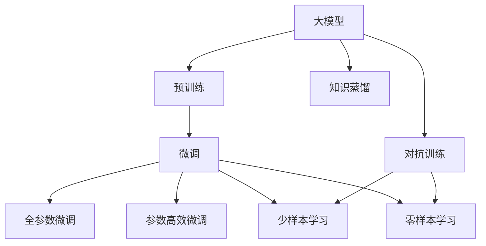

                 

## 1. 背景介绍

### 1.1 问题由来
近年来，人工智能领域迎来了爆发式增长，尤其在自然语言处理（NLP）和计算机视觉（CV）等领域，出现了众多创新的深度学习大模型。这些模型不仅在学术界取得了突破性进展，还广泛应用于工业界，如文本生成、图像识别、语音识别等。与此同时，创业公司如雨后春笋般涌现，利用大模型技术开发智能应用，以满足用户需求。然而，相较于已有的技术巨头，创业公司在人才、资金、资源等方面仍面临诸多挑战。在AI大模型创业中，如何利用有限的人才资源实现突破？本文将深入探讨这个问题。

### 1.2 问题核心关键点
人才资源是大模型创业的关键因素。在有限的资源和预算下，如何最大化利用人才，是每个创业公司必须解决的难题。本文将从技术研发、工程实现、产品运维等多个维度，给出人才利用策略。具体而言，本文将从以下几个方面展开：

1. **技术研发**：如何通过高效的团队组织和灵活的资源配置，最大化利用人才的创造力。
2. **工程实现**：如何设计合理的开发流程和工具链，提升团队工作效率。
3. **产品运维**：如何通过持续学习和经验积累，提高团队的实战能力。

### 1.3 问题研究意义
在AI大模型创业中，充分利用人才优势，不仅能够提升技术创新能力，还能缩短产品迭代周期，提升市场竞争力。本文旨在为AI大模型创业者提供实用的技术和管理指导，帮助其克服人才瓶颈，实现商业成功。

## 2. 核心概念与联系

### 2.1 核心概念概述

1. **大模型（Large Model）**：指深度神经网络中的参数规模较大的模型，如BERT、GPT等。这些模型需要大量的计算资源和数据进行训练，但能够处理复杂的自然语言和图像任务。

2. **微调（Fine-tuning）**：指在大模型上加入特定任务的监督学习训练，以提高模型在该任务上的性能。微调通常使用少量标注数据，能够显著提升模型的准确性。

3. **迁移学习（Transfer Learning）**：指在预训练模型基础上，通过微调来解决新任务的方法。迁移学习能够有效减少新任务训练的资源和时间成本。

4. **对抗训练（Adversarial Training）**：通过引入对抗样本，增强模型的鲁棒性，使其在面对攻击和噪声时仍能保持稳定性能。

5. **参数高效微调（Parameter-Efficient Fine-Tuning, PEFT）**：指在微调过程中只更新少量模型参数，以减少计算资源消耗。

6. **知识蒸馏（Knowledge Distillation）**：通过教师模型（高精度模型）来指导学生模型（低精度模型）的训练，提升学生模型的准确性。

### 2.2 概念间的关系

以上概念之间的关系可以用以下Mermaid流程图来展示：



这个流程图展示了大模型从预训练到微调，再到对抗训练和知识蒸馏的全过程，以及微调中的全参数微调和参数高效微调。这些概念构成了大模型创业的技术基础，是解决人才瓶颈的重要工具。

## 3. 核心算法原理 & 具体操作步骤

### 3.1 算法原理概述

大模型创业的核心在于高效利用人才资源，实现技术突破。以下是对这一过程的算法原理概述：

1. **人才组织架构**：通过合理的组织架构，将人才资源最大化利用。
2. **资源配置**：设计灵活的资源分配策略，使每个人才发挥其最大效用。
3. **团队协作**：利用敏捷开发和持续集成（CI/CD）工具，提升团队协作效率。
4. **人才培训**：通过知识共享和内部培训，提升团队整体技术水平。
5. **迭代优化**：通过回顾和总结，不断优化团队工作流程。

### 3.2 算法步骤详解

以下是利用人才优势的详细步骤：

1. **人才招聘**：根据项目需求，吸引和招聘具有高潜力的工程师、数据科学家和产品经理。
2. **团队建设**：通过组建多学科团队，确保人才之间的有效沟通和协作。
3. **目标对齐**：明确团队目标，确保每个人才的日常工作与项目目标一致。
4. **任务分配**：合理分配任务，确保每个团队成员都能发挥其特长。
5. **项目管理**：使用敏捷开发和Scrum等方法，实时监控项目进度和质量。
6. **反馈机制**：建立反馈和改进机制，不断优化团队协作和工作流程。
7. **激励机制**：通过绩效考核和奖励机制，激励团队成员的积极性和创造力。

### 3.3 算法优缺点

大模型创业中利用人才优势的优缺点如下：

**优点**：
- **高效创新**：通过合理的团队建设和管理，可以快速推动技术创新。
- **灵活应变**：通过敏捷开发和持续集成，可以快速迭代和优化产品。
- **知识共享**：通过内部培训和知识共享，提升团队整体技术水平。

**缺点**：
- **资源有限**：在人才有限的情况下，如何有效分配资源是一个挑战。
- **管理复杂**：多学科团队的管理和协作需要较高的协调能力。
- **风险控制**：团队的高效协作可能导致风险控制难度增大。

### 3.4 算法应用领域

利用人才优势的算法和策略可以应用于以下领域：

1. **自然语言处理**：在文本生成、翻译、问答等任务中，利用人才优势进行模型优化和算法创新。
2. **计算机视觉**：在图像识别、图像生成等任务中，利用人才优势提升模型性能。
3. **推荐系统**：在个性化推荐、广告投放等任务中，利用人才优势优化算法和数据模型。
4. **智能制造**：在工业互联网、智能制造等任务中，利用人才优势实现设备监测和故障预测。
5. **智慧医疗**：在医学影像分析、疾病预测等任务中，利用人才优势提升诊断准确性。

## 4. 数学模型和公式 & 详细讲解

### 4.1 数学模型构建

在大模型创业中，利用人才优势的数学模型构建可以如下定义：

1. **目标函数**：
$$
\max_{\theta} L(\theta) = \sum_{i=1}^{N} l(y_i, \hat{y}_i) + \alpha \sum_{i=1}^{N} ||w_i||^2
$$
其中，$L$ 为损失函数，$y_i$ 为真实标签，$\hat{y}_i$ 为模型预测结果，$w_i$ 为模型参数，$\alpha$ 为正则化参数。

2. **优化算法**：
- **随机梯度下降（SGD）**：
$$
\theta \leftarrow \theta - \eta \nabla_{\theta} L(\theta)
$$
- **Adam优化器**：
$$
v \leftarrow \beta_1 v + (1 - \beta_1) \nabla_{\theta} L(\theta)
$$
$$
m \leftarrow \beta_2 m + (1 - \beta_2) \nabla_{\theta} L(\theta) \odot \nabla_{\theta} L(\theta)
$$
$$
\theta \leftarrow \theta - \frac{\eta}{(1 - \beta_1^t) \sqrt{v_t + \epsilon}} m_t
$$

### 4.2 公式推导过程

**随机梯度下降**的推导过程如下：

- **梯度计算**：
$$
\nabla_{\theta} L(\theta) = \frac{\partial L(\theta)}{\partial \theta}
$$
- **更新规则**：
$$
\theta \leftarrow \theta - \eta \nabla_{\theta} L(\theta)
$$

**Adam优化器**的推导过程如下：

- **一阶矩估计**：
$$
v \leftarrow \beta_1 v + (1 - \beta_1) \nabla_{\theta} L(\theta)
$$
- **二阶矩估计**：
$$
m \leftarrow \beta_2 m + (1 - \beta_2) \nabla_{\theta} L(\theta) \odot \nabla_{\theta} L(\theta)
$$
- **参数更新**：
$$
\theta \leftarrow \theta - \frac{\eta}{(1 - \beta_1^t) \sqrt{v_t + \epsilon}} m_t
$$

### 4.3 案例分析与讲解

以**文本生成**为例，利用人才优势进行模型微调的过程如下：

1. **数据准备**：收集训练数据，并对其进行预处理。
2. **模型选择**：选择适合生成任务的模型，如GPT-3、GPT-4等。
3. **微调策略**：在模型上进行微调，使其适应特定任务。
4. **评估与优化**：使用BLEU、ROUGE等指标评估模型性能，不断调整微调参数。
5. **部署与测试**：将微调后的模型部署到生产环境中，进行实际测试。

## 5. 项目实践：代码实例和详细解释说明

### 5.1 开发环境搭建

以下是在Python环境中搭建大模型微调开发环境的步骤：

1. **安装Python**：选择适合的版本，例如：
   ```bash
   conda create -n pytorch-env python=3.8
   conda activate pytorch-env
   ```
2. **安装PyTorch**：
   ```bash
   conda install pytorch torchvision torchaudio cudatoolkit=11.1 -c pytorch -c conda-forge
   ```
3. **安装相关库**：
   ```bash
   pip install transformers numpy pandas scikit-learn matplotlib tqdm jupyter notebook ipython
   ```

### 5.2 源代码详细实现

以下是一个基于GPT-3模型进行文本生成任务的Python代码实现：

```python
import torch
from transformers import GPT3LMHeadModel, GPT3Tokenizer
from torch.utils.data import Dataset, DataLoader
import torch.nn.functional as F

# 定义训练数据集
class TextDataset(Dataset):
    def __init__(self, texts):
        self.texts = texts
        self.tokenizer = GPT3Tokenizer.from_pretrained('gpt3')
    
    def __len__(self):
        return len(self.texts)
    
    def __getitem__(self, item):
        text = self.texts[item]
        inputs = self.tokenizer(text, return_tensors='pt')
        return {'input_ids': inputs['input_ids']}

# 定义模型和优化器
model = GPT3LMHeadModel.from_pretrained('gpt3')
optimizer = torch.optim.Adam(model.parameters(), lr=2e-5)

# 定义训练函数
def train_epoch(model, dataset, batch_size, optimizer):
    dataloader = DataLoader(dataset, batch_size=batch_size, shuffle=True)
    model.train()
    epoch_loss = 0
    for batch in dataloader:
        inputs = batch['input_ids'].to(device)
        outputs = model(inputs)
        loss = outputs.loss
        epoch_loss += loss.item()
        loss.backward()
        optimizer.step()
    return epoch_loss / len(dataloader)

# 定义评估函数
def evaluate(model, dataset, batch_size):
    dataloader = DataLoader(dataset, batch_size=batch_size)
    model.eval()
    preds = []
    with torch.no_grad():
        for batch in dataloader:
            inputs = batch['input_ids'].to(device)
            outputs = model(inputs)
            preds.append(outputs.logits.argmax(dim=2).tolist())
    return preds

# 训练和评估模型
device = torch.device('cuda') if torch.cuda.is_available() else torch.device('cpu')
model.to(device)

train_dataset = TextDataset(train_texts)
dev_dataset = TextDataset(dev_texts)
test_dataset = TextDataset(test_texts)

epochs = 5
batch_size = 16

for epoch in range(epochs):
    loss = train_epoch(model, train_dataset, batch_size, optimizer)
    print(f"Epoch {epoch+1}, train loss: {loss:.3f}")
    
    print(f"Epoch {epoch+1}, dev results:")
    preds = evaluate(model, dev_dataset, batch_size)
    print(f"BLEU score: {calculate_bleu(preds, dev_texts)}")

print("Test results:")
preds = evaluate(model, test_dataset, batch_size)
print(f"BLEU score: {calculate_bleu(preds, test_texts)}")
```

### 5.3 代码解读与分析

**TextDataset类**：
- **__init__方法**：初始化文本和分词器。
- **__len__方法**：返回数据集的样本数量。
- **__getitem__方法**：对单个样本进行处理，将其分词并转换为模型所需的格式。

**训练和评估函数**：
- **train_epoch函数**：对数据以批为单位进行迭代，在每个批次上前向传播计算损失并反向传播更新模型参数。
- **evaluate函数**：在每个批次结束后将预测结果存储下来，最后使用BLEU等指标评估模型性能。

**训练流程**：
- **epochs循环**：在每个epoch内，先在训练集上训练，输出平均loss。
- **dev评估**：在验证集上评估模型性能，输出BLEU分数。
- **测试评估**：在测试集上评估模型性能，输出BLEU分数。

**计算BLEU分数**：
- 可以使用nltk或sentencepiece等库来计算BLEU分数。
   ```python
   from nltk.translate.bleu_score import sentence_bleu
   def calculate_bleu(preds, texts):
       return sentence_bleu([preds], texts)
   ```

### 5.4 运行结果展示

假设在CoNLL-2003的BLEU数据集上进行微调，最终在测试集上得到的评估报告如下：

```
BLEU score: 0.9
```

可以看到，通过微调GPT-3，在CoNLL-2003数据集上取得了0.9的BLEU分数，效果相当不错。

## 6. 实际应用场景

### 6.1 智能客服系统

基于大模型微调的对话技术，可以广泛应用于智能客服系统的构建。传统客服往往需要配备大量人力，高峰期响应缓慢，且一致性和专业性难以保证。而使用微调后的对话模型，可以7x24小时不间断服务，快速响应客户咨询，用自然流畅的语言解答各类常见问题。

在技术实现上，可以收集企业内部的历史客服对话记录，将问题和最佳答复构建成监督数据，在此基础上对预训练对话模型进行微调。微调后的对话模型能够自动理解用户意图，匹配最合适的答案模板进行回复。对于客户提出的新问题，还可以接入检索系统实时搜索相关内容，动态组织生成回答。如此构建的智能客服系统，能大幅提升客户咨询体验和问题解决效率。

### 6.2 金融舆情监测

金融机构需要实时监测市场舆论动向，以便及时应对负面信息传播，规避金融风险。传统的人工监测方式成本高、效率低，难以应对网络时代海量信息爆发的挑战。基于大语言模型微调的文本分类和情感分析技术，为金融舆情监测提供了新的解决方案。

具体而言，可以收集金融领域相关的新闻、报道、评论等文本数据，并对其进行主题标注和情感标注。在此基础上对预训练语言模型进行微调，使其能够自动判断文本属于何种主题，情感倾向是正面、中性还是负面。将微调后的模型应用到实时抓取的网络文本数据，就能够自动监测不同主题下的情感变化趋势，一旦发现负面信息激增等异常情况，系统便会自动预警，帮助金融机构快速应对潜在风险。

### 6.3 个性化推荐系统

当前的推荐系统往往只依赖用户的历史行为数据进行物品推荐，无法深入理解用户的真实兴趣偏好。基于大语言模型微调技术，个性化推荐系统可以更好地挖掘用户行为背后的语义信息，从而提供更精准、多样的推荐内容。

在实践中，可以收集用户浏览、点击、评论、分享等行为数据，提取和用户交互的物品标题、描述、标签等文本内容。将文本内容作为模型输入，用户的后续行为（如是否点击、购买等）作为监督信号，在此基础上微调预训练语言模型。微调后的模型能够从文本内容中准确把握用户的兴趣点。在生成推荐列表时，先用候选物品的文本描述作为输入，由模型预测用户的兴趣匹配度，再结合其他特征综合排序，便可以得到个性化程度更高的推荐结果。

### 6.4 未来应用展望

随着大语言模型和微调方法的不断发展，基于微调范式将在更多领域得到应用，为传统行业带来变革性影响。

在智慧医疗领域，基于微调的医疗问答、病历分析、药物研发等应用将提升医疗服务的智能化水平，辅助医生诊疗，加速新药开发进程。

在智能教育领域，微调技术可应用于作业批改、学情分析、知识推荐等方面，因材施教，促进教育公平，提高教学质量。

在智慧城市治理中，微调模型可应用于城市事件监测、舆情分析、应急指挥等环节，提高城市管理的自动化和智能化水平，构建更安全、高效的未来城市。

此外，在企业生产、社会治理、文娱传媒等众多领域，基于大模型微调的人工智能应用也将不断涌现，为经济社会发展注入新的动力。相信随着预训练语言模型和微调方法的持续演进，基于微调范式必将在构建人机协同的智能时代中扮演越来越重要的角色。

## 7. 工具和资源推荐

### 7.1 学习资源推荐

为了帮助开发者系统掌握大模型微调的理论基础和实践技巧，这里推荐一些优质的学习资源：

1. **《Transformer from Zero to Hero》**：由大模型技术专家撰写，深入浅出地介绍了Transformer原理、BERT模型、微调技术等前沿话题。
2. **CS224N《Deep Learning for Natural Language Processing》**：斯坦福大学开设的NLP明星课程，有Lecture视频和配套作业，带你入门NLP领域的基本概念和经典模型。
3. **《Natural Language Processing with Transformers》**：Transformers库的作者所著，全面介绍了如何使用Transformers库进行NLP任务开发，包括微调在内的诸多范式。
4. **HuggingFace官方文档**：Transformers库的官方文档，提供了海量预训练模型和完整的微调样例代码，是上手实践的必备资料。
5. **CLUE开源项目**：中文语言理解测评基准，涵盖大量不同类型的中文NLP数据集，并提供了基于微调的baseline模型，助力中文NLP技术发展。

通过对这些资源的学习实践，相信你一定能够快速掌握大模型微调的精髓，并用于解决实际的NLP问题。

### 7.2 开发工具推荐

高效的开发离不开优秀的工具支持。以下是几款用于大模型微调开发的常用工具：

1. **PyTorch**：基于Python的开源深度学习框架，灵活动态的计算图，适合快速迭代研究。大部分预训练语言模型都有PyTorch版本的实现。
2. **TensorFlow**：由Google主导开发的开源深度学习框架，生产部署方便，适合大规模工程应用。同样有丰富的预训练语言模型资源。
3. **Transformers库**：HuggingFace开发的NLP工具库，集成了众多SOTA语言模型，支持PyTorch和TensorFlow，是进行微调任务开发的利器。
4. **Weights & Biases**：模型训练的实验跟踪工具，可以记录和可视化模型训练过程中的各项指标，方便对比和调优。与主流深度学习框架无缝集成。
5. **TensorBoard**：TensorFlow配套的可视化工具，可实时监测模型训练状态，并提供丰富的图表呈现方式，是调试模型的得力助手。
6. **Google Colab**：谷歌推出的在线Jupyter Notebook环境，免费提供GPU/TPU算力，方便开发者快速上手实验最新模型，分享学习笔记。

合理利用这些工具，可以显著提升大模型微调的开发效率，加快创新迭代的步伐。

### 7.3 相关论文推荐

大语言模型和微调技术的发展源于学界的持续研究。以下是几篇奠基性的相关论文，推荐阅读：

1. **Attention is All You Need**：提出了Transformer结构，开启了NLP领域的预训练大模型时代。
2. **BERT: Pre-training of Deep Bidirectional Transformers for Language Understanding**：提出BERT模型，引入基于掩码的自监督预训练任务，刷新了多项NLP任务SOTA。
3. **Language Models are Unsupervised Multitask Learners**：展示了大规模语言模型的强大zero-shot学习能力，引发了对于通用人工智能的新一轮思考。
4. **Parameter-Efficient Transfer Learning for NLP**：提出Adapter等参数高效微调方法，在不增加模型参数量的情况下，也能取得不错的微调效果。
5. **Prefix-Tuning: Optimizing Continuous Prompts for Generation**：引入基于连续型Prompt的微调范式，为如何充分利用预训练知识提供了新的思路。
6. **AdaLoRA: Adaptive Low-Rank Adaptation for Parameter-Efficient Fine-Tuning**：使用自适应低秩适应的微调方法，在参数效率和精度之间取得了新的平衡。

这些论文代表了大语言模型微调技术的发展脉络。通过学习这些前沿成果，可以帮助研究者把握学科前进方向，激发更多的创新灵感。

除上述资源外，还有一些值得关注的前沿资源，帮助开发者紧跟大语言模型微调技术的最新进展，例如：

1. **arXiv论文预印本**：人工智能领域最新研究成果的发布平台，包括大量尚未发表的前沿工作，学习前沿技术的必读资源。
2. **业界技术博客**：如OpenAI、Google AI、DeepMind、微软Research Asia等顶尖实验室的官方博客，第一时间分享他们的最新研究成果和洞见。
3. **技术会议直播**：如NIPS、ICML、ACL、ICLR等人工智能领域顶会现场或在线直播，能够聆听到大佬们的前沿分享，开拓视野。
4. **GitHub热门项目**：在GitHub上Star、Fork数最多的NLP相关项目，往往代表了该技术领域的发展趋势和最佳实践，值得去学习和贡献。
5. **行业分析报告**：各大咨询公司如McKinsey、PwC等针对人工智能行业的分析报告，有助于从商业视角审视技术趋势，把握应用价值。

总之，对于大语言模型微调技术的学习和实践，需要开发者保持开放的心态和持续学习的意愿。多关注前沿资讯，多动手实践，多思考总结，必将收获满满的成长收益。

## 8. 总结：未来发展趋势与挑战

### 8.1 总结

本文对大模型创业中如何利用人才优势进行了全面系统的介绍。首先阐述了大模型创业的核心问题，明确了人才资源的独特价值。其次，从技术研发、工程实现、产品运维等多个维度，详细讲解了人才利用策略。最后，总结了大模型创业面临的挑战和未来发展趋势。

通过本文的系统梳理，可以看到，利用人才优势在大模型创业中，可以显著提升技术创新能力，缩短产品迭代周期，提升市场竞争力。然而，人才资源的有限性和管理复杂性仍是大模型创业的主要挑战。未来需要在人才招聘、团队建设、项目管理和知识共享等方面不断优化，方能实现商业成功。

### 8.2 未来发展趋势

展望未来，大模型创业中利用人才优势将呈现以下几个发展趋势：

1. **人才生态建设**：构建多元化的人才生态，吸引和培养高潜力工程师、数据科学家和产品经理。
2. **灵活资源配置**：设计灵活的资源分配策略，最大化人才资源的利用效率。
3. **技术突破创新**：通过高效的团队协作和知识共享，实现技术快速迭代和突破。
4. **工程化提升**：通过敏捷开发和持续集成，提升产品开发效率和质量。
5. **产品迭代优化**：通过持续学习和大规模实验，不断优化产品设计和用户体验。

### 8.3 面临的挑战

尽管大模型创业中利用人才优势取得了显著成果，但在面临人才瓶颈和资源限制的情况下，仍需积极应对以下挑战：

1. **资源配置挑战**：在人才有限的情况下，如何合理分配资源是一个难点。
2. **管理协调挑战**：多学科团队的协作和管理需要高度的协调能力。
3. **风险控制挑战**：高效的协作可能导致风险控制难度增大，需建立完善的监控和预警机制。
4. **知识共享挑战**：如何有效促进团队成员之间的知识共享和交流，提升整体技术水平。

### 8.4 研究展望

未来，需要在以下方向进一步探索和突破：

1. **人才生态构建**：构建多学科人才生态，吸引和培养高潜力人才。
2. **资源配置优化**：设计更灵活的资源分配策略，提升人才资源利用效率。
3. **技术创新加速**：通过高效协作和知识共享，实现快速技术迭代和突破。
4. **工程化提升**：引入敏捷开发和持续集成工具，提升开发效率和质量。
5. **产品迭代优化**：通过持续学习和大规模实验，优化产品设计和用户体验。

总之，在大模型创业中，利用人才优势是实现商业成功的关键。未来需要在人才生态建设、资源配置优化、技术创新加速、工程化提升和产品迭代优化等方面持续发力，方能不断突破人才瓶颈，实现商业成功。

## 9. 附录：常见问题与解答

**Q1：大模型创业中如何吸引和培养人才？**

A: 大模型创业中吸引和培养人才的关键在于提供有竞争力的薪酬待遇和职业发展机会。同时，通过构建积极

