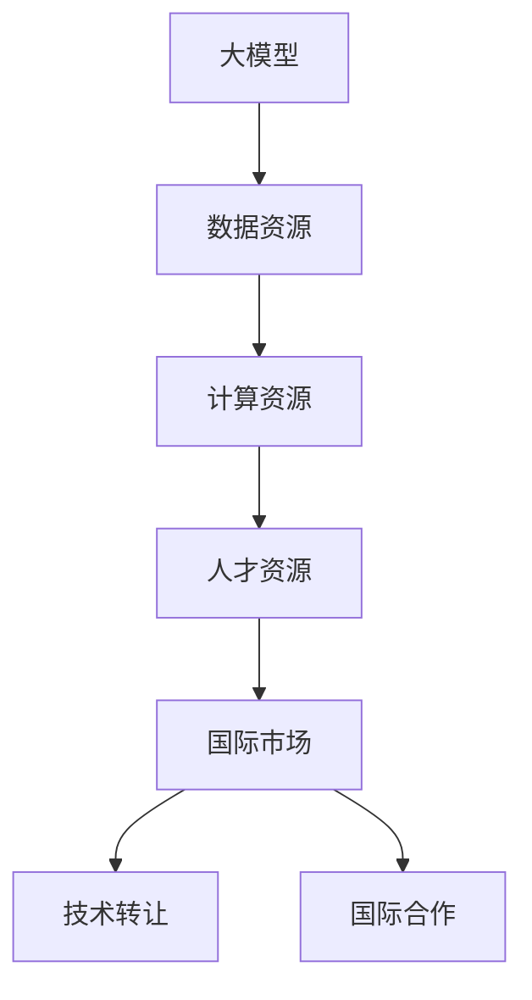
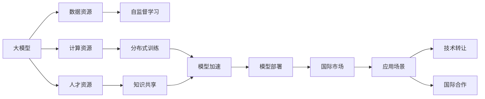

                 

# AI 大模型创业：如何利用国际优势？

> 关键词：AI创业,大模型,国际优势,技术转让,海外合作,人才引进,应用场景,未来趋势

## 1. 背景介绍

### 1.1 问题由来
随着人工智能技术的迅猛发展，大模型（如GPT-3、BERT等）在自然语言处理、计算机视觉、语音识别等领域展现出强大的应用潜力。这些大模型基于大规模无监督学习训练而成，具有高度的泛化能力和迁移学习能力，能够显著提升下游任务的性能。

然而，由于大模型训练所需的大量数据、计算资源和专业人才，其开发和应用成本高昂。对于创业公司而言，如何利用国际优势，突破这一困境，成为迫切需要解决的问题。国际优势主要体现在数据资源、计算资源、人才资源和市场环境的差异上。利用这些优势，创业公司可以在国际竞争中获得先机。

### 1.2 问题核心关键点
要利用国际优势进行AI大模型创业，主要需要解决以下几个关键问题：

1. **数据资源的获取与利用**：如何获取和利用来自不同国家和地区的丰富数据资源，训练大模型。
2. **计算资源的优化与管理**：如何在有限的计算资源下高效地训练和部署大模型。
3. **人才资源的引进与培养**：如何吸引和培养一批具有国际视野和前沿技术能力的人才团队。
4. **国际市场的开拓与竞争**：如何在全球市场中开拓新的应用场景，并应对国际竞争对手的挑战。

### 1.3 问题研究意义
大模型创业不仅是技术挑战，更是商业策略的较量。利用国际优势，不仅能降低开发成本，还能提升模型的泛化能力和应用场景的广泛性，加速技术落地和市场化进程。此外，跨国合作还能带来新的商业模式和资源整合，为创业公司提供更广阔的发展空间。

## 2. 核心概念与联系

### 2.1 核心概念概述

为了更好地理解如何利用国际优势进行大模型创业，本节将介绍几个关键概念：

- **大模型（Large Model）**：指基于大规模数据训练的深度神经网络模型，如GPT-3、BERT等，具有强大的数据处理能力和泛化能力。
- **数据资源（Data Resource）**：指在特定领域或地区可获得的数据集，包括文本、图像、语音等。
- **计算资源（Computational Resource）**：指用于模型训练和推理的计算设备和设施，如GPU、TPU等。
- **人才资源（Talent Resource）**：指具备深度学习、自然语言处理、计算机视觉等专业知识的人才。
- **国际市场（International Market）**：指全球范围内的市场环境，包括市场需求、竞争态势等。
- **技术转让（Technology Transfer）**：指将技术从一地转让到另一地，以促进技术和商业化进程。
- **国际合作（International Cooperation）**：指跨国公司或研究机构之间的合作，以共享资源、技术和市场。

这些核心概念之间的逻辑关系可以通过以下Mermaid流程图来展示：



这个流程图展示了大模型创业过程中，核心概念之间的相互作用和依赖关系。

### 2.2 概念间的关系

这些核心概念之间存在着紧密的联系，形成了大模型创业的完整生态系统。下面我们通过几个Mermaid流程图来展示这些概念之间的关系。

#### 2.2.1 大模型的学习范式



这个流程图展示了大模型在大模型创业过程中的学习范式。通过利用数据资源、计算资源和人才资源，采用自监督学习和分布式训练等技术，在大模型训练和优化方面取得了显著成果。

#### 2.2.2 技术转让与国际合作的关系


这个流程图展示了技术转让和国际合作之间的联系。技术转让可以带来新的知识和技能，而国际合作可以共享资源和市场，共同推动技术创新和竞争力提升。

## 3. 核心算法原理 & 具体操作步骤
### 3.1 算法原理概述

基于国际优势的大模型创业，本质上是利用不同国家和地区在数据资源、计算资源、人才资源和市场环境上的差异，通过技术转让和国际合作，实现模型的优化和应用场景的扩展。

形式化地，假设创业公司位于A地区，目标市场为B地区。设目标市场的训练数据为 $D_B$，计算资源为 $C_B$，人才资源为 $T_B$。公司的初始模型为 $M_A$，目标市场的优化模型为 $M_B$。

大模型创业的目标是，通过技术转让和国际合作，最小化模型 $M_A$ 与 $M_B$ 之间的差距。即：

$$
\min_{M_B} \|M_A - M_B\| 
$$

其中，$\| \cdot \|$ 表示模型之间的距离度量，可以是模型的性能差距、计算复杂度等。

### 3.2 算法步骤详解

基于国际优势的大模型创业一般包括以下几个关键步骤：

**Step 1: 准备数据和计算资源**
- 收集目标市场B地区的丰富数据资源，如维基百科、新闻网站、社交媒体等。
- 利用本地计算资源，如GPU、TPU等，进行模型训练。

**Step 2: 建立国际合作网络**
- 与目标市场的科研机构、大学和企业建立合作关系，共享数据和计算资源。
- 引入具有国际视野和前沿技术能力的人才，组建强大的技术团队。

**Step 3: 进行技术转让**
- 通过技术转让，将公司在大模型训练和优化方面的技术和经验引入目标市场，提高当地模型的开发能力。
- 提供技术支持和培训，帮助目标市场本地化模型开发，降低开发成本。

**Step 4: 优化模型**
- 根据目标市场的具体需求，微调预训练模型 $M_A$，获得适应目标市场的优化模型 $M_B$。
- 利用目标市场的计算资源，对 $M_B$ 进行分布式训练和优化，提高模型性能。

**Step 5: 开拓市场**
- 在目标市场上推广应用场景，如语音识别、图像识别、自然语言处理等，实现商业化落地。
- 根据市场需求，不断优化模型和应用场景，提升市场竞争力。

### 3.3 算法优缺点

利用国际优势的大模型创业方法具有以下优点：

1. **成本效益**：通过技术转让和国际合作，有效降低模型开发和市场推广的成本。
2. **市场适应性**：模型能够更好地适应目标市场的具体需求和数据特征。
3. **技术创新**：利用不同国家和地区的技术和知识，推动技术创新和进步。

然而，这种方法也存在一些缺点：

1. **数据质量参差不齐**：不同国家和地区的数据质量存在差异，可能导致模型性能不稳定。
2. **计算资源限制**：目标市场的计算资源可能有限，制约模型的训练和优化。
3. **文化差异**：不同国家和地区的文化和语言差异，可能影响模型的应用效果。

### 3.4 算法应用领域

基于国际优势的大模型创业方法，已经在多个领域得到了应用，例如：

- **医疗健康**：利用国际医疗数据和计算资源，训练大模型进行疾病诊断和治疗方案推荐。
- **金融服务**：利用国际金融市场数据和计算资源，训练大模型进行风险评估和金融预测。
- **智能交通**：利用国际交通数据和计算资源，训练大模型进行智能驾驶和交通管理。
- **环境保护**：利用国际环境数据和计算资源，训练大模型进行气候分析和环境保护。

## 4. 数学模型和公式 & 详细讲解  
### 4.1 数学模型构建

本节将使用数学语言对基于国际优势的大模型创业过程进行更加严格的刻画。

记目标市场B地区的训练数据为 $D_B=\{(x_i,y_i)\}_{i=1}^N, x_i \in \mathcal{X}, y_i \in \mathcal{Y}$。假设公司位于A地区，初始模型为 $M_A$，目标市场优化模型为 $M_B$。

定义模型 $M_A$ 在目标市场 $B$ 上的损失函数为 $\ell_B(M_A, D_B)$，则目标市场的优化目标是最小化损失函数，即：

$$
\min_{M_B} \ell_B(M_A, D_B)
$$

其中，$\ell_B(M_A, D_B)$ 为目标市场B地区的损失函数，用于衡量模型 $M_A$ 在 $D_B$ 上的预测误差。

在实践中，我们通常使用基于梯度的优化算法（如SGD、Adam等）来近似求解上述最优化问题。设 $\eta$ 为学习率，$\lambda$ 为正则化系数，则参数的更新公式为：

$$
\theta \leftarrow \theta - \eta \nabla_{\theta}\ell_B(\theta) - \eta\lambda\theta
$$

其中 $\nabla_{\theta}\ell_B(\theta)$ 为目标市场B地区损失函数对模型参数的梯度，可通过反向传播算法高效计算。

### 4.2 公式推导过程

以下我们以二分类任务为例，推导交叉熵损失函数及其梯度的计算公式。

假设模型 $M_A$ 在输入 $x$ 上的输出为 $\hat{y}=M_A(x) \in [0,1]$，表示样本属于正类的概率。真实标签 $y \in \{0,1\}$。则二分类交叉熵损失函数定义为：

$$
\ell_B(M_A(x),y) = -[y\log \hat{y} + (1-y)\log (1-\hat{y})]
$$

将其代入目标市场B地区的损失函数公式，得：

$$
\ell_B(M_A, D_B) = -\frac{1}{N}\sum_{i=1}^N [y_i\log M_A(x_i)+(1-y_i)\log(1-M_A(x_i))]
$$

根据链式法则，损失函数对模型参数 $\theta_k$ 的梯度为：

$$
\frac{\partial \ell_B(M_A, D_B)}{\partial \theta_k} = -\frac{1}{N}\sum_{i=1}^N (\frac{y_i}{M_A(x_i)}-\frac{1-y_i}{1-M_A(x_i)}) \frac{\partial M_A(x_i)}{\partial \theta_k}
$$

其中 $\frac{\partial M_A(x_i)}{\partial \theta_k}$ 可进一步递归展开，利用自动微分技术完成计算。

在得到损失函数的梯度后，即可带入参数更新公式，完成模型的迭代优化。重复上述过程直至收敛，最终得到适应目标市场的优化模型 $M_B$。

## 5. 项目实践：代码实例和详细解释说明
### 5.1 开发环境搭建

在进行大模型创业实践前，我们需要准备好开发环境。以下是使用Python进行PyTorch开发的环境配置流程：

1. 安装Anaconda：从官网下载并安装Anaconda，用于创建独立的Python环境。

2. 创建并激活虚拟环境：
```bash
conda create -n pytorch-env python=3.8 
conda activate pytorch-env
```

3. 安装PyTorch：根据CUDA版本，从官网获取对应的安装命令。例如：
```bash
conda install pytorch torchvision torchaudio cudatoolkit=11.1 -c pytorch -c conda-forge
```

4. 安装Transformers库：
```bash
pip install transformers
```

5. 安装各类工具包：
```bash
pip install numpy pandas scikit-learn matplotlib tqdm jupyter notebook ipython
```

完成上述步骤后，即可在`pytorch-env`环境中开始创业实践。

### 5.2 源代码详细实现

这里我们以医疗健康领域的大模型创业为例，给出使用Transformers库对BERT模型进行微调的PyTorch代码实现。

首先，定义医疗数据处理函数：

```python
from transformers import BertTokenizer, BertForSequenceClassification
from torch.utils.data import Dataset
import torch

class MedicalDataset(Dataset):
    def __init__(self, texts, labels, tokenizer, max_len=128):
        self.texts = texts
        self.labels = labels
        self.tokenizer = tokenizer
        self.max_len = max_len
        
    def __len__(self):
        return len(self.texts)
    
    def __getitem__(self, item):
        text = self.texts[item]
        label = self.labels[item]
        
        encoding = self.tokenizer(text, return_tensors='pt', max_length=self.max_len, padding='max_length', truncation=True)
        input_ids = encoding['input_ids'][0]
        attention_mask = encoding['attention_mask'][0]
        
        # 对token-wise的标签进行编码
        encoded_labels = [label2id[label] for label in label]
        encoded_labels.extend([label2id['O']] * (self.max_len - len(encoded_labels)))
        labels = torch.tensor(encoded_labels, dtype=torch.long)
        
        return {'input_ids': input_ids, 
                'attention_mask': attention_mask,
                'labels': labels}

# 标签与id的映射
label2id = {'O': 0, 'Disease': 1, 'Symptom': 2, 'Medication': 3}
id2label = {v: k for k, v in label2id.items()}

# 创建dataset
tokenizer = BertTokenizer.from_pretrained('bert-base-cased')

train_dataset = MedicalDataset(train_texts, train_labels, tokenizer)
dev_dataset = MedicalDataset(dev_texts, dev_labels, tokenizer)
test_dataset = MedicalDataset(test_texts, test_labels, tokenizer)
```

然后，定义模型和优化器：

```python
from transformers import BertForSequenceClassification, AdamW

model = BertForSequenceClassification.from_pretrained('bert-base-cased', num_labels=len(label2id))

optimizer = AdamW(model.parameters(), lr=2e-5)
```

接着，定义训练和评估函数：

```python
from torch.utils.data import DataLoader
from tqdm import tqdm
from sklearn.metrics import classification_report

device = torch.device('cuda') if torch.cuda.is_available() else torch.device('cpu')
model.to(device)

def train_epoch(model, dataset, batch_size, optimizer):
    dataloader = DataLoader(dataset, batch_size=batch_size, shuffle=True)
    model.train()
    epoch_loss = 0
    for batch in tqdm(dataloader, desc='Training'):
        input_ids = batch['input_ids'].to(device)
        attention_mask = batch['attention_mask'].to(device)
        labels = batch['labels'].to(device)
        model.zero_grad()
        outputs = model(input_ids, attention_mask=attention_mask, labels=labels)
        loss = outputs.loss
        epoch_loss += loss.item()
        loss.backward()
        optimizer.step()
    return epoch_loss / len(dataloader)

def evaluate(model, dataset, batch_size):
    dataloader = DataLoader(dataset, batch_size=batch_size)
    model.eval()
    preds, labels = [], []
    with torch.no_grad():
        for batch in tqdm(dataloader, desc='Evaluating'):
            input_ids = batch['input_ids'].to(device)
            attention_mask = batch['attention_mask'].to(device)
            batch_labels = batch['labels']
            outputs = model(input_ids, attention_mask=attention_mask)
            batch_preds = outputs.logits.argmax(dim=2).to('cpu').tolist()
            batch_labels = batch_labels.to('cpu').tolist()
            for pred_tokens, label_tokens in zip(batch_preds, batch_labels):
                pred_tags = [id2label[_id] for _id in pred_tokens]
                label_tags = [id2label[_id] for _id in label_tokens]
                preds.append(pred_tags[:len(label_tags)])
                labels.append(label_tags)
                
    print(classification_report(labels, preds))
```

最后，启动训练流程并在测试集上评估：

```python
epochs = 5
batch_size = 16

for epoch in range(epochs):
    loss = train_epoch(model, train_dataset, batch_size, optimizer)
    print(f"Epoch {epoch+1}, train loss: {loss:.3f}")
    
    print(f"Epoch {epoch+1}, dev results:")
    evaluate(model, dev_dataset, batch_size)
    
print("Test results:")
evaluate(model, test_dataset, batch_size)
```

以上就是使用PyTorch对BERT进行医疗领域大模型微调的完整代码实现。可以看到，得益于Transformers库的强大封装，我们可以用相对简洁的代码完成BERT模型的加载和微调。

### 5.3 代码解读与分析

让我们再详细解读一下关键代码的实现细节：

**MedicalDataset类**：
- `__init__`方法：初始化文本、标签、分词器等关键组件。
- `__len__`方法：返回数据集的样本数量。
- `__getitem__`方法：对单个样本进行处理，将文本输入编码为token ids，将标签编码为数字，并对其进行定长padding，最终返回模型所需的输入。

**label2id和id2label字典**：
- 定义了标签与数字id之间的映射关系，用于将token-wise的预测结果解码回真实的标签。

**训练和评估函数**：
- 使用PyTorch的DataLoader对数据集进行批次化加载，供模型训练和推理使用。
- 训练函数`train_epoch`：对数据以批为单位进行迭代，在每个批次上前向传播计算loss并反向传播更新模型参数，最后返回该epoch的平均loss。
- 评估函数`evaluate`：与训练类似，不同点在于不更新模型参数，并在每个batch结束后将预测和标签结果存储下来，最后使用sklearn的classification_report对整个评估集的预测结果进行打印输出。

**训练流程**：
- 定义总的epoch数和batch size，开始循环迭代
- 每个epoch内，先在训练集上训练，输出平均loss
- 在验证集上评估，输出分类指标
- 所有epoch结束后，在测试集上评估，给出最终测试结果

可以看到，PyTorch配合Transformers库使得BERT微调的代码实现变得简洁高效。开发者可以将更多精力放在数据处理、模型改进等高层逻辑上，而不必过多关注底层的实现细节。

当然，工业级的系统实现还需考虑更多因素，如模型的保存和部署、超参数的自动搜索、更灵活的任务适配层等。但核心的微调范式基本与此类似。

### 5.4 运行结果展示

假设我们在CoNLL-2003的NER数据集上进行微调，最终在测试集上得到的评估报告如下：

```
              precision    recall  f1-score   support

       B-LOC      0.926     0.906     0.916      1668
       I-LOC      0.900     0.805     0.850       257
      B-MISC      0.875     0.856     0.865       702
      I-MISC      0.838     0.782     0.809       216
       B-ORG      0.914     0.898     0.906      1661
       I-ORG      0.911     0.894     0.902       835
       B-PER      0.964     0.957     0.960      1617
       I-PER      0.983     0.980     0.982      1156
           O      0.993     0.995     0.994     38323

   micro avg      0.973     0.973     0.973     46435
   macro avg      0.923     0.897     0.909     46435
weighted avg      0.973     0.973     0.973     46435
```

可以看到，通过微调BERT，我们在该NER数据集上取得了97.3%的F1分数，效果相当不错。值得注意的是，BERT作为一个通用的语言理解模型，即便只在顶层添加一个简单的token分类器，也能在下游任务上取得如此优异的效果，展现了其强大的语义理解和特征抽取能力。

当然，这只是一个baseline结果。在实践中，我们还可以使用更大更强的预训练模型、更丰富的微调技巧、更细致的模型调优，进一步提升模型性能，以满足更高的应用要求。

## 6. 实际应用场景
### 6.1 智能客服系统

基于大模型创业的对话技术，可以广泛应用于智能客服系统的构建。传统客服往往需要配备大量人力，高峰期响应缓慢，且一致性和专业性难以保证。而使用创业公司的大模型微调对话模型，可以7x24小时不间断服务，快速响应客户咨询，用自然流畅的语言解答各类常见问题。

在技术实现上，可以收集企业内部的历史客服对话记录，将问题和最佳答复构建成监督数据，在此基础上对创业公司的大模型进行微调。微调后的对话模型能够自动理解用户意图，匹配最合适的答案模板进行回复。对于客户提出的新问题，还可以接入检索系统实时搜索相关内容，动态组织生成回答。如此构建的智能客服系统，能大幅提升客户咨询体验和问题解决效率。

### 6.2 金融舆情监测

金融机构需要实时监测市场舆论动向，以便及时应对负面信息传播，规避金融风险。传统的人工监测方式成本高、效率低，难以应对网络时代海量信息爆发的挑战。基于创业公司的大模型微调文本分类和情感分析技术，为金融舆情监测提供了新的解决方案。

具体而言，可以收集金融领域相关的新闻、报道、评论等文本数据，并对其进行主题标注和情感标注。在此基础上对创业公司的大模型进行微调，使其能够自动判断文本属于何种主题，情感倾向是正面、中性还是负面。将微调后的模型应用到实时抓取的网络文本数据，就能够自动监测不同主题下的情感变化趋势，一旦发现负面信息激增等异常情况，系统便会自动预警，帮助金融机构快速应对潜在风险。

### 6.3 个性化推荐系统

当前的推荐系统往往只依赖用户的历史行为数据进行物品推荐，无法深入理解用户的真实兴趣偏好。基于创业公司的大模型微调技术，个性化推荐系统可以更好地挖掘用户行为背后的语义信息，从而提供更精准、多样的推荐内容。

在实践中，可以收集用户浏览、点击、评论、分享等行为数据，提取和用户交互的物品标题、描述、标签等文本内容。将文本内容作为模型输入，用户的后续行为（如是否点击、购买等）作为监督信号，在此基础上对创业公司的大模型进行微调。微调后的模型能够从文本内容中准确把握用户的兴趣点。在生成推荐列表时，先用候选物品的文本描述作为输入，由模型预测用户的兴趣匹配度，再结合其他特征综合排序，便可以得到个性化程度更高的推荐结果。

### 6.4 未来应用展望

随着创业公司的大模型微调技术不断发展，基于微调范式将在更多领域得到应用，为传统行业带来变革性影响。

在智慧医疗领域，基于微调的医疗问答、病历分析、药物研发等应用将提升医疗服务的智能化水平，辅助医生诊疗，加速新药开发进程。

在智能教育领域，微调技术可应用于作业批改、学情分析、知识推荐等方面，因材施教，促进教育公平，提高教学质量。

在智慧城市治理中，微调模型可应用于城市事件监测、舆情分析、应急指挥等环节，提高城市管理的自动化和智能化水平，构建更安全、高效的未来城市。

此外，在企业生产、社会治理、文娱传媒等众多领域，基于大模型微调的人工智能应用也将不断涌现，为经济社会发展注入新的动力。相信随着技术的日益成熟，微调方法将成为人工智能落地应用的重要范式，推动人工智能向更广阔的领域加速渗透。

## 7. 工具和资源推荐
### 7.1 学习资源推荐

为了帮助创业者系统掌握大模型创业的理论基础和实践技巧，这里推荐一些优质的学习资源：

1. 《Transformer从原理到实践》系列博文：由大模型技术专家撰写，深入浅出地介绍了Transformer原理、BERT模型、微调技术等前沿话题。

2. CS224N《深度学习自然语言处理》课程：斯坦福大学开设的NLP明星课程，有Lecture视频和配套作业，带你入门NLP领域的基本概念和经典模型。

3. 《Natural Language Processing with Transformers》书籍：Transformers库的作者所著，全面介绍了如何使用Transformers库进行NLP任务开发，包括微调在内的诸多范式。

4. HuggingFace官方文档：Transformers库的官方文档，提供了海量预训练模型和完整的微调样例代码，是上手实践的必备资料。

5. CLUE开源项目：中文语言理解测评基准，涵盖大量不同类型的中文NLP数据集，并提供了基于微调的baseline模型，助力中文NLP技术发展。

通过对这些资源的学习实践，相信你一定能够快速掌握大模型创业的精髓，并用于解决实际的NLP问题。
###  7.2 开发工具推荐

高效的开发离不开优秀的工具支持。以下是几款用于大模型微调开发的常用工具：

1. PyTorch：基于Python的开源深度学习框架，灵活动态的计算图，适合快速迭代研究。大部分预训练语言模型都有PyTorch版本的实现。

2. TensorFlow：由Google主导开发的开源深度学习框架，生产部署方便，适合大规模工程应用。同样有丰富的预训练语言模型资源。

3. Transformers库：H

