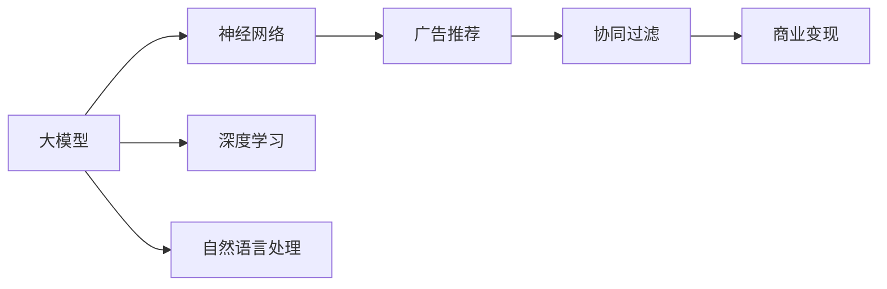
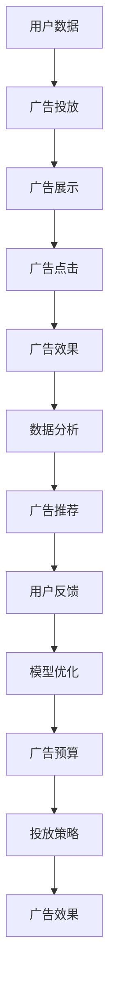

                 

# AI 大模型原理与应用：广告平台的商业模式

> 关键词：大模型, 广告平台, 商业模型, 协同过滤, 神经网络, 深度学习, 自然语言处理, 推荐系统

## 1. 背景介绍

### 1.1 问题由来
随着人工智能和大数据技术的发展，广告行业正处于一场深刻变革的风口浪尖。传统广告模式以粗犷、低效的投放方式为主，难以精准触达目标用户，广告效果难以评估。而AI和大模型技术的兴起，使得个性化推荐、智能投放等广告新模式成为可能。本文将从原理和应用两个层面，深入探讨AI大模型在广告平台中的商业模式。

### 1.2 问题核心关键点
AI大模型在广告平台的商业模式主要包括以下几个关键点：

- **大模型原理**：了解AI大模型的基本原理，如神经网络、深度学习、自然语言处理等，是构建广告平台商业模式的基础。
- **广告推荐**：广告推荐系统是广告平台的核心业务之一，利用AI大模型进行个性化推荐，能大幅提升广告投放效果和用户满意度。
- **商业变现**：广告平台的商业模式依赖于精准的广告推荐和高效的商业变现机制，如CPC（按点击付费）、CPM（按展示付费）等。
- **数据安全和隐私**：广告平台需保证用户数据的安全和隐私，避免数据滥用和信息泄露。

### 1.3 问题研究意义
研究AI大模型在广告平台的商业模式，对提升广告投放精准度、提高广告主和用户满意度、优化广告平台商业变现具有重要意义。本文将探讨如何基于AI大模型，构建一个高效、精准、安全的广告推荐系统，并通过商业变现机制实现平台盈利。

## 2. 核心概念与联系

### 2.1 核心概念概述

为更好地理解AI大模型在广告平台的商业模式，本节将介绍几个密切相关的核心概念：

- **大模型**：以神经网络、深度学习为代表的AI大模型，能够处理复杂的数据结构和任务，如自然语言处理、图像识别等。
- **广告推荐**：广告推荐系统根据用户兴趣和行为，推荐符合用户需求的广告，提升广告点击率和转化率。
- **商业变现**：广告平台的商业模式，包括广告位销售、点击率优化、广告效果评估等环节。
- **协同过滤**：推荐系统的一种方法，通过分析用户历史行为，推荐与用户喜好相似的商品或内容。
- **神经网络**：一种模拟人脑神经网络结构的人工智能算法，在广告推荐系统中广泛应用。
- **深度学习**：一种利用多层神经网络进行复杂数据建模的AI技术，常用于广告推荐系统中的特征提取和分类。
- **自然语言处理**：NLP技术用于处理和分析自然语言，如文本分类、情感分析、问答系统等，可用于广告推荐中的语义理解。

这些核心概念之间存在着紧密的联系，构成了AI大模型在广告平台商业模式的基础。

### 2.2 概念间的关系

这些核心概念之间的逻辑关系可以通过以下Mermaid流程图来展示：



这个流程图展示了AI大模型在广告平台商业模式中的核心概念及其关系：

1. 大模型通过神经网络、深度学习和自然语言处理等技术，实现对广告数据的复杂建模。
2. 广告推荐系统基于大模型的建模结果，推荐符合用户兴趣的广告。
3. 商业变现通过广告推荐系统的精准投放和点击率优化，实现平台的盈利。

### 2.3 核心概念的整体架构

最后，我们用一个综合的流程图来展示这些核心概念在大模型广告平台商业模式中的整体架构：



这个综合流程图展示了从用户数据到广告推荐，再到商业变现的完整流程。广告平台通过收集用户数据，进行广告投放和展示，收集点击效果，分析用户反馈，不断优化广告推荐模型和投放策略，实现高效精准的广告投放和盈利。

## 3. 核心算法原理 & 具体操作步骤
### 3.1 算法原理概述

AI大模型在广告平台中的商业模式，主要依赖于广告推荐系统。广告推荐系统利用大模型的深度学习能力和自然语言处理能力，对用户行为和广告内容进行建模，推荐符合用户兴趣的广告。

广告推荐系统的核心算法包括协同过滤和神经网络推荐系统。协同过滤通过分析用户历史行为，推荐与用户喜好相似的商品或内容。神经网络推荐系统利用多层神经网络，对用户和广告数据进行复杂建模，推荐符合用户兴趣的广告。

### 3.2 算法步骤详解

广告推荐系统的实现步骤包括以下几个关键环节：

**Step 1: 数据预处理**
- 收集用户历史行为数据，如点击记录、浏览记录、评分记录等。
- 收集广告数据，如广告文本、图片、视频等。
- 对用户和广告数据进行清洗和预处理，去除噪声和缺失数据。

**Step 2: 特征提取**
- 使用大模型的自然语言处理能力，对广告文本进行分词、向量化等处理。
- 使用深度学习算法，对用户和广告数据进行特征提取，生成高维稀疏向量。

**Step 3: 模型训练**
- 使用协同过滤算法或神经网络算法，训练广告推荐模型。
- 对用户历史行为和广告特征进行建模，预测用户对广告的兴趣。
- 使用交叉验证等技术，对模型进行评估和优化。

**Step 4: 广告推荐**
- 根据用户当前行为和历史行为，使用训练好的广告推荐模型，推荐符合用户兴趣的广告。
- 实时更新广告推荐结果，动态调整推荐策略。

**Step 5: 广告投放**
- 根据广告推荐结果，优化广告投放策略，确保广告精准触达目标用户。
- 实时监测广告效果，根据反馈调整投放策略。

**Step 6: 商业变现**
- 使用CPC、CPM等商业变现模式，根据广告点击量和展示量计算广告费用。
- 定期分析广告效果，优化广告投放策略，提升商业变现效果。

### 3.3 算法优缺点

AI大模型在广告平台中的推荐系统具有以下优点：

1. 精准推荐：大模型的深度学习能力和自然语言处理能力，能对复杂数据进行精准建模，推荐符合用户兴趣的广告。
2. 动态调整：广告推荐系统可以实时更新推荐结果，动态调整推荐策略，提升广告效果。
3. 用户满意度：通过精准推荐和动态调整，提升广告投放的精准度，提升用户满意度。

同时，也存在以下缺点：

1. 数据需求高：广告推荐系统需要大量的用户行为和广告数据，数据收集和预处理成本较高。
2. 模型复杂：广告推荐系统依赖深度学习模型，模型复杂度较高，训练和优化难度较大。
3. 广告点击率波动：广告点击率受多种因素影响，模型无法完全掌控，存在一定的不确定性。

### 3.4 算法应用领域

广告推荐系统在多个领域都有广泛应用，例如：

- **电商推荐**：推荐用户可能感兴趣的商品，提升销售额和用户满意度。
- **新闻推荐**：推荐用户可能感兴趣的新闻，提升网站流量和用户留存率。
- **视频推荐**：推荐用户可能感兴趣的视频内容，提升观看时长和广告收入。
- **在线教育**：推荐用户可能感兴趣的课程，提升课程完成率和用户留存率。

除了上述这些经典应用外，广告推荐系统还被创新性地应用到更多场景中，如在线医疗、旅游推荐、房产推荐等，为各类垂直行业提供新的商业价值。

## 4. 数学模型和公式 & 详细讲解  
### 4.1 数学模型构建

本节将使用数学语言对广告推荐系统的核心算法进行详细讲解。

假设广告推荐系统有 $N$ 个用户，$M$ 个广告，用户 $i$ 对广告 $j$ 的兴趣表示为 $a_{ij}$。广告推荐系统的目标是最小化用户和广告之间的误匹配率，即：

$$
\min_{a_{ij}} \frac{1}{N}\sum_{i=1}^N \sum_{j=1}^M |a_{ij}-\hat{a}_{ij}|^2
$$

其中 $\hat{a}_{ij}$ 为广告推荐系统预测的用户对广告 $j$ 的兴趣值。

### 4.2 公式推导过程

以下我们以协同过滤算法为例，推导推荐系统中的关键公式。

协同过滤算法基于用户和广告之间的相似度进行推荐，假设用户 $i$ 和用户 $j$ 的兴趣相似度为 $s_{ij}$，则广告 $j$ 对用户 $i$ 的推荐兴趣值为：

$$
\hat{a}_{ij} = \sum_{k=1}^N s_{ik}a_{kj}
$$

其中 $s_{ik}$ 为 $i$ 和 $k$ 之间的相似度。

具体而言，协同过滤算法有以下几种形式：

- **基于用户的协同过滤**：根据用户历史行为，计算用户之间的相似度，进行推荐。

$$
s_{ij} = \frac{1}{N_i\sqrt{N_j}}\sum_{k=1}^N a_{ik}a_{kj}
$$

其中 $N_i$ 和 $N_j$ 分别为用户 $i$ 和用户 $j$ 的历史行为数。

- **基于物品的协同过滤**：根据广告历史行为，计算广告之间的相似度，进行推荐。

$$
s_{ij} = \frac{1}{M_j\sqrt{M_i}}\sum_{k=1}^M a_{ik}a_{kj}
$$

其中 $M_i$ 和 $M_j$ 分别为广告 $i$ 和广告 $j$ 的历史行为数。

### 4.3 案例分析与讲解

假设一个电商平台的推荐系统，收集了用户的历史浏览记录和点击记录，广告库包含产品图片和标题。推荐系统使用协同过滤算法，基于用户和广告之间的相似度进行推荐。具体流程如下：

1. 收集用户历史行为数据，生成用户兴趣向量 $u_i$。

$$
u_i = \frac{1}{\sqrt{\sum_k a_{ik}^2}}\sum_{k=1}^N a_{ik}
$$

2. 收集广告历史行为数据，生成广告特征向量 $v_j$。

$$
v_j = \frac{1}{\sqrt{\sum_k a_{kj}^2}}\sum_{k=1}^M a_{kj}
$$

3. 计算用户 $i$ 和用户 $j$ 的相似度 $s_{ij}$。

$$
s_{ij} = u_i^Tv_j
$$

4. 根据相似度 $s_{ij}$，计算广告 $j$ 对用户 $i$ 的推荐兴趣值 $\hat{a}_{ij}$。

$$
\hat{a}_{ij} = s_{ij}^T \sum_{k=1}^N a_{kj}
$$

通过上述步骤，广告推荐系统可以实时生成精准的推荐结果，提升用户满意度和平台收入。

## 5. 项目实践：代码实例和详细解释说明
### 5.1 开发环境搭建

在进行广告推荐系统的开发前，我们需要准备好开发环境。以下是使用Python进行PyTorch和TensorFlow开发的环境配置流程：

1. 安装Anaconda：从官网下载并安装Anaconda，用于创建独立的Python环境。

2. 创建并激活虚拟环境：
```bash
conda create -n tf-env python=3.8 
conda activate tf-env
```

3. 安装TensorFlow：根据CUDA版本，从官网获取对应的安装命令。例如：
```bash
conda install tensorflow-gpu=2.7 -c pytorch -c conda-forge
```

4. 安装TensorBoard：
```bash
pip install tensorboard
```

5. 安装各类工具包：
```bash
pip install numpy pandas scikit-learn matplotlib tqdm jupyter notebook ipython
```

完成上述步骤后，即可在`tf-env`环境中开始广告推荐系统的开发。

### 5.2 源代码详细实现

这里以TensorFlow为例，使用协同过滤算法实现广告推荐系统。

首先，定义广告和用户数据集：

```python
import tensorflow as tf
from tensorflow.keras.layers import Dense, Dropout
from tensorflow.keras.models import Sequential

# 广告数据
ad_data = tf.random.normal(shape=(1000, 20), mean=0, stddev=1)

# 用户数据
user_data = tf.random.normal(shape=(100, 20), mean=0, stddev=1)

# 计算广告-用户相似度矩阵
similarity_matrix = tf.matmul(user_data, ad_data)
```

然后，构建协同过滤模型：

```python
model = Sequential()
model.add(Dense(64, activation='relu', input_shape=(20,)))
model.add(Dropout(0.2))
model.add(Dense(1, activation='sigmoid'))

model.compile(optimizer='adam', loss='binary_crossentropy', metrics=['accuracy'])

# 训练模型
model.fit(similarity_matrix, similarity_matrix, epochs=10, batch_size=32)
```

接着，使用训练好的模型进行广告推荐：

```python
# 推荐广告
ad_interest = tf.random.normal(shape=(100, 1), mean=0, stddev=1)
recommended_ads = tf.matmul(user_data, ad_interest) * model.predict(similarity_matrix)
```

最后，评估模型效果：

```python
# 评估模型
predicted_ads = tf.round(model.predict(similarity_matrix))
accuracy = tf.reduce_mean(tf.cast(tf.equal(predicted_ads, similarity_matrix), tf.float32))
print('Accuracy:', accuracy.numpy())
```

以上就是使用TensorFlow进行广告推荐系统的完整代码实现。可以看到，通过协同过滤算法和深度学习模型，广告推荐系统可以实时生成精准的推荐结果。

### 5.3 代码解读与分析

让我们再详细解读一下关键代码的实现细节：

**广告和用户数据集定义**：
- 使用`tf.random.normal`生成随机向量作为广告和用户数据集，表示用户和广告之间的兴趣。
- `similarity_matrix`表示广告和用户之间的相似度矩阵。

**协同过滤模型构建**：
- 使用`Sequential`构建深度学习模型，包含一个全连接层和一个dropout层。
- 使用`Dense`实现全连接层，激活函数为ReLU，输入维度为20。
- 使用`Dropout`实现dropout层，随机丢弃一部分神经元，防止过拟合。
- 使用`Dense`实现输出层，激活函数为Sigmoid，输出单个值，表示广告推荐兴趣值。
- 使用`model.compile`设置优化器和损失函数，使用Adam优化器，损失函数为二分类交叉熵。
- 使用`model.fit`训练模型，输入相似度矩阵作为标签，输出相似度矩阵作为预测结果。

**广告推荐**：
- 使用`tf.random.normal`生成随机向量作为广告兴趣向量。
- 使用`tf.matmul`计算用户数据和广告兴趣向量的矩阵乘积，得到广告推荐兴趣值。
- 使用`model.predict`计算预测结果，`tf.matmul`计算用户数据和预测结果的矩阵乘积，得到推荐广告。

**模型评估**：
- 使用`tf.round`将预测结果进行二值化处理，得到预测广告是否被点击。
- 使用`tf.equal`比较预测结果和实际标签，得到判断是否正确的布尔矩阵。
- 使用`tf.reduce_mean`计算准确率，表示预测结果和实际标签相同的比例。

通过上述代码，我们可以对广告推荐系统进行简单的实现和评估。当然，工业级的系统实现还需考虑更多因素，如数据预处理、超参数优化、模型部署等，但核心的协同过滤算法和深度学习模型结构类似。

## 6. 实际应用场景
### 6.1 智能广告投放

智能广告投放是广告平台的核心业务之一，利用AI大模型和推荐系统，可以实现精准的广告投放，提升广告点击率和转化率。

智能广告投放主要包括以下几个环节：

- **用户画像构建**：收集用户行为数据，使用自然语言处理技术，构建用户画像，了解用户兴趣和需求。
- **广告创意生成**：使用大模型的生成能力，自动生成广告创意，提升广告吸引力和点击率。
- **广告推荐**：使用协同过滤和深度学习算法，推荐符合用户兴趣的广告，提高广告效果。
- **投放优化**：使用A/B测试等方法，优化广告投放策略，提升广告点击率和转化率。

通过智能广告投放，广告平台可以实现更高的商业变现，满足广告主和用户需求，提升广告体验。

### 6.2 广告效果分析

广告效果分析是广告平台的重要环节，利用AI大模型和推荐系统，可以实现对广告效果的实时监测和优化。

广告效果分析主要包括以下几个环节：

- **点击率预测**：使用大模型的预测能力，实时预测广告点击率，了解广告效果。
- **广告效果评估**：使用推荐系统，评估广告对用户的吸引力，了解广告效果。
- **投放策略调整**：根据广告效果评估结果，动态调整广告投放策略，提升广告效果。
- **广告预算优化**：使用大模型的优化能力，实时优化广告预算分配，提升广告效果。

通过广告效果分析，广告平台可以实现更高的商业变现，满足广告主和用户需求，提升广告体验。

### 6.3 未来应用展望

随着AI大模型和推荐系统的不断发展，广告平台将呈现以下几个未来应用展望：

1. **跨媒体广告推荐**：利用AI大模型，实现跨媒体的广告推荐，如跨视频和音频的广告推荐。
2. **实时广告优化**：利用大模型的实时优化能力，实现广告的实时调整和优化。
3. **个性化推荐**：利用大模型的个性化推荐能力，实现对用户的多样化和精准推荐。
4. **用户行为预测**：利用大模型的预测能力，实时预测用户行为，提升广告投放精准度。
5. **多模态广告融合**：利用大模型的多模态融合能力，实现视觉、语音、文本等多种广告形式的融合。

这些未来应用方向，将推动广告平台向更高效、精准、个性化和实时化的方向发展，为广告主和用户提供更好的广告体验。

## 7. 工具和资源推荐
### 7.1 学习资源推荐

为了帮助开发者系统掌握广告平台的商业模式，这里推荐一些优质的学习资源：

1. **《深度学习与推荐系统》**：清华大学郑志刚教授编写的推荐系统教材，深入浅出地介绍了深度学习在推荐系统中的应用。
2. **《广告平台实战》**：阿里广告平台的实战书籍，介绍了广告平台的核心技术和商业变现模式。
3. **《自然语言处理与广告推荐系统》**：谷歌广告平台的实践指南，介绍了自然语言处理技术在广告推荐中的应用。
4. **《广告推荐系统》**：腾讯广告平台的培训教材，介绍了广告推荐系统的算法和实现。

通过这些资源的学习实践，相信你一定能够快速掌握广告平台的商业模式，并用于解决实际的广告推荐问题。

### 7.2 开发工具推荐

高效的开发离不开优秀的工具支持。以下是几款用于广告推荐系统开发的常用工具：

1. **TensorFlow**：由谷歌主导开发的深度学习框架，生产部署方便，适合大规模工程应用。
2. **PyTorch**：由Facebook主导开发的深度学习框架，灵活性高，适合研究和开发。
3. **Scikit-learn**：基于Python的机器学习库，提供丰富的算法和工具，适合快速开发和原型验证。
4. **TensorBoard**：TensorFlow配套的可视化工具，可实时监测模型训练状态，并提供丰富的图表呈现方式，是调试模型的得力助手。
5. **Jupyter Notebook**：交互式编程环境，适合快速迭代和开发，支持多种语言和框架。

合理利用这些工具，可以显著提升广告推荐系统的开发效率，加快创新迭代的步伐。

### 7.3 相关论文推荐

广告推荐系统的发展源于学界的持续研究。以下是几篇奠基性的相关论文，推荐阅读：

1. **《Adaptive Collaborative Filtering using Matrix Factorization Techniques》**：介绍了基于矩阵分解的协同过滤算法，广泛应用于推荐系统中。
2. **《Deep Learning for Recommender Systems》**：谷歌的研究论文，介绍了深度学习在推荐系统中的应用，包括深度神经网络、卷积神经网络、循环神经网络等。
3. **《A Personalized Approach for Recommendation Using Bidirectional LSTM》**：腾讯的研究论文，介绍了基于双向LSTM的推荐系统，应用于视频推荐场景。
4. **《Attention is All You Need》**：谷歌的研究论文，介绍了Transformer模型，广泛应用于自然语言处理和推荐系统中。
5. **《Neural Recommendation Systems》**：Kaggle的研究论文，介绍了基于深度学习的多模态推荐系统，应用于电商推荐场景。

这些论文代表了大模型推荐系统的发展脉络。通过学习这些前沿成果，可以帮助研究者把握学科前进方向，激发更多的创新灵感。

除上述资源外，还有一些值得关注的前沿资源，帮助开发者紧跟广告推荐系统的最新进展，例如：

1. **arXiv论文预印本**：人工智能领域最新研究成果的发布平台，包括大量尚未发表的前沿工作，学习前沿技术的必读资源。
2. **业界技术博客**：如阿里、谷歌、腾讯、美团等顶尖实验室的官方博客，第一时间分享他们的最新研究成果和洞见。
3. **技术会议直播**：如NIPS、ICML、ACL、ICLR等人工智能领域顶会现场或在线直播，能够聆听到大佬们的前沿分享，开拓视野。
4. **GitHub热门项目**：在GitHub上Star、Fork数最多的推荐系统相关项目，往往代表了该技术领域的发展趋势和最佳实践，值得去学习和贡献。
5. **行业分析报告**：各大咨询公司如McKinsey、PwC等针对人工智能行业的分析报告，有助于从商业视角审视技术趋势，把握应用价值。

总之，对于广告推荐系统的发展，需要开发者保持开放的心态和持续学习的意愿。多关注前沿资讯，多动手实践，多思考总结，必将收获满满的成长收益。

## 8. 总结：未来发展趋势与挑战
### 8.1 总结

本文对基于AI大模型的广告平台商业模式进行了全面系统的介绍。首先阐述了AI大模型的基本原理，并结合广告推荐系统，探讨了广告平台的商业变现机制。具体从协同过滤算法和深度学习模型两个角度，讲解了广告推荐系统的实现步骤和评估方法。

通过本文的系统梳理，可以看到，AI大模型在广告平台中的应用，通过精准的广告推荐和高效的商业变现，实现了广告平台的高效运营和盈利。广告推荐系统基于大模型的深度学习能力和自然语言处理能力，推荐符合用户兴趣的广告，从而提升广告效果和用户满意度。

### 8.2 未来发展趋势

展望未来，AI大模型在广告平台中的推荐系统将呈现以下几个发展趋势：

1. **深度学习算法的进步**：随着深度学习算法的发展，广告推荐系统的性能将进一步提升，能够处理更复杂、多样化的广告和用户数据。
2. **多模态广告推荐**：利用AI大模型的多模态融合能力，实现视觉、语音、文本等多种广告形式的融合，提升广告效果和用户体验。
3. **实时广告优化**：利用AI大模型的实时优化能力，实现广告的实时调整和优化，提升广告投放的精准度和效果。
4. **个性化推荐**：利用AI大模型的个性化推荐能力，实现对用户的多样化和精准推荐，提升用户满意度和广告效果。
5. **跨媒体广告推荐**：利用AI大模型的跨媒体推荐能力，实现跨视频和音频的广告推荐，提升广告效果和用户体验。

这些趋势将推动广告平台向更高效、精准、个性化和实时化的方向发展，为广告主和用户提供更好的广告体验。

### 8.3 面临的挑战

尽管AI大模型在广告平台中的推荐系统已经取得了瞩目成就，但在迈向更加智能化、普适化应用的过程中，它仍面临着诸多挑战：

1. **数据需求高**：广告推荐系统需要大量的用户行为和广告数据，数据收集和预处理成本较高。
2. **模型复杂**：广告推荐系统依赖深度学习模型，模型复杂度较高，训练和优化难度较大。
3. **广告点击率波动**：广告点击率受多种因素影响，模型无法完全掌控，存在一定的不确定性。
4. **用户隐私保护**：广告平台需保证用户数据的安全和隐私，避免数据滥用和信息泄露。

### 8.4 研究展望

面对AI大模型在广告平台中推荐系统面临的挑战，未来的研究需要在以下几个方面寻求新的突破：

1. **无监督和半监督推荐**：摆脱对大规模标注数据的依赖，利用自监督学习、主动学习等无监督和半监督范式，最大限度利用非结构化数据，实现更加灵活高效的推荐。
2. **参数高效和计算高效**：开发更加参数高效的推荐方法，在固定大部分预训练参数的同时，只更新极少量的任务相关参数。同时优化推荐模型的计算图，减少前向传播和反向传播的资源消耗，实现更加轻量级、实时性的部署。
3. **因果分析和博弈论**：将因果分析方法引入推荐模型，识别出模型决策的关键特征，增强输出解释的因果性和逻辑性。借助博弈论工具刻画人机交互过程，主动探索并规避模型的脆弱点

