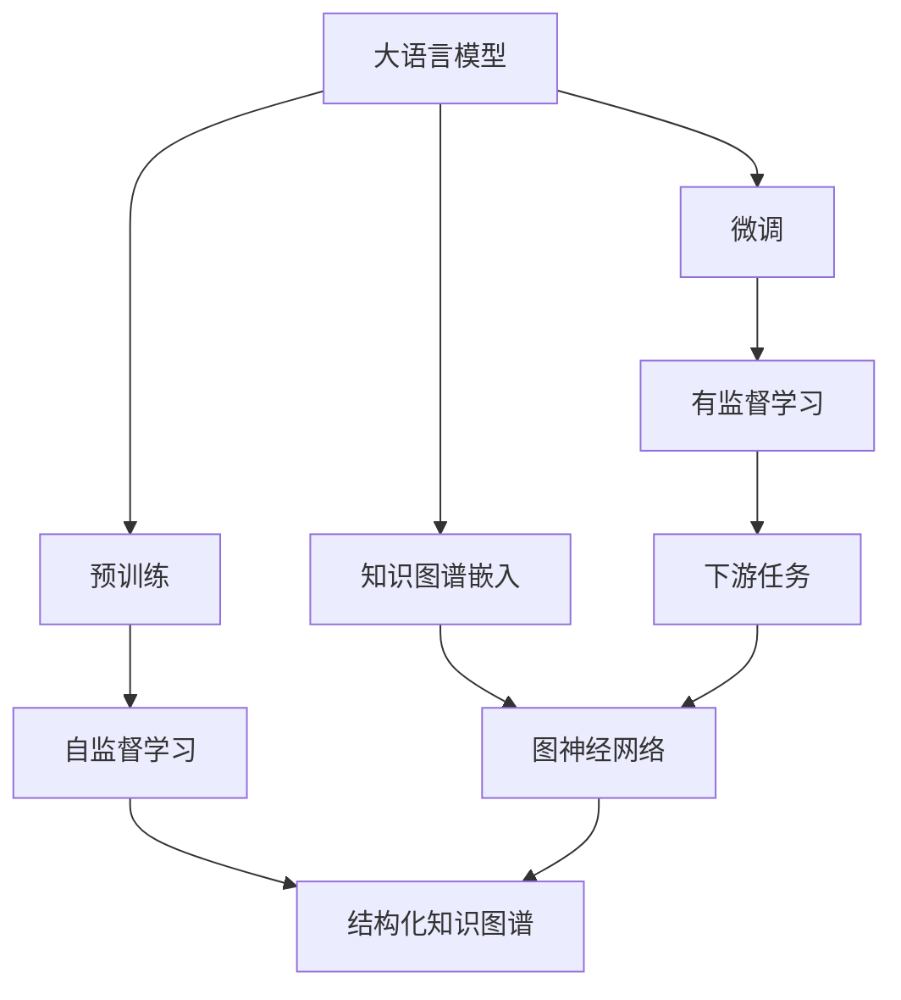
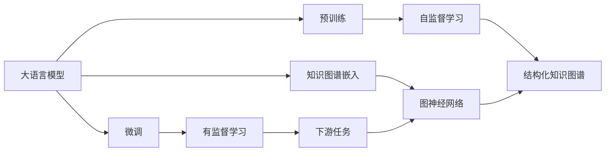
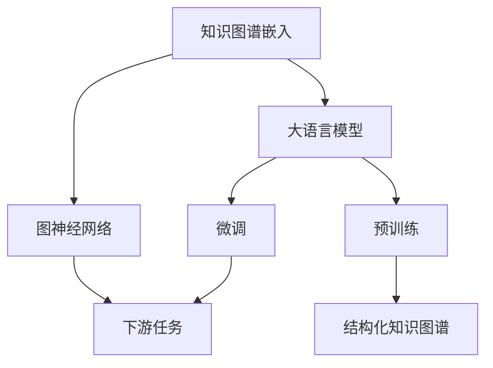
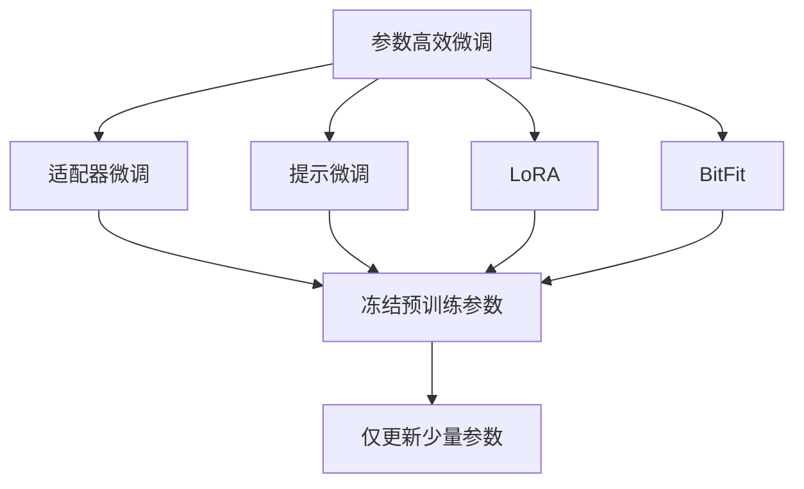
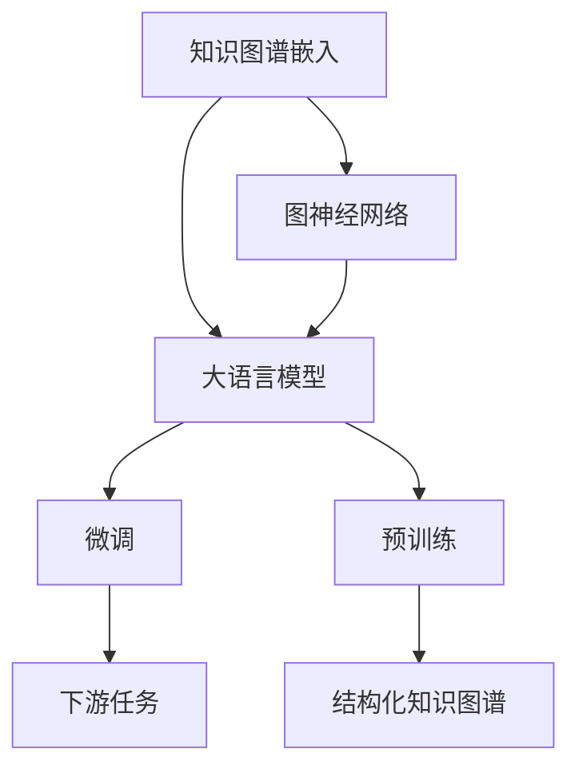
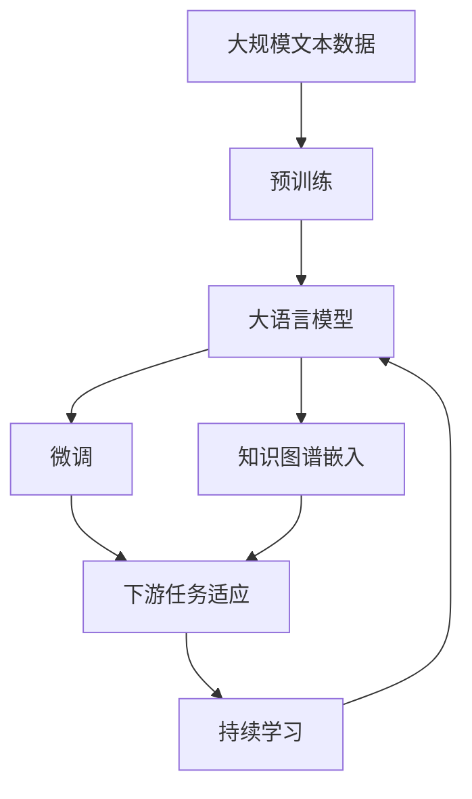

                 

# AI 大模型原理与应用：模型的组织能力

> 关键词：大语言模型,模型组织能力,结构化知识图谱,预训练-微调,图神经网络,知识图谱嵌入,深度学习,深度学习模型

## 1. 背景介绍

### 1.1 问题由来
近年来，大语言模型（Large Language Models, LLMs）在自然语言处理（Natural Language Processing, NLP）领域取得了巨大的突破。这些大模型通过在海量无标签文本数据上进行预训练，学习到了丰富的语言知识和常识，具备强大的语言理解和生成能力。然而，尽管如此，大语言模型依然存在诸多局限，比如处理复杂语义场景的能力有限，难以理解抽象概念，缺乏结构化的组织能力等。为了克服这些局限，人们开始关注模型组织能力的研究，探索如何在大模型中加入结构化的知识表示，提升其理解复杂语义和结构化信息的能力。

### 1.2 问题核心关键点
模型组织能力的研究旨在提升大语言模型处理结构化信息的能力，使其能够更好地理解和生成复杂的语义结构。其主要研究问题包括：
- 如何在大模型中嵌入结构化的知识图谱，使其能够识别、理解和生成结构化的信息。
- 如何利用深度学习技术，从大规模非结构化数据中自动学习到结构化知识，从而增强模型的组织能力。
- 如何在微调过程中，使模型更好地利用先验知识，提升其在特定任务上的性能。

### 1.3 问题研究意义
研究模型的组织能力，对于拓展大模型的应用范围，提升其处理结构化信息的能力，加速NLP技术的产业化进程，具有重要意义：

1. 提升模型性能。在处理结构化信息的任务中，如问答、知识图谱生成、关系抽取等，模型的组织能力能够显著提升其性能。
2. 拓展应用领域。模型的组织能力使其能够应用于更多的结构化数据处理场景，如医疗、金融、法律等。
3. 加速应用开发。结构化知识图谱等先验知识可以与大模型进行有效结合，加速应用系统的构建和优化。
4. 带来技术创新。模型组织能力的研究促进了深度学习和知识图谱的结合，催生了新的研究方向，如知识图谱嵌入、图神经网络等。
5. 赋能产业升级。结构化知识的应用使得NLP技术更容易被各行各业所采用，为传统行业数字化转型升级提供新的技术路径。

## 2. 核心概念与联系

### 2.1 核心概念概述

为更好地理解模型的组织能力，本节将介绍几个密切相关的核心概念：

- 大语言模型(Large Language Model, LLM)：以自回归(如GPT)或自编码(如BERT)模型为代表的大规模预训练语言模型。通过在大规模无标签文本语料上进行预训练，学习通用的语言表示，具备强大的语言理解和生成能力。

- 预训练(Pre-training)：指在大规模无标签文本语料上，通过自监督学习任务训练通用语言模型的过程。常见的预训练任务包括言语建模、遮挡语言模型等。预训练使得模型学习到语言的通用表示。

- 微调(Fine-tuning)：指在预训练模型的基础上，使用下游任务的少量标注数据，通过有监督学习优化模型在特定任务上的性能。通常只需要调整顶层分类器或解码器，并以较小的学习率更新全部或部分的模型参数。

- 结构化知识图谱(Knowledge Graph, KG)：由实体、关系、属性等组成的有向图，用于表示现实世界中的复杂语义结构。图神经网络等技术可以用于从结构化知识图谱中提取有用的信息。

- 知识图谱嵌入(Knowledge Graph Embedding, KGE)：将结构化知识图谱中的实体和关系映射到低维向量空间，用于模型在语义空间中的表示和推理。

- 图神经网络(Graph Neural Network, GNN)：利用图结构信息，从结构化数据中提取和融合信息的技术，包括图卷积网络(Graph Convolutional Network, GCN)、图注意力网络(Graph Attention Network, GAT)等。

这些核心概念之间的逻辑关系可以通过以下Mermaid流程图来展示：



这个流程图展示了大语言模型的核心概念及其之间的关系：

1. 大语言模型通过预训练获得基础能力。
2. 微调是对预训练模型进行任务特定的优化，可以分为全参数微调和参数高效微调（PEFT）。
3. 结构化知识图谱是模型的先验知识，知识图谱嵌入和图神经网络用于提取和融合结构化知识。
4. 微调使得通用大模型更好地适应特定任务，在应用场景中取得更优表现。

这些概念共同构成了大语言模型的学习和应用框架，使其能够在各种场景下发挥强大的语言理解和生成能力。通过理解这些核心概念，我们可以更好地把握大语言模型的工作原理和优化方向。

### 2.2 概念间的关系

这些核心概念之间存在着紧密的联系，形成了大语言模型的完整生态系统。下面我们通过几个Mermaid流程图来展示这些概念之间的关系。

#### 2.2.1 大语言模型的学习范式



这个流程图展示了大语言模型的三种主要学习范式：预训练、微调和知识图谱嵌入。预训练主要采用自监督学习方法，而微调则是有监督学习的过程。知识图谱嵌入和图神经网络用于从结构化知识图谱中提取有用的信息。

#### 2.2.2 结构化知识图谱与微调的关系



这个流程图展示了结构化知识图谱在大语言模型微调中的应用。知识图谱嵌入和图神经网络用于提取结构化知识，与大语言模型结合，提升其在特定任务上的性能。

#### 2.2.3 参数高效微调方法



这个流程图展示了几种常见的参数高效微调方法，包括适配器微调、提示微调、LoRA和BitFit。这些方法的共同特点是冻结大部分预训练参数，只更新少量参数，从而提高微调效率。

#### 2.2.4 知识图谱嵌入在大语言模型中的应用



这个流程图展示了知识图谱嵌入在大语言模型中的应用。知识图谱嵌入和图神经网络用于提取结构化知识，与大语言模型结合，提升其在特定任务上的性能。

### 2.3 核心概念的整体架构

最后，我们用一个综合的流程图来展示这些核心概念在大语言模型微调过程中的整体架构：



这个综合流程图展示了从预训练到微调，再到持续学习的完整过程。大语言模型首先在大规模文本数据上进行预训练，然后通过微调（包括全参数微调和参数高效微调）或知识图谱嵌入，使得模型更好地适应特定任务，最后通过持续学习技术，模型可以不断更新和适应新的任务和数据。

## 3. 核心算法原理 & 具体操作步骤
### 3.1 算法原理概述

模型的组织能力，即模型在语义空间中理解和处理结构化信息的能力。其核心思想是通过在大模型中嵌入结构化的知识图谱，使其能够识别、理解和生成结构化的信息。

形式化地，假设预训练模型为 $M_{\theta}$，其中 $\theta$ 为预训练得到的模型参数。给定结构化知识图谱 $\mathcal{G}$，知识图谱嵌入后的节点表示向量为 $\mathbf{E}=\{\mathbf{e}_v\}_{v \in \mathcal{V}}$，边表示向量为 $\mathbf{E}=\{\mathbf{e}_e\}_{e \in \mathcal{E}}$。则模型的组织能力可以通过以下过程来提升：

1. 在大模型 $M_{\theta}$ 的基础上，添加图神经网络 $G_{\phi}$，用于从知识图谱 $\mathcal{G}$ 中提取结构化信息。
2. 利用图神经网络 $G_{\phi}$ 对知识图谱 $\mathcal{G}$ 进行处理，得到节点和边的表示向量 $\mathbf{E}$。
3. 将知识图谱嵌入 $\mathbf{E}$ 作为预训练模型的输入，进行有监督微调，优化模型在特定任务上的性能。

### 3.2 算法步骤详解

基于模型组织能力的监督学习微调方法，主要包括以下几个关键步骤：

**Step 1: 准备预训练模型和数据集**
- 选择合适的预训练语言模型 $M_{\theta}$ 作为初始化参数，如 BERT、GPT 等。
- 准备下游任务 $\mathcal{T}$ 的标注数据集 $D=\{(x_i,y_i)\}_{i=1}^N$，划分为训练集、验证集和测试集。一般要求标注数据与预训练数据的分布不要差异过大。

**Step 2: 添加图神经网络**
- 根据任务类型，在大语言模型的顶层设计合适的图神经网络 $G_{\phi}$，用于从结构化知识图谱 $\mathcal{G}$ 中提取有用的信息。
- 通常使用图卷积网络(Graph Convolutional Network, GCN)或图注意力网络(Graph Attention Network, GAT)等技术，从知识图谱中提取实体和关系的信息。

**Step 3: 设计知识图谱嵌入**
- 使用知识图谱嵌入技术，将结构化知识图谱 $\mathcal{G}$ 转换为低维向量空间，用于模型在语义空间中的表示和推理。
- 常用的知识图谱嵌入方法包括TransE、DistMult、RotatE等，可以将实体和关系映射到低维向量空间。

**Step 4: 设置微调超参数**
- 选择合适的优化算法及其参数，如 AdamW、SGD 等，设置学习率、批大小、迭代轮数等。
- 设置正则化技术及强度，包括权重衰减、Dropout、Early Stopping 等。
- 确定冻结预训练参数的策略，如仅微调顶层，或全部参数都参与微调。

**Step 5: 执行梯度训练**
- 将训练集数据分批次输入模型，前向传播计算损失函数。
- 反向传播计算参数梯度，根据设定的优化算法和学习率更新模型参数。
- 周期性在验证集上评估模型性能，根据性能指标决定是否触发 Early Stopping。
- 重复上述步骤直到满足预设的迭代轮数或 Early Stopping 条件。

**Step 6: 测试和部署**
- 在测试集上评估微调后模型 $M_{\hat{\theta}}$ 的性能，对比微调前后的精度提升。
- 使用微调后的模型对新样本进行推理预测，集成到实际的应用系统中。
- 持续收集新的数据，定期重新微调模型，以适应数据分布的变化。

以上是基于模型组织能力的监督学习微调方法的一般流程。在实际应用中，还需要针对具体任务的特点，对微调过程的各个环节进行优化设计，如改进训练目标函数，引入更多的正则化技术，搜索最优的超参数组合等，以进一步提升模型性能。

### 3.3 算法优缺点

基于模型组织能力的监督学习微调方法具有以下优点：
1. 简单高效。只需准备少量标注数据，即可对预训练模型进行快速适配，获得较大的性能提升。
2. 通用适用。适用于各种NLP下游任务，包括分类、匹配、生成等，设计简单的图神经网络即可实现微调。
3. 参数高效。利用参数高效微调技术，在固定大部分预训练参数的情况下，仍可取得不错的提升。
4. 效果显著。在学术界和工业界的诸多任务上，基于微调的方法已经刷新了最先进的性能指标。

同时，该方法也存在一定的局限性：
1. 依赖标注数据。微调的效果很大程度上取决于标注数据的质量和数量，获取高质量标注数据的成本较高。
2. 迁移能力有限。当目标任务与预训练数据的分布差异较大时，微调的性能提升有限。
3. 负面效果传递。预训练模型的固有偏见、有害信息等，可能通过微调传递到下游任务，造成负面影响。
4. 可解释性不足。微调模型的决策过程通常缺乏可解释性，难以对其推理逻辑进行分析和调试。

尽管存在这些局限性，但就目前而言，基于监督学习的微调方法仍是大语言模型应用的最主流范式。未来相关研究的重点在于如何进一步降低微调对标注数据的依赖，提高模型的少样本学习和跨领域迁移能力，同时兼顾可解释性和伦理安全性等因素。

### 3.4 算法应用领域

基于模型组织能力的监督学习微调方法，在NLP领域已经得到了广泛的应用，覆盖了几乎所有常见任务，例如：

- 文本分类：如情感分析、主题分类、意图识别等。通过微调使模型学习文本-标签映射。
- 命名实体识别：识别文本中的人名、地名、机构名等特定实体。通过微调使模型掌握实体边界和类型。
- 关系抽取：从文本中抽取实体之间的语义关系。通过微调使模型学习实体-关系三元组。
- 问答系统：对自然语言问题给出答案。将问题-答案对作为微调数据，训练模型学习匹配答案。
- 机器翻译：将源语言文本翻译成目标语言。通过微调使模型学习语言-语言映射。
- 文本摘要：将长文本压缩成简短摘要。将文章-摘要对作为微调数据，使模型学习抓取要点。
- 对话系统：使机器能够与人自然对话。将多轮对话历史作为上下文，微调模型进行回复生成。

除了上述这些经典任务外，模型组织能力的方法也被创新性地应用到更多场景中，如可控文本生成、常识推理、代码生成、数据增强等，为NLP技术带来了全新的突破。随着预训练模型和微调方法的不断进步，相信NLP技术将在更广阔的应用领域大放异彩。

## 4. 数学模型和公式 & 详细讲解 & 举例说明
### 4.1 数学模型构建

本节将使用数学语言对基于模型组织能力的微调过程进行更加严格的刻画。

记预训练语言模型为 $M_{\theta}$，其中 $\theta \in \mathbb{R}^d$ 为模型参数。假设微调任务的训练集为 $D=\{(x_i,y_i)\}_{i=1}^N, x_i \in \mathcal{X}, y_i \in \mathcal{Y}$。

定义模型 $M_{\theta}$ 在输入 $x$ 上的输出为 $M_{\theta}(x) \in \mathcal{Y}$。假设知识图谱 $\mathcal{G}$ 中的实体和关系表示向量分别为 $\mathbf{E}=\{\mathbf{e}_v\}_{v \in \mathcal{V}}$ 和 $\mathbf{E}=\{\mathbf{e}_e\}_{e \in \mathcal{E}}$。

定义知识图谱嵌入后的节点和边的表示向量为 $\mathbf{E}$。假设知识图谱嵌入后的节点表示向量为 $\mathbf{e}_v$，边的表示向量为 $\mathbf{e}_e$。

则模型的组织能力可以通过以下过程来提升：

1. 在大模型 $M_{\theta}$ 的基础上，添加图神经网络 $G_{\phi}$，用于从知识图谱 $\mathcal{G}$ 中提取结构化信息。
2. 利用图神经网络 $G_{\phi}$ 对知识图谱 $\mathcal{G}$ 进行处理，得到节点和边的表示向量 $\mathbf{E}$。
3. 将知识图谱嵌入 $\mathbf{E}$ 作为预训练模型的输入，进行有监督微调，优化模型在特定任务上的性能。

### 4.2 公式推导过程

以下我们以二分类任务为例，推导交叉熵损失函数及其梯度的计算公式。

假设模型 $M_{\theta}$ 在输入 $x$ 上的输出为 $\hat{y}=M_{\theta}(x) \in [0,1]$，表示样本属于正类的概率。真实标签 $y \in \{0,1\}$。则二分类交叉熵损失函数定义为：

$$
\ell(M_{\theta}(x),y) = -[y\log \hat{y} + (1-y)\log (1-\hat{y})]
$$

将其代入经验风险公式，得：

$$
\mathcal{L}(\theta) = -\frac{1}{N}\sum_{i=1}^N [y_i\log M_{\theta}(x_i)+(1-y_i)\log(1-M_{\theta}(x_i))]
$$

根据链式法则，损失函数对参数 $\theta_k$ 的梯度为：

$$
\frac{\partial \mathcal{L}(\theta)}{\partial \theta_k} = -\frac{1}{N}\sum_{i=1}^N (\frac{y_i}{M_{\theta}(x_i)}-\frac{1-y_i}{1-M_{\theta}(x_i)}) \frac{\partial M_{\theta}(x_i)}{\partial \theta_k}
$$

其中 $\frac{\partial M_{\theta}(x_i)}{\partial \theta_k}$ 可进一步递归展开，利用自动微分技术完成计算。

### 4.3 案例分析与讲解

假设我们构建了一个用于医学领域问答系统的微调模型，该系统能够根据用户输入的疾病描述，提供相应的治疗建议。在模型训练时，我们首先构建了一个医学知识图谱，将疾病、症状、治疗等信息进行表示。然后，将知识图谱嵌入后的节点表示向量 $\mathbf{e}_v$ 作为模型输入，利用图神经网络从知识图谱中提取有用的信息，并结合文本信息进行综合推理。

具体而言，我们可以使用GCN模型来处理医学知识图谱。GCN模型利用邻接矩阵 $\mathbf{A}$ 和节点特征矩阵 $\mathbf{X}$ 来计算节点的表示向量。对于每一个节点 $v$，其表示向量 $\mathbf{e}_v$ 可以表示为：

$$
\mathbf{e}_v = \mathbf{D}^{-1/2}\mathbf{A}\mathbf{D}^{-1/2}\mathbf{X}_v + \mathbf{b}_v
$$

其中 $\mathbf{D}$ 为邻接矩阵的度数归一化矩阵，$\mathbf{b}_v$ 为偏置向量。

在得到知识图谱嵌入 $\mathbf{e}_v$ 后，我们可以将其作为模型的输入，结合文本信息进行微调。微调过程的目标是最小化交叉熵损失函数：

$$
\mathcal{L}(\theta) = -\frac{1}{N}\sum_{i=1}^N [y_i\log M_{\theta}(x_i)+(1-y_i)\log(1-M_{\theta}(x_i))]
$$

其中 $y_i$ 为样本的标签，$M_{\theta}(x_i)$ 为模型在输入 $x_i$ 上的输出，$\theta$ 为模型参数。

## 5. 项目实践：代码实例和详细解释说明
### 5.1 开发环境搭建

在进行微调实践前，我们需要准备好开发环境。以下是使用Python进行PyTorch开发的环境配置流程：

1. 安装Anaconda：从官网下载并安装Anaconda，用于创建独立的Python环境。

2. 创建并激活虚拟环境：
```bash
conda create -n pytorch-env python=3.8 
conda activate pytorch-env
```

3. 安装PyTorch：根据CUDA版本，从官网获取对应的安装命令。例如：
```bash
conda install pytorch torchvision torchaudio cudatoolkit=11.1 -c pytorch -c conda-forge
```

4. 安装Transformers库：
```bash
pip install transformers
```

5. 安装各类工具包：
```bash
pip install numpy pandas scikit-learn matplotlib tqdm jupyter notebook ipython
```

完成上述步骤后，即可在`pytorch-env`环境中开始微调实践。

### 5.2 源代码详细实现

这里我们以医学领域问答系统为例，给出使用Transformers库对BERT模型进行微调的PyTorch代码实现。

首先，定义医学知识图谱的数据处理函数：

```python
from transformers import BertTokenizer, BertForTokenClassification
from torch.utils.data import Dataset
import torch

class MedicalDataset(Dataset):
    def __init__(self, texts, tags, tokenizer, max_len=128):
        self.texts = texts
        self.tags = tags
        self.tokenizer = tokenizer
        self.max_len = max_len
        
    def __len__(self):
        return len(self.texts)
    
    def __getitem__(self, item):
        text = self.texts[item]
        tags = self.tags[item]
        
        encoding = self.tokenizer(text, return_tensors='pt', max_length=self.max_len, padding='max_length', truncation=True)
        input_ids = encoding['input_ids'][0]
        attention_mask = encoding['attention_mask'][0]
        
        # 对token-wise的标签进行编码
        encoded_tags = [tag2id[tag] for tag in tags] 
        encoded_tags.extend([tag2id['O']] * (self.max_len - len(encoded_tags)))
        labels = torch.tensor(encoded_tags, dtype=torch.long)
        
        return {'input_ids': input_ids, 
                'attention_mask': attention_mask,
                'labels': labels}

# 标签与id的映射
tag2id = {'O': 0, 'B-Disease': 1, 'I-Disease': 2, 'B-Symptom': 3, 'I-Symptom': 4, 'B-Drug': 5, 'I-Drug': 6}
id2tag = {v: k for k, v in tag2id.items()}

# 创建dataset
tokenizer = BertTokenizer.from_pretrained('bert-base-cased')

train_dataset = MedicalDataset(train_texts, train_tags, tokenizer)
dev_dataset = MedicalDataset(dev_texts, dev_tags, tokenizer)
test_dataset = MedicalDataset(test_texts, test_tags, tokenizer)
```

然后，定义模型和优化器：

```python
from transformers import BertForTokenClassification, AdamW

model = BertForTokenClassification.from_pretrained('bert-base-cased', num_labels=len(tag2id))

optimizer = AdamW(model.parameters(), lr=2e-5)
```

接着，定义训练和评估函数：

```python
from torch.utils.data import DataLoader
from tqdm import tqdm
from sklearn.metrics import classification_report

device = torch.device('cuda') if torch.cuda.is_available() else torch.device('cpu')
model.to(device)

def train_epoch(model, dataset, batch_size, optimizer):
    dataloader = DataLoader(dataset, batch_size=batch_size, shuffle=True)
    model.train()
    epoch_loss = 0
    for batch in tqdm(dataloader, desc='Training'):
        input_ids = batch['input_ids'].to(device)
        attention_mask = batch['attention_mask'].to(device)
        labels = batch['labels'].to(device)
        model.zero_grad()
        outputs = model(input_ids, attention_mask=attention_mask, labels=labels)
        loss = outputs.loss
        epoch_loss += loss.item()
        loss.backward()
        optimizer.step()
    return epoch_loss / len(dataloader)

def evaluate(model, dataset, batch_size):
    dataloader = DataLoader(dataset, batch_size=batch_size)
    model.eval()
    preds, labels = [], []
    with torch.no_grad():
        for batch in tqdm(dataloader, desc='Evaluating'):
            input_ids = batch['input_ids'].to(device)
            attention_mask = batch['attention_mask'].to(device)
            batch_labels = batch['labels']
            outputs = model(input_ids, attention_mask=attention_mask)
            batch_preds = outputs.logits.argmax(dim=2).to('cpu').tolist()
            batch_labels = batch_labels.to('cpu').tolist

