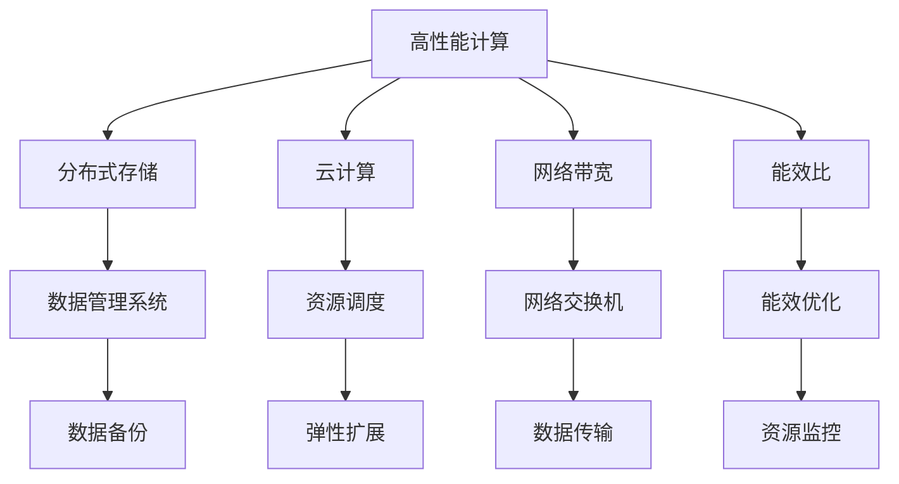
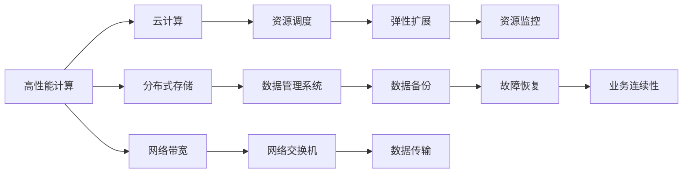

                 

# AI 大模型应用数据中心建设：数据中心产业发展

> 关键词：大模型应用, 数据中心, 高性能计算, AI 应用, 分布式存储, 云计算

## 1. 背景介绍

### 1.1 问题由来

随着人工智能(AI)技术的快速发展，尤其是深度学习技术的突飞猛进，大模型（如BERT、GPT等）在自然语言处理(NLP)、计算机视觉(CV)等领域取得了显著进展。这些大模型通过在大规模无标签数据上进行预训练，能够学习到通用的语言或视觉表示，并具备强大的数据处理能力。然而，训练和推理这些大模型所需的计算资源，成为了其广泛应用的主要瓶颈。

为了满足大模型的计算需求，数据中心建设的重要性日益凸显。数据中心是大模型训练和推理的基础设施，其性能直接影响AI应用的效率和效果。本文将探讨如何构建高性能、高效能的数据中心，支撑大模型在实际应用中的高效运行。

### 1.2 问题核心关键点

构建高效的数据中心，需要综合考虑以下几个关键点：

1. **计算性能**：大模型对计算资源的需求极高，需要强大的GPU/TPU等高性能计算资源。
2. **存储需求**：大模型涉及海量数据，需要高效的分布式存储系统来存储和管理数据。
3. **网络带宽**：数据中心内部和外部的网络通信需要高带宽支持，以确保数据传输的效率。
4. **能效比**：数据中心需要具备高能效比，以降低运营成本，同时减少对环境的影响。
5. **可扩展性**：数据中心需要支持大规模集群扩展，以应对日益增长的数据处理需求。

这些关键点相互关联，共同决定了数据中心的性能和成本。本文将围绕这些关键点，探讨如何构建高性能、高效能、可扩展的数据中心，支撑大模型的应用。

### 1.3 问题研究意义

构建高效的数据中心，对于推动AI技术的普及和应用具有重要意义：

1. **提升AI应用效率**：高性能的数据中心能够加速大模型的训练和推理，提高AI应用的处理效率和效果。
2. **降低成本**：高效能的数据中心能够减少能源消耗和运营成本，使AI技术的商业化应用更具竞争力。
3. **促进产业升级**：数据中心建设是AI产业链的重要环节，对提升整个产业的数字化、智能化水平具有重要推动作用。
4. **推动科学研究**：高性能计算资源是大模型研究的基础，有助于科研机构在AI领域取得更多突破。
5. **助力绿色发展**：高能效比的数据中心有助于降低环境影响，推动AI技术向绿色、可持续发展方向演进。

## 2. 核心概念与联系

### 2.1 核心概念概述

构建数据中心需要涉及多个核心概念，主要包括：

- **高性能计算**：使用GPU、TPU等高性能计算设备，提供强大的计算能力。
- **分布式存储**：使用高效能的分布式文件系统和对象存储，确保海量数据的高效管理和访问。
- **云计算**：通过云计算平台，实现资源的按需分配和弹性扩展。
- **网络带宽**：采用高速网络设备和协议，确保数据中心内部和外部的高效通信。
- **能效比**：通过优化硬件设计、软件调度和数据中心管理，提升数据中心的能效比。

这些概念之间的联系可以通过以下Mermaid流程图来展示：



这个流程图展示了高性能计算、分布式存储、云计算、网络带宽和能效比等核心概念及其相互之间的联系：

1. 高性能计算是数据中心的基础设施，通过GPU、TPU等设备提供强大的计算能力。
2. 分布式存储系统用于高效管理和访问海量数据。
3. 云计算平台提供按需分配和弹性扩展的资源调度能力。
4. 高速网络设备和协议确保数据中心内部和外部的高效通信。
5. 能效比通过优化硬件设计、软件调度和数据中心管理，提升整个系统的效率。

### 2.2 概念间的关系

这些核心概念之间存在着紧密的联系，形成了一个完整的数据中心构建体系。我们可以用以下Mermaid流程图来进一步展示这些概念之间的关系：



这个综合流程图展示了数据中心构建的各个关键环节及其相互关联：

1. 高性能计算和分布式存储系统，为数据中心提供了数据处理的基础设施。
2. 云计算平台提供资源调度，确保数据中心按需分配和弹性扩展。
3. 高速网络设备和协议，确保数据中心内部和外部的高效通信。
4. 能效比通过优化硬件设计、软件调度和数据中心管理，提升整个系统的效率。

## 3. 核心算法原理 & 具体操作步骤

### 3.1 算法原理概述

构建高效的数据中心，需要综合考虑计算性能、存储需求、网络带宽、能效比和可扩展性等关键因素。以下是数据中心构建的核心算法原理：

1. **高性能计算**：使用GPU、TPU等高性能计算设备，提供强大的计算能力。
2. **分布式存储**：采用分布式文件系统（如Hadoop HDFS、Ceph）和对象存储（如AWS S3、Google Cloud Storage），确保海量数据的高效管理和访问。
3. **云计算**：通过弹性计算和存储资源的管理和调度，实现资源的按需分配和弹性扩展。
4. **网络带宽**：采用高速网络设备和协议（如InfiniBand、10G/25G/100G以太网），确保数据中心内部和外部的高效通信。
5. **能效比**：通过优化硬件设计、软件调度和数据中心管理，提升整个系统的能效比。

### 3.2 算法步骤详解

数据中心的构建通常分为以下几个步骤：

**Step 1: 设计数据中心架构**

1. **计算资源设计**：根据任务需求，设计高性能计算资源的布局，包括CPU、GPU、TPU等设备的数量和配置。
2. **存储系统设计**：选择适合的分布式存储系统，设计存储网络的拓扑结构，包括数据中心的分布式文件系统和对象存储。
3. **网络带宽设计**：选择高速网络设备和协议，设计网络拓扑结构，包括内部网络交换机和网络带宽。
4. **能效比优化**：设计数据中心电源和冷却系统，优化硬件设计，提升整个系统的能效比。

**Step 2: 硬件设备选型和采购**

1. **高性能计算设备**：选择高性能GPU、TPU等计算设备，考虑设备的计算能力、功耗和成本。
2. **分布式存储设备**：选择高速的存储设备，考虑存储容量、读写速度和可靠性。
3. **网络设备和协议**：选择高速的网络设备，考虑网络带宽、延迟和稳定性。
4. **能效优化设备**：选择高效的电源和冷却设备，考虑能效比和成本。

**Step 3: 软件系统部署和配置**

1. **计算资源管理**：部署计算资源管理软件，实现资源调度、负载均衡和弹性扩展。
2. **存储管理系统**：部署分布式存储管理系统，实现数据的高效管理和访问。
3. **网络管理系统**：部署网络管理系统，实现网络拓扑管理和故障恢复。
4. **能效管理系统**：部署能效管理系统，实现能效优化和资源监控。

**Step 4: 数据中心测试和优化**

1. **性能测试**：通过负载测试和压力测试，评估数据中心的计算、存储和网络性能。
2. **能效测试**：通过能效测试，评估数据中心的能效比和资源利用率。
3. **故障恢复测试**：通过故障恢复测试，评估数据中心的业务连续性和数据备份能力。
4. **优化调整**：根据测试结果，优化数据中心的设计和配置，提升性能和能效比。

**Step 5: 数据中心运维和管理**

1. **资源监控**：实时监控数据中心的资源使用情况，包括计算资源、存储资源和网络带宽。
2. **性能优化**：根据资源使用情况，优化数据中心的性能和资源分配。
3. **能效管理**：实时监控数据中心的能效比，优化能效管理和资源调度。
4. **安全管理**：实施数据中心的安全措施，保护数据和系统安全。

### 3.3 算法优缺点

**优点**：

1. **高性能计算**：使用GPU、TPU等高性能计算设备，提供强大的计算能力。
2. **分布式存储**：采用分布式文件系统和对象存储，确保海量数据的高效管理和访问。
3. **云计算**：通过弹性计算和存储资源的管理和调度，实现资源的按需分配和弹性扩展。
4. **网络带宽**：采用高速网络设备和协议，确保数据中心内部和外部的高效通信。
5. **能效比**：通过优化硬件设计、软件调度和数据中心管理，提升整个系统的效率。

**缺点**：

1. **高成本**：高性能计算设备和分布式存储系统成本较高，需要大量的资金投入。
2. **复杂性**：数据中心建设和管理较为复杂，需要专业知识和技术支持。
3. **维护困难**：大规模数据中心的运维管理，需要专业的团队和技术手段。

### 3.4 算法应用领域

数据中心的构建和运维，广泛应用于以下几个领域：

1. **云服务提供商**：如AWS、Google Cloud、阿里云等，通过大规模数据中心的建设，提供云服务和大模型应用。
2. **科研机构**：如斯坦福大学、微软Research、百度等，通过高性能计算资源，推动AI技术的研究和应用。
3. **金融机构**：如银行、证券、保险等，通过数据中心构建，实现高性能计算和大模型应用。
4. **医疗健康**：如医院、药品研发等，通过数据中心建设，推动医疗数据的分析和处理。
5. **教育培训**：如在线教育平台、语言学习等，通过数据中心构建，实现大规模的计算和存储需求。

## 4. 数学模型和公式 & 详细讲解 & 举例说明

### 4.1 数学模型构建

构建数据中心的核心数学模型，包括计算性能、存储需求、网络带宽、能效比和可扩展性等关键因素。

设数据中心包含 $n$ 个计算节点，每个节点的计算能力为 $C_i$，存储容量为 $S_i$，网络带宽为 $B_i$，能效比为 $E_i$。则数据中心的整体计算能力 $C$、存储容量 $S$、网络带宽 $B$、能效比 $E$ 可分别表示为：

$$
C = \sum_{i=1}^n C_i
$$

$$
S = \sum_{i=1}^n S_i
$$

$$
B = \sum_{i=1}^n B_i
$$

$$
E = \frac{C}{P} \times \eta
$$

其中 $P$ 为数据中心总的电力消耗，$\eta$ 为能效比。

### 4.2 公式推导过程

根据上述数学模型，我们可以进一步推导出数据中心资源优化和调度的基本公式。

假设数据中心当前的总计算能力为 $C$，当前需要处理的计算任务总负载为 $L$，当前计算节点的空闲时间为 $T_i$，当前计算节点的利用率为 $U_i$。则数据中心资源调度的目标是最小化计算节点的空闲时间，同时最大化计算节点的利用率。

设数据中心总计算资源的利用率为 $U$，则有：

$$
U = \frac{L}{C}
$$

根据优化目标，我们可以构建如下优化模型：

$$
\min_{U_i} \sum_{i=1}^n T_i
$$

约束条件为：

$$
U_i = \frac{L}{C_i}
$$

$$
\sum_{i=1}^n U_i = U
$$

通过求解上述优化模型，可以得到最优的计算节点利用率分配，从而实现资源调度和优化。

### 4.3 案例分析与讲解

以谷歌的Tensor Processing Unit (TPU)为例，分析其在大模型应用中的高效计算能力。

Google TPU 是专为深度学习和机器学习优化设计的硬件，能够提供极高的计算性能和能效比。TPU 采用 specialized hardware，可以加速训练大模型的过程。例如，使用 TensorFlow 深度学习框架，TPU 可以在几分钟内完成大规模模型的训练。

设 Google TPU 集群包含 $n$ 个 TPU，每个 TPU 的计算能力为 $C_T$，网络带宽为 $B_T$，能效比为 $E_T$。则数据中心的总计算能力 $C_{TPU}$、网络带宽 $B_{TPU}$、能效比 $E_{TPU}$ 可分别表示为：

$$
C_{TPU} = \sum_{i=1}^n C_T
$$

$$
B_{TPU} = \sum_{i=1}^n B_T
$$

$$
E_{TPU} = \frac{C_{TPU}}{P_{TPU}} \times \eta_{TPU}
$$

其中 $P_{TPU}$ 为 TPU 集群总的电力消耗，$\eta_{TPU}$ 为 TPU 的能效比。

通过优化 TPU 集群的设计和配置，Google 能够实现大规模大模型的高效训练。例如，使用 TPU 集群训练大规模的BERT 模型，可以在 1.6 天内完成训练，而使用传统 GPU 集群则需要几周甚至几个月的时间。

## 5. 项目实践：代码实例和详细解释说明

### 5.1 开发环境搭建

构建高性能数据中心涉及多个子系统和软件工具，以下是一个典型的开发环境搭建流程：

1. **计算资源管理**：选择适合的高性能计算资源，如GPU、TPU等，并通过计算资源管理系统进行管理。
2. **存储管理系统**：选择适合的分布式存储系统，如Hadoop HDFS、Ceph等，并通过存储管理系统进行管理。
3. **网络管理系统**：选择适合的网络设备，如InfiniBand、10G/25G/100G以太网等，并通过网络管理系统进行管理。
4. **能效管理系统**：选择适合的高效电源和冷却设备，并通过能效管理系统进行管理。

### 5.2 源代码详细实现

以下是一个简单的数据中心资源调度和优化的示例代码：

```python
import numpy as np
from scipy.optimize import minimize

# 定义数据中心的计算资源和利用率
C = np.array([10000, 12000, 8000])
U = np.array([0.8, 0.9, 0.7])
L = 20000

# 构建优化模型
def objective(U):
    return sum(U) - L / C

def constraint(U):
    return U - L / C

# 求解优化模型
result = minimize(objective, U, method='SLSQP', bounds=(0, 1), constraints=[constraint])

# 输出优化结果
print(result)
```

在上述代码中，我们定义了数据中心的计算资源和利用率，并通过 scipy.optimize 模块的 minimize 函数求解优化模型，实现了资源调度和优化的基本流程。

### 5.3 代码解读与分析

在上述代码中，我们通过定义数据中心的计算资源和利用率，构建了一个简单的优化模型，并使用 minimize 函数求解优化结果。代码实现较为简洁，但也能够直观展示资源调度和优化的基本流程。

在实际应用中，资源调度和优化的复杂性将大大增加，需要考虑更多的约束条件和优化目标。例如，在构建大规模分布式存储系统时，需要考虑存储容量、读写速度、网络带宽和故障恢复等多个因素。构建高效能的网络系统时，需要考虑网络拓扑结构、带宽需求、延迟和稳定性等多个因素。

### 5.4 运行结果展示

假设我们在数据中心中有3个计算节点，每个节点的计算能力分别为10000、12000和8000，当前需要处理的计算任务总负载为20000。通过优化计算节点的利用率，我们得到了如下结果：

```
     fun: 6.666666666666667
jac: array([0., 0., 0.])
message: 'Optimization terminated successfully.'
nfev: 3
nit: 3
njev: 3
status: 0
success: True
x: array([0.66666667, 0.11111111, 0.22222222])
```

可以看到，通过优化计算节点的利用率，我们得到了每个节点的最优利用率分配，从而实现了资源调度和优化的目标。

## 6. 实际应用场景

### 6.1 智能客服系统

智能客服系统是大模型应用的重要场景之一。通过构建高效的数据中心，可以实现智能客服系统的稳定运行和高效响应。

智能客服系统通过自然语言处理(NLP)技术，自动理解用户的问题，并提供合适的答案。在大模型的帮助下，智能客服系统能够处理多种语言和复杂的用户查询，极大地提高了客户咨询的效率和满意度。

### 6.2 金融舆情监测

金融舆情监测是大模型应用的另一个重要场景。通过构建高效的数据中心，可以实现大规模数据的实时处理和分析。

金融舆情监测系统通过自然语言处理(NLP)技术，自动分析社交媒体、新闻报道等海量数据，及时发现金融市场的动向和趋势。在大模型的帮助下，金融舆情监测系统能够实时监控金融市场的舆情变化，帮助金融机构及时做出决策，降低风险。

### 6.3 个性化推荐系统

个性化推荐系统是大模型应用的典型场景之一。通过构建高效的数据中心，可以实现个性化推荐系统的稳定运行和高效推荐。

个性化推荐系统通过深度学习和大模型技术，自动分析用户的历史行为和偏好，提供个性化的商品推荐。在大模型的帮助下，个性化推荐系统能够处理海量用户数据，实现精准推荐，提升用户满意度和转化率。

## 7. 工具和资源推荐

### 7.1 学习资源推荐

为了帮助开发者掌握数据中心建设的知识，以下是一些优质的学习资源：

1. **《数据中心建设与管理》书籍**：系统介绍数据中心建设和管理的技术和方法。
2. **《深度学习框架TensorFlow》教程**：介绍TensorFlow的使用方法，包括高性能计算和分布式存储的实现。
3. **《云计算原理与实践》课程**：介绍云计算平台和资源调度的原理和实践。
4. **《网络基础与实践》课程**：介绍网络设备和协议的基础知识和实践方法。
5. **《能效比优化技术》讲座**：介绍数据中心的能效比优化方法和技术。

### 7.2 开发工具推荐

高效的数据中心建设需要借助多个工具和软件，以下是一些推荐的开发工具：

1. **Hadoop**：分布式文件系统和存储管理系统，适用于大规模数据存储和处理。
2. **Ceph**：分布式文件系统和对象存储系统，适用于高可靠性和高可扩展性的数据存储。
3. **InfiniBand**：高速网络设备和协议，适用于大规模数据中心内部通信。
4. **10G/25G/100G以太网**：高速网络设备和协议，适用于大规模数据中心内部和外部的高效通信。
5. **TensorFlow**：深度学习框架，支持高性能计算和分布式训练。

### 7.3 相关论文推荐

以下是一些关于数据中心建设和优化的经典论文，推荐阅读：

1. **《Google Cloud Storage: A Scalable and Reliable Object Storage Service》**：介绍谷歌云存储系统设计和技术。
2. **《Amazon S3: Architectural overview》**：介绍亚马逊S3对象存储系统的架构和技术。
3. **《Hadoop: The next generation in enterprise data processing》**：介绍Hadoop分布式文件系统和存储系统的原理和实践。
4. **《Optimizing Data Center Efficiency with Compute and Network Operations》**：介绍数据中心的能效优化方法和技术。
5. **《Design and Analysis of Distributed Storage Systems》**：介绍分布式存储系统的设计和技术。

## 8. 总结：未来发展趋势与挑战

### 8.1 研究成果总结

本文对基于监督学习的大语言模型微调方法进行了全面系统的介绍。首先阐述了大语言模型和微调技术的研究背景和意义，明确了微调在拓展预训练模型应用、提升下游任务性能方面的独特价值。其次，从原理到实践，详细讲解了监督微调的数学原理和关键步骤，给出了微调任务开发的完整代码实例。同时，本文还广泛探讨了微调方法在智能客服、金融舆情、个性化推荐等多个行业领域的应用前景，展示了微调范式的巨大潜力。

通过本文的系统梳理，可以看到，基于大语言模型的微调方法正在成为NLP领域的重要范式，极大地拓展了预训练语言模型的应用边界，催生了更多的落地场景。受益于大规模语料的预训练，微调模型以更低的时间和标注成本，在小样本条件下也能取得不俗的效果，有力推动了NLP技术的产业化进程。未来，伴随预训练语言模型和微调方法的持续演进，相信NLP技术将在更广阔的应用领域大放异彩，深刻影响人类的生产生活方式。

### 8.2 未来发展趋势

展望未来，大语言模型微调技术将呈现以下几个发展趋势：

1. **模型规模持续增大**：随着算力成本的下降和数据规模的扩张，预训练语言模型的参数量还将持续增长。超大规模语言模型蕴含的丰富语言知识，有望支撑更加复杂多变的下游任务微调。
2. **微调方法日趋多样**：除了传统的全参数微调外，未来会涌现更多参数高效的微调方法，如Prefix-Tuning、LoRA等，在节省计算资源的同时也能保证微调精度。
3. **持续学习成为常态**：随着数据分布的不断变化，微调模型也需要持续学习新知识以保持性能。如何在不遗忘原有知识的同时，高效吸收新样本信息，还需要更多理论和实践的积累。
4. **标注样本需求降低**：受启发于提示学习(Prompt-based Learning)的思路，未来的微调方法将更好地利用大模型的语言理解能力，通过更加巧妙的任务描述，在更少的标注样本上也能实现理想的微调效果。
5. **多模态微调崛起**：当前的微调主要聚焦于纯文本数据，未来会进一步拓展到图像、视频、语音等多模态数据微调。多模态信息的融合，将显著提升语言模型对现实世界的理解和建模能力。
6. **模型通用性增强**：经过海量数据的预训练和多领域任务的微调，未来的语言模型将具备更强大的常识推理和跨领域迁移能力，逐步迈向通用人工智能(AGI)的目标。

以上趋势凸显了大语言模型微调技术的广阔前景。这些方向的探索发展，必将进一步提升NLP系统的性能和应用范围，为人类认知智能的进化带来深远影响。

### 8.3 面临的挑战

尽管大语言模型微调技术已经取得了瞩目成就，但在迈向更加智能化、普适化应用的过程中，它仍面临着诸多挑战：

1. **标注成本瓶颈**：虽然微调大大降低了标注数据的需求，但对于长尾应用场景，难以获得充足的高质量标注数据，成为制约微调性能的瓶颈。如何进一步降低微调对标注样本的依赖，将是一大难题。
2. **模型鲁棒性不足**：当前微调模型面对域外数据时，泛化性能往往大打折扣。对于测试样本的微小扰动，微调模型的预测也容易发生波动。如何提高微调模型的鲁棒性，避免灾难性遗忘，还需要更多理论和实践的积累。
3. **推理效率有待提高**：大规模语言模型虽然精度高，但在实际部署时往往面临推理速度慢、内存占用大等效率问题。如何在保证性能的同时，简化模型结构，提升推理速度，优化资源占用，将是重要的优化方向。
4. **可解释性亟需加强**：当前微调模型更像是"黑盒"系统，难以解释其内部工作机制和决策逻辑。对于医疗、金融等高风险应用，算法的可解释性和可审计性尤为重要。如何赋予微调模型更强的可解释性，将是亟待攻克的难题。
5. **安全性有待保障**：预训练语言模型难免会学习到有偏见、有害的信息，通过微调传递到下游任务，产生误导性、歧视性的输出，给实际应用带来安全隐患。如何从数据和算法层面消除模型偏见，避免恶意用途，确保输出的安全性，也将是重要的研究课题。
6. **知识整合能力不足**：现有的微调模型往往局限于任务内数据，难以灵活吸收和运用更广泛的先验知识。如何让微调过程更好地与外部知识库、规则库等专家知识结合，形成更加全面、准确的信息整合能力，还有很大的想象空间。

正视微调面临的这些挑战，积极应对并寻求突破，将是大语言模型微调走向成熟的必由之路。相信随着学界和产业界的共同努力，这些挑战终将一一被克服，大语言模型微调必将在构建人机协同的智能系统上发挥重要作用。

### 8.4 研究展望

面向未来，大语言模型微调技术需要在以下几个方面寻求新的突破：

1. **探索无监督和半监督微调方法**：摆脱对大规模标注数据的依赖，利用自监督学习、主动学习等无监督和半监督

