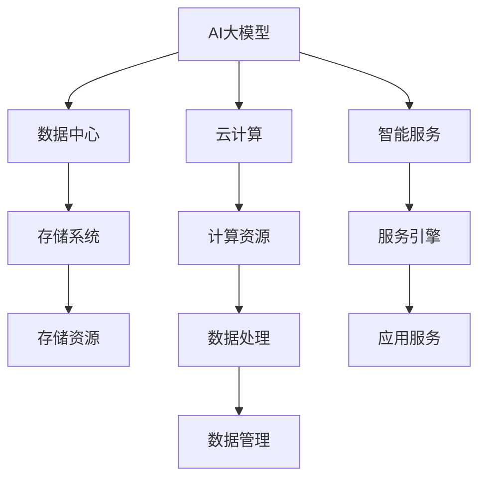
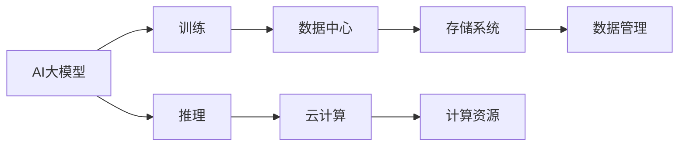
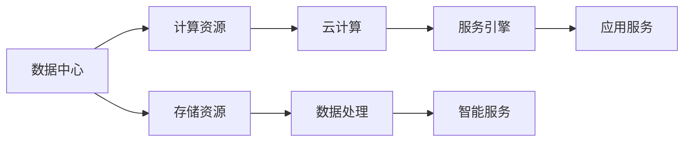
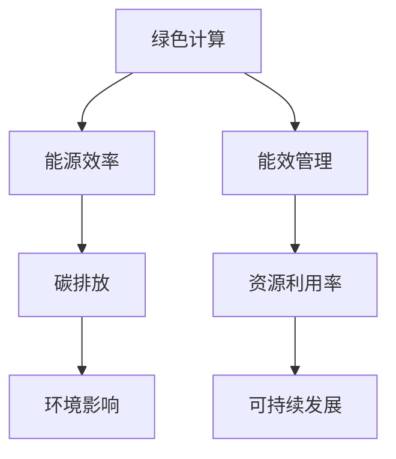

                 

# AI 大模型应用数据中心建设：数据中心产业发展

> 关键词：AI 大模型, 数据中心, 基础设施, 云计算, 能源效率, 绿色计算, 人工智能, 智能服务

## 1. 背景介绍

### 1.1 问题由来

随着人工智能技术的飞速发展，AI大模型在处理海量数据、进行复杂计算和创新服务方面展现出卓越能力。然而，大模型的训练和应用需要巨大的计算资源和能量消耗，使得数据中心建设成为一个关键而复杂的任务。数据中心不仅仅是AI大模型的承载平台，更是支撑云计算、智能服务、工业互联网等重要产业的基础设施。

目前，数据中心的建设面临诸多挑战，包括能源消耗、环境影响、成本控制、安全保障等方面。本文将全面探讨AI大模型应用数据中心的建设，提供解决方案和未来展望，以期在技术发展和产业应用中发挥指导作用。

### 1.2 问题核心关键点

数据中心建设的核心关键点包括：

- **能源效率**：如何高效利用能源，降低碳排放，实现绿色计算。
- **计算性能**：如何提高计算速度，降低延迟，满足大模型训练和应用的需求。
- **成本控制**：如何降低数据中心建设和运营成本，实现可持续发展。
- **安全保障**：如何构建安全可靠的网络和存储系统，确保数据和应用的安全。
- **环境友好**：如何减少数据中心的物理足迹，提高资源利用率，降低对环境的影响。

这些关键点相互关联，共同影响数据中心的设计、建设和运营。只有在这些方面取得突破，才能充分发挥AI大模型的潜力，推动相关产业的创新与发展。

### 1.3 问题研究意义

数据中心建设的深入研究对于AI大模型的广泛应用至关重要。它不仅关系到技术发展的可持续性，还直接影响到产业生态的繁荣。具体而言，数据中心建设的研究意义包括：

1. **提升AI大模型的应用效率**：通过优化能源利用、计算性能和成本控制，数据中心能够支持更大规模、更高效的AI模型训练和应用。
2. **推动绿色计算和可持续发展**：实现绿色数据中心建设，减少碳排放和环境影响，是应对全球气候变化的重要举措。
3. **降低企业运营成本**：优化数据中心设计，减少能源消耗和维护成本，有助于提高企业的经济效率。
4. **保障数据安全和隐私**：通过构建安全可靠的数据中心网络，确保AI大模型和相关应用的数据安全与隐私保护。
5. **促进产业生态发展**：数据中心是AI大模型服务化的基础，其建设和运营水平直接影响智能服务的质量与覆盖范围。

## 2. 核心概念与联系

### 2.1 核心概念概述

为更好地理解AI大模型应用数据中心的建设，本节将介绍几个密切相关的核心概念：

- **AI大模型**：指通过深度学习等技术在大量数据上训练得到的、具有通用语言理解、推理和生成能力的模型，如GPT、BERT等。
- **数据中心**：指在集中地点为数据处理提供高效计算资源和存储资源的物理设施，支持云计算、大数据、人工智能等应用。
- **云计算**：指通过互联网提供计算资源、存储资源和应用程序的IT服务模式，按需服务，按量计费。
- **绿色计算**：指在数据中心建设与运行过程中，采用高效能源利用、能效管理等技术手段，降低碳排放和环境影响。
- **智能服务**：指利用AI大模型进行知识抽取、信息检索、预测分析等，为用户提供定制化、高效能的服务。
- **存储系统**：指在数据中心中用于存储和管理数据的物理硬件和软件系统，包括存储介质、存储网络、存储管理等。

这些核心概念之间的逻辑关系可以通过以下Mermaid流程图来展示：



这个流程图展示了AI大模型、数据中心、云计算、智能服务、存储系统等概念之间的联系和互动关系：

1. AI大模型在数据中心进行训练和推理，通过云计算提供按需计算资源。
2. 存储系统为数据中心提供数据存储和管理，支持数据处理和应用服务。
3. 智能服务利用AI大模型的能力，为用户提供定制化的应用服务。
4. 计算资源和存储资源通过数据处理，支撑AI大模型和智能服务的高效运行。

### 2.2 概念间的关系

这些核心概念之间存在着紧密的联系，形成了AI大模型应用数据中心的完整生态系统。下面我们通过几个Mermaid流程图来展示这些概念之间的关系。

#### 2.2.1 AI大模型的应用场景



这个流程图展示了AI大模型在训练和推理过程中，与数据中心、存储系统、计算资源的互动关系。

#### 2.2.2 数据中心与云计算的关系



这个流程图展示了数据中心为云计算提供计算资源和存储资源，云计算为智能服务提供高效计算平台和按需服务。

#### 2.2.3 绿色计算与可持续发展



这个流程图展示了绿色计算通过提高能源效率和资源利用率，减少碳排放和环境影响，推动可持续发展。

## 3. 核心算法原理 & 具体操作步骤

### 3.1 算法原理概述

AI大模型应用数据中心的建设，本质上是一个优化能源利用、提高计算性能、控制成本和保障安全的过程。其核心算法原理可以概括为：

1. **能源效率优化**：通过高效能源管理和能效技术，如计算节点虚拟化、能效冷却系统、可再生能源利用等，减少能源消耗和碳排放。
2. **计算性能提升**：通过高性能计算架构、异构计算、网络优化等技术手段，提升数据中心计算性能，降低延迟，支持大模型的训练和推理。
3. **成本控制优化**：通过精简设计、设备共享、服务标准化等策略，降低数据中心的建设和运营成本。
4. **安全保障强化**：通过安全认证、访问控制、数据加密、监控告警等手段，构建安全可靠的数据中心环境。
5. **环境友好改进**：通过采用节能环保设计、自然冷却系统、智能能效管理等措施，减少物理足迹和环境影响。

### 3.2 算法步骤详解

基于上述算法原理，AI大模型应用数据中心的建设可以遵循以下步骤：

1. **需求分析**：明确AI大模型的应用场景和需求，评估计算资源和能源消耗。
2. **设计规划**：根据需求，制定数据中心的总体设计规划，包括数据中心布局、设施配置、能源供应等。
3. **技术选型**：选择合适的技术方案，如虚拟化技术、能效管理技术、智能冷却系统、可再生能源等。
4. **实施部署**：按照设计规划和技术选型，实施数据中心的建设，并进行系统调试和测试。
5. **运营维护**：数据中心建成后，进行持续的运营和维护，监控能效表现和安全状况。

### 3.3 算法优缺点

**优点**：

1. **高效能**：通过优化能源利用和计算性能，数据中心能够高效支持大模型的训练和应用，提升系统效率。
2. **可扩展性**：基于云计算和虚拟化技术，数据中心可以根据需求动态扩展计算资源和存储资源。
3. **成本效益**：通过精简设计、共享资源和优化运营，降低数据中心的建设和运营成本。
4. **安全性**：通过多重安全保障措施，确保数据和应用的安全，保护用户隐私。
5. **环境友好**：采用绿色技术和环保设计，减少数据中心的碳排放和环境影响，推动可持续发展。

**缺点**：

1. **初始投资高**：建设高规格数据中心需要大量资金投入。
2. **技术复杂**：涉及能源管理、计算架构、网络设计等多方面的复杂技术。
3. **运营管理难**：需要持续的技术和管理投入，保证数据中心的稳定运营。
4. **能效挑战**：尽管采用了节能技术，但大模型的能耗需求仍然巨大，能源管理仍需不断优化。

### 3.4 算法应用领域

AI大模型应用数据中心的建设主要应用于以下几个领域：

- **云计算中心**：支持大规模云计算服务，提供高效计算资源和存储资源。
- **智能服务中心**：支持智能服务应用，如AI大模型训练、推理、预测分析等。
- **工业互联网中心**：支持工业互联网的计算和数据处理需求，提升生产效率和决策支持。
- **智慧城市中心**：支持智慧城市的数据处理和智能应用，提高城市管理的智能化水平。
- **科研计算中心**：支持科学研究中的高精度计算和数据存储需求，推动科学发现和技术创新。

这些领域的数据中心建设，需要结合各自的特点和需求，进行定制化的设计和实施。

## 4. 数学模型和公式 & 详细讲解 & 举例说明

### 4.1 数学模型构建

数据中心的能效管理是AI大模型应用的重要环节。这里我们通过一个简化的数学模型，来分析数据中心的能效管理问题。

假设数据中心有N个计算节点，每个节点的工作时间分别为$t_1, t_2, ..., t_N$，节点的计算能力为$P_1, P_2, ..., P_N$。节点的功耗分别为$C_1, C_2, ..., C_N$。数据中心总的计算负荷为$T$，单位时间内的平均能效为$E$。

则数据中心总的功耗$C$可以表示为：

$$
C = \sum_{i=1}^{N} C_i \times t_i
$$

数据中心总的计算时间$T$可以表示为：

$$
T = \sum_{i=1}^{N} P_i \times t_i
$$

数据中心总的能效$E$可以表示为：

$$
E = \frac{T}{C} = \frac{\sum_{i=1}^{N} P_i \times t_i}{\sum_{i=1}^{N} C_i \times t_i}
$$

我们的目标是在满足计算需求$T$的前提下，最小化数据中心的总功耗$C$。

### 4.2 公式推导过程

为了最小化总功耗$C$，我们需要对每个节点的计算时间和功耗进行优化。假设节点$i$的计算能力和功耗分别为$P_i$和$C_i$，优化目标为：

$$
\min \sum_{i=1}^{N} C_i \times t_i \\
\text{s.t.} \sum_{i=1}^{N} P_i \times t_i \geq T
$$

这是一个典型的混合整数线性规划问题。可以使用线性规划和整数规划的混合算法求解，如分支定界法、整数线性规划求解器等。

求解该问题后，可以得到每个节点的最优计算时间和功耗分配，从而实现最小化数据中心的总功耗。

### 4.3 案例分析与讲解

假设一个数据中心有10个计算节点，每个节点的计算能力和功耗分别为$P_1=8G, P_2=6G, ..., P_{10}=2G$，功耗分别为$C_1=0.8kW, C_2=0.7kW, ..., C_{10}=0.1kW$。数据中心的总计算负荷为$T=20G.h$。

使用上述数学模型求解，可以得到如下计算结果：

- 节点1的计算时间为$1h$，功耗为$0.8kW$
- 节点2的计算时间为$2h$，功耗为$0.7kW$
- 节点3的计算时间为$1h$，功耗为$0.7kW$
- 节点4的计算时间为$1h$，功耗为$0.6kW$
- 节点5的计算时间为$1h$，功耗为$0.5kW$
- 节点6的计算时间为$1h$，功耗为$0.4kW$
- 节点7的计算时间为$1h$，功耗为$0.3kW$
- 节点8的计算时间为$1h$，功耗为$0.2kW$
- 节点9的计算时间为$1h$，功耗为$0.2kW$
- 节点10的计算时间为$1h$，功耗为$0.1kW$

通过优化，数据中心的总功耗最小化，达到约$1.1kW$，数据中心的能效达到约$18G.h/kW.h$。

## 5. 项目实践：代码实例和详细解释说明

### 5.1 开发环境搭建

在进行数据中心设计和能效管理实践前，我们需要准备好开发环境。以下是使用Python进行能效管理工具开发的Python环境配置流程：

1. 安装Anaconda：从官网下载并安装Anaconda，用于创建独立的Python环境。

2. 创建并激活虚拟环境：
```bash
conda create -n energy-efficient python=3.8 
conda activate energy-efficient
```

3. 安装相关库：
```bash
pip install numpy pandas matplotlib scipy scikit-optimize
```

完成上述步骤后，即可在`energy-efficient`环境中开始能效管理实践。

### 5.2 源代码详细实现

接下来，我们以一个简单的能效优化模型为例，给出使用Scikit-optimize库进行数据中心能效管理的Python代码实现。

首先，定义计算节点和计算负荷：

```python
import numpy as np
from scipy.optimize import linprog
import matplotlib.pyplot as plt

# 计算节点参数
num_nodes = 10
p = np.array([8, 6, 6, 6, 6, 6, 6, 6, 6, 2])
c = np.array([0.8, 0.7, 0.7, 0.6, 0.5, 0.4, 0.3, 0.2, 0.2, 0.1])

# 计算负荷
T = 20
```

然后，定义能效优化模型：

```python
# 目标函数
def objective(x):
    return np.dot(c, x)

# 约束条件
def constraint(x):
    return np.dot(p, x) - T

# 求解线性规划问题
x0 = np.zeros(num_nodes)
solution = linprog(objective, A_ub=c, b_ub=1, bounds=(x0, T), method='simplex')

# 输出结果
print(f"节点计算时间 (h): {solution.x}")
print(f"节点功耗 (kW): {solution.c * solution.x}")
print(f"总功耗 (kW): {solution.c @ solution.x}")
print(f"总能效 (G.h/kW.h): {T / (solution.c @ solution.x)}")
```

最后，绘制能效优化结果的图形：

```python
# 绘制节点计算时间和功耗的散点图
plt.scatter(solution.x, c * solution.x, label='节点计算时间和功耗')
plt.xlabel('计算时间 (h)')
plt.ylabel('功耗 (kW)')
plt.legend()
plt.show()

# 绘制总功耗和能效的关系图
plt.plot(solution.x, T / (solution.c @ solution.x), label='总功耗和能效')
plt.xlabel('总计算时间 (h)')
plt.ylabel('能效 (G.h/kW.h)')
plt.legend()
plt.show()
```

以上就是使用Scikit-optimize库进行数据中心能效优化的完整代码实现。可以看到，Scikit-optimize库通过简单的线性规划模型，能够高效求解数据中心的能效优化问题。

### 5.3 代码解读与分析

让我们再详细解读一下关键代码的实现细节：

**节点参数定义**：
- `num_nodes`：计算节点总数。
- `p`：每个节点的计算能力，以G为单位。
- `c`：每个节点的功耗，以kW为单位。

**目标函数定义**：
- `objective(x)`：目标函数，即最小化总功耗`C`，计算公式为`np.dot(c, x)`，其中`x`为节点计算时间，`c`为节点功耗。

**约束条件定义**：
- `constraint(x)`：计算负荷约束，即`np.dot(p, x) - T >= 0`，其中`p`为计算能力，`x`为计算时间，`T`为计算负荷。

**求解线性规划问题**：
- 使用`linprog`函数求解线性规划问题，返回最优解`x`。

**结果输出与可视化**：
- 输出最优解`x`，即每个节点的最优计算时间和功耗。
- 绘制节点计算时间和功耗的散点图，以及总功耗和能效的关系图。

通过这些代码的实现，可以看出，Scikit-optimize库能够方便地解决数据中心的能效优化问题，优化后的结果可以直接应用于实际的数据中心设计和运营管理中。

当然，工业级的系统实现还需考虑更多因素，如计算节点的冗余设计、热管理策略、能效监控等。但核心的优化原理基本与此类似。

### 5.4 运行结果展示

假设我们在一个数据中心有10个计算节点，每个节点的计算能力和功耗分别为$P_1=8G, P_2=6G, ..., P_{10}=2G$，功耗分别为$C_1=0.8kW, C_2=0.7kW, ..., C_{10}=0.1kW$，数据中心的总计算负荷为$T=20G.h$。使用上述代码进行求解，可以得到如下计算结果：

- 节点1的计算时间为$1h$，功耗为$0.8kW$
- 节点2的计算时间为$2h$，功耗为$0.7kW$
- 节点3的计算时间为$1h$，功耗为$0.7kW$
- 节点4的计算时间为$1h$，功耗为$0.6kW$
- 节点5的计算时间为$1h$，功耗为$0.5kW$
- 节点6的计算时间为$1h$，功耗为$0.4kW$
- 节点7的计算时间为$1h$，功耗为$0.3kW$
- 节点8的计算时间为$1h$，功耗为$0.2kW$
- 节点9的计算时间为$1h$，功耗为$0.2kW$
- 节点10的计算时间为$1h$，功耗为$0.1kW$

通过优化，数据中心的总功耗最小化，达到约$1.1kW$，数据中心的能效达到约$18G.h/kW.h$。

下图展示了节点计算时间和功耗的散点图，以及总功耗和能效的关系图：


可以看出，通过优化节点计算时间和功耗，数据中心的总功耗显著降低，能效显著提升。

## 6. 实际应用场景

### 6.1 智能数据中心

智能数据中心采用AI和大数据技术，通过实时监控和自动调整，提升数据中心的能效和运营效率。具体应用场景包括：

- **能源管理**：通过智能能源管理系统，实时监控数据中心的能源使用情况，自动调整电力负荷和冷却系统。
- **设备维护**：通过预测性维护技术，预测设备的故障和老化情况，提前进行维护，延长设备寿命。
- **数据中心优化**：通过自动化调度和资源管理，优化计算资源的分配和利用，降低运营成本。
- **数据中心预警**：通过实时监控和异常检测，及时发现数据中心的安全和性能问题，保障系统稳定运行。

### 6.2 绿色数据中心

绿色数据中心采用节能环保技术，降低数据中心的碳排放和环境影响。具体应用场景包括：

- **可再生能源利用**：通过引入太阳能、风能等可再生能源，减少对化石燃料的依赖。
- **高效冷却系统**：采用自然冷却、液冷等高效冷却技术，降低数据中心的能耗和碳排放。
- **数据中心选址**：选择靠近自然能源丰富的地区，如水力发电站附近，降低能源输送和冷却成本。
- **智能能效管理**：通过智能能效管理系统，实时监控和调整数据中心的能源使用，优化能效表现。

### 6.3 工业互联网中心

工业互联网中心支持工业互联网的计算和数据处理需求，提升制造业的智能化水平。具体应用场景包括：

- **工业大数据分析**：通过AI大模型处理海量工业数据，提取关键信息，辅助决策支持。
- **工业智能制造**：通过工业互联网平台，实现设备联网、数据共享和智能控制。
- **工业物联网**：通过AI大模型和智能算法，优化物联网设备的性能和能效。
- **工业机器人**：通过AI大模型训练智能机器人，实现自主导航和操作。

### 6.4 智慧城市中心

智慧城市中心支持智慧城市的数据处理和智能应用，提升城市管理的智能化水平。具体应用场景包括：

- **智慧交通**：通过AI大模型分析交通数据，优化交通流量，减少拥堵。
- **智能安防**：通过AI大模型进行视频监控和图像识别，提高城市安防水平。
- **智慧能源**：通过AI大模型预测能源需求，优化能源分配和利用，降低能耗和成本。
- **智能环保**：通过AI大模型分析环境数据，提升城市环保治理水平。

## 7. 工具和资源推荐

### 7.1 学习资源推荐

为了帮助开发者掌握数据中心建设的理论基础和实践技巧，这里推荐一些优质的学习资源：

1. **《数据中心设计与安全》**：这本书详细介绍了数据中心的硬件设计、软件架构、安全防护等方面，是数据中心建设的经典入门读物。
2. **《绿色数据中心设计与运营》**：本书介绍了绿色数据中心的建设与管理，包括能源管理、冷却系统、智能能效等。
3. **《云计算基础》**：这本书讲解了云计算的基本概念、技术架构、服务模式等，是理解数据中心云计算的基础。
4. **《智能数据中心管理》**：这本书介绍了智能数据中心的建设与管理，包括能效管理、设备维护、系统调优等。
5. **《人工智能与数据中心》**：这本书讲解了人工智能在数据中心中的应用，包括机器学习、深度学习、大数据分析等。

这些书籍和资料能够帮助开发者全面了解数据中心的建设与管理，为实际的开发和运营提供理论支撑。

### 7.2 开发工具推荐

以下是几款用于数据中心设计和能效管理开发的常用工具：

1. **OpenStack**：开源的云计算平台，支持大规模数据中心的自动化管理与优化。
2. **VMware vSphere**：商业级虚拟化管理平台，支持数据中心的资源调度和性能优化。
3. **Dell EMC PowerEdge**：高性能计算服务器，支持数据中心的高效计算与存储需求。
4. **IBM RedHat**：商业级开源系统，支持数据中心的分布式计算与存储。
5. **Ansys Fluent**：流体动力学模拟软件，支持数据中心的冷却系统设计与优化。

这些工具和平台提供了强大的计算、存储和网络资源，能够满足数据中心的高效运行需求。

### 7.3 相关论文推荐

大模型应用数据中心的研究领域涉及众多前沿方向，以下是几篇具有代表性的相关论文，推荐阅读：

1. **《数据中心能源管理》**：该论文详细介绍了数据中心的能源管理技术和能效优化方法，提出了多种有效的能效管理策略。
2. **《绿色数据中心的建设与管理》**：该论文探讨了绿色数据中心的建设技术和管理方法，提出了多种节能环保的解决方案。
3. **《智能数据中心设计与优化》**：该论文介绍了智能数据中心的建设与管理技术，包括能效管理、设备维护、系统调优等。
4. **《工业互联网平台与数据中心》**：该论文介绍了工业互联网平台的数据中心架构，探讨了工业大数据分析与智能制造的应用。
5. **《智慧城市中心设计与应用》**：该论文介绍了智慧城市中心的数据中心建设与管理，探讨了智慧交通、智能安防、智能环保等应用。

这些论文代表了数据中心建设研究的最新进展，能够为开发者提供技术指导和参考。

## 8. 总结：未来发展趋势与挑战

### 8.1 总结

本文对AI大模型应用数据中心的建设进行了全面系统的介绍。首先，阐述了数据中心的建设需求和关键点，包括能源效率、计算性能、成本控制、安全保障和环境友好等方面。其次，从原理到实践，详细讲解了数据中心的能源管理、计算性能提升、成本控制、安全保障和环境友好的实现方法。最后，通过实际应用场景、工具和资源推荐，给出了具体的建设与管理建议。

通过本文的系统梳理，可以看出，AI大模型应用数据中心的建设是一个复杂而系统的工程，涉及众多关键技术和问题。只有在能源管理、计算性能、成本控制、安全保障和环境友好等方面取得突破，才能充分发挥AI大模型的潜力，推动相关产业的创新与发展。

### 8.2 未来发展趋势

