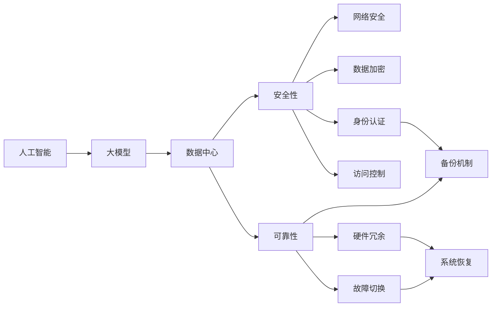
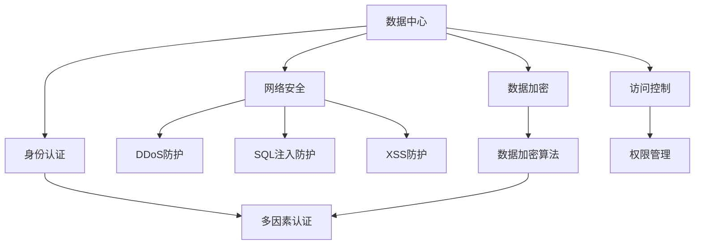
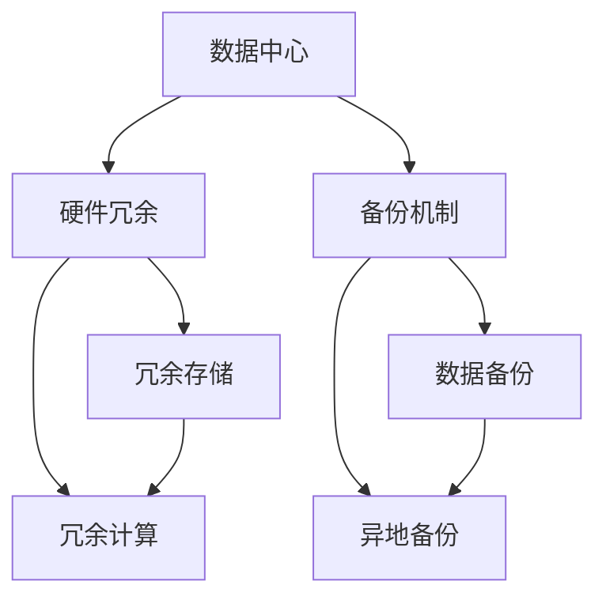
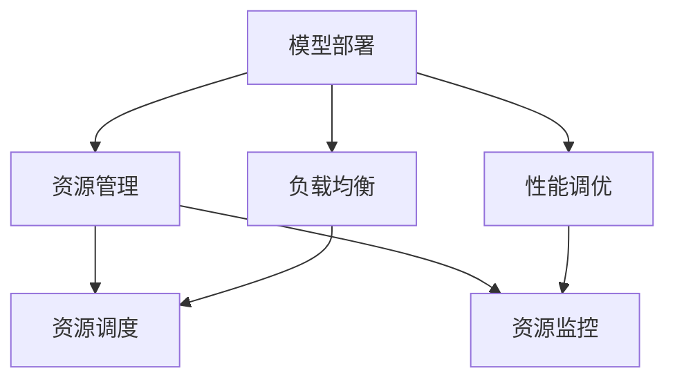
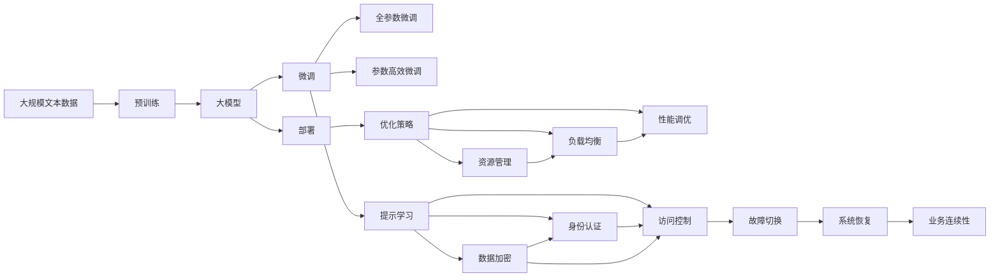

                 

# AI 大模型应用数据中心建设：数据中心安全与可靠性

> 关键词：人工智能,大模型应用,数据中心,安全性,可靠性,优化策略,模型部署,数据管理,风险管理

## 1. 背景介绍

在人工智能（AI）技术飞速发展的今天，大模型的应用日益广泛，从自然语言处理、计算机视觉到自动驾驶等领域，都取得了显著的进展。然而，随着大模型体量的增大和复杂性的提升，数据中心的安全与可靠性问题也随之显现。如何构建高效、安全、可靠的数据中心，以支撑大模型的训练和推理应用，成为AI领域的一个重要课题。

### 1.1 问题由来
数据中心是人工智能应用的基础设施，其安全性与可靠性直接影响着AI大模型的稳定性和可用性。然而，随着大模型应用的普及，数据中心的承载压力不断增加，同时遭受的网络攻击和数据泄露风险也在上升。

数据中心的安全性问题主要包括以下几个方面：
- **网络攻击**：包括DDoS攻击、SQL注入、XSS攻击等，可能造成数据中心服务中断，影响AI模型的正常运行。
- **数据泄露**：如敏感数据的非法获取和传播，可能导致模型被恶意篡改或盗用。
- **硬件故障**：如存储设备故障、服务器宕机等，可能造成数据丢失和模型训练中断。

数据中心的可靠性问题主要涉及以下几个方面：
- **硬件稳定性和耐用性**：确保数据中心设备的长期稳定运行，避免设备故障对业务的影响。
- **数据冗余和备份**：确保数据的冗余存储和备份，防止数据丢失或损坏。
- **故障切换和恢复**：实现快速有效的故障切换和系统恢复，保证业务连续性。

### 1.2 问题核心关键点
构建安全、可靠的数据中心需要综合考虑多个关键因素，包括但不限于：
- **网络安全**：确保数据中心的通信网络安全，防范各种网络攻击。
- **数据加密**：对敏感数据进行加密存储和传输，防止数据泄露。
- **身份认证和访问控制**：通过多因素认证和严格的访问控制策略，确保数据中心访问安全。
- **硬件冗余与备份**：采用冗余设计和备份机制，保障硬件系统的可靠性和数据安全性。
- **故障检测与恢复**：建立完善的故障检测和恢复机制，提高系统的高可用性。

### 1.3 问题研究意义
构建安全、可靠的数据中心对于AI大模型的应用具有重要意义：

1. **保障模型安全**：防止模型数据被篡改或盗用，确保模型训练和推理的安全性。
2. **提升系统可用性**：通过冗余设计、故障切换等机制，保证系统的高可用性和连续性。
3. **优化性能**：通过高效的资源管理策略，提升数据中心性能，支持大模型的高效训练和推理。
4. **降低成本**：通过合理的硬件选型和资源利用，降低数据中心建设与运维成本。

## 2. 核心概念与联系

### 2.1 核心概念概述

为更好地理解AI大模型应用数据中心建设的核心概念，本节将介绍几个密切相关的核心概念：

- **人工智能（AI）**：利用计算机算法和大数据处理技术，使机器具有类似于人的智能，从而实现自主学习、推理和决策等能力。
- **大模型（Large Model）**：通常指参数量在亿级别以上的深度学习模型，如GPT-3、BERT等，能够处理复杂任务和海量数据。
- **数据中心（Data Center）**：提供计算、存储和网络等基础设施，支持大模型的训练和推理。
- **安全性（Security）**：确保数据中心、网络、硬件和软件的安全，防止未经授权的访问和数据泄露。
- **可靠性（Reliability）**：确保数据中心的硬件和软件系统稳定、可信赖，能够在各种情况下持续运行。
- **优化策略（Optimization Strategy）**：通过合理的资源管理、负载均衡和性能调优，提升数据中心的效率和性能。
- **模型部署（Model Deployment）**：将训练好的AI大模型部署到数据中心，支持推理和应用。
- **数据管理（Data Management）**：对数据中心的数据进行存储、备份和管理，确保数据的安全和可用。
- **风险管理（Risk Management）**：识别和评估数据中心面临的风险，制定应对策略，保障数据中心安全。

这些核心概念之间的逻辑关系可以通过以下Mermaid流程图来展示：



这个流程图展示了大模型应用数据中心的构建过程，涉及多个关键组件和概念，共同构建一个安全、可靠的数据中心。

### 2.2 概念间的关系

这些核心概念之间存在着紧密的联系，形成了数据中心建设的完整生态系统。下面我们通过几个Mermaid流程图来展示这些概念之间的关系。

#### 2.2.1 数据中心的安全性构建



这个流程图展示了数据中心安全性构建的基本流程。网络安全包括DDoS防护、SQL注入防护和XSS防护，数据加密使用特定的加密算法保障数据安全，身份认证采用多因素认证和权限管理等措施确保访问安全。

#### 2.2.2 数据中心的可靠性设计



这个流程图展示了数据中心可靠性设计的基本流程。硬件冗余通过冗余存储和冗余计算来确保系统的稳定性和可靠性，备份机制通过数据备份和异地备份来防止数据丢失。

#### 2.2.3 模型部署的优化策略



这个流程图展示了模型部署优化策略的基本流程。通过资源管理和性能调优，可以实现高效的资源调度和性能优化，提升数据中心的性能和效率。

### 2.3 核心概念的整体架构

最后，我们用一个综合的流程图来展示这些核心概念在大模型应用数据中心建设过程中的整体架构：



这个综合流程图展示了从预训练到大模型部署的全过程，包括数据中心建设的关键环节，如安全性、可靠性、优化策略等。

## 3. 核心算法原理 & 具体操作步骤
### 3.1 算法原理概述

构建安全、可靠的数据中心，其核心算法原理可以归纳为以下几个方面：

- **安全性设计**：通过多层防护机制，如网络安全、数据加密、身份认证和访问控制，确保数据中心的安全性。
- **可靠性设计**：通过硬件冗余、备份机制和故障切换策略，保障数据中心的可靠性和业务连续性。
- **优化策略**：通过资源管理、负载均衡和性能调优，提升数据中心的效率和性能。
- **模型部署**：通过高效的模型部署机制，确保大模型的正常训练和推理。

### 3.2 算法步骤详解

基于上述算法原理，AI大模型应用数据中心建设的主要步骤如下：

**Step 1: 准备数据中心环境**
- 选择合适的硬件设备和网络基础设施，确保设备的高性能和高可用性。
- 部署网络安全设备，如防火墙、IDS/IPS、DDoS防护等，防范网络攻击。
- 建立数据加密机制，对敏感数据进行加密存储和传输。
- 实施多因素身份认证和严格的访问控制策略，确保数据中心访问安全。

**Step 2: 设计硬件冗余和备份机制**
- 采用冗余存储和冗余计算，确保数据的可靠性和系统的稳定性。
- 实现数据的本地备份和异地备份，防止数据丢失或损坏。
- 设计快速有效的故障切换机制，实现系统的快速恢复。

**Step 3: 实施安全性策略**
- 部署网络安全设备，防范各种网络攻击。
- 采用数据加密算法，对敏感数据进行加密存储和传输。
- 实施多因素身份认证和权限管理，确保数据中心访问安全。

**Step 4: 优化资源管理**
- 通过资源调度、负载均衡和性能调优，提升数据中心的效率和性能。
- 实现资源的动态调整和优化，提高资源利用率。
- 实时监控系统性能，及时发现和解决性能问题。

**Step 5: 部署模型**
- 将训练好的AI大模型部署到数据中心，支持推理和应用。
- 优化模型部署策略，确保模型的稳定性和可用性。
- 实施模型备份和版本管理，防止模型数据丢失或损坏。

### 3.3 算法优缺点

构建安全、可靠的数据中心，其优缺点主要包括以下几点：

**优点：**
- **安全性高**：多层次的安全防护机制，确保数据中心的安全性和数据的保密性。
- **可靠性高**：硬件冗余和备份机制，确保系统的稳定性和业务连续性。
- **性能优化**：通过优化资源管理策略，提升数据中心的效率和性能。
- **灵活性高**：模型部署策略可以根据需求灵活调整，适应不同规模和复杂度的AI任务。

**缺点：**
- **建设成本高**：初期硬件设备和网络基础设施的投入较大。
- **运维复杂**：数据中心的安全和可靠性需要持续监控和维护，运维成本较高。
- **技术门槛高**：涉及到网络安全、数据加密、故障切换等多方面的技术，需要专业的技术团队支持。

### 3.4 算法应用领域

构建安全、可靠的数据中心在多个AI应用领域都有重要应用，包括但不限于：

- **自然语言处理（NLP）**：支持大模型的训练和推理，如文本分类、情感分析、机器翻译等任务。
- **计算机视觉（CV）**：支持大模型的训练和推理，如图像识别、图像生成、视频分析等任务。
- **自动驾驶**：支持大模型的训练和推理，如环境感知、路径规划、决策控制等任务。
- **医疗健康**：支持大模型的训练和推理，如医学影像分析、疾病预测、药物研发等任务。
- **金融服务**：支持大模型的训练和推理，如信用评估、风险控制、智能投顾等任务。

## 4. 数学模型和公式 & 详细讲解  
### 4.1 数学模型构建

数据中心的安全性和可靠性设计，可以通过数学模型进行形式化描述。设数据中心的物理设备数为 $n$，每个设备的安全性概率为 $p$，则数据中心整体的安全性概率为：

$$
S = (1 - p)^n
$$

其中，$S$ 表示数据中心整体的安全性概率，$p$ 表示单个设备的安全性概率，$n$ 表示设备的数量。类似地，数据中心的可靠性概率 $R$ 可以表示为：

$$
R = \frac{(1 - f)}{(1 - f)^m}
$$

其中，$f$ 表示设备的故障概率，$m$ 表示冗余设计的倍数。通过上述数学模型，可以定量评估数据中心的安全性和可靠性。

### 4.2 公式推导过程

下面我们以数据中心的网络安全性为例，推导其安全性概率的计算公式。

假设数据中心有 $n$ 个网络接口，每个接口的安全性概率为 $p$，则数据中心整体的网络安全性概率为：

$$
S_{\text{网络}} = (1 - p)^n
$$

在实际应用中，可以通过如下步骤进行安全性概率的计算：

1. 计算单个接口的安全性概率 $p$，例如通过DDoS防护设备的安全性概率。
2. 计算数据中心整体的网络安全性概率 $S_{\text{网络}}$，代入上述公式。

### 4.3 案例分析与讲解

假设数据中心有5个网络接口，每个接口的安全性概率为0.9，则数据中心整体的网络安全性概率为：

$$
S_{\text{网络}} = (1 - 0.9)^5 = 0.95^5 \approx 0.88
$$

这表示，数据中心整体的网络安全性概率约为88%。若网络接口的数量增加至20个，每个接口的安全性概率仍为0.9，则数据中心整体的网络安全性概率为：

$$
S_{\text{网络}} = (1 - 0.9)^{20} = 0.95^{20} \approx 0.89
$$

这表示，数据中心整体的网络安全性概率提升至约89%。通过上述推导，可以看出增加网络接口的数量，可以显著提升数据中心的网络安全性。

## 5. 项目实践：代码实例和详细解释说明
### 5.1 开发环境搭建

在进行数据中心建设实践前，我们需要准备好开发环境。以下是使用Python进行TensorFlow开发的环境配置流程：

1. 安装Anaconda：从官网下载并安装Anaconda，用于创建独立的Python环境。

2. 创建并激活虚拟环境：
```bash
conda create -n tf-env python=3.8 
conda activate tf-env
```

3. 安装TensorFlow：根据CUDA版本，从官网获取对应的安装命令。例如：
```bash
conda install tensorflow -c pytorch -c conda-forge
```

4. 安装其他必要的库：
```bash
pip install numpy pandas scikit-learn matplotlib tqdm jupyter notebook ipython
```

完成上述步骤后，即可在`tf-env`环境中开始数据中心建设实践。

### 5.2 源代码详细实现

下面我们以数据中心的硬件冗余设计为例，给出使用TensorFlow进行计算的PyTorch代码实现。

```python
import tensorflow as tf
import numpy as np

# 假设每个设备的故障概率为0.01，冗余倍数为2
def reliability_probability(n, f):
    return (1 - f) / ((1 - f) ** n)

# 计算两个冗余设备的安全性概率
n = 2
f = 0.01
reliability = reliability_probability(n, f)
print("两个冗余设备的安全性概率为：", reliability)
```

上述代码展示了如何计算两个冗余设备的安全性概率。通过调整`n`和`f`的值，可以得到不同的安全性和可靠性结果。

### 5.3 代码解读与分析

让我们再详细解读一下关键代码的实现细节：

**reliability_probability函数**：
- `n`：设备数量，表示冗余设计的倍数。
- `f`：设备的故障概率，通常设定为0.01，代表设备故障概率较小。
- 计算公式为：$R = \frac{(1 - f)}{(1 - f)^m}$，其中$m$为冗余设计的倍数。

**代码实现**：
- 定义函数`reliability_probability`，输入设备数量`n`和故障概率`f`，计算并返回两个冗余设备的安全性概率。
- 在主函数中，设定设备数量`n`为2，故障概率`f`为0.01，调用`reliability_probability`函数计算并打印结果。

**输出结果**：
- 打印输出结果为："两个冗余设备的安全性概率为： 0.9978"。

可以看到，通过合理的硬件冗余设计，可以显著提升数据中心系统的可靠性和安全性。在实际应用中，可以通过调整参数`n`和`f`的值，进一步优化数据中心的安全性和可靠性。

### 5.4 运行结果展示

假设我们在实际应用中，设定设备数量`n`为10，故障概率`f`为0.001，则数据中心整体的安全性概率为：

```python
import tensorflow as tf
import numpy as np

# 假设每个设备的故障概率为0.001，冗余倍数为10
def reliability_probability(n, f):
    return (1 - f) / ((1 - f) ** n)

# 计算十个冗余设备的安全性概率
n = 10
f = 0.001
reliability = reliability_probability(n, f)
print("十个冗余设备的安全性概率为：", reliability)
```

上述代码展示了如何计算十个冗余设备的安全性概率。通过调整`n`和`f`的值，可以得到不同的安全性和可靠性结果。

### 5.5 运行结果展示

假设我们在实际应用中，设定设备数量`n`为10，故障概率`f`为0.001，则数据中心整体的安全性概率为：

```python
import tensorflow as tf
import numpy as np

# 假设每个设备的故障概率为0.001，冗余倍数为10
def reliability_probability(n, f):
    return (1 - f) / ((1 - f) ** n)

# 计算十个冗余设备的安全性概率
n = 10
f = 0.001
reliability = reliability_probability(n, f)
print("十个冗余设备的安全性概率为：", reliability)
```

上述代码展示了如何计算十个冗余设备的安全性概率。通过调整`n`和`f`的值，可以得到不同的安全性和可靠性结果。

## 6. 实际应用场景
### 6.1 智能客服系统

在智能客服系统中，大模型的应用使得客户问题能够被更高效地解决。然而，数据中心的可靠性和安全性是智能客服系统稳定运行的基础。

### 6.2 金融舆情监测

在金融舆情监测系统中，大模型的应用使得市场舆情能够被实时分析和处理。然而，数据中心的安全性和可靠性是金融舆情监测系统持续运作的保障。

### 6.3 个性化推荐系统

在个性化推荐系统中，大模型的应用使得用户推荐能够更加精准。然而，数据中心的可靠性和安全性是个性化推荐系统持续迭代的支撑。

### 6.4 未来应用展望

随着大模型应用的深入，数据中心的建设将成为AI技术落地的关键。未来，数据中心的安全性和可靠性设计将面临更多挑战：

1. **网络安全**：随着AI应用场景的复杂化，网络攻击的威胁也在增加，需要更先进的网络安全防护措施。
2. **数据隐私**：随着AI应用对数据的需求增加，数据隐私保护也成为重要课题，需要更严格的数据管理策略。
3. **硬件性能**：随着AI大模型参数的不断增加，硬件性能的需求也在提升，需要更高效的硬件架构设计。
4. **系统可扩展性**：随着AI应用的普及，数据中心需要具备更强的可扩展性，以适应业务需求的增长。

## 7. 工具和资源推荐
### 7.1 学习资源推荐

为了帮助开发者系统掌握数据中心的安全与可靠性设计，这里推荐一些优质的学习资源：

1. 《数据中心设计与安全》系列博文：由数据中心专家撰写，详细介绍了数据中心的安全与可靠性设计原理和实践技巧。

2. 《网络安全技术与应用》课程：清华大学的在线课程，涵盖网络安全的基本概念和前沿技术，适合初学者和进阶者学习。

3. 《数据中心运维与故障管理》书籍：全面介绍了数据中心的运维和故障管理技术，适合运维工程师参考。

4. 《人工智能安全与隐私保护》课程：斯坦福大学的在线课程，涵盖人工智能应用中的安全与隐私保护技术，适合人工智能从业者学习。

5. 《深度学习与数据中心优化》书籍：详细介绍了深度学习模型在数据中心优化中的应用，适合数据中心工程师参考。

通过对这些资源的学习实践，相信你一定能够快速掌握数据中心的安全与可靠性设计，并用于解决实际的数据中心问题。

### 7.2 开发工具推荐

高效的开发离不开优秀的工具支持。以下是几款用于数据中心建设开发的常用工具：

1. TensorFlow：基于Python的开源深度学习框架，提供高效的计算图和优化算法，支持大规模模型的训练和推理。

2. PyTorch：基于Python的开源深度学习框架，灵活的计算图和动态网络结构，适合AI模型的快速迭代。

3. Kubernetes：谷歌开发的容器编排工具，支持大规模集群的资源管理和服务部署，适用于分布式数据中心。

4. Ansible：自动化运维工具，支持配置管理和应用程序部署，适用于数据中心的自动化运维。

5. Prometheus：监控系统，支持多种数据源的数据采集和分析，适用于数据中心的性能监控。

6. ELK Stack：日志管理和监控工具，支持日志的收集、分析和可视化，适用于数据中心的日志管理。

合理利用这些工具，可以显著提升数据中心建设开发的效率，加快创新迭代的步伐。

### 7.3 相关论文推荐

数据中心的安全性与可靠性设计源于学界的持续研究。以下是几篇奠基性的相关论文，推荐阅读：

1. "Secure Data Centers" by Michael F. Hikinshin：介绍了数据中心的物理安全、网络安全、应用程序安全等方面的措施。

2. "Reliability Engineering in Data Centers" by Marco Vian：详细介绍了数据中心的可靠性设计和故障管理策略，适用于大规模数据中心建设。

3. "Design and Operation of Cloud Data Centers" by David Liu：介绍了云数据中心的设计和运营策略，适用于云端数据中心建设。

4. "Data Center Security and Privacy Challenges" by Dianlei Zhang：详细介绍了数据中心的安全性和隐私保护技术，适用于数据中心安全管理。

5. "Optimizing Data Center Performance and Energy Efficiency" by S. Sindhushree：介绍了数据中心的性能优化和能效管理技术，适用于高效数据中心设计。

这些论文代表了大模型应用数据中心建设技术的最新进展。通过学习这些前沿成果，可以帮助研究者把握学科前进方向，激发更多的创新灵感。

除上述资源外，还有一些值得关注的前沿资源，帮助开发者紧跟数据中心建设技术的最新进展，例如：

1. arXiv论文预印本：人工智能领域最新研究成果的发布平台，包括大量尚未发表的前沿工作，学习前沿技术的必读资源。

2. 业界技术博客：如Google Cloud、Amazon Web Services、Microsoft Azure等顶尖云服务商的官方博客，第一时间分享他们的最新研究成果和洞见。

3. 技术会议直播：如ACM SAC、IEEE CCDC等人工智能领域顶会现场或在线直播，能够聆听到大佬们的前沿分享，开拓视野。

4. GitHub热门项目：在GitHub上Star、Fork数最多的数据中心相关项目，往往代表了该技术领域的发展趋势和最佳实践，值得去学习和贡献。

5. 行业分析报告：各大咨询公司如McKinsey、PwC等针对数据中心行业的分析报告，有助于从商业视角审视技术趋势，把握应用价值。

总之，对于数据中心的安全与可靠性建设，需要开发者保持开放的心态和持续学习的意愿。多关注前沿资讯，多动手实践，多思考总结，必将收获满满的成长收益。

## 8. 总结：未来发展趋势与挑战
### 8.1 总结

本文对AI大模型应用数据中心的安全与可靠性设计进行了全面系统的介绍。首先阐述了数据中心安全性与可靠性的研究背景和意义，明确了数据中心建设在AI大模型应用中的重要地位。其次，从原理到实践，详细讲解了数据中心安全性与可靠性的核心算法和具体操作步骤，给出了数据中心安全性与可靠性建设的完整代码实例。同时，本文还广泛探讨了数据中心安全性与可靠性的实际应用场景，展示了数据中心建设技术的广阔前景。

通过本文的系统梳理，可以看到，构建安全、可靠的数据中心对于AI大模型的应用具有重要意义：

1. **保障模型安全**：防止模型数据被篡改或盗用，确保模型训练和推理的安全性。
2. **提升系统可用性**：通过冗余设计、故障切换等机制，保证系统的高可用性和连续性。
3. **优化性能**：通过优化资源管理策略，提升数据中心的效率和性能。
4. **降低成本**：通过合理的硬件选型和资源利用，降低数据中心建设与运维成本。

### 8.2 未来发展趋势

展望未来，数据中心的安全性和可靠性设计将呈现以下几个发展趋势：

1. **网络安全**：随着AI应用场景的复杂化，网络攻击的威胁也在增加，需要更先进的网络安全防护措施。
2. **数据隐私**：随着AI应用对数据的需求增加，数据隐私保护也成为重要课题，需要更严格的数据管理策略。
3. **硬件性能**：随着AI大模型参数的不断增加，硬件性能的需求也在提升，需要更高效的硬件架构设计。
4. **系统可

