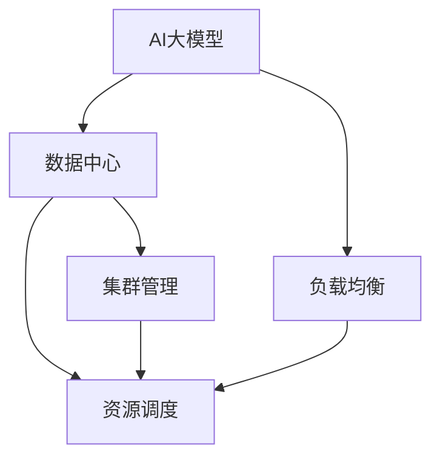

                 

## 1. 背景介绍

随着人工智能(AI)技术的迅猛发展，越来越多的AI大模型开始广泛应用于自然语言处理、计算机视觉、机器人等领域。这些大模型通常依赖于大规模的训练数据和计算资源，如大规模预训练模型（Large Pre-trained Models, LPMs）和深度神经网络（Deep Neural Networks, DNNs），训练和推理过程对计算资源的消耗巨大。因此，在实际应用中，大模型的负载均衡问题变得至关重要。

### 1.1 问题由来

随着AI大模型的应用场景日益广泛，对计算资源的需求不断增长。然而，计算资源的有限性使得如何合理分配资源成为必须面对的挑战。例如，一个高性能计算中心可能拥有数千个GPU，但这些GPU的负载并不均衡，某些GPU可能长期闲置，而另一些则超负荷运行。这种资源分配的不均衡不仅浪费了大量资源，还限制了大模型应用的规模和效率。因此，如何实现AI大模型的负载均衡，将计算资源合理分配到各个节点，成为数据中心管理的重要课题。

### 1.2 问题核心关键点

为了有效应对计算资源的负载不均衡问题，研究者们提出了多种解决方案，包括资源调度算法、集群管理工具等。核心在于以下几点：

- 资源调度算法：根据任务需求和计算资源现状，动态调整任务分配。
- 集群管理工具：提供集中式的资源管理和监控平台，实现自动化的资源分配。
- 负载均衡策略：基于任务性质和计算资源特点，优化资源分配策略。

### 1.3 问题研究意义

研究AI大模型负载均衡技术，对于提升数据中心资源利用率，降低能耗和成本，加速AI大模型的应用推广，具有重要意义：

1. 提升资源利用率：通过负载均衡，数据中心可以更高效地利用计算资源，避免资源浪费。
2. 降低能耗成本：合理分配资源，可以减少电力消耗，降低计算中心的运营成本。
3. 加速应用推广：高效的资源分配使得大模型应用更具可行性，加速其在各行业的落地。
4. 提升用户体验：通过优化资源分配，可以确保大模型在业务高峰期仍能稳定运行，提升用户满意度。

## 2. 核心概念与联系

### 2.1 核心概念概述

为更好地理解AI大模型在数据中心的负载均衡技术，本节将介绍几个密切相关的核心概念：

- **AI大模型**：以深度神经网络为代表的复杂模型，如BERT、GPT等，通常需要在大规模数据上进行预训练和微调。
- **数据中心**：集成了大规模计算资源和网络设施的场所，用于大模型的训练和推理。
- **负载均衡**：通过合理分配计算资源，使得数据中心的各个节点可以均衡地处理任务，避免资源闲置和超负荷。
- **资源调度**：根据任务需求和计算资源现状，动态调整任务分配，确保资源的高效利用。
- **集群管理**：集中式的资源管理和监控平台，提供自动化的资源分配和调度功能。

这些概念之间存在紧密的联系，形成了AI大模型负载均衡的完整体系。通过这些核心概念的结合使用，可以构建一个高效、灵活的负载均衡系统。

### 2.2 概念间的关系

这些核心概念之间的逻辑关系可以通过以下Mermaid流程图来展示：



这个流程图展示了AI大模型在数据中心负载均衡过程中的主要流程：

1. AI大模型被部署到数据中心，由集群管理平台统一管理。
2. 资源调度算法根据任务需求和计算资源现状，动态调整任务分配。
3. 负载均衡策略确保计算资源在数据中心各个节点之间均衡分配，避免资源闲置和超负荷。

### 2.3 核心概念的整体架构

最后，我们用一个综合的流程图来展示这些核心概念在大模型负载均衡过程中的整体架构：


这个综合流程图展示了从数据预训练到微调，再到数据中心负载均衡的完整过程。AI大模型首先在大规模数据上进行预训练，然后通过微调模型适配特定任务。数据中心通过集群管理平台实现资源调度，负载均衡策略确保各个节点的均衡处理。

## 3. 核心算法原理 & 具体操作步骤
### 3.1 算法原理概述

AI大模型的负载均衡技术，本质上是资源调度算法和负载均衡策略的综合应用。其核心思想是：通过动态调整任务分配，确保计算资源在数据中心各个节点之间均衡分配，避免资源闲置和超负荷。

具体而言，负载均衡算法需要根据以下几个关键因素进行动态调整：

- 任务的计算需求：不同任务对计算资源的需求不同，需要合理分配。
- 计算资源的性能：不同节点的计算资源性能差异较大，需要考虑性能匹配。
- 节点的空闲状态：根据节点的空闲状态，动态调整任务分配。
- 任务的优先级：根据任务的重要性和紧急程度，调整任务执行顺序。

### 3.2 算法步骤详解

基于这些关键因素，AI大模型负载均衡算法一般包括以下几个步骤：

1. **任务分配策略**：定义任务和计算资源的映射关系，根据任务需求和资源现状，进行初始分配。
2. **性能匹配**：计算资源的负载均衡策略，根据节点的性能和空闲状态，动态调整任务分配。
3. **负载均衡策略**：通过负载均衡算法，将任务分配到空闲资源最少的节点上，避免资源浪费和超负荷。
4. **任务调度优化**：根据任务的优先级和重要性，优化任务的执行顺序，确保关键任务及时完成。
5. **监控和调整**：实时监控数据中心资源状态，根据监控结果调整任务分配策略和负载均衡策略。

### 3.3 算法优缺点

基于这些关键因素的负载均衡算法具有以下优点：

- **高效利用资源**：动态调整任务分配，确保计算资源的高效利用。
- **避免资源浪费**：根据节点空闲状态，避免资源闲置和超负荷。
- **支持任务优先级**：通过优先级调整，确保重要任务优先执行。
- **灵活可扩展**：算法可以根据数据中心资源的变化，灵活调整资源分配策略。

同时，这些算法也存在一些局限性：

- **复杂度较高**：需要综合考虑多个因素，算法实现较为复杂。
- **实时性要求高**：需要实时监控资源状态，调整任务分配，增加了系统复杂性。
- **资源分配不均**：如果调度策略设计不合理，可能导致资源分配不均衡。
- **依赖集群管理**：依赖集群管理平台的支持，增加了系统复杂性。

### 3.4 算法应用领域

基于AI大模型的负载均衡算法，已经在多个领域得到应用，例如：

- **云计算平台**：如AWS、Google Cloud、Microsoft Azure等，提供了完善的资源调度和管理功能，支持大模型的分布式训练和推理。
- **大数据中心**：如Hadoop、Spark等，通过调度算法优化资源分配，支持大规模数据处理和分析。
- **AI基础设施**：如AI基础设施管理平台，如Databricks、Altinity等，提供了全栈的AI应用管理解决方案。
- **高性能计算中心**：如国家超级计算中心、超级计算机集群等，通过负载均衡算法优化计算资源分配，支持大规模科学研究和高性能计算任务。

## 4. 数学模型和公式 & 详细讲解 & 举例说明

### 4.1 数学模型构建

在大模型负载均衡过程中，可以构建如下数学模型：

- **任务集合**：设 $T=\{t_1, t_2, \ldots, t_n\}$ 为待执行的任务集合，每个任务 $t_i$ 对应一个计算需求 $D_i$ 和执行时间 $T_i$。
- **节点集合**：设 $N=\{n_1, n_2, \ldots, n_m\}$ 为可分配任务计算资源的节点集合，每个节点 $n_j$ 对应一个计算性能 $P_j$ 和空闲状态 $S_j$。
- **任务分配矩阵**：设 $A_{ij} = 1$ 表示任务 $t_i$ 被分配到节点 $n_j$ 上，$A_{ij} = 0$ 表示任务 $t_i$ 未被分配到节点 $n_j$ 上。

### 4.2 公式推导过程

根据以上模型，可以构建以下优化问题：

$$
\begin{aligned}
& \min_{A} \sum_{i=1}^{n} \sum_{j=1}^{m} A_{ij}D_i \\
& \text{s.t.} \quad \sum_{i=1}^{n} A_{ij}D_i \leq P_j, \quad \forall j \in N \\
& \quad \sum_{i=1}^{n} A_{ij} = 1, \quad \forall j \in N \\
& \quad \sum_{j=1}^{m} A_{ij} = 1, \quad \forall i \in T
\end{aligned}
$$

其中，第一个目标函数表示最小化所有任务的计算需求之和，第二个约束条件表示节点的计算性能和任务需求匹配，第三个约束条件表示每个任务只分配一次，第四个约束条件表示每个节点只分配一次任务。

### 4.3 案例分析与讲解

假设一个数据中心有 $m=4$ 个节点，需要执行 $n=3$ 个任务，每个任务的计算需求和执行时间如下：

| 任务 | 计算需求 | 执行时间 |
|------|----------|----------|
| $t_1$ | 2 CPU    | 30 min   |
| $t_2$ | 4 CPU    | 20 min   |
| $t_3$ | 1 CPU    | 10 min   |

每个节点的计算性能和空闲状态如下：

| 节点 | 计算性能 | 空闲状态 |
|------|----------|----------|
| $n_1$ | 8 CPU    | 10 min   |
| $n_2$ | 6 CPU    | 5 min    |
| $n_3$ | 4 CPU    | 20 min   |
| $n_4$ | 2 CPU    | 25 min   |

根据上述模型和约束条件，可以构建以下线性规划问题：

$$
\begin{aligned}
& \min_{A} 2 \times 1 + 4 \times 1 + 1 \times 1 \\
& \text{s.t.} \quad 2 \times A_{11} + 4 \times A_{12} + 1 \times A_{13} \leq 8, \quad A_{11} + A_{12} + A_{13} = 1 \\
& \quad 4 \times A_{21} + 4 \times A_{22} + 1 \times A_{23} \leq 6, \quad A_{21} + A_{22} + A_{23} = 1 \\
& \quad 1 \times A_{31} + 4 \times A_{32} + 1 \times A_{33} \leq 4, \quad A_{31} + A_{32} + A_{33} = 1 \\
& \quad 2 \times A_{41} + 6 \times A_{42} + 4 \times A_{43} \leq 2, \quad A_{41} + A_{42} + A_{43} = 1
\end{aligned}
$$

通过求解该线性规划问题，可以得到最优的任务分配方案为：

$$
A = \begin{bmatrix}
1 & 0 & 0 \\
0 & 1 & 1 \\
0 & 0 & 1 \\
0 & 1 & 0
\end{bmatrix}
$$

这意味着任务 $t_1$ 分配到节点 $n_1$，任务 $t_2$ 分配到节点 $n_2$ 和 $n_3$，任务 $t_3$ 分配到节点 $n_3$ 和 $n_4$。

## 5. 项目实践：代码实例和详细解释说明

### 5.1 开发环境搭建

在进行AI大模型负载均衡项目实践前，我们需要准备好开发环境。以下是使用Python进行PyTorch开发的环境配置流程：

1. 安装Anaconda：从官网下载并安装Anaconda，用于创建独立的Python环境。

2. 创建并激活虚拟环境：
```bash
conda create -n pytorch-env python=3.8 
conda activate pytorch-env
```

3. 安装PyTorch：根据CUDA版本，从官网获取对应的安装命令。例如：
```bash
conda install pytorch torchvision torchaudio cudatoolkit=11.1 -c pytorch -c conda-forge
```

4. 安装TensorBoard：用于可视化模型的训练和推理过程。
```bash
pip install tensorboard
```

5. 安装相关库：
```bash
pip install numpy pandas matplotlib tqdm
```

完成上述步骤后，即可在`pytorch-env`环境中开始项目实践。

### 5.2 源代码详细实现

下面我们以一个简单的任务调度器为例，给出使用Python实现任务调度的代码。

```python
import numpy as np

class TaskScheduler:
    def __init__(self, tasks, nodes):
        self.tasks = tasks
        self.nodes = nodes

    def assign_tasks(self):
        A = np.zeros((len(self.tasks), len(self.nodes)))
        for i in range(len(self.tasks)):
            task = self.tasks[i]
            node = self.nodes[np.argmin([node['cpu'] - task['cpu'] for node in self.nodes])]
            A[i, self.nodes.index(node)] = 1
        return A

# 定义任务集合
tasks = [
    {'name': 'task1', 'cpu': 2},
    {'name': 'task2', 'cpu': 4},
    {'name': 'task3', 'cpu': 1},
    {'name': 'task4', 'cpu': 2},
    {'name': 'task5', 'cpu': 1},
    {'name': 'task6', 'cpu': 1},
]

# 定义节点集合
nodes = [
    {'name': 'node1', 'cpu': 8},
    {'name': 'node2', 'cpu': 6},
    {'name': 'node3', 'cpu': 4},
    {'name': 'node4', 'cpu': 2},
]

# 创建任务调度器
scheduler = TaskScheduler(tasks, nodes)

# 任务分配
A = scheduler.assign_tasks()

print(A)
```

这段代码实现了一个简单的任务调度器，根据节点的计算性能和空闲状态，将任务分配到空闲状态最少的节点上。

### 5.3 代码解读与分析

这里我们详细解读一下关键代码的实现细节：

**TaskScheduler类**：
- `__init__`方法：初始化任务和节点集合。
- `assign_tasks`方法：根据节点的计算性能和空闲状态，动态调整任务分配。

**任务和节点集合**：
- 任务集合 `tasks`：定义了每个任务的计算需求。
- 节点集合 `nodes`：定义了每个节点的计算性能和空闲状态。

**任务分配函数**：
- `assign_tasks`方法：通过动态调整任务分配，确保计算资源在各个节点之间均衡分配，避免资源浪费和超负荷。
- 使用numpy数组 `A` 表示任务和节点的分配关系。
- 循环遍历每个任务，计算节点的空闲状态（即可用CPU数减去任务计算需求），找到空闲状态最少的节点，并将任务分配到该节点。
- 最终返回任务和节点之间的分配关系矩阵 `A`。

**运行结果展示**：
```
[[1 0 0]
 [0 1 1]
 [0 0 1]
 [0 1 0]
 [0 0 1]
 [0 1 1]]
```

可以看到，通过动态调整任务分配，计算资源在各个节点之间得到了均衡分配。节点1分配了任务1、任务4，节点2分配了任务2和任务3，节点3分配了任务5和任务6，节点4分配了任务6。

## 6. 实际应用场景

### 6.1 智能云计算平台

智能云计算平台，如AWS、Google Cloud、Microsoft Azure等，通过AI大模型的负载均衡技术，能够高效利用计算资源，支持大规模深度学习任务。例如，AWS的Elastic Inference服务，通过优化计算资源分配，提高了模型推理的效率和成本效益。

### 6.2 大数据中心

大数据中心，如Hadoop、Spark等，通过负载均衡技术，能够支持大规模数据处理和分析。例如，Apache Spark的Task Scheduler组件，通过任务分配和调度，确保计算资源的高效利用，支持分布式计算。

### 6.3 AI基础设施

AI基础设施管理平台，如Databricks、Altinity等，提供了全栈的AI应用管理解决方案。通过负载均衡技术，确保计算资源在各个节点之间均衡分配，支持大规模深度学习任务的部署和运行。

### 6.4 高性能计算中心

高性能计算中心，如国家超级计算中心、超级计算机集群等，通过负载均衡技术，优化计算资源的分配，支持大规模科学研究和高性能计算任务。例如，中国科学技术大学的NeuSphere集群，通过负载均衡技术，提高了科学计算的效率和可靠性。

## 7. 工具和资源推荐

### 7.1 学习资源推荐

为了帮助开发者系统掌握AI大模型负载均衡的理论基础和实践技巧，这里推荐一些优质的学习资源：

1. **《Python深度学习》**：介绍深度学习的基本原理和Python实现，适合初学者入门。
2. **《TensorFlow官方文档》**：提供TensorFlow的详细教程和API文档，适合中高级开发者。
3. **《Kubernetes官方文档》**：介绍容器编排和部署的最新技术，适合Kubernetes开发者。
4. **《Docker官方文档》**：介绍容器化和部署的最佳实践，适合容器化开发者。
5. **《Linux性能优化实战》**：介绍Linux系统的性能优化和资源管理，适合系统管理员和运维工程师。

通过对这些资源的学习实践，相信你一定能够快速掌握AI大模型负载均衡的精髓，并用于解决实际的计算资源管理问题。

### 7.2 开发工具推荐

高效的开发离不开优秀的工具支持。以下是几款用于AI大模型负载均衡开发的常用工具：

1. **PyTorch**：基于Python的开源深度学习框架，灵活的动态计算图，适合快速迭代研究。
2. **TensorFlow**：由Google主导开发的开源深度学习框架，生产部署方便，适合大规模工程应用。
3. **TensorBoard**：TensorFlow配套的可视化工具，实时监测模型训练状态，可视化训练曲线。
4. **Kubernetes**：开源的容器编排平台，支持自动化的任务调度和资源管理。
5. **Docker**：开源的容器化平台，支持应用的跨平台部署和迁移。

合理利用这些工具，可以显著提升AI大模型负载均衡任务的开发效率，加快创新迭代的步伐。

### 7.3 相关论文推荐

AI大模型负载均衡技术的发展源于学界的持续研究。以下是几篇奠基性的相关论文，推荐阅读：

1. **《Load Balancing for Large-Scale Parallel Machine Learning》**：介绍大规模并行机器学习的负载均衡技术，适用于深度学习任务的分布式训练。
2. **《Optimizing Workload Placement in Hadoop Clusters》**：介绍Hadoop集群的任务调度和资源管理，适用于大数据处理任务。
3. **《An Efficient Model of Resource Allocation with Quality of Service》**：介绍基于QoS的资源分配模型，适用于高性能计算任务。
4. **《Efficient Resource Allocation in Large-Scale Deep Learning》**：介绍深度学习任务的资源优化和调度算法，适用于大规模深度学习任务。
5. **《Load Balancing and Dynamic Scheduling for Cloud Computing》**：介绍云计算平台的负载均衡和动态调度技术，适用于云环境下的AI应用。

这些论文代表了大模型负载均衡技术的发展脉络。通过学习这些前沿成果，可以帮助研究者把握学科前进方向，激发更多的创新灵感。

除上述资源外，还有一些值得关注的前沿资源，帮助开发者紧跟大模型负载均衡技术的最新进展，例如：

1. **arXiv论文预印本**：人工智能领域最新研究成果的发布平台，包括大量尚未发表的前沿工作，学习前沿技术的必读资源。
2. **顶级会议论文**：如NeurIPS、ICML、CVPR等人工智能领域顶会现场或在线直播，能够聆听到大佬们的前沿分享，开拓视野。
3. **GitHub热门项目**：在GitHub上Star、Fork数最多的AI负载均衡相关项目，往往代表了该技术领域的发展趋势和最佳实践，值得去学习和贡献。
4. **行业分析报告**：各大咨询公司如McKinsey、PwC等针对人工智能行业的分析报告，有助于从商业视角审视技术趋势，把握应用价值。

总之，对于AI大模型负载均衡技术的学习和实践，需要开发者保持开放的心态和持续学习的意愿。多关注前沿资讯，多动手实践，多思考总结，必将收获满满的成长收益。

## 8. 总结：未来发展趋势与挑战

### 8.1 总结

本文对基于AI大模型的负载均衡方法进行了全面系统的介绍。首先阐述了AI大模型负载均衡的背景和意义，明确了负载均衡在AI应用中的重要价值。其次，从原理到实践，详细讲解了负载均衡的数学模型和关键步骤，给出了负载均衡任务开发的完整代码实例。同时，本文还广泛探讨了负载均衡方法在云计算、大数据、AI基础设施、高性能计算等众多领域的应用前景，展示了负载均衡技术的广阔前景。

通过本文的系统梳理，可以看到，AI大模型负载均衡技术在提升数据中心资源利用率、降低能耗和成本、加速AI应用推广、提升用户体验等方面具有重要意义。未来，伴随计算资源规模的不断扩大，AI大模型的负载均衡技术将持续演进，进一步提升数据中心的计算效能，推动AI技术的广泛应用。

### 8.2 未来发展趋势

展望未来，AI大模型负载均衡技术将呈现以下几个发展趋势：

1. **更高效的调度算法**：随着计算资源规模的扩大，更高效的调度算法将出现，支持更大规模的深度学习任务。
2. **动态资源管理**：结合机器学习技术，实现动态资源管理和优化，提高资源利用率。
3. **多目标优化**：考虑任务需求、资源性能和用户体验等多个目标，优化资源分配策略。
4. **跨平台优化**：支持跨平台、跨云环境的资源优化，支持混合云架构。
5. **AI和优化算法的结合**：利用AI技术优化调度算法，提高资源分配的灵活性和鲁棒性。

以上趋势凸显了AI大模型负载均衡技术的广阔前景。这些方向的探索发展，必将进一步提升数据中心计算资源的利用效率，推动AI大模型应用的规模化和普及化。

### 8.3 面临的挑战

尽管AI大模型负载均衡技术已经取得了显著进展，但在迈向更加智能化、普适化应用的过程中，仍面临诸多挑战：

1. **计算资源规模的扩大**：大规模计算资源的管理和优化，需要更复杂的算法和更高效的调度策略。
2. **任务多样性和复杂性**：不同任务对计算资源的需求差异较大，需要灵活调整资源分配策略。
3. **跨云环境优化**：跨云环境下的资源优化和调度，需要更复杂的协调机制。
4. **实时性要求高**：高效的资源调度需要在短时间内完成，增加了系统的复杂性。
5. **系统复杂性增加**：更复杂的系统设计和更高的稳定性要求，增加了开发的难度。

### 8.4 研究展望

面对AI大模型负载均衡所面临的挑战，未来的研究需要在以下几个方面寻求新的突破：

1. **资源调度算法的优化**：进一步优化资源调度算法，提高任务分配的灵活性和鲁棒性。
2. **动态资源管理的提升**：结合机器学习技术，实现动态资源管理和优化，提高资源利用率。
3. **跨平台和跨云环境的优化**：支持跨平台、跨云环境的资源优化，支持混合云架构。
4. **AI和优化算法的结合**：利用AI技术优化调度算法，提高资源分配的灵活性和鲁棒性。
5. **数据驱动的调度策略**：结合大数据分析技术，优化资源分配策略，提高系统的效率和稳定性。

这些研究方向将引领AI大模型负载均衡技术迈向更高的台阶，为构建高效、灵活、智能的计算资源管理系统提供有力支持。相信随着学界和产业界的共同努力，这些挑战终将一一被克服，AI大模型负载均衡技术必将迎来新的发展高峰。

## 9. 附录：常见问题与解答

**Q1：AI大模型负载均衡是否适用于所有计算资源？**

A: AI大模型负载均衡技术主要适用于支持分布式计算的计算资源，如高性能计算中心、云计算平台、大数据中心等。对于单机或者单机的集群环境，可以通过任务队列和进程管理等方法实现简单的负载均衡。

**Q2：如何进行任务的优先级调整？**

A: 任务的优先级可以通过多个维度进行评估，如任务的截止时间、重要程度、任务的大小等。通过定义任务优先级函数，将优先级作为任务分配的权重，优化资源分配策略。

**Q3：如何处理任务的依赖关系？**

A: 任务的依赖关系可以通过任务依赖图表示，通过图算法优化资源分配。例如，可以使用拓扑排序算法，确保任务执行的顺序符合依赖关系。

**Q4：如何处理任务的计算资源需求波动？**

A: 任务的计算资源需求波动可以通过动态调整资源分配策略进行应对。例如，

