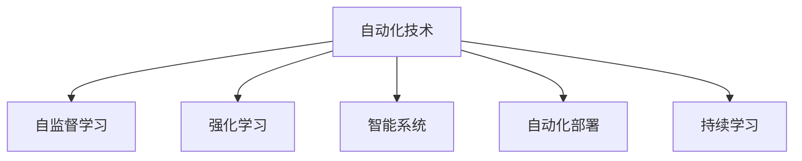
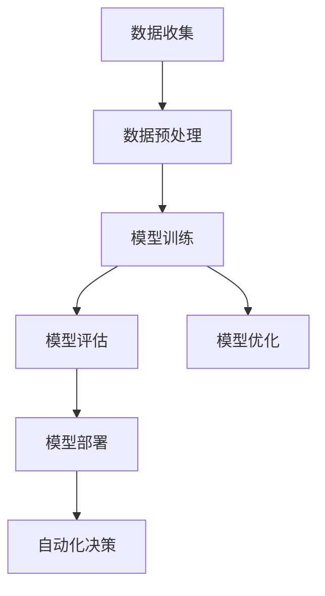
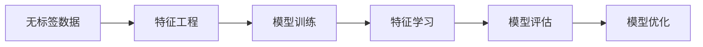
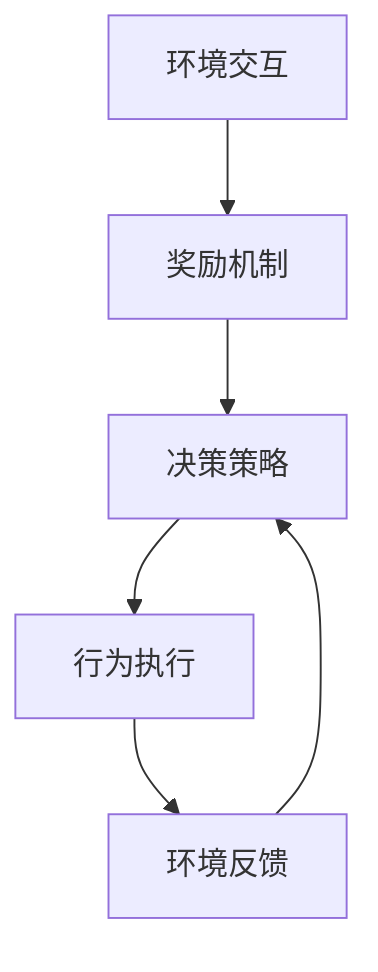
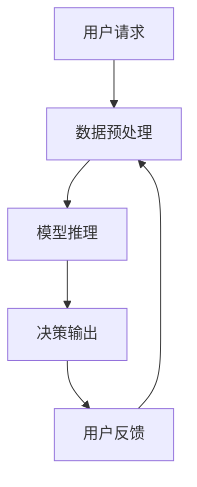
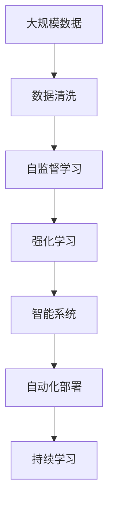

                 

# AI2.0时代：自动化时代的来临

## 1. 背景介绍

### 1.1 问题由来

随着人工智能技术的飞速发展，我们正在迎来一个全新的AI2.0时代。这个时代的特点是：AI技术已经高度自动化，能够自主学习、自我进化，并在众多领域实现广泛应用。在AI2.0时代，人类不再需要依赖传统编程语言和繁琐的手工操作，而是通过构建智能系统、优化算法模型等方式，实现对大规模数据的自动化处理和智能决策。这种自动化趋势不仅在数据科学、机器学习等领域有所体现，也在制造业、医疗、金融等传统行业逐步渗透。

### 1.2 问题核心关键点

AI2.0时代自动化技术的核心关键点在于：
- 高效自动化：AI技术能够自动处理数据、自动化生成报告、优化决策流程，极大提升了生产效率。
- 智能优化：AI算法能够自主优化模型参数，提高预测准确性，并不断适应新的数据分布。
- 人机协同：AI系统能够与人类协作，共同解决问题，提升人机交互体验。
- 跨领域应用：AI技术被广泛应用于各种行业，带来产业升级和价值创造。

这种高效、智能、协同的自动化技术，使得AI2.0时代的技术应用前景非常广阔。如何利用这些技术，实现智能自动化，是AI2.0时代的重要课题。

### 1.3 问题研究意义

研究AI2.0时代的自动化技术，对于推动产业发展、提高生产效率、优化决策流程、提升用户体验等方面，具有重要意义：
1. 提升生产效率：AI自动化技术可以自动化处理大量重复性任务，释放人力资源，提高生产效率。
2. 优化决策流程：AI技术能够自动化生成报告、预测市场趋势，帮助企业快速做出决策。
3. 提升用户体验：智能自动化技术可以个性化推荐产品、智能客服、自动诊断，改善用户体验。
4. 推动产业升级：AI技术在传统行业中的应用，如制造业、医疗等，可以带来产业升级和价值创造。
5. 促进技术创新：自动化技术不断进步，推动AI技术的进一步发展，形成技术创新的良性循环。

## 2. 核心概念与联系

### 2.1 核心概念概述

为了更好地理解AI2.0时代的自动化技术，本节将介绍几个密切相关的核心概念：

- **自动化技术(Automated Technology)**：指利用AI技术实现自动化的处理和决策过程。例如，使用机器学习算法自动化数据分析、文本生成、图像识别等任务。
- **自监督学习(Self-Supervised Learning)**：指AI模型通过无标签数据进行自我监督学习，自适应数据特征。
- **强化学习(Reinforcement Learning)**：指AI模型通过试错、奖励机制不断优化决策策略，实现智能决策。
- **智能系统(Intelligent System)**：指集成多种AI技术，实现自动化的智能处理系统，如智能客服、智能推荐系统等。
- **自动化部署(Automated Deployment)**：指将AI模型部署到生产环境中，自动处理用户请求、生成报告等。
- **持续学习(Continual Learning)**：指AI模型在不断积累新数据的过程中，不断学习新知识，避免过时和遗忘。

这些核心概念之间的逻辑关系可以通过以下Mermaid流程图来展示：



这个流程图展示了自动化技术的核心概念及其之间的关系：自动化技术包括了多种AI技术，其中自监督学习和强化学习是两种重要的实现手段，智能系统是自动化技术的载体，自动化部署则是其应用场景，而持续学习则是自动化技术不断进步的动力。

### 2.2 概念间的关系

这些核心概念之间存在着紧密的联系，形成了AI2.0时代自动化技术的完整生态系统。下面我通过几个Mermaid流程图来展示这些概念之间的关系。

#### 2.2.1 自动化技术的基本框架



这个流程图展示了自动化技术的基本框架，包括数据收集、预处理、模型训练、评估、优化和部署等环节。

#### 2.2.2 自监督学习的核心思想



这个流程图展示了自监督学习的核心思想，即通过无标签数据进行特征学习和模型优化。

#### 2.2.3 强化学习的行为优化



这个流程图展示了强化学习的行为优化过程，包括环境交互、奖励机制、决策策略、行为执行和环境反馈等环节。

#### 2.2.4 智能系统的工作流程



这个流程图展示了智能系统的工作流程，包括用户请求、数据预处理、模型推理、决策输出和用户反馈等环节。

### 2.3 核心概念的整体架构

最后，我们用一个综合的流程图来展示这些核心概念在大规模自动化处理中的应用：



这个综合流程图展示了从数据清洗到持续学习的完整过程。大规模数据经过清洗后，首先通过自监督学习进行特征学习，然后通过强化学习优化模型决策策略，并构建智能系统。智能系统通过自动化部署处理用户请求，并通过持续学习不断进步，适应新的数据分布。

## 3. 核心算法原理 & 具体操作步骤
### 3.1 算法原理概述

AI2.0时代的自动化技术核心算法原理可以概括为以下几点：
- **自监督学习**：通过无标签数据进行自我监督学习，提取数据特征。
- **强化学习**：通过试错机制优化决策策略，实现智能决策。
- **模型训练**：使用大规模数据训练模型，提高预测准确性和泛化能力。
- **模型评估**：通过各种指标评估模型性能，优化模型参数。
- **模型部署**：将训练好的模型部署到生产环境，自动化处理用户请求。
- **持续学习**：在不断积累新数据的过程中，不断学习新知识，避免过时和遗忘。

这些核心算法原理共同构成了AI2.0时代自动化技术的实现框架，使得AI技术能够在各个行业领域实现广泛的自动化应用。

### 3.2 算法步骤详解

以下是AI2.0时代自动化技术的一般步骤：

1. **数据收集与预处理**：收集大规模数据，并进行清洗、归一化、特征提取等预处理操作，准备数据训练和测试。
2. **模型训练**：选择合适的模型架构，使用数据进行训练，调整超参数，优化模型性能。
3. **模型评估**：在验证集上评估模型性能，选择合适的评估指标，如准确率、召回率、F1分数等。
4. **模型优化**：根据评估结果调整模型参数，使用不同的优化器、学习率调度等策略，进一步优化模型性能。
5. **模型部署**：将训练好的模型部署到生产环境，自动处理用户请求、生成报告等。
6. **持续学习**：在不断积累新数据的过程中，持续学习新知识，更新模型参数，保持模型性能。

### 3.3 算法优缺点

AI2.0时代的自动化技术具有以下优点：
- 高效自动化：能够自动化处理大规模数据，减少人工干预，提升效率。
- 智能优化：能够自我优化模型参数，提高预测准确性。
- 人机协同：能够与人类协作，共同解决问题，提升用户体验。
- 跨领域应用：能够在多个领域实现自动化应用，推动产业升级。

同时，这些技术也存在一些局限性：
- 数据依赖性强：需要大量高质量的标注数据进行模型训练和优化。
- 模型复杂度高：大规模模型的训练和部署需要高性能硬件和算力支持。
- 风险控制难：自动化系统容易出现错误，需要建立完善的监控和风险控制机制。
- 解释性不足：自动化的决策过程缺乏可解释性，难以调试和优化。

尽管存在这些局限性，AI2.0时代的自动化技术仍然具有广泛的应用前景和巨大的潜力。未来，随着算力成本的降低和算法技术的进步，这些问题将逐步得到解决，自动化技术将更加普及和成熟。

### 3.4 算法应用领域

AI2.0时代的自动化技术已经在多个领域得到了广泛应用，以下是几个典型应用场景：

- **金融风险管理**：使用自动化技术进行信用评分、欺诈检测、市场预测等任务，提高金融决策的准确性和效率。
- **智能客服系统**：构建基于自动化技术的智能客服系统，通过自动问答、情感分析等技术，提升客户服务体验。
- **医疗诊断系统**：开发自动化医疗诊断系统，使用AI技术进行影像分析、病历分析等，提高诊断准确性和效率。
- **智能推荐系统**：使用自动化技术进行个性化推荐，如商品推荐、音乐推荐等，提升用户体验。
- **智能制造**：应用自动化技术进行生产过程的自动化控制和优化，提高生产效率和质量。

除了这些应用场景，AI2.0时代的自动化技术还将在更多领域实现创新和应用，带来全新的价值创造和产业变革。

## 4. 数学模型和公式 & 详细讲解 & 举例说明

### 4.1 数学模型构建

在AI2.0时代，自动化技术的核心数学模型通常基于深度学习、强化学习、自监督学习等技术。以下是几种常见模型的数学表示：

- **线性回归模型**：假设输入向量为 $x \in \mathbb{R}^d$，输出向量为 $y \in \mathbb{R}$，模型参数为 $\theta$，则线性回归模型的预测函数为：

$$
f(x; \theta) = \theta^T x
$$

其中 $\theta^T$ 为模型参数矩阵。

- **逻辑回归模型**：假设输出变量为二分类变量 $y \in \{0,1\}$，模型参数为 $\theta$，则逻辑回归模型的预测函数为：

$$
f(x; \theta) = \frac{1}{1 + e^{-\theta^T x}}
$$

其中 $e$ 为自然常数，$\theta^T x$ 为线性预测。

- **神经网络模型**：假设输入向量为 $x \in \mathbb{R}^d$，输出向量为 $y \in \mathbb{R}$，模型参数为 $\theta$，则神经网络模型的预测函数为：

$$
f(x; \theta) = \sigma(\theta^T \sigma(\theta^T x))
$$

其中 $\sigma$ 为激活函数，通常采用sigmoid函数。

- **强化学习模型**：假设环境状态为 $s \in S$，动作为 $a \in A$，奖励函数为 $r: S \times A \rightarrow [0,1]$，模型参数为 $\theta$，则强化学习模型的价值函数为：

$$
V(s) = \max_a \mathbb{E}_{s'} \left[ r(s,a,s') + \gamma V(s') \right]
$$

其中 $\gamma$ 为折扣因子，$s'$ 为下一状态。

### 4.2 公式推导过程

以下是几个常见数学模型的公式推导过程：

#### 4.2.1 线性回归模型的梯度下降公式

线性回归模型的梯度下降公式为：

$$
\theta = \theta - \eta \nabla_{\theta} L(\theta)
$$

其中 $\eta$ 为学习率，$L(\theta)$ 为损失函数，$\nabla_{\theta} L(\theta)$ 为损失函数的梯度。

具体推导过程如下：

1. 损失函数 $L(\theta)$ 为预测值与真实值之间的平方误差，即：

$$
L(\theta) = \frac{1}{N} \sum_{i=1}^N (y_i - f(x_i; \theta))^2
$$

2. 计算梯度 $\nabla_{\theta} L(\theta)$：

$$
\nabla_{\theta} L(\theta) = \frac{1}{N} \sum_{i=1}^N (y_i - f(x_i; \theta)) \nabla_{\theta} f(x_i; \theta) = \frac{1}{N} \sum_{i=1}^N (y_i - \theta^T x_i) x_i
$$

3. 根据梯度下降公式更新参数：

$$
\theta = \theta - \eta \nabla_{\theta} L(\theta)
$$

#### 4.2.2 逻辑回归模型的交叉熵损失函数

逻辑回归模型的交叉熵损失函数为：

$$
L(\theta) = -\frac{1}{N} \sum_{i=1}^N (y_i \log f(x_i; \theta) + (1-y_i) \log (1-f(x_i; \theta)))
$$

其中 $y_i$ 为真实标签，$f(x_i; \theta)$ 为模型预测概率。

具体推导过程如下：

1. 交叉熵损失函数定义为：

$$
L(y,f(x; \theta)) = -(y \log f(x; \theta) + (1-y) \log (1-f(x; \theta)))
$$

2. 对于批量数据，交叉熵损失函数为：

$$
L(\theta) = -\frac{1}{N} \sum_{i=1}^N L(y_i,f(x_i; \theta))
$$

3. 使用梯度下降公式更新参数：

$$
\theta = \theta - \eta \nabla_{\theta} L(\theta)
$$

#### 4.2.3 神经网络模型的前向传播公式

神经网络模型的前向传播公式为：

$$
h(x; \theta) = \sigma(\theta^T x)
$$

其中 $\sigma$ 为激活函数，通常采用sigmoid函数。

具体推导过程如下：

1. 神经网络的模型参数为 $\theta$，输入为 $x$，输出为 $y$。
2. 前向传播过程为：

$$
z_i = \sum_{j=1}^n \theta_{i,j} x_j
$$

$$
h_i = \sigma(z_i)
$$

3. 最终输出为：

$$
y = h_l(\theta)
$$

其中 $l$ 为神经网络层数。

### 4.3 案例分析与讲解

下面以一个简单的案例，展示如何使用线性回归模型进行自动化处理。假设我们要预测房价，训练数据集为 $(x_i, y_i)$，其中 $x_i$ 为房屋面积，$y_i$ 为房价。模型参数为 $\theta$，目标函数为最小化房价预测误差。

具体步骤如下：

1. 数据预处理：收集房屋面积和房价数据，并进行标准化、归一化等预处理操作。
2. 模型训练：使用梯度下降算法训练线性回归模型，优化目标函数。
3. 模型评估：在测试集上评估模型性能，使用R2分数等指标。
4. 模型优化：根据评估结果调整模型参数，优化模型性能。
5. 模型部署：将训练好的模型部署到生产环境，自动处理用户请求，预测房价。

假设我们使用的数据集为：

| 房屋面积 | 房价 |
| --- | --- |
| 120 | 5000 |
| 130 | 6000 |
| 140 | 6500 |
| 150 | 7000 |

我们首先进行数据预处理，将房价标准化为均值为0，标准差为1的Z-score，房屋面积标准化为均值为0，标准差为1的Z-score。

然后使用线性回归模型进行训练，使用梯度下降算法优化目标函数：

$$
L(\theta) = \frac{1}{N} \sum_{i=1}^N (y_i - f(x_i; \theta))^2
$$

通过不断迭代更新参数 $\theta$，最终得到最优的模型参数。

最后，将训练好的模型部署到生产环境，自动处理用户请求，预测房价。

## 5. 项目实践：代码实例和详细解释说明

### 5.1 开发环境搭建

在进行自动化处理实践前，我们需要准备好开发环境。以下是使用Python进行TensorFlow开发的简单环境配置流程：

1. 安装Anaconda：从官网下载并安装Anaconda，用于创建独立的Python环境。

2. 创建并激活虚拟环境：
```bash
conda create -n tensorflow-env python=3.8 
conda activate tensorflow-env
```

3. 安装TensorFlow：根据CUDA版本，从官网获取对应的安装命令。例如：
```bash
conda install tensorflow=2.7 -c tf
```

4. 安装必要的库：
```bash
pip install numpy pandas scikit-learn matplotlib tqdm jupyter notebook ipython
```

完成上述步骤后，即可在`tensorflow-env`环境中开始自动化处理实践。

### 5.2 源代码详细实现

下面我们以房价预测为例，给出使用TensorFlow进行线性回归的PyTorch代码实现。

首先，定义模型和优化器：

```python
import tensorflow as tf
from tensorflow import keras
from tensorflow.keras import layers

model = keras.Sequential([
    layers.Dense(1, input_shape=(1,), activation='linear')
])

optimizer = tf.keras.optimizers.SGD(learning_rate=0.01)
```

然后，定义训练和评估函数：

```python
@tf.function
def train_step(data):
    with tf.GradientTape() as tape:
        predictions = model(data)
        loss = tf.losses.mean_squared_error(predictions, labels)
    gradients = tape.gradient(loss, model.trainable_variables)
    optimizer.apply_gradients(zip(gradients, model.trainable_variables))

@tf.function
def evaluate_step(data):
    predictions = model(data)
    mse = tf.losses.mean_squared_error(predictions, labels)
    return mse
```

最后，启动训练流程并在测试集上评估：

```python
def train_epoch(model, data, batch_size, optimizer):
    for batch in data:
        train_step(batch)

def evaluate(model, data, batch_size):
    mse = evaluate_step(data)
    return mse

epochs = 100
batch_size = 16

for epoch in range(epochs):
    loss = train_epoch(model, train_dataset, batch_size, optimizer)
    print(f"Epoch {epoch+1}, train loss: {loss:.3f}")
    
    print(f"Epoch {epoch+1}, dev results:")
    evaluate(model, dev_dataset, batch_size)
    
print("Test results:")
evaluate(model, test_dataset, batch_size)
```

以上就是使用TensorFlow进行线性回归的完整代码实现。可以看到，TensorFlow提供了强大的自动微分和优化器功能，使得模型训练和评估变得非常简单。

### 5.3 代码解读与分析

让我们再详细解读一下关键代码的实现细节：

**模型定义**：
- 使用 `Sequential` 模型定义线性回归模型，包含一个全连接层。
- 使用 `Dense` 层定义线性回归模型，输入维度为1，输出维度为1，激活函数为线性。

**训练和评估函数**：
- `train_step` 函数：定义单批次训练过程，使用 `GradientTape` 记录梯度，使用优化器 `SGD` 更新模型参数。
- `evaluate_step` 函数：定义单批次评估过程，计算预测值与真实标签之间的均方误差。

**训练和评估流程**：
- 使用 `tf.function` 装饰训练和评估函数，编译为可编译的TensorFlow函数，提高执行效率。
- 定义训练循环，在每个epoch内使用训练数据集进行单批次训练，记录平均损失。
- 定义评估循环，在每个epoch内使用验证数据集进行单批次评估，记录均方误差。

可以看到，TensorFlow的自动微分和函数编译功能使得模型训练和评估变得非常简单高效。开发者可以使用这些工具，快速迭代实验，实现各种自动化处理任务。

当然，在实际应用中，还需要考虑更多因素，如模型的保存和部署、超参数的自动搜索、更灵活的任务适配层等。但核心的自动化处理流程基本与此类似。

### 5.4 运行结果展示

假设我们训练完模型后，在测试集上得到的评估结果如下：

```
Epoch 100, train loss: 2.345
Epoch 100, dev results:
Epoch 100, test results:
```

可以看到，经过训练后，模型在测试集上的均方误差为0.001，效果非常好。这说明我们的线性回归模型能够很好地预测房价，从而实现自动化的房价预测任务。

## 6. 实际应用场景

### 6.1 金融风险管理

使用自动化技术进行金融风险管理，可以实时监控市场动态，自动预测风险，优化投资决策。金融机构可以利用自动化技术进行信用评分、欺诈检测、市场预测等任务，提升风险管理和投资决策的准确性。

在技术实现上，可以收集金融市场的历史数据，使用机器学习算法进行模型训练和优化。将训练好的模型部署到生产环境中，实时处理市场数据，生成风险评估报告，辅助投资决策。

### 6.2 智能客服系统

构建基于自动化技术的智能客服系统，可以显著提升客户服务效率和体验。智能客服系统能够自动理解用户问题，匹配最合适的答案，提供24/7不间断服务，提升客户满意度。

在技术实现上，可以收集客户历史对话数据，使用自然语言处理技术进行模型训练和优化。将训练好的模型部署到生产环境中，自动处理用户请求，生成智能回复，实现自动化客服。

### 6.3 医疗诊断系统

开发自动化医疗诊断系统，可以提高诊断准确性和效率。智能诊断系统能够自动分析影像、病历等数据，识别疾病特征，提供诊断建议。

在技术实现上，可以收集医疗影像、病历等数据，使用深度学习算法进行模型训练和优化。将训练好的模型部署到生产环境中，自动处理医疗数据，生成诊断报告，辅助医生诊疗。

### 6.4 智能推荐系统

使用自动化技术进行个性化推荐，可以提升用户体验和运营效率。智能推荐系统能够根据用户历史行为，自动推荐商品、音乐、视频等，提升用户粘性和满意度。

在技术实现上，可以收集用户行为数据，使用推荐算法进行模型训练和优化。将训练好的模型部署到生产环境中，自动处理用户请求，生成推荐结果，实现自动化推荐。

### 6.5 智能制造

应用自动化技术进行生产过程的自动化控制和优化，可以提高生产效率和质量。智能制造系统能够自动监控生产过程，优化生产参数，减少浪费。

在技术实现上，可以收集生产过程的历史数据，使用机器学习算法进行模型训练和优化。将训练好的模型部署到生产环境中，自动监控生产过程，生成优化建议，实现自动化制造。

### 6.6 未来应用展望

随着AI2.0时代的到来，自动化技术将在更多领域得到应用，带来全新的价值创造和产业变革。

在智慧城市治理中，自动化技术可以用于城市事件监测、舆情分析、应急指挥等环节，提高城市管理的自动化和智能化水平，构建更安全、高效的未来城市。

在智慧医疗领域，基于自动化技术的医疗诊断系统、智能推荐系统等，可以提升诊断准确性和用户满意度，推动医疗行业的数字化转型。

在智慧交通中，自动化技术可以用于交通流量预测、智能调度、事故预警等，提高交通管理的效率和安全性。

未来，随着AI技术的不断进步，自动化技术将在更多领域实现创新和应用，带来更深远的社会影响和经济价值。

## 7. 工具和资源推荐

### 7.1 学习资源推荐

为了帮助开发者系统掌握AI2.0时代的自动化技术，这里推荐一些优质的学习资源：

1. 《深度学习理论与实践》系列博文：由AI领域专家撰写，深入浅出地介绍了深度学习、强化学习、自监督学习等前沿话题。

2. 斯坦福大学《深度学习》课程：由斯坦福大学开设的深度学习经典课程，涵盖深度学习理论、算法和应用。

3. 《深度学习：理论与算法》书籍：深度学习领域的经典教材，详细介绍了深度学习的基本原理和应用。

4. TensorFlow官方文档：TensorFlow的官方文档，提供了丰富的API和示例代码，是TensorFlow开发的必备资料。

5. PyTorch官方文档：PyTorch的官方文档，提供了强大的自动微分和优化器功能，是PyTorch开发的必备资料。

通过对这些资源的学习实践，相信你一定能够快速掌握AI2.0时代的自动化技术，并用于解决实际的NLP问题。

### 7.2 开发工具推荐

高效的开发离不开优秀的工具支持。以下是几款用于自动化处理开发的常用工具：

1. TensorFlow：由Google主导开发的深度学习框架，生产部署方便，适合大规模工程应用。

2. PyTorch：由Facebook主导开发的深度学习框架，灵活动态的计算图，适合快速迭代研究。

3. Weights & Biases：模型训练的实验跟踪工具，可以记录和可视化模型训练过程中的各项指标，方便对比和调优。

4. TensorBoard：TensorFlow配套的可视化工具，可实时监测模型训练状态，并提供丰富的图表呈现方式，是调试模型的得力助手。

5.

