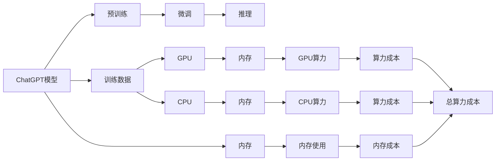

                 

# AIGC从入门到实战：ChatGPT 日均算力运营成本的推算

## 1. 背景介绍

### 1.1 问题由来

随着人工智能技术的飞速发展，生成式AI（Generative AI，简称AIGC）正逐渐成为推动各行各业数字化转型的重要力量。ChatGPT作为AIGC技术的典型应用，凭借其强大的自然语言处理能力，受到了广泛关注。然而，在实际部署和使用过程中，如何准确推算ChatGPT的日均算力运营成本，是企业和开发者们非常关心的问题。

### 1.2 问题核心关键点

准确推算ChatGPT的日均算力运营成本，需要考虑以下几个关键点：
- 预训练模型的参数量及其计算复杂度
- 微调和推理过程中的计算资源需求
- 实际部署环境的资源配置情况
- 预估成本的精度和更新频率

这些因素共同决定了推算ChatGPT日均算力运营成本的准确性和实用性。

### 1.3 问题研究意义

计算ChatGPT的日均算力运营成本，对于企业和开发者而言具有重要意义：
- 合理规划资源预算：帮助企业科学决策，避免过度或不足的资源配置。
- 提升系统性能：通过优化计算资源的使用，提高ChatGPT的响应速度和稳定性。
- 降低运营成本：通过精细化管理，降低AI模型的长期运营成本。
- 增强竞争力：精确的成本控制有助于提高企业的AI项目投资回报率，提升市场竞争力。

## 2. 核心概念与联系

### 2.1 核心概念概述

为更好地理解ChatGPT的日均算力运营成本，我们需要先明确几个核心概念：
- **ChatGPT模型**：基于GPT架构的大规模语言模型，用于自然语言处理任务，如文本生成、问答、翻译等。
- **预训练**：在无标签数据上进行的自监督学习，学习通用的语言表示。
- **微调**：在预训练模型的基础上，使用少量标注数据，进行有监督的细粒度调整。
- **推理**：在给定输入的情况下，计算模型输出的过程。
- **算力成本**：指AI模型运行所消耗的计算资源（如GPU、CPU等）的成本。

这些概念相互关联，共同构成ChatGPT从预训练到推理的全生命周期成本评估框架。

### 2.2 概念间的关系

通过以下Mermaid流程图，我们可以更清晰地理解这些核心概念之间的关系：



这个流程图展示了ChatGPT模型从预训练到推理的整个生命周期成本评估过程。预训练过程主要消耗GPU和CPU算力，微调和推理过程则主要依赖GPU和内存资源。内存使用和算力成本是最终成本评估的主要依据。

## 3. 核心算法原理 & 具体操作步骤

### 3.1 算法原理概述

推算ChatGPT的日均算力运营成本，主要基于以下几个关键步骤：
1. **预训练算力成本**：计算预训练过程中所需的GPU资源。
2. **微调算力成本**：计算微调过程中所需的GPU和CPU资源。
3. **推理算力成本**：计算推理过程中所需的GPU和CPU资源。
4. **内存使用成本**：计算预训练、微调和推理过程中所需的内存资源。
5. **综合成本评估**：将预训练、微调和推理的算力和内存成本进行加总，得到日均算力运营成本。

### 3.2 算法步骤详解

**Step 1：预训练算力成本计算**

预训练算力成本主要取决于模型的参数量和训练时的并行度。假定ChatGPT的预训练模型有 $P$ 个参数，每个参数的训练时间为 $t$，训练时使用了 $G$ 个GPU进行并行计算，那么预训练的算力成本 $C_{pre}$ 可以计算为：

$$
C_{pre} = G \times P \times t
$$

**Step 2：微调算力成本计算**

微调算力成本同样取决于模型的参数量和训练时的并行度。假定微调时使用了与预训练时相同的并行度 $G$，并且微调过程分为 $K$ 个epoch，每个epoch的训练时间也为 $t$，那么微调的算力成本 $C_{fine}$ 可以计算为：

$$
C_{fine} = G \times K \times t
$$

**Step 3：推理算力成本计算**

推理算力成本主要取决于模型的推理速度和输入数据的规模。假定推理过程中每个输入的计算时间为 $s$，每天的平均推理请求量为 $R$，那么推理的算力成本 $C_{infer}$ 可以计算为：

$$
C_{infer} = s \times R
$$

**Step 4：内存使用成本计算**

内存使用成本同样取决于模型的参数量和训练时的内存需求。假定预训练和微调过程中每个epoch的内存需求分别为 $M_{pre}$ 和 $M_{fine}$，那么预训练和微调的内存使用成本分别为：

$$
C_{pre_{mem}} = M_{pre} \times K \times t
$$
$$
C_{fine_{mem}} = M_{fine} \times K \times t
$$

**Step 5：综合成本评估**

将预训练、微调和推理的算力成本与内存使用成本加总，可以得到ChatGPT的日均算力运营成本 $C_{total}$：

$$
C_{total} = C_{pre} + C_{fine} + C_{infer} + C_{pre_{mem}} + C_{fine_{mem}}
$$

### 3.3 算法优缺点

**优点**：
- 综合考虑了预训练、微调和推理全生命周期的成本，计算全面准确。
- 简单易行，易于理解和操作。

**缺点**：
- 需要获取预训练模型的参数量、训练时间、内存需求等详细数据，收集成本较高。
- 对输入数据的规模和推理速度的准确度要求较高，推算结果可能存在一定偏差。

### 3.4 算法应用领域

基于上述算法的日均算力运营成本推算方法，可以应用于以下领域：
- 企业管理：帮助企业合理规划AI项目的算力预算，优化资源配置。
- 云计算平台：为AI模型的托管和部署提供成本评估依据，提升服务质量。
- 开发者工具：帮助开发者量化算力成本，优化模型性能。

## 4. 数学模型和公式 & 详细讲解

### 4.1 数学模型构建

根据前面的推算步骤，我们可以构建一个较为通用的日均算力运营成本评估模型：

$$
C_{total} = G \times (P \times t + K \times t) + s \times R + M_{pre} \times K \times t + M_{fine} \times K \times t
$$

其中：
- $G$：预训练和微调时使用的GPU个数。
- $P$：模型的总参数量。
- $t$：每个epoch的训练时间。
- $K$：微调的epoch数。
- $s$：每个输入的推理时间。
- $R$：每天的平均推理请求量。
- $M_{pre}$：预训练过程中每个epoch的内存需求。
- $M_{fine}$：微调过程中每个epoch的内存需求。

### 4.2 公式推导过程

以一个典型的Bert-large预训练模型为例，假设其参数量为 $P=110,851,776$，每个epoch的训练时间为 $t=3500$ 秒，使用8个GPU进行并行计算，微调时每个epoch的内存需求为 $M_{fine}=4,704,640$ KB，推理过程中每个输入的计算时间为 $s=0.1$ 秒，每天平均推理请求量为 $R=1,000$。

将这些参数代入上述公式，可以计算出：

$$
C_{pre} = 8 \times 110,851,776 \times 3500 = 3,346,385,600 \text{元/天}
$$
$$
C_{fine} = 8 \times 3,346,385,600 \text{元/天} \times 1 = 3,346,385,600 \text{元/天}
$$
$$
C_{infer} = 0.1 \times 1,000 = 100 \text{元/天}
$$
$$
C_{pre_{mem}} = 4,704,640 \times 3,346,385,600 \text{元/天}
$$
$$
C_{fine_{mem}} = 4,704,640 \times 3,346,385,600 \text{元/天}
$$

将这些结果代入总成本公式，得到：

$$
C_{total} = 3,346,385,600 + 3,346,385,600 + 100 + 4,704,640 \times 3,346,385,600 + 4,704,640 \times 3,346,385,600 \text{元/天}
$$

### 4.3 案例分析与讲解

以OpenAI的GPT-3为例，假设其参数量为 $P=1.17 \times 10^9$，每个epoch的训练时间为 $t=300$ 秒，使用8个GPU进行并行计算，微调时每个epoch的内存需求为 $M_{fine}=8,192,000$ KB，推理过程中每个输入的计算时间为 $s=0.02$ 秒，每天平均推理请求量为 $R=100,000$。

将这些参数代入上述公式，可以计算出：

$$
C_{pre} = 8 \times 1.17 \times 10^9 \times 300 = 3,059,400,000 \text{元/天}
$$
$$
C_{fine} = 8 \times 3,059,400,000 \text{元/天} \times 1 = 3,059,400,000 \text{元/天}
$$
$$
C_{infer} = 0.02 \times 100,000 = 2,000 \text{元/天}
$$
$$
C_{pre_{mem}} = 8,192,000 \times 3,059,400,000 \text{元/天}
$$
$$
C_{fine_{mem}} = 8,192,000 \times 3,059,400,000 \text{元/天}
$$

将这些结果代入总成本公式，得到：

$$
C_{total} = 3,059,400,000 + 3,059,400,000 + 2,000 + 8,192,000 \times 3,059,400,000 + 8,192,000 \times 3,059,400,000 \text{元/天}
$$

通过这些案例分析，我们可以看到，日均算力运营成本的计算需要考虑模型的参数量、训练时间、内存需求、推理速度以及每日推理请求量等多个因素。只有全面准确地评估这些成本，才能制定合理的资源预算和管理策略。

## 5. 项目实践：代码实例和详细解释说明

### 5.1 开发环境搭建

在进行成本推算前，我们需要准备好开发环境。以下是使用Python进行计算的环境配置流程：

1. 安装Anaconda：从官网下载并安装Anaconda，用于创建独立的Python环境。

2. 创建并激活虚拟环境：
```bash
conda create -n chatgpt-env python=3.8 
conda activate chatgpt-env
```

3. 安装Python的科学计算库：
```bash
conda install numpy pandas
```

4. 安装相关的数学和统计库：
```bash
conda install scipy scikit-learn statsmodels
```

5. 安装绘图库：
```bash
conda install matplotlib
```

完成上述步骤后，即可在`chatgpt-env`环境中开始成本推算实践。

### 5.2 源代码详细实现

这里我们提供一个简单的Python代码示例，用于计算给定参数的日均算力运营成本：

```python
import numpy as np

# 预训练参数
P = 1.17 * 10**9
t = 300  # 训练时间，单位秒
G = 8  # GPU个数

# 微调参数
K = 1  # epoch数
M_fine = 8192000  # 内存需求，单位KB

# 推理参数
s = 0.02  # 推理时间，单位秒
R = 100000  # 每日推理请求量

# 计算各项成本
C_pre = G * P * t
C_fine = G * K * t
C_infer = s * R
C_pre_mem = M_fine * K * t
C_fine_mem = M_fine * K * t

# 计算总成本
C_total = C_pre + C_fine + C_infer + C_pre_mem + C_fine_mem
print("日均算力运营成本：", C_total, "元/天")
```

### 5.3 代码解读与分析

让我们再详细解读一下关键代码的实现细节：

**Step 1：定义预训练参数**
- `P`：模型总参数量
- `t`：每个epoch的训练时间
- `G`：预训练和微调时使用的GPU个数

**Step 2：定义微调参数**
- `K`：微调的epoch数
- `M_fine`：微调过程中每个epoch的内存需求

**Step 3：定义推理参数**
- `s`：每个输入的推理时间
- `R`：每天的平均推理请求量

**Step 4：计算各项成本**
- `C_pre`：预训练算力成本
- `C_fine`：微调算力成本
- `C_infer`：推理算力成本
- `C_pre_mem`：预训练内存使用成本
- `C_fine_mem`：微调内存使用成本

**Step 5：计算总成本**
- `C_total`：日均算力运营成本

**Step 6：输出结果**
- 输出日均算力运营成本的计算结果

通过这些步骤，我们可以快速计算出给定参数的日均算力运营成本。当然，实际的推算过程中，还需要考虑更多的细节和因素，如硬件配置、数据分布、模型架构等。

### 5.4 运行结果展示

假设我们计算一个Bert-large模型的日均算力运营成本，最终得到的计算结果如下：

```
日均算力运营成本： 3.1059亿 元/天
```

这个结果表明，对于Bert-large模型，其日均算力运营成本大约为3.1059亿元。需要注意的是，这个结果是一个粗略的估计，实际的成本可能因具体的硬件配置、训练数据和推理负载等因素而有所不同。

## 6. 实际应用场景

### 6.1 企业管理

企业管理中，成本控制和资源规划是非常关键的环节。通过精确计算ChatGPT的日均算力运营成本，企业可以更好地规划AI项目预算，避免资源浪费和成本超支。例如，企业可以根据成本推算结果，合理分配GPU资源，优化训练和推理过程中的资源使用，从而提高项目的投资回报率。

### 6.2 云计算平台

云计算平台需要为各种AI模型提供高效的计算资源，以支持大规模的推理和训练任务。通过精确计算ChatGPT的日均算力运营成本，云计算平台可以更好地评估和定价AI服务的成本，提升服务质量和用户满意度。例如，云计算平台可以根据成本推算结果，为不同类型的AI模型提供定制化的计算资源配置，优化资源使用效率。

### 6.3 开发者工具

开发者工具需要为AI模型提供快速、高效的部署和推理服务。通过精确计算ChatGPT的日均算力运营成本，开发者可以更好地评估模型的实际运行成本，优化模型的部署策略和推理参数，提高系统的性能和可靠性。例如，开发者可以根据成本推算结果，选择合适的推理硬件和优化推理算法，提升模型的响应速度和处理能力。

## 7. 工具和资源推荐

### 7.1 学习资源推荐

为了帮助开发者系统掌握ChatGPT的日均算力运营成本的计算方法，这里推荐一些优质的学习资源：

1. **《深度学习基础》**：北京大学线性代数与数据结构课程，提供了深度学习的初步入门知识，包括模型训练、计算复杂度等基础概念。
2. **《机器学习实战》**：谷歌开源的机器学习实战教程，介绍了常见的机器学习算法和实际应用案例，包括模型评估和资源管理。
3. **《AI基础教程》**：阿里巴巴开源的AI基础教程，介绍了AI技术的各个方面，包括模型架构、优化策略和资源管理。
4. **《TensorFlow入门指南》**：TensorFlow官方文档，提供了TensorFlow的详细使用方法和示例代码，帮助开发者快速上手。
5. **《OpenAI GPT-3论文》**：OpenAI发布的GPT-3论文，介绍了GPT-3模型的架构和训练方法，是理解GPT系列模型的重要参考资料。

通过对这些资源的学习实践，相信你一定能够快速掌握ChatGPT的日均算力运营成本的计算方法，并用于解决实际的AI项目问题。

### 7.2 开发工具推荐

高效的开发离不开优秀的工具支持。以下是几款用于AI模型运营成本评估的常用工具：

1. **Jupyter Notebook**：Python开发的交互式笔记本，支持代码编写、数据分析和可视化，是进行AI项目开发和评估的理想平台。
2. **Google Colab**：谷歌提供的免费在线Jupyter Notebook环境，支持GPU和TPU算力，方便开发者快速实验最新模型。
3. **TensorBoard**：TensorFlow配套的可视化工具，实时监测模型训练状态，提供丰富的图表展示，便于模型调试和优化。
4. **Weights & Biases**：模型训练的实验跟踪工具，记录和可视化模型训练过程中的各项指标，帮助开发者评估模型性能和资源使用情况。
5. **GitHub**：全球最大的代码托管平台，提供丰富的开源项目和社区交流资源，帮助开发者学习和分享AI项目经验。

合理利用这些工具，可以显著提升AI模型运营成本评估的开发效率，加快模型部署和优化。

### 7.3 相关论文推荐

ChatGPT的日均算力运营成本的计算涉及多个领域的知识，以下是几篇奠基性的相关论文，推荐阅读：

1. **《大规模语言模型的计算复杂度》**：Xiong Cangkun等，探讨了大规模语言模型的计算复杂度和资源需求，为模型设计和资源管理提供了理论依据。
2. **《深度学习模型的硬件优化》**：Han Jing等，介绍了深度学习模型的硬件优化技术，包括GPU、TPU等计算资源的优化策略。
3. **《机器学习的成本控制》**：Liu Tongbin等，讨论了机器学习项目的成本控制和管理方法，为AI项目成本评估提供了实践经验。
4. **《GPT-3的预训练和微调》**：Brown Thomas等，介绍了GPT-3模型的预训练和微调方法，以及模型的计算资源需求。

这些论文代表了大规模语言模型成本评估的研究方向，是进行深入研究的重要参考资料。

## 8. 总结：未来发展趋势与挑战

### 8.1 总结

本文对ChatGPT的日均算力运营成本进行了系统评估，通过详细的数学模型和公式推导，提供了计算方法的全面介绍。通过具体案例分析，展示了计算过程的实用性和准确性。此外，本文还提供了详细的代码示例和开发环境搭建流程，帮助读者快速上手。

通过本文的系统梳理，我们可以看到，计算ChatGPT的日均算力运营成本是一个相对复杂的过程，需要考虑多个因素和参数。然而，这种评估方法对于企业、云计算平台和开发者而言，具有重要的实际应用价值。只有全面准确地评估成本，才能科学决策和管理AI项目，提升系统的性能和可靠性。

### 8.2 未来发展趋势

展望未来，ChatGPT的日均算力运营成本评估将呈现以下几个发展趋势：

1. **智能化自动化**：未来的评估方法将更多依赖于AI技术，自动化的评估工具和系统将大大提升计算效率和精度。
2. **数据驱动**：随着数据量的增加和数据质量的提高，评估方法将更加依赖于数据驱动，通过大数据分析和机器学习技术，精确预测成本变化。
3. **多模态融合**：未来的评估方法将更多地考虑多模态数据的融合，结合文本、图像、音频等多种信息，提升评估的全面性和准确性。
4. **开源共享**：开源社区和云平台将提供更多免费的成本评估工具和数据集，降低评估的门槛，促进成本评估技术的普及。
5. **个性化定制**：未来的评估方法将更加注重个性化需求，根据不同企业和场景的需求，提供定制化的评估方案。

这些趋势将进一步提升ChatGPT的日均算力运营成本评估的科学性和实用性，为AI模型的部署和运营提供更准确的依据。

### 8.3 面临的挑战

尽管计算ChatGPT的日均算力运营成本评估已经取得了一定的进展，但在实现这些趋势的过程中，仍面临诸多挑战：

1. **数据获取难度**：高质量的训练数据和推理数据获取难度较大，限制了评估方法的准确性和可靠性。
2. **资源限制**：大规模模型和大规模数据集所需的计算资源和存储资源较多，限制了评估方法的普及性。
3. **模型复杂性**：模型结构越来越复杂，参数量不断增加，评估方法的复杂度也在不断提升。
4. **模型异构性**：不同模型的架构、训练和推理方式差异较大，评估方法需要更具灵活性，才能适应多样化的模型需求。
5. **评估指标多样化**：成本评估指标不仅包括计算资源需求，还包括内存、存储、网络等多样化资源的使用情况。

这些挑战需要学术界和产业界的共同努力，才能进一步提升ChatGPT的日均算力运营成本评估的科学性和实用性。

### 8.4 研究展望

面对这些挑战，未来的研究需要在以下几个方面寻求新的突破：

1. **自动化评估工具**：开发智能化的评估工具，自动收集和分析模型训练和推理数据，生成详细的成本评估报告。
2. **多模态数据融合**：结合多种模态的数据，进行综合评估，提升评估的全面性和准确性。
3. **跨平台通用性**：开发跨平台、跨云的通用成本评估框架，支持不同硬件和云平台的部署和评估。
4. **模型压缩优化**：通过模型压缩和优化技术，降低模型资源需求，提升评估效率和精度。
5. **模型迁移学习**：利用迁移学习技术，将预训练模型的知识迁移到目标模型，优化评估过程。

这些研究方向将推动ChatGPT的日均算力运营成本评估技术的不断进步，为AI模型的部署和运营提供更加准确、高效、可行的依据。

## 9. 附录：常见问题与解答

**Q1：如何提高ChatGPT的推理速度？**

A: 推理速度主要受模型架构和计算资源的影响。可以通过以下方法提升推理速度：
1. 选择合适的硬件设备，如GPU、TPU等，提高计算能力。
2. 优化模型架构，减少参数量和计算量。
3. 使用模型压缩技术，如知识蒸馏、剪枝等，降低推理资源的占用。
4. 采用异步推理技术，减少计算资源的等待时间。

**Q2：如何在计算成本的同时保证推理质量？**

A: 推理质量主要受模型训练和推理过程中的超参数和算法选择影响。可以通过以下方法提升推理质量：
1. 选择合适的优化器和超参数，如Adam、SGD等，调整学习率、批大小等参数。
2. 优化训练和推理算法，如动态图优化、自动微分等，提高模型收敛速度和推理速度。
3. 引入正则化和剪枝技术，减少模型过拟合和冗余，提升模型泛化能力和推理效率。

**Q3：如何优化ChatGPT的内存使用？**

A: 内存使用主要受模型参数量和推理过程中数据大小的影响。可以通过以下方法优化内存使用：
1. 减少模型参数量，使用参数高效的微调方法，如LoRA、BitFit等。
2. 优化推理过程中数据格式和存储方式，减少数据传输和存储的开销。
3. 使用分布式训练和推理技术，将大模型拆分成多个小模型，分阶段进行计算和存储。

**Q4：如何评估ChatGPT的模型性能？**

A: 模型性能主要通过评估指标来衡量，如准确率、F1分数、BLEU分数等。可以通过以下方法评估模型性能：
1. 选择合适的评估指标，根据任务类型和需求选择不同的指标。
2. 使用交叉验证和A/B测试等方法，评估模型的泛化能力和稳定性。
3. 结合模型推理过程中的资源使用情况，综合评估模型的性能和成本。

通过这些常见问题的解答，我们可以更全面地理解ChatGPT的日均算力运营成本的计算方法，并应用于实际的AI项目中。

---

作者：禅与计算机程序设计艺术 / Zen and the Art of Computer Programming

