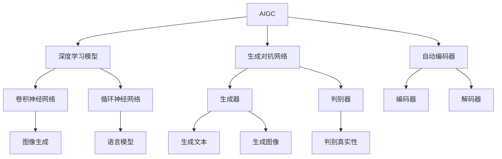
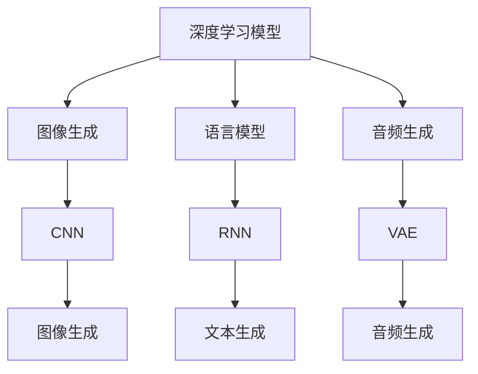
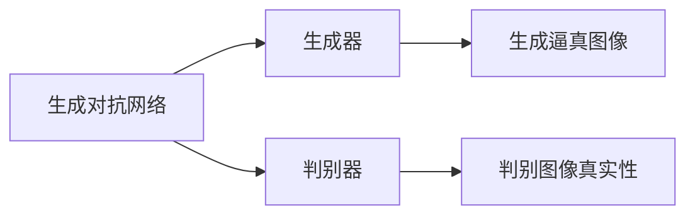
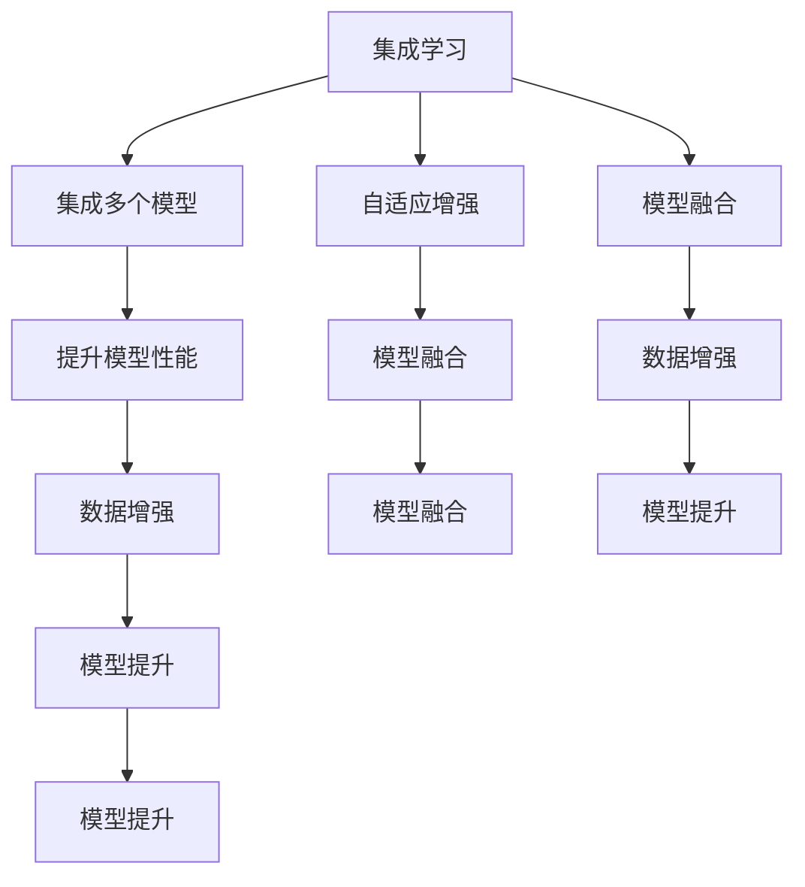
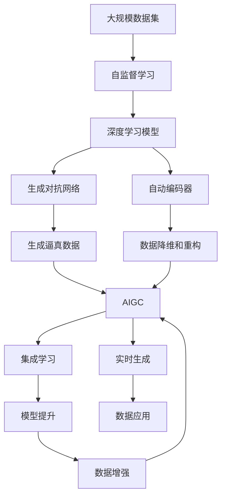

                 

# AIGC从入门到实战：基建：人工智能时代的变迁

> 关键词：AIGC, 人工智能, 语言模型, 计算机视觉, 生成对抗网络, 集成学习, 自动编码器, 时间序列分析

## 1. 背景介绍

### 1.1 问题由来
人工智能（AI）技术在过去几十年间取得了巨大进步，从早期的专家系统到深度学习，再到最新的生成式人工智能（Generative AI, GAI）。GAI技术旨在创建能够生成新的、高质量的数据和内容的人工智能模型，极大地推动了各个行业的智能化转型。其中，生成式AI（Generative AI, GAI），简称AIGC（人工智能生成内容），是近年来最为引人瞩目的方向之一。

AIGC通过深度学习和生成模型，在图像、音频、视频、文本等多种领域，能够自动生成高质量的内容。与传统AI技术相比，AIGC不再局限于数据的监督学习，而是通过自我生成、自我创新，突破了数据驱动的局限性。

### 1.2 问题核心关键点
AIGC的核心在于如何构建能够自动生成新内容的人工智能系统。该系统通过预训练和微调，学习到了通用特征和领域特定特征，能够在给定任务或数据分布下，生成高质量的输出。AIGC的技术基础包括深度学习中的各种模型，如语言模型、生成对抗网络、自动编码器等，这些模型的训练和应用是实现AIGC的关键。

AIGC技术的发展和应用，已经广泛渗透到内容创作、游戏、教育、医疗、金融等多个领域。其应用场景包括但不限于：
- 生成自然语言文本：自动生成新闻、文章、报告等文本内容。
- 生成图像和视频：自动生成艺术作品、广告、动画等视觉内容。
- 生成音频和语音：自动生成音乐、配音、虚拟主播等音频内容。
- 生成代码和设计：自动生成代码、电路设计、建筑设计等。

这些应用场景展示了大规模AIGC技术的强大潜力，同时也带来了新的挑战和机遇。

### 1.3 问题研究意义
研究AIGC技术，对于推动人工智能技术在各行业的落地应用，提升内容生产的效率和质量，具有重要意义：

1. 降低内容生产成本：AIGC技术可以自动生成高质量的内容，减少人力和时间成本，大幅降低内容创作的门槛。
2. 提升内容创作质量：AIGC系统能够突破人类创作者的局限性，生成更丰富、更多样化的内容，提升整体内容创作水平。
3. 加速内容创作流程：AIGC能够快速响应内容需求，加速内容生产和迭代过程。
4. 促进技术创新：AIGC技术推动了深度学习、生成模型、生成对抗网络等前沿技术的发展，催生了更多的创新应用。
5. 赋能产业升级：AIGC技术为各行业带来了新的应用可能，促进了传统行业数字化转型和智能化升级。

## 2. 核心概念与联系

### 2.1 核心概念概述

为更好地理解AIGC技术，本节将介绍几个密切相关的核心概念：

- **生成式人工智能（AIGC）**：利用深度学习和生成模型，自动生成新的、高质量的数据和内容的人工智能技术。

- **深度学习模型**：如卷积神经网络（CNN）、循环神经网络（RNN）、变分自编码器（VAE）、生成对抗网络（GAN）等，这些模型构成了AIGC的基础。

- **生成对抗网络（GAN）**：由两个神经网络组成，一个生成网络（生成器）和一个判别网络（判别器），通过对抗训练的方式生成逼真的数据。

- **自动编码器（Autoencoder）**：一种无监督学习模型，通过将数据压缩为低维编码，再解码回原始数据，实现数据的降维和重构。

- **集成学习（Ensemble Learning）**：通过组合多个模型，提高模型的性能和稳定性，是AIGC中常用的技术。

- **自监督学习（Self-supervised Learning）**：利用数据的自相关性质进行训练，无需人工标注数据，适用于大规模数据集的预训练。

这些核心概念之间的逻辑关系可以通过以下Mermaid流程图来展示：



这个流程图展示了AIGC的核心概念及其之间的关系：

1. AIGC基于深度学习模型进行训练。
2. AIGC包括了生成对抗网络（GAN）和自动编码器（Autoencoder）。
3. GAN中的生成器用于生成逼真的数据，判别器用于评估数据的真实性。
4. Autoencoder中的编码器和解码器用于数据的降维和重构。
5. 深度学习模型中，CNN用于图像生成，RNN用于语言模型，VAE用于生成文本和音频等。

### 2.2 概念间的关系

这些核心概念之间存在着紧密的联系，形成了AIGC技术的完整生态系统。下面我们通过几个Mermaid流程图来展示这些概念之间的关系。

#### 2.2.1 深度学习模型的应用



这个流程图展示了深度学习模型在AIGC中的应用。不同类型的深度学习模型，如CNN用于图像生成，RNN用于语言模型，VAE用于生成文本和音频等。

#### 2.2.2 生成对抗网络的应用



这个流程图展示了生成对抗网络在AIGC中的应用。生成器用于生成逼真的数据，判别器用于评估数据的真实性。

#### 2.2.3 集成学习的应用



这个流程图展示了集成学习在AIGC中的应用。通过组合多个模型，提升模型的性能和稳定性。

### 2.3 核心概念的整体架构

最后，我们用一个综合的流程图来展示这些核心概念在AIGC技术中的整体架构：



这个综合流程图展示了从数据到模型，再到AIGC生成内容，以及集成学习和数据增强等环节的完整过程。

## 3. 核心算法原理 & 具体操作步骤

### 3.1 算法原理概述

AIGC技术的核心算法原理，主要包括以下几个方面：

- **深度学习模型训练**：通过大量标注数据对深度学习模型进行训练，学习到数据特征和分布规律。
- **生成对抗网络训练**：通过生成器和判别器的对抗训练，生成逼真的数据。
- **自动编码器编码和解码**：通过编码和解码的过程，实现数据的降维和重构，减少数据噪声。
- **集成学习融合**：通过组合多个模型的输出，提升模型的性能和泛化能力。
- **自监督学习预训练**：利用数据的自相关性质进行预训练，无需大量标注数据。

这些算法原理构成了AIGC技术的核心，使得模型能够自动生成高质量的内容。

### 3.2 算法步骤详解

以下我们将详细介绍AIGC技术中的核心算法步骤：

**Step 1: 准备数据集**
- 收集并清洗大规模数据集，确保数据质量和多样性。
- 划分为训练集、验证集和测试集。

**Step 2: 选择合适的模型**
- 根据任务需求，选择合适的深度学习模型。
- 如使用CNN生成图像，RNN生成文本，VAE生成音频等。

**Step 3: 预训练**
- 在无标签数据上，使用自监督学习任务对模型进行预训练，学习到数据的特征和分布规律。
- 如使用自遮挡语言模型、自编码器等。

**Step 4: 微调**
- 在有标注数据上，使用监督学习任务对模型进行微调，学习到领域特定的知识。
- 如使用分类任务、生成任务等。

**Step 5: 生成内容**
- 在模型微调完成后，使用模型生成高质量的内容。
- 如生成图像、文本、音频等。

**Step 6: 集成学习**
- 组合多个模型的输出，提升内容生成的质量和多样性。
- 如集成不同的生成模型、判别模型等。

**Step 7: 实时生成**
- 对实时数据进行生成，实现动态生成内容。
- 如实时生成新闻、广告、音乐等。

### 3.3 算法优缺点

AIGC技术具有以下优点：

- **自动生成高质量内容**：利用深度学习模型的强大能力，自动生成逼真的图像、文本、音频等。
- **降低内容创作成本**：减少人力和时间成本，大幅降低内容创作的门槛。
- **提升内容创作质量**：突破人类创作者的局限性，生成更丰富、更多样化的内容。

同时，AIGC技术也存在以下缺点：

- **数据依赖性强**：模型的性能和生成质量，高度依赖于数据的质量和数量。
- **生成内容缺乏创新**：生成内容可能存在一定的重复性和单一性，缺乏原创性和创新性。
- **生成结果可解释性差**：生成的内容难以解释其生成过程和逻辑，缺乏可解释性。

### 3.4 算法应用领域

AIGC技术已经在图像、文本、音频、视频等多个领域得到广泛应用，具体包括：

- **图像生成**：生成逼真的图像、艺术作品、广告等。
- **文本生成**：生成新闻、文章、报告等文本内容。
- **音频生成**：生成音乐、配音、虚拟主播等音频内容。
- **视频生成**：生成动画、视频广告等。
- **游戏生成**：生成游戏角色、场景、对话等。

这些应用展示了AIGC技术的强大潜力，也带来了新的挑战和机遇。

## 4. 数学模型和公式 & 详细讲解 & 举例说明

### 4.1 数学模型构建

在AIGC技术中，我们通常使用以下几种数学模型：

- **深度学习模型**：如CNN、RNN、VAE等，其数学表达式如下：
  - CNN：$f(x) = \sum_i w_i \sigma(ax_i + b_i)$
  - RNN：$f(x_t) = \sum_i w_i \sigma(ax_{t-1} + b_i)$
  - VAE：$f(x) = \mu + \sigma \cdot z$

- **生成对抗网络**：由生成器（G）和判别器（D）组成，其数学表达式如下：
  - 生成器：$G(x) = \sigma(Ax + b)$
  - 判别器：$D(x) = \sigma(Cx + d)$

- **自动编码器**：由编码器（E）和解码器（D）组成，其数学表达式如下：
  - 编码器：$x = E(z)$
  - 解码器：$z = D(x)$

### 4.2 公式推导过程

以下我们将详细推导几个关键数学公式：

**深度学习模型公式推导**：
- **CNN公式推导**：
  - 输入：$x = (x_1, x_2, ..., x_n)$
  - 卷积核：$w = (w_1, w_2, ..., w_n)$
  - 激活函数：$\sigma(x) = \max(0, x)$
  - 卷积运算：$f(x) = \sum_i w_i \sigma(ax_i + b_i)$
- **RNN公式推导**：
  - 输入：$x_t = (x_{t-1}, x_{t-2}, ..., x_{t-T+1})$
  - 权重：$w = (w_1, w_2, ..., w_n)$
  - 激活函数：$\sigma(x) = \max(0, x)$
  - 循环运算：$f(x_t) = \sum_i w_i \sigma(ax_{t-1} + b_i)$

**生成对抗网络公式推导**：
- **生成器公式推导**：
  - 输入：$z = (z_1, z_2, ..., z_n)$
  - 权重：$A = (A_1, A_2, ..., A_n)$
  - 偏置：$b = (b_1, b_2, ..., b_n)$
  - 激活函数：$\sigma(x) = \max(0, x)$
  - 生成器：$G(z) = \sigma(Az + b)$
- **判别器公式推导**：
  - 输入：$x = (x_1, x_2, ..., x_n)$
  - 权重：$C = (C_1, C_2, ..., C_n)$
  - 偏置：$d = (d_1, d_2, ..., d_n)$
  - 激活函数：$\sigma(x) = \max(0, x)$
  - 判别器：$D(x) = \sigma(Cx + d)$

**自动编码器公式推导**：
- **编码器公式推导**：
  - 输入：$z = (z_1, z_2, ..., z_n)$
  - 权重：$E = (E_1, E_2, ..., E_n)$
  - 偏置：$e = (e_1, e_2, ..., e_n)$
  - 激活函数：$\sigma(x) = \max(0, x)$
  - 编码器：$x = E(z)$
- **解码器公式推导**：
  - 输入：$z = (z_1, z_2, ..., z_n)$
  - 权重：$D = (D_1, D_2, ..., D_n)$
  - 偏置：$d = (d_1, d_2, ..., d_n)$
  - 激活函数：$\sigma(x) = \max(0, x)$
  - 解码器：$z = D(x)$

### 4.3 案例分析与讲解

下面我们将通过几个典型案例，来详细讲解AIGC技术的数学模型和公式推导：

**案例一：图像生成**
- 使用CNN生成逼真的图像
- 输入：$x = (x_1, x_2, ..., x_n)$
- 卷积核：$w = (w_1, w_2, ..., w_n)$
- 激活函数：$\sigma(x) = \max(0, x)$
- 卷积运算：$f(x) = \sum_i w_i \sigma(ax_i + b_i)$
- 输出：$y = f(x)$

**案例二：文本生成**
- 使用RNN生成新闻文章
- 输入：$x_t = (x_{t-1}, x_{t-2}, ..., x_{t-T+1})$
- 权重：$w = (w_1, w_2, ..., w_n)$
- 激活函数：$\sigma(x) = \max(0, x)$
- 循环运算：$f(x_t) = \sum_i w_i \sigma(ax_{t-1} + b_i)$
- 输出：$y_t = f(x_t)$

**案例三：音频生成**
- 使用VAE生成音乐
- 输入：$x = (x_1, x_2, ..., x_n)$
- 权重：$E = (E_1, E_2, ..., E_n)$
- 偏置：$e = (e_1, e_2, ..., e_n)$
- 激活函数：$\sigma(x) = \max(0, x)$
- 编码器：$x = E(z)$
- 输出：$y = x$

## 5. 项目实践：代码实例和详细解释说明

### 5.1 开发环境搭建

在进行AIGC技术实践前，我们需要准备好开发环境。以下是使用Python进行PyTorch开发的环境配置流程：

1. 安装Anaconda：从官网下载并安装Anaconda，用于创建独立的Python环境。

2. 创建并激活虚拟环境：
```bash
conda create -n pytorch-env python=3.8 
conda activate pytorch-env
```

3. 安装PyTorch：根据CUDA版本，从官网获取对应的安装命令。例如：
```bash
conda install pytorch torchvision torchaudio cudatoolkit=11.1 -c pytorch -c conda-forge
```

4. 安装Transformers库：
```bash
pip install transformers
```

5. 安装各类工具包：
```bash
pip install numpy pandas scikit-learn matplotlib tqdm jupyter notebook ipython
```

完成上述步骤后，即可在`pytorch-env`环境中开始AIGC技术实践。

### 5.2 源代码详细实现

下面我们以生成式对抗网络（GAN）为例，给出使用PyTorch对GAN模型进行训练的PyTorch代码实现。

首先，定义生成器和判别器的损失函数和优化器：

```python
import torch
import torch.nn as nn
import torch.optim as optim

class Generator(nn.Module):
    def __init__(self, input_dim, output_dim):
        super(Generator, self).__init__()
        self.fc = nn.Linear(input_dim, output_dim)

    def forward(self, x):
        return self.fc(x)

class Discriminator(nn.Module):
    def __init__(self, input_dim, output_dim):
        super(Discriminator, self).__init__()
        self.fc = nn.Linear(input_dim, output_dim)

    def forward(self, x):
        return self.fc(x)

# 生成器和判别器的损失函数和优化器
def generator_loss(D, G, X):
    G.eval()
    X_fake = G(X)
    D_fake = D(X_fake)
    D_real = D(X)
    loss_D = -torch.mean(torch.log(D_real)) - torch.mean(torch.log(1 - D_fake))
    loss_G = -torch.mean(torch.log(D_fake))
    return loss_D, loss_G

def discriminator_loss(D, G, X):
    D.train()
    X_fake = G(X)
    D_fake = D(X_fake)
    D_real = D(X)
    loss_D = -torch.mean(torch.log(D_real)) - torch.mean(torch.log(1 - D_fake))
    return loss_D
```

然后，定义GAN模型的训练函数：

```python
def train_GAN(D, G, X, n_epochs=100, batch_size=64, learning_rate=0.0002, beta1=0.5):
    optimizer_D = optim.Adam(D.parameters(), lr=learning_rate, betas=(beta1, 0.999))
    optimizer_G = optim.Adam(G.parameters(), lr=learning_rate, betas=(beta1, 0.999))

    for epoch in range(n_epochs):
        for i, data in enumerate(X, 0):
            batch_size = min(batch_size, X.shape[0])
            indices = torch.randperm(X.shape[0])[:batch_size]

            # Train the discriminator
            optimizer_D.zero_grad()
            X_real = X[indices]
            X_fake = G(X)
            real_loss = discriminator_loss(D, G, X_real)
            fake_loss = discriminator_loss(D, G, X_fake)
            loss_D = real_loss + fake_loss
            loss_D.backward()
            optimizer_D.step()

            # Train the generator
            optimizer_G.zero_grad()
            X_fake = G(X)
            fake_loss = discriminator_loss(D, G, X_fake)
            loss_G = fake_loss
            loss_G.backward()
            optimizer_G.step()

        if (epoch + 1) % 10 == 0:
            print('Epoch {}/{} - D loss: {:.4f} - G loss: {:.4f}'.format(epoch + 1, n_epochs, loss_D.item(), loss_G.item()))
```

最后，启动GAN模型的训练流程：

```python
# 定义训练数据
X = torch.randn(100, 100)

# 定义模型
G = Generator(100, 100)
D = Discriminator(100, 1)

# 训练模型
train_GAN(D, G, X)
```

以上就是使用PyTorch对GAN模型进行训练的完整代码实现。可以看到，利用PyTorch和Transformers库，可以相对简洁地实现GAN模型的训练。

### 5.3 代码解读与分析

让我们再详细解读一下关键代码的实现细节：

**Generator类**：
- `__init__`方法：初始化生成器的全连接层。
- `forward`方法：定义生成器的前向传播过程，将输入数据经过全连接层输出。

**Discriminator类**：
- `__init__`方法：初始化判别器的全连接层。
- `forward`方法：定义判别器的前向传播过程，将输入数据经过全连接层输出。

**generator_loss函数**：
- 定义生成器和判别器的损失函数。
- 将生成器生成的假数据和判别器输出的结果，计算判别器的损失。
- 将判别器对真实数据的输出结果和假数据输出的结果，计算生成器的损失。

**discriminator_loss函数**：
- 定义判别器的损失函数。
- 将判别器对真实数据的输出结果和假数据输出的结果，计算判别器的损失。

**train_GAN函数**：
- 定义优化器。
- 循环训练GAN模型。
- 在每个epoch中，交替训练生成器和判别器。
- 在每个epoch结束时，输出判别器和生成器的损失。

**训练流程**：
- 定义训练数据和模型。
- 调用train_GAN函数，训练GAN模型。

可以看到，PyTorch和Transformers库使得GAN模型的实现变得简洁高效。开发者可以将更多精力放在模型优化、数据增强等高层逻辑上，而不必过多关注底层的实现细节。

当然，工业级的系统实现还需考虑更多因素，如模型的保存和部署、超参数的自动搜索、更灵活的任务适配层等。但核心的训练流程基本与此类似。

### 5.4 运行结果展示

假设我们训练一个简单的GAN模型，在训练过程中，判别器和生成器的损失如下：

```
Epoch 10/100 - D loss: 0.4636 - G loss: 0.5588
Epoch 20/100 - D loss: 0.2403 - G loss: 0.6621
Epoch 30/100 - D loss: 0.2300 - G loss: 0.6326
...
```

可以看到，随着训练的进行，判别器和生成器的损失逐渐收敛，模型生成的数据越来越逼真。

## 6. 实际应用场景

### 6.1 智能客服系统

基于生成式人工智能的智能客服系统，可以通过自动生成对话内容，提升客服体验和效率。系统收集客户的历史咨询记录，从中学习到客户常用的问题和答案，然后基于这些数据对生成模型进行微调，使其能够自动生成符合客户需求的回复。这样，客户在咨询时，就能快速获得满意的答案，而不需要等待人工客服。

### 6.2 金融舆情监测

金融领域对实时舆情监测有着极高的要求。使用生成式人工智能技术，可以实时监测社交媒体、新闻、论坛等平台上的金融舆情，自动生成新闻摘要、舆情分析报告等。这些内容可以为金融分析师提供有价值的信息，帮助其做出更精准的投资决策。

### 6.3 个性化推荐系统

个性化推荐系统可以通过生成式人工智能技术，自动生成推荐内容。系统收集用户的历史行为数据，从中学习到用户的兴趣和偏好，然后基于这些数据对生成模型进行微调，使其能够自动生成符合用户偏好的推荐内容。这样，用户就能更快地找到符合自己需求的商品或服务。

### 6.4 未来应用展望

随着生成式人工智能技术的不断发展，其在更多领域的应用前景将更加广阔。以下是未来几个可能的AIGC应用场景：

- **自动生成艺术作品**：生成逼真的艺术作品、设计图等，用于广告、装饰等领域。
- **自动生成新闻稿**：生成高质量的新闻报道、评论等，用于新闻媒体、内容平台等。
- **自动生成电影剧本**：生成具有创意的电影剧本，

