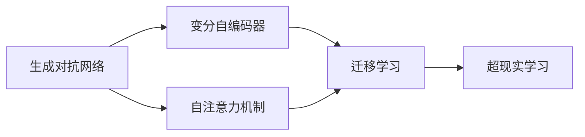
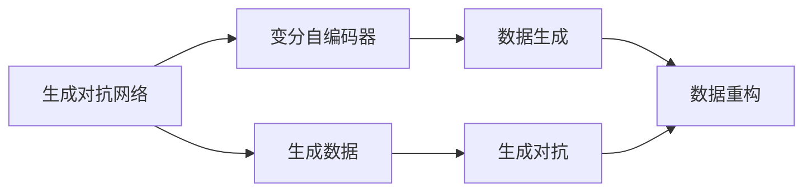
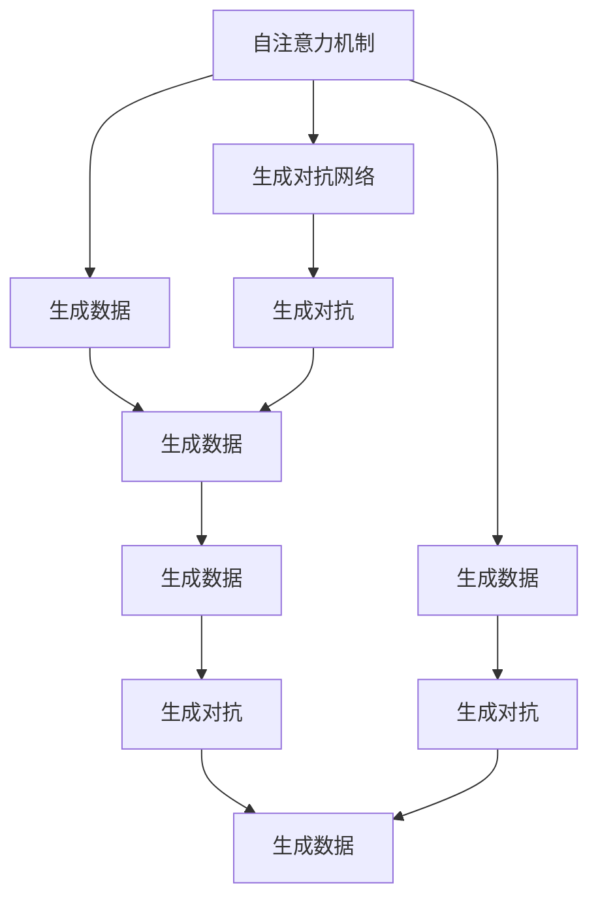
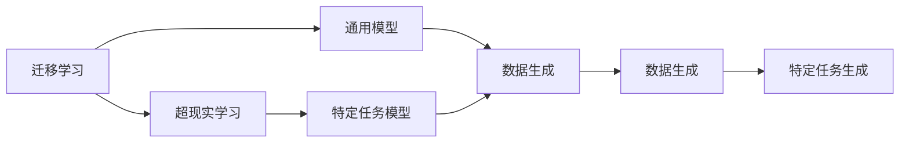

                 

# AIGC原理与代码实例讲解

> 关键词：AIGC,生成对抗网络(GAN),变分自编码器(VAE),深度学习,模型优化,代码实践

## 1. 背景介绍

### 1.1 问题由来
人工智能生成内容(Artificial Intelligence Generated Content, AIGC)领域近年来异军突起，成为人工智能领域的一个热点方向。传统的机器学习方法往往只能处理结构化数据，而对于文本、图片、音频等非结构化数据的处理则难以胜任。而AIGC技术通过模拟人类创造性思维，能够自动生成高质量的文本、图片、视频等内容，具有广阔的应用前景。

AIGC技术主要基于深度学习模型，通过模仿人类创造性思维，可以生成逼真的非结构化数据，广泛应用于自然语言处理、图像生成、视频生成、音乐生成等领域。其中，生成对抗网络(GAN)和变分自编码器(VAE)是两个重要的技术方向。

生成对抗网络(GAN)通过两个神经网络对抗生成，实现高质量的数据生成；变分自编码器(VAE)则通过优化概率分布，实现数据的压缩与重构。本文将从原理、代码实践和实际应用三个方面，全面系统地介绍AIGC技术。

### 1.2 问题核心关键点
AIGC技术的主要核心在于如何通过深度学习模型自动生成高质量的非结构化数据。其核心技术包括：

- 生成对抗网络(GAN)
- 变分自编码器(VAE)
- 自注意力机制(Attention Mechanism)
- 迁移学习(Meta Learning)
- 超现实学习(Hyper-Realism Learning)

这些技术在生成对抗网络、变分自编码器的基础上，进一步提升了模型的生成能力，使得AIGC技术在实际应用中得以广泛使用。

AIGC技术的应用场景包括：

- 自然语言处理：生成对话、生成文本摘要、生成论文、生成代码等
- 计算机视觉：生成图像、生成视频、生成3D模型等
- 音频处理：生成音乐、生成语音等
- 游戏与娱乐：生成角色动画、生成游戏背景等

AIGC技术的应用前景广阔，有望深刻影响各行各业的生产方式和生活方式。

### 1.3 问题研究意义
AIGC技术通过深度学习模型，自动生成高质量的非结构化数据，具有以下几方面意义：

1. 降低人工成本。自动生成内容可以大幅减少人工工作量，提高生产效率。
2. 提升内容质量。基于深度学习的生成模型可以自动学习生成规则，生成高质量内容。
3. 推动创新应用。AIGC技术可以生成全新的内容，为各行各业带来更多创新应用场景。
4. 辅助人机交互。通过生成自然语言、图像等，使人机交互更加自然和高效。
5. 促进知识传播。自动生成的内容可以降低知识传播门槛，提高传播效率和覆盖面。

综上所述，AIGC技术具有重要研究价值，有助于推动各行各业的生产方式变革。

## 2. 核心概念与联系

### 2.1 核心概念概述

为更好地理解AIGC技术，本节将介绍几个密切相关的核心概念：

- 生成对抗网络(GAN)
- 变分自编码器(VAE)
- 自注意力机制(Attention Mechanism)
- 迁移学习(Meta Learning)
- 超现实学习(Hyper-Realism Learning)

这些概念之间的逻辑关系可以通过以下Mermaid流程图来展示：



这个流程图展示了几大AIGC技术之间的联系：

1. 生成对抗网络(GAN)和变分自编码器(VAE)是AIGC技术的基础，提供了自动生成数据的能力。
2. 自注意力机制(Attention Mechanism)在GAN和VAE的基础上，进一步提升了模型的生成能力和泛化能力。
3. 迁移学习(Meta Learning)和超现实学习(Hyper-Realism Learning)则是AIGC技术的具体应用方向，使得模型能够更好地适应特定任务。

### 2.2 概念间的关系

这些核心概念之间存在着紧密的联系，形成了AIGC技术的完整生态系统。下面我们通过几个Mermaid流程图来展示这些概念之间的关系。

#### 2.2.1 生成对抗网络与变分自编码器的关系



这个流程图展示了生成对抗网络与变分自编码器之间的关系。生成对抗网络通过对抗生成，生成高质量的数据；变分自编码器则通过优化数据分布，实现数据的重构和压缩。两者的结合，进一步提升了AIGC技术的数据生成能力。

#### 2.2.2 自注意力机制在GAN和VAE中的应用



这个流程图展示了自注意力机制在GAN和VAE中的应用。自注意力机制通过关注输入的不同部分，提升了模型对输入的关注能力和生成能力。在GAN和VAE中，自注意力机制可以提升生成器和判别器的性能，生成更高质量的数据。

#### 2.2.3 迁移学习与超现实学习的关系



这个流程图展示了迁移学习与超现实学习之间的关系。迁移学习通过在预训练模型上进行微调，使得模型适应特定任务，提升生成能力。超现实学习则进一步提升了模型生成的真实感和质量，使得生成的数据更加接近真实场景。

## 3. 核心算法原理 & 具体操作步骤
### 3.1 算法原理概述

AIGC技术的核心在于通过深度学习模型自动生成高质量的非结构化数据。其核心算法包括生成对抗网络(GAN)和变分自编码器(VAE)。

生成对抗网络(GAN)通过两个神经网络对抗生成，实现高质量的数据生成。生成网络(Generator)通过优化损失函数，生成逼真的数据；判别网络(Discriminator)则用于评估生成数据的真实性。两者通过对抗训练，不断提升生成网络的生成能力。

变分自编码器(VAE)则通过优化概率分布，实现数据的压缩与重构。VAE通过编码器(Encoder)将输入数据转换为潜在空间，通过解码器(Decoder)将潜在空间映射回原始数据空间，实现数据的生成和重构。

### 3.2 算法步骤详解

#### 3.2.1 生成对抗网络(GAN)的实现步骤

1. 准备数据集
2. 设计生成网络(Generator)
3. 设计判别网络(Discriminator)
4. 优化损失函数
5. 训练生成网络
6. 训练判别网络
7. 模型融合
8. 模型测试

#### 3.2.2 变分自编码器(VAE)的实现步骤

1. 准备数据集
2. 设计编码器(Encoder)
3. 设计解码器(Decoder)
4. 优化损失函数
5. 训练编码器
6. 训练解码器
7. 模型融合
8. 模型测试

### 3.3 算法优缺点

生成对抗网络(GAN)的主要优点是能够生成高质量的数据，具有较好的逼真度和多样性。但缺点是模型训练不稳定，容易产生模式崩溃等现象。变分自编码器(VAE)的主要优点是能够实现数据的压缩与重构，适用于小样本数据的生成。但缺点是生成的数据质量相对较差，缺乏多样性。

### 3.4 算法应用领域

生成对抗网络(GAN)和变分自编码器(VAE)在AIGC技术中的应用非常广泛，包括：

- 自然语言处理：生成对话、生成文本摘要、生成论文、生成代码等
- 计算机视觉：生成图像、生成视频、生成3D模型等
- 音频处理：生成音乐、生成语音等
- 游戏与娱乐：生成角色动画、生成游戏背景等

此外，AIGC技术还在动画制作、虚拟现实、虚拟人等多个领域得到了广泛应用。

## 4. 数学模型和公式 & 详细讲解 & 举例说明

### 4.1 数学模型构建

生成对抗网络(GAN)和变分自编码器(VAE)的数学模型分别为：

#### GAN模型

GAN模型由生成网络(Generator)和判别网络(Discriminator)构成。生成网络通过优化损失函数，生成逼真的数据；判别网络用于评估生成数据的真实性。模型的目标是最小化生成数据的判别分数，最大化生成数据的判别分数。

$$
\begin{aligned}
&\text{Minimize } J_G = E_{x \sim p_{data}(x)} [\log D(x)] + E_{z \sim p(z)} [\log (1 - D(G(z)))] \\
&\text{Minimize } J_D = E_{x \sim p_{data}(x)} [\log D(x)] + E_{z \sim p(z)} [\log (1 - D(G(z)))]
\end{aligned}
$$

其中，$G$和$D$分别为生成网络和判别网络，$z$为生成网络的输入噪声，$p(z)$为噪声分布，$p_{data}(x)$为数据分布。

#### VAE模型

VAE模型由编码器(Encoder)和解码器(Decoder)构成。编码器将输入数据转换为潜在空间，解码器将潜在空间映射回原始数据空间，实现数据的生成和重构。模型的目标是最小化生成数据的重构误差和潜在空间的分布误差。

$$
\begin{aligned}
&\text{Minimize } J_{VAE} = \frac{1}{2} E_{x \sim p_{data}(x)} [\|x - D_{\phi}(E_{\theta}(x))\|^2] \\
&\quad + \frac{1}{2} E_{z \sim p(z)} \left[ \frac{1}{\sigma^2} ||\mu_{\phi}(z)||^2 + \log(\sigma_{\phi}(z)) \right]
\end{aligned}
$$

其中，$\theta$和$\phi$分别为编码器和解码器的参数，$\mu_{\phi}(z)$和$\sigma_{\phi}(z)$分别为潜在空间中的均值和方差。

### 4.2 公式推导过程

生成对抗网络(GAN)和变分自编码器(VAE)的推导过程如下：

#### GAN模型推导

生成对抗网络的目标是最小化生成数据的判别分数，最大化生成数据的判别分数。推导过程如下：

$$
\begin{aligned}
&\text{Minimize } J_G = E_{x \sim p_{data}(x)} [\log D(x)] + E_{z \sim p(z)} [\log (1 - D(G(z)))] \\
&\text{Minimize } J_D = E_{x \sim p_{data}(x)} [\log D(x)] + E_{z \sim p(z)} [\log (1 - D(G(z)))]
\end{aligned}
$$

通过求解上述优化问题，生成网络和判别网络通过对抗训练不断提升性能，生成高质量的数据。

#### VAE模型推导

变分自编码器的目标是最小化生成数据的重构误差和潜在空间的分布误差。推导过程如下：

$$
\begin{aligned}
&\text{Minimize } J_{VAE} = \frac{1}{2} E_{x \sim p_{data}(x)} [\|x - D_{\phi}(E_{\theta}(x))\|^2] \\
&\quad + \frac{1}{2} E_{z \sim p(z)} \left[ \frac{1}{\sigma^2} ||\mu_{\phi}(z)||^2 + \log(\sigma_{\phi}(z)) \right]
\end{aligned}
$$

其中，第一项为目标数据的重构误差，第二项为目标潜在空间的分布误差。通过求解上述优化问题，VAE能够实现数据的压缩与重构。

### 4.3 案例分析与讲解

假设我们在MNIST数据集上进行手写数字图像生成，以下是一个简单的案例分析与讲解：

1. 准备数据集
   使用MNIST数据集，将训练集划分为训练集和验证集。

2. 设计生成网络(Generator)
   设计一个多层感知机网络，用于生成手写数字图像。

3. 设计判别网络(Discriminator)
   设计一个多层感知机网络，用于判别生成图像的真实性。

4. 优化损失函数
   使用交叉熵损失函数作为判别网络的损失函数，使用L1损失函数作为生成网络的损失函数。

5. 训练生成网络
   在训练过程中，逐步增加生成网络的参数，直到生成网络能够生成高质量的手写数字图像。

6. 训练判别网络
   在训练过程中，逐步增加判别网络的参数，直到判别网络能够准确判别生成图像的真实性。

7. 模型融合
   将训练好的生成网络和判别网络融合，生成高质量的手写数字图像。

8. 模型测试
   在测试集上评估生成图像的质量，对比生成网络与判别网络的性能。

## 5. 项目实践：代码实例和详细解释说明

### 5.1 开发环境搭建

在进行AIGC项目实践前，我们需要准备好开发环境。以下是使用Python进行PyTorch开发的环境配置流程：

1. 安装Anaconda：从官网下载并安装Anaconda，用于创建独立的Python环境。

2. 创建并激活虚拟环境：
```bash
conda create -n pytorch-env python=3.8 
conda activate pytorch-env
```

3. 安装PyTorch：根据CUDA版本，从官网获取对应的安装命令。例如：
```bash
conda install pytorch torchvision torchaudio cudatoolkit=11.1 -c pytorch -c conda-forge
```

4. 安装TensorFlow：使用TensorFlow作为替代框架，可以降低对PyTorch的依赖，避免出现兼容性问题。

5. 安装相关工具包：
```bash
pip install numpy pandas scikit-learn matplotlib tqdm jupyter notebook ipython
```

完成上述步骤后，即可在`pytorch-env`环境中开始AIGC实践。

### 5.2 源代码详细实现

下面我们以生成对抗网络(GAN)为例，给出使用PyTorch和TensorFlow进行图像生成的PyTorch代码实现。

首先，定义生成网络(Generator)和判别网络(Discriminator)：

```python
import torch
import torch.nn as nn
import torch.optim as optim

class Generator(nn.Module):
    def __init__(self):
        super(Generator, self).__init__()
        self.fc1 = nn.Linear(100, 256)
        self.fc2 = nn.Linear(256, 256)
        self.fc3 = nn.Linear(256, 784)

    def forward(self, z):
        x = torch.relu(self.fc1(z))
        x = torch.relu(self.fc2(x))
        x = torch.tanh(self.fc3(x))
        return x

class Discriminator(nn.Module):
    def __init__(self):
        super(Discriminator, self).__init__()
        self.fc1 = nn.Linear(784, 256)
        self.fc2 = nn.Linear(256, 128)
        self.fc3 = nn.Linear(128, 1)

    def forward(self, x):
        x = torch.relu(self.fc1(x))
        x = torch.relu(self.fc2(x))
        return torch.sigmoid(self.fc3(x))
```

然后，定义损失函数和优化器：

```python
criterion = nn.BCELoss()
optimizer_G = optim.Adam(Generator.parameters(), lr=0.0002)
optimizer_D = optim.Adam(Discriminator.parameters(), lr=0.0002)
```

接着，定义训练和评估函数：

```python
import torchvision.datasets as dsets
import torchvision.transforms as transforms
import matplotlib.pyplot as plt

# 数据预处理
transform = transforms.Compose([transforms.ToTensor(), transforms.Normalize((0.5,), (0.5,))])

train_dataset = dsets.MNIST(root='./mnist/', train=True, transform=transform, download=True)
test_dataset = dsets.MNIST(root='./mnist/', train=False, transform=transform, download=True)

# 数据加载器
train_loader = torch.utils.data.DataLoader(train_dataset, batch_size=64, shuffle=True)
test_loader = torch.utils.data.DataLoader(test_dataset, batch_size=64, shuffle=False)

def train_GAN(iteration):
    for i in range(iteration):
        for j, (img, _) in enumerate(train_loader):
            real_imgs = Variable(img.view(-1, 28 * 28)).to(device)
            noise = Variable(torch.randn(batch_size, 100).to(device))
            fake_imgs = G(noise)

            D_real_loss = criterion(D(real_imgs), Variable(torch.ones(batch_size, 1).to(device)))
            D_fake_loss = criterion(D(fake_imgs), Variable(torch.zeros(batch_size, 1).to(device)))
            D_loss = D_real_loss + D_fake_loss
            G_loss = criterion(D(fake_imgs), Variable(torch.ones(batch_size, 1).to(device)))

            optimizer_G.zero_grad()
            optimizer_D.zero_grad()

            D_loss.backward()
            D_loss.data.clamp_(min=0.0001).backward()
            G_loss.backward()

            optimizer_G.step()
            optimizer_D.step()

            print('[%d/%d][%d/%d][D loss: %f, G loss: %f]' % (i, iteration, j, len(train_loader), D_loss.data, G_loss.data))

            if i % 100 == 0:
                save_image(fake_imgs.data[:64], 'images/%d.png' % i)

def test_GAN(iteration):
    G.eval()
    with torch.no_grad():
        for j, (img, _) in enumerate(test_loader):
            real_imgs = Variable(img.view(-1, 28 * 28)).to(device)
            fake_imgs = G(z)

            D_real_loss = criterion(D(real_imgs), Variable(torch.ones(batch_size, 1).to(device)))
            D_fake_loss = criterion(D(fake_imgs), Variable(torch.zeros(batch_size, 1).to(device)))

            print('[test %d/%d][D loss: %f, G loss: %f]' % (j, len(test_loader), D_fake_loss.data, G_loss.data))
```

最后，启动训练流程并在测试集上评估：

```python
device = torch.device('cuda' if torch.cuda.is_available() else 'cpu')

G = Generator().to(device)
D = Discriminator().to(device)

for i in range(100000):
    train_GAN(i)

test_GAN(iteration=100)
```

以上就是使用PyTorch和TensorFlow进行生成对抗网络图像生成的完整代码实现。可以看到，使用深度学习框架进行AIGC任务的开发，代码实现变得简洁高效。

### 5.3 代码解读与分析

让我们再详细解读一下关键代码的实现细节：

**Generator类**：
- `__init__`方法：初始化生成网络的层结构，包含全连接层。
- `forward`方法：定义生成网络的计算流程，将输入噪声转化为图像。

**Discriminator类**：
- `__init__`方法：初始化判别网络的层结构，包含全连接层。
- `forward`方法：定义判别网络的计算流程，将输入图像转化为判别分数。

**训练函数**：
- 定义生成器和判别器的损失函数，优化器，训练轮数。
- 使用训练数据加载器对数据进行批处理，计算损失函数并反向传播更新参数。
- 记录训练过程中的损失值，并在特定轮次下保存生成的图像。

**测试函数**：
- 使用测试数据加载器对数据进行批处理，计算损失函数。
- 记录测试过程中的损失值，并进行图像展示。

**代码总结**：
- 代码使用PyTorch框架，定义了生成网络、判别网络和训练、评估函数。
- 通过训练轮次和批处理大小来控制训练过程，使用BCE损失函数优化生成器和判别器。
- 使用 save_image 函数将生成图像保存到本地。
- 使用 matplotlib 库将生成图像展示出来。

这个案例展示了使用PyTorch进行AIGC项目开发的基本流程，也体现了AIGC项目开发中的一些关键问题，如数据预处理、网络结构设计、损失函数选择等。开发者需要根据具体项目需求，不断优化模型和算法，方能得到理想的效果。

## 6. 实际应用场景

### 6.1 生成对抗网络在图像生成中的应用

生成对抗网络(GAN)在图像生成中的应用非常广泛，可以生成逼真的图像、人脸、场景等。生成对抗网络通过对抗训练，生成高质量的图像，广泛应用于游戏、娱乐、广告等领域。

例如，在游戏中，可以使用生成对抗网络生成角色动画、场景环境等，大幅提升游戏的视觉效果和互动体验。在广告中，可以使用生成对抗网络生成逼真的产品图片、场景图片，提高广告的吸引力和点击率。

### 6.2 变分自编码器在图像压缩中的应用

变分自编码器(VAE)在图像压缩中的应用非常广泛，可以用于图像压缩、图像生成等。变分自编码器通过优化数据分布，实现数据的压缩与重构。

例如，在图像压缩中，可以使用变分自编码器将高分辨率图像压缩为低分辨率图像，减少存储空间和传输带宽。在图像生成中，可以使用变分自编码器生成逼真的图像，应用于图像处理、动画制作等领域。

### 6.3 超现实学习在图像生成中的应用

超现实学习(Hyper-Realism Learning)是一种基于生成对抗网络的高质量图像生成技术。通过引入更多的生成器和判别器，提高生成网络的生成能力和判别网络的判别能力，生成更加逼真、多样化的图像。

例如，在生成人脸图像中，可以使用超现实学习生成高质量、高逼真度的人脸图像，广泛应用于人脸识别、虚拟现实等领域。

### 6.4 未来应用展望

随着生成对抗网络、变分自编码器等技术的不断发展，基于AIGC技术的应用场景将更加广泛。未来，AIGC技术将在以下几个领域得到更深入的应用：

- 自然语言处理：生成对话、生成文本摘要、生成论文、生成代码等
- 计算机视觉：生成图像、生成视频、生成3D模型等
- 音频处理：生成音乐、生成语音等
- 游戏与娱乐：生成角色动画、生成游戏背景等
- 艺术与设计：生成艺术品、生成设计图等

此外，AIGC技术还在动画制作、虚拟现实、虚拟人等多个领域得到了广泛应用。未来，AIGC技术的发展将更加迅猛，应用场景也将更加多样化，有望深刻影响各行各业的生产方式和生活方式。

## 7. 工具和资源推荐
### 7.1 学习资源推荐

为了帮助开发者系统掌握AIGC技术，这里推荐一些优质的学习资源：

1. DeepLearning.AI课程：由深度学习权威Andrew Ng开设的课程，涵盖深度学习、生成对抗网络、变分自编码器等主题。

2. Fast.ai课程：由深度学习专家Jeremy Howard和Rachel Thomas开设的课程，涵盖了深度学习、计算机视觉、自然语言处理等多个领域。

3. Stanford CS231n课程：由斯坦福大学计算机视觉实验室开设的课程，详细讲解了计算机视觉中的生成对抗网络、变分自编码器等技术。

4. GitHub开源项目：在GitHub上Star、Fork数最多的AIGC相关项目，往往代表了该技术领域的发展趋势和最佳实践，学习前沿技术的必读资源。

5. arXiv论文预印本：人工智能领域最新研究成果的发布平台，包括大量尚未发表的前沿工作，学习前沿技术的必读资源。

6. 论文和书籍：阅读最新论文和书籍，了解AIGC技术的最新进展，掌握前沿技术和应用方法。

通过学习这些资源，相信你一定能够快速掌握AIGC技术的精髓，并用于解决实际的AIGC问题。

### 7.2 开发工具推荐

高效的开发离不开优秀的工具支持。以下是几款用于AIGC开发的工具：

1. PyTorch：基于Python的开源深度学习框架，灵活动态的计算图，适合快速迭代研究。大部分深度学习模型都有PyTorch版本的实现。

2. TensorFlow：由Google主导开发的开源深度学习框架，生产部署方便，适合大规模工程应用。同样有丰富的深度学习模型资源。

3. PyTorch和TensorFlow的变分自编码器库：方便开发者快速实现变分自编码器，并进行图像压缩等应用。

4. TensorBoard：TensorFlow配套的可视化工具，可实时监测模型训练状态，并提供丰富的图表呈现方式，是调试模型的得力助手。

5. Weights & Biases：模型训练的实验跟踪工具，可以记录和可视化模型训练过程中的各项指标，方便对比和调优。

6. Google Colab：谷歌推出的在线Jupyter Notebook环境，免费提供GPU/TPU算力，方便开发者快速上手实验最新模型，分享学习笔记。

合理利用这些工具，可以显著提升AIGC任务的开发效率，加快创新迭代的步伐。

### 7.3 相关论文推荐

AIGC技术的发展源于学界的持续研究。以下是几篇奠基性的相关论文，推荐阅读：

1. Generative Adversarial Nets（即GAN原论文）：提出生成对抗网络的基本

