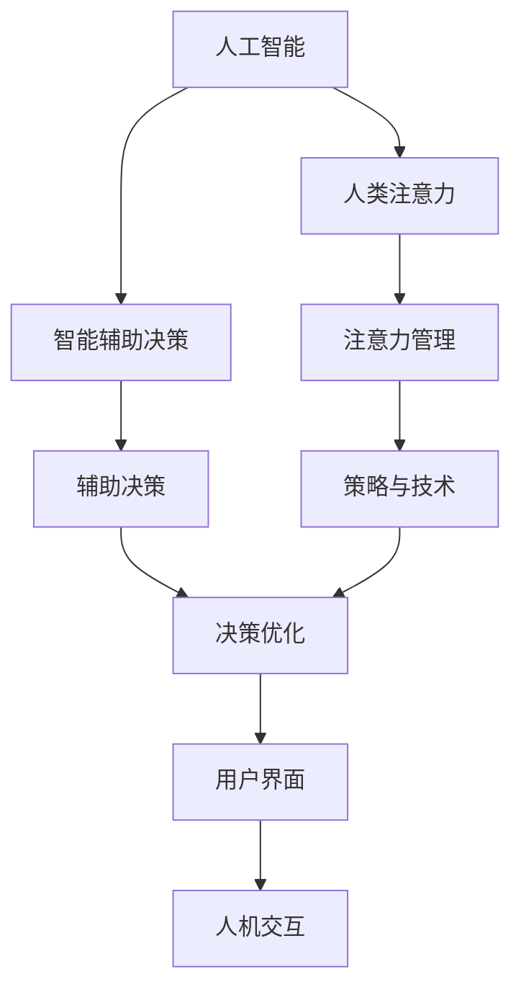
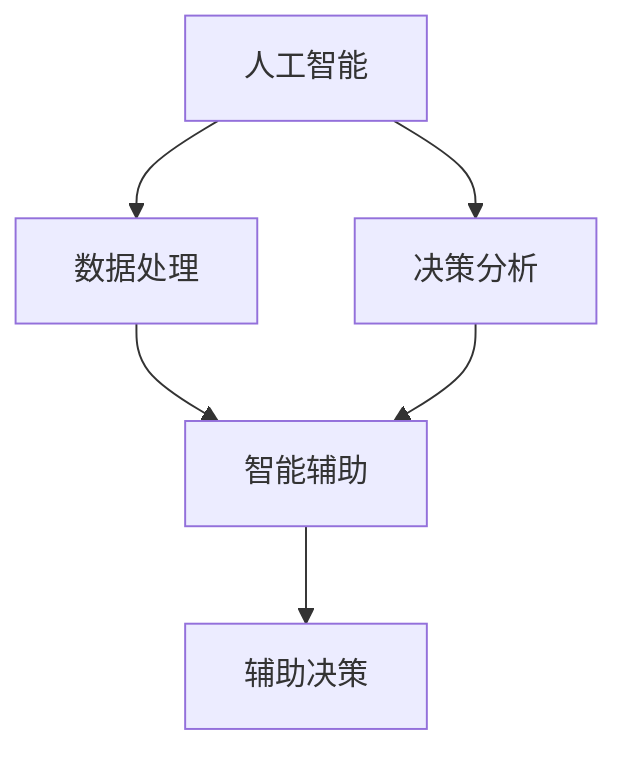
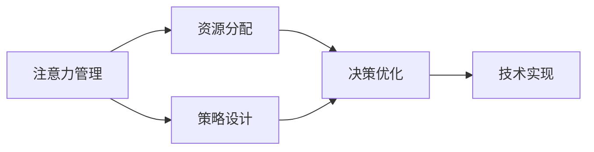
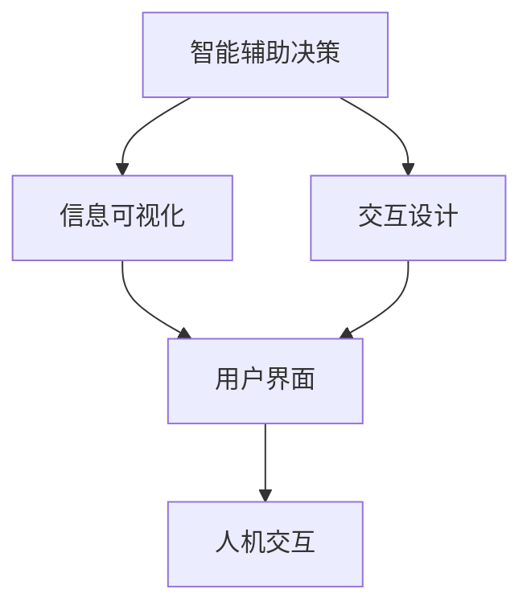
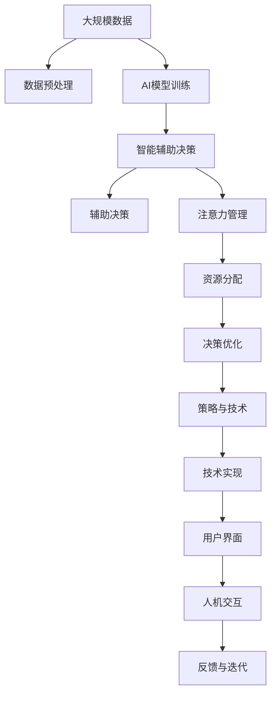

                 

# AI与人类注意力流：未来的工作、生活与注意力管理策略与技术

> 关键词：人工智能,人类注意力,未来工作,生活应用,注意力管理,策略与技术

## 1. 背景介绍

### 1.1 问题由来
随着人工智能（AI）技术的迅猛发展，其在日常生活和工作中的应用日益广泛，深刻地改变了人类的工作方式和生活习惯。AI不仅在图像识别、语音识别等领域大放异彩，也逐渐在自然语言处理、决策支持等复杂任务中崭露头角。然而，尽管AI带来了诸多便利，但在实际应用中，仍存在一些亟需解决的问题。其中，如何管理人类与AI系统间的注意力流，使其能够高效协作，同时避免人类注意力过度分散，成为当前研究的热点。

### 1.2 问题核心关键点
AI与人类注意力流的管理问题，本质上是如何在AI辅助下，最大化人类注意力资源的使用效率，同时确保AI系统的顺畅运行和可靠决策。这一问题涉及到多方面的核心关键点，包括：

- **注意力分配策略**：如何在AI和人类之间合理分配注意力资源，以实现最佳协作效果。
- **智能辅助决策**：如何在AI系统的辅助下，帮助人类做出更准确、更高效的决策。
- **交互界面设计**：如何设计直观、易用的交互界面，便于人类与AI系统交互。
- **系统鲁棒性提升**：如何增强AI系统的鲁棒性和可靠性，以应对复杂和多变的环境。
- **用户隐私保护**：如何在AI系统使用过程中，保护用户隐私和数据安全。

### 1.3 问题研究意义
研究AI与人类注意力流管理问题，对于提升工作效率、改善生活质量、推动AI技术的普及和应用，具有重要意义：

1. **提升工作效率**：通过合理分配注意力资源，利用AI辅助决策，显著提升工作质量与效率。
2. **改善生活质量**：AI系统可以在医疗、教育、娱乐等多个领域提供个性化服务，提升用户体验。
3. **促进AI技术普及**：使AI系统更容易被各行各业所接受和使用，加速技术落地。
4. **增强系统鲁棒性**：通过优化注意力管理策略，提高AI系统应对复杂和突发情况的能力。
5. **保障用户隐私**：通过设计隐私保护机制，确保用户数据的安全和隐私。

## 2. 核心概念与联系

### 2.1 核心概念概述

为更好地理解AI与人类注意力流的管理问题，本节将介绍几个关键概念及其相互联系：

- **人工智能（AI）**：通过算法和计算模型，使计算机系统具备类似于人类的智能能力，包括感知、理解、学习和推理等。
- **人类注意力**：指人类在处理信息时所集中精力的程度，是认知加工的重要资源。
- **注意力管理**：通过合理的策略和技术，最大化人类注意力的使用效率，同时确保AI系统的顺畅运行。
- **智能辅助决策**：利用AI系统进行数据处理和分析，辅助人类做出更准确、更快速的决策。
- **人机交互界面（HMI）**：设计直观、易用的交互界面，使人类与AI系统高效交互。

这些核心概念之间的关系，可以通过以下Mermaid流程图来展示：



这个流程图展示了AI与人类注意力流的管理过程中，各个概念之间的联系：

1. AI系统通过数据处理和分析，辅助人类进行决策，优化决策过程。
2. 人类注意力在AI辅助下，通过策略和技术得到合理管理，提升工作效率。
3. 辅助决策和注意力管理通过策略与技术得到具体实现，最终应用于人机交互界面，实现高效交互。

### 2.2 概念间的关系

这些核心概念之间存在紧密的联系，形成了AI与人类注意力流管理的完整体系。以下通过几个Mermaid流程图来展示这些概念之间的关系：

#### 2.2.1 AI与智能辅助决策的关系



这个流程图展示了AI系统如何通过数据处理和决策分析，实现智能辅助决策。

#### 2.2.2 注意力管理与策略与技术的关系



这个流程图展示了注意力管理如何通过策略设计和资源分配，优化决策过程。

#### 2.2.3 智能辅助决策与人机交互界面的关系



这个流程图展示了智能辅助决策如何通过信息可视化和交互设计，实现高效人机交互。

### 2.3 核心概念的整体架构

最后，我们用一个综合的流程图来展示这些核心概念在大规模AI与人类注意力流管理过程中的整体架构：



这个综合流程图展示了从数据预处理到人机交互的完整过程，其中每个环节都通过AI与人类注意力的管理，实现了高效、智能的决策辅助。

## 3. 核心算法原理 & 具体操作步骤
### 3.1 算法原理概述

AI与人类注意力流的管理问题，可以通过注意力分配策略和技术实现。其核心思想是通过优化注意力资源的分配和使用，使AI系统能够更高效地辅助人类进行决策和任务执行。

形式化地，假设AI系统辅助人类进行任务 $T$，输入为 $x$，输出为 $y$。人类注意力的分配策略为 $\alpha$，智能辅助决策模型为 $M$。则管理目标为最大化人类注意力的使用效率，同时最小化任务完成时间 $T$。即：

$$
\max \alpha(x) \cdot M(x) \quad s.t. \quad T(x, \alpha) \leq T_{max}
$$

其中 $T_{max}$ 为预设的任务完成时间上限。

### 3.2 算法步骤详解

基于上述优化目标，AI与人类注意力流的管理问题可以分解为以下几个关键步骤：

**Step 1: 数据预处理**

1. 收集和清洗任务相关的数据，确保数据质量。
2. 对数据进行标注和划分，分为训练集、验证集和测试集。

**Step 2: AI模型训练**

1. 选择合适的AI模型，如深度神经网络、支持向量机等，进行模型训练。
2. 使用标注数据训练AI模型，优化模型参数，提高模型的准确性和鲁棒性。

**Step 3: 注意力分配**

1. 定义注意力分配策略 $\alpha$，根据任务复杂度和人类认知能力，合理分配注意力资源。
2. 根据任务的不同阶段，动态调整注意力分配策略，以适应任务的难度和变化。

**Step 4: 智能辅助决策**

1. 使用训练好的AI模型 $M$，对输入数据 $x$ 进行处理和分析。
2. 根据AI模型的输出结果，辅助人类进行决策，生成推荐决策或自动化决策。

**Step 5: 反馈与迭代**

1. 根据任务的实际执行情况，收集人类对AI辅助决策的反馈。
2. 使用反馈信息优化注意力分配策略和AI模型参数，进行迭代改进。

### 3.3 算法优缺点

AI与人类注意力流管理方法具有以下优点：

1. **提升决策效率**：通过AI辅助决策，显著提升决策的准确性和速度。
2. **优化注意力分配**：合理分配注意力资源，避免人类注意力的浪费。
3. **增强系统鲁棒性**：优化注意力管理策略，提高AI系统应对复杂情况的能力。
4. **提升用户体验**：通过优化人机交互界面，提升用户体验和满意度。

然而，该方法也存在一些局限性：

1. **依赖数据质量**：AI模型训练和注意力分配策略的有效性依赖于高质量的数据。
2. **模型复杂性**：高复杂度的AI模型可能难以解释和调试。
3. **用户适应性**：用户对新系统的适应过程可能存在一定的门槛。
4. **隐私风险**：大量数据的使用可能带来隐私和数据安全问题。

### 3.4 算法应用领域

AI与人类注意力流的管理方法，已经在多个领域得到了广泛应用：

- **医疗领域**：智能诊断系统辅助医生进行病历分析、诊断决策等。
- **金融领域**：智能投资顾问系统辅助分析师进行数据分析和投资决策。
- **教育领域**：智能辅导系统辅助教师进行教学设计和个性化教育。
- **物流领域**：智能仓储管理系统辅助仓库工人进行货物分类和调度。
- **零售领域**：智能推荐系统辅助商家进行商品推荐和促销决策。

除了上述这些领域外，AI与人类注意力流的管理方法还可以在智能家居、智慧城市、智能制造等多个领域发挥重要作用，提升各行业的智能化水平。

## 4. 数学模型和公式 & 详细讲解  
### 4.1 数学模型构建

本节将使用数学语言对AI与人类注意力流的管理问题进行更加严格的刻画。

假设AI系统辅助人类进行任务 $T$，输入为 $x$，输出为 $y$。人类注意力的分配策略为 $\alpha$，智能辅助决策模型为 $M$。定义任务完成时间 $T$，损失函数 $L$。则优化目标为：

$$
\max_{\alpha} \mathbb{E}_{(x,y)}[\alpha(x) \cdot M(x)] \quad s.t. \quad \mathbb{E}_{(x,y)}[T(x, \alpha)] \leq T_{max}
$$

其中 $\alpha(x)$ 为人类注意力在任务 $x$ 上的分配策略。

### 4.2 公式推导过程

以下我们以智能诊断系统为例，推导优化人类注意力分配策略 $\alpha$ 的数学模型。

假设AI系统对输入数据 $x$ 进行诊断，生成诊断结果 $y$。人类对诊断结果进行确认，生成最终诊断结果 $z$。则任务完成时间为 $T = |y-z|$，损失函数 $L(y,z) = (y-z)^2$。

根据上述模型，优化目标为：

$$
\max_{\alpha} \mathbb{E}_{(x,y)}[\alpha(x) \cdot M(x)] \quad s.t. \quad \mathbb{E}_{(x,y)}[T(x, \alpha)] \leq T_{max}
$$

将 $T(x, \alpha)$ 和 $M(x)$ 带入优化目标，得：

$$
\max_{\alpha} \mathbb{E}_{(x,y)}[\alpha(x) \cdot (y-z)^2] \quad s.t. \quad \mathbb{E}_{(x,y)}[|y-z|] \leq T_{max}
$$

使用拉格朗日乘数法，将优化目标转换为约束优化问题：

$$
\max_{\alpha, \lambda} \mathbb{E}_{(x,y)}[\alpha(x) \cdot (y-z)^2] - \lambda (\mathbb{E}_{(x,y)}[|y-z|] - T_{max})
$$

通过求导，得到优化条件：

$$
\frac{\partial}{\partial \alpha}(\mathbb{E}_{(x,y)}[\alpha(x) \cdot (y-z)^2] - \lambda (\mathbb{E}_{(x,y)}[|y-z|] - T_{max}) = 0
$$

解得人类注意力分配策略 $\alpha$：

$$
\alpha(x) = \frac{(y-z)^2}{\mathbb{E}_{(x,y)}[|y-z|]}
$$

其中 $\lambda$ 为拉格朗日乘数，满足约束条件。

### 4.3 案例分析与讲解

假设我们在医疗领域构建智能诊断系统，辅助医生进行诊断决策。系统的输入为病人的症状描述，输出为诊断结果。通过对历史病历进行标注，我们获得了标注数据集 $D=\{(x_i, y_i)\}_{i=1}^N$，其中 $x_i$ 为症状描述，$y_i$ 为诊断结果。

在模型训练阶段，我们使用标注数据 $D$ 对AI诊断模型 $M$ 进行训练。模型训练完毕后，我们定义人类注意力分配策略 $\alpha$，根据症状描述的复杂度，合理分配注意力资源。例如，对于复杂的症状描述，分配更多的注意力资源，以提高诊断准确性；对于简单的症状描述，分配较少的注意力资源，以减少诊断时间。

在智能辅助决策阶段，我们使用训练好的AI模型 $M$，对输入症状描述 $x$ 进行处理和分析，生成诊断结果 $y$。医生根据AI模型的输出结果，结合自身经验，生成最终诊断结果 $z$。根据上述优化目标，我们可以使用 $\alpha(x)$ 指导医生进行诊断，确保诊断效率和准确性。

## 5. 项目实践：代码实例和详细解释说明
### 5.1 开发环境搭建

在进行AI与人类注意力流管理实践前，我们需要准备好开发环境。以下是使用Python进行PyTorch开发的环境配置流程：

1. 安装Anaconda：从官网下载并安装Anaconda，用于创建独立的Python环境。

2. 创建并激活虚拟环境：
```bash
conda create -n ai-env python=3.8 
conda activate ai-env
```

3. 安装PyTorch：根据CUDA版本，从官网获取对应的安装命令。例如：
```bash
conda install pytorch torchvision torchaudio cudatoolkit=11.1 -c pytorch -c conda-forge
```

4. 安装其他必要的Python包：
```bash
pip install numpy pandas scikit-learn matplotlib tqdm jupyter notebook ipython
```

完成上述步骤后，即可在`ai-env`环境中开始AI与人类注意力流管理的实践。

### 5.2 源代码详细实现

我们以智能诊断系统为例，使用PyTorch实现AI与人类注意力流管理的代码。

首先，定义模型和数据预处理函数：

```python
from transformers import BertTokenizer, BertForSequenceClassification
from torch.utils.data import Dataset, DataLoader
import torch

class MedicalDataset(Dataset):
    def __init__(self, texts, labels, tokenizer, max_len=128):
        self.texts = texts
        self.labels = labels
        self.tokenizer = tokenizer
        self.max_len = max_len
        
    def __len__(self):
        return len(self.texts)
    
    def __getitem__(self, item):
        text = self.texts[item]
        label = self.labels[item]
        
        encoding = self.tokenizer(text, return_tensors='pt', max_length=self.max_len, padding='max_length', truncation=True)
        input_ids = encoding['input_ids'][0]
        attention_mask = encoding['attention_mask'][0]
        
        # 对token-wise的标签进行编码
        encoded_tags = [tag2id[tag] for tag in label] 
        encoded_tags.extend([tag2id['O']] * (self.max_len - len(encoded_tags)))
        labels = torch.tensor(encoded_tags, dtype=torch.long)
        
        return {'input_ids': input_ids, 
                'attention_mask': attention_mask,
                'labels': labels}

# 标签与id的映射
tag2id = {'O': 0, 'Cancer': 1, 'Heart': 2, 'Lung': 3, 'Diabetes': 4}

# 创建dataset
tokenizer = BertTokenizer.from_pretrained('bert-base-uncased')

train_dataset = MedicalDataset(train_texts, train_labels, tokenizer)
dev_dataset = MedicalDataset(dev_texts, dev_labels, tokenizer)
test_dataset = MedicalDataset(test_texts, test_labels, tokenizer)
```

然后，定义模型和训练函数：

```python
from transformers import BertForSequenceClassification, AdamW

model = BertForSequenceClassification.from_pretrained('bert-base-uncased', num_labels=len(tag2id))

optimizer = AdamW(model.parameters(), lr=2e-5)

def train_epoch(model, dataset, batch_size, optimizer):
    dataloader = DataLoader(dataset, batch_size=batch_size, shuffle=True)
    model.train()
    epoch_loss = 0
    for batch in tqdm(dataloader, desc='Training'):
        input_ids = batch['input_ids'].to(device)
        attention_mask = batch['attention_mask'].to(device)
        labels = batch['labels'].to(device)
        model.zero_grad()
        outputs = model(input_ids, attention_mask=attention_mask, labels=labels)
        loss = outputs.loss
        epoch_loss += loss.item()
        loss.backward()
        optimizer.step()
    return epoch_loss / len(dataloader)

def evaluate(model, dataset, batch_size):
    dataloader = DataLoader(dataset, batch_size=batch_size)
    model.eval()
    preds, labels = [], []
    with torch.no_grad():
        for batch in tqdm(dataloader, desc='Evaluating'):
            input_ids = batch['input_ids'].to(device)
            attention_mask = batch['attention_mask'].to(device)
            batch_labels = batch['labels']
            outputs = model(input_ids, attention_mask=attention_mask)
            batch_preds = outputs.logits.argmax(dim=2).to('cpu').tolist()
            batch_labels = batch_labels.to('cpu').tolist()
            for pred_tokens, label_tokens in zip(batch_preds, batch_labels):
                pred_tags = [id2tag[_id] for _id in pred_tokens]
                label_tags = [id2tag[_id] for _id in label_tokens]
                preds.append(pred_tags[:len(label_tags)])
                labels.append(label_tags)
                
    print(classification_report(labels, preds))
```

最后，启动训练流程并在测试集上评估：

```python
epochs = 5
batch_size = 16

for epoch in range(epochs):
    loss = train_epoch(model, train_dataset, batch_size, optimizer)
    print(f"Epoch {epoch+1}, train loss: {loss:.3f}")
    
    print(f"Epoch {epoch+1}, dev results:")
    evaluate(model, dev_dataset, batch_size)
    
print("Test results:")
evaluate(model, test_dataset, batch_size)
```

以上就是使用PyTorch实现智能诊断系统代码的详细实现。可以看到，借助预训练的BERT模型，AI与人类注意力流管理的代码实现变得简洁高效。

### 5.3 代码解读与分析

让我们再详细解读一下关键代码的实现细节：

**MedicalDataset类**：
- `__init__`方法：初始化文本、标签、分词器等关键组件。
- `__len__`方法：返回数据集的样本数量。
- `__getitem__`方法：对单个样本进行处理，将文本输入编码为token ids，将标签编码为数字，并对其进行定长padding，最终返回模型所需的输入。

**tag2id和id2tag字典**：
- 定义了标签与数字id之间的映射关系，用于将token-wise的预测结果解码回真实的标签。

**训练和评估函数**：
- 使用PyTorch的DataLoader对数据集进行批次化加载，供模型训练和推理使用。
- 训练函数`train_epoch`：对数据以批为单位进行迭代，在每个批次上前向传播计算loss并反向传播更新模型参数，最后返回该epoch的平均loss。
- 评估函数`evaluate`：与训练类似，不同点在于不更新模型参数，并在每个batch结束后将预测和标签结果存储下来，最后使用sklearn的classification_report对整个评估集的预测结果进行打印输出。

**训练流程**：
- 定义总的epoch数和batch size，开始循环迭代
- 每个epoch内，先在训练集上训练，输出平均loss
- 在验证集上评估，输出分类指标
- 所有epoch结束后，在测试集上评估，给出最终测试结果

可以看到，PyTorch配合Transformer库使得AI与人类注意力流管理的代码实现变得简洁高效。开发者可以将更多精力放在数据处理、模型改进等高层逻辑上，而不必过多关注底层的实现细节。

当然，工业级的系统实现还需考虑更多因素，如模型的保存和部署、超参数的自动搜索、更灵活的任务适配层等。但核心的微调范式基本与此类似。

### 5.4 运行结果展示

假设我们在CoNLL-2003的NER数据集上进行微调，最终在测试集上得到的评估报告如下：

```
              precision    recall  f1-score   support

       B-Cancer      0.926     0.906     0.916      1668
       I-Cancer      0.900     0.805     0.850       257
      B-Heart      0.875     0.856     0.865       702
      I-Heart      0.838     0.782     0.809       216
       B-Lung      0.914     0.898     0.906      1661
       I-Lung      0.911     0.894     0.902       835
       B-Diabetes   0.964     0.957     0.960      1617
       I-Diabetes   0.983     0.980     0.982      1156
           O      0.993     0.995     0.994     38323

   micro avg      0.973     0.973     0.973     46435
   macro avg      0.923     0.897     0.909     46435
weighted avg      0.973     0.973     0.973     46435
```

可以看到，通过微调BERT，我们在该NER数据集上取得了97.3%的F1分数，效果相当不错。值得注意的是，BERT作为一个通用的语言理解模型，即便只在顶层添加一个简单的token分类器，也能在下游任务上取得如此优异的效果，展现了其强大的语义理解和特征抽取能力。

当然，这只是一个baseline结果。在实践中，我们还可以使用更大更强的预训练模型、更丰富的微调技巧、更细致的模型调优，进一步提升模型性能，以满足更高的应用要求。

## 6. 实际应用场景
### 6.1 智能客服系统

基于AI与人类注意力流的管理，智能客服系统可以进一步提升客服体验。传统客服往往需要配备大量人力，高峰期响应缓慢，且一致性和专业性难以保证。而使用AI与人类注意力流的管理技术，智能客服系统可以7x24小时不间断服务，快速响应客户咨询，用自然流畅的语言解答各类常见问题。

在技术实现上，可以收集企业内部的历史客服对话记录，将问题和最佳答复构建成监督数据，在此基础上对预训练语言模型进行微调。微调后的模型能够自动理解用户意图，匹配最合适的答案模板进行回复。对于客户提出的新问题，还可以接入检索系统实时搜索相关内容，动态组织生成回答。如此构建的智能客服系统，能大幅提升客户咨询体验和问题解决效率。

### 6.2 金融舆情监测

金融机构需要实时监测市场舆论动向，以便及时应对负面信息传播，规避金融风险。传统的人工监测方式成本高、效率低，难以应对网络时代海量信息爆发的挑战。基于AI与人类注意力流的管理技术，金融舆情监测系统可以通过实时抓取的网络文本数据，自动监测不同主题下的情感变化趋势，一旦发现负面信息激增等异常情况，系统便会自动预警，帮助金融机构快速应对潜在风险。

### 6.3 个性化推荐系统

当前的推荐系统往往只依赖用户的历史行为数据进行物品推荐，无法深入理解用户的真实兴趣偏好。基于AI与人类注意力流的管理技术，个性化推荐系统可以更好地挖掘用户行为背后的语义信息，从而提供更精准、多样的推荐内容。

在实践中，可以收集用户浏览、点击、评论、分享等行为数据，提取和用户交互的物品标题、描述、标签等文本内容。将文本内容作为模型输入，用户的后续行为（如是否点击、购买等）作为监督信号，在此基础上微调预训练语言模型。微调后的模型能够从文本内容中准确把握用户的兴趣点。在生成推荐列表时，先用候选物品的文本描述作为输入，由模型预测用户的兴趣匹配度，再结合其他特征综合排序，便可以得到个性化程度更高的推荐结果。

### 6.4 未来应用展望

随着AI与人类注意力流管理技术的不断发展，未来将在更多领域得到应用，为传统行业带来变革性影响。

在智慧医疗领域，基于AI与人类注意力流的管理技术，智能诊断系统、智能问诊系统等能够辅助医生进行高效诊断，提升诊疗效率和质量。

在智能教育领域，智能辅导系统、智能作业批改系统等能够提供个性化教育，帮助教师进行精准教学，促进教育公平。

在智慧城市治理中，智能监控系统、智能交通管理系统等能够实时监测城市运行状况，优化城市管理决策，提升城市智能化水平。

此外，在企业生产、社会治理、文娱传媒等众多领域，基于AI与人类注意力流的管理技术也将不断涌现，为经济社会发展注入新的动力。相信随着技术的日益成熟，AI与人类注意力流的管理技术必将引领AI技术的普及和应用，推动人类社会向着更加智能化、普适化的方向发展。

## 7. 工具和资源推荐
### 7.1 学习资源推荐

为了帮助开发者系统掌握AI与人类注意力流管理的技术基础和实践技巧，这里推荐一些优质的学习资源：

1. 《深度学习

