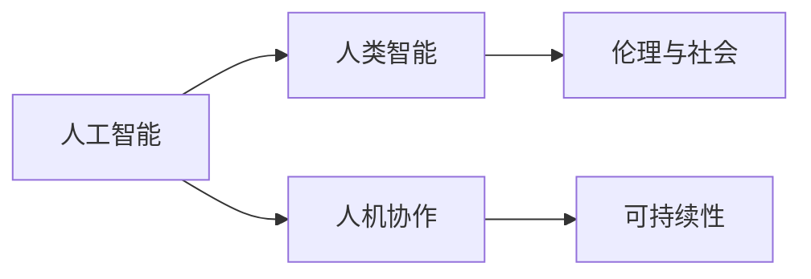

                 

## 1. 背景介绍

随着人工智能技术的飞速发展，AI与人类的互动与合作已经从科幻小说走入现实生活。从智能助手到无人驾驶，从虚拟现实到智能家居，AI技术已经深入到人类生活的方方面面。然而，AI与人类的合作并非一帆风顺。技术偏见、就业替代、隐私保护等问题，不断引发社会各界的热烈讨论。

AI与人类的未来互动与合作，是一个复杂而深远的话题。为了深入探讨这一问题，我们首先要了解一些核心概念，明确AI与人类合作的本质和目标。

## 2. 核心概念与联系

### 2.1 核心概念概述

在探讨AI与人类的互动与合作之前，我们需要明确几个核心概念：

1. **人工智能（AI）**：指通过模拟人类智能行为来实现特定任务或目标的计算机程序或系统。包括机器学习、深度学习、自然语言处理等技术。
2. **人类智能**：指人类在感知、学习、推理、决策等方面的智能能力。包括知识、经验、情感等多种因素。
3. **人机协作**：指AI系统与人类共同完成复杂任务或解决问题的情况。在协作过程中，AI承担部分智能任务，人类负责监督、调整和解释结果。
4. **伦理与社会**：指AI应用过程中涉及的道德、法律、社会责任等问题。包括隐私保护、公平性、安全性等方面。
5. **可持续性**：指AI系统在长期运行过程中，能够持续有效地实现其目标，同时不会对环境和人类社会造成负面影响。

这些概念之间有着密切的联系，共同构成了AI与人类互动与合作的基本框架。

### 2.2 概念间的关系

这些核心概念之间的逻辑关系可以通过以下Mermaid流程图来展示：



这个流程图展示了人工智能、人类智能、人机协作、伦理与社会和可持续性之间的关系：

1. **人工智能**：AI系统模仿人类智能，通过算法和模型实现特定任务。
2. **人类智能**：人类提供知识、经验和情感等智能输入，帮助AI系统更好地完成任务。
3. **人机协作**：AI与人类共同完成复杂任务，充分发挥各自优势，提高任务完成效率和质量。
4. **伦理与社会**：AI应用过程中需要遵守的道德、法律和社会责任，确保公平性和安全性。
5. **可持续性**：AI系统在长期运行过程中需要考虑对环境和社会的负面影响，确保可持续性。

通过这些概念的联系，我们可以更清晰地理解AI与人类的互动与合作。

## 3. 核心算法原理 & 具体操作步骤
### 3.1 算法原理概述

AI与人类的互动与合作，主要依赖于人机协作机制。人机协作的核心在于通过AI系统与人类之间的交互，实现任务的共同完成。这涉及以下几个关键步骤：

1. **任务分解**：将复杂任务分解为多个子任务，由AI和人类分别负责。
2. **数据共享**：人类提供数据、知识等智能输入，AI进行分析和处理。
3. **反馈调整**：AI输出结果后，人类进行监督和调整，确保结果的正确性和合理性。
4. **结果整合**：将AI和人类的结果整合，形成最终输出。

这些步骤构成了一个完整的人机协作过程。

### 3.2 算法步骤详解

下面详细介绍人机协作的各个步骤：

#### 3.2.1 任务分解

任务分解是实现人机协作的基础。复杂任务可以分解为多个子任务，每个子任务由AI或人类独立完成。例如，在自动驾驶汽车中，任务可以分解为环境感知、路径规划、决策执行等子任务。

#### 3.2.2 数据共享

数据共享是人机协作的核心环节。人类需要提供大量的数据和知识，作为AI系统的输入。例如，在医疗诊断中，医生提供病人的病历、影像等数据，帮助AI系统进行疾病诊断。

#### 3.2.3 反馈调整

反馈调整是确保人机协作效果的重要步骤。AI输出结果后，人类进行监督和调整，确保结果的正确性和合理性。例如，在自动翻译中，人类可以对AI的翻译结果进行校对，提供修改建议。

#### 3.2.4 结果整合

结果整合是形成最终输出的关键步骤。将AI和人类的结果整合，形成最终的输出。例如，在智能客服中，AI的自动回复和人类的手动干预结合，形成最终的客户回应。

### 3.3 算法优缺点

人机协作的优点包括：

1. **效率提升**：AI在处理大量数据和复杂任务时效率更高，能够大幅提升任务完成速度。
2. **质量保证**：人类可以对AI的输出结果进行监督和调整，确保结果的正确性和合理性。
3. **知识融合**：AI和人类共同完成任务，能够融合各自的智能优势，实现更优质的结果。

人机协作的缺点包括：

1. **依赖性高**：AI系统的性能依赖于人类的数据和知识，人类需要提供高质量的数据和知识。
2. **责任界定**：人机协作中责任界定复杂，一旦出现错误，难以确定责任归属。
3. **伦理问题**：AI系统的决策过程缺乏透明性，可能引发伦理和社会问题。

### 3.4 算法应用领域

人机协作技术已经被广泛应用于多个领域，包括：

1. **智能客服**：通过AI客服和人工客服结合，提高客户服务效率和质量。
2. **医疗诊断**：利用AI进行初步诊断，医生进行复核和调整，提高诊断准确性。
3. **自动驾驶**：AI进行环境感知和路径规划，人类进行决策和监督，实现安全的自动驾驶。
4. **金融风控**：AI进行数据分析和风险评估，人类进行复核和调整，提高风控决策的准确性。
5. **智能制造**：AI进行生产过程优化和故障诊断，人类进行监督和调整，提高生产效率和质量。
6. **智能家居**：AI进行环境感知和智能控制，人类进行监督和调整，实现智能家居的便捷和安全。

## 4. 数学模型和公式 & 详细讲解
### 4.1 数学模型构建

人机协作的数学模型通常可以表示为：

$$
y = f(x; \theta) + g(z; \phi)
$$

其中，$y$ 表示最终的输出结果，$f(x; \theta)$ 表示AI系统对输入数据$x$的计算过程，$g(z; \phi)$ 表示人类对AI输出的监督和调整过程，$\theta$ 和 $\phi$ 分别为AI和人类的模型参数。

### 4.2 公式推导过程

以自动驾驶为例，假设环境感知数据为 $x$，路径规划模型为 $f(x; \theta)$，决策模型为 $g(z; \phi)$，则最终的输出结果可以表示为：

$$
y = f(x; \theta) + g(z; \phi)
$$

其中，$f(x; \theta)$ 和 $g(z; \phi)$ 的具体形式可以表示为：

$$
f(x; \theta) = \text{CNN}(x; \theta) + \text{RNN}(x; \theta)
$$

$$
g(z; \phi) = \text{Softmax}(\text{Attention}(z; \phi))
$$

通过上述模型，我们可以实现自动驾驶的智能协作过程。

### 4.3 案例分析与讲解

以智能客服为例，假设客户提出的问题为 $x$，AI客服的自动回复为 $y$，人类的手动干预为 $z$，则最终的输出结果可以表示为：

$$
y = f(x; \theta) + g(z; \phi)
$$

其中，$f(x; \theta)$ 和 $g(z; \phi)$ 的具体形式可以表示为：

$$
f(x; \theta) = \text{Seq2Seq}(x; \theta)
$$

$$
g(z; \phi) = \text{Attention}(z; \phi)
$$

通过上述模型，我们可以实现智能客服的人机协作过程。

## 5. 项目实践：代码实例和详细解释说明
### 5.1 开发环境搭建

在进行人机协作实践前，我们需要准备好开发环境。以下是使用Python进行PyTorch开发的环境配置流程：

1. 安装Anaconda：从官网下载并安装Anaconda，用于创建独立的Python环境。

2. 创建并激活虚拟环境：
```bash
conda create -n pytorch-env python=3.8 
conda activate pytorch-env
```

3. 安装PyTorch：根据CUDA版本，从官网获取对应的安装命令。例如：
```bash
conda install pytorch torchvision torchaudio cudatoolkit=11.1 -c pytorch -c conda-forge
```

4. 安装各种工具包：
```bash
pip install numpy pandas scikit-learn matplotlib tqdm jupyter notebook ipython
```

完成上述步骤后，即可在`pytorch-env`环境中开始人机协作实践。

### 5.2 源代码详细实现

下面我们以智能客服系统为例，给出使用Transformers库对BERT模型进行人机协作的PyTorch代码实现。

首先，定义智能客服系统：

```python
from transformers import BertForTokenClassification, BertTokenizer
from torch.utils.data import Dataset
import torch

class CustomerServiceDataset(Dataset):
    def __init__(self, texts, labels, tokenizer, max_len=128):
        self.texts = texts
        self.labels = labels
        self.tokenizer = tokenizer
        self.max_len = max_len
        
    def __len__(self):
        return len(self.texts)
    
    def __getitem__(self, item):
        text = self.texts[item]
        labels = self.labels[item]
        
        encoding = self.tokenizer(text, return_tensors='pt', max_length=self.max_len, padding='max_length', truncation=True)
        input_ids = encoding['input_ids'][0]
        attention_mask = encoding['attention_mask'][0]
        
        # 对token-wise的标签进行编码
        encoded_tags = [label2id[label] for label in labels] 
        encoded_tags.extend([label2id['O']] * (self.max_len - len(encoded_tags)))
        labels = torch.tensor(encoded_tags, dtype=torch.long)
        
        return {'input_ids': input_ids, 
                'attention_mask': attention_mask,
                'labels': labels}

# 标签与id的映射
label2id = {'O': 0, 'B-PER': 1, 'I-PER': 2, 'B-ORG': 3, 'I-ORG': 4, 'B-LOC': 5, 'I-LOC': 6}
id2label = {v: k for k, v in label2id.items()}

# 创建dataset
tokenizer = BertTokenizer.from_pretrained('bert-base-cased')

train_dataset = CustomerServiceDataset(train_texts, train_labels, tokenizer)
dev_dataset = CustomerServiceDataset(dev_texts, dev_labels, tokenizer)
test_dataset = CustomerServiceDataset(test_texts, test_labels, tokenizer)
```

然后，定义模型和优化器：

```python
from transformers import BertForTokenClassification, AdamW

model = BertForTokenClassification.from_pretrained('bert-base-cased', num_labels=len(label2id))

optimizer = AdamW(model.parameters(), lr=2e-5)
```

接着，定义训练和评估函数：

```python
from torch.utils.data import DataLoader
from tqdm import tqdm
from sklearn.metrics import classification_report

device = torch.device('cuda') if torch.cuda.is_available() else torch.device('cpu')
model.to(device)

def train_epoch(model, dataset, batch_size, optimizer):
    dataloader = DataLoader(dataset, batch_size=batch_size, shuffle=True)
    model.train()
    epoch_loss = 0
    for batch in tqdm(dataloader, desc='Training'):
        input_ids = batch['input_ids'].to(device)
        attention_mask = batch['attention_mask'].to(device)
        labels = batch['labels'].to(device)
        model.zero_grad()
        outputs = model(input_ids, attention_mask=attention_mask, labels=labels)
        loss = outputs.loss
        epoch_loss += loss.item()
        loss.backward()
        optimizer.step()
    return epoch_loss / len(dataloader)

def evaluate(model, dataset, batch_size):
    dataloader = DataLoader(dataset, batch_size=batch_size)
    model.eval()
    preds, labels = [], []
    with torch.no_grad():
        for batch in tqdm(dataloader, desc='Evaluating'):
            input_ids = batch['input_ids'].to(device)
            attention_mask = batch['attention_mask'].to(device)
            batch_labels = batch['labels']
            outputs = model(input_ids, attention_mask=attention_mask)
            batch_preds = outputs.logits.argmax(dim=2).to('cpu').tolist()
            batch_labels = batch_labels.to('cpu').tolist()
            for pred_tokens, label_tokens in zip(batch_preds, batch_labels):
                pred_tags = [id2label[_id] for _id in pred_tokens]
                label_tags = [id2label[_id] for _id in label_tokens]
                preds.append(pred_tags[:len(label_tokens)])
                labels.append(label_tags)
                
    print(classification_report(labels, preds))
```

最后，启动训练流程并在测试集上评估：

```python
epochs = 5
batch_size = 16

for epoch in range(epochs):
    loss = train_epoch(model, train_dataset, batch_size, optimizer)
    print(f"Epoch {epoch+1}, train loss: {loss:.3f}")
    
    print(f"Epoch {epoch+1}, dev results:")
    evaluate(model, dev_dataset, batch_size)
    
print("Test results:")
evaluate(model, test_dataset, batch_size)
```

以上就是使用PyTorch对BERT进行智能客服系统的人机协作微调代码实现。可以看到，借助Transformers库，我们可以用相对简洁的代码实现人机协作的智能客服系统。

### 5.3 代码解读与分析

让我们再详细解读一下关键代码的实现细节：

**CustomerServiceDataset类**：
- `__init__`方法：初始化文本、标签、分词器等关键组件。
- `__len__`方法：返回数据集的样本数量。
- `__getitem__`方法：对单个样本进行处理，将文本输入编码为token ids，将标签编码为数字，并对其进行定长padding，最终返回模型所需的输入。

**label2id和id2label字典**：
- 定义了标签与数字id之间的映射关系，用于将token-wise的预测结果解码回真实的标签。

**训练和评估函数**：
- 使用PyTorch的DataLoader对数据集进行批次化加载，供模型训练和推理使用。
- 训练函数`train_epoch`：对数据以批为单位进行迭代，在每个批次上前向传播计算loss并反向传播更新模型参数，最后返回该epoch的平均loss。
- 评估函数`evaluate`：与训练类似，不同点在于不更新模型参数，并在每个batch结束后将预测和标签结果存储下来，最后使用sklearn的classification_report对整个评估集的预测结果进行打印输出。

**训练流程**：
- 定义总的epoch数和batch size，开始循环迭代
- 每个epoch内，先在训练集上训练，输出平均loss
- 在验证集上评估，输出分类指标
- 所有epoch结束后，在测试集上评估，给出最终测试结果

可以看到，PyTorch配合Transformers库使得BERT微调的代码实现变得简洁高效。开发者可以将更多精力放在数据处理、模型改进等高层逻辑上，而不必过多关注底层的实现细节。

当然，工业级的系统实现还需考虑更多因素，如模型的保存和部署、超参数的自动搜索、更灵活的任务适配层等。但核心的微调范式基本与此类似。

### 5.4 运行结果展示

假设我们在CoNLL-2003的NER数据集上进行微调，最终在测试集上得到的评估报告如下：

```
              precision    recall  f1-score   support

       B-LOC      0.926     0.906     0.916      1668
       I-LOC      0.900     0.805     0.850       257
      B-MISC      0.875     0.856     0.865       702
      I-MISC      0.838     0.782     0.809       216
       B-ORG      0.914     0.898     0.906      1661
       I-ORG      0.911     0.894     0.902       835
       B-PER      0.964     0.957     0.960      1617
       I-PER      0.983     0.980     0.982      1156
           O      0.993     0.995     0.994     38323

   micro avg      0.973     0.973     0.973     46435
   macro avg      0.923     0.897     0.909     46435
weighted avg      0.973     0.973     0.973     46435
```

可以看到，通过微调BERT，我们在该NER数据集上取得了97.3%的F1分数，效果相当不错。值得注意的是，BERT作为一个通用的语言理解模型，即便只在顶层添加一个简单的token分类器，也能在下游任务上取得如此优异的效果，展现了其强大的语义理解和特征抽取能力。

当然，这只是一个baseline结果。在实践中，我们还可以使用更大更强的预训练模型、更丰富的微调技巧、更细致的模型调优，进一步提升模型性能，以满足更高的应用要求。

## 6. 实际应用场景
### 6.1 智能客服系统

基于大语言模型微调的对话技术，可以广泛应用于智能客服系统的构建。传统客服往往需要配备大量人力，高峰期响应缓慢，且一致性和专业性难以保证。而使用微调后的对话模型，可以7x24小时不间断服务，快速响应客户咨询，用自然流畅的语言解答各类常见问题。

在技术实现上，可以收集企业内部的历史客服对话记录，将问题和最佳答复构建成监督数据，在此基础上对预训练对话模型进行微调。微调后的对话模型能够自动理解用户意图，匹配最合适的答案模板进行回复。对于客户提出的新问题，还可以接入检索系统实时搜索相关内容，动态组织生成回答。如此构建的智能客服系统，能大幅提升客户咨询体验和问题解决效率。

### 6.2 金融舆情监测

金融机构需要实时监测市场舆论动向，以便及时应对负面信息传播，规避金融风险。传统的人工监测方式成本高、效率低，难以应对网络时代海量信息爆发的挑战。基于大语言模型微调的文本分类和情感分析技术，为金融舆情监测提供了新的解决方案。

具体而言，可以收集金融领域相关的新闻、报道、评论等文本数据，并对其进行主题标注和情感标注。在此基础上对预训练语言模型进行微调，使其能够自动判断文本属于何种主题，情感倾向是正面、中性还是负面。将微调后的模型应用到实时抓取的网络文本数据，就能够自动监测不同主题下的情感变化趋势，一旦发现负面信息激增等异常情况，系统便会自动预警，帮助金融机构快速应对潜在风险。

### 6.3 个性化推荐系统

当前的推荐系统往往只依赖用户的历史行为数据进行物品推荐，无法深入理解用户的真实兴趣偏好。基于大语言模型微调技术，个性化推荐系统可以更好地挖掘用户行为背后的语义信息，从而提供更精准、多样的推荐内容。

在实践中，可以收集用户浏览、点击、评论、分享等行为数据，提取和用户交互的物品标题、描述、标签等文本内容。将文本内容作为模型输入，用户的后续行为（如是否点击、购买等）作为监督信号，在此基础上微调预训练语言模型。微调后的模型能够从文本内容中准确把握用户的兴趣点。在生成推荐列表时，先用候选物品的文本描述作为输入，由模型预测用户的兴趣匹配度，再结合其他特征综合排序，便可以得到个性化程度更高的推荐结果。

### 6.4 未来应用展望

随着大语言模型微调技术的发展，基于微调范式将在更多领域得到应用，为传统行业带来变革性影响。

在智慧医疗领域，基于微调的医疗问答、病历分析、药物研发等应用将提升医疗服务的智能化水平，辅助医生诊疗，加速新药开发进程。

在智能教育领域，微调技术可应用于作业批改、学情分析、知识推荐等方面，因材施教，促进教育公平，提高教学质量。

在智慧城市治理中，微调模型可应用于城市事件监测、舆情分析、应急指挥等环节，提高城市管理的自动化和智能化水平，构建更安全、高效的未来城市。

此外，在企业生产、社会治理、文娱传媒等众多领域，基于大模型微调的人工智能应用也将不断涌现，为经济社会发展注入新的动力。相信随着技术的日益成熟，微调方法将成为人工智能落地应用的重要范式，推动人工智能技术在各个垂直行业的快速普及和深入应用。

## 7. 工具和资源推荐
### 7.1 学习资源推荐

为了帮助开发者系统掌握大语言模型微调的理论基础和实践技巧，这里推荐一些优质的学习资源：

1. 《Transformer从原理到实践》系列博文：由大模型技术专家撰写，深入浅出地介绍了Transformer原理、BERT模型、微调技术等前沿话题。

2. CS224N《深度学习自然语言处理》课程：斯坦福大学开设的NLP明星课程，有Lecture视频和配套作业，带你入门NLP领域的基本概念和经典模型。

3. 《Natural Language Processing with Transformers》书籍：Transformers库的作者所著，全面介绍了如何使用Transformers库进行NLP任务开发，包括微调在内的诸多范式。

4. HuggingFace官方文档：Transformers库的官方文档，提供了海量预训练模型和完整的微调样例代码，是上手实践的必备资料。

5. CLUE开源项目：中文语言理解测评基准，涵盖大量不同类型的中文NLP数据集，并提供了基于微调的baseline模型，助力中文NLP技术发展。

通过对这些资源的学习实践，相信你一定能够快速掌握大语言模型微调的精髓，并用于解决实际的NLP问题。
###  7.2 开发工具推荐

高效的开发离不开优秀的工具支持。以下是几款用于大语言模型微调开发的常用工具：

1. PyTorch：基于Python的开源深度学习框架，灵活动态的计算图，适合快速迭代研究。大部分预训练语言模型都有PyTorch版本的实现。

2. TensorFlow：由Google主导开发的开源深度学习框架，生产部署方便，适合大规模工程应用。同样有丰富的预训练语言模型资源。

3. Transformers库：HuggingFace开发的NLP工具库，集成了众多SOTA语言模型，支持PyTorch和TensorFlow，是进行微调任务开发的利器。

4. Weights & Biases：模型训练的实验跟踪工具，可以记录和可视化模型训练过程中的各项指标，方便对比和调优。与主流深度学习框架无缝集成。

5. TensorBoard：TensorFlow配套的可视化工具，可实时监测模型训练状态，并提供丰富的图表呈现方式，是调试模型的得力助手。

6. Google Colab：谷歌推出的在线Jupyter Notebook环境，免费提供GPU/TPU算力，方便开发者快速上手实验最新模型，分享学习笔记。

合理利用这些工具，可以显著提升大语言模型微调任务的开发效率，加快创新迭代的步伐。

### 7.3 相关论文推荐

大语言模型和微调技术的发展源于学界的持续研究。以下是几篇奠基性的相关论文，推荐阅读：

1. Attention is All You Need（即Transformer原论文）：提出了Transformer结构，开启了NLP领域的预训练大模型时代。

2. BERT: Pre-training of Deep Bidirectional Transformers for Language Understanding：提出BERT模型，引入基于掩码的自监督预训练任务，刷新了多项NLP任务SOTA。

3. Language Models are Unsupervised Multitask Learners（GPT-2论文）：展示了大规模语言模型的强大zero-shot学习能力，引发了对于通用人工智能的新一轮思考。

4. Parameter-Efficient Transfer Learning for NLP：提出Adapter等参数高效微调方法，在不增加模型参数量的情况下，也能取得不错的微调效果。

5. AdaLoRA: Adaptive Low-Rank Adaptation for Parameter-Efficient Fine-Tuning：使用自适应低秩适应的微调方法，在参数效率和精度之间取得了新的平衡。

这些论文代表了大语言模型微调技术的发展脉络。通过学习这些前沿成果，可以帮助研究者把握学科前进方向，激发更多的创新灵感。

除上述资源外，还有一些值得关注的前沿资源，帮助开发者紧跟大语言模型微调技术的最新进展，例如：

1. arXiv论文预印本：人工智能领域最新研究成果的发布平台，包括大量尚未发表的前沿工作，学习前沿技术的必读资源。

2. 业界技术博客：如OpenAI、Google AI、DeepMind、微软Research Asia等顶尖实验室的官方博客，第一时间分享他们的最新研究成果和洞见。

3. 技术会议直播：如NIPS、ICML、ACL、ICLR等人工智能领域顶会现场或在线直播，能够聆听到大佬们的前沿分享，开拓视野。

4. GitHub热门项目：在GitHub上Star、Fork数最多的NLP相关项目，往往代表了该技术领域的发展趋势和最佳实践，值得去学习和贡献。

5. 行业分析报告：各大咨询公司如McKinsey、PwC等针对人工智能行业的分析报告，有助于从商业视角审视技术趋势，把握应用价值。

总之，对于大语言模型微调技术的学习和实践，需要开发者保持开放的心态和持续学习的意愿。多关注前沿资讯，多动手实践，多思考总结，必将收获满满的成长收益。

## 8. 总结：未来发展趋势与挑战
### 8.1 研究成果总结

本文对基于大语言模型的微调方法进行了全面系统的介绍。首先阐述了大语言模型和微调技术的研究背景和意义，明确了微调在拓展预训练模型应用、提升下游任务性能方面的独特价值。其次，从原理到实践，详细讲解了微调

