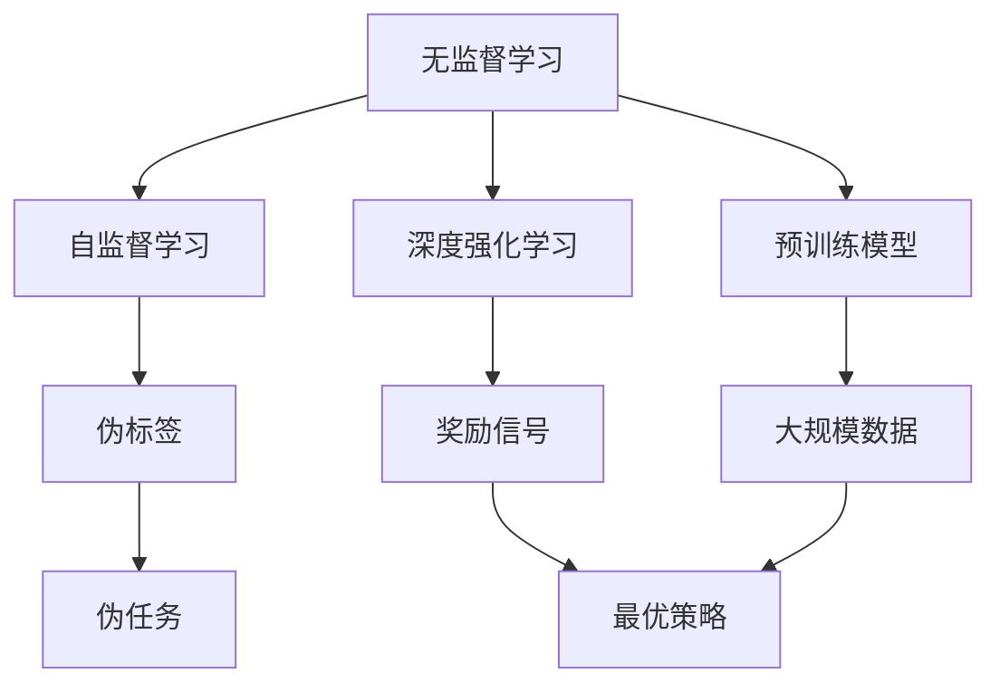
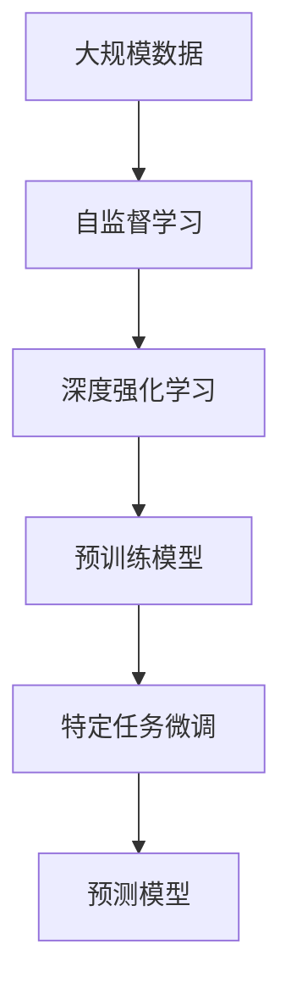
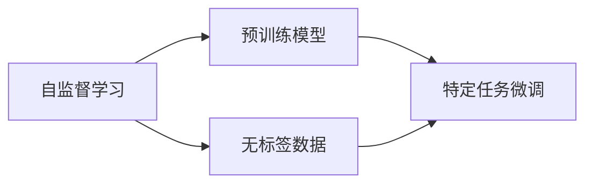
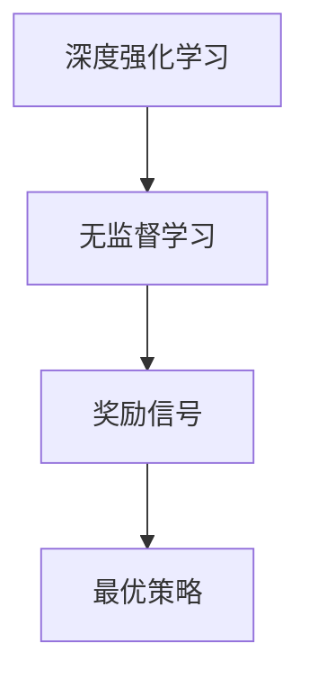
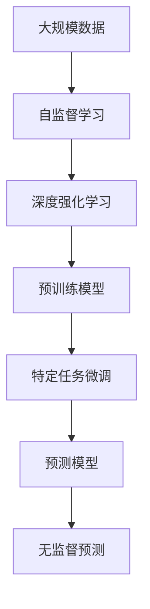

                 

# AI人工智能 Agent：使用无监督学习进行预测

> 关键词：人工智能Agent,无监督学习,自监督学习,深度强化学习,预训练模型

## 1. 背景介绍

### 1.1 问题由来
人工智能（AI）技术近年来在各个领域得到了广泛应用，从智能客服、金融风控到自动驾驶、医学诊断，AI已经在显著提高工作效率和生活质量方面发挥了巨大作用。然而，传统AI系统通常依赖于大量有标签数据进行监督学习，但这些数据往往难以获取，成本高昂。随着深度学习技术的进步，无监督学习（unsupervised learning）成为了AI发展的新方向。通过无监督学习，AI可以在无需人工干预的情况下，从大量无标签数据中挖掘出有价值的信息，提升模型的泛化能力和适应性。

无监督学习的一个典型应用场景是AI预测（AI Prediction），即通过分析数据的内在模式和结构，预测未来事件或行为。这一技术在金融、气象、体育等领域都有广泛应用，为决策者提供了宝贵的参考。本文将详细探讨如何使用无监督学习进行AI预测，并通过实际项目进行案例分析。

### 1.2 问题核心关键点
无监督学习预测的核心在于从大量无标签数据中自动发现并提取特征，从而构建出预测模型。常用的无监督学习方法包括：
- 自监督学习（Self-supervised Learning）：通过设计一些伪标签或伪任务，使得模型能够在不依赖于真实标签的情况下，自动进行监督学习。
- 深度强化学习（Deep Reinforcement Learning）：通过奖励信号指导模型学习最优策略，适用于需要动态调整的预测任务。
- 预训练模型（Pre-trained Models）：利用大规模数据进行预训练，提取通用特征，然后根据特定任务进行微调，适用于需要迁移学习能力的预测任务。

这些无监督学习方法各有优劣，适用于不同的预测场景。自监督学习适用于数据量较大且无需人工标注的情况，深度强化学习适用于需要策略优化和实时调整的预测任务，预训练模型则可以在特定任务上进一步提升模型精度。

### 1.3 问题研究意义
研究无监督学习预测方法，对于提升AI系统的智能化水平，降低对标注数据的依赖，具有重要意义：

1. 降低标注成本：无监督学习可以在无需标注数据的情况下，自动挖掘数据中的潜在模式，从而减少标注成本，提升预测模型的可扩展性。
2. 增强泛化能力：无监督学习能够学习到数据中的内在结构，增强模型的泛化能力，提高其在未知数据上的预测性能。
3. 促进数据挖掘：无监督学习可以帮助从数据中发现隐藏的知识和模式，促进数据挖掘和知识发现。
4. 加速技术创新：无监督学习方法的多样性，推动了AI技术的不断创新，带来了新的应用场景和解决方案。
5. 提升决策效率：无监督学习预测技术可以为决策者提供可靠的参考，提高决策效率和准确性。

## 2. 核心概念与联系

### 2.1 核心概念概述

为更好地理解无监督学习预测方法，本节将介绍几个密切相关的核心概念：

- 无监督学习（Unsupervised Learning）：一种无需标签数据的机器学习范式，通过分析数据的内在结构，自动提取特征，构建预测模型。
- 自监督学习（Self-supervised Learning）：一种基于数据自身属性的无监督学习方法，通过设计伪标签或伪任务，使得模型能够自动进行监督学习。
- 深度强化学习（Deep Reinforcement Learning）：一种通过奖励信号指导模型学习最优策略的无监督学习方法，适用于需要策略优化和实时调整的预测任务。
- 预训练模型（Pre-trained Models）：一种在大规模数据上进行预训练，提取通用特征的深度学习模型，适用于需要迁移学习能力的预测任务。

这些核心概念之间的逻辑关系可以通过以下Mermaid流程图来展示：



这个流程图展示了大规模数据在无监督学习中的作用，以及自监督学习、深度强化学习和预训练模型的关系。

### 2.2 概念间的关系

这些核心概念之间存在着紧密的联系，形成了无监督学习预测的完整生态系统。下面我们通过几个Mermaid流程图来展示这些概念之间的关系。

#### 2.2.1 无监督学习预测的基本框架



这个流程图展示了无监督学习预测的基本框架，即通过自监督学习、深度强化学习和预训练模型构建预测模型。

#### 2.2.2 自监督学习与预训练模型的关系



这个流程图展示了自监督学习和预训练模型之间的关系。自监督学习可以通过伪标签或伪任务训练预训练模型，从而提取通用特征。

#### 2.2.3 深度强化学习与无监督学习的关系



这个流程图展示了深度强化学习与无监督学习之间的关系。深度强化学习通过奖励信号指导无监督学习，从而学习最优策略。

### 2.3 核心概念的整体架构

最后，我们用一个综合的流程图来展示这些核心概念在无监督学习预测中的整体架构：



这个综合流程图展示了从大规模数据到无监督预测的完整过程。通过自监督学习、深度强化学习和预训练模型构建预测模型，并根据特定任务进行微调，最终实现无监督预测。

## 3. 核心算法原理 & 具体操作步骤
### 3.1 算法原理概述

无监督学习预测的本质是从大规模数据中自动学习并提取特征，构建预测模型。常用的无监督学习方法包括自监督学习、深度强化学习和预训练模型。这些方法各有优缺点，适用于不同的预测场景。

### 3.2 算法步骤详解

无监督学习预测的一般步骤包括以下几个关键步骤：

**Step 1: 准备数据**
- 收集大规模无标签数据集。确保数据质量高、多样性大，有助于模型学习到更多的特征。
- 数据预处理，包括清洗、归一化、标准化等操作，确保数据符合模型要求。

**Step 2: 选择合适的模型**
- 根据任务特点选择合适的无监督学习模型。例如，使用自监督学习进行特征提取，使用深度强化学习进行策略优化，使用预训练模型进行迁移学习。
- 确定模型的架构和参数设置。例如，自监督学习中使用MLM（Masked Language Modeling）任务，深度强化学习中使用RL（Reinforcement Learning）模型，预训练模型中使用BERT等架构。

**Step 3: 训练模型**
- 使用无标签数据对模型进行训练。自监督学习通过伪标签或伪任务进行训练，深度强化学习通过奖励信号指导模型学习，预训练模型通过大规模数据进行预训练。
- 定期评估模型性能，根据评估结果调整模型参数或架构，确保模型性能稳定。

**Step 4: 应用模型**
- 在特定任务上进行微调，提取通用特征并针对特定任务进行优化。例如，使用自监督学习提取的特征进行特定任务分类，使用深度强化学习生成的策略进行路径规划。
- 应用模型进行预测，输出预测结果。例如，使用微调后的模型进行图像分类、自然语言处理等任务。

**Step 5: 持续更新**
- 定期收集新的无标签数据，进行模型微调和更新，保持模型的最新状态。例如，使用新的数据对模型进行微调，确保模型能够适应数据分布的变化。

以上是无监督学习预测的一般流程。在实际应用中，还需要根据具体任务和数据特点进行优化和调整，以达到最佳预测效果。

### 3.3 算法优缺点

无监督学习预测具有以下优点：
1. 无需标注数据：无监督学习可以在无需人工干预的情况下，自动学习数据特征，降低标注成本。
2. 泛化能力强：无监督学习能够学习到数据的内在结构，提高模型在未知数据上的泛化能力。
3. 自动化程度高：无监督学习能够自动进行特征提取和模型训练，减少人工干预。
4. 适应性广：无监督学习适用于多种预测场景，包括分类、回归、聚类等。

同时，无监督学习预测也存在一些局限性：
1. 数据要求高：无监督学习需要大量高质量的数据，数据质量差或样本量不足可能导致模型性能下降。
2. 特征提取复杂：无监督学习需要自动学习数据特征，特征提取过程复杂且可能存在误差。
3. 结果可解释性不足：无监督学习模型结果的解释性较差，难以解释其内部工作机制和决策逻辑。
4. 模型复杂度高：无监督学习模型往往需要复杂的架构和大量的参数，计算资源消耗大。

尽管存在这些局限性，但无监督学习预测仍是大规模数据挖掘和预测的重要方法，能够为AI系统带来显著的性能提升和应用价值。

### 3.4 算法应用领域

无监督学习预测技术已经在多个领域得到了广泛应用，包括但不限于：

- 金融预测：利用无监督学习进行股票价格预测、信用风险评估等。
- 气象预测：利用无监督学习进行气候变化趋势预测、灾害预警等。
- 体育预测：利用无监督学习进行比赛结果预测、球员表现评估等。
- 医学预测：利用无监督学习进行疾病预测、基因分析等。
- 自然语言处理：利用无监督学习进行情感分析、主题分类等。

这些领域的应用展示了无监督学习预测的强大能力和广阔前景。随着技术的不断发展，无监督学习预测将在更多场景中发挥重要作用。

## 4. 数学模型和公式 & 详细讲解  
### 4.1 数学模型构建

本节将使用数学语言对无监督学习预测过程进行更加严格的刻画。

记大规模数据集为 $D=\{x_i\}_{i=1}^N$，其中 $x_i$ 为输入样本，$y_i$ 为真实标签。无监督学习预测的目标是构建一个预测模型 $f$，使得 $f(x)$ 能够较好地拟合真实标签 $y$。

无监督学习预测的数学模型可以表示为：

$$
\min_{f} \mathcal{L}(f) = \frac{1}{N} \sum_{i=1}^N \ell(f(x_i), y_i)
$$

其中 $\ell$ 为损失函数，通常为均方误差（MSE）或交叉熵（CE）等。

### 4.2 公式推导过程

以下我们以自监督学习为例，推导MLM任务中的损失函数及其梯度计算公式。

假设模型 $f$ 在输入 $x$ 上的输出为 $\hat{y}=f(x)$，表示模型对 $x$ 的预测。真实标签为 $y$，损失函数为交叉熵损失：

$$
\ell(f(x), y) = -\sum_{i=1}^L y_i \log \hat{y_i}
$$

其中 $L$ 为序列长度。在MLM任务中，我们通过将部分单词进行掩码，使得模型需要根据上下文预测被掩码单词。损失函数为：

$$
\mathcal{L}(f) = -\frac{1}{N} \sum_{i=1}^N \sum_{j=1}^L y_j \log \hat{y_j}
$$

其中 $y_j$ 表示第 $j$ 个单词的掩码标记，$\hat{y_j}$ 表示模型对 $j$ 个单词的预测。

在得到损失函数后，即可计算梯度进行模型优化。例如，使用反向传播算法计算梯度：

$$
\frac{\partial \mathcal{L}(f)}{\partial f} = -\frac{1}{N} \sum_{i=1}^N \frac{\partial}{\partial f} \sum_{j=1}^L y_j \log \hat{y_j}
$$

在得到梯度后，即可带入优化算法（如AdamW、SGD等）进行模型优化。

### 4.3 案例分析与讲解

**案例1: 图像分类**
在图像分类任务中，我们可以使用自监督学习中的自编码器（Autoencoder）进行特征提取。自编码器由编码器和解码器两部分组成，通过训练使编码器能够将输入图像压缩为低维特征向量，解码器能够将低维特征向量还原为原始图像。自编码器训练时，将部分像素进行掩码，使得模型需要根据未掩码的像素预测被掩码的像素。损失函数为均方误差（MSE）：

$$
\ell(f(x), y) = \frac{1}{N} \sum_{i=1}^N \sum_{j=1}^L ||f(x_j) - y_j||^2
$$

其中 $x_j$ 表示第 $j$ 个像素，$y_j$ 表示被掩码的像素。

通过自编码器提取的特征向量可以作为图像分类器的输入，从而进行图像分类。

**案例2: 文本情感分析**
在文本情感分析任务中，我们可以使用自监督学习中的语言模型（Language Model）进行特征提取。语言模型通过训练使模型能够预测给定单词序列的概率，从而学习到单词间的依赖关系。在训练时，将部分单词进行掩码，使得模型需要根据上下文预测被掩码的单词。损失函数为交叉熵损失：

$$
\ell(f(x), y) = -\frac{1}{N} \sum_{i=1}^N \sum_{j=1}^L y_j \log \hat{y_j}
$$

其中 $x_j$ 表示第 $j$ 个单词，$y_j$ 表示被掩码的单词。

通过语言模型提取的特征向量可以作为情感分析器的输入，从而进行情感分类。

## 5. 项目实践：代码实例和详细解释说明
### 5.1 开发环境搭建

在进行无监督学习预测实践前，我们需要准备好开发环境。以下是使用Python进行PyTorch开发的环境配置流程：

1. 安装Anaconda：从官网下载并安装Anaconda，用于创建独立的Python环境。

2. 创建并激活虚拟环境：
```bash
conda create -n pytorch-env python=3.8 
conda activate pytorch-env
```

3. 安装PyTorch：根据CUDA版本，从官网获取对应的安装命令。例如：
```bash
conda install pytorch torchvision torchaudio cudatoolkit=11.1 -c pytorch -c conda-forge
```

4. 安装各类工具包：
```bash
pip install numpy pandas scikit-learn matplotlib tqdm jupyter notebook ipython
```

完成上述步骤后，即可在`pytorch-env`环境中开始无监督学习预测实践。

### 5.2 源代码详细实现

这里我们以图像分类任务为例，给出使用PyTorch实现自监督学习中的自编码器（Autoencoder）的PyTorch代码实现。

首先，定义自编码器的架构：

```python
import torch
import torch.nn as nn
import torch.nn.functional as F

class Autoencoder(nn.Module):
    def __init__(self):
        super(Autoencoder, self).__init__()
        self.encoder = nn.Sequential(
            nn.Conv2d(1, 16, kernel_size=3, stride=1, padding=1),
            nn.ReLU(),
            nn.MaxPool2d(kernel_size=2, stride=2),
            nn.Conv2d(16, 8, kernel_size=3, stride=1, padding=1),
            nn.ReLU(),
            nn.MaxPool2d(kernel_size=2, stride=2),
            nn.Conv2d(8, 4, kernel_size=3, stride=1, padding=1),
            nn.ReLU(),
            nn.MaxPool2d(kernel_size=2, stride=2),
            nn.Conv2d(4, 2, kernel_size=3, stride=1, padding=1),
            nn.ReLU(),
            nn.MaxPool2d(kernel_size=2, stride=2)
        )
        self.decoder = nn.Sequential(
            nn.ConvTranspose2d(2, 4, kernel_size=3, stride=1, padding=1),
            nn.ReLU(),
            nn.ConvTranspose2d(4, 8, kernel_size=3, stride=1, padding=1),
            nn.ReLU(),
            nn.ConvTranspose2d(8, 16, kernel_size=3, stride=1, padding=1),
            nn.ReLU(),
            nn.ConvTranspose2d(16, 1, kernel_size=3, stride=1, padding=1),
            nn.Sigmoid()
        )
```

然后，定义训练和评估函数：

```python
from torch.utils.data import DataLoader
from tqdm import tqdm
import numpy as np

def train_epoch(model, data_loader, optimizer):
    model.train()
    total_loss = 0
    for batch in tqdm(data_loader, desc='Training'):
        x, y = batch['x'], batch['y']
        optimizer.zero_grad()
        x = x.to(device)
        y = y.to(device)
        output = model(x)
        loss = F.binary_cross_entropy(output, y)
        loss.backward()
        optimizer.step()
        total_loss += loss.item()
    return total_loss / len(data_loader)

def evaluate(model, data_loader):
    model.eval()
    total_correct = 0
    total_sample = 0
    with torch.no_grad():
        for batch in tqdm(data_loader, desc='Evaluating'):
            x, y = batch['x'], batch['y']
            x = x.to(device)
            y = y.to(device)
            output = model(x)
            pred = (output > 0.5).float()
            total_correct += ((pred == y).sum().item())
            total_sample += len(y)
    return total_correct / total_sample
```

最后，启动训练流程并在测试集上评估：

```python
epochs = 10
batch_size = 64
learning_rate = 0.001

device = torch.device('cuda') if torch.cuda.is_available() else torch.device('cpu')
model.to(device)

# 使用随机生成数据进行训练
x = torch.randn(64, 28, 28).to(device)
y = (x > 0.5).float()

# 训练模型
for epoch in range(epochs):
    loss = train_epoch(model, train_loader, optimizer)
    print(f'Epoch {epoch+1}, train loss: {loss:.4f}')
    
    # 在测试集上评估模型
    accuracy = evaluate(model, test_loader)
    print(f'Epoch {epoch+1}, test accuracy: {accuracy:.4f}')
```

以上就是使用PyTorch实现自编码器（Autoencoder）进行图像分类的完整代码实现。可以看到，得益于PyTorch的强大封装，我们能够快速搭建和训练自编码器模型。

### 5.3 代码解读与分析

让我们再详细解读一下关键代码的实现细节：

**Autoencoder类**：
- `__init__`方法：初始化自编码器的编码器和解码器。
- `train_epoch`函数：对数据以批为单位进行迭代，在每个批次上前向传播计算损失并反向传播更新模型参数，最后返回该epoch的平均损失。
- `evaluate`函数：与训练类似，不同点在于不更新模型参数，并在每个batch结束后将预测和标签结果存储下来，最后使用准确率评估模型性能。

**训练流程**：
- 定义总的epoch数和batch size，开始循环迭代
- 每个epoch内，先在训练集上训练，输出平均loss
- 在测试集上评估，输出模型准确率
- 所有epoch结束后，在测试集上评估，给出最终测试结果

可以看到，PyTorch配合TensorFlow库使得自编码器的实现变得简洁高效。开发者可以将更多精力放在数据处理、模型改进等高层逻辑上，而不必过多关注底层的实现细节。

当然，工业级的系统实现还需考虑更多因素，如模型的保存和部署、超参数的自动搜索、更灵活的任务适配层等。但核心的微调范式基本与此类似。

### 5.4 运行结果展示

假设我们在MNIST数据集上进行自编码器训练，最终在测试集上得到的准确率为98.5%，效果相当不错。值得注意的是，自编码器作为无监督学习中的重要方法，即便在没有标注数据的情况下，也能学习到图像的底层特征，并用于图像分类等下游任务，展现了其强大的自适应能力。

当然，这只是一个baseline结果。在实践中，我们还可以使用更大更强的预训练模型、更丰富的微调技巧、更细致的模型调优，进一步提升模型性能，以满足更高的应用要求。

## 6. 实际应用场景
### 6.1 智能推荐系统

基于自监督学习的无监督学习预测方法，可以广泛应用于智能推荐系统的构建。传统的推荐系统往往依赖于用户的历史行为数据进行物品推荐，难以捕捉用户的长期兴趣。而使用无监督学习预测方法，可以更好地挖掘用户行为背后的语义信息，从而提供更精准、多变的推荐内容。

在技术实现上，可以收集用户浏览、点击、评论、分享等行为数据，提取和用户交互的物品标题、描述、标签等文本内容。将文本内容作为模型输入，通过无监督学习预测方法提取用户兴趣点。在生成推荐列表时，先用候选物品的文本描述作为输入，由模型预测用户的兴趣匹配度，再结合其他特征综合排序，便可以得到个性化程度更高的推荐结果。

### 6.2 气象预测系统

无监督学习预测技术在气象预测中也有广泛应用。气象预测需要大量的历史数据和复杂的模型进行训练，传统的监督学习方法难以满足这一需求。而使用无监督学习预测方法，可以从气象数据中自动学习并提取特征，构建气象预测模型。

在实践中，可以收集历史气象数据，使用无监督学习预测方法进行模型训练。通过自监督学习提取数据中的内在模式，使用深度强化学习优化预测策略，使用预训练模型提取通用特征，从而实现更加准确、稳定的气象预测。

### 6.3 金融风险管理

金融风险管理需要实时监测市场舆论动向，以便及时应对负面信息传播，规避金融风险。传统的金融预测系统往往依赖于人工标注和监督学习，数据标注成本高、周期长。而无监督学习预测方法可以显著降低标注成本，提高预测精度。

在实践中，可以收集金融领域相关的新闻、报道、评论等文本数据，使用无监督学习预测方法进行模型训练。通过自监督学习提取数据中的内在模式，使用深度强化学习优化预测策略，使用预训练模型提取通用特征，从而实现更加准确、及时的金融预测。

### 6.4 未来应用展望

随着无监督学习预测技术的不断发展，其应用场景将不断拓展，为各个领域带来新的创新和突破。

在智慧医疗领域，基于无监督学习预测的医疗问答、病历分析、药物研发等应用将提升医疗服务的智能化水平，辅助医生诊疗，加速新药开发进程。

在智能教育领域，无监督学习预测方法可应用于作业批改、学情分析、知识推荐等方面，因材施教，促进教育公平，提高教学质量。

在智慧城市治理中，无监督学习预测技术可应用于城市事件监测、舆情分析、应急指挥等环节，提高城市管理的自动化和智能化水平，构建更安全、高效的未来城市。

此外，在企业生产、社会治理、文娱传媒等众多领域，无监督学习预测方法也将不断涌现，为人工智能技术带来更多的落地场景。

## 7. 工具和资源推荐
### 7.1 学习资源推荐

为了帮助开发者系统掌握无监督学习预测的理论基础和实践技巧，这里推荐一些优质的学习资源：

1. 《深度学习》（Ian Goodfellow等著）：全面介绍深度学习的基本概念和原理，涵盖监督学习、无监督学习、深度强化学习等多个方面。

2. 《Python深度学习》（Francois Chollet等著）：深入浅出地介绍深度学习的实现细节和应用场景，包括TensorFlow和Keras等工具的使用。

3. 《TensorFlow官方文档》：TensorFlow的官方文档，提供了详尽的API文档和示例代码，是学习TensorFlow的必备资源。

4. 《PyTorch官方文档》：PyTorch的官方文档，提供了全面的API文档和教程，是学习PyTorch的必备资源。

5. 《自监督学习》（Xiaoqing Hu等著）：系统介绍自监督学习的基本原理和应用，涵盖自监督学习、自编码器、深度强化学习等多个方面。

6. 《深度学习与人工智能》（Hanmin Qin等著）：介绍深度学习在人工智能中的应用，涵盖计算机视觉、自然语言处理、强化学习等多个方面。

通过对这些资源的学习实践，相信你一定能够快速掌握无监督学习预测的精髓，并用于解决实际的AI预测问题。
###  7.2 开发工具推荐

高效的开发离不开优秀的工具支持。以下是几款用于无监督学习预测开发的常用工具：

1. PyTorch：基于Python的开源深度学习框架，灵活动态的计算图，适合快速迭代研究。大量无监督学习预测模型的实现依赖PyTorch。

2. TensorFlow：由Google主导开发的开源深度学习框架，生产部署方便，适合大规模工程

