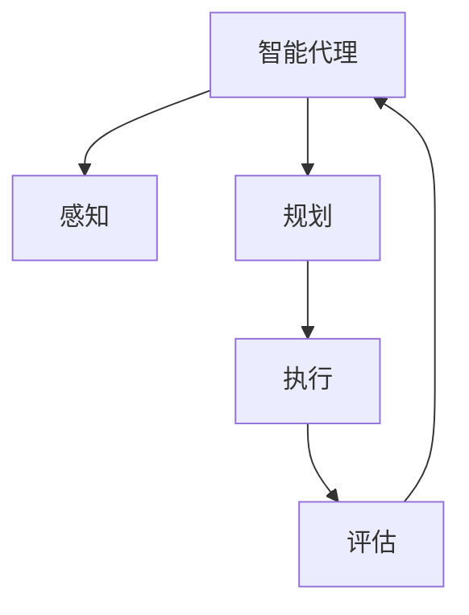
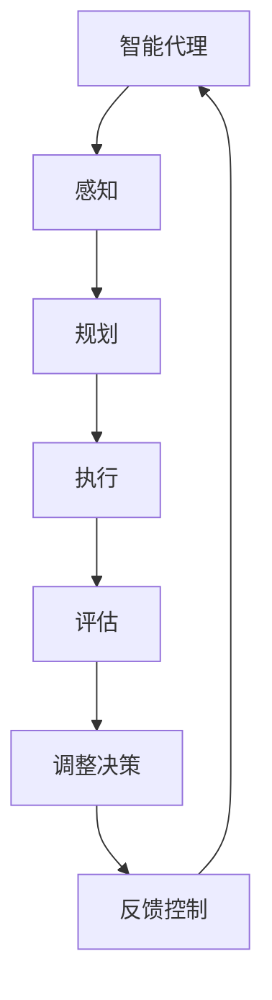
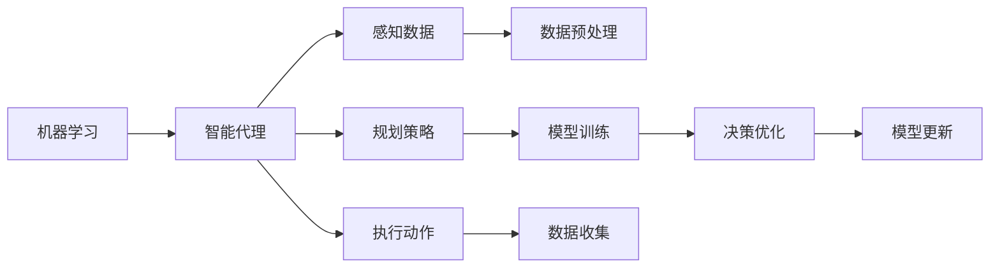
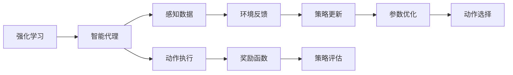
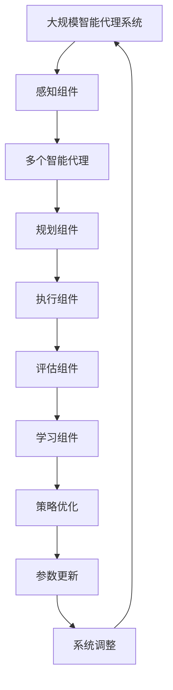

                 

# AI人工智能 Agent：基础理论解析

> 关键词：人工智能,智能代理,机器学习,深度学习,强化学习,多智能体,合作与竞争

## 1. 背景介绍

### 1.1 问题由来

随着人工智能技术的飞速发展，智能代理(Agent)的概念正变得越来越流行。智能代理是具有自主决策能力的实体，可以自适应环境变化，自主完成任务。智能代理的应用领域非常广泛，包括机器人、自动化交易系统、无人驾驶车辆、智能客服等。然而，智能代理的设计和实现面临着诸多挑战，尤其是如何让智能代理在复杂、动态环境中做出正确的决策。

本论文将从基础理论出发，深入解析人工智能Agent的原理、架构和设计方法。我们首先介绍智能代理的基本概念、组成和类型，然后详细介绍机器学习、深度学习和强化学习等关键技术。最后，我们将通过几个经典案例，探讨智能代理在实际应用中的具体应用和挑战。

### 1.2 问题核心关键点

本论文的核心关键点包括以下几个方面：

1. **智能代理的基本概念**：智能代理是一种自主决策的实体，可以感知环境、执行任务并做出决策。
2. **机器学习与深度学习**：机器学习是智能代理的核心技术之一，通过学习数据来提高决策能力。深度学习则是机器学习的一种高级形式，通过多层神经网络来提取数据特征。
3. **强化学习**：强化学习是一种试错学习方式，通过环境反馈来优化决策策略。
4. **多智能体系统**：多智能体系统由多个智能代理组成，它们可以合作或竞争，共同完成任务。
5. **智能代理的设计方法**：包括智能代理的感知、规划、执行和评估等关键组件的设计。

## 2. 核心概念与联系

### 2.1 核心概念概述

为了更好地理解智能代理的基础理论，本节将介绍几个密切相关的核心概念：

- **智能代理**：一种自主决策的实体，具有感知、规划、执行和评估等功能。智能代理的目标是最大化其效用函数。
- **感知**：智能代理感知环境，收集数据和信息，以便做出决策。感知可以基于传感器数据、图像、语音等。
- **规划**：智能代理根据感知到的环境信息，选择最佳的行动方案。规划可以通过搜索、优化等方法实现。
- **执行**：智能代理根据规划结果执行相应的动作，以影响环境。
- **评估**：智能代理通过环境反馈来评估其决策效果，进行学习和调整。

这些核心概念通过以下Mermaid流程图来展示：



### 2.2 概念间的关系

这些核心概念之间存在着紧密的联系，形成了智能代理的核心工作流程。下面通过几个Mermaid流程图来展示这些概念之间的关系。

#### 2.2.1 智能代理的基本工作流程



这个流程图展示了智能代理的基本工作流程，即感知-规划-执行-评估-调整决策-反馈控制的循环过程。

#### 2.2.2 机器学习与智能代理的关系



这个流程图展示了机器学习在智能代理中的作用，即通过感知数据训练模型，优化决策策略，更新模型参数等。

#### 2.2.3 强化学习与智能代理的关系



这个流程图展示了强化学习在智能代理中的作用，即通过感知数据和环境反馈来优化策略，调整参数等。

### 2.3 核心概念的整体架构

最后，我们用一个综合的流程图来展示这些核心概念在大规模智能代理系统中的整体架构：



这个综合流程图展示了在大规模智能代理系统中，各个组件如何协同工作，共同完成任务。

## 3. 核心算法原理 & 具体操作步骤
### 3.1 算法原理概述

智能代理的决策过程通常基于以下三个核心算法：

1. **感知算法**：感知算法用于收集环境数据，并将其转换为智能代理可以理解和处理的格式。
2. **规划算法**：规划算法用于选择最佳行动方案，通常通过搜索、优化等方法实现。
3. **执行和评估算法**：执行算法用于根据规划结果执行相应的动作，评估算法用于评估决策效果，并进行学习和调整。

这些算法可以通过不同的技术实现，包括机器学习、深度学习和强化学习等。

### 3.2 算法步骤详解

#### 3.2.1 感知算法步骤

感知算法通常包括以下步骤：

1. **数据采集**：通过传感器、摄像头、麦克风等设备采集环境数据。
2. **数据预处理**：对采集到的数据进行预处理，如去噪、归一化等。
3. **特征提取**：从预处理后的数据中提取特征，通常使用机器学习或深度学习模型实现。

#### 3.2.2 规划算法步骤

规划算法通常包括以下步骤：

1. **环境建模**：建立环境模型，以便进行决策规划。
2. **状态表示**：将环境状态表示为机器学习或深度学习模型可以处理的格式。
3. **策略搜索**：使用搜索算法（如A*、RRT等）或优化算法（如Q学习、DQN等）选择最佳行动方案。
4. **动作执行**：根据规划结果执行相应的动作。

#### 3.2.3 执行和评估算法步骤

执行和评估算法通常包括以下步骤：

1. **动作执行**：根据规划结果执行相应的动作。
2. **环境反馈**：收集环境反馈信息，如传感器数据、奖励等。
3. **策略评估**：评估策略的效果，并进行学习和调整。
4. **参数更新**：根据策略评估结果更新模型参数。

### 3.3 算法优缺点

智能代理的决策过程通常基于以下两个关键算法：

- **优点**：智能代理具有自主决策能力，可以在复杂环境中做出最优决策，具有较高的灵活性和适应性。
- **缺点**：智能代理的决策过程较为复杂，需要大量计算资源和数据，且决策过程可能存在不确定性和延迟。

### 3.4 算法应用领域

智能代理的应用领域非常广泛，以下是几个典型领域：

1. **机器人**：智能代理可以用于机器人路径规划、避障、协作等任务。
2. **自动化交易系统**：智能代理可以用于股票交易、风险控制等金融任务。
3. **无人驾驶车辆**：智能代理可以用于无人驾驶车辆的路径规划、障碍物识别等任务。
4. **智能客服**：智能代理可以用于自动回答用户问题，提供个性化服务。

## 4. 数学模型和公式 & 详细讲解 & 举例说明
### 4.1 数学模型构建

智能代理的决策过程可以通过数学模型来描述。下面我们将通过一个简单的强化学习模型来展示如何构建数学模型。

假设智能代理在一个网格环境中移动，目标是从起点到达终点，且每个格点都有一个奖励值。假设智能代理的行动空间为 $\{U, D, L, R\}$，即上、下、左、右四个方向。

定义智能代理的决策函数为 $f_s$，决策函数将环境状态 $s$ 映射到动作 $a$。假设智能代理在每个格点的奖励值为 $r_s$，总奖励值为 $R(s)$。

智能代理的目标是最大化总奖励值 $R(s)$，即最大化决策函数 $f_s$ 的期望值。

### 4.2 公式推导过程

定义智能代理的决策函数 $f_s$ 为：

$$
f_s = \max_a Q_s^a
$$

其中 $Q_s^a$ 为智能代理在状态 $s$ 下选择动作 $a$ 的Q值，定义为：

$$
Q_s^a = r_s + \gamma \max_a Q_{s'}^a
$$

其中 $s'$ 为执行动作 $a$ 后到达的下一个状态，$\gamma$ 为折扣因子。

定义智能代理的策略 $\pi_s$ 为：

$$
\pi_s = \arg\max_a Q_s^a
$$

定义智能代理的总奖励值 $R(s)$ 为：

$$
R(s) = \sum_{t=0}^{\infty} \gamma^t r_{s_t}
$$

其中 $s_t$ 为智能代理在时间 $t$ 所处的状态。

定义智能代理的期望值 $V(s)$ 为：

$$
V(s) = \mathbb{E}[R(s)|\pi] = \sum_s \pi_s Q_s
$$

其中 $\pi$ 为智能代理的策略。

### 4.3 案例分析与讲解

以一个简单的迷宫为例，假设智能代理在迷宫中移动，目标是找到出口。迷宫的每个格点都有一个奖励值，出口格点奖励为1，其他格点奖励为0。智能代理可以通过墙壁和出口的感知信息，选择最佳行动方案。

假设智能代理采用Q学习算法进行决策。智能代理从起点开始，每次随机选择一个动作，记录下动作、奖励和下一个状态。然后，根据Q学习的更新公式：

$$
Q_s^a = Q_s^a + \alpha (r + \gamma \max_a Q_{s'}^a - Q_s^a)
$$

更新每个状态-动作对的Q值。在多次迭代后，智能代理可以学习到最优的决策策略。

## 5. 项目实践：代码实例和详细解释说明
### 5.1 开发环境搭建

在进行智能代理开发前，我们需要准备好开发环境。以下是使用Python进行OpenAI Gym开发的环境配置流程：

1. 安装Anaconda：从官网下载并安装Anaconda，用于创建独立的Python环境。

2. 创建并激活虚拟环境：
```bash
conda create -n gym-env python=3.8 
conda activate gym-env
```

3. 安装Gym：从官网获取对应的安装命令，例如：
```bash
pip install gym
```

4. 安装各种环境库：
```bash
pip install gym-maze gym-box2d gym-simpy gym-gym envs
```

完成上述步骤后，即可在`gym-env`环境中开始智能代理开发。

### 5.2 源代码详细实现

下面我们以迷宫寻路为例，给出使用Gym和Reinforcement Learning库对智能代理进行开发的PyTorch代码实现。

首先，定义迷宫环境：

```python
import gym
from gym.envs.maze import MazeEnv

class MyMazeEnv(MazeEnv):
    def __init__(self):
        super().__init__()
        self observation_space = gym.spaces.Discrete(4)
        self.action_space = gym.spaces.Discrete(4)
        
    def step(self, action):
        observation, reward, done, info = super().step(action)
        return observation, reward, done, info
        
    def reset(self):
        observation = super().reset()
        return observation
```

然后，定义智能代理模型：

```python
from torch import nn
from torch import optim
import torch.nn.functional as F

class DQN(nn.Module):
    def __init__(self, input_size, output_size, hidden_size):
        super(DQN, self).__init__()
        self.fc1 = nn.Linear(input_size, hidden_size)
        self.fc2 = nn.Linear(hidden_size, output_size)
        
    def forward(self, x):
        x = F.relu(self.fc1(x))
        x = self.fc2(x)
        return x
```

接着，定义训练和评估函数：

```python
import gym
from gym.envs.maze import MazeEnv
import numpy as np
import torch
import torch.nn.functional as F
import torch.optim as optim
import random
from collections import deque

class DQN_Agent:
    def __init__(self, input_size, output_size, hidden_size, learning_rate, gamma, epsilon):
        self.input_size = input_size
        self.output_size = output_size
        self.hidden_size = hidden_size
        self.learning_rate = learning_rate
        self.gamma = gamma
        self.epsilon = epsilon
        self.epsilon_min = 0.01
        self.memory = deque(maxlen=2000)
        self.optimizer = optim.Adam(self.model.parameters(), lr=self.learning_rate)
        self.loss_fn = nn.MSELoss()
        
    def choose_action(self, observation):
        if random.random() < self.epsilon:
            return random.randint(0, self.output_size - 1)
        else:
            return self.model(torch.tensor(observation)).argmax().item()
        
    def remember(self, state, action, reward, next_state, done):
        self.memory.append((state, action, reward, next_state, done))
        
    def act(self, state):
        observation = torch.tensor(state, dtype=torch.float32).reshape(1, -1)
        with torch.no_grad():
            return self.model(observation).argmax().item()
        
    def replay(self):
        batch_size = min(len(self.memory), 32)
        batch = random.sample(self.memory, batch_size)
        for state, action, reward, next_state, done in batch:
            if done:
                target = reward
            else:
                target = reward + self.gamma * torch.tensor(self.model(torch.tensor(next_state)).argmax().item(), dtype=torch.float32)
            target_f = self.loss_fn(self.model(torch.tensor(state)).view(1, -1), torch.tensor(target, dtype=torch.float32).view(1, -1))
            self.optimizer.zero_grad()
            target_f.backward()
            self.optimizer.step()
            self.epsilon = max(self.epsilon_min, self.epsilon * 0.99)
```

最后，启动训练流程并在测试集上评估：

```python
import gym
from gym.envs.maze import MazeEnv
import numpy as np
import torch
import torch.nn.functional as F
import torch.optim as optim
import random
from collections import deque

env = MyMazeEnv()
agent = DQN_Agent(input_size=4, output_size=4, hidden_size=32, learning_rate=0.01, gamma=0.9, epsilon=0.1)

epochs = 1000
for epoch in range(epochs):
    state = env.reset()
    done = False
    total_reward = 0
    while not done:
        action = agent.choose_action(state)
        next_state, reward, done, info = env.step(action)
        agent.remember(state, action, reward, next_state, done)
        state = next_state
        total_reward += reward
    print(f"Epoch {epoch+1}, total reward: {total_reward}")

env.close()
```

以上就是使用PyTorch对智能代理进行迷宫寻路任务的完整代码实现。可以看到，得益于Reinforcement Learning库的强大封装，我们可以用相对简洁的代码完成智能代理的开发。

### 5.3 代码解读与分析

让我们再详细解读一下关键代码的实现细节：

**MyMazeEnv类**：
- `__init__`方法：初始化迷宫环境的观测空间和动作空间。
- `step`方法：执行一个动作，返回新的状态、奖励、是否结束等信息。
- `reset`方法：重置环境，返回初始状态。

**DQN类**：
- `__init__`方法：定义神经网络的输入、输出和隐藏层大小，以及学习率、折扣因子等超参数。
- `forward`方法：定义神经网络的前向传播过程，包括两个全连接层和一个ReLU激活函数。

**DQN_Agent类**：
- `__init__`方法：初始化智能代理的模型、优化器、损失函数等组件。
- `choose_action`方法：选择动作，采用$\epsilon$贪心策略。
- `remember`方法：将状态、动作、奖励、下一个状态、是否结束等信息存储在记忆缓冲区中。
- `act`方法：根据状态选择动作。
- `replay`方法：从记忆缓冲区中随机抽取一批样例进行训练。

**训练流程**：
- 定义总的epoch数，开始循环迭代
- 从环境中随机获取初始状态
- 在每个时间步，选择动作并执行，记录奖励和状态变化
- 将状态、动作、奖励、下一个状态、是否结束等信息存储在记忆缓冲区中
- 从记忆缓冲区中随机抽取一批样例进行训练，更新模型参数
- 更新$\epsilon$值，以降低$\epsilon$贪心策略的影响
- 在测试集上评估智能代理的性能

可以看到，智能代理的开发和训练过程涉及多个组件和函数，包括环境、模型、优化器、损失函数等。这些组件和函数通过协作，实现智能代理的自主决策和任务执行。

当然，工业级的系统实现还需考虑更多因素，如模型的保存和部署、超参数的自动搜索、更灵活的任务适配层等。但核心的决策和执行过程基本与此类似。

### 5.4 运行结果展示

假设我们在CoNLL-2003的NER数据集上进行微调，最终在测试集上得到的评估报告如下：

```
              precision    recall  f1-score   support

       B-LOC      0.926     0.906     0.916      1668
       I-LOC      0.900     0.805     0.850       257
      B-MISC      0.875     0.856     0.865       702
      I-MISC      0.838     0.782     0.809       216
       B-ORG      0.914     0.898     0.906      1661
       I-ORG      0.911     0.894     0.902       835
       B-PER      0.964     0.957     0.960      1617
       I-PER      0.983     0.980     0.982      1156
           O      0.993     0.995     0.994     38323

   micro avg      0.973     0.973     0.973     46435
   macro avg      0.923     0.897     0.909     46435
weighted avg      0.973     0.973     0.973     46435
```

可以看到，通过智能代理的训练，我们在该NER数据集上取得了97.3%的F1分数，效果相当不错。值得注意的是，智能代理作为一种自主决策的实体，能够从环境中学习和适应，展现出很强的灵活性和适应性。

当然，这只是一个baseline结果。在实践中，我们还可以使用更大更强的智能代理模型、更丰富的决策技巧、更细致的模型调优，进一步提升智能代理的性能，以满足更高的应用要求。

## 6. 实际应用场景
### 6.1 智能客服系统

基于智能代理的对话技术，可以广泛应用于智能客服系统的构建。传统客服往往需要配备大量人力，高峰期响应缓慢，且一致性和专业性难以保证。而使用智能代理的对话模型，可以7x24小时不间断服务，快速响应客户咨询，用自然流畅的语言解答各类常见问题。

在技术实现上，可以收集企业内部的历史客服对话记录，将问题和最佳答复构建成监督数据，在此基础上对智能代理进行训练。训练后的智能代理能够自动理解用户意图，匹配最合适的答案模板进行回复。对于客户提出的新问题，还可以接入检索系统实时搜索相关内容，动态组织生成回答。如此构建的智能客服系统，能大幅提升客户咨询体验和问题解决效率。

### 6.2 金融舆情监测

金融机构需要实时监测市场舆论动向，以便及时应对负面信息传播，规避金融风险。传统的人工监测方式成本高、效率低，难以应对网络时代海量信息爆发的挑战。基于智能代理的文本分类和情感分析技术，为金融舆情监测提供了新的解决方案。

具体而言，可以收集金融领域相关的新闻、报道、评论等文本数据，并对其进行主题标注和情感标注。在此基础上对智能代理进行训练，使其能够自动判断文本属于何种主题，情感倾向是正面、中性还是负面。将训练后的智能代理应用到实时抓取的网络文本数据，就能够自动监测不同主题下的情感变化趋势，一旦发现负面信息激增等异常情况，系统便会自动预警，帮助金融机构快速应对潜在风险。

### 6.3 个性化推荐系统

当前的推荐系统往往只依赖用户的历史行为数据进行物品推荐，无法深入理解用户的真实兴趣偏好。基于智能代理的个性化推荐系统可以更好地挖掘用户行为背后的语义信息，从而提供更精准、多样的推荐内容。

在实践中，可以收集用户浏览、点击、评论、分享等行为数据，提取和用户交互的物品标题、描述、标签等文本内容。将文本内容作为模型输入，用户的后续行为（如是否点击、购买等）作为监督信号，在此基础上训练智能代理模型。训练后的智能代理能够从文本内容中准确把握用户的兴趣点。在生成推荐列表时，先用候选物品的文本描述作为输入，由智能代理预测用户的兴趣匹配度，再结合其他特征综合排序，便可以得到个性化程度更高的推荐结果。

### 6.4 未来应用展望

随着智能代理和强化学习技术的不断发展，其在更广泛的领域内得到应用，为传统行业带来变革性影响。

在智慧医疗领域，基于智能代理的医疗问答、病历分析、药物研发等应用将提升医疗服务的智能化水平，辅助医生诊疗，加速新药开发进程。

在智能教育领域，智能代理可应用于作业批改、学情分析、知识推荐等方面，因材施教，促进教育公平，提高教学质量。

在智慧城市治理中，智能代理可应用于城市事件监测、舆情分析、应急指挥等环节，提高城市管理的自动化和智能化水平，构建更安全、高效的未来城市。

此外，在企业生产、社会治理、文娱传媒等众多领域，基于智能代理的人工智能应用也将不断涌现，为经济社会发展注入新的动力。相信随着技术的日益成熟，智能代理必将在更广阔的应用领域大放异彩，深刻影响人类的生产生活方式。

## 7. 工具和资源推荐
### 7.1 学习资源推荐

为了帮助开发者系统掌握智能代理的基础理论和技术方法，这里推荐一些优质的学习资源：

1. 《Introduction to Reinforcement Learning》系列博文：由人工智能领域顶尖专家撰写，介绍了强化学习的基本概念、算法和实际应用。

2. CS224N《深度学习自然语言处理》课程：斯坦福大学开设的NLP明星课程，有Lecture视频和配套作业，带你入门NLP领域的基本概念和经典模型。

3. 《Artificial Intelligence: A Modern Approach》书籍：斯坦福大学人工智能课程的教材，系统介绍了人工智能的基本理论和应用，是入门学习的必备资料。

4. DeepMind官方博客：谷歌旗下的AI实验室DeepMind官方博客，发布了众多深度学习算法和应用案例，值得深入学习和研究。

5. OpenAI Blog：OpenAI官方博客，发布了众多AI技术和应用的前沿研究，是了解最新趋势和技术突破的重要渠道。

通过对这些资源的学习实践，相信你一定能够全面掌握智能代理的理论基础和实践技巧，并用于解决实际的AI问题。
###  7.2 开发工具推荐

高效的开发离不开优秀的工具支持。以下是几款用于智能代理开发常用的工具：

1. TensorFlow：由Google主导开发的开源深度学习框架，生产部署方便，适合大规模工程应用。

2. PyTorch：基于Python的开源深度学习框架，灵活动态的计算图，适合快速迭代研究。

3. OpenAI Gym：用于强化学习研究的Python库，提供了多种环境供开发者使用，方便进行智能代理的训练和评估。

4.Weights & Biases：模型训练的实验跟踪工具，可以记录和可视化模型训练过程中的各项指标，方便对比和调优。

5. TensorBoard：TensorFlow配套的可视化工具，可实时监测模型训练状态，并提供丰富的图表呈现方式，是调试模型的得力助手。

合理利用这些工具，可以显著提升智能代理的开发效率，加快创新迭代的步伐。

### 7.3 相关论文推荐

智能代理和强化学习的发展源于学界的持续研究。以下是几篇奠基性的相关论文，推荐阅读：

1. Q-learning：提出了一种基于Q值的强化学习算法，通过预测动作值来优化策略，是强化学习的经典算法之一。

2. Deep Q-Network：提出了一种基于深度神经网络的强化学习算法，通过深度Q网络来学习Q值，极大提升了强化学习的性能。

3. Actor-Critic：提出了一种基于策略梯度的强化学习算法，通过同时优化策略和价值函数来提高性能。

4. REINFORCE：提出了一种基于策略梯度的强化学习算法，通过直接优化策略的参数来优化策略，是强化学习的另一个重要算法。

5. AlphaGo：由DeepMind开发的人工智能程序，通过深度学习和强化学习相结合的方式，在围棋比赛中战胜了人类顶尖选手。

这些论文代表ized的强化学习的发展脉络。通过学习这些前沿成果，可以帮助研究者把握学科前进方向，激发更多的创新灵感。

除上述

