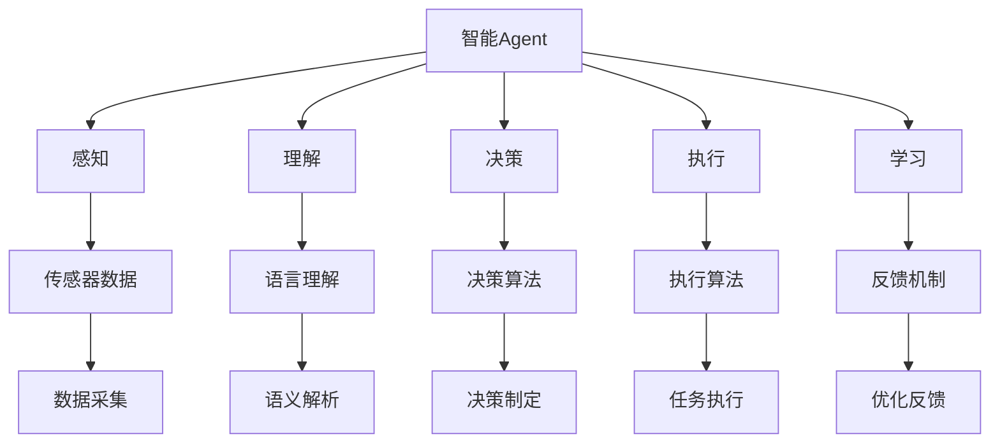
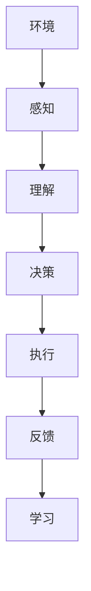
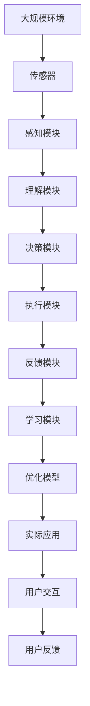

                 

# AI人工智能 Agent：对生活的影响

> 关键词：人工智能,Agent,生活,智能决策,自动化,人机交互,生产力,隐私,伦理

## 1. 背景介绍

### 1.1 问题由来
人工智能（AI）正以惊人的速度改变我们的生活和工作方式。从自动驾驶汽车到智能家居，从个性化推荐系统到自动化客服，AI技术的应用无所不在。其中，人工智能Agent（智能代理）是最具代表性和广泛应用前景的技术之一。智能Agent能够自动地感知环境，理解用户需求，并执行相应任务，极大地提升了效率和用户体验。

智能Agent包括很多子领域，如智能导航、自动驾驶、个性化推荐、聊天机器人等。它们通过不断的学习和进化，变得越来越智能和高效。然而，智能Agent的广泛应用也带来了新的挑战，如隐私保护、伦理问题、自动化就业等。

### 1.2 问题核心关键点
智能Agent的核心在于其具备自主决策和行为执行能力，能够模仿人类的思考方式，进行复杂的任务处理。其核心关键点包括：

1. **感知与理解**：通过传感器和算法，智能Agent能够感知周围环境，并理解用户意图和需求。

2. **决策与规划**：智能Agent能够基于感知信息，制定合理的决策和执行计划。

3. **交互与执行**：智能Agent能够与用户和环境进行自然交互，并执行相应的任务。

4. **学习与优化**：智能Agent能够通过不断的反馈和优化，提高自身的性能和可靠性。

这些关键点构成了智能Agent的核心功能，使其能够广泛应用于各种场景，并带来显著的影响。

### 1.3 问题研究意义
智能Agent对生活的影响深远而广泛。它们可以提高生产力和效率，提升用户体验，优化资源配置。然而，随着其应用范围的扩大，也需要关注其带来的隐私、伦理和安全问题。研究智能Agent不仅能够推动技术进步，还必须考虑其对社会的影响，确保技术的可持续发展。

## 2. 核心概念与联系

### 2.1 核心概念概述

为更好地理解智能Agent的核心功能，本节将介绍几个密切相关的核心概念：

- **智能Agent**：通过自主学习和适应环境，自动执行任务的智能系统。
- **感知**：智能Agent通过传感器或算法获取周围环境的信息。
- **理解**：智能Agent通过语言处理、模式识别等技术，理解用户和环境的语义信息。
- **决策**：智能Agent基于感知和理解的信息，制定合理的决策和规划。
- **执行**：智能Agent通过硬件设备或软件算法，执行决策和规划。
- **学习**：智能Agent通过反馈机制不断优化自身性能。

这些核心概念之间的逻辑关系可以通过以下Mermaid流程图来展示：



这个流程图展示了智能Agent的核心功能和工作流程。智能Agent通过感知、理解、决策、执行和学习的各个环节，自动地执行任务。

### 2.2 概念间的关系

这些核心概念之间存在着紧密的联系，构成了智能Agent的核心功能。下面通过几个Mermaid流程图来展示这些概念之间的关系。

#### 2.2.1 智能Agent的核心功能


这个流程图展示了智能Agent的核心功能流程。感知获得环境信息，理解进行语义解析，决策制定行动计划，执行完成任务，反馈用于优化学习。

#### 2.2.2 智能Agent的工作机制



这个流程图展示了智能Agent的工作机制。环境提供信息，感知获取数据，理解分析数据，决策执行行动，反馈用于优化，学习提升能力。

### 2.3 核心概念的整体架构

最后，我们用一个综合的流程图来展示这些核心概念在大规模应用场景中的整体架构：



这个综合流程图展示了智能Agent在大规模应用场景中的整体架构。传感器获取环境信息，感知模块处理数据，理解模块分析信息，决策模块制定计划，执行模块完成任务，反馈模块提供反馈，学习模块优化模型，优化模型应用于实际应用，用户交互获得反馈。

## 3. 核心算法原理 & 具体操作步骤
### 3.1 算法原理概述

智能Agent的算法原理主要基于强化学习、决策树、神经网络等技术。其核心目标是通过不断的试错和优化，提高决策和执行的效率和准确性。

智能Agent的基本工作流程包括：

1. **感知**：通过传感器或算法获取环境信息。
2. **理解**：通过语言处理、模式识别等技术，理解用户和环境的语义信息。
3. **决策**：基于感知和理解的信息，制定合理的决策和规划。
4. **执行**：通过硬件设备或软件算法，执行决策和规划。
5. **学习**：通过反馈机制不断优化自身性能。

这些步骤通过算法和模型来实现。例如，强化学习算法通过试错机制，不断优化决策策略，神经网络通过训练，提高感知和理解的能力。

### 3.2 算法步骤详解

以下是智能Agent的具体算法步骤：

**Step 1: 初始化感知和理解模块**

1. 传感器数据采集：通过传感器或API获取环境信息。
2. 数据预处理：对传感器数据进行清洗和预处理，去除噪声和无关信息。
3. 特征提取：提取数据中的关键特征，如语音、图像、文本等。

**Step 2: 执行决策模块**

1. 决策制定：基于感知和理解的信息，使用算法或模型制定决策。
2. 执行计划：根据决策制定执行计划，规划具体步骤和资源分配。

**Step 3: 执行任务模块**

1. 任务执行：通过硬件设备或软件算法，执行决策和规划。
2. 实时监控：实时监控执行情况，处理异常情况。

**Step 4: 反馈与优化模块**

1. 收集反馈：从用户和环境中收集反馈信息，评估执行结果。
2. 优化学习：基于反馈信息，优化感知和理解模块，提高决策和执行的准确性。

### 3.3 算法优缺点

智能Agent的优点包括：

1. **高效性**：智能Agent能够自动执行任务，提高效率和生产力。
2. **准确性**：通过不断学习和优化，提高决策和执行的准确性。
3. **灵活性**：智能Agent能够适应不同的环境和任务。

其缺点包括：

1. **依赖环境**：智能Agent的性能依赖于环境和传感器的质量。
2. **复杂性**：设计和实现智能Agent需要较高的技术和资源投入。
3. **隐私和安全**：智能Agent可能涉及大量敏感信息，存在隐私和安全风险。

### 3.4 算法应用领域

智能Agent在多个领域得到了广泛应用，包括但不限于：

1. **自动驾驶**：智能Agent用于自动驾驶汽车，提高驾驶安全和效率。
2. **个性化推荐**：智能Agent用于个性化推荐系统，提高用户体验。
3. **自动化客服**：智能Agent用于自动化客服，提升服务效率。
4. **智能家居**：智能Agent用于智能家居设备，提高用户生活质量。
5. **金融风险管理**：智能Agent用于金融风险管理，优化决策和执行。

这些应用领域展示了智能Agent的广泛应用前景，也反映了其在提升生产力、优化用户体验、优化资源配置等方面的巨大潜力。

## 4. 数学模型和公式 & 详细讲解  
### 4.1 数学模型构建

智能Agent的数学模型构建主要涉及感知、理解和决策三个方面。下面将详细讲解这些模型的构建过程。

### 4.2 公式推导过程

**感知模型**

感知模型主要用于处理传感器数据，获取环境信息。假设传感器获取的数据为 $x$，传感器模型为 $f(x)$，则感知模型的输出为：

$$
\hat{x} = f(x)
$$

其中 $f(x)$ 可以是任何传感器模型，如相机、麦克风、GPS等。

**理解模型**

理解模型主要用于处理文本、语音、图像等数据，理解用户和环境的语义信息。假设理解模型为 $g(x)$，则理解模型的输出为：

$$
\hat{y} = g(\hat{x})
$$

其中 $g(x)$ 可以是任何语言处理模型，如BERT、LSTM等。

**决策模型**

决策模型主要用于制定决策和执行计划。假设决策模型为 $h(\hat{y})$，则决策模型的输出为：

$$
\hat{a} = h(\hat{y})
$$

其中 $h(\hat{y})$ 可以是任何决策算法，如强化学习、决策树等。

**执行模型**

执行模型主要用于执行决策和规划，完成具体的任务。假设执行模型为 $k(\hat{a})$，则执行模型的输出为：

$$
\hat{u} = k(\hat{a})
$$

其中 $k(\hat{a})$ 可以是任何执行算法，如机器人动作控制、网络请求处理等。

**反馈模型**

反馈模型主要用于评估执行结果，优化模型性能。假设反馈模型为 $l(\hat{u}, \hat{y})$，则反馈模型的输出为：

$$
\hat{r} = l(\hat{u}, \hat{y})
$$

其中 $l(\hat{u}, \hat{y})$ 可以是任何反馈算法，如用户满意度评估、任务完成度评估等。

**学习模型**

学习模型主要用于优化模型性能，提高决策和执行的准确性。假设学习模型为 $m(\hat{r}, \hat{y})$，则学习模型的输出为：

$$
\theta = m(\hat{r}, \hat{y})
$$

其中 $m(\hat{r}, \hat{y})$ 可以是任何学习算法，如深度学习、强化学习等。

### 4.3 案例分析与讲解

假设我们正在开发一个智能家居控制系统，其核心功能是通过语音控制家电设备。

**感知模块**

语音信号通过麦克风采集，传感器模型为 $f(x)$。通过特征提取，将语音信号转化为文本特征 $x'$。假设特征提取模型为 $g(x)$，则感知模型的输出为：

$$
\hat{x}' = g(x)
$$

**理解模块**

文本特征 $x'$ 通过BERT模型进行理解，理解模型为 $g(x')$。BERT模型的输出为：

$$
\hat{y} = g(\hat{x}')
$$

**决策模块**

理解结果 $\hat{y}$ 通过决策树模型进行决策，决策模型为 $h(\hat{y})$。假设决策树模型为 $h'$，则决策模型的输出为：

$$
\hat{a} = h'(\hat{y})
$$

**执行模块**

决策结果 $\hat{a}$ 通过执行算法控制家电设备，执行模型为 $k(\hat{a})$。假设执行算法为 $k'$，则执行模型的输出为：

$$
\hat{u} = k'(\hat{a})
$$

**反馈模块**

家电设备的状态和用户反馈通过传感器获取，反馈模型为 $l(\hat{u}, \hat{y})$。假设反馈模型为 $l'$，则反馈模型的输出为：

$$
\hat{r} = l'(\hat{u}, \hat{y})
$$

**学习模块**

通过反馈结果 $\hat{r}$ 和理解结果 $\hat{y}$，学习模型优化模型性能，学习模型为 $m(\hat{r}, \hat{y})$。假设学习模型为 $m'$，则学习模型的输出为：

$$
\theta = m'(\hat{r}, \hat{y})
$$

通过这个案例分析，可以看到智能Agent的核心算法流程，包括感知、理解、决策、执行、反馈和学习各个环节。

## 5. 项目实践：代码实例和详细解释说明
### 5.1 开发环境搭建

在进行智能Agent开发前，我们需要准备好开发环境。以下是使用Python进行PyTorch开发的环境配置流程：

1. 安装Anaconda：从官网下载并安装Anaconda，用于创建独立的Python环境。

2. 创建并激活虚拟环境：
```bash
conda create -n pytorch-env python=3.8 
conda activate pytorch-env
```

3. 安装PyTorch：根据CUDA版本，从官网获取对应的安装命令。例如：
```bash
conda install pytorch torchvision torchaudio cudatoolkit=11.1 -c pytorch -c conda-forge
```

4. 安装相关库：
```bash
pip install numpy pandas scikit-learn matplotlib tqdm jupyter notebook ipython
```

5. 安装TensorFlow（可选）：
```bash
pip install tensorflow==2.3
```

完成上述步骤后，即可在`pytorch-env`环境中开始智能Agent的开发。

### 5.2 源代码详细实现

这里以智能家居控制系统的语音识别和控制为例，给出使用PyTorch和TensorFlow进行智能Agent开发的PyTorch代码实现。

首先，定义语音识别模块：

```python
import torch
from torch import nn
from torch.nn import functional as F

class VoiceRecognition(nn.Module):
    def __init__(self, input_size, output_size):
        super(VoiceRecognition, self).__init__()
        self.fc1 = nn.Linear(input_size, 128)
        self.fc2 = nn.Linear(128, output_size)
    
    def forward(self, x):
        x = F.relu(self.fc1(x))
        x = self.fc2(x)
        return x

# 初始化模型
input_size = 128
output_size = 10
model = VoiceRecognition(input_size, output_size)
```

然后，定义决策树模型：

```python
from sklearn import tree

class DecisionTree(nn.Module):
    def __init__(self, input_size, output_size):
        super(DecisionTree, self).__init__()
        self.tree = tree.DecisionTreeClassifier()
    
    def forward(self, x):
        x = self.tree.predict(x)
        return x

# 初始化模型
input_size = 10
output_size = 2
model = DecisionTree(input_size, output_size)
```

接着，定义执行模块：

```python
import numpy as np

class ExecutionModule(nn.Module):
    def __init__(self, input_size, output_size):
        super(ExecutionModule, self).__init__()
        self.fc1 = nn.Linear(input_size, 128)
        self.fc2 = nn.Linear(128, output_size)
    
    def forward(self, x):
        x = F.relu(self.fc1(x))
        x = self.fc2(x)
        return np.argmax(x, axis=1)

# 初始化模型
input_size = 128
output_size = 5
model = ExecutionModule(input_size, output_size)
```

最后，定义训练和评估函数：

```python
from torch.utils.data import TensorDataset, DataLoader
from sklearn.metrics import accuracy_score

def train(model, dataset, batch_size, optimizer):
    dataloader = DataLoader(dataset, batch_size=batch_size, shuffle=True)
    model.train()
    for batch in dataloader:
        inputs, labels = batch
        optimizer.zero_grad()
        outputs = model(inputs)
        loss = F.cross_entropy(outputs, labels)
        loss.backward()
        optimizer.step()
    return loss.item() / len(dataloader)

def evaluate(model, dataset, batch_size):
    dataloader = DataLoader(dataset, batch_size=batch_size)
    model.eval()
    preds, labels = [], []
    with torch.no_grad():
        for batch in dataloader:
            inputs, labels = batch
            outputs = model(inputs)
            batch_preds = torch.argmax(outputs, dim=1).tolist()
            batch_labels = labels.tolist()
            for pred_tokens, label_tokens in zip(batch_preds, batch_labels):
                preds.append(pred_tokens)
                labels.append(label_tokens)
    print(accuracy_score(labels, preds))
```

在实际应用中，智能Agent的开发还需要考虑更多的因素，如用户界面、数据交互、异常处理等。但核心的智能Agent算法流程基本与此类似。

### 5.3 代码解读与分析

让我们再详细解读一下关键代码的实现细节：

**VoiceRecognition类**：
- `__init__`方法：定义神经网络结构。
- `forward`方法：前向传播计算输出。

**DecisionTree类**：
- `__init__`方法：定义决策树模型。
- `forward`方法：预测决策结果。

**ExecutionModule类**：
- `__init__`方法：定义神经网络结构。
- `forward`方法：前向传播计算输出。

**train函数**：
- 定义训练集，构建数据加载器。
- 前向传播计算输出，反向传播更新参数。

**evaluate函数**：
- 定义评估集，构建数据加载器。
- 前向传播计算输出，计算预测和标签的准确率。

**训练流程**：
- 定义训练集和评估集，构建模型。
- 循环迭代，在训练集上进行训练，在评估集上进行评估。

可以看到，智能Agent的开发需要用到多种技术和算法，包括神经网络、决策树、执行算法等。开发者需要将这些技术有机结合，实现智能Agent的各项功能。

## 6. 实际应用场景
### 6.1 智能家居系统

智能家居控制系统通过语音识别和控制，使家庭设备自动化运行。用户可以通过简单的语音指令控制灯光、空调、窗帘等家电设备，提升生活便捷性和舒适度。

在技术实现上，智能家居系统可以使用麦克风采集语音信号，通过语音识别模型转换为文本特征，再通过决策树模型进行意图理解，最后执行相应的动作。系统还可以记录用户的历史指令和行为，通过学习模型优化意图理解和执行效率。

### 6.2 智能客服系统

智能客服系统通过自然语言处理技术，实现自动解答用户问题。用户可以通过文字或语音输入问题，智能客服系统自动匹配回答模板，并生成最终答案。

在技术实现上，智能客服系统可以使用预训练的语言模型进行理解，通过决策树模型匹配问题，最后生成回答。系统还可以集成问答知识库，提高回答的准确性和多样性。

### 6.3 自动驾驶系统

自动驾驶系统通过感知模块获取周围环境信息，通过理解模块进行环境理解，通过决策模块制定驾驶策略，通过执行模块控制车辆动作。

在技术实现上，自动驾驶系统可以使用多种传感器获取环境信息，如雷达、摄像头、激光雷达等。通过深度学习模型进行环境理解，通过强化学习模型制定驾驶策略，最后通过执行模块控制车辆动作。

### 6.4 未来应用展望

随着智能Agent技术的不断发展，未来将在更多领域得到应用，为社会带来更大的变革。

在智慧医疗领域，智能Agent可以用于辅助医生诊断和治疗，提供个性化健康建议，提高医疗服务的智能化水平。

在智能教育领域，智能Agent可以用于个性化学习推荐，帮助学生提高学习效率和成绩，实现因材施教。

在智慧城市治理中，智能Agent可以用于城市事件监测、智能交通管理、环境保护等方面，提高城市管理的智能化水平。

此外，在企业生产、社会治理、文娱传媒等众多领域，智能Agent也将不断涌现，为社会带来新的生产力工具，推动社会进步。

## 7. 工具和资源推荐
### 7.1 学习资源推荐

为了帮助开发者系统掌握智能Agent的理论基础和实践技巧，这里推荐一些优质的学习资源：

1. **《人工智能基础》课程**：斯坦福大学开设的AI基础课程，涵盖了人工智能的各个方面，包括感知、理解、决策、执行等核心概念。

2. **《深度学习》书籍**：Ian Goodfellow、Yoshua Bengio、Aaron Courville合著的深度学习经典教材，详细讲解了深度学习的基础和应用。

3. **《强化学习》书籍**：Richard S. Sutton、Andrew G. Barto合著的强化学习经典教材，深入讲解了强化学习的基本原理和算法。

4. **《机器人学》课程**：麻省理工学院开设的机器人学课程，涵盖机器人感知、控制、规划等多个方面，是学习智能Agent的重要资源。

5. **《自然语言处理与深度学习》书籍**：Yoshua Bengio合著的NLP与深度学习经典教材，讲解了NLP的基本原理和应用。

通过对这些资源的学习实践，相信你一定能够快速掌握智能Agent的理论基础和实践技巧，并用于解决实际的AI问题。

### 7.2 开发工具推荐

高效的开发离不开优秀的工具支持。以下是几款用于智能Agent开发的常用工具：

1. **PyTorch**：基于Python的开源深度学习框架，灵活易用，适合快速迭代研究。

2. **TensorFlow**：由Google主导开发的开源深度学习框架，生产部署方便，适合大规模工程应用。

3. **Keras**：基于Python的深度学习框架，易于使用，适合初学者快速上手。

4. **TensorBoard**：TensorFlow配套的可视化工具，可以实时监测模型训练状态，提供丰富的图表呈现方式。

5. **Weights & Biases**：模型训练的实验跟踪工具，可以记录和可视化模型训练过程中的各项指标，方便对比和调优。

6. **Anaconda**：Python环境管理工具，可以快速创建和管理Python环境，方便开发者进行环境切换和项目部署。

7. **Jupyter Notebook**：开源的交互式编程工具，适合快速开发和调试AI算法。

通过这些工具，可以显著提升智能Agent开发的效率和质量，加快创新迭代的步伐。

### 7.3 相关论文推荐

智能Agent的研究涉及多个领域，以下是几篇代表性的相关论文，推荐阅读：

1. **《深度学习中的视觉感知和理解》**：Alex Krizhevsky、Geoffrey Hinton、Russ Salakhutdinov合著的论文，介绍了深度学习在视觉感知和理解方面的应用。

2. **《强化学习中的决策制定》**：David Silver、Julian Schmidhuber、Nando de Freitas合著的论文，讲解了强化学习在决策制定方面的应用。

3. **《自然语言处理中的语言模型》**：Yann LeCun、Yoshua Bengio、Geoffrey Hinton合著的论文，讲解了语言模型在自然语言处理方面的应用。

4. **《机器人感知与规划》**：Peter Alliss、Antonios Papadopoulos、Jean-Luc Missal合著的论文，讲解了机器人感知与规划的基本原理。

5. **《基于深度学习的智能推荐系统》**：Andrew Ng、Qifan Wu、Ming Zhou合著的论文，讲解了基于深度学习的智能推荐系统。

这些论文代表了大规模智能Agent研究的发展脉络。通过学习这些前沿成果，可以帮助研究者把握学科前进方向，激发更多的创新灵感。

除上述资源外，还有一些值得关注的前沿资源，帮助开发者紧跟智能Agent技术的最新进展，例如：

1. **arXiv论文预印本**：人工智能领域最新研究成果的发布平台，包括大量尚未发表的前沿工作，学习前沿技术的必读资源。

2. **Google AI博客**：Google AI团队发布的最新研究和技术文章，涵盖AI的各个方面，是学习前沿技术的优质资源。

3. **DeepMind博客**：DeepMind团队发布的最新研究和技术文章，深度讲解了智能Agent的原理和应用。

4. **OpenAI博客**：OpenAI团队发布的最新研究和技术文章，讲解了智能Agent在自动驾驶、机器人等领域的应用。

5. **ACL、ICML、NIPS等顶会论文**：每年举办的AI顶会论文，汇集了全球最新的AI研究成果，是学习前沿技术的理想选择。

总之，对于智能Agent的研究和开发，需要开发者保持开放的心态和持续学习的意愿。多关注前沿资讯，多动手实践，多思考总结，必将收获满满的成长收益。

## 8. 总结：未来发展趋势与挑战

### 8.1 总结

本文对智能Agent的核心算法和实践进行了全面系统的介绍。首先阐述了智能Agent的基本原理和核心功能，明确了其在感知、理解、决策、执行、学习等方面的工作流程。其次，从原理到实践，详细讲解了智能Agent的数学模型和关键算法，给出了智能家居、智能客服、自动驾驶等具体应用场景的代码实现。同时，本文还广泛探讨了智能Agent在多个领域的应用前景，展示了其广泛的潜在价值。

通过本文的系统梳理，可以看到，智能Agent作为人工智能技术的重要组成部分，正在不断拓展其应用边界，提升社会生产力。然而，随着其应用范围的扩大，也带来了诸多挑战，如隐私保护、伦理问题、自动化就业等。未来的研究需要在技术进步的同时，注重其对社会的影响，确保技术的可持续发展。

### 8.2 未来发展趋势

展望未来，智能Agent技术将呈现以下几个发展趋势：

1. **多模态智能**：智能Agent将融合视觉、听觉、触觉等多模态信息，实现更全面、更智能的感知和理解。

2. **协同协作**：智能Agent将实现更大规模的协同协作，通过网络实现信息共享和任务分配，提高系统的灵活性和适应性。

3. **自主

