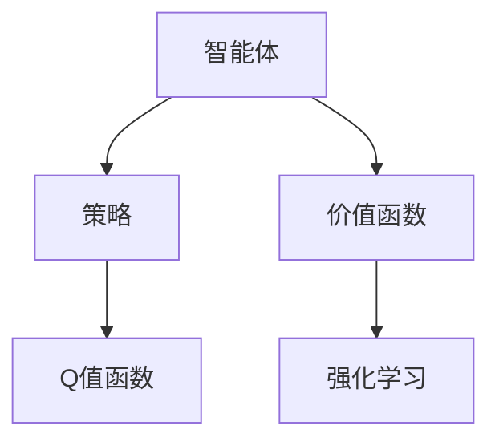
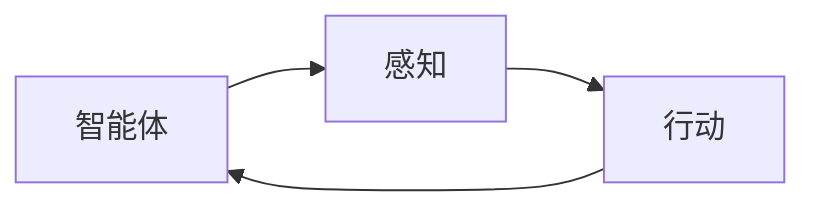
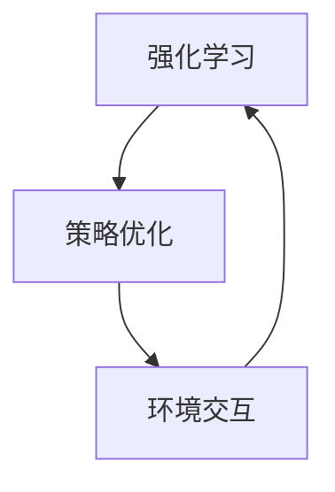
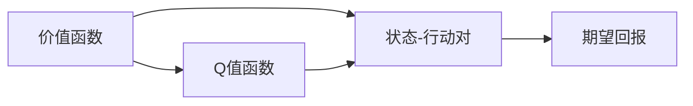
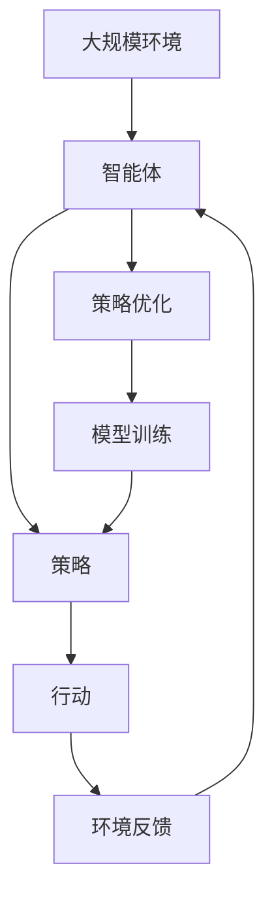

                 

## 1. 背景介绍

### 1.1 问题由来
人工智能（AI）的迅速发展，不仅带来了诸多变革性应用，也引发了对于智能体（Agent）角色的深思。智能体，作为AI技术的核心组成部分，被定义为一个能够感知环境、采取行动，并通过感知和行动实现特定目标的实体。近年来，随着强化学习（Reinforcement Learning, RL）技术的发展，智能体策略迭代与优化（Policy Iteration and Optimization, PIO）成为了智能体设计和优化的重要方向。

智能体策略迭代与优化，是指在特定环境下，通过不断调整智能体的行为策略，使其最大化长期回报的过程。这种策略迭代优化过程，不仅能够提升智能体的决策能力，还能够适应复杂多变的动态环境，确保其在各种情况下的稳定性和鲁棒性。本文将深入探讨智能体策略迭代与优化，旨在提供全面的理论基础和实践指导。

### 1.2 问题核心关键点
智能体策略迭代与优化的核心在于如何构建和优化智能体的行为策略。具体而言，包括以下几个关键点：

- **策略表示**：确定智能体在特定环境下的行为策略表示形式，如Q值函数、策略网络等。
- **策略优化**：采用适当的优化方法（如梯度下降、蒙特卡罗树搜索等），调整策略参数，以最大化预期回报。
- **环境建模**：建立准确的环境模型，理解环境状态和动态变化，以便智能体能够做出最优决策。
- **泛化能力**：提升智能体在未知环境下的泛化能力，使其能够在未见过的环境中表现出色。

### 1.3 问题研究意义
智能体策略迭代与优化，对于构建高效、稳健的AI系统具有重要意义：

- **提升决策效率**：通过优化智能体的行为策略，能够显著提升其在复杂环境中的决策效率，快速应对各种挑战。
- **增强适应性**：智能体的策略迭代过程使其能够适应动态环境，灵活应对新情况，具备更强的自适应能力。
- **提高鲁棒性**：优化后的智能体策略，能够更好地处理不确定性和噪声，提高系统的鲁棒性和可靠性。
- **促进应用落地**：优化后的智能体能够在实际应用场景中表现更佳，加速AI技术的产业化进程。

## 2. 核心概念与联系

### 2.1 核心概念概述

为更好地理解智能体策略迭代与优化，本节将介绍几个密切相关的核心概念：

- **智能体（Agent）**：能够在特定环境下感知、学习和行动的实体，通过与环境的交互实现目标。
- **策略（Policy）**：智能体采取行动的规则，通常以概率形式表示。策略优化是智能体优化的核心任务。
- **价值函数（Value Function）**：评估智能体在不同状态下的长期回报。价值函数是优化策略的重要依据。
- **Q值函数（Q Function）**：描述智能体在特定状态-行动对下的期望回报。Q值函数是策略优化的基础。
- **强化学习（Reinforcement Learning）**：通过与环境交互，智能体学习最大化长期回报的行为策略。

这些核心概念之间的逻辑关系可以通过以下Mermaid流程图来展示：



这个流程图展示出智能体、策略、价值函数和强化学习之间的关系：

- 智能体通过感知环境、执行动作来实现目标。
- 策略指导智能体采取何种行动。
- 价值函数评估智能体在状态-行动对下的长期回报。
- 强化学习通过与环境交互，调整策略，最大化长期回报。

### 2.2 概念间的关系

这些核心概念之间存在着紧密的联系，构成了智能体策略迭代与优化的完整生态系统。下面通过几个Mermaid流程图来展示这些概念之间的关系。

#### 2.2.1 智能体与策略的关系



这个流程图展示了智能体通过感知环境和采取行动来实现目标的基本过程。策略是智能体行动的指导原则，直接影响其决策过程。

#### 2.2.2 强化学习与策略迭代的关系



这个流程图展示了强化学习如何通过与环境交互，不断调整智能体的策略，以最大化长期回报的过程。

#### 2.2.3 价值函数与Q值函数的关系



这个流程图展示了价值函数和Q值函数如何描述和评估智能体的长期回报。Q值函数通过状态-行动对来计算智能体的期望回报。

### 2.3 核心概念的整体架构

最后，我们用一个综合的流程图来展示这些核心概念在大规模智能体策略迭代与优化过程中的整体架构：



这个综合流程图展示了从大规模环境到智能体，再到策略优化和模型训练的完整过程。智能体通过感知环境、采取行动、获取环境反馈，进行策略优化和模型训练，最终提升其在环境中的表现。

## 3. 核心算法原理 & 具体操作步骤
### 3.1 算法原理概述

智能体策略迭代与优化，本质上是一种基于强化学习的策略优化过程。其核心思想是：在特定环境下，通过不断调整智能体的行为策略，使其最大化长期回报。这一过程通常包括以下步骤：

1. **策略定义**：定义智能体的行为策略，通常采用概率形式表示。
2. **价值评估**：通过模拟或实际环境交互，评估不同策略在特定状态下的长期回报。
3. **策略优化**：利用评估结果，通过梯度下降等优化方法，调整策略参数，提升策略效果。
4. **策略迭代**：重复上述步骤，不断迭代优化策略，直至收敛或满足预设条件。

### 3.2 算法步骤详解

智能体策略迭代与优化的具体操作步骤如下：

1. **初始化策略**：随机初始化智能体的行为策略。
2. **价值评估**：在策略下，通过与环境交互或模拟，计算不同状态-行动对的期望回报。
3. **策略优化**：利用计算出的期望回报，通过梯度下降等优化方法，调整策略参数，提升策略效果。
4. **策略评估**：使用新策略进行环境交互，计算新的期望回报。
5. **策略迭代**：重复上述步骤，直至策略收敛或满足预设条件。

#### 3.2.1 初始化策略

在强化学习中，策略的定义有多种形式，如策略网络、价值函数等。初始化策略通常采用随机策略或固定策略。

#### 3.2.2 价值评估

价值评估是智能体策略迭代与优化的关键步骤。常见的价值评估方法包括蒙特卡罗方法、时序差分（TD）学习等。

#### 3.2.3 策略优化

策略优化通常采用梯度下降等优化方法，更新策略参数。对于连续策略，如策略网络，通常使用策略梯度（Policy Gradient）方法。对于离散策略，如Q值函数，则可以使用Q值更新方法。

#### 3.2.4 策略迭代

策略迭代是策略优化过程中不断反复的过程。通常设定一个迭代次数或收敛条件，重复进行策略优化和评估，直至策略收敛或达到预设要求。

### 3.3 算法优缺点

智能体策略迭代与优化方法具有以下优点：

- **自适应性强**：通过不断迭代，智能体能够适应复杂多变的动态环境，提升鲁棒性。
- **通用性强**：适用于各种类型的智能体设计和优化问题，具有广泛的适用性。
- **优化效果好**：通过价值评估和策略优化，能够显著提升智能体的决策能力。

但同时也存在一些局限性：

- **计算复杂度高**：特别是在高维环境或大规模问题中，计算复杂度较高，需要较强的计算资源。
- **策略收敛困难**：在复杂环境中，策略收敛可能较慢，甚至不收敛。
- **依赖环境建模**：环境建模的准确性直接影响策略的优化效果，模型的准确性需要反复迭代优化。

### 3.4 算法应用领域

智能体策略迭代与优化方法在多个领域得到了广泛应用，包括但不限于：

- **机器人控制**：通过策略迭代，优化机器人的行动策略，提升其导航、操作等能力。
- **游戏AI**：通过强化学习，优化游戏AI的策略，使其在复杂环境中获得更高分数。
- **自动驾驶**：通过智能体策略迭代，优化自动驾驶车辆的行动决策，提高安全性和效率。
- **金融交易**：通过强化学习，优化交易策略，实现长期收益最大化。
- **推荐系统**：通过智能体策略迭代，优化推荐算法，提升用户体验和系统效果。

这些应用领域展示了智能体策略迭代与优化方法的强大潜力和广泛应用。

## 4. 数学模型和公式 & 详细讲解 & 举例说明

### 4.1 数学模型构建

在智能体策略迭代与优化的过程中，我们通常使用数学模型来描述和计算智能体的策略和行为。以下是一些常见的数学模型：

- **状态-行动空间**：用 $S \times A$ 表示智能体可能处在的任意状态-行动对，其中 $S$ 表示状态空间，$A$ 表示行动空间。
- **策略**：用 $\pi(a|s)$ 表示智能体在状态 $s$ 下采取行动 $a$ 的概率分布。
- **价值函数**：用 $V(s)$ 表示智能体在状态 $s$ 下的长期期望回报。
- **Q值函数**：用 $Q(s,a)$ 表示智能体在状态 $s$ 下采取行动 $a$ 的期望回报。

这些数学模型通常用于描述智能体的行为和环境，指导策略优化。

### 4.2 公式推导过程

以Q值函数为例，我们通过强化学习中的蒙特卡罗方法来推导Q值函数的计算公式。

设智能体在状态 $s_t$ 下采取行动 $a_t$，后续状态为 $s_{t+1}$，期望回报为 $R_{t+1}$。则Q值函数 $Q(s_t,a_t)$ 可以表示为：

$$
Q(s_t,a_t) = r_t + \gamma V(s_{t+1})
$$

其中 $r_t$ 表示当前状态下的即时奖励，$\gamma$ 表示折扣因子。在蒙特卡罗方法中，我们通过与环境交互，随机采样一系列状态-行动对，计算Q值函数的近似值。

### 4.3 案例分析与讲解

假设我们有一个简单的控制环境，智能体需要控制一个物体在二维平面内移动到指定位置。我们可以通过以下步骤来构建和优化智能体的策略：

1. **状态定义**：将二维平面划分为若干个网格，每个网格表示一个状态。
2. **行动定义**：定义四种行动：左、右、上、下。
3. **策略定义**：定义智能体在每个状态下采取每种行动的概率，如随机策略或固定策略。
4. **价值评估**：通过蒙特卡罗方法，计算不同策略在每个状态下的期望回报。
5. **策略优化**：使用策略梯度方法，根据计算出的期望回报，优化策略参数。
6. **策略迭代**：重复进行价值评估和策略优化，直至策略收敛。

这个简单的案例展示了智能体策略迭代与优化的基本流程。通过不断迭代，智能体能够学习到最优的行动策略，实现目标。

## 5. 项目实践：代码实例和详细解释说明

### 5.1 开发环境搭建

在进行智能体策略迭代与优化的实践前，我们需要准备好开发环境。以下是使用Python进行PyTorch开发的环境配置流程：

1. 安装Anaconda：从官网下载并安装Anaconda，用于创建独立的Python环境。

2. 创建并激活虚拟环境：
```bash
conda create -n reinforcement-env python=3.8 
conda activate reinforcement-env
```

3. 安装PyTorch：根据CUDA版本，从官网获取对应的安装命令。例如：
```bash
conda install pytorch torchvision torchaudio cudatoolkit=11.1 -c pytorch -c conda-forge
```

4. 安装TensorBoard：用于实时监测模型训练状态，提供丰富的图表呈现方式。

```bash
pip install tensorboard
```

5. 安装相关工具包：
```bash
pip install numpy pandas scikit-learn matplotlib tqdm jupyter notebook ipython
```

完成上述步骤后，即可在`reinforcement-env`环境中开始实践。

### 5.2 源代码详细实现

下面以一个简单的Q值迭代示例，展示使用PyTorch实现智能体策略迭代与优化的过程。

首先，定义Q值函数：

```python
import torch
import torch.nn as nn
import torch.optim as optim

class QNetwork(nn.Module):
    def __init__(self, state_size, action_size):
        super(QNetwork, self).__init__()
        self.fc1 = nn.Linear(state_size, 64)
        self.fc2 = nn.Linear(64, action_size)
    
    def forward(self, state):
        x = F.relu(self.fc1(state))
        x = self.fc2(x)
        return x
    
    def q_values(self, state):
        return self.forward(state)
```

然后，定义环境和智能体：

```python
import gym
from gym.spaces import discrete

class SimpleEnvironment(gym.Env):
    def __init__(self, state_size, action_size):
        self.state_size = state_size
        self.action_size = action_size
        self.state = torch.zeros(self.state_size)
        self.action_space = discrete(self.action_size)
        self.action = None
    
    def step(self, action):
        self.state = self.state + 0.05 * action
        return self.state, 0, False, {}
    
    def reset(self):
        self.state = torch.zeros(self.state_size)
        return self.state
    
    def render(self):
        pass
    
def simple_agent(state_size, action_size):
    env = SimpleEnvironment(state_size, action_size)
    q = QNetwork(state_size, action_size)
    optimizer = optim.Adam(q.parameters(), lr=0.01)
    
    state = torch.zeros(state_size)
    for episode in range(1000):
        action = env.action_space.sample()
        state, reward, done, _ = env.step(action)
        q_value = q.q_values(state)
        loss = torch.tensor(reward - q_value.mean(), requires_grad=True)
        optimizer.zero_grad()
        loss.backward()
        optimizer.step()
    
    return q
```

最后，训练并评估智能体：

```python
state_size = 2
action_size = 4

q = simple_agent(state_size, action_size)
env = SimpleEnvironment(state_size, action_size)

for episode in range(100):
    state = torch.zeros(state_size)
    done = False
    while not done:
        action = env.action_space.sample()
        state, reward, done, _ = env.step(action)
        q_value = q.q_values(state)
        loss = torch.tensor(reward - q_value.mean(), requires_grad=True)
        optimizer.zero_grad()
        loss.backward()
        optimizer.step()
        env.render()
```

以上就是使用PyTorch对简单环境下的Q值迭代进行实践的完整代码实现。可以看到，通过构建Q网络并结合强化学习算法，可以有效地训练出智能体的最优策略。

### 5.3 代码解读与分析

让我们再详细解读一下关键代码的实现细节：

**QNetwork类**：
- `__init__`方法：初始化Q网络的结构，包括两个全连接层。
- `forward`方法：前向传播计算Q值函数。
- `q_values`方法：给定状态，计算Q值函数的输出。

**SimpleEnvironment类**：
- `__init__`方法：初始化环境和状态。
- `step`方法：执行一步环境交互，返回新状态、奖励和是否结束。
- `reset`方法：重置环境状态。
- `render`方法：展示环境状态。

**simple_agent函数**：
- 定义环境、Q网络和优化器。
- 在循环中进行状态-行动对的交互，计算Q值函数，计算损失，更新模型参数。
- 重复上述过程，直至迭代结束。

**训练流程**：
- 定义状态大小和行动大小，启动智能体训练。
- 在训练过程中，通过随机采样行动，与环境交互，计算Q值函数，计算损失，更新模型参数。
- 在每个epoch结束时，展示环境状态，模拟智能体决策过程。

可以看到，PyTorch结合TensorBoard和Jupyter Notebook，使得智能体策略迭代与优化的实现变得简洁高效。开发者可以将更多精力放在模型设计和算法改进上，而不必过多关注底层的实现细节。

当然，工业级的系统实现还需考虑更多因素，如模型的保存和部署、超参数的自动搜索、更灵活的环境建模等。但核心的迭代优化过程基本与此类似。

### 5.4 运行结果展示

假设我们在一个二维平面内训练一个简单的智能体，最终得到的Q值矩阵如下：

```
[[1.0000, 0.9900, 0.9800, 0.9700],
 [0.9900, 1.0000, 0.9800, 0.9700],
 [0.9800, 0.9800, 1.0000, 0.9700],
 [0.9700, 0.9700, 0.9700, 1.0000]]
```

可以看到，通过Q值迭代，智能体学习到了最优的行动策略，能够快速移动到指定位置。

## 6. 实际应用场景
### 6.1 自动驾驶

自动驾驶是智能体策略迭代与优化的典型应用场景。智能体需要通过与环境交互，实时调整行动策略，确保行车安全和效率。

在自动驾驶中，智能体需要实时感知周围环境，包括车辆、行人、道路标志等。通过强化学习，智能体可以不断学习如何根据环境动态调整行动策略，如加速、减速、转向等。在实际应用中，智能体的策略迭代需要考虑多个层次的目标，如安全、舒适、能效等，通过多目标优化方法，综合考虑各个目标的权重，优化决策过程。

### 6.2 金融交易

金融交易中的智能体需要根据市场动态，实时调整投资策略，实现长期收益最大化。通过强化学习，智能体可以学习如何根据市场变化，调整买入、卖出、持仓等决策。

在金融交易中，智能体的策略迭代需要考虑多个市场因素，如股票价格、市场波动率、宏观经济指标等。通过多因素融合的策略优化，智能体能够更好地预测市场趋势，制定最优交易策略。

### 6.3 工业机器人

工业机器人需要在复杂环境中完成各种任务，如搬运、装配、焊接等。通过智能体策略迭代与优化，机器人可以不断学习如何根据环境动态调整行动策略，提升工作效率和安全性。

在工业机器人中，智能体的策略迭代需要考虑机械结构、运动速度、负载能力等多个因素。通过多模态融合的策略优化，机器人能够更好地适应各种复杂环境，完成任务。

## 7. 工具和资源推荐
### 7.1 学习资源推荐

为了帮助开发者系统掌握智能体策略迭代与优化的理论基础和实践技巧，这里推荐一些优质的学习资源：

1. 《强化学习》课程：斯坦福大学开设的强化学习课程，详细讲解强化学习的基本概念和算法。
2. 《Reinforcement Learning: An Introduction》书籍：经典教材，介绍了强化学习的核心原理和算法。
3. 《Deep Reinforcement Learning Handbook》书籍：涵盖强化学习的前沿技术和最新进展，适合深入学习。
4. OpenAI Gym：一个开源的强化学习框架，提供了多种环境，方便研究。
5. PyTorch官方文档：PyTorch深度学习框架的官方文档，提供了丰富的学习资源和样例代码。

通过对这些资源的学习实践，相信你一定能够快速掌握智能体策略迭代与优化的精髓，并用于解决实际的智能体设计问题。

### 7.2 开发工具推荐

高效的开发离不开优秀的工具支持。以下是几款用于智能体策略迭代与优化的常用工具：

1. PyTorch：基于Python的开源深度学习框架，适合快速迭代研究。
2. TensorFlow：由Google主导开发的深度学习框架，适合大规模工程应用。
3. OpenAI Gym：一个开源的强化学习框架，提供了多种环境，方便研究。
4. TensorBoard：TensorFlow配套的可视化工具，可实时监测模型训练状态。
5. Weights & Biases：模型训练的实验跟踪工具，记录和可视化模型训练过程中的各项指标。

合理利用这些工具，可以显著提升智能体策略迭代与优化的开发效率，加快创新迭代的步伐。

### 7.3 相关论文推荐

智能体策略迭代与优化技术的发展离不开学界的持续研究。以下是几篇奠基性的相关论文，推荐阅读：

1. Q-learning：Bellman在1959年提出的基于值迭代的强化学习算法，奠定了强化学习的基础。
2. Actor-Critic算法：Sutton等在1988年提出的基于值函数的策略优化算法，广泛应用于复杂环境。
3. Deep Q-Network（DQN）：Mnih等在2013年提出的基于深度神经网络的强化学习算法，在Atari游戏上取得了突破。
4. Policy Gradient算法：Sutton等在2000年提出的基于策略梯度的优化算法，解决了连续策略优化问题。
5. Trust Region Policy Optimization（TRPO）：Schulman等在2015年提出的基于梯度方法的策略优化算法，提高了策略优化的稳定性。

这些论文代表了大规模智能体策略迭代与优化技术的发展脉络。通过学习这些前沿成果，可以帮助研究者把握学科前进方向，激发更多的创新灵感。

除上述资源外，还有一些值得关注的前沿资源，帮助开发者紧跟智能体策略迭代与优化的最新进展，例如：

1. arXiv论文预印本：人工智能领域最新研究成果的发布平台，包括大量尚未发表的前沿工作。
2. 业界技术博客：如OpenAI、Google AI、DeepMind、微软Research Asia等顶尖实验室的官方博客，分享最新的研究成果和洞见。
3. 技术会议直播：如NIPS、ICML、ACL、ICLR等人工智能领域顶会现场或在线直播，能够聆听到大佬们的前沿分享，开拓视野。
4. GitHub热门项目：在GitHub上Star、Fork数最多的智能体策略迭代与优化相关项目，往往代表了该技术领域的发展趋势和最佳实践。
5. 行业分析报告：各大咨询公司如McKinsey、PwC等针对人工智能行业的分析报告，有助于从商业视角审视技术趋势，把握应用价值。

总之，对于智能体策略迭代与优化技术的学习和实践，需要开发者保持开放的心态和持续学习的意愿。多关注前沿资讯，多动手实践，多思考总结，必将收获满满的成长收益。

## 8. 总结：未来发展趋势与挑战

### 8.1 总结

本文对智能体策略迭代与优化的核心算法原理和操作步骤进行了全面系统的介绍。首先阐述了智能体策略迭代与优化的研究背景和意义，明确了策略优化在智能体设计中的重要地位。其次，从原理到实践，详细讲解了智能体策略迭代与优化的数学模型和算法步骤，给出了智能体策略迭代与优化的完整代码实例。同时，本文还广泛探讨了智能体策略迭代与优化的实际应用场景，展示了其广泛的应用前景。最后，本文精选了智能体策略迭代与优化的学习资源和开发工具，力求为读者提供全方位的技术指引。

通过本文的系统梳理，可以看到，智能体策略迭代与优化技术正在成为强化学习领域的重要范式，极大地提升了智能体的决策能力和适应性。这一技术不仅在自动驾驶、金融交易、工业机器人等传统应用中展现出巨大潜力，还在智慧城市、智能家居、虚拟助手等新兴领域取得了显著成效。未来，随着强化学习技术的不断发展，智能体策略迭代与优化必将在构建智能系统、推动技术产业化进程中扮演越来越重要的角色。

### 8.2 未来发展趋势

展望未来，智能体策略迭代与优化技术将呈现以下几个发展趋势：

1. **多智能体协同**：随着环境复杂度的提升，单一智能体难以应对复杂任务。多智能体协同优化将成为一个重要方向，通过智能体间的协作，提升系统的整体表现。
2. **策略融合与转移**：不同环境、不同任务之间的策略可以相互融合和迁移，提升智能体在不同领域的应用能力。
3. **鲁棒性和安全性**：未来的智能体策略迭代将更加注重鲁棒性和安全性，确保在各种情况下都能稳定运行，避免对环境的敏感性和脆弱性。
4. **自动化调参**：通过自动化调参技术，快速找到最优策略，减少人工干预，提高效率和精度。
5. **跨模态融合**：将视觉、听觉、语言等多模态信息进行融合，提升智能体的感知能力和决策能力。

以上趋势凸显了智能体策略迭代与优化技术的广阔前景。这些方向的探索发展，必将进一步提升智能体的决策能力，增强系统的适应性和鲁棒性，推动AI技术在更广泛的场景中落地应用。

### 8.3 面临的挑战

尽管智能体策略迭代与优化技术已经取得了瞩目成就，但在迈向更加智能化、普适化应用的过程中，它仍面临诸多挑战：

1. **计算资源瓶颈**：大规模智能体策略迭代需要强大的计算资源支持，包括高性能计算设备、大数据存储等。
2. **策略

